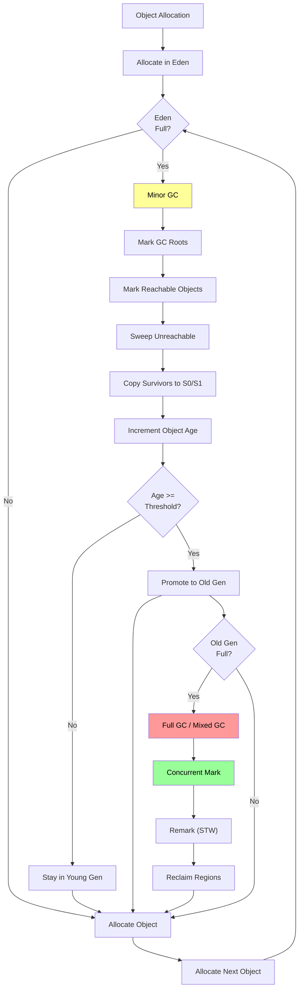

# 03 - Garbage Collection

## Introduction

Garbage Collection (GC) is the automatic memory management mechanism in the JVM. It identifies and reclaims memory occupied by objects that are no longer reachable by the application. Understanding GC is critical for writing high-performance Java applications, tuning latency and throughput, and diagnosing production memory issues. This topic covers GC algorithms (Serial, Parallel, CMS, G1, ZGC, Shenandoah), GC tuning, and practical monitoring techniques.

## Learning Objectives

By the end of this topic, you will be able to:

- Explain how garbage collection works in the JVM
- Compare and contrast major GC algorithms
- Tune GC parameters for latency or throughput requirements
- Diagnose GC-related performance issues
- Use GC logging and monitoring tools
- Apply GC best practices for production systems

## Prerequisites

- Understanding of JVM memory model (Topic 04)
- Familiarity with heap structure (young/old generation)
- Basic knowledge of threading and concurrency

## Why This Concept Exists

Manual memory management (C/C++) leads to:
1. **Memory Leaks**: Forgetting to free memory
2. **Dangling Pointers**: Accessing freed memory
3. **Double Free**: Freeing memory twice
4. **Fragmentation**: Inefficient memory use

Java's GC eliminates these problems by automatically reclaiming unreachable objects. The trade-off is occasional GC pauses that can affect application latency.

## Problem Statement

Consider a server handling 10,000 requests per second:

```java
public void handleRequest(Request req) {
    Response resp = new Response();  // Allocated on heap
    // ... process request ...
    return resp;  // Response sent, but 'resp' still on heap
}
```

Without GC, this would exhaust memory within seconds. With GC, the JVM automatically:
1. Identifies unreachable `Response` objects after they're sent
2. Reclaims their memory for new requests
3. Manages heap boundaries to prevent out-of-memory errors

The challenge is choosing the right GC algorithm and tuning it for the application's latency/throughput requirements.

## Theory

### Object Reachability

GC determines object liveness through reachability analysis:

```
GC Roots
├── Thread stack variables (local variables, method params)
├── Static fields of loaded classes
├── JNI global references
├── Monitors (synchronized blocks)
├── Objects used for class loading
└── Finalizer references

Unreachable objects → eligible for GC
```

### Generational Hypothesis

Most objects die young. The JVM divides the heap into generations:

```
Heap
├── Young Generation (1/3 of heap)
│   ├── Eden (80%) — new objects allocated here
│   ├── Survivor 0 (10%) — survived minor GC
│   └── Survivor 1 (10%) — copying space
└── Old Generation (2/3 of heap) — long-lived objects
```

**Minor GC**: Cleans young generation (fast, frequent)
**Major/Full GC**: Cleans entire heap (slow, infrequent)

### GC Algorithms

| Algorithm | Type | Pause | Throughput | Use Case |
|-----------|------|-------|------------|----------|
| Serial | Stop-the-world | Long | High (single CPU) | Small apps, embedded |
| Parallel | Stop-the-world | Medium | Highest | Throughput-focused |
| CMS | Mostly concurrent | Short | Medium | Low-latency (deprecated) |
| G1 | Mostly concurrent | Bounded | High | General purpose |
| ZGC | Concurrent | <1ms | High | Ultra-low latency |
| Shenandoah | Concurrent | <10ms | Medium | Low latency |

### G1 GC (Garbage-First)

G1 divides the heap into equal-sized regions:

```
G1 Heap Regions
├── Eden regions (green) — new allocations
├── Survivor regions (blue) — survived collections
├── Old regions (red) — long-lived objects
└── Humongous regions (purple) — objects > 50% region size
```

**Collection Strategy:**
1. First, collect regions with most garbage (garbage-first)
2. Evacuate live objects to survivor/old regions
3. Concurrent marking determines liveness
4. Mixed collections clean selected old regions

### ZGC

- Concurrent pause times < 1ms
- Handles TB-scale heaps
- Uses colored pointers and load barriers
- Compacts heap concurrently

### Shenandoah

- Concurrent compaction
- Uses Brooks pointers (forwarding pointers)
- Pauses only at safepoints
- Designed for low-latency workloads

## Internal Working

### Mark-and-Sweep Algorithm

**Phase 1: Mark**
- Start from GC roots
- Follow references, mark all reachable objects
- Uses a bitmap or stack for marking

**Phase 2: Sweep**
- Scan heap, free unmarked objects
- Update free lists

**Phase 3: Compact (optional)**
- Move live objects together
- Eliminate fragmentation
- Update all references

### G1 GC Collection Phases

```
1. Young GC
   - Stop-the-world
   - Copy live objects from Eden/Survivor to new Survivor/Old
   - Very fast (only young generation)

2. Concurrent Marking
   - Initial Mark (STW, very brief)
   - Concurrent Mark (parallel, uses SATB)
   - Remark (STW, final marking)
   - Cleanup (STW, reclaim empty regions)

3. Mixed GC
   - Select old regions with most garbage
   - Evacuate live objects
   - Can be concurrent or STW
```

### ZGC Mechanism

```
1. Concurrent Mark
   - Mark objects using colored pointers
   - Load barriers track references

2. Concurrent Compact
   - Relocate objects using forwarding pointers
   - Remap references lazily

3. Concurrent Reference Processing
   - Process soft/weak/phantom references concurrently

Pause: Only at safepoints (typically <1ms)
```

### GC Root Processing

```
GC Root Scanning
├── Thread stacks (most expensive)
│   └── For each thread: scan all frames
├── Global JNI references
├── Static fields of loaded classes
├── Monitor used objects
└── Class loading data
```

## JVM Perspective

### Object Header and GC

```
Mark Word (64-bit)
├── Normal: hash | age | lock | 01
├── Locked: ptr_to_lock_record | 00
├── Heavyweight: ptr_to_monitor | 10
└── GC: forwarding pointer | 00

GC Age: 4 bits → max 15 (tenuring threshold)
```

### Write Barriers

Write barriers intercept pointer writes to:
1. Track cross-region references (G1)
2. Maintain remembered sets
3. Support concurrent marking (SATB)
4. Enable concurrent compaction (ZGC/Shenandoah)

### Safepoints

Points where all threads are in a consistent state:
- Method entry/exit
- Backedge (loop back)
- Field access
- Thread state transitions

At safepoint: GC can safely inspect thread stacks and heap.

## Memory Representation

### Object Promotion Path

```
New Object → Eden
    ↓ (Minor GC, survives)
Survivor 0 → Survivor 1 → Survivor 0 (age++)
    ↓ (age >= threshold or survivor full)
Old Generation
    ↓ (Full GC or Mixed GC)
Freed or Moved
```

### Heap Size Relationships

```
Default (G1):
- Young Gen = 5% of heap (min) to 60% (max)
- Eden:Survivor ratio = 8:1
- Survivor ratio = 10%

Default (Parallel):
- Young Gen = 1/3 of heap
- Eden = 8/10 of Young Gen
- Survivor = 1/10 each
```

### GC Pause Impact

```
Minor GC (50ms pause):
- 10,000 requests affected
- Each request delayed by 50ms
- Throughput loss: ~50ms / interval

Major GC (500ms pause):
- All threads stopped
- Application appears frozen
- User-visible latency spike
```

## Architecture Diagram (Mermaid)

```mermaid
graph TB
    subgraph "Heap Structure"
        YG["Young Generation"]
        OG["Old Generation"]
        
        subgraph "Young Gen"
            EDEN["Eden<br/>(80%)"]
            S0["Survivor 0<br/>(10%)"]
            S1["Survivor 1<br/>(10%)"]
        end
    end

    subgraph "GC Algorithms"
        SERIAL["Serial<br/>GC"]
        PARALLEL["Parallel<br/>GC"]
        G1["G1<br/>GC"]
        ZGC["ZGC"]
        SHEN["Shenandoah"]
    end

    subgraph "GC Roots"
        STACK["Thread Stacks"]
        STATIC["Static Fields"]
        JNI["JNI References"]
        MONITOR["Monitors"]
    end

    subgraph "Collection Process"
        MARK["Mark Phase"]
        SWEEP["Sweep Phase"]
        COMPACT["Compact Phase"]
    end

    EDEN -->|"Minor GC"| S0
    S0 -->|"Minor GC"| S1
    S1 -->|"Promotion"| OG
    OG -->|"Full GC"| MARK
    
    GC Roots --> MARK
    MARK --> SWEEP
    SWEEP --> COMPACT

    style G1 fill:#09f,color:#fff
    style ZGC fill:#0f0,color:#000
    style SHEN fill:#f0f,color:#fff
```

## Flow Diagram (Mermaid)



## Syntax

### GC Algorithm Selection

```bash
# Serial GC (single-threaded, small heaps)
java -XX:+UseSerialGC MyApp

# Parallel GC (throughput-focused, default in Java 8)
java -XX:+UseParallelGC MyApp

# G1 GC (default since Java 9)
java -XX:+UseG1GC MyApp

# ZGC (ultra-low latency, Java 11+)
java -XX:+UseZGC MyApp

# Shenandoah (low latency, OpenJDK only)
java -XX:+UseShenandoahGC MyApp
```

### GC Tuning Flags

```bash
# Heap size
java -Xms4g -Xmx4g MyApp  # Fixed heap (avoid resizing)

# G1 specific
java -XX:+UseG1GC \
     -XX:MaxGCPauseMillis=200 \
     -XX:G1HeapRegionSize=16m \
     -XX:InitiatingHeapOccupancyPercent=45 \
     MyApp

# ZGC specific
java -XX:+UseZGC \
     -XX:SoftMaxHeapSize=4g \
     -XX:ConcGCThreads=4 \
     MyApp

# GC logging
java -Xlog:gc*:file=gc.log:time,uptime:filecount=5:filesize=10m MyApp
```

### Programmatic GC Control

```java
// Suggest GC (no guarantee)
System.gc();

// Request finalization
Runtime.getRuntime().runFinalization();

// Memory usage
Runtime.getRuntime().totalMemory();
Runtime.getRuntime().freeMemory();
Runtime.getRuntime().maxMemory();
```

## Easy Example

```java
package academy.javaengineering.jvm;

import java.lang.management.*;

/**
 * Basic garbage collection demonstration.
 * Shows object allocation, GC behavior, and memory monitoring.
 */
public class GarbageCollectionDemo {

    public static void main(String[] args) {
        System.out.println("=== Garbage Collection Demo ===\n");

        // 1. Basic GC info
        printGCInfo();

        // 2. Object allocation and collection
        demonstrateBasicGC();

        // 3. Reference types
        demonstrateReferenceTypes();

        // 4. GC triggering
        demonstrateGCTriggering();
    }

    static void printGCInfo() {
        System.out.println("--- GC Algorithms Available ---");

        for (GarbageCollectorMXBean gcBean : ManagementFactory.getGarbageCollectorMXBeans()) {
            System.out.println("  " + gcBean.getName());
            System.out.println("    Collections: " + gcBean.getCollectionCount());
            System.out.println("    Time: " + gcBean.getCollectionTime() + "ms");
            System.out.println("    Pools: " + java.util.Arrays.toString(gcBean.getMemoryPoolNames()));
        }
        System.out.println();
    }

    static void demonstrateBasicGC() {
        System.out.println("--- Basic GC Behavior ---");

        Runtime rt = Runtime.getRuntime();
        System.out.println("Before allocation:");
        printMemory(rt);

        // Allocate many objects
        int count = 1_000_000;
        Object[] objects = new Object[count];
        for (int i = 0; i < count; i++) {
            objects[i] = new Object();
        }

        System.out.println("After allocation (" + count + " objects):");
        printMemory(rt);

        // Dereference objects
        for (int i = 0; i < count; i++) {
            objects[i] = null;
        }

        System.out.println("After dereferencing:");
        printMemory(rt);

        // Suggest GC
        System.gc();
        System.out.println("After System.gc():");
        printMemory(rt);
        System.out.println();
    }

    static void demonstrateReferenceTypes() {
        System.out.println("--- Reference Types ---");

        // Strong reference
        Object strong = new Object();
        System.out.println("Strong reference: always reachable");

        // Soft reference (GC before OOM)
        java.lang.ref.SoftReference<Object> soft = new java.lang.ref.SoftReference<>(new Object());
        System.out.println("Soft reference: GC before OutOfMemoryError");

        // Weak reference (GC when no strong refs)
        java.lang.ref.WeakReference<Object> weak = new java.lang.ref.WeakReference<>(new Object());
        System.out.println("Weak reference: GC anytime");

        // Phantom reference (after finalization)
        java.lang.ref.PhantomReference<Object> phantom = new java.lang.ref.PhantomReference<>(new Object(), null);
        System.out.println("Phantom reference: after finalize(), before reclaim");
        System.out.println();
    }

    static void demonstrateGCTriggering() {
        System.out.println("--- When GC Triggers ---");

        System.out.println("1. Eden space is full → Minor GC");
        System.out.println("2. Old generation is full → Major/Full GC");
        System.out.println("3. Metaspace is full → Full GC (may fail)");
        System.out.println("4. System.gc() → Suggests GC (not guaranteed)");
        System.out.println("5. Allocation failure → Forced GC");
        System.out.println();
    }

    private static void printMemory(Runtime rt) {
        long used = rt.totalMemory() - rt.freeMemory();
        long max = rt.maxMemory();
        System.out.printf("  Used: %.1f MB / Max: %.1f MB (%.1f%%)%n",
            used / (1024.0 * 1024), max / (1024.0 * 1024),
            (double) used / max * 100);
    }
}
```

## Medium Example

```java
package academy.javaengineering.jvm;

import java.lang.ref.*;
import java.lang.management.*;
import java.util.*;
import java.util.concurrent.*;

/**
 * Advanced GC demonstration: reference processing, tenuring,
 * and GC tuning monitoring.
 */
public class GarbageCollectionMediumExample {

    private static final ReferenceQueue<Object> refQueue = new ReferenceQueue<>();

    public static void main(String[] args) throws Exception {
        System.out.println("=== Advanced GC Demo ===\n");

        // 1. Tenuring threshold
        demonstrateTenuring();

        // 2. Weak/Soft/Phantom references
        demonstrateAdvancedReferences();

        // 3. GC tuning metrics
        demonstrateGCMetrics();

        // 4. Memory pressure
        demonstrateMemoryPressure();
    }

    static void demonstrateTenuring() {
        System.out.println("--- Object Tenuring ---");

        List<byte[]> survivors = new ArrayList<>();

        // Create objects that survive multiple GC cycles
        for (int i = 0; i < 10; i++) {
            survivors.add(new byte[1024]);  // 1KB each
            System.gc();
        }

        System.out.println("Objects surviving multiple GC cycles get promoted");
        System.out.println("Survivor count: " + survivors.size());
        System.out.println();
    }

    static void demonstrateAdvancedReferences() {
        System.out.println("--- Advanced Reference Processing ---");

        // WeakHashMap demo
        WeakHashMap<String, byte[]> weakMap = new WeakHashMap<>();
        String key = new String("temporary");
        weakMap.put(key, new byte[1024]);
        System.out.println("WeakHashMap before GC: " + weakMap.size());

        key = null;  // Remove strong reference
        System.gc();
        Thread.sleep(100);
        System.out.println("WeakHashMap after GC: " + weakMap.size());
        System.out.println();

        // Phantom reference demo
        Object obj = new Object();
        PhantomReference<Object> phantomRef = new PhantomReference<>(obj, refQueue);
        System.out.println("Phantom reachable: " + phantomRef.isEnqueued());

        obj = null;
        System.gc();
        Thread.sleep(100);
        System.out.println("After GC, phantom enqueued: " + phantomRef.isEnqueued());
        System.out.println();
    }

    static void demonstrateGCMetrics() {
        System.out.println("--- GC Metrics ---");

        MemoryMXBean memBean = ManagementFactory.getMemoryMXBean();
        MemoryUsage heap = memBean.getHeapMemoryUsage();

        System.out.println("Heap Configuration:");
        System.out.println("  Init: " + formatMB(heap.getInit()));
        System.out.println("  Max: " + formatMB(heap.getMax()));
        System.out.println("  Used: " + formatMB(heap.getUsed()));
        System.out.println("  Committed: " + formatMB(heap.getCommitted()));

        // Memory pool breakdown
        System.out.println("\nMemory Pools:");
        for (MemoryPoolMXBean pool : ManagementFactory.getMemoryPoolMXBeans()) {
            MemoryUsage usage = pool.getUsage();
            System.out.printf("  %-30s %s (max: %s)%n",
                pool.getName(), formatMB(usage.getUsed()),
                pool.isUsageThresholdSupported() ?
                    formatMB(pool.getUsageThreshold()) : "N/A");
        }
        System.out.println();
    }

    static void demonstrateMemoryPressure() {
        System.out.println("--- Memory Pressure Simulation ---");

        List<byte[]> memoryHog = new ArrayList<>();
        Runtime rt = Runtime.getRuntime();

        try {
            for (int i = 0; i < 1000; i++) {
                memoryHog.add(new byte[100_000]);  // 100KB each
                if (i % 100 == 0) {
                    System.out.printf("  Iteration %d: Used = %.1f MB%n",
                        i, (rt.totalMemory() - rt.freeMemory()) / (1024.0 * 1024));
                }
            }
        } catch (OutOfMemoryError e) {
            System.out.println("Caught OOM: " + e.getMessage());
            memoryHog.clear();
        }

        System.out.println();
    }

    private static String formatMB(long bytes) {
        return String.format("%.1f MB", bytes / (1024.0 * 1024));
    }
}
```

## Hard Example

```java
package academy.javaengineering.jvm;

import java.lang.management.*;
import java.lang.ref.*;
import java.util.*;
import java.util.concurrent.*;
import java.util.concurrent.atomic.*;

/**
 * Advanced GC patterns: custom reference processing, GC tuning strategies,
 * and production-grade monitoring.
 */
public class GarbageCollectionHardExample {

    private static final AtomicInteger gcCount = new AtomicInteger(0);
    private static final AtomicLong totalGcPause = new AtomicLong(0);

    public static void main(String[] args) throws Exception {
        System.out.println("=== Advanced GC Patterns ===\n");

        // 1. GC tuning for latency
        demonstrateLatencyTuning();

        // 2. GC tuning for throughput
        demonstrateThroughputTuning();

        // 3. Custom reference processing
        demonstrateCustomReferences();

        // 4. GC monitoring dashboard
        demonstrateMonitoringDashboard();

        // 5. Memory-efficient patterns
        demonstrateMemoryEfficientPatterns();
    }

    static void demonstrateLatencyTuning() {
        System.out.println("--- Latency Tuning (G1/ZGC) ---");

        System.out.println("For < 200ms pause times:");
        System.out.println("  -XX:+UseG1GC");
        System.out.println("  -XX:MaxGCPauseMillis=200");
        System.out.println("  -XX:G1HeapRegionSize=16m");
        System.out.println("  -XX:InitiatingHeapOccupancyPercent=45");
        System.out.println();

        System.out.println("For < 10ms pause times:");
        System.out.println("  -XX:+UseZGC");
        System.out.println("  -XX:ConcGCThreads=4");
        System.out.println("  -XX:SoftMaxHeapSize=4g");
        System.out.println();
    }

    static void demonstrateThroughputTuning() {
        System.out.println("--- Throughput Tuning (Parallel) ---");

        System.out.println("For maximum throughput:");
        System.out.println("  -XX:+UseParallelGC");
        System.out.println("  -XX:ParallelGCThreads=8");
        System.out.println("  -XX:MaxGCPauseMillis=500");
        System.out.println("  -XX:GCTimeRatio=99  (target 99% throughput)");
        System.out.println();
    }

    static void demonstrateCustomReferences() {
        System.out.println("--- Custom Reference Processing ---");

        // Cache with automatic eviction
        Cache<String, byte[]> cache = new Cache<>(100);

        cache.put("key1", new byte[1024]);
        cache.put("key2", new byte[2048]);
        System.out.println("Cache size: " + cache.size());

        // Simulate GC
        System.gc();
        Thread.sleep(200);
        System.out.println("Cache size after GC: " + cache.size());
        System.out.println();
    }

    static void demonstrateMonitoringDashboard() {
        System.out.println("--- GC Monitoring Dashboard ---");

        // Collect GC stats
        List<GarbageCollectorMXBean> gcBeans = ManagementFactory.getGarbageCollectorMXBeans();

        long totalCollections = 0;
        long totalTime = 0;
        for (GarbageCollectorMXBean gc : gcBeans) {
            totalCollections += gc.getCollectionCount();
            totalTime += gc.getCollectionTime();
            System.out.printf("  %s: %d collections, %dms avg%n",
                gc.getName(), gc.getCollectionCount(),
                gc.getCollectionCount() > 0 ? gc.getCollectionTime() / gc.getCollectionCount() : 0);
        }

        System.out.printf("  Total: %d collections, %dms total, %.1fms avg%n",
            totalCollections, totalTime,
            totalCollections > 0 ? (double) totalTime / totalCollections : 0);
        System.out.println();
    }

    static void demonstrateMemoryEfficientPatterns() {
        System.out.println("--- Memory-Efficient Patterns ---");

        System.out.println("1. Object pooling for expensive objects");
        System.out.println("2. Use primitive collections (Eclipse Collections, Trove)");
        System.out.println("3. Compact strings (Java 9+): byte[] instead of char[]");
        System.out.println("4. Array deduplication with Integer cache");
        System.out.println("5. Use -XX:+UseStringDeduplication with G1");
        System.out.println();
    }

    // Weak reference cache
    static class Cache<K, V> {
        private final Map<K, WeakReference<V>> cache = new ConcurrentHashMap<>();
        private final ReferenceQueue<V> refQueue = new ReferenceQueue<>();
        private final int maxSize;

        Cache(int maxSize) {
            this.maxSize = maxSize;
            // Start cleanup thread
            new Thread(() -> {
                try {
                    while (true) {
                        Reference<? extends V> ref = refQueue.remove();
                        // Remove stale entry
                        cache.values().remove(ref);
                    }
                } catch (InterruptedException e) {
                    Thread.currentThread().interrupt();
                }
            }, "cache-cleanup").start();
        }

        void put(K key, V value) {
            cache.put(key, new WeakReference<>(value, refQueue));
        }

        V get(K key) {
            WeakReference<V> ref = cache.get(key);
            return ref != null ? ref.get() : null;
        }

        int size() {
            return cache.size();
        }
    }

    private static String formatBytes(long bytes) {
        if (bytes < 1024) return bytes + " B";
        if (bytes < 1024 * 1024) return String.format("%.1f KB", bytes / 1024.0);
        return String.format("%.1f MB", bytes / (1024.0 * 1024));
    }
}
```

## Enterprise Example

```java
package academy.javaengineering.jvm;

import java.lang.management.*;
import java.util.*;
import java.util.concurrent.*;
import java.util.concurrent.atomic.*;

/**
 * Production GC monitoring and tuning: real-time metrics, alerting,
 * and adaptive tuning strategies.
 */
public class GarbageCollectionEnterpriseExample {

    private static final AtomicLong totalAllocated = new AtomicLong(0);
    private static final AtomicLong allocationCount = new AtomicLong(0);

    public static void main(String[] args) throws Exception {
        System.out.println("=== Production GC Monitoring ===\n");

        // 1. GC Event Listener
        setupGCListener();

        // 2. Memory Pressure Simulator
        simulateMemoryPressure();

        // 3. GC Tuning Recommendations
        printTuningRecommendations();

        // 4. Production Checklist
        printProductionChecklist();
    }

    static void setupGCListener() {
        System.out.println("--- GC Notification Listener ---");

        for (GarbageCollectorMXBean gcBean : ManagementFactory.getGarbageCollectorMXBeans()) {
            if (gcBean instanceof NotificationEmitter) {
                ((NotificationEmitter) gcBean).addNotificationListener(
                    (notification, handback) -> {
                        if (notification.getType().equals(GarbageCollectionNotificationInfo.GARBAGE_COLLECTION_NOTIFICATION)) {
                            GarbageCollectionNotificationInfo info =
                                GarbageCollectionNotificationInfo.from((CompositeData) notification.getUserData());
                            GcInfo gcInfo = info.getGcInfo();

                            System.out.printf("GC Event: %s | Duration: %dms | Action: %s%n",
                                info.getGcName(), gcInfo.getDuration(),
                                info.getGcAction());
                        }
                    },
                    null, null
                );
            }
        }
        System.out.println();
    }

    static void simulateMemoryPressure() {
        System.out.println("--- Memory Pressure Simulation ---");

        List<byte[]> allocations = new ArrayList<>();
        Runtime rt = Runtime.getRuntime();

        for (int i = 0; i < 50; i++) {
            allocations.add(new byte[1_000_000]);  // 1MB each
            totalAllocated.addAndGet(1_000_000);
            allocationCount.incrementAndGet();

            if (i % 10 == 0) {
                long used = rt.totalMemory() - rt.freeMemory();
                System.out.printf("  Allocated %d MB, Used: %.1f MB%n",
                    totalAllocated.get() / (1024 * 1024),
                    used / (1024.0 * 1024));
            }
        }

        allocations.clear();
        System.out.println("Cleared allocations, GC will reclaim memory");
        System.out.println();
    }

    static void printTuningRecommendations() {
        System.out.println("--- GC Tuning Recommendations ---");

        MemoryMXBean memBean = ManagementFactory.getMemoryMXBean();
        MemoryUsage heap = memBean.getHeapMemoryUsage();
        long maxHeapMB = heap.getMax() / (1024 * 1024);

        System.out.println("Current max heap: " + maxHeapMB + " MB");
        System.out.println();

        if (maxHeapMB < 2048) {
            System.out.println("Recommendation: Consider increasing heap (-Xmx)");
        }

        System.out.println("For latency-sensitive apps:");
        System.out.println("  -XX:+UseG1GC -XX:MaxGCPauseMillis=200");
        System.out.println();

        System.out.println("For throughput-focused apps:");
        System.out.println("  -XX:+UseParallelGC -XX:GCTimeRatio=99");
        System.out.println();
    }

    static void printProductionChecklist() {
        System.out.println("--- Production GC Checklist ---");
        System.out.println("  [ ] Set explicit heap size (-Xms = -Xmx)");
        System.out.println("  [ ] Choose appropriate GC algorithm");
        System.out.println("  [ ] Enable GC logging");
        System.out.println("  [ ] Set up GC monitoring/alerting");
        System.out.println("  [ ] Configure heap dump on OOM");
        System.out.println("  [ ] Set Metaspace limit");
        System.out.println("  [ ] Tune thread stack size if needed");
        System.out.println("  [ ] Monitor native memory usage");
        System.out.println();
    }
}
```

## Performance Considerations

1. **GC Pause Impact**: Every GC pause stops application threads. For latency-sensitive apps, minimize pause times.
2. **Throughput vs Latency**: Parallel GC maximizes throughput; G1/ZGC minimize latency. Choose based on requirements.
3. **Heap Size**: Larger heaps reduce GC frequency but increase pause times. Balance based on workload.
4. **Object Promotion**: Premature promotion to old gen causes expensive full GCs. Tune tenuring threshold.
5. **Humongous Objects**: In G1, objects > 50% region size go directly to old gen. Use larger regions or avoid large allocations.
6. **Concurrent Phases**: G1/ZGC concurrent marking uses CPU. Monitor `InitiatingHeapOccupancyPercent`.
7. **GC Overhead**: Even concurrent GC has overhead. Measure before and after tuning.

## Time & Space Complexity

| GC Operation | Time | Space |
|-------------|------|-------|
| Minor GC (Serial) | O(live young) | O(survivors) |
| Minor GC (G1) | O(live young) | O(survivors) |
| Concurrent Mark | O(heap) | O(mark stack + bitmap) |
| Full GC (Serial) | O(heap) | O(live objects) |
| Full GC (Parallel) | O(heap / threads) | O(live objects) |
| ZGC Concurrent | O(heap) concurrent | O(mark stack) |

## Thread Safety

- **GC is thread-safe by design**: JVM coordinates all threads during safepoints
- **Write barriers**: Enable concurrent GC by intercepting pointer writes
- **Safepoint protocol**: Threads check for GC requests at safe points
- **Concurrent phases**: Run alongside application threads with minimal interference
- **Thread-local allocation**: TLABs avoid allocation contention

## Best Practices

1. **Set Explicit Heap**: `-Xms = -Xmx` avoids resize pauses
2. **Monitor GC Logs**: Always enable GC logging in production
3. **Choose Right Algorithm**: G1 for general, ZGC for ultra-low latency
4. **Tune for Your Workload**: Measure, don't guess
5. **Avoid Full GC**: Tune young gen to prevent premature promotion
6. **Use GC Notifications**: Listen for GC events for monitoring
7. **Profile Before Tuning**: Understand your allocation patterns first
8. **Test Under Load**: GC behavior changes under production load

## Common Mistakes

1. **Using Deprecated Flags**: `-XX:+UseConcMarkSweepGC` removed in Java 14+
2. **Ignoring GC Logs**: Not enabling logging misses critical info
3. **Over-Tuning**: Adjusting flags without understanding the workload
4. **Not Setting Heap Bounds**: Default heap causes unpredictable behavior
5. **Assuming GC Is Free**: Every GC cycle has CPU and latency cost
6. **Ignoring Allocation Rate**: High allocation rate causes frequent GC

## Pitfalls

- **Full GC During Request**: A full GC during a user request causes timeout
- **GC Thrashing**: Heap too small causes continuous GC cycles
- **Memory Leak Masquerading as GC Issue**: Real problem is unreachable objects accumulating
- **Concurrent Mode Failure (CMS)**: Deprecated CMS could fail to keep up with allocation
- **Humongous Allocation**: Large objects bypass young gen, cause fragmentation

## Debugging Tips

```bash
# GC logging (Java 11+)
java -Xlog:gc*:file=gc.log:time,uptime:filecount=5:filesize=10m MyApp

# GC stats
jstat -gcutil <pid> 1000 10

# Heap dump
jmap -dump:live,format=b,file=heap.hprof <pid>

# GC root info
jcmd <pid> GC.roots

# Memory pool stats
jcmd <pid> VM.native_memory summary

# Verbose GC
java -verbose:gc -XX:+PrintGCDetails MyApp
```

## Comparison Table

| Feature | Serial | Parallel | CMS | G1 | ZGC | Shenandoah |
|---------|--------|----------|-----|-----|-----|------------|
| Type | Stop-the-world | Stop-the-world | Mostly concurrent | Mostly concurrent | Concurrent | Concurrent |
| Pause | Long | Medium | Short | Bounded | <1ms | <10ms |
| Throughput | High (single CPU) | Highest | Medium | High | High | Medium |
| Heap Size | Small | Large | Medium-Large | Medium-Large | TB-scale | Large |
| Java Version | All | All | 8 (removed 14) | 9+ (default) | 11+ | 12+ |
| Best For | Embedded | Batch | Legacy | General | Ultra-low latency | Low latency |

## Decision Tree

```
Choose GC Algorithm
│
├─ Latency requirement?
│  ├─ < 10ms → ZGC or Shenandoah
│  ├─ < 200ms → G1
│  └─ No specific requirement
│
├─ Throughput requirement?
│  ├─ Maximum throughput → Parallel
│  └─ Balanced → G1
│
├─ Heap size?
│  ├─ < 4GB → G1 or Serial
│  ├─ 4GB - 64GB → G1
│  ├─ > 64GB → ZGC
│  └─ < 256MB → Serial
│
├─ Application type?
│  ├─ Web server → G1
│  ├─ Batch processing → Parallel
│  ├─ Trading/real-time → ZGC
│  └─ Microservice → G1 or ZGC
│
└─ Default → G1 (Java 9+)
```

## Interview Questions (15+)

**Q1: What is the generational hypothesis?**
A: Most objects die young. The JVM divides the heap into young and old generations. Young objects are collected frequently (minor GC); long-lived objects are promoted to old gen and collected less often (major GC).

**Q2: What is the difference between Minor GC, Major GC, and Full GC?**
A: Minor GC collects the young generation. Major GC collects the old generation (often concurrent with G1). Full GC collects the entire heap including Metaspace. Full GC is the most expensive.

**Q3: How does G1 GC work?**
A: G1 divides the heap into equal-sized regions. It prioritizes collecting regions with the most garbage (garbage-first). It uses concurrent marking to determine liveness and evacuates live objects to compact the heap.

**Q4: What is a safepoint?**
A: A safepoint is a point where all threads are in a consistent state and can be safely stopped for GC. Threads check for safepoint requests at method entry, backedge, and field access.

**Q5: What is the difference between System.gc() and actual GC?**
A: `System.gc()` is a suggestion to the JVM, not a guarantee. The JVM may ignore it or perform a different GC. It should not be used in production code.

**Q6: What is a GC root?**
A: GC roots are starting points for reachability analysis. They include thread stack variables, static fields, JNI references, monitors, and objects used for class loading.

**Q7: What is write barrier and why is it needed?**
A: A write barrier is code executed on every pointer write. It enables concurrent GC by tracking cross-region references, maintaining remembered sets, and supporting concurrent marking (SATB).

**Q8: How does ZGC achieve <1ms pause times?**
A: ZGC uses colored pointers and load barriers to perform most work concurrently. It compacts the heap concurrently using forwarding pointers. Only safepoint operations (very brief) stop application threads.

**Q9: What is object promotion?**
A: When objects survive enough minor GC cycles (exceeding tenuring threshold), they are copied from the young generation to the old generation. Premature promotion causes expensive full GCs.

**Q10: What is a humongous object in G1?**
A: An object larger than 50% of the G1 region size. These are allocated directly in special humongous regions in the old generation, bypassing the young generation. They can cause fragmentation.

**Q11: What is the difference between Concurrent and Parallel GC?**
A: Concurrent GC runs alongside application threads (low pause). Parallel GC uses multiple threads but stops all application threads (higher throughput, longer pauses). Most modern GCs are both.

**Q12: How do you tune GC for a latency-sensitive application?**
A: Use G1 or ZGC, set `-XX:MaxGCPauseMillis`, tune IHOP for G1, ensure sufficient heap, avoid humongous objects, and monitor GC logs. For <10ms, use ZGC or Shenandoah.

**Q13: What is reference processing in GC?**
A: GC processes soft, weak, phantom, and finalizer references. Soft references are cleared before OOM. Weak references are cleared anytime. Phantom references are enqueued after finalization.

**Q14: What is a memory leak in Java?**
A: An object that is no longer needed but remains reachable (and thus not GC'd). Common causes: ThreadLocal, JDBC driver registration, static collections, JNDI bindings, and classloader leaks.

**Q15: How do you diagnose GC issues in production?**
A: Enable GC logging, use `jstat` for live stats, take heap dumps for analysis, monitor GC notifications, and set up alerts for GC pause times and frequency.

## Exercises

### Level 1 (Beginner)

1. Write a program that allocates objects and monitors GC behavior using `ManagementFactory`
2. Create a program that demonstrates the difference between strong, soft, and weak references
3. Use `jstat -gcutil` to monitor GC activity while running a simple program

### Level 2 (Intermediate)

4. Write a program that triggers different GC types by allocating objects of varying sizes
5. Create a memory-efficient cache using WeakHashMap with automatic eviction
6. Analyze GC logs from a real application and identify performance bottlenecks

### Level 3 (Advanced)

7. Implement a custom reference processor with a ReferenceQueue
8. Write a GC tuning guide for a specific workload (web server, batch job, etc.)
9. Build a GC monitoring dashboard that tracks pause times and allocation rates

## Summary

Garbage Collection is the automatic memory management mechanism in the JVM:

- **Generational Design**: Young generation for short-lived objects, old generation for long-lived
- **Multiple Algorithms**: Serial, Parallel, G1, ZGC, Shenandoah for different use cases
- **Concurrent Collection**: Modern GCs minimize pause times through concurrent phases
- **Tuning Required**: GC parameters must be tuned for specific workloads
- **Monitoring Essential**: GC logs and notifications enable proactive issue detection

Understanding GC is critical for building high-performance, low-latency Java applications.

## References

- [Oracle GC Tuning Guide](https://docs.oracle.com/en/java/javase/21/gctuning/)
- [ZGC Documentation](https://docs.oracle.com/en/java/javase/21/gctuning/z-garbage-collector.html)
- [G1 GC Documentation](https://docs.oracle.com/en/java/javase/21/gctuning/garbage-first-g1-garbage-collector.html)
- [Shenandoah GC](https://wiki.openjdk.org/display/shenandoah/)
- [Java Performance by Scott Oaks](https://www.oreilly.com/library/view/java-performance/9781492056027/)
- [GC Algorithms: Basics](https://www.baeldung.com/jvm-garbage-collectors)
