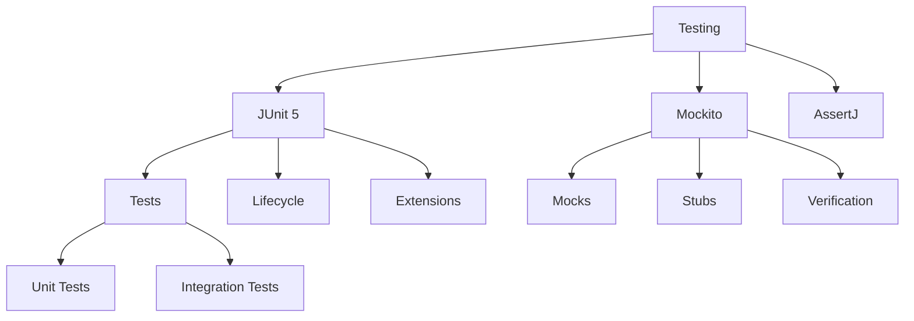

# Module 11: Testing

## Overview
Software testing ensures code quality through unit tests, integration tests, and end-to-end tests. JUnit 5 and Mockito are the primary testing frameworks in Java.

## Learning Objectives
- Write unit tests with JUnit 5
- Mock dependencies with Mockito
- Test exceptions and edge cases
- Achieve good test coverage
- Apply testing best practices

## Prerequisites
- Java fundamentals
- OOP concepts
- Exception handling

## Why This Concept Exists
Without testing:
- Bugs reach production
- Refactoring is risky
- Code quality degrades
- Regression issues

Testing provides:
- Bug detection
- Safe refactoring
- Documentation
- Confidence

## Problem Statement
How do you verify code correctness and prevent regressions?

## Theory

### Test Types

| Type | Purpose | Scope |
|------|---------|-------|
| Unit | Test individual methods | Single class |
| Integration | Test component interaction | Multiple classes |
| E2E | Test complete system | Full application |
| Performance | Test speed/scalability | System-wide |

### Testing Pyramid

```
        /  E2E  \
       / Integration \
      /     Unit      \
     /__________________\
```

### JUnit 5 Features

| Feature | Description |
|---------|-------------|
| @Test | Mark test method |
| @BeforeEach | Run before each test |
| @AfterEach | Run after each test |
| @BeforeAll | Run once before all |
| @AfterAll | Run once after all |
| @DisplayName | Test description |
| @Parameterized | Parameterized tests |
| @Nested | Nested test classes |

## Internal Working

### Test Execution
1. Discover test methods
2. Create test instance
3. Execute lifecycle callbacks
4. Run test method
5. Report results

### Mockito Mocking
```
Interface → Proxy → Mock → Stubbed Responses
```

## JVM Perspective

### Test Loading
- Separate classpath
- Test dependencies
- Framework initialization
- Result reporting

### Memory
- Each test gets fresh instance
- State doesn't persist
- Garbage collection between tests

## Architecture Diagram



## Syntax

### Basic Test
```java
import org.junit.jupiter.api.*;
import static org.junit.jupiter.api.Assertions.*;

class CalculatorTest {
    
    private Calculator calculator;
    
    @BeforeEach
    void setUp() {
        calculator = new Calculator();
    }
    
    @Test
    @DisplayName("Should add two numbers")
    void shouldAdd() {
        assertEquals(5, calculator.add(2, 3));
    }
    
    @Test
    void shouldDivide() {
        assertEquals(2, calculator.divide(10, 5));
    }
    
    @Test
    void shouldThrowException() {
        assertThrows(ArithmeticException.class, 
            () -> calculator.divide(10, 0));
    }
}
```

### Mockito Example
```java
import org.junit.jupiter.api.*;
import org.mockito.*;
import static org.mockito.Mockito.*;
import static org.junit.jupiter.api.Assertions.*;

class UserServiceTest {
    
    @Mock
    private UserRepository userRepository;
    
    @InjectMocks
    private UserService userService;
    
    @BeforeEach
    void setUp() {
        MockitoAnnotations.openMocks(this);
    }
    
    @Test
    void shouldFindUser() {
        when(userRepository.findById(1L))
            .thenReturn(Optional.of(new User(1L, "John")));
        
        User user = userService.findById(1L);
        
        assertEquals("John", user.getName());
        verify(userRepository).findById(1L);
    }
    
    @Test
    void shouldThrowWhenNotFound() {
        when(userRepository.findById(1L))
            .thenReturn(Optional.empty());
        
        assertThrows(UserNotFoundException.class,
            () -> userService.findById(1L));
    }
}
```

## Easy Example
```java
import org.junit.jupiter.api.*;
import static org.junit.jupiter.api.Assertions.*;

class StringHelperTest {
    
    @Test
    void shouldReverseString() {
        assertEquals("dcba", StringHelper.reverse("abcd"));
    }
    
    @Test
    void shouldCheckPalindrome() {
        assertTrue(StringHelper.isPalindrome("racecar"));
        assertFalse(StringHelper.isPalindrome("hello"));
    }
    
    @Test
    void shouldHandleEmptyString() {
        assertEquals("", StringHelper.reverse(""));
    }
}
```

## Medium Example
```java
import org.junit.jupiter.api.*;
import org.junit.jupiter.params.ParameterizedTest;
import org.junit.jupiter.params.provider.CsvSource;
import static org.junit.jupiter.api.Assertions.*;

class MathUtilsTest {
    
    @ParameterizedTest
    @CsvSource({
        "1, 1",
        "2, 4",
        "3, 9",
        "4, 16"
    })
    void shouldCalculateSquare(int input, int expected) {
        assertEquals(expected, MathUtils.square(input));
    }
    
    @Test
    void shouldCheckPrime() {
        assertTrue(MathUtils.isPrime(7));
        assertFalse(MathUtils.isPrime(4));
    }
    
    @Nested
    class FactorialTests {
        @Test
        void shouldCalculateFactorial() {
            assertEquals(120, MathUtils.factorial(5));
        }
        
        @Test
        void shouldReturnOneForZero() {
            assertEquals(1, MathUtils.factorial(0));
        }
    }
}
```

## Hard Example
```java
import org.junit.jupiter.api.*;
import org.mockito.*;
import java.util.concurrent.*;
import static org.mockito.Mockito.*;
import static org.junit.jupiter.api.Assertions.*;

class OrderServiceTest {
    
    @Mock
    private OrderRepository orderRepository;
    
    @Mock
    private PaymentService paymentService;
    
    @Mock
    private NotificationService notificationService;
    
    @InjectMocks
    private OrderService orderService;
    
    @Captor
    private ArgumentCaptor<Order> orderCaptor;
    
    @Test
    void shouldProcessOrder() throws Exception {
        // Arrange
        OrderRequest request = new OrderRequest("product", 2);
        when(paymentService.charge(anyDouble())).thenReturn(true);
        
        // Act
        Order order = orderService.processOrder(request);
        
        // Assert
        verify(orderRepository).save(orderCaptor.capture());
        Order savedOrder = orderCaptor.getValue();
        assertEquals("COMPLETED", savedOrder.getStatus());
        
        verify(notificationService).sendOrderConfirmation(savedOrder);
    }
    
    @Test
    void shouldFailWhenPaymentFails() {
        when(paymentService.charge(anyDouble())).thenReturn(false);
        
        assertThrows(PaymentException.class,
            () -> orderService.processOrder(new OrderRequest("product", 1)));
        
        verify(orderRepository, never()).save(any());
    }
}
```

## Enterprise Example
```java
import org.junit.jupiter.api.*;
import org.springframework.boot.test.context.SpringBootTest;
import org.springframework.test.context.junit.jupiter.SpringExtension;
import org.junit.jupiter.api.extension.ExtendWith;

@SpringBootTest
@ExtendWith(SpringExtension.class)
class UserRepositoryTest {
    
    @Autowired
    private UserRepository userRepository;
    
    @Test
    void shouldSaveAndFindUser() {
        User user = new User("John", "john@example.com");
        User saved = userRepository.save(user);
        
        Optional<User> found = userRepository.findById(saved.getId());
        
        assertTrue(found.isPresent());
        assertEquals("John", found.get().getName());
    }
    
    @Test
    void shouldDeleteUser() {
        User user = userRepository.save(new User("Jane", "jane@example.com"));
        userRepository.deleteById(user.getId());
        
        assertFalse(userRepository.findById(user.getId()).isPresent());
    }
}
```

## Performance Considerations
- Use mocks for external dependencies
- Keep tests fast
- Parallel test execution
- Test data management

## Time & Space Complexity

| Operation | Time | Space |
|-----------|------|-------|
| Unit test | O(1) | O(1) |
| Integration | O(n) | O(n) |
| Mock creation | O(1) | O(proxy) |
| Verification | O(1) | O(1) |

## Thread Safety
- Tests should be independent
- No shared state
- Use fresh instances
- Parallel execution safe

## Best Practices
1. Write testable code
2. Follow AAA pattern (Arrange, Act, Assert)
3. Test edge cases
4. Keep tests simple
5. Use meaningful names

## Common Mistakes
1. Testing implementation not behavior
2. Too many assertions
3. Not testing edge cases
4. Brittle tests

## Comparison Table

| Framework | Purpose | Features |
|-----------|---------|----------|
| JUnit 5 | Unit testing | Annotations, extensions |
| Mockito | Mocking | Mocks, stubs, verification |
| AssertJ | Assertions | Fluent assertions |
| TestContainers | Integration | Docker containers |

## Interview Questions

### Q1: What is the difference between unit and integration tests?
**Answer:** Unit tests test single class, integration tests test component interaction.

### Q2: What is Mockito?
**Answer:** Framework for creating mocks and stubs.

### Q3: What is a mock?
**Answer:** Object that simulates real dependencies.

### Q4: What is test coverage?
**Answer:** Percentage of code covered by tests.

### Q5: What is the testing pyramid?
**Answer:** More unit tests, fewer integration tests, even fewer E2E tests.

### Q6: What is AAA pattern?
**Answer:** Arrange, Act, Assert - test structure.

### Q7: What is a parameterized test?
**Answer:** Test that runs with different inputs.

### Q8: What is the difference between verify and assert?
**Answer:** verify checks interactions, assert checks state.

### Q9: What is a spy?
**Answer:** Partial mock that keeps real behavior.

### Q10: What is test-driven development?
**Answer:** Writing tests before implementing code.

### Q11: What is the difference between @Mock and @InjectMocks?
**Answer:** @Mock creates mock, @InjectMocks injects mocks into class.

### Q12: What is a test fixture?
**Answer:** Test data and objects used across tests.

### Q13: What is the difference between setUp and tearDown?
**Answer:** setUp runs before each test, tearDown runs after.

### Q14: What is the difference between assertThrows and @Test(expected)?
**Answer:** assertThrows is more flexible and can check exception details.

### Q15: What is mutation testing?
**Answer:** Testing test quality by mutating code.

## Exercises

### Easy
1. Write unit tests for Calculator
2. Test exception handling
3. Use @BeforeEach

### Medium
1. Mock a dependency
2. Write parameterized tests
3. Test async operations

### Hard
1. Write integration tests
2. Use TestContainers
3. Achieve 90% coverage

## Summary
Testing is essential for code quality. Write tests early and often.

## References
- JUnit 5 Documentation
- Mockito Documentation
- Testing Spring Boot
