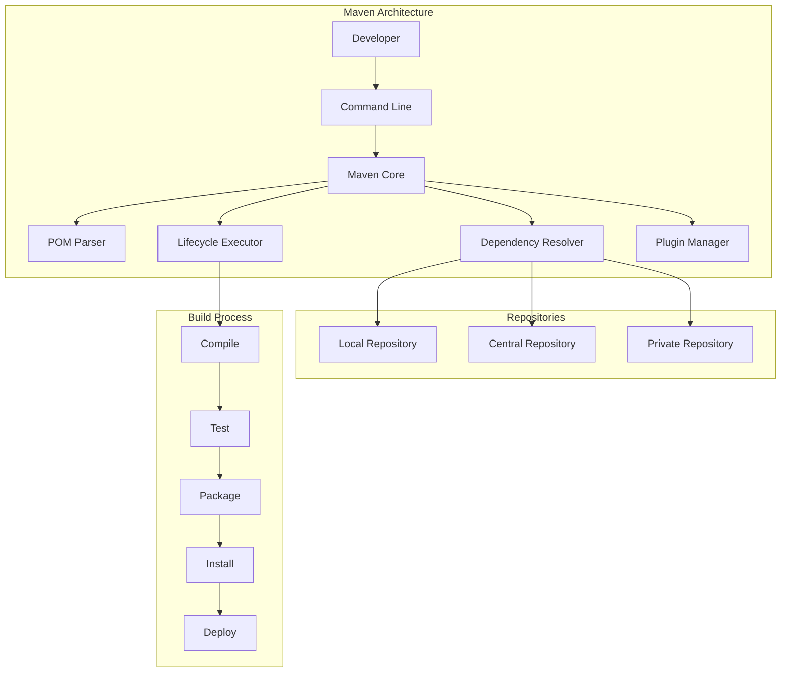
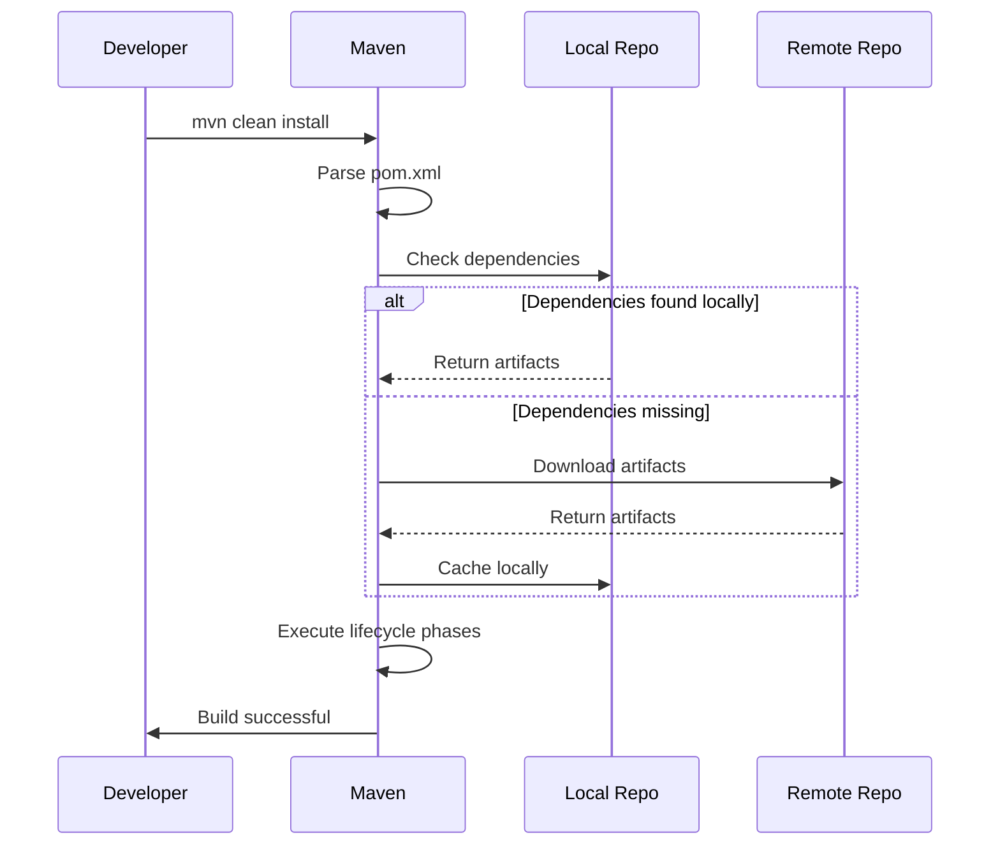

# 01. Maven Fundamentals

## 1. Introduction

Apache Maven is a build automation and project management tool primarily used for Java projects. It uses a Project Object Model (POM) file to manage builds, dependencies, and project metadata. Maven follows a convention-over-configuration approach, making it easier to manage large projects with consistent build processes.

## 2. Learning Objectives

- Understand the purpose and benefits of Maven
- Learn the structure and syntax of POM files
- Master Maven's dependency management
- Understand Maven's build lifecycle
- Configure repositories and plugins
- Apply Maven in real-world Java projects

## 3. Prerequisites

- Basic Java knowledge
- Understanding of XML syntax
- Familiarity with command-line operations
- Java Development Kit (JDK) installed

## 4. Why This Concept Exists

Before Maven, Java projects relied on manual dependency management and custom build scripts. This led to:
- Inconsistent build environments
- Dependency conflicts and version mismatches
- Difficulty in sharing code across projects
- Lack of standardized project structure

Maven solves these problems by providing:
- Standardized project structure
- Automatic dependency resolution
- Consistent build lifecycle
- Centralized repository for libraries

## 5. Problem Statement

Consider a scenario where you're developing a web application with multiple modules:
- Frontend (HTML, CSS, JavaScript)
- Backend (Java, REST APIs)
- Database layer (JDBC, Hibernate)
- Common utilities

Without Maven:
- Manually download and manage JAR files
- Keep track of transitive dependencies
- Maintain custom build scripts for each environment
- Risk version conflicts between libraries

## 6. Theory

### 6.1 POM (Project Object Model)

The POM is the fundamental unit of work in Maven. It's an XML file (`pom.xml`) that contains:
- Project coordinates (GAV)
- Dependencies
- Plugins
- Build configuration
- Project metadata

### 6.2 Maven Coordinates

Maven uses coordinates to uniquely identify artifacts:
```xml
<groupId>com.example</groupId>
<artifactId>my-app</artifactId>
<version>1.0.0</version>
```

- **groupId**: Organization or group identifier
- **artifactId**: Project or module name
- **version**: Specific version of the artifact

### 6.3 Maven Lifecycle

Maven defines three lifecycle phases:
1. **default**: Build and deployment
2. **clean**: Project cleanup
3. **site**: Documentation generation

## 7. Internal Working

### 7.1 Maven Build Process

```
1. Parse pom.xml
2. Resolve dependencies from repositories
3. Download required artifacts
4. Execute lifecycle phases
5. Compile source code
6. Run tests
7. Package artifacts
8. Install to local repository
```

### 7.2 Dependency Resolution

```
1. Read dependency declarations
2. Check local repository (~/.m2/repository)
3. If not found, check remote repositories
4. Download and cache artifacts
5. Resolve transitive dependencies
6. Build dependency tree
```

## 8. JVM Perspective

Maven runs on the JVM and uses Java classes for:
- XML parsing (POM files)
- HTTP client operations (repository access)
- File system operations (project structure)
- Class loading (for plugins and extensions)

Maven requires Java to run but can compile code for different Java versions through compiler plugin configuration.

## 9. Memory Representation

When Maven processes a project:

```
POM Model Object
├── Project coordinates (String references)
├── Dependencies (List<Dependency>)
│   ├── groupId (String)
│   ├── artifactId (String)
│   ├── version (String)
│   └── scope (String)
├── Plugins (List<Plugin>)
├── Properties (Map<String, String>)
└── Modules (List<String>)
```

Dependencies are resolved into a Directed Acyclic Graph (DAG) for build order.

## 10. Architecture Diagram (Mermaid)



## 11. Flow Diagram (Mermaid)



## 12. Syntax

### 12.1 Basic POM Structure

```xml
<?xml version="1.0" encoding="UTF-8"?>
<project xmlns="http://maven.apache.org/POM/4.0.0"
         xmlns:xsi="http://www.w3.org/2001/XMLSchema-instance"
         xsi:schemaLocation="http://maven.apache.org/POM/4.0.0 
         http://maven.apache.org/xsd/maven-4.0.0.xsd">
    <modelVersion>4.0.0</modelVersion>
    
    <groupId>com.example</groupId>
    <artifactId>my-app</artifactId>
    <version>1.0.0</version>
    <packaging>jar</packaging>
    
    <name>My Application</name>
    <description>A sample Maven project</description>
</project>
```

### 12.2 Adding Dependencies

```xml
<dependencies>
    <dependency>
        <groupId>org.junit.jupiter</groupId>
        <artifactId>junit-jupiter</artifactId>
        <version>5.9.3</version>
        <scope>test</scope>
    </dependency>
</dependencies>
```

### 12.3 Configuring Plugins

```xml
<build>
    <plugins>
        <plugin>
            <groupId>org.apache.maven.plugins</groupId>
            <artifactId>maven-compiler-plugin</artifactId>
            <version>3.11.0</version>
            <configuration>
                <source>21</source>
                <target>21</target>
            </configuration>
        </plugin>
    </plugins>
</build>
```

## 13. Easy Example

### Simple Java Project POM

```xml
<?xml version="1.0" encoding="UTF-8"?>
<project xmlns="http://maven.apache.org/POM/4.0.0"
         xmlns:xsi="http://www.w3.org/2001/XMLSchema-instance"
         xsi:schemaLocation="http://maven.apache.org/POM/4.0.0 
         http://maven.apache.org/xsd/maven-4.0.0.xsd">
    <modelVersion>4.0.0</modelVersion>
    
    <groupId>com.example</groupId>
    <artifactId>calculator</artifactId>
    <version>1.0.0</version>
    <packaging>jar</packaging>
    
    <properties>
        <maven.compiler.source>21</maven.compiler.source>
        <maven.compiler.target>21</maven.compiler.target>
        <project.build.sourceEncoding>UTF-8</project.build.sourceEncoding>
    </properties>
    
    <dependencies>
        <dependency>
            <groupId>org.junit.jupiter</groupId>
            <artifactId>junit-jupiter</artifactId>
            <version>5.9.3</version>
            <scope>test</scope>
        </dependency>
    </dependencies>
</project>
```

### Java Source Code

```java
package com.example;

public class Calculator {
    public int add(int a, int b) {
        return a + b;
    }
    
    public int subtract(int a, int b) {
        return a - b;
    }
}
```

### Test Class

```java
package com.example;

import org.junit.jupiter.api.Test;
import static org.junit.jupiter.api.Assertions.*;

class CalculatorTest {
    @Test
    void testAdd() {
        Calculator calc = new Calculator();
        assertEquals(5, calc.add(2, 3));
    }
}
```

## 14. Medium Example

### Web Application POM

```xml
<?xml version="1.0" encoding="UTF-8"?>
<project xmlns="http://maven.apache.org/POM/4.0.0"
         xmlns:xsi="http://www.w3.org/2001/XMLSchema-instance"
         xsi:schemaLocation="http://maven.apache.org/POM/4.0.0 
         http://maven.apache.org/xsd/maven-4.0.0.xsd">
    <modelVersion>4.0.0</modelVersion>
    
    <groupId>com.example</groupId>
    <artifactId>webapp</artifactId>
    <version>1.0.0</version>
    <packaging>war</packaging>
    
    <properties>
        <maven.compiler.source>21</maven.compiler.source>
        <maven.compiler.target>21</maven.compiler.target>
        <spring.version>6.0.11</spring.version>
    </properties>
    
    <dependencies>
        <!-- Spring Framework -->
        <dependency>
            <groupId>org.springframework</groupId>
            <artifactId>spring-core</artifactId>
            <version>${spring.version}</version>
        </dependency>
        <dependency>
            <groupId>org.springframework</groupId>
            <artifactId>spring-web</artifactId>
            <version>${spring.version}</version>
        </dependency>
        
        <!-- Servlet API -->
        <dependency>
            <groupId>jakarta.servlet</groupId>
            <artifactId>jakarta.servlet-api</artifactId>
            <version>6.0.0</version>
            <scope>provided</scope>
        </dependency>
        
        <!-- Testing -->
        <dependency>
            <groupId>org.junit.jupiter</groupId>
            <artifactId>junit-jupiter</artifactId>
            <version>5.9.3</version>
            <scope>test</scope>
        </dependency>
        <dependency>
            <groupId>org.springframework</groupId>
            <artifactId>spring-test</artifactId>
            <version>${spring.version}</version>
            <scope>test</scope>
        </dependency>
    </dependencies>
    
    <build>
        <plugins>
            <plugin>
                <groupId>org.apache.maven.plugins</groupId>
                <artifactId>maven-war-plugin</artifactId>
                <version>3.4.0</version>
            </plugin>
        </plugins>
    </build>
</project>
```

## 15. Hard Example

### Multi-Module Enterprise POM

```xml
<?xml version="1.0" encoding="UTF-8"?>
<project xmlns="http://maven.apache.org/POM/4.0.0"
         xmlns:xsi="http://www.w3.org/2001/XMLSchema-instance"
         xsi:schemaLocation="http://maven.apache.org/POM/4.0.0 
         http://maven.apache.org/xsd/maven-4.0.0.xsd">
    <modelVersion>4.0.0</modelVersion>
    
    <groupId>com.enterprise</groupId>
    <artifactId>enterprise-app</artifactId>
    <version>2.0.0</version>
    <packaging>pom</packaging>
    
    <modules>
        <module>common</module>
        <module>core</module>
        <module>web</module>
        <module>api</module>
    </modules>
    
    <properties>
        <maven.compiler.source>21</maven.compiler.source>
        <maven.compiler.target>21</maven.compiler.target>
        <spring.version>6.0.11</spring.version>
        <hibernate.version>6.2.7</hibernate.version>
        <jackson.version>2.15.2</jackson.version>
        <lombok.version>1.18.28</lombok.version>
    </properties>
    
    <dependencyManagement>
        <dependencies>
            <dependency>
                <groupId>org.springframework</groupId>
                <artifactId>spring-core</artifactId>
                <version>${spring.version}</version>
            </dependency>
            <dependency>
                <groupId>org.hibernate.orm</groupId>
                <artifactId>hibernate-core</artifactId>
                <version>${hibernate.version}</version>
            </dependency>
            <dependency>
                <groupId>com.fasterxml.jackson.core</groupId>
                <artifactId>jackson-databind</artifactId>
                <version>${jackson.version}</version>
            </dependency>
        </dependencies>
    </dependencyManagement>
    
    <dependencies>
        <dependency>
            <groupId>org.projectlombok</groupId>
            <artifactId>lombok</artifactId>
            <version>${lombok.version}</version>
            <scope>provided</scope>
        </dependency>
    </dependencies>
    
    <build>
        <pluginManagement>
            <plugins>
                <plugin>
                    <groupId>org.apache.maven.plugins</groupId>
                    <artifactId>maven-compiler-plugin</artifactId>
                    <version>3.11.0</version>
                    <configuration>
                        <source>21</source>
                        <target>21</target>
                    </configuration>
                </plugin>
            </plugins>
        </pluginManagement>
    </build>
</project>
```

## 16. Enterprise Example

### Microservices Project Structure

```
enterprise-microservices/
├── pom.xml (parent)
├── common/
│   ├── pom.xml
│   └── src/main/java/...
├── config-server/
│   ├── pom.xml
│   └── src/main/java/...
├── api-gateway/
│   ├── pom.xml
│   └── src/main/java/...
├── user-service/
│   ├── pom.xml
│   └── src/main/java/...
├── order-service/
│   ├── pom.xml
│   └── src/main/java/...
└── docker-compose.yml
```

### Parent POM for Microservices

```xml
<?xml version="1.0" encoding="UTF-8"?>
<project xmlns="http://maven.apache.org/POM/4.0.0"
         xmlns:xsi="http://www.w3.org/2001/XMLSchema-instance"
         xsi:schemaLocation="http://maven.apache.org/POM/4.0.0 
         http://maven.apache.org/xsd/maven-4.0.0.xsd">
    <modelVersion>4.0.0</modelVersion>
    
    <groupId>com.enterprise.microservices</groupId>
    <artifactId>microservices-parent</artifactId>
    <version>1.0.0</version>
    <packaging>pom</packaging>
    
    <modules>
        <module>common</module>
        <module>config-server</module>
        <module>api-gateway</module>
        <module>user-service</module>
        <module>order-service</module>
    </modules>
    
    <parent>
        <groupId>org.springframework.boot</groupId>
        <artifactId>spring-boot-starter-parent</artifactId>
        <version>3.1.3</version>
    </parent>
    
    <properties>
        <java.version>21</java.version>
        <spring-cloud.version>2022.0.3</spring-cloud.version>
    </properties>
    
    <dependencyManagement>
        <dependencies>
            <dependency>
                <groupId>org.springframework.cloud</groupId>
                <artifactId>spring-cloud-dependencies</artifactId>
                <version>${spring-cloud.version}</version>
                <type>pom</type>
                <scope>import</scope>
            </dependency>
        </dependencies>
    </dependencyManagement>
    
    <build>
        <plugins>
            <plugin>
                <groupId>org.springframework.boot</groupId>
                <artifactId>spring-boot-maven-plugin</artifactId>
            </plugin>
        </plugins>
    </build>
</project>
```

## 17. Performance

### Build Performance Metrics

| Metric | Typical Value | Optimization |
|--------|---------------|--------------|
| Clean Build | 2-5 minutes | Skip tests with `-DskipTests` |
| Incremental Build | 10-30 seconds | Use incremental compilation |
| Dependency Download | 1-10 minutes | Use local mirror |
| Test Execution | 30s-5min | Parallel test execution |

### Performance Tips

1. **Use Offline Mode**: `mvn -o` when dependencies are cached
2. **Skip Tests**: `mvn -DskipTests` for faster builds
3. **Use Mirrors**: Configure local repository mirrors
4. **Parallel Builds**: Use `-T` for multi-threaded builds

## 18. Time & Space Complexity

### Build Time Complexity
- **Dependency Resolution**: O(n) where n is number of dependencies
- **Compilation**: O(s) where s is number of source files
- **Testing**: O(t) where t is number of tests

### Space Complexity
- **Local Repository**: Grows with number of dependencies
- **Build Artifacts**: Depends on project size
- **Memory Usage**: Typically 256MB-1GB heap size

## 19. Thread Safety

Maven supports parallel execution for:
- Multi-module builds
- Test execution
- Dependency resolution

```bash
# Run builds in parallel with 4 threads
mvn -T 4 clean install

# Run tests in parallel
mvn test -DforkCount=4
```

Thread safety considerations:
- Dependencies should not have conflicting versions
- Shared resources need proper synchronization
- Build order must be respected in multi-module projects

## 20. Best Practices

1. **Use Parent POMs**: Centralize common configuration
2. **Version Properties**: Define versions in properties section
3. **Dependency Management**: Use `<dependencyManagement>` in parent POMs
4. **Plugin Management**: Use `<pluginManagement>` for plugin versions
5. **Profiles**: Use profiles for environment-specific configurations
6. **Exclude Unnecessary Dependencies**: Keep dependency tree clean
7. **Use Maven Wrapper**: Ensure consistent Maven versions across team

## 21. Common Mistakes

1. **Hardcoding Versions**: Using hardcoded versions instead of properties
2. **Ignoring Transitive Dependencies**: Not managing dependency conflicts
3. **Wrong Scope**: Using incorrect dependency scope (compile vs provided vs test)
4. **Missing Encoding**: Not specifying UTF-8 encoding
5. **Not Using Profiles**: Building different environments without profiles
6. **Overriding Parent POMs**: Breaking inheritance without good reason

## 22. Pitfalls

1. **Dependency Hell**: Circular dependencies causing build failures
2. **Version Conflicts**: Multiple versions of same library
3. **Slow Builds**: Large dependency trees and unnecessary downloads
4. **Memory Issues**: Out of memory errors with large projects
5. **Plugin Compatibility**: Plugin versions incompatible with Maven version

## 23. Debugging Tips

```bash
# Debug mode
mvn -X clean install

# Show effective POM
mvn help:effective-pom

# Show dependency tree
mvn dependency:tree

# Analyze dependencies
mvn dependency:analyze

# Show outdated dependencies
mvn versions:display-dependency-updates
```

## 24. Comparison Table

| Feature | Maven | Gradle | Ant |
|---------|-------|--------|-----|
| Build Script | XML (pom.xml) | Groovy/Kotlin | XML (build.xml) |
| Dependency Management | Built-in | Built-in | Manual |
| IDE Support | Excellent | Good | Basic |
| Learning Curve | Moderate | Steep | Easy |
| Build Speed | Moderate | Fast | Fast |
| Flexibility | Limited | High | High |
| Convention over Config | Yes | Yes | No |

## 25. Decision Tree

```
Should you use Maven?
├── Is your project Java-based?
│   ├── Yes → Do you need standard project structure?
│   │   ├── Yes → Use Maven
│   │   └── No → Consider Gradle
│   └── No → Maven may not be suitable
├── Do you have team familiar with Maven?
│   ├── Yes → Stick with Maven
│   └── No → Consider team expertise
└── Do you need advanced build features?
    ├── Yes → Consider Gradle
    └── No → Maven is sufficient
```

## 26. Interview Questions

### Basic Level

1. **What is Maven?**
   - Maven is a build automation and project management tool for Java projects.

2. **What is a POM file?**
   - POM (Project Object Model) is an XML file that contains project information and configuration.

3. **What are Maven coordinates?**
   - GroupId, ArtifactId, and Version (GAV) that uniquely identify an artifact.

4. **What is the local repository?**
   - A directory (~/.m2/repository) where Maven stores downloaded dependencies.

5. **What is the difference between compile and test scope?**
   - Compile scope is available during compilation and runtime; test scope is only for testing.

### Intermediate Level

6. **What is dependency management in Maven?**
   - A way to centralize version management in parent POMs for child modules.

7. **What are Maven profiles?**
   - Profiles allow you to customize builds for different environments.

8. **What is the Maven lifecycle?**
   - A sequence of phases that define the build process (compile, test, package, etc.).

9. **How does Maven resolve transitive dependencies?**
   - Maven automatically downloads dependencies of your dependencies using a nearest-wins strategy.

10. **What is the difference between mvn install and mvn deploy?**
    - Install copies artifacts to local repository; deploy copies to remote repository.

### Advanced Level

11. **How do you handle dependency conflicts in Maven?**
    - Use `<dependencyManagement>`, exclusions, or `mvn dependency:tree` to analyze.

12. **What is the Maven shade plugin used for?**
    - It creates an uber-jar with all dependencies included.

13. **How do you skip tests in Maven?**
    - Use `-DskipTests` to skip test compilation and execution, or `-Dmaven.test.skip=true` to skip only execution.

14. **What is the Maven wrapper?**
    - A script that ensures the correct Maven version is used without requiring Maven to be installed.

15. **How do you create a multi-module Maven project?**
    - Define a parent POM with `<packaging>pom</packaging>` and list modules in `<modules>`.

16. **What is the difference between `mvn clean install` and `mvn clean deploy`?**
    - Install deploys to local repository, deploy sends to remote repository.

17. **How do you add a local JAR file to Maven?**
    - Use `mvn install:install-file` or configure a system scope dependency.

## 27. Exercises

### Level 1 (Easy)

1. Create a simple Maven project with a Calculator class that performs basic arithmetic operations.
2. Write unit tests for the Calculator class using JUnit 5.
3. Run the build and verify all tests pass.

### Level 2 (Medium)

1. Create a multi-module Maven project with common, core, and web modules.
2. Configure dependency management in the parent POM.
3. Use profiles to configure different database settings for development and production.

### Level 3 (Hard)

1. Create a Maven project that produces both a JAR and a WAR file.
2. Configure the shade plugin to create an uber-jar.
3. Set up a CI/CD pipeline using Jenkins that builds and tests the project.

## 28. Summary

Maven is a powerful build tool that provides:
- Standardized project structure
- Automatic dependency management
- Consistent build lifecycle
- Rich plugin ecosystem

Key takeaways:
- Use POM files to define project configuration
- Leverage dependency management for version control
- Utilize profiles for environment-specific builds
- Follow best practices for maintainable builds

## 29. References

1. [Maven Official Documentation](https://maven.apache.org/guides/)
2. [Maven POM Reference](https://maven.apache.org/pom.html)
3. [Maven Repository](https://mvnrepository.com/)
4. [Maven in 5 Minutes](https://maven.apache.org/guides/getting-started/maven-in-five-minutes.html)
5. [Effective Maven](https://books.sonatype.com/mavenbook/)
