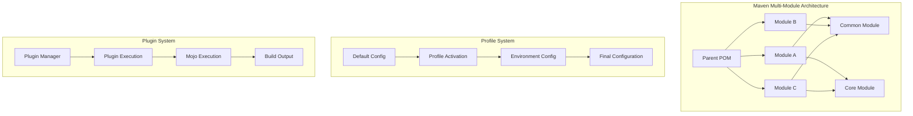
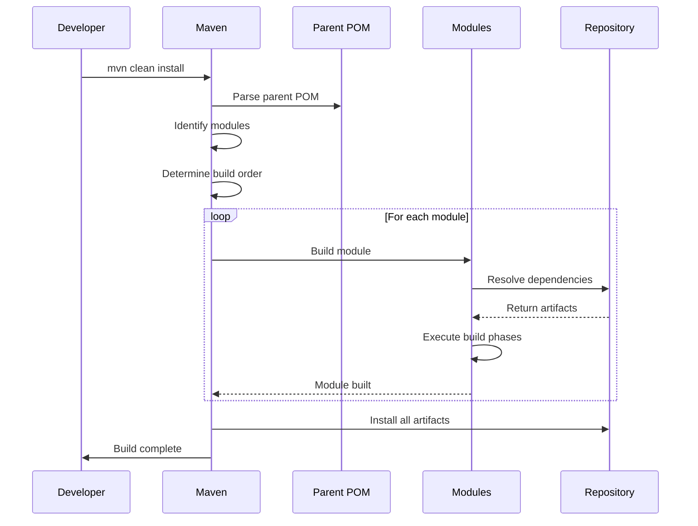

# 02. Maven Advanced

## 1. Introduction

This module covers advanced Maven concepts including multi-module projects, profiles, custom plugins, and dependency management strategies. These concepts are essential for managing complex enterprise applications and maintaining large codebases.

## 2. Learning Objectives

- Design and implement multi-module Maven projects
- Create and manage Maven profiles for different environments
- Develop custom Maven plugins
- Implement advanced dependency management strategies
- Configure plugin management and inheritance
- Optimize Maven builds for large projects

## 3. Prerequisites

- Completed Maven Fundamentals module
- Understanding of Java project structure
- Familiarity with XML and Maven POM syntax
- Basic knowledge of plugin development concepts

## 4. Why This Concept Exists

As projects grow in complexity, basic Maven knowledge becomes insufficient:
- Large applications need modular architecture
- Different environments require different configurations
- Custom build processes need extensibility
- Dependency conflicts need sophisticated resolution

Advanced Maven provides:
- Multi-module project support
- Environment-specific configurations
- Plugin extensibility
- Sophisticated dependency management

## 5. Problem Statement

Consider an enterprise application with:
- Multiple microservices sharing common libraries
- Development, testing, staging, and production environments
- Custom code generation requirements
- Complex deployment procedures

Without advanced Maven features:
- Code duplication across modules
- Manual configuration for each environment
- Custom build logic requires external scripts
- Dependency management becomes chaotic

## 6. Theory

### 6.1 Multi-Module Projects

Multi-module projects allow you to:
- Divide a large project into manageable modules
- Share common configuration through parent POMs
- Build modules in dependency order
- Manage cross-module dependencies

### 6.2 Maven Profiles

Profiles provide environment-specific configurations:
- Activate by command line, OS, or property
- Override default configurations
- Add dependencies or plugins conditionally
- Support different build environments

### 6.3 Plugin Development

Custom plugins extend Maven functionality:
- Mojo (Maven Old Java Object) is the basic unit
- Plugins can be shared across projects
- Support lifecycle phases
- Provide custom goals

## 7. Internal Working

### 7.1 Multi-Module Build Process

```
1. Parse parent POM
2. Identify modules and their dependencies
3. Determine build order (topological sort)
4. Build each module in sequence
5. Install artifacts to local repository
6. Reference artifacts in dependent modules
```

### 7.2 Profile Activation

```
1. Check command line activation (-Pprofile)
2. Check property-based activation
3. Check OS-based activation
4. Check file-based activation
5. Apply profile-specific configurations
6. Merge with default configuration
```

## 8. JVM Perspective

Advanced Maven features affect JVM through:
- Classpath management for multi-module builds
- Memory allocation for parallel builds
- Plugin isolation through classloaders
- Hot reload capabilities for development

Maven uses separate classloaders for:
- Core Maven classes
- Plugin classes
- Project classes
This prevents version conflicts between plugins and project dependencies.

## 9. Memory Representation

### Multi-Module Project Structure

```
Parent POM
├── Module A
│   ├── Dependencies (List)
│   ├── Build Configuration
│   └── Output Artifacts
├── Module B
│   ├── Dependencies (List)
│   ├── Build Configuration
│   └── Output Artifacts
└── Inter-module Dependencies (Graph)
```

### Profile Configuration

```
Profile Map
├── Profile "dev"
│   ├── Properties (Map)
│   ├── Dependencies (List)
│   └── Plugins (List)
├── Profile "prod"
│   ├── Properties (Map)
│   ├── Dependencies (List)
│   └── Plugins (List)
└── Activation Rules (List)
```

## 10. Architecture Diagram (Mermaid)



## 11. Flow Diagram (Mermaid)



## 12. Syntax

### 12.1 Parent POM Structure

```xml
<?xml version="1.0" encoding="UTF-8"?>
<project xmlns="http://maven.apache.org/POM/4.0.0"
         xmlns:xsi="http://www.w3.org/2001/XMLSchema-instance"
         xsi:schemaLocation="http://maven.apache.org/POM/4.0.0 
         http://maven.apache.org/xsd/maven-4.0.0.xsd">
    <modelVersion>4.0.0</modelVersion>
    
    <groupId>com.example</groupId>
    <artifactId>parent-app</artifactId>
    <version>1.0.0</version>
    <packaging>pom</packaging>
    
    <modules>
        <module>module-a</module>
        <module>module-b</module>
        <module>module-c</module>
    </modules>
    
    <dependencyManagement>
        <dependencies>
            <dependency>
                <groupId>org.springframework</groupId>
                <artifactId>spring-core</artifactId>
                <version>${spring.version}</version>
            </dependency>
        </dependencies>
    </dependencyManagement>
</project>
```

### 12.2 Profile Definition

```xml
<profiles>
    <profile>
        <id>development</id>
        <properties>
            <db.url>jdbc:h2:mem:testdb</db.url>
            <db.driver>org.h2.Driver</db.driver>
        </properties>
        <dependencies>
            <dependency>
                <groupId>com.h2database</groupId>
                <artifactId>h2</artifactId>
                <scope>runtime</scope>
            </dependency>
        </dependencies>
    </profile>
    
    <profile>
        <id>production</id>
        <properties>
            <db.url>jdbc:mysql://prod-server:3306/mydb</db.url>
            <db.driver>com.mysql.cj.jdbc.Driver</db.driver>
        </properties>
        <dependencies>
            <dependency>
                <groupId>mysql</groupId>
                <artifactId>mysql-connector-java</artifactId>
                <scope>runtime</scope>
            </dependency>
        </dependencies>
    </profile>
</profiles>
```

### 12.3 Child POM with Parent

```xml
<?xml version="1.0" encoding="UTF-8"?>
<project xmlns="http://maven.apache.org/POM/4.0.0"
         xmlns:xsi="http://www.w3.org/2001/XMLSchema-instance"
         xsi:schemaLocation="http://maven.apache.org/POM/4.0.0 
         http://maven.apache.org/xsd/maven-4.0.0.xsd">
    <modelVersion>4.0.0</modelVersion>
    
    <parent>
        <groupId>com.example</groupId>
        <artifactId>parent-app</artifactId>
        <version>1.0.0</version>
        <relativePath>../pom.xml</relativePath>
    </parent>
    
    <artifactId>module-a</artifactId>
    <packaging>jar</packaging>
    
    <dependencies>
        <dependency>
            <groupId>org.springframework</groupId>
            <artifactId>spring-core</artifactId>
        </dependency>
    </dependencies>
</project>
```

## 13. Easy Example

### Simple Multi-Module Project

**Parent POM:**
```xml
<project>
    <modelVersion>4.0.0</modelVersion>
    <groupId>com.example</groupId>
    <artifactId>calculator-parent</artifactId>
    <version>1.0.0</version>
    <packaging>pom</packaging>
    
    <modules>
        <module>calculator-api</module>
        <module>calculator-core</module>
    </modules>
</project>
```

**calculator-api/pom.xml:**
```xml
<project>
    <modelVersion>4.0.0</modelVersion>
    <parent>
        <groupId>com.example</groupId>
        <artifactId>calculator-parent</artifactId>
        <version>1.0.0</version>
    </parent>
    
    <artifactId>calculator-api</artifactId>
    <packaging>jar</packaging>
</project>
```

**calculator-core/pom.xml:**
```xml
<project>
    <modelVersion>4.0.0</modelVersion>
    <parent>
        <groupId>com.example</groupId>
        <artifactId>calculator-parent</artifactId>
        <version>1.0.0</version>
    </parent>
    
    <artifactId>calculator-core</artifactId>
    <packaging>jar</packaging>
    
    <dependencies>
        <dependency>
            <groupId>com.example</groupId>
            <artifactId>calculator-api</artifactId>
            <version>${project.version}</version>
        </dependency>
    </dependencies>
</project>
```

## 14. Medium Example

### Environment-Specific Configuration

```xml
<project>
    <modelVersion>4.0.0</modelVersion>
    <groupId>com.example</groupId>
    <artifactId>webapp</artifactId>
    <version>1.0.0</version>
    <packaging>war</packaging>
    
    <properties>
        <spring.version>6.0.11</spring.version>
    </properties>
    
    <profiles>
        <profile>
            <id>dev</id>
            <activation>
                <activeByDefault>true</activeByDefault>
            </activation>
            <properties>
                <env>development</env>
                <log.level>DEBUG</log.level>
            </properties>
            <dependencies>
                <dependency>
                    <groupId>com.h2database</groupId>
                    <artifactId>h2</artifactId>
                    <version>2.2.222</version>
                </dependency>
            </dependencies>
        </profile>
        
        <profile>
            <id>prod</id>
            <properties>
                <env>production</env>
                <log.level>WARN</log.level>
            </properties>
            <dependencies>
                <dependency>
                    <groupId>mysql</groupId>
                    <artifactId>mysql-connector-java</artifactId>
                    <version>8.0.33</version>
                </dependency>
            </dependencies>
        </profile>
    </profiles>
    
    <build>
        <resources>
            <resource>
                <directory>src/main/resources</directory>
                <filtering>true</filtering>
            </resource>
        </resources>
    </build>
</project>
```

## 15. Hard Example

### Advanced Dependency Management

```xml
<project>
    <modelVersion>4.0.0</modelVersion>
    <groupId>com.enterprise</groupId>
    <artifactId>enterprise-platform</artifactId>
    <version>2.0.0</version>
    <packaging>pom</packaging>
    
    <modules>
        <module>platform-common</module>
        <module>platform-core</module>
        <module>platform-web</module>
        <module>platform-api</module>
    </modules>
    
    <properties>
        <java.version>21</java.version>
        <spring.version>6.0.11</spring.version>
        <hibernate.version>6.2.7</hibernate.version>
        <jackson.version>2.15.2</jackson.version>
        <lombok.version>1.18.28</lombok.version>
    </properties>
    
    <dependencyManagement>
        <dependencies>
            <!-- Spring BOM -->
            <dependency>
                <groupId>org.springframework</groupId>
                <artifactId>spring-framework-bom</artifactId>
                <version>${spring.version}</version>
                <type>pom</type>
                <scope>import</scope>
            </dependency>
            
            <!-- Hibernate BOM -->
            <dependency>
                <groupId>org.hibernate.orm</groupId>
                <artifactId>hibernate-platform</artifactId>
                <version>${hibernate.version}</version>
                <type>pom</type>
                <scope>import</scope>
            </dependency>
            
            <!-- Jackson BOM -->
            <dependency>
                <groupId>com.fasterxml.jackson</groupId>
                <artifactId>jackson-bom</artifactId>
                <version>${jackson.version}</version>
                <type>pom</type>
                <scope>import</scope>
            </dependency>
        </dependencies>
    </dependencyManagement>
    
    <dependencyManagement>
        <dependencies>
            <dependency>
                <groupId>com.enterprise</groupId>
                <artifactId>platform-common</artifactId>
                <version>${project.version}</version>
            </dependency>
        </dependencies>
    </dependencyManagement>
    
    <build>
        <pluginManagement>
            <plugins>
                <plugin>
                    <groupId>org.apache.maven.plugins</groupId>
                    <artifactId>maven-compiler-plugin</artifactId>
                    <version>3.11.0</version>
                    <configuration>
                        <source>${java.version}</source>
                        <target>${java.version}</target>
                        <annotationProcessorPaths>
                            <path>
                                <groupId>org.projectlombok</groupId>
                                <artifactId>lombok</artifactId>
                                <version>${lombok.version}</version>
                            </path>
                        </annotationProcessorPaths>
                    </configuration>
                </plugin>
            </plugins>
        </pluginManagement>
    </build>
</project>
```

## 16. Enterprise Example

### Microservices with Shared Libraries

```
enterprise-platform/
├── pom.xml (parent)
├── platform-common/
│   ├── pom.xml
│   ├── src/main/java/...
│   └── src/test/java/...
├── platform-core/
│   ├── pom.xml
│   ├── src/main/java/...
│   └── src/test/java/...
├── platform-web/
│   ├── pom.xml
│   ├── src/main/java/...
│   └── src/test/java/...
├── platform-api/
│   ├── pom.xml
│   ├── src/main/java/...
│   └── src/test/java/...
├── platform-cli/
│   ├── pom.xml
│   └── src/main/java/...
└── deploy/
    ├── docker-compose.yml
    └── kubernetes/
```

### Shared Library Module

```xml
<!-- platform-common/pom.xml -->
<project>
    <modelVersion>4.0.0</modelVersion>
    <parent>
        <groupId>com.enterprise</groupId>
        <artifactId>enterprise-platform</artifactId>
        <version>2.0.0</version>
    </parent>
    
    <artifactId>platform-common</artifactId>
    <packaging>jar</packaging>
    
    <dependencies>
        <dependency>
            <groupId>org.springframework</groupId>
            <artifactId>spring-context</artifactId>
        </dependency>
        <dependency>
            <groupId>com.fasterxml.jackson.core</groupId>
            <artifactId>jackson-databind</artifactId>
        </dependency>
        <dependency>
            <groupId>org.projectlombok</groupId>
            <artifactId>lombok</artifactId>
            <scope>provided</scope>
        </dependency>
    </dependencies>
</project>
```

## 17. Performance

### Build Optimization Techniques

| Technique | Impact | Implementation |
|-----------|--------|----------------|
| Parallel Builds | 40-60% faster | `-T 4` flag |
| Incremental Builds | 50-70% faster | Avoid `clean` phase |
| Dependency Caching | 20-30% faster | Use `-o` offline mode |
| Plugin Caching | 10-20% faster | Reuse plugin versions |
| Skip Tests | 30-50% faster | `-DskipTests` flag |

### Memory Configuration

```bash
# Increase Maven heap size
export MAVEN_OPTS="-Xmx2g -XX:MaxPermSize=512m"

# For large multi-module builds
mvn -T 4 -Xmx4g clean install
```

## 18. Time & Space Complexity

### Build Time Complexity
- **Single Module**: O(n + m) where n = dependencies, m = source files
- **Multi-Module**: O(n + m) × k where k = number of modules
- **Profile Activation**: O(p) where p = number of profiles

### Space Complexity
- **Local Repository**: O(d) where d = total dependency size
- **Build Output**: O(a) where a = artifact size
- **Memory Usage**: O(p × m) where p = plugins, m = memory per plugin

## 19. Thread Safety

### Parallel Build Considerations

```bash
# Safe parallel builds
mvn -T 1C clean install  # 1 thread per CPU core

# Module-specific parallelism
mvn -T 2,3 clean install  # 2 threads for modules with 3+ dependencies
```

### Thread Safety Rules

1. **Independent Modules**: Can be built in parallel
2. **Dependent Modules**: Must be built in dependency order
3. **Shared Resources**: Use proper synchronization
4. **Plugin State**: Some plugins are not thread-safe

## 20. Best Practices

1. **Module Organization**: Keep modules focused and cohesive
2. **Dependency Management**: Use BOMs for version management
3. **Profile Design**: Keep profiles minimal and specific
4. **Plugin Management**: Centralize plugin versions in parent POM
5. **Version Properties**: Use properties for consistent versioning
6. **Exclude Transitive**: Only include necessary dependencies
7. **Use Maven Wrapper**: Ensure consistent Maven versions

## 21. Common Mistakes

1. **Circular Dependencies**: Creating circular module dependencies
2. **Over-Nesting**: Too many levels of parent POMs
3. **Profile Abuse**: Using profiles for everything instead of properties
4. **Hardcoded Paths**: Using absolute paths in configurations
5. **Version Conflicts**: Not managing transitive dependency versions
6. **Plugin Overkill**: Using too many plugins or complex configurations

## 22. Pitfalls

1. **Build Order Issues**: Modules built in wrong order
2. **Classpath Conflicts**: Multiple versions of same library
3. **Memory Problems**: Out of memory with large projects
4. **Slow Downloads**: Large dependency trees
5. **Profile Activation**: Unexpected profile activation

## 23. Debugging Tips

```bash
# Debug multi-module build
mvn -X clean install

# Check effective POM for specific module
cd module-a && mvn help:effective-pom

# Analyze dependency tree
mvn dependency:tree -DoutputType=dot

# Check plugin execution
mvn -X plugin:help

# Verify profile activation
mvn help:active-profiles

# Check build order
mvn validate -N
```

## 24. Comparison Table

| Feature | Basic Maven | Advanced Maven |
|---------|-------------|----------------|
| Modules | Single module | Multi-module |
| Configuration | Global | Per-environment |
| Dependencies | Manual | Managed via BOMs |
| Plugins | Basic | Custom and managed |
| Build Order | Simple | Dependency-based |
| Testing | Basic | Advanced strategies |

## 25. Decision Tree

```
When to use multi-module projects?
├── Is the project large (>50K LOC)?
│   ├── Yes → Use multi-module
│   └── No → Single module may suffice
├── Are there shared components?
│   ├── Yes → Extract to common module
│   └── No → Keep in single module
└── Is there multiple deployment targets?
    ├── Yes → Use modules for each target
    └── No → Single deployment module

When to use profiles?
├── Different environments (dev/test/prod)?
│   ├── Yes → Use profiles
│   └── No → Use properties
├── OS-specific configurations?
│   ├── Yes → Use profiles with OS activation
│   └── No → Use properties
└── Conditional dependencies?
    ├── Yes → Use profiles
    └── No → Use optional dependencies
```

## 26. Interview Questions

### Basic Level

1. **What is a multi-module Maven project?**
   - A project structure where a parent POM defines multiple child modules that can be built together.

2. **What is the purpose of a parent POM?**
   - To centralize configuration, dependencies, and plugin management for child modules.

3. **What is dependency management in Maven?**
   - A way to control dependency versions in parent POMs so child modules don't specify versions.

4. **How do Maven profiles work?**
   - Profiles allow you to customize builds for different environments by activating specific configurations.

5. **What is the difference between `dependencyManagement` and `dependencies`?**
   - `dependencyManagement` declares versions for child modules; `dependencies` actually includes dependencies.

### Intermediate Level

6. **How do you activate a Maven profile?**
   - Command line (`-Pprofile`), property activation, OS activation, or file-based activation.

7. **What is the purpose of `pluginManagement`?**
   - To declare plugin versions and configurations that child modules can inherit.

8. **How do you manage transitive dependencies?**
   - Use exclusions, dependency management, or dependency mediation rules.

9. **What is the Maven reactor?**
   - The mechanism that builds multi-module projects in dependency order.

10. **How do you skip a module in a multi-module build?**
    - Use `-pl !module-name` or configure the module to be skipped in the POM.

### Advanced Level

11. **How do you create a custom Maven plugin?**
    - Create a Mojo class with `@Mojo` annotation and package it as a Maven plugin.

12. **What is the difference between `compile` and `provided` scope?**
    - `compile` is available everywhere; `provided` is expected to be supplied by the runtime environment.

13. **How do you handle version conflicts in multi-module projects?**
    - Use dependency management, exclusions, or dependency mediation rules.

14. **What is the Maven build lifecycle?**
    - A sequence of phases (validate, compile, test, package, install, deploy) that define the build process.

15. **How do you parallelize Maven builds?**
    - Use `-T` flag with thread count or `-T 1C` for one thread per CPU core.

16. **What is the difference between `mvn install` and `mvn deploy`?**
    - `install` copies to local repository; `deploy` copies to remote repository.

17. **How do you ensure reproducible builds?**
    - Use Maven wrapper, lock dependency versions, and use consistent JDK versions.

## 27. Exercises

### Level 1 (Easy)

1. Create a parent POM with two child modules that share a common dependency.
2. Use dependency management in the parent POM to control the dependency version.
3. Build the multi-module project and verify all modules compile correctly.

### Level 2 (Medium)

1. Create a Maven project with profiles for development, testing, and production environments.
2. Each profile should configure different database connections and logging levels.
3. Activate each profile from the command line and verify the configuration.

### Level 3 (Hard)

1. Create a custom Maven plugin that generates a report of project dependencies.
2. Configure the plugin to run during the `generate-resources` phase.
3. Use the plugin in a multi-module project and verify the output.

## 28. Summary

Advanced Maven concepts enable:
- **Multi-Module Projects**: Organize large codebases
- **Profiles**: Environment-specific configurations
- **Dependency Management**: Centralized version control
- **Plugin Management**: Reusable build configurations

Key takeaways:
- Use parent POMs for centralized configuration
- Leverage profiles for environment-specific builds
- Implement dependency management for version control
- Create custom plugins for specialized build processes

## 29. References

1. [Maven Multi-Module Projects](https://maven.apache.org/guides/mini/guide-multiple-modules.html)
2. [Maven Profiles](https://maven.apache.org/guides/mini/guide-profiles.html)
3. [Maven Plugin Development](https://maven.apache.org/guides/plugin/guide-java-plugin-development.html)
4. [Maven Dependency Management](https://maven.apache.org/guides/mini/guide-configuring-dependencies.html)
5. [Maven Best Practices](https://maven.apache.org/guides/mini/guide-configuring-dependencies.html)
