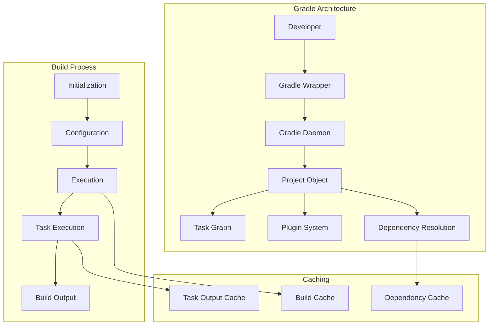
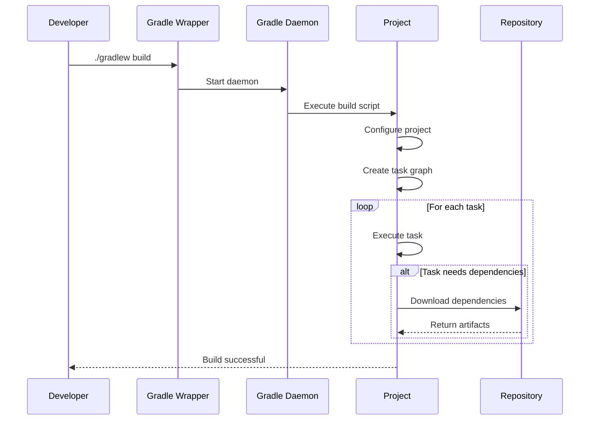

# 03. Gradle Fundamentals

## 1. Introduction

Gradle is a modern build automation tool that uses Groovy or Kotlin DSL for build scripts. It combines the best features of Apache Ant and Maven, providing powerful dependency management, build optimization, and flexible configuration. Gradle is the build tool of choice for Android development and is widely used in enterprise Java projects.

## 2. Learning Objectives

- Understand Gradle's architecture and build model
- Master Groovy/Kotlin DSL build scripts
- Configure dependencies and repositories
- Use Gradle plugins effectively
- Execute Gradle tasks
- Apply Gradle in real-world projects

## 3. Prerequisites

- Basic Java knowledge
- Understanding of build automation concepts
- Familiarity with command-line operations
- Java Development Kit (JDK) installed

## 4. Why This Concept Exists

Before Gradle, build tools had limitations:
- Maven: Rigid structure, XML-based configuration
- Ant: No built-in dependency management
- Both: Limited build optimization

Gradle addresses these issues with:
- Flexible DSL (Groovy/Kotlin)
- Incremental builds
- Build caching
- Parallel execution
- Rich plugin ecosystem

## 5. Problem Statement

Consider building a modern Java application:
- Multiple dependencies with complex transitive relationships
- Need for fast, incremental builds
- Custom build logic and code generation
- Integration with CI/CD pipelines

Without Gradle:
- Slow build times for large projects
- Complex XML configurations
- Limited build optimization
- Poor IDE integration

## 6. Theory

### 6.1 Gradle Build Model

Gradle uses a tree of objects:
- **Project**: Represents a build component
- **Task**: A unit of work (compile, test, package)
- **Plugin**: Adds functionality to the build
- **Configuration**: Dependencies and settings

### 6.2 Gradle DSL

Gradle uses Domain Specific Language for build scripts:
- **Groovy DSL**: Dynamic, concise syntax
- **Kotlin DSL**: Type-safe, IDE-friendly

### 6.3 Build Phases

Gradle has three build phases:
1. **Initialization**: Determines which projects participate
2. **Configuration**: Executes build scripts
3. **Execution**: Runs tasks

## 7. Internal Working

### 7.1 Gradle Build Process

```
1. Parse settings.gradle (initialization)
2. Determine project structure
3. Execute build scripts (configuration)
4. Create task graph
5. Execute tasks (execution)
6. Cache results for incremental builds
```

### 7.2 Dependency Resolution

```
1. Read dependency declarations
2. Check Gradle cache (~/.gradle/caches)
3. If not found, check repositories
4. Download and cache artifacts
5. Resolve transitive dependencies
6. Build dependency graph
```

## 8. JVM Perspective

Gradle runs on the JVM and provides:
- Daemon process for faster builds
- Memory management for large projects
- Classpath isolation for plugins
- Hot reload for build scripts

Gradle Daemon:
- Long-running background process
- Reuses JVM and caches
- Improves build performance
- Automatically stops when idle

## 9. Memory Representation

### Gradle Project Structure

```
Project Object
├── Properties (Map)
├── Tasks (TaskContainer)
│   ├── Task "compile"
│   ├── Task "test"
│   └── Task "jar"
├── Dependencies (DependencyHandler)
│   ├── Implementation
│   ├── TestImplementation
│   └── CompileOnly
└── Repositories (RepositoryHandler)
    ├── MavenCentral
    └── Local
```

### Task Graph

```
Task Graph
├── compileJava → compileJava
├── processResources → processResources
├── classes → [compileJava, processResources]
├── test → [classes]
└── jar → [classes]
```

## 10. Architecture Diagram (Mermaid)



## 11. Flow Diagram (Mermaid)



## 12. Syntax

### 12.1 Basic Build Script (Groovy)

```groovy
// build.gradle
plugins {
    id 'java'
    id 'application'
}

group = 'com.example'
version = '1.0.0'

repositories {
    mavenCentral()
}

dependencies {
    implementation 'org.springframework:spring-core:6.0.11'
    testImplementation 'org.junit.jupiter:junit-jupiter:5.9.3'
}

application {
    mainClass = 'com.example.Main'
}
```

### 12.2 Kotlin DSL Build Script

```kotlin
// build.gradle.kts
plugins {
    java
    application
}

group = "com.example"
version = "1.0.0"

repositories {
    mavenCentral()
}

dependencies {
    implementation("org.springframework:spring-core:6.0.11")
    testImplementation("org.junit.jupiter:junit-jupiter:5.9.3")
}

application {
    mainClass.set("com.example.Main")
}
```

### 12.3 Settings File

```groovy
// settings.gradle
rootProject.name = 'my-app'

include 'module-a'
include 'module-b'
include 'module-c'
```

## 13. Easy Example

### Simple Java Application

**build.gradle:**
```groovy
plugins {
    id 'java'
}

group = 'com.example'
version = '1.0.0'

repositories {
    mavenCentral()
}

dependencies {
    testImplementation 'org.junit.jupiter:junit-jupiter:5.9.3'
    testRuntimeOnly 'org.junit.platform:junit-platform-launcher'
}

test {
    useJUnitPlatform()
}
```

**src/main/java/com/example/Calculator.java:**
```java
package com.example;

public class Calculator {
    public int add(int a, int b) {
        return a + b;
    }
    
    public int subtract(int a, int b) {
        return a - b;
    }
}
```

**src/test/java/com/example/CalculatorTest.java:**
```java
package com.example;

import org.junit.jupiter.api.Test;
import static org.junit.jupiter.api.Assertions.*;

class CalculatorTest {
    @Test
    void testAdd() {
        Calculator calc = new Calculator();
        assertEquals(5, calc.add(2, 3));
    }
}
```

### Build Commands

```bash
# Build the project
./gradlew build

# Run tests
./gradlew test

# Clean build
./gradlew clean build

# Run the application
./gradlew run
```

## 14. Medium Example

### Web Application with Spring Boot

**build.gradle:**
```groovy
plugins {
    id 'java'
    id 'org.springframework.boot' version '3.1.3'
    id 'io.spring.dependency-management' version '1.1.0'
}

group = 'com.example'
version = '1.0.0'

java {
    sourceCompatibility = '21'
}

repositories {
    mavenCentral()
}

dependencies {
    implementation 'org.springframework.boot:spring-boot-starter-web'
    implementation 'org.springframework.boot:spring-boot-starter-data-jpa'
    implementation 'com.h2database:h2'
    
    testImplementation 'org.springframework.boot:spring-boot-starter-test'
    testImplementation 'org.springframework.security:spring-security-test'
}

tasks.named('test') {
    useJUnitPlatform()
}
```

**src/main/java/com/example/Application.java:**
```java
package com.example;

import org.springframework.boot.SpringApplication;
import org.springframework.boot.autoconfigure.SpringBootApplication;

@SpringBootApplication
public class Application {
    public static void main(String[] args) {
        SpringApplication.run(Application.class, args);
    }
}
```

**src/main/java/com/example/controller/GreetingController.java:**
```java
package com.example.controller;

import org.springframework.web.bind.annotation.GetMapping;
import org.springframework.web.bind.annotation.RequestParam;
import org.springframework.web.bind.annotation.RestController;

@RestController
public class GreetingController {
    
    @GetMapping("/greeting")
    public String greeting(@RequestParam(name = "name", defaultValue = "World") String name) {
        return "Hello, " + name + "!";
    }
}
```

## 15. Hard Example

### Multi-Module Project with Custom Tasks

**settings.gradle:**
```groovy
rootProject.name = 'enterprise-app'

include 'common'
include 'core'
include 'web'
include 'api'
```

**build.gradle:**
```groovy
plugins {
    id 'java'
    id 'jacoco'
    id 'checkstyle'
}

allprojects {
    group = 'com.enterprise'
    version = '2.0.0'
    
    repositories {
        mavenCentral()
    }
}

subprojects {
    apply plugin: 'java'
    
    java {
        sourceCompatibility = JavaVersion.VERSION_21
        targetCompatibility = JavaVersion.VERSION_21
    }
    
    dependencies {
        compileOnly 'org.projectlombok:lombok:1.18.28'
        annotationProcessor 'org.projectlombok:lombok:1.18.28'
        
        testImplementation 'org.junit.jupiter:junit-jupiter:5.9.3'
        testRuntimeOnly 'org.junit.platform:junit-platform-launcher'
    }
    
    test {
        useJUnitPlatform()
    }
    
    jacocoTestReport {
        reports {
            xml.required = true
            html.required = true
        }
    }
    
    checkstyle {
        toolVersion = '10.12.2'
    }
}

project(':core') {
    dependencies {
        implementation project(':common')
    }
}

project(':web') {
    dependencies {
        implementation project(':core')
        implementation 'org.springframework.boot:spring-boot-starter-web:3.1.3'
    }
}

project(':api') {
    dependencies {
        implementation project(':core')
        implementation 'org.springframework.boot:spring-boot-starter-web:3.1.3'
    }
}

// Custom task for generating build report
task buildReport {
    doLast {
        println "Build Report for ${rootProject.name}"
        println "Version: ${version}"
        println "Java Version: ${JavaVersion.current()}"
        
        subprojects.each { subproject ->
            println "Module: ${subproject.name}"
        }
    }
}
```

## 16. Enterprise Example

### Microservices Project Structure

```
enterprise-microservices/
├── build.gradle
├── settings.gradle
├── gradle/
│   └── wrapper/
├── common/
│   ├── build.gradle
│   └── src/
├── config-server/
│   ├── build.gradle
│   └── src/
├── api-gateway/
│   ├── build.gradle
│   └── src/
├── user-service/
│   ├── build.gradle
│   └── src/
├── order-service/
│   ├── build.gradle
│   └── src/
└── docker-compose.yml
```

### Root build.gradle

```groovy
plugins {
    id 'java'
    id 'org.springframework.boot' version '3.1.3' apply false
    id 'io.spring.dependency-management' version '1.1.0' apply false
}

allprojects {
    group = 'com.enterprise.microservices'
    version = '1.0.0'
    
    repositories {
        mavenCentral()
    }
}

subprojects {
    apply plugin: 'java'
    apply plugin: 'io.spring.dependency-management'
    
    java {
        sourceCompatibility = JavaVersion.VERSION_21
    }
    
    dependencyManagement {
        imports {
            mavenBom org.springframework.boot.gradle.plugin.SpringBootPlugin.BOM_COORDINATES
        }
    }
    
    dependencies {
        implementation 'org.springframework.boot:spring-boot-starter'
        testImplementation 'org.springframework.boot:spring-boot-starter-test'
    }
    
    test {
        useJUnitPlatform()
    }
}

project(':user-service') {
    apply plugin: 'org.springframework.boot'
    
    dependencies {
        implementation project(':common')
        implementation 'org.springframework.boot:spring-boot-starter-web'
        implementation 'org.springframework.boot:spring-boot-starter-data-jpa'
        runtimeOnly 'org.postgresql:postgresql'
    }
}
```

## 17. Performance

### Build Performance Metrics

| Metric | Typical Value | Optimization |
|--------|---------------|--------------|
| Clean Build | 1-3 minutes | Use build cache |
| Incremental Build | 5-15 seconds | Avoid clean phase |
| Dependency Download | 30s-5 minutes | Use offline mode |
| Test Execution | 20s-3 minutes | Parallel test execution |

### Performance Tips

1. **Use Gradle Daemon**: `--daemon` flag (enabled by default)
2. **Enable Build Cache**: `--build-cache` flag
3. **Parallel Builds**: `--parallel` flag
4. **Configure Heap Size**: `org.gradle.jvmargs=-Xmx4g`

## 18. Time & Space Complexity

### Build Time Complexity
- **Configuration Phase**: O(p × s) where p = plugins, s = script size
- **Task Execution**: O(t × d) where t = tasks, d = dependencies
- **Dependency Resolution**: O(n × r) where n = dependencies, r = repositories

### Space Complexity
- **Build Cache**: O(a) where a = artifact size
- **Dependency Cache**: O(d) where d = dependency size
- **Memory Usage**: O(p × m) where p = parallelism, m = memory per task

## 19. Thread Safety

Gradle supports parallel execution for:
- Independent tasks
- Test execution
- Multi-module builds

```bash
# Parallel builds
./gradlew build --parallel

# Parallel test execution
test {
    maxParallelForks = Runtime.runtime.availableProcessors().intdiv(2) ?: 1
}
```

Thread safety considerations:
- Tasks must be independent for parallel execution
- Shared resources need proper synchronization
- Plugin state must be thread-safe

## 20. Best Practices

1. **Use Gradle Wrapper**: Ensure consistent Gradle versions
2. **Configure Build Cache**: Speed up incremental builds
3. **Use Dependency Constraints**: Manage transitive versions
4. **Apply Plugins Selectively**: Only apply needed plugins
5. **Configure Repositories**: Use mirrors for faster downloads
6. **Use Version Catalogs**: Centralize dependency versions
7. **Write Idiomatic Scripts**: Follow Gradle conventions

## 21. Common Mistakes

1. **Ignoring Build Cache**: Not enabling build cache for faster builds
2. **Over-Configuring**: Adding unnecessary configuration
3. **Hardcoding Versions**: Not using version variables or catalogs
4. **Missing Wrapper**: Not including Gradle wrapper in repository
5. **Ignoring Daemon**: Disabling Gradle daemon unnecessarily
6. **Not Using Kotlin DSL**: Using Groovy when Kotlin DSL is better

## 22. Pitfalls

1. **Memory Issues**: Out of memory with large projects
2. **Slow Downloads**: Large dependency trees
3. **Plugin Conflicts**: Version conflicts between plugins
4. **Configuration Cache Issues**: Problems with configuration cache
5. **Incremental Build Problems**: Tasks not incremental correctly

## 23. Debugging Tips

```bash
# Debug mode
./gradlew build --info

# Stack traces
./gradlew build --stacktrace

# Scan build
./gradlew build --scan

# Show task dependencies
./gradlew dependencies

# Show project structure
./gradlew projects

# Show task list
./gradlew tasks

# Clean build cache
./gradlew cleanBuildCache
```

## 24. Comparison Table

| Feature | Gradle | Maven | Ant |
|---------|--------|-------|-----|
| Build Script | Groovy/Kotlin | XML | XML |
| Performance | Fast (incremental) | Moderate | Fast |
| Dependency Management | Built-in | Built-in | Manual |
| IDE Support | Excellent | Excellent | Basic |
| Learning Curve | Steep | Moderate | Easy |
| Flexibility | High | Limited | High |
| Build Cache | Yes | No | No |
| Daemon | Yes | No | No |

## 25. Decision Tree

```
Should you use Gradle?
├── Is this an Android project?
│   ├── Yes → Use Gradle (required)
│   └── No → Consider other factors
├── Do you need fast builds?
│   ├── Yes → Gradle with caching
│   └── No → Maven may suffice
├── Is the project very large?
│   ├── Yes → Gradle with parallel builds
│   └── No → Either tool works
└── Is the team familiar with Gradle?
    ├── Yes → Use Gradle
    └── No → Consider learning curve
```

## 26. Interview Questions

### Basic Level

1. **What is Gradle?**
   - Gradle is a build automation tool that uses Groovy or Kotlin DSL for build scripts.

2. **What is the difference between Gradle and Maven?**
   - Gradle uses DSL and supports incremental builds; Maven uses XML and has a fixed lifecycle.

3. **What is the Gradle Daemon?**
   - A long-running background process that improves build performance by reusing the JVM.

4. **What is the purpose of build.gradle?**
   - The main build script that defines project configuration, dependencies, and tasks.

5. **How do you run tests in Gradle?**
   - Use `./gradlew test` command.

### Intermediate Level

6. **What is the Gradle Wrapper?**
   - A script that ensures the correct Gradle version is used without requiring Gradle to be installed.

7. **What is the difference between `implementation` and `api` configurations?**
   - `implementation` doesn't expose dependencies to consumers; `api` does.

8. **How do you create a custom task in Gradle?**
   - Use `task myTask { ... }` or create a class extending DefaultTask.

9. **What is the Gradle Build Cache?**
   - A cache that stores task outputs for reuse in subsequent builds.

10. **How do you configure parallel builds in Gradle?**
    - Use `--parallel` flag or `org.gradle.parallel=true` in gradle.properties.

### Advanced Level

11. **What is the Configuration Cache in Gradle?**
    - A cache that stores the configuration phase output for faster subsequent builds.

12. **How do you manage transitive dependencies in Gradle?**
    - Use `implementation` vs `api`, exclude dependencies, or use dependency constraints.

13. **What is a Gradle Plugin?**
    - An extension that adds functionality to the build, like the Java plugin or Spring Boot plugin.

14. **How do you publish artifacts with Gradle?**
    - Use the `maven-publish` plugin and configure publication settings.

15. **What is the difference between `clean` and `assemble` tasks?**
    - `clean` removes build artifacts; `assemble` creates them.

16. **How do you handle version conflicts in Gradle?**
    - Gradle uses a "newest version" strategy; you can force versions or exclude dependencies.

17. **What is the Purpose of settings.gradle?**
    - Defines project name and includes subprojects for multi-module builds.

## 27. Exercises

### Level 1 (Easy)

1. Create a simple Java application with Gradle that calculates Fibonacci numbers.
2. Write unit tests using JUnit 5.
3. Build and run the application using Gradle commands.

### Level 2 (Medium)

1. Create a multi-module Gradle project with common, core, and web modules.
2. Configure dependency management and shared configurations.
3. Use Gradle's build cache to speed up incremental builds.

### Level 3 (Hard)

1. Create a custom Gradle plugin that generates API documentation.
2. Configure the plugin to run during the `generateResources` phase.
3. Write tests for the plugin functionality.

## 28. Summary

Gradle provides:
- **Flexible DSL**: Groovy or Kotlin for build scripts
- **Incremental Builds**: Only rebuild what's changed
- **Build Caching**: Reuse task outputs
- **Parallel Execution**: Faster builds
- **Rich Plugin Ecosystem**: Extensible functionality

Key takeaways:
- Use Gradle Wrapper for consistent builds
- Enable build cache and parallel execution
- Use dependency constraints for version management
- Write idiomatic build scripts

## 29. References

1. [Gradle Official Documentation](https://docs.gradle.org/)
2. [Gradle User Guide](https://docs.gradle.org/current/userguide/userguide.html)
3. [Gradle Build Language Reference](https://docs.gradle.org/current/dsl/index.html)
4. [Gradle Plugin Portal](https://plugins.gradle.org/)
5. [Gradle in Action](https://www.manning.com/books/gradle-in-action)
