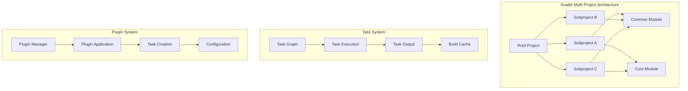
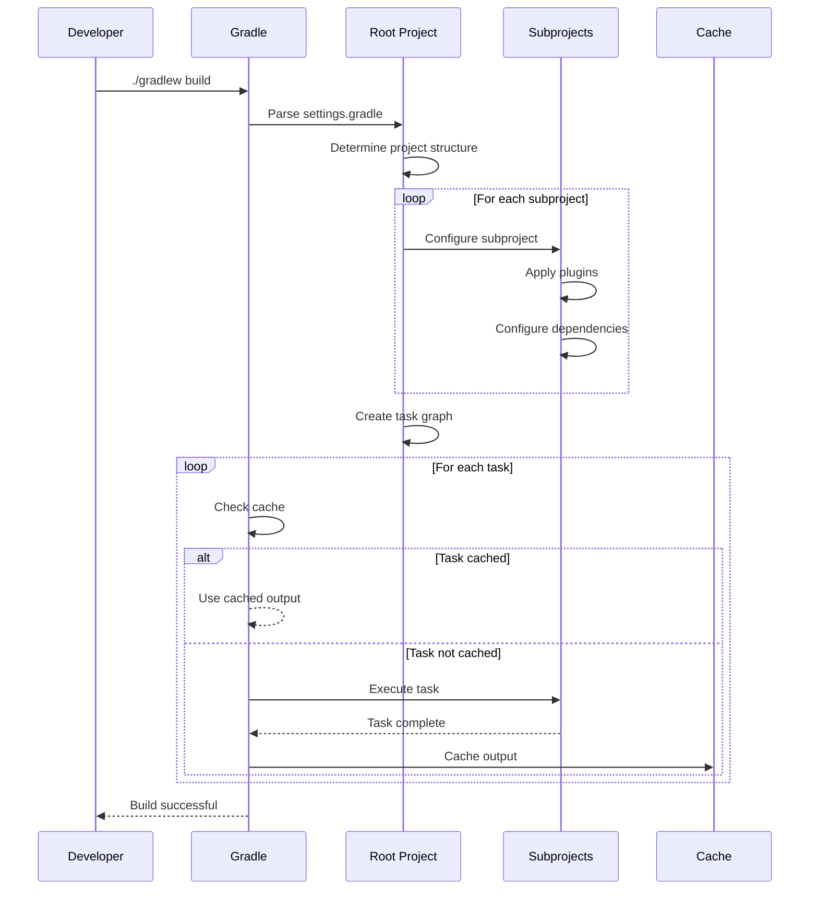

# 04. Gradle Advanced

## 1. Introduction

This module covers advanced Gradle concepts including multi-project builds, custom tasks, Kotlin DSL, and build optimization techniques. These concepts are essential for managing complex enterprise applications and maintaining large codebases with Gradle.

## 2. Learning Objectives

- Design and implement multi-project Gradle builds
- Create custom Gradle tasks and plugins
- Master Kotlin DSL for type-safe build scripts
- Configure build optimization strategies
- Implement advanced dependency management
- Apply Gradle in enterprise scenarios

## 3. Prerequisites

- Completed Gradle Fundamentals module
- Understanding of Groovy or Kotlin syntax
- Familiarity with build automation concepts
- Basic knowledge of plugin development

## 4. Why This Concept Exists

As projects grow in complexity, basic Gradle knowledge becomes insufficient:
- Large applications need modular architecture
- Custom build processes require extensibility
- Build performance needs optimization
- Type safety becomes important for maintainability

Advanced Gradle provides:
- Multi-project build support
- Custom task creation
- Kotlin DSL for type safety
- Build optimization techniques

## 5. Problem Statement

Consider a large enterprise application:
- Multiple modules with complex dependencies
- Custom code generation requirements
- Need for fast, reproducible builds
- Integration with multiple CI/CD systems

Without advanced Gradle features:
- Code duplication across modules
- Slow build times
- Custom logic requires external scripts
- Build configuration becomes unmaintainable

## 6. Theory

### 6.1 Multi-Project Builds

Multi-project builds allow you to:
- Divide a large project into manageable modules
- Share common configurations through root build script
- Build modules in dependency order
- Manage cross-module dependencies

### 6.2 Custom Tasks

Custom tasks extend Gradle functionality:
- Extend DefaultTask class
- Define inputs and outputs
- Support incremental builds
- Can be reused across projects

### 6.3 Kotlin DSL

Kotlin DSL provides:
- Type-safe build scripts
- Better IDE support
- Compile-time error checking
- Modern Kotlin syntax

## 7. Internal Working

### 7.1 Multi-Project Build Process

```
1. Parse settings.gradle
2. Determine project structure
3. Configure all projects
4. Create task graph
5. Execute tasks in dependency order
6. Cache results for incremental builds
```

### 7.2 Task Execution Model

```
1. Resolve task dependencies
2. Check task inputs/outputs
3. Execute task action
4. Cache task outputs
5. Update task state
```

## 8. JVM Perspective

Advanced Gradle features affect JVM through:
- Classpath management for multi-project builds
- Memory allocation for parallel builds
- Plugin isolation through classloaders
- Hot reload capabilities for development

Gradle uses separate classloaders for:
- Root project classes
- Subproject classes
- Plugin classes
- Build script classes

## 9. Memory Representation

### Multi-Project Structure

```
Root Project
├── Subproject A
│   ├── Dependencies (ConfigurationContainer)
│   ├── Tasks (TaskContainer)
│   └── Plugins (PluginContainer)
├── Subproject B
│   ├── Dependencies (ConfigurationContainer)
│   ├── Tasks (TaskContainer)
│   └── Plugins (PluginContainer)
└── Cross-project Dependencies (DependencyGraph)
```

### Task Graph

```
Task Execution Graph
├── compileA → [compileA]
├── compileB → [compileB, compileA]
├── testA → [testA, compileA]
├── testB → [testB, compileB]
└── build → [testA, testB, assembleA, assembleB]
```

## 10. Architecture Diagram (Mermaid)



## 11. Flow Diagram (Mermaid)



## 12. Syntax

### 12.1 Settings File (settings.gradle.kts)

```kotlin
// settings.gradle.kts
rootProject.name = "enterprise-app"

include("common")
include("core")
include("web")
include("api")

project(":common").projectDir = file("modules/common")
project(":core").projectDir = file("modules/core")
```

### 12.2 Root Build Script (Kotlin DSL)

```kotlin
// build.gradle.kts
plugins {
    java
    jacoco
    checkstyle
}

allprojects {
    group = "com.enterprise"
    version = "2.0.0"
    
    repositories {
        mavenCentral()
    }
}

subprojects {
    apply(plugin = "java")
    
    java {
        sourceCompatibility = JavaVersion.VERSION_21
        targetCompatibility = JavaVersion.VERSION_21
    }
    
    dependencies {
        "compileOnly"("org.projectlombok:lombok:1.18.28")
        "annotationProcessor"("org.projectlombok:lombok:1.18.28")
        
        "testImplementation"("org.junit.jupiter:junit-jupiter:5.9.3")
        "testRuntimeOnly"("org.junit.platform:junit-platform-launcher")
    }
    
    tasks.test {
        useJUnitPlatform()
    }
}
```

### 12.3 Custom Task (Kotlin DSL)

```kotlin
// build.gradle.kts
abstract class GenerateReport : DefaultTask() {
    @get:InputDirectory
    abstract val sourceDir: DirectoryProperty
    
    @get:OutputFile
    abstract val reportFile: RegularFileProperty
    
    @TaskAction
    fun generate() {
        val source = sourceDir.get().asFile
        val report = reportFile.get().asFile
        
        report.writeText("Build Report\n")
        report.appendText("Source: ${source.absolutePath}\n")
        report.appendText("Generated: ${java.time.LocalDateTime.now()}\n")
    }
}

tasks.register<GenerateReport>("generateReport") {
    sourceDir.set(project.layout.projectDirectory.dir("src/main/java"))
    reportFile.set(project.layout.buildDirectory.file("reports/build-report.txt"))
}
```

## 13. Easy Example

### Simple Multi-Project Setup

**settings.gradle:**
```groovy
rootProject.name = 'calculator'

include 'calculator-api'
include 'calculator-core'
include 'calculator-cli'
```

**build.gradle:**
```groovy
subprojects {
    apply plugin: 'java'
    
    group = 'com.example'
    version = '1.0.0'
    
    repositories {
        mavenCentral()
    }
    
    dependencies {
        testImplementation 'org.junit.jupiter:junit-jupiter:5.9.3'
        testRuntimeOnly 'org.junit.platform:junit-platform-launcher'
    }
    
    test {
        useJUnitPlatform()
    }
}
```

**calculator-api/build.gradle:**
```groovy
dependencies {
    // No dependencies
}
```

**calculator-core/build.gradle:**
```groovy
dependencies {
    implementation project(':calculator-api')
}
```

**calculator-cli/build.gradle:**
```groovy
dependencies {
    implementation project(':calculator-core')
}

jar {
    manifest {
        attributes 'Main-Class': 'com.example.CalculatorCLI'
    }
}
```

## 14. Medium Example

### Custom Task with Input/Output

```kotlin
// build.gradle.kts
import java.time.LocalDateTime

abstract class ValidateCode : DefaultTask() {
    @get:InputFiles
    abstract val sourceFiles: ConfigurableFileCollection
    
    @get:OutputFile
    abstract val reportFile: RegularFileProperty
    
    @TaskAction
    fun validate() {
        val report = mutableListOf<String>()
        var issues = 0
        
        sourceFiles.files.forEach { file ->
            val lines = file.readLines()
            lines.forEachIndexed { index, line ->
                if (line.length > 120) {
                    report.add("Line ${index + 1} exceeds 120 characters")
                    issues++
                }
                if (line.contains("TODO")) {
                    report.add("Line ${index + 1} contains TODO")
                    issues++
                }
            }
        }
        
        val reportContent = buildString {
            appendLine("Code Validation Report")
            appendLine("Generated: ${LocalDateTime.now()}")
            appendLine("Files checked: ${sourceFiles.files.size}")
            appendLine("Issues found: $issues")
            appendLine()
            report.forEach { appendLine(it) }
        }
        
        reportFile.get().asFile.writeText(reportContent)
        
        if (issues > 0) {
            throw GradleException("Found $issues issues in code")
        }
    }
}

tasks.register<ValidateCode>("validateCode") {
    sourceFiles.from(fileTree("src/main/java") { include("**/*.java") })
    reportFile.set(project.layout.buildDirectory.file("reports/code-validation.txt"))
}
```

## 15. Hard Example

### Advanced Multi-Project with Convention Plugins

**buildSrc/src/main/kotlin/java-conventions.gradle.kts:**
```kotlin
plugins {
    java
    checkstyle
}

group = "com.enterprise"
version = "2.0.0"

java {
    sourceCompatibility = JavaVersion.VERSION_21
    targetCompatibility = JavaVersion.VERSION_21
}

repositories {
    mavenCentral()
}

dependencies {
    "compileOnly"("org.projectlombok:lombok:1.18.28")
    "annotationProcessor"("org.projectlombok:lombok:1.18.28")
    
    "testImplementation"("org.junit.jupiter:junit-jupiter:5.9.3")
    "testRuntimeOnly"("org.junit.platform:junit-platform-launcher")
}

tasks.test {
    useJUnitPlatform()
}

checkstyle {
    toolVersion = "10.12.2"
}
```

**Root build.gradle.kts:**
```kotlin
plugins {
    id("java-conventions") apply false
}

allprojects {
    group = "com.enterprise"
    version = "2.0.0"
}

subprojects {
    apply(plugin = "java-conventions")
}

project(":core") {
    dependencies {
        implementation(project(":common"))
    }
}

project(":web") {
    dependencies {
        implementation(project(":core"))
        implementation("org.springframework.boot:spring-boot-starter-web:3.1.3")
    }
}
```

## 16. Enterprise Example

### Microservices with Shared Convention Plugins

```
enterprise-platform/
├── buildSrc/
│   ├── build.gradle.kts
│   └── src/main/kotlin/
│       ├── java-conventions.gradle.kts
│       ├── spring-conventions.gradle.kts
│       └── test-conventions.gradle.kts
├── settings.gradle.kts
├── build.gradle.kts
├── common/
│   ├── build.gradle.kts
│   └── src/
├── core/
│   ├── build.gradle.kts
│   └── src/
├── web/
│   ├── build.gradle.kts
│   └── src/
└── api/
    ├── build.gradle.kts
    └── src/
```

**buildSrc/build.gradle.kts:**
```kotlin
plugins {
    `kotlin-dsl`
}

repositories {
    gradlePluginPortal()
    mavenCentral()
}

dependencies {
    implementation("org.springframework.boot:spring-boot-gradle-plugin:3.1.3")
}
```

**buildSrc/src/main/kotlin/spring-conventions.gradle.kts:**
```kotlin
plugins {
    id("java-conventions")
    id("org.springframework.boot")
    id("io.spring.dependency-management")
}

group = "com.enterprise"

dependencyManagement {
    imports {
        mavenBom(org.springframework.boot.gradle.plugin.SpringBootPlugin.BOM_COORDINATES)
    }
}

dependencies {
    "implementation"("org.springframework.boot:spring-boot-starter")
    "testImplementation"("org.springframework.boot:spring-boot-starter-test")
}

tasks.test {
    useJUnitPlatform()
}
```

## 17. Performance

### Build Optimization Techniques

| Technique | Impact | Implementation |
|-----------|--------|----------------|
| Build Cache | 30-50% faster | `--build-cache` flag |
| Parallel Builds | 40-60% faster | `--parallel` flag |
| Configuration Cache | 20-40% faster | `--configuration-cache` flag |
| Daemon | 20-30% faster | Default enabled |
| Incremental Compilation | 50-70% faster | Default for Java plugin |

### Memory Configuration

```properties
# gradle.properties
org.gradle.jvmargs=-Xmx4g -XX:MaxPermSize=512m
org.gradle.parallel=true
org.gradle.caching=true
org.gradle.configuration-cache=true
```

## 18. Time & Space Complexity

### Build Time Complexity
- **Configuration Phase**: O(p × s) where p = projects, s = script size
- **Task Execution**: O(t × d) where t = tasks, d = dependencies
- **Dependency Resolution**: O(n × r) where n = dependencies, r = repositories

### Space Complexity
- **Build Cache**: O(a) where a = artifact size
- **Dependency Cache**: O(d) where d = dependency size
- **Memory Usage**: O(p × m) where p = parallelism, m = memory per task

## 19. Thread Safety

Gradle supports parallel execution for:
- Independent tasks
- Test execution
- Multi-module builds

```kotlin
// build.gradle.kts
tasks.test {
    maxParallelForks = (Runtime.getRuntime().availableProcessors() / 2).coerceAtLeast(1)
    forkEvery = 100
}
```

Thread safety considerations:
- Tasks must be independent for parallel execution
- Shared resources need proper synchronization
- Plugin state must be thread-safe
- Configuration cache requires thread-safe configuration

## 20. Best Practices

1. **Use Convention Plugins**: Share build logic across modules
2. **Enable Build Cache**: Speed up incremental builds
3. **Use Kotlin DSL**: Type-safe build scripts
4. **Configure Parallel Builds**: Faster multi-module builds
5. **Use Version Catalogs**: Centralize dependency versions
6. **Apply Plugins Selectively**: Only apply needed plugins
7. **Write Idiomatic Scripts**: Follow Gradle conventions

## 21. Common Mistakes

1. **Not Using Convention Plugins**: Duplicating configuration across modules
2. **Ignoring Build Cache**: Not enabling build cache for faster builds
3. **Over-Configuring**: Adding unnecessary configuration
4. **Hardcoding Versions**: Not using version catalogs or variables
5. **Missing Wrapper**: Not including Gradle wrapper in repository
6. **Not Using Kotlin DSL**: Using Groovy when Kotlin DSL is better

## 22. Pitfalls

1. **Memory Issues**: Out of memory with large projects
2. **Slow Downloads**: Large dependency trees
3. **Plugin Conflicts**: Version conflicts between plugins
4. **Configuration Cache Issues**: Problems with configuration cache
5. **Incremental Build Problems**: Tasks not incremental correctly

## 23. Debugging Tips

```bash
# Debug mode
./gradlew build --info

# Stack traces
./gradlew build --stacktrace

# Scan build
./gradlew build --scan

# Show task dependencies
./gradlew dependencies

# Show project structure
./gradlew projects

# Show task list
./gradlew tasks

# Clean build cache
./gradlew cleanBuildCache

# Check configuration cache
./gradlew build --configuration-cache
```

## 24. Comparison Table

| Feature | Gradle Advanced | Maven Advanced |
|---------|-----------------|----------------|
| Build Script | Kotlin DSL | XML |
| Convention Plugins | Yes | No |
| Build Cache | Yes | No |
| Configuration Cache | Yes | No |
| Parallel Builds | Built-in | Via plugin |
| Multi-Project | Excellent | Good |
| Custom Tasks | Easy | Complex |
| Type Safety | Yes | No |

## 25. Decision Tree

```
When to use multi-project builds?
├── Is the project large (>50K LOC)?
│   ├── Yes → Use multi-project
│   └── No → Single project may suffice
├── Are there shared components?
│   ├── Yes → Extract to common module
│   └── No → Keep in single module
└── Is there multiple deployment targets?
    ├── Yes → Use modules for each target
    └── No → Single deployment module

When to use convention plugins?
├── Is configuration duplicated across modules?
│   ├── Yes → Use convention plugins
│   └── No → Use subprojects block
├── Is the build logic complex?
│   ├── Yes → Use convention plugins
│   └── No → Inline configuration
└── Is the project expected to grow?
    ├── Yes → Use convention plugins
    └── No → Keep it simple
```

## 26. Interview Questions

### Basic Level

1. **What is a multi-project Gradle build?**
   - A build structure where a root project includes multiple subprojects that can be built together.

2. **What is the purpose of settings.gradle?**
   - Defines project name, includes subprojects, and configures project structure.

3. **What is a convention plugin?**
   - A plugin that provides shared build configuration for multiple modules.

4. **What is the difference between `implementation` and `api` configurations?**
   - `implementation` doesn't expose dependencies to consumers; `api` does.

5. **How do you create a custom task in Gradle?**
   - Extend DefaultTask class and annotate with @TaskAction.

### Intermediate Level

6. **What is the Gradle Build Cache?**
   - A cache that stores task outputs for reuse in subsequent builds.

7. **What is the Configuration Cache?**
   - A cache that stores the configuration phase output for faster subsequent builds.

8. **How do you manage transitive dependencies in Gradle?**
   - Use `implementation` vs `api`, exclude dependencies, or use dependency constraints.

9. **What is a Gradle Plugin?**
   - An extension that adds functionality to the build, like the Java plugin.

10. **How do you publish artifacts with Gradle?**
    - Use the `maven-publish` plugin and configure publication settings.

### Advanced Level

11. **What is the difference between `compile` and `implementation`?**
    - `compile` is deprecated; `implementation` is the modern equivalent that doesn't leak dependencies.

12. **How do you create a custom Gradle plugin?**
    - Create a class implementing Plugin<Project> or use precompiled script plugins.

13. **What is the purpose of buildSrc?**
    - A directory for custom build logic and convention plugins.

14. **How do you handle version conflicts in Gradle?**
    - Gradle uses a "newest version" strategy; you can force versions or exclude dependencies.

15. **What is the difference between `gradlew` and `gradle`?**
    - `gradlew` is the wrapper that ensures correct Gradle version; `gradle` requires installation.

16. **How do you configure parallel builds in Gradle?**
    - Use `--parallel` flag or `org.gradle.parallel=true` in gradle.properties.

17. **What is the purpose of gradle.properties?**
    - Configuration file for Gradle properties like JVM args, parallelism, and caching.

## 27. Exercises

### Level 1 (Easy)

1. Create a multi-project Gradle build with a common module and two application modules.
2. Configure shared dependencies in the root build script.
3. Build all modules and verify dependencies are resolved correctly.

### Level 2 (Medium)

1. Create a custom task that generates a project report with module statistics.
2. Configure the task to run during the `build` lifecycle.
3. Use the task in a multi-project build and verify the output.

### Level 3 (Hard)

1. Create a convention plugin that configures Java projects with common settings.
2. Apply the plugin to multiple subprojects.
3. Write tests for the plugin functionality using Gradle TestKit.

## 28. Summary

Advanced Gradle concepts enable:
- **Multi-Project Builds**: Organize large codebases
- **Custom Tasks**: Extend build functionality
- **Kotlin DSL**: Type-safe build scripts
- **Build Optimization**: Faster, more efficient builds

Key takeaways:
- Use convention plugins for shared configuration
- Enable build cache and configuration cache
- Write custom tasks for specialized build processes
- Use Kotlin DSL for type safety and better IDE support

## 29. References

1. [Gradle Multi-Project Builds](https://docs.gradle.org/current/userguide/multi_project_builds.html)
2. [Gradle Custom Tasks](https://docs.gradle.org/current/userguide/custom_tasks.html)
3. [Gradle Kotlin DSL](https://docs.gradle.org/current/userguide/kotlin_dsl.html)
4. [Gradle Build Cache](https://docs.gradle.org/current/userguide/build_cache.html)
5. [Gradle Plugins](https://docs.gradle.org/current/userguide/plugins.html)
