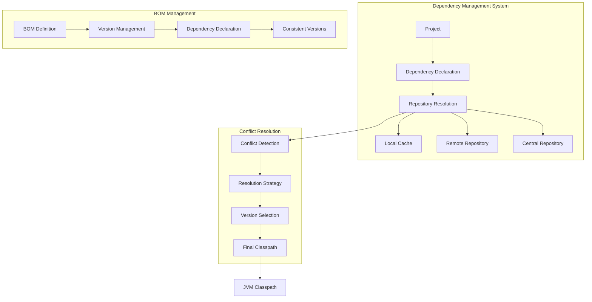
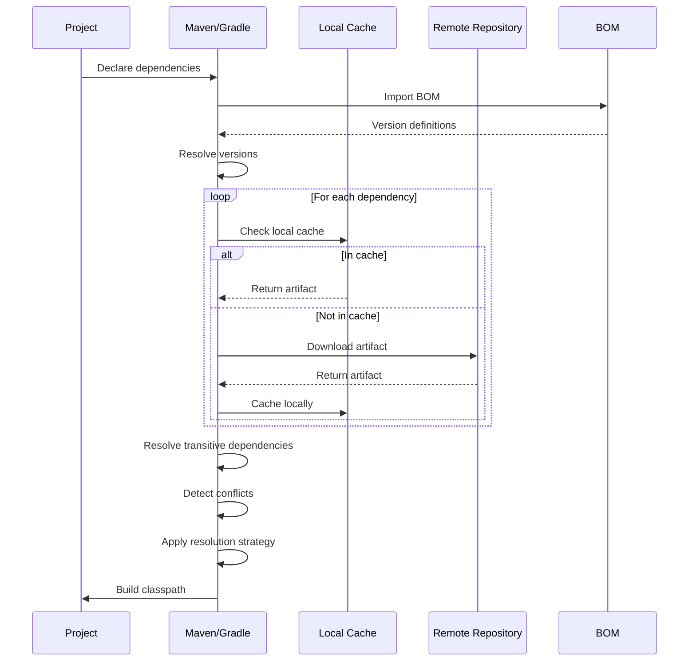

# 05. Dependency Management

## 1. Introduction

Dependency management is the process of automatically downloading, storing, and managing libraries that your project depends on. This module covers versioning strategies, conflict resolution, Bill of Materials (BOM), and dependency scopes in both Maven and Gradle.

## 2. Learning Objectives

- Understand dependency management concepts
- Master versioning strategies (semantic versioning, SNAPSHOT, release)
- Learn conflict resolution techniques
- Configure and use BOM (Bill of Materials)
- Understand dependency scopes and their implications
- Apply best practices for dependency management

## 3. Prerequisites

- Completed Maven or Gradle Fundamentals
- Understanding of project structure
- Basic knowledge of library ecosystems
- Familiarity with version control systems

## 4. Why This Concept Exists

Without proper dependency management:
- Manual download and management of JAR files
- Version conflicts between libraries
- Transitive dependency issues
- Security vulnerabilities from outdated libraries
- Difficult to update dependencies across projects

Dependency management solves:
- Automatic download and storage
- Version conflict resolution
- Transitive dependency handling
- Centralized version management
- Easy dependency updates

## 5. Problem Statement

Consider a project with multiple dependencies:
- Spring Framework 6.0.11
- Jackson JSON 2.15.2
- JUnit 5.9.3
- Hibernate 6.2.7

Challenges:
- Each library has its own transitive dependencies
- Different libraries may require different versions of the same dependency
- Updating one library may break compatibility with another
- Security vulnerabilities need to be addressed quickly

## 6. Theory

### 6.1 Semantic Versioning

Semantic versioning follows the pattern: MAJOR.MINOR.PATCH
- **MAJOR**: Incompatible API changes
- **MINOR**: New functionality (backward compatible)
- **PATCH**: Bug fixes (backward compatible)

### 6.2 Dependency Scopes

**Maven Scopes:**
- `compile`: Available in all classpaths
- `provided`: Expected to be provided by runtime
- `runtime`: Available at runtime only
- `test`: Available for testing only
- `system`: Similar to provided but explicit JAR

**Gradle Configurations:**
- `implementation`: Not exposed to consumers
- `api`: Exposed to consumers (transitive)
- `compileOnly`: Available at compile time only
- `runtimeOnly`: Available at runtime only
- `testImplementation`: For test compilation and execution

### 6.3 Bill of Materials (BOM)

A BOM is a POM that defines versions for a set of dependencies:
- Ensures consistent versions across modules
- Simplifies dependency declarations
- Manages transitive dependency versions

## 7. Internal Working

### 7.1 Dependency Resolution Process

```
1. Read dependency declarations
2. Check local repository/cache
3. If not found, check remote repositories
4. Download required artifacts
5. Resolve transitive dependencies
6. Build dependency tree
7. Detect conflicts
8. Apply conflict resolution strategy
9. Construct final classpath
```

### 7.2 Conflict Resolution

**Maven Strategy:**
- Nearest wins (dependency depth)
- First declaration wins (same depth)
- Explicit declarations override transitive

**Gradle Strategy:**
- Highest version wins
- Can force specific versions
- Can exclude dependencies

## 8. JVM Perspective

Dependency management affects JVM through:
- Classpath construction
- Classloader hierarchy
- Memory usage (loaded classes)
- Startup time (classpath scanning)

JVM class loading:
1. Bootstrap classloader (JDK classes)
2. Extension classloader (JDK extensions)
3. Application classloader (project classes)
4. Custom classloaders (for isolation)

## 9. Memory Representation

### Dependency Tree Structure

```
Root Project
├── Dependency A v1.0.0
│   ├── Transitive A1 v2.1.0
│   └── Transitive A2 v1.5.0
├── Dependency B v2.0.0
│   ├── Transitive B1 v1.0.0
│   └── Transitive A1 v2.0.0 [CONFLICT]
└── Dependency C v1.0.0
    └── Transitive A1 v2.1.0 [CONFLICT]
```

### Resolution Result

```
Resolved Dependencies
├── Dependency A v1.0.0
├── Dependency B v2.0.0
├── Dependency C v1.0.0
├── Transitive A1 v2.1.0 [WINNER]
├── Transitive A2 v1.5.0
└── Transitive B1 v1.0.0
```

## 10. Architecture Diagram (Mermaid)



## 11. Flow Diagram (Mermaid)



## 12. Syntax

### 12.1 Maven Dependency Declaration

```xml
<dependencies>
    <dependency>
        <groupId>org.springframework</groupId>
        <artifactId>spring-core</artifactId>
        <version>6.0.11</version>
    </dependency>
    
    <dependency>
        <groupId>com.fasterxml.jackson.core</groupId>
        <artifactId>jackson-databind</artifactId>
        <version>2.15.2</version>
    </dependency>
</dependencies>
```

### 12.2 Maven BOM Import

```xml
<dependencyManagement>
    <dependencies>
        <dependency>
            <groupId>org.springframework.boot</groupId>
            <artifactId>spring-boot-dependencies</artifactId>
            <version>3.1.3</version>
            <type>pom</type>
            <scope>import</scope>
        </dependency>
    </dependencies>
</dependencyManagement>
```

### 12.3 Gradle Dependency Declaration

```groovy
dependencies {
    implementation 'org.springframework:spring-core:6.0.11'
    implementation 'com.fasterxml.jackson.core:jackson-databind:2.15.2'
    
    testImplementation 'org.junit.jupiter:junit-jupiter:5.9.3'
    testRuntimeOnly 'org.junit.platform:junit-platform-launcher'
}
```

### 12.4 Gradle Version Catalog

```toml
# gradle/libs.versions.toml
[versions]
spring = "6.0.11"
jackson = "2.15.2"
junit = "5.9.3"

[libraries]
spring-core = { group = "org.springframework", name = "spring-core", version.ref = "spring" }
jackson-databind = { group = "com.fasterxml.jackson.core", name = "jackson-databind", version.ref = "jackson" }
junit-jupiter = { group = "org.junit.jupiter", name = "junit-jupiter", version.ref = "junit" }
```

## 13. Easy Example

### Basic Dependency Management

**Maven pom.xml:**
```xml
<project>
    <modelVersion>4.0.0</modelVersion>
    <groupId>com.example</groupId>
    <artifactId>dependency-demo</artifactId>
    <version>1.0.0</version>
    
    <properties>
        <spring.version>6.0.11</spring.version>
        <jackson.version>2.15.2</jackson.version>
    </properties>
    
    <dependencies>
        <dependency>
            <groupId>org.springframework</groupId>
            <artifactId>spring-core</artifactId>
            <version>${spring.version}</version>
        </dependency>
        <dependency>
            <groupId>com.fasterxml.jackson.core</groupId>
            <artifactId>jackson-databind</artifactId>
            <version>${jackson.version}</version>
        </dependency>
    </dependencies>
</project>
```

**Gradle build.gradle:**
```groovy
plugins {
    id 'java'
}

group = 'com.example'
version = '1.0.0'

repositories {
    mavenCentral()
}

dependencies {
    implementation 'org.springframework:spring-core:6.0.11'
    implementation 'com.fasterxml.jackson.core:jackson-databind:2.15.2'
    
    testImplementation 'org.junit.jupiter:junit-jupiter:5.9.3'
}

test {
    useJUnitPlatform()
}
```

## 14. Medium Example

### BOM Usage and Dependency Management

**Maven with BOM:**
```xml
<project>
    <modelVersion>4.0.0</modelVersion>
    <groupId>com.example</groupId>
    <artifactId>bom-demo</artifactId>
    <version>1.0.0</version>
    
    <dependencyManagement>
        <dependencies>
            <dependency>
                <groupId>org.springframework.boot</groupId>
                <artifactId>spring-boot-dependencies</artifactId>
                <version>3.1.3</version>
                <type>pom</type>
                <scope>import</scope>
            </dependency>
        </dependencies>
    </dependencyManagement>
    
    <dependencies>
        <dependency>
            <groupId>org.springframework.boot</groupId>
            <artifactId>spring-boot-starter-web</artifactId>
        </dependency>
        <dependency>
            <groupId>org.springframework.boot</groupId>
            <artifactId>spring-boot-starter-data-jpa</artifactId>
        </dependency>
    </dependencies>
</project>
```

**Gradle with Version Catalog:**
```groovy
plugins {
    id 'java-library'
}

group = 'com.example'
version = '1.0.0'

repositories {
    mavenCentral()
}

dependencies {
    implementation libs.spring.boot.starter.web
    implementation libs.spring.boot.starter.data.jpa
    
    testImplementation libs.junit.jupiter
}

test {
    useJUnitPlatform()
}
```

## 15. Hard Example

### Advanced Dependency Management with Exclusions

**Maven with Exclusions:**
```xml
<dependencies>
    <dependency>
        <groupId>org.springframework.boot</groupId>
        <artifactId>spring-boot-starter-data-jpa</artifactId>
        <exclusions>
            <exclusion>
                <groupId>com.zaxxer</groupId>
                <artifactId>HikariCP</artifactId>
            </exclusion>
        </exclusions>
    </dependency>
    
    <dependency>
        <groupId>com.zaxxer</groupId>
        <artifactId>HikariCP</artifactId>
        <version>5.0.1</version>
    </dependency>
</dependencies>
```

**Gradle with Dependency Constraints:**
```groovy
dependencies {
    implementation('org.springframework.boot:spring-boot-starter-data-jpa') {
        exclude group: 'com.zaxxer', module: 'HikariCP'
    }
    
    implementation('com.zaxxer:HikariCP:5.0.1')
    
    constraints {
        implementation('com.google.guava:guava:32.1.1-jre') {
            because 'CVE-2023-2976'
        }
    }
}
```

## 16. Enterprise Example

### Enterprise Dependency Management Strategy

**Parent POM with Dependency Management:**
```xml
<project>
    <modelVersion>4.0.0</modelVersion>
    <groupId>com.enterprise</groupId>
    <artifactId>enterprise-parent</artifactId>
    <version>2.0.0</version>
    <packaging>pom</packaging>
    
    <properties>
        <spring.version>6.0.11</spring.version>
        <hibernate.version>6.2.7</hibernate.version>
        <jackson.version>2.15.2</jackson.version>
        <lombok.version>1.18.28</lombok.version>
    </properties>
    
    <dependencyManagement>
        <dependencies>
            <!-- Spring BOM -->
            <dependency>
                <groupId>org.springframework</groupId>
                <artifactId>spring-framework-bom</artifactId>
                <version>${spring.version}</version>
                <type>pom</type>
                <scope>import</scope>
            </dependency>
            
            <!-- Hibernate BOM -->
            <dependency>
                <groupId>org.hibernate.orm</groupId>
                <artifactId>hibernate-platform</artifactId>
                <version>${hibernate.version}</version>
                <type>pom</type>
                <scope>import</scope>
            </dependency>
            
            <!-- Jackson BOM -->
            <dependency>
                <groupId>com.fasterxml.jackson</groupId>
                <artifactId>jackson-bom</artifactId>
                <version>${jackson.version}</version>
                <type>pom</type>
                <scope>import</scope>
            </dependency>
        </dependencies>
    </dependencyManagement>
    
    <dependencies>
        <dependency>
            <groupId>org.projectlombok</groupId>
            <artifactId>lombok</artifactId>
            <version>${lombok.version}</version>
            <scope>provided</scope>
        </dependency>
    </dependencies>
</project>
```

## 17. Performance

### Dependency Resolution Performance

| Metric | Typical Value | Optimization |
|--------|---------------|--------------|
| Resolution Time | 10-60 seconds | Use local mirrors |
| Download Time | 1-10 minutes | Use offline mode |
| Cache Hit Rate | 80-95% | Regular cache cleanup |
| Conflict Detection | 1-5 seconds | Minimize dependency tree |

### Performance Tips

1. **Use Offline Mode**: `mvn -o` or `--offline` when dependencies are cached
2. **Configure Mirrors**: Use local repository mirrors
3. **Minimize Dependencies**: Only include necessary dependencies
4. **Use BOMs**: Ensure consistent versions across modules
5. **Regular Cleanup**: Remove unused dependencies

## 18. Time & Space Complexity

### Dependency Resolution Complexity
- **Time**: O(n × m) where n = dependencies, m = repositories
- **Space**: O(d) where d = total dependency size
- **Conflict Detection**: O(n²) worst case for all-pairs comparison

### Classpath Construction
- **Time**: O(n + t) where n = direct deps, t = transitive deps
- **Space**: O(n + t) for storing resolved dependencies

## 19. Thread Safety

Dependency resolution is thread-safe in both Maven and Gradle:
- Local repository access is synchronized
- Remote downloads are parallelized
- Cache operations are atomic

```bash
# Parallel dependency resolution
mvn -T 4 dependency:resolve

# Gradle parallel builds
./gradlew build --parallel
```

## 20. Best Practices

1. **Use Properties/Variables**: Define versions in properties section
2. **Import BOMs**: Use BOMs for consistent version management
3. **Exclude Transitive**: Only include necessary dependencies
4. **Use Provided Scope**: For runtime-provided dependencies
5. **Regular Updates**: Keep dependencies up to date
6. **Security Audits**: Check for known vulnerabilities
7. **Document Decisions**: Document why specific versions are used

## 21. Common Mistakes

1. **Hardcoding Versions**: Using hardcoded versions instead of properties
2. **Ignoring Transitive Dependencies**: Not managing dependency conflicts
3. **Wrong Scope**: Using incorrect dependency scope
4. **Not Using BOMs**: Managing versions manually in each module
5. **Ignoring Security**: Not checking for known vulnerabilities
6. **Over-Dependency**: Including unnecessary dependencies

## 22. Pitfalls

1. **Dependency Hell**: Circular dependencies causing build failures
2. **Version Conflicts**: Multiple versions of same library
3. **Transitive Surprises**: Unexpected transitive dependencies
4. **Memory Issues**: Large dependency trees consuming memory
5. **Security Vulnerabilities**: Outdated libraries with known CVEs

## 23. Debugging Tips

```bash
# Maven dependency tree
mvn dependency:tree

# Maven dependency analysis
mvn dependency:analyze

# Gradle dependency tree
./gradlew dependencies

# Gradle dependency insight
./gradlew dependencyInsight --dependency spring-core

# Check for updates
mvn versions:display-dependency-updates

# Check for security vulnerabilities
mvn org.owasp:dependency-check-maven:check
```

## 24. Comparison Table

| Feature | Maven | Gradle | Ant |
|---------|-------|--------|-----|
| Dependency Management | Built-in | Built-in | Manual |
| Conflict Resolution | Nearest wins | Highest version | Manual |
| BOM Support | Yes | Via platform | No |
| Transitive Dependencies | Yes | Yes | Manual |
| Version Catalogs | No | Yes | No |
| Offline Mode | Yes | Yes | N/A |
| Cache | ~/.m2 | ~/.gradle | N/A |

## 25. Decision Tree

```
How to manage dependency versions?
├── Is this a single module project?
│   ├── Yes → Use properties in POM/build.gradle
│   └── No → Consider BOM or parent POM
├── Are there multiple modules sharing dependencies?
│   ├── Yes → Use BOM or parent POM with dependencyManagement
│   └── No → Use properties
└── Do you need type safety?
    ├── Yes → Use Gradle version catalogs
    └── No → Maven properties or Gradle ext

How to handle version conflicts?
├── Is the conflict in direct dependencies?
│   ├── Yes → Explicitly declare the desired version
│   └── No → Use dependency management or exclusions
├── Is the conflict critical?
│   ├── Yes → Force the desired version
│   └── No → Let build tool resolve
└── Is the conflict causing runtime issues?
    ├── Yes → Exclude problematic transitive dependency
    └── No → Monitor and update if needed
```

## 26. Interview Questions

### Basic Level

1. **What is dependency management?**
   - The process of automatically downloading, storing, and managing libraries that your project depends on.

2. **What is a transitive dependency?**
   - A dependency that is required by one of your direct dependencies.

3. **What is the difference between `compile` and `provided` scope?**
   - `compile` is available in all classpaths; `provided` is expected to be provided by the runtime environment.

4. **What is a BOM (Bill of Materials)?**
   - A POM that defines versions for a set of dependencies to ensure consistency.

5. **How do you exclude a transitive dependency?**
   - Use exclusion elements in dependency declarations.

### Intermediate Level

6. **What is semantic versioning?**
   - A versioning scheme using MAJOR.MINOR.PATCH format with specific meaning for each part.

7. **How does Maven resolve version conflicts?**
   - Maven uses a "nearest wins" strategy based on dependency depth.

8. **How does Gradle resolve version conflicts?**
   - Gradle uses a "highest version wins" strategy by default.

9. **What is the difference between `implementation` and `api` in Gradle?**
   - `implementation` doesn't expose dependencies to consumers; `api` does.

10. **What is a version catalog in Gradle?**
    - A centralized place to define dependency versions in a TOML file.

### Advanced Level

11. **How do you manage dependency versions in a multi-module Maven project?**
    - Use `<dependencyManagement>` in parent POM or import BOMs.

12. **What is the difference between BOM and parent POM?**
    - BOM only defines versions; parent POM can define dependencies and configuration.

13. **How do you audit dependencies for security vulnerabilities?**
    - Use tools like OWASP dependency-check or Snyk.

14. **What is a dependency constraint in Gradle?**
    - A way to specify version requirements without adding the dependency.

15. **How do you handle SNAPSHOT versions in Maven?**
    - SNAPSHOT versions are updated on each build; use `-U` flag to force update.

16. **What is the difference between `mvn dependency:resolve` and `mvn dependency:tree`?**
    - `resolve` downloads dependencies; `tree` displays the dependency hierarchy.

17. **How do you optimize dependency resolution performance?**
    - Use offline mode, configure mirrors, and minimize dependency tree.

## 27. Exercises

### Level 1 (Easy)

1. Create a Maven project with three dependencies and visualize the dependency tree.
2. Identify any transitive dependencies and their versions.
3. Use properties to manage dependency versions.

### Level 2 (Medium)

1. Create a multi-module Maven project with a parent POM that defines dependency versions.
2. Import a BOM (e.g., Spring Boot BOM) and use managed versions.
3. Resolve a version conflict between two dependencies.

### Level 3 (Hard)

1. Create a Gradle project with a version catalog for centralized version management.
2. Configure dependency constraints for security reasons.
3. Write a script to audit dependencies for known vulnerabilities.

## 28. Summary

Dependency management is essential for:
- **Automatic Resolution**: Download and manage libraries
- **Version Control**: Ensure consistent versions across modules
- **Conflict Resolution**: Handle version conflicts automatically
- **Security**: Manage known vulnerabilities

Key takeaways:
- Use properties/variables for version management
- Import BOMs for consistent versions across modules
- Regularly audit dependencies for security vulnerabilities
- Understand dependency scopes and their implications

## 29. References

1. [Maven Dependency Management](https://maven.apache.org/guides/mini/guide-configuring-dependencies.html)
2. [Gradle Dependency Management](https://docs.gradle.org/current/userguide/dependency_management.html)
3. [Maven BOM Import](https://maven.apache.org/guides/mini/guide-configuring-dependencies.html#dependency-management-import)
4. [Gradle Version Catalogs](https://docs.gradle.org/current/userguide/platforms.html)
5. [OWASP Dependency Check](https://owasp.org/www-project-dependency-check/)
