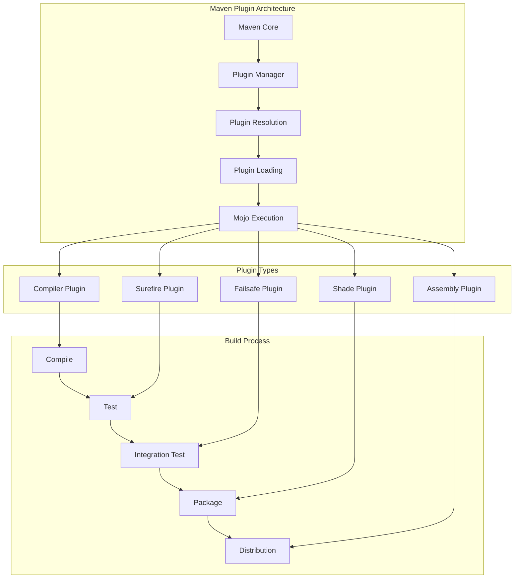
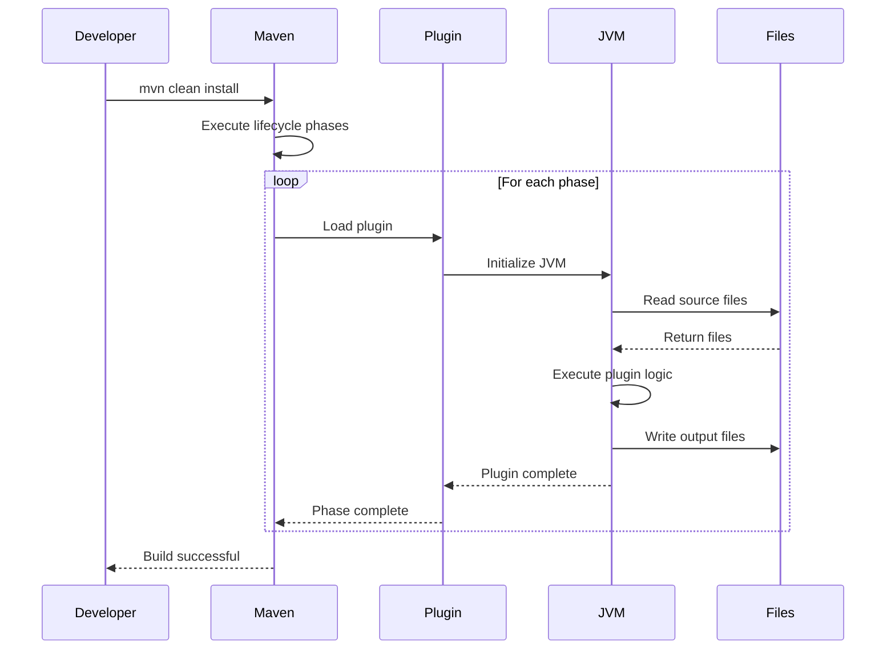

# 06. Maven Plugins

## 1. Introduction

Maven plugins are the backbone of Maven's functionality. They provide the actual behavior for build phases and can be used to perform a wide variety of tasks. This module covers essential Maven plugins including Surefire, Failsafe, Compiler, Shade, and Assembly plugins.

## 2. Learning Objectives

- Understand Maven plugin architecture
- Configure and use Surefire plugin for unit tests
- Configure and use Failsafe plugin for integration tests
- Master Compiler plugin configuration
- Create uber-jars with Shade plugin
- Build distributions with Assembly plugin

## 3. Prerequisites

- Completed Maven Fundamentals
- Understanding of Maven lifecycle phases
- Basic knowledge of testing concepts
- Familiarity with Java build processes

## 4. Why This Concept Exists

Without plugins, Maven would be limited to basic compilation:
- No automated testing
- No code coverage reports
- No fat JARs or WAR files
- No custom build processes

Plugins extend Maven functionality:
- Automated test execution
- Code quality checks
- Package creation
- Deployment automation
- Custom build tasks

## 5. Problem Statement

Consider a typical Java project:
- Needs to compile Java code
- Must run unit and integration tests
- Should generate code coverage reports
- Requires packaging as JAR or WAR
- Needs to create distribution packages

Without plugins:
- Manual compilation and testing
- No standardized packaging
- No code quality enforcement
- No automated deployment

## 6. Theory

### 6.1 Plugin Architecture

Maven plugins consist of:
- **Mojo**: Maven Old Java Object (plugin goal)
- **Goal**: A specific task (compile, test, package)
- **Phase**: Lifecycle phase where goal is executed
- **Configuration**: Plugin-specific settings

### 6.2 Plugin Types

1. **Core Plugins**: Part of Maven (compiler, surefire, etc.)
2. **Third-party Plugins**: Community or vendor plugins
3. **Custom Plugins**: Organization-specific plugins

### 6.3 Plugin Execution

Plugins execute during lifecycle phases:
- `generate-sources`: Source code generation
- `compile`: Code compilation
- `test-compile`: Test compilation
- `test`: Unit test execution
- `package`: Artifact packaging
- `install`: Install to local repository
- `deploy`: Deploy to remote repository

## 7. Internal Working

### 7.1 Plugin Loading Process

```
1. Read pom.xml plugin configuration
2. Resolve plugin dependencies
3. Download plugin JARs if needed
4. Load plugin using classloader
5. Create Mojo instance
6. Inject configuration parameters
7. Execute Mojo
```

### 7.2 Surefire Plugin Execution

```
1. Scan test classes (Test*.java, *Test.java, etc.)
2. Create test classloader
3. Execute tests in forks
4. Capture test results
5. Generate test reports
6. Aggregate results
```

## 8. JVM Perspective

Plugins affect JVM through:
- **Classloader Isolation**: Each plugin has its own classloader
- **Forked JVMs**: Some plugins run in separate JVMs
- **Memory Management**: Plugins allocate memory for their tasks
- **Hot Compilation**: Compiler plugin uses incremental compilation

Forking strategy:
- Compiler plugin: Runs in Maven JVM
- Surefire plugin: Forks separate JVM for tests
- Failsafe plugin: Forks separate JVM for integration tests

## 9. Memory Representation

### Plugin Configuration

```
Plugin Object
├── GroupId (String)
├── ArtifactId (String)
├── Version (String)
├── Configuration (Xpp3Dom)
│   ├── Parameter 1 (Object)
│   └── Parameter 2 (Object)
└── Dependencies (List<Dependency>)
```

### Test Execution Memory

```
Surefire Fork JVM
├── Test ClassLoader
│   ├── Project Classes
│   ├── Test Dependencies
│   └── Test Classes
├── Test Runner
│   ├── JUnit 5 Engine
│   ├── Test Instance
│   └── Test Results
└── Memory Pool
    ├── Eden Space
    ├── Survivor Space
    └── Old Generation
```

## 10. Architecture Diagram (Mermaid)



## 11. Flow Diagram (Mermaid)



## 12. Syntax

### 12.1 Compiler Plugin Configuration

```xml
<build>
    <plugins>
        <plugin>
            <groupId>org.apache.maven.plugins</groupId>
            <artifactId>maven-compiler-plugin</artifactId>
            <version>3.11.0</version>
            <configuration>
                <source>21</source>
                <target>21</target>
                <encoding>UTF-8</encoding>
                <compilerArgs>
                    <arg>-Xlint:unchecked</arg>
                    <arg>-Xlint:deprecation</arg>
                </compilerArgs>
            </configuration>
        </plugin>
    </plugins>
</build>
```

### 12.2 Surefire Plugin Configuration

```xml
<plugin>
    <groupId>org.apache.maven.plugins</groupId>
    <artifactId>maven-surefire-plugin</artifactId>
    <version>3.1.2</version>
    <configuration>
        <includes>
            <include>**/*Test.java</include>
            <include>**/Test*.java</include>
        </includes>
        <excludes>
            <exclude>**/IntegrationTest.java</exclude>
        </excludes>
        <forkCount>1</forkCount>
        <reuseForks>true</reuseForks>
        <argLine>-Xmx1024m</argLine>
    </configuration>
</plugin>
```

### 12.3 Shade Plugin Configuration

```xml
<plugin>
    <groupId>org.apache.maven.plugins</groupId>
    <artifactId>maven-shade-plugin</artifactId>
    <version>3.5.0</version>
    <executions>
        <execution>
            <phase>package</phase>
            <goals>
                <goal>shade</goal>
            </goals>
            <configuration>
                <transformers>
                    <transformer implementation="org.apache.maven.plugins.shade.resource.ManifestResourceTransformer">
                        <mainClass>com.example.Main</mainClass>
                    </transformer>
                </transformers>
            </configuration>
        </execution>
    </executions>
</plugin>
```

## 13. Easy Example

### Basic Compiler Configuration

```xml
<project>
    <modelVersion>4.0.0</modelVersion>
    <groupId>com.example</groupId>
    <artifactId>compiler-demo</artifactId>
    <version>1.0.0</version>
    
    <properties>
        <maven.compiler.source>21</maven.compiler.source>
        <maven.compiler.target>21</maven.compiler.target>
        <project.build.sourceEncoding>UTF-8</project.build.sourceEncoding>
    </properties>
    
    <build>
        <plugins>
            <plugin>
                <groupId>org.apache.maven.plugins</groupId>
                <artifactId>maven-compiler-plugin</artifactId>
                <version>3.11.0</version>
            </plugin>
            <plugin>
                <groupId>org.apache.maven.plugins</groupId>
                <artifactId>maven-surefire-plugin</artifactId>
                <version>3.1.2</version>
            </plugin>
        </plugins>
    </build>
    
    <dependencies>
        <dependency>
            <groupId>org.junit.jupiter</groupId>
            <artifactId>junit-jupiter</artifactId>
            <version>5.9.3</version>
            <scope>test</scope>
        </dependency>
    </dependencies>
</project>
```

## 14. Medium Example

### Integration Test Configuration

```xml
<project>
    <modelVersion>4.0.0</modelVersion>
    <groupId>com.example</groupId>
    <artifactId>integration-demo</artifactId>
    <version>1.0.0</version>
    
    <build>
        <plugins>
            <!-- Unit Tests -->
            <plugin>
                <groupId>org.apache.maven.plugins</groupId>
                <artifactId>maven-surefire-plugin</artifactId>
                <version>3.1.2</version>
                <configuration>
                    <includes>
                        <include>**/*Test.java</include>
                    </includes>
                </configuration>
            </plugin>
            
            <!-- Integration Tests -->
            <plugin>
                <groupId>org.apache.maven.plugins</groupId>
                <artifactId>maven-failsafe-plugin</artifactId>
                <version>3.1.2</version>
                <executions>
                    <execution>
                        <goals>
                            <goal>integration-test</goal>
                            <goal>verify</goal>
                        </goals>
                    </execution>
                </executions>
                <configuration>
                    <includes>
                        <include>**/*IT.java</include>
                        <include>**/*IntegrationTest.java</include>
                    </includes>
                </configuration>
            </plugin>
        </plugins>
    </build>
</project>
```

## 15. Hard Example

### Complete Build Configuration

```xml
<project>
    <modelVersion>4.0.0</modelVersion>
    <groupId>com.enterprise</groupId>
    <artifactId>enterprise-app</artifactId>
    <version>2.0.0</version>
    <packaging>jar</packaging>
    
    <properties>
        <java.version>21</java.version>
        <maven.compiler.source>${java.version}</maven.compiler.source>
        <maven.compiler.target>${java.version}</maven.compiler.target>
    </properties>
    
    <build>
        <plugins>
            <!-- Compiler Plugin -->
            <plugin>
                <groupId>org.apache.maven.plugins</groupId>
                <artifactId>maven-compiler-plugin</artifactId>
                <version>3.11.0</version>
                <configuration>
                    <source>${java.version}</source>
                    <target>${java.version}</target>
                    <annotationProcessorPaths>
                        <path>
                            <groupId>org.projectlombok</groupId>
                            <artifactId>lombok</artifactId>
                            <version>1.18.28</version>
                        </path>
                    </annotationProcessorPaths>
                </configuration>
            </plugin>
            
            <!-- Surefire Plugin -->
            <plugin>
                <groupId>org.apache.maven.plugins</groupId>
                <artifactId>maven-surefire-plugin</artifactId>
                <version>3.1.2</version>
                <configuration>
                    <argLine>-Xmx1024m</argLine>
                </configuration>
            </plugin>
            
            <!-- Failsafe Plugin -->
            <plugin>
                <groupId>org.apache.maven.plugins</groupId>
                <artifactId>maven-failsafe-plugin</artifactId>
                <version>3.1.2</version>
                <executions>
                    <execution>
                        <goals>
                            <goal>integration-test</goal>
                            <goal>verify</goal>
                        </goals>
                    </execution>
                </executions>
            </plugin>
            
            <!-- Shade Plugin -->
            <plugin>
                <groupId>org.apache.maven.plugins</groupId>
                <artifactId>maven-shade-plugin</artifactId>
                <version>3.5.0</version>
                <executions>
                    <execution>
                        <phase>package</phase>
                        <goals>
                            <goal>shade</goal>
                        </goals>
                        <configuration>
                            <transformers>
                                <transformer implementation="org.apache.maven.plugins.shade.resource.ManifestResourceTransformer">
                                    <mainClass>com.enterprise.Main</mainClass>
                                </transformer>
                                <transformer implementation="org.apache.maven.plugins.shade.resource.ServicesResourceTransformer"/>
                            </transformers>
                        </configuration>
                    </execution>
                </executions>
            </plugin>
        </plugins>
    </build>
</project>
```

## 16. Enterprise Example

### Full Enterprise Build Configuration

```xml
<project>
    <modelVersion>4.0.0</modelVersion>
    <groupId>com.enterprise</groupId>
    <artifactId>enterprise-platform</artifactId>
    <version>2.0.0</version>
    <packaging>jar</packaging>
    
    <properties>
        <java.version>21</java.version>
        <maven.compiler.source>${java.version}</maven.compiler.source>
        <maven.compiler.target>${java.version}</maven.compiler.target>
        <project.build.sourceEncoding>UTF-8</project.build.sourceEncoding>
        <jacoco.version>0.8.10</jacoco.version>
        <checkstyle.version>10.12.2</checkstyle.version>
        <spotbugs.version>4.7.3.5</spotbugs.version>
    </properties>
    
    <build>
        <plugins>
            <!-- Compiler Plugin -->
            <plugin>
                <groupId>org.apache.maven.plugins</groupId>
                <artifactId>maven-compiler-plugin</artifactId>
                <version>3.11.0</version>
                <configuration>
                    <source>${java.version}</source>
                    <target>${java.version}</target>
                    <annotationProcessorPaths>
                        <path>
                            <groupId>org.projectlombok</groupId>
                            <artifactId>lombok</artifactId>
                            <version>1.18.28</version>
                        </path>
                    </annotationProcessorPaths>
                </configuration>
            </plugin>
            
            <!-- Surefire Plugin -->
            <plugin>
                <groupId>org.apache.maven.plugins</groupId>
                <artifactId>maven-surefire-plugin</artifactId>
                <version>3.1.2</version>
                <configuration>
                    <argLine>-Xmx1024m ${argLine}</argLine>
                </configuration>
            </plugin>
            
            <!-- Failsafe Plugin -->
            <plugin>
                <groupId>org.apache.maven.plugins</groupId>
                <artifactId>maven-failsafe-plugin</artifactId>
                <version>3.1.2</version>
                <executions>
                    <execution>
                        <goals>
                            <goal>integration-test</goal>
                            <goal>verify</goal>
                        </goals>
                    </execution>
                </executions>
            </plugin>
            
            <!-- JaCoCo Plugin -->
            <plugin>
                <groupId>org.jacoco</groupId>
                <artifactId>jacoco-maven-plugin</artifactId>
                <version>${jacoco.version}</version>
                <executions>
                    <execution>
                        <goals>
                            <goal>prepare-agent</goal>
                        </goals>
                    </execution>
                    <execution>
                        <id>report</id>
                        <phase>test</phase>
                        <goals>
                            <goal>report</goal>
                        </goals>
                    </execution>
                </executions>
            </plugin>
            
            <!-- Checkstyle Plugin -->
            <plugin>
                <groupId>org.apache.maven.plugins</groupId>
                <artifactId>maven-checkstyle-plugin</artifactId>
                <version>3.3.0</version>
                <dependencies>
                    <dependency>
                        <groupId>com.puppycrawl.tools</groupId>
                        <artifactId>checkstyle</artifactId>
                        <version>${checkstyle.version}</version>
                    </dependency>
                </dependencies>
                <configuration>
                    <configLocation>checkstyle.xml</configLocation>
                </configuration>
            </plugin>
            
            <!-- SpotBugs Plugin -->
            <plugin>
                <groupId>com.github.spotbugs</groupId>
                <artifactId>spotbugs-maven-plugin</artifactId>
                <version>${spotbugs.version}</version>
            </plugin>
            
            <!-- Shade Plugin -->
            <plugin>
                <groupId>org.apache.maven.plugins</groupId>
                <artifactId>maven-shade-plugin</artifactId>
                <version>3.5.0</version>
                <executions>
                    <execution>
                        <phase>package</phase>
                        <goals>
                            <goal>shade</goal>
                        </goals>
                        <configuration>
                            <transformers>
                                <transformer implementation="org.apache.maven.plugins.shade.resource.ManifestResourceTransformer">
                                    <mainClass>com.enterprise.Main</mainClass>
                                </transformer>
                            </transformers>
                        </configuration>
                    </execution>
                </executions>
            </plugin>
        </plugins>
    </build>
</project>
```

## 17. Performance

### Plugin Performance Metrics

| Plugin | Typical Time | Optimization |
|--------|--------------|--------------|
| Compiler | 5-30 seconds | Incremental compilation |
| Surefire | 10-60 seconds | Parallel test execution |
| Failsafe | 30-120 seconds | Parallel execution |
| Shade | 10-60 seconds | Minimize dependencies |
| Assembly | 5-30 seconds | Optimize file selection |

### Performance Tips

1. **Use Incremental Compilation**: Only compile changed files
2. **Parallel Test Execution**: Use `-DforkCount=4`
3. **Skip Tests When Needed**: `-DskipTests` for faster builds
4. **Minimize Shade Plugin**: Only include necessary dependencies
5. **Use Build Cache**: Cache plugin outputs

## 18. Time & Space Complexity

### Compiler Plugin
- **Time**: O(n) where n = source files
- **Space**: O(n) for compiled classes

### Surefire Plugin
- **Time**: O(t) where t = test count
- **Space**: O(t × m) where m = memory per test

### Shade Plugin
- **Time**: O(d) where d = dependency count
- **Space**: O(s) where s = total artifact size

## 19. Thread Safety

### Parallel Test Execution

```xml
<plugin>
    <groupId>org.apache.maven.plugins</groupId>
    <artifactId>maven-surefire-plugin</artifactId>
    <version>3.1.2</version>
    <configuration>
        <forkCount>4</forkCount>
        <reuseForks>true</reuseForks>
    </configuration>
</plugin>
```

Thread safety considerations:
- Tests must be independent
- No shared mutable state
- Proper cleanup between tests
- Resource management

## 20. Best Practices

1. **Use Plugin Management**: Define plugin versions in parent POM
2. **Configure Once**: Reuse plugin configurations
3. **Use Appropriate Phase**: Execute plugins at correct lifecycle phase
4. **Limit Scope**: Only configure what's needed
5. **Use Properties**: Make configurations configurable
6. **Document Configuration**: Explain non-obvious settings
7. **Test Configurations**: Verify plugin behavior

## 21. Common Mistakes

1. **Wrong Plugin Version**: Using incompatible plugin versions
2. **Missing Configuration**: Not configuring plugins properly
3. **Wrong Phase**: Executing plugins at wrong lifecycle phase
4. **Over-Configuration**: Configuring unnecessary options
5. **Ignoring Defaults**: Not using plugin default configurations
6. **Missing Dependencies**: Not including required plugin dependencies

## 22. Pitfalls

1. **Plugin Conflicts**: Multiple plugins trying to do the same thing
2. **Memory Issues**: Plugins consuming too much memory
3. **Slow Builds**: Inefficient plugin configurations
4. **Forking Issues**: Problems with forked JVMs
5. **Cache Problems**: Plugin caching issues

## 23. Debugging Tips

```bash
# Debug plugin execution
mvn -X plugin:compiler:compile

# Show effective plugin configuration
mvn help:effective-pom

# Check plugin versions
mvn versions:display-plugin-updates

# Debug Surefire execution
mvn -X test

# Check plugin dependencies
mvn dependency:tree -Dincludes=org.apache.maven.plugins
```

## 24. Comparison Table

| Plugin | Purpose | Phase | Forking |
|--------|---------|-------|---------|
| Compiler | Compile Java code | compile | No |
| Surefire | Run unit tests | test | Yes |
| Failsafe | Run integration tests | verify | Yes |
| Shade | Create uber-jar | package | No |
| Assembly | Create distribution | package | No |

## 25. Decision Tree

```
Which plugin to use?
├── Need to compile code?
│   ├── Yes → Use Compiler plugin
│   └── No → Skip
├── Need to run unit tests?
│   ├── Yes → Use Surefire plugin
│   └── No → Skip
├── Need to run integration tests?
│   ├── Yes → Use Failsafe plugin
│   └── No → Skip
├── Need to create uber-jar?
│   ├── Yes → Use Shade plugin
│   └── No → Skip
└── Need to create distribution?
    ├── Yes → Use Assembly plugin
    └── No → Skip
```

## 26. Interview Questions

### Basic Level

1. **What is a Maven plugin?**
   - A component that extends Maven functionality by providing goals that execute during lifecycle phases.

2. **What is the difference between Surefire and Failsafe?**
   - Surefire runs unit tests; Failsafe runs integration tests.

3. **What is the purpose of the Compiler plugin?**
   - Compiles Java source code to bytecode.

4. **What is the Shade plugin used for?**
   - Creates an uber-jar with all dependencies included.

5. **What is the Assembly plugin used for?**
   - Creates distribution packages (ZIP, TAR, etc.).

### Intermediate Level

6. **How do you configure the Compiler plugin for Java 21?**
   - Set source and target properties to 21.

7. **How do you run tests in parallel with Surefire?**
   - Configure forkCount and parallel settings.

8. **What is the difference between `compile` and `testCompile` phases?**
   - `compile` compiles main sources; `testCompile` compiles test sources.

9. **How do you skip tests in Maven?**
   - Use `-DskipTests` or `-Dmaven.test.skip=true`.

10. **What is the purpose of the `prepare-agent` goal in JaCoCo?**
    - Sets up the Java agent for code coverage.

### Advanced Level

11. **How do you configure annotation processing with the Compiler plugin?**
    - Use annotationProcessorPaths configuration.

12. **What is the difference between `forkCount` and `reuseForks`?**
    - `forkCount` determines number of forked JVMs; `reuseForks` determines if JVMs are reused.

13. **How do you create a fat JAR with dependencies?**
    - Use Shade plugin with ManifestResourceTransformer.

14. **What is the purpose of the `verify` phase?**
    - Runs verification checks and integration tests.

15. **How do you configure plugin execution for specific profiles?**
    - Define plugin configuration within profile elements.

16. **What is the difference between `executions` and `configuration`?**
    - `executions` defines when and how to execute; `configuration` defines plugin-specific settings.

17. **How do you debug plugin execution?**
    - Use `-X` flag for debug output or `-Xdebug` for JVM debugging.

## 27. Exercises

### Level 1 (Easy)

1. Create a Maven project with the Compiler plugin configured for Java 21.
2. Add the Surefire plugin and run unit tests.
3. Generate test reports and verify they work.

### Level 2 (Medium)

1. Configure the Failsafe plugin for integration tests.
2. Create integration test classes and run them.
3. Configure JaCoCo for code coverage.

### Level 3 (Hard)

1. Create a complete build configuration with Compiler, Surefire, Failsafe, and Shade plugins.
2. Configure parallel test execution.
3. Create a distribution package using the Assembly plugin.

## 28. Summary

Maven plugins are essential for:
- **Compilation**: Compiler plugin for Java code
- **Testing**: Surefire for unit tests, Failsafe for integration tests
- **Packaging**: Shade for uber-jars, Assembly for distributions
- **Quality**: JaCoCo, Checkstyle, SpotBugs

Key takeaways:
- Configure plugins in parent POM for consistency
- Use appropriate plugins for each task
- Configure plugins for performance
- Document plugin configurations

## 29. References

1. [Maven Compiler Plugin](https://maven.apache.org/plugins/maven-compiler-plugin/)
2. [Maven Surefire Plugin](https://maven.apache.org/surefire/maven-surefire-plugin/)
3. [Maven Failsafe Plugin](https://maven.apache.org/surefire/maven-failsafe-plugin/)
4. [Maven Shade Plugin](https://maven.apache.org/plugins/maven-shade-plugin/)
5. [Maven Assembly Plugin](https://maven.apache.org/plugins/maven-assembly-plugin/)
