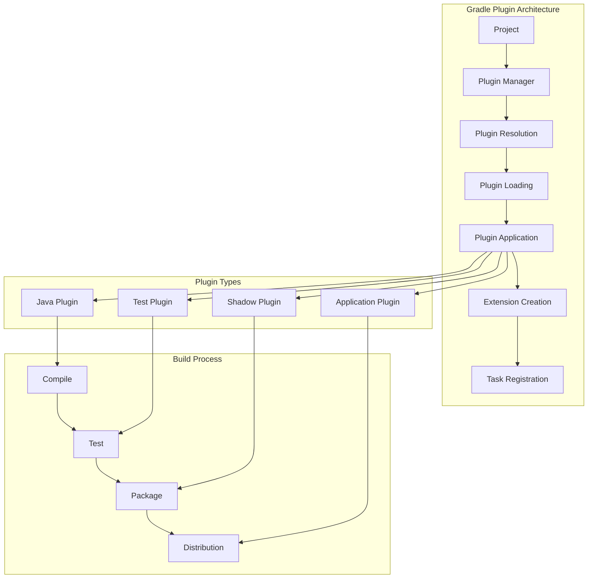
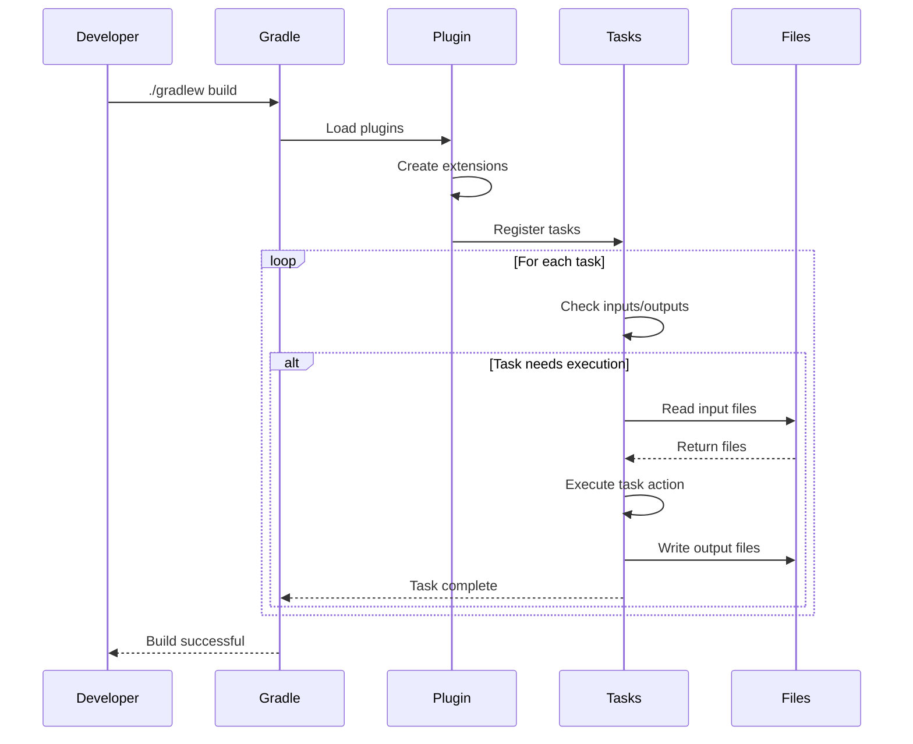

# 07. Gradle Plugins

## 1. Introduction

Gradle plugins extend the build functionality by providing reusable build logic. This module covers essential Gradle plugins including Java, Application, Shadow, and Test plugins. Understanding these plugins is crucial for effective Gradle build configuration.

## 2. Learning Objectives

- Understand Gradle plugin architecture
- Configure and use the Java plugin
- Create executable applications with the Application plugin
- Build uber-jars with the Shadow plugin
- Configure test execution with the Test plugin
- Develop custom Gradle plugins

## 3. Prerequisites

- Completed Gradle Fundamentals
- Understanding of Groovy or Kotlin DSL
- Basic knowledge of Java project structure
- Familiarity with build automation concepts

## 4. Why This Concept Exists

Without plugins, Gradle would have limited functionality:
- No standard Java compilation
- No test execution framework
- No application packaging
- No code quality tools

Plugins provide:
- Standardized build processes
- Reusable build logic
- Rich ecosystem of tools
- Easy extension of functionality

## 5. Problem Statement

Consider a Java application project:
- Needs to compile Java code
- Must run unit tests
- Should be executable from command line
- Requires code coverage reports
- Needs packaging for deployment

Without plugins:
- Manual compilation and testing
- No standardized application structure
- No automated packaging
- No code quality enforcement

## 6. Theory

### 6.1 Plugin Architecture

Gradle plugins consist of:
- **Plugin Interface**: Defines plugin behavior
- **Extension Objects**: Configuration points
- **Tasks**: Units of work
- **Dependencies**: Plugin dependencies

### 6.2 Plugin Application

Plugins can be applied via:
- `plugins` block (recommended)
- `apply plugin:` syntax (legacy)
- `buildSrc` for convention plugins

### 6.3 Plugin Types

1. **Core Plugins**: Part of Gradle distribution
2. **Community Plugins**: Available from plugin portal
3. **Custom Plugins**: Organization-specific plugins

## 7. Internal Working

### 7.1 Plugin Loading Process

```
1. Parse plugins block
2. Resolve plugin dependencies
3. Download plugin JARs if needed
4. Load plugin class
5. Create plugin instance
6. Apply plugin to project
7. Configure extensions
8. Register tasks
```

### 7.2 Task Creation

```
1. Plugin creates tasks
2. Configure task properties
3. Set task dependencies
4. Register with task container
5. Make available for execution
```

## 8. JVM Perspective

Plugins affect JVM through:
- **Classpath Management**: Plugin classpath isolation
- **Task Execution**: JVM for task actions
- **Forking**: Separate JVMs for tests
- **Memory Management**: Plugin memory allocation

JVM considerations:
- Plugin classes loaded in separate classloader
- Tasks can fork new JVMs
- Memory settings affect performance
- Garbage collection impacts build time

## 9. Memory Representation

### Plugin Structure

```
Plugin Object
├── Plugin Class
├── Extension Objects
│   ├── JavaExtension
│   ├── ApplicationExtension
│   └── TestExtension
├── Tasks (TaskContainer)
│   ├── compileJava
│   ├── test
│   └── jar
└── Dependencies (DependencyHandler)
    ├── implementation
    ├── testImplementation
    └── runtimeOnly
```

### Task Graph

```
Task Graph
├── compileJava → [compileJava]
├── processResources → [processResources]
├── classes → [compileJava, processResources]
├── test → [classes, test]
├── jar → [classes]
└── build → [test, jar]
```

## 10. Architecture Diagram (Mermaid)



## 11. Flow Diagram (Mermaid)



## 12. Syntax

### 12.1 Java Plugin (Groovy DSL)

```groovy
plugins {
    id 'java'
}

group = 'com.example'
version = '1.0.0'

repositories {
    mavenCentral()
}

dependencies {
    implementation 'org.springframework:spring-core:6.0.11'
    testImplementation 'org.junit.jupiter:junit-jupiter:5.9.3'
    testRuntimeOnly 'org.junit.platform:junit-platform-launcher'
}

test {
    useJUnitPlatform()
}
```

### 12.2 Application Plugin (Groovy DSL)

```groovy
plugins {
    id 'java'
    id 'application'
}

application {
    mainClass = 'com.example.Main'
    
    distributions {
        main {
            contents {
                from(configurations.runtimeClasspath) {
                    into 'lib'
                }
            }
        }
    }
}
```

### 12.3 Shadow Plugin (Groovy DSL)

```groovy
plugins {
    id 'java'
    id 'com.github.johnrengelman.shadow' version '8.1.1'
}

shadowJar {
    archiveBaseName.set('my-app')
    archiveClassifier.set('')
    archiveVersion.set('1.0.0')
    
    manifest {
        attributes 'Main-Class': 'com.example.Main'
    }
    
    mergeServiceFiles()
}
```

### 12.4 Test Plugin (Kotlin DSL)

```kotlin
plugins {
    java
}

tasks.test {
    useJUnitPlatform()
    
    maxParallelForks = (Runtime.getRuntime().availableProcessors() / 2).coerceAtLeast(1)
    forkEvery = 100
    
    jvmArgs = listOf("-Xmx1024m", "-XX:MaxPermSize=256m")
    
    testLogging {
        events("passed", "skipped", "failed")
        showStandardStreams = true
    }
}
```

## 13. Easy Example

### Basic Java Project

**build.gradle:**
```groovy
plugins {
    id 'java'
}

group = 'com.example'
version = '1.0.0'

repositories {
    mavenCentral()
}

dependencies {
    testImplementation 'org.junit.jupiter:junit-jupiter:5.9.3'
    testRuntimeOnly 'org.junit.platform:junit-platform-launcher'
}

test {
    useJUnitPlatform()
}
```

**src/main/java/com/example/Calculator.java:**
```java
package com.example;

public class Calculator {
    public int add(int a, int b) {
        return a + b;
    }
    
    public int subtract(int a, int b) {
        return a - b;
    }
}
```

**src/test/java/com/example/CalculatorTest.java:**
```java
package com.example;

import org.junit.jupiter.api.Test;
import static org.junit.jupiter.api.Assertions.*;

class CalculatorTest {
    @Test
    void testAdd() {
        Calculator calc = new Calculator();
        assertEquals(5, calc.add(2, 3));
    }
}
```

### Build Commands

```bash
# Build project
./gradlew build

# Run tests
./gradlew test

# Clean build
./gradlew clean build
```

## 14. Medium Example

### Application with Distribution

**build.gradle:**
```groovy
plugins {
    id 'java'
    id 'application'
}

group = 'com.example'
version = '1.0.0'

repositories {
    mavenCentral()
}

dependencies {
    implementation 'org.springframework:spring-core:6.0.11'
    testImplementation 'org.junit.jupiter:junit-jupiter:5.9.3'
}

application {
    mainClass = 'com.example.Main'
    
    distributions {
        main {
            contents {
                from(configurations.runtimeClasspath) {
                    into 'lib'
                }
                from('scripts') {
                    into 'bin'
                }
            }
        }
    }
}

test {
    useJUnitPlatform()
}
```

**src/main/java/com/example/Main.java:**
```java
package com.example;

import org.springframework.core.io.ClassPathResource;

public class Main {
    public static void main(String[] args) {
        System.out.println("Hello, World!");
        
        Calculator calc = new Calculator();
        System.out.println("2 + 3 = " + calc.add(2, 3));
    }
}
```

### Build Distribution

```bash
# Create distribution
./gradlew distTar
./gradlew distZip

# Run application
./gradlew run

# Install distribution
./gradlew installDist
```

## 15. Hard Example

### Shadow Jar with Dependencies

**build.gradle:**
```groovy
plugins {
    id 'java'
    id 'com.github.johnrengelman.shadow' version '8.1.1'
}

group = 'com.example'
version = '1.0.0'

repositories {
    mavenCentral()
}

dependencies {
    implementation 'org.springframework:spring-core:6.0.11'
    implementation 'com.fasterxml.jackson.core:jackson-databind:2.15.2'
    implementation 'org.slf4j:slf4j-simple:2.0.7'
    
    testImplementation 'org.junit.jupiter:junit-jupiter:5.9.3'
}

shadowJar {
    archiveBaseName.set('my-app')
    archiveClassifier.set('')
    archiveVersion.set('1.0.0')
    
    manifest {
        attributes 'Main-Class': 'com.example.Main'
    }
    
    mergeServiceFiles()
    
    relocate 'org.slf4j', 'com.example.shaded.slf4j'
}

test {
    useJUnitPlatform()
}

// Make shadowJar the default jar
jar {
    manifest {
        attributes 'Main-Class': 'com.example.Main'
    }
}
```

## 16. Enterprise Example

### Complete Enterprise Build

**build.gradle:**
```groovy
plugins {
    id 'java'
    id 'application'
    id 'com.github.johnrengelman.shadow' version '8.1.1'
    id 'jacoco'
    id 'checkstyle'
}

group = 'com.enterprise'
version = '2.0.0'

java {
    sourceCompatibility = JavaVersion.VERSION_21
    targetCompatibility = JavaVersion.VERSION_21
}

repositories {
    mavenCentral()
}

dependencies {
    implementation 'org.springframework.boot:spring-boot-starter:3.1.3'
    implementation 'com.fasterxml.jackson.core:jackson-databind:2.15.2'
    implementation 'org.projectlombok:lombok:1.18.28'
    
    compileOnly 'org.projectlombok:lombok:1.18.28'
    annotationProcessor 'org.projectlombok:lombok:1.18.28'
    
    testImplementation 'org.junit.jupiter:junit-jupiter:5.9.3'
    testImplementation 'org.springframework.boot:spring-boot-starter-test:3.1.3'
}

application {
    mainClass = 'com.enterprise.Main'
}

shadowJar {
    archiveBaseName.set('enterprise-app')
    archiveClassifier.set('')
    
    manifest {
        attributes 'Main-Class': 'com.enterprise.Main'
    }
    
    mergeServiceFiles()
}

test {
    useJUnitPlatform()
    
    maxParallelForks = Runtime.runtime.availableProcessors().intdiv(2) ?: 1
    
    jvmArgs = ['-Xmx1024m']
    
    testLogging {
        events "passed", "skipped", "failed"
        showStandardStreams = true
    }
}

jacocoTestReport {
    dependsOn test
    
    reports {
        xml.required = true
        html.required = true
    }
}

checkstyle {
    toolVersion = '10.12.2'
    configFile = rootProject.file('config/checkstyle/checkstyle.xml')
}

build.dependsOn shadowJar
build.dependsOn jacocoTestReport
```

## 17. Performance

### Plugin Performance Metrics

| Plugin | Impact | Optimization |
|--------|--------|--------------|
| Java | Core functionality | Incremental compilation |
| Application | Adds distribution | Optimize packaging |
| Shadow | Creates uber-jar | Minimize dependencies |
| Test | Runs tests | Parallel execution |
| JaCoCo | Code coverage | Agent configuration |

### Performance Tips

1. **Use Incremental Compilation**: Only compile changed files
2. **Parallel Test Execution**: Configure maxParallelForks
3. **Minimize Shadow Jar**: Only include necessary dependencies
4. **Configure JaCoCo**: Use agent for better performance
5. **Use Build Cache**: Cache task outputs

## 18. Time & Space Complexity

### Java Plugin
- **Compilation**: O(n) where n = source files
- **Space**: O(n) for compiled classes

### Shadow Plugin
- **Packaging**: O(d) where d = dependency count
- **Space**: O(s) where s = total artifact size

### Test Plugin
- **Execution**: O(t) where t = test count
- **Space**: O(t × m) where m = memory per test

## 19. Thread Safety

### Parallel Test Execution

```groovy
test {
    maxParallelForks = Runtime.runtime.availableProcessors().intdiv(2) ?: 1
    forkEvery = 100
    
    jvmArgs = ['-Xmx1024m']
}
```

Thread safety considerations:
- Tests must be independent
- No shared mutable state
- Proper cleanup between tests
- Resource management

## 20. Best Practices

1. **Use Plugins Block**: Apply plugins in plugins block
2. **Configure Once**: Reuse configurations across projects
3. **Use Convention Plugins**: Share build logic
4. **Configure Incremental Builds**: Optimize task inputs/outputs
5. **Use Version Catalogs**: Centralize dependency versions
6. **Document Configurations**: Explain non-obvious settings
7. **Test Configurations**: Verify plugin behavior

## 21. Common Mistakes

1. **Wrong Plugin Version**: Using incompatible plugin versions
2. **Missing Configuration**: Not configuring plugins properly
3. **Over-Configuration**: Configuring unnecessary options
4. **Ignoring Defaults**: Not using plugin default configurations
5. **Missing Dependencies**: Not including required plugin dependencies
6. **Not Using Kotlin DSL**: Using Groovy when Kotlin DSL is better

## 22. Pitfalls

1. **Plugin Conflicts**: Multiple plugins trying to do the same thing
2. **Memory Issues**: Plugins consuming too much memory
3. **Slow Builds**: Inefficient plugin configurations
4. **Forking Issues**: Problems with forked JVMs
5. **Cache Problems**: Plugin caching issues

## 23. Debugging Tips

```bash
# Debug plugin execution
./gradlew build --info

# Show task dependencies
./gradlew dependencies

# Show plugin applications
./gradlew buildEnvironment

# Debug test execution
./gradlew test --info

# Check plugin versions
./gradlew dependencies --configuration classpath
```

## 24. Comparison Table

| Plugin | Purpose | Complexity | Performance |
|--------|---------|------------|-------------|
| Java | Core Java support | Low | High |
| Application | Executable distribution | Low | High |
| Shadow | Uber-jar creation | Medium | Medium |
| Test | Test execution | Medium | High |
| JaCoCo | Code coverage | Medium | Medium |

## 25. Decision Tree

```
Which plugin to use?
├── Is this a Java project?
│   ├── Yes → Use Java plugin
│   └── No → Consider other plugins
├── Need executable distribution?
│   ├── Yes → Use Application plugin
│   └── No → Skip
├── Need uber-jar?
│   ├── Yes → Use Shadow plugin
│   └── No → Skip
├── Need test execution?
│   ├── Yes → Use Test plugin (part of Java)
│   └── No → Skip
└── Need code coverage?
    ├── Yes → Use JaCoCo plugin
    └── No → Skip
```

## 26. Interview Questions

### Basic Level

1. **What is a Gradle plugin?**
   - A component that extends Gradle functionality by providing reusable build logic.

2. **What is the Java plugin?**
   - A plugin that provides Java compilation, testing, and packaging functionality.

3. **What is the Application plugin?**
   - A plugin that creates executable distributions for Java applications.

4. **What is the Shadow plugin?**
   - A plugin that creates uber-jars with all dependencies included.

5. **How do you apply a plugin in Gradle?**
   - Use the `plugins` block or `apply plugin:` syntax.

### Intermediate Level

6. **What is the difference between `implementation` and `api`?**
   - `implementation` doesn't expose dependencies; `api` does.

7. **How do you configure test execution?**
   - Use `tasks.test` configuration block.

8. **What is the purpose of the `application` extension?**
   - Configures main class and distribution settings.

9. **How do you create an uber-jar with Shadow?**
   - Apply the Shadow plugin and configure `shadowJar` task.

10. **What is the difference between `jar` and `shadowJar`?**
    - `jar` creates standard JAR; `shadowJar` creates uber-jar.

### Advanced Level

11. **How do you create a custom Gradle plugin?**
    - Create a class implementing Plugin<Project> or use precompiled script plugins.

12. **What is the purpose of `buildSrc`?**
    - A directory for custom build logic and convention plugins.

13. **How do you configure plugin dependencies?**
    - Use `dependencies` block in plugin configuration.

14. **What is the difference between `apply plugin` and `plugins` block?**
    - `plugins` block is recommended; `apply plugin` is legacy.

15. **How do you share build logic across modules?**
    - Use convention plugins in `buildSrc` or included builds.

16. **What is the purpose of the `shadow` configuration?**
    - Configures Shadow plugin behavior for uber-jar creation.

17. **How do you optimize plugin performance?**
    - Use incremental builds, parallel execution, and caching.

## 27. Exercises

### Level 1 (Easy)

1. Create a Java project with the Java plugin.
2. Add the Application plugin and configure main class.
3. Build and run the application.

### Level 2 (Medium)

1. Create a project with the Shadow plugin.
2. Configure shadowJar to create an uber-jar.
3. Run the application from the uber-jar.

### Level 3 (Hard)

1. Create a custom Gradle plugin that generates API documentation.
2. Apply the plugin to a multi-module project.
3. Write tests for the plugin functionality.

## 28. Summary

Gradle plugins are essential for:
- **Java Compilation**: Java plugin
- **Application Distribution**: Application plugin
- **Uber-jar Creation**: Shadow plugin
- **Test Execution**: Test configuration

Key takeaways:
- Use the plugins block for applying plugins
- Configure plugins for performance
- Use convention plugins for shared build logic
- Document plugin configurations

## 29. References

1. [Gradle Java Plugin](https://docs.gradle.org/current/userguide/java_plugin.html)
2. [Gradle Application Plugin](https://docs.gradle.org/current/userguide/application_plugin.html)
3. [Shadow Plugin](https://imperceptiblethoughts.com/shadow/)
4. [Gradle Test Plugin](https://docs.gradle.org/current/userguide/java_testing.html)
5. [Gradle Plugin Portal](https://plugins.gradle.org/)
