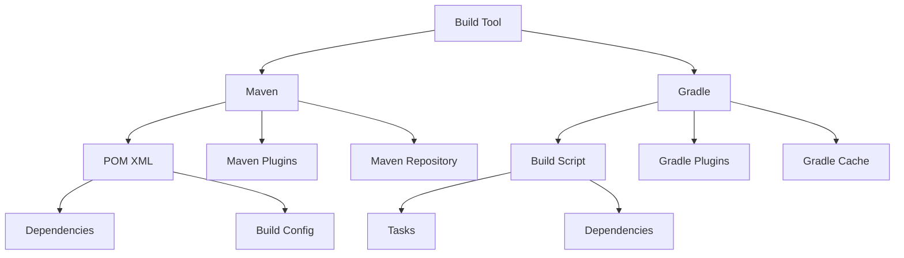

# Module 12: Build Tools (Maven & Gradle)

## Overview
Build tools automate compilation, testing, packaging, and dependency management. Maven and Gradle are the primary Java build tools, with Maven using XML and Gradle using Groovy/Kotlin DSL.

## Learning Objectives
- Understand build automation
- Master Maven POM configuration
- Use Gradle build scripts
- Manage dependencies
- Create custom build processes

## Prerequisites
- Java fundamentals
- Command line basics
- XML/Groovy syntax

## Why This Concept Exists
Manual builds are:
- Error-prone
- Time-consuming
- Inconsistent
- Hard to replicate

Build tools provide:
- Automated builds
- Dependency management
- Reproducible builds
- Plugin ecosystem

## Problem Statement
How do you automate and standardize Java project builds?

## Theory

### Build Lifecycle (Maven)

| Phase | Description |
|-------|-------------|
| validate | Check project structure |
| compile | Compile source code |
| test | Run unit tests |
| package | Create JAR/WAR |
| verify | Run integration tests |
| install | Install to local repo |
| deploy | Deploy to remote repo |

### Dependency Management

| Concept | Description |
|---------|-------------|
| Group ID | Organization identifier |
| Artifact ID | Project identifier |
| Version | Specific version |
| Scope | Dependency scope |

### Dependency Scopes

| Scope | Description |
|-------|-------------|
| compile | Available everywhere |
| provided | Provided by container |
| runtime | Runtime only |
| test | Test only |
| system | System path |

## Internal Working

### Maven Resolution
1. Read POM
2. Resolve dependencies
3. Build dependency tree
4. Download artifacts
5. Execute phases

### Gradle Resolution
1. Read build script
2. Configure project
3. Resolve dependencies
4. Execute tasks
5. Generate outputs

## JVM Perspective

### Build Memory
- Maven runs in JVM
- Gradle daemon improves performance
- Build caching speeds up
- Parallel builds utilize cores

## Architecture Diagram



## Syntax

### Maven POM
```xml
<?xml version="1.0" encoding="UTF-8"?>
<project xmlns="http://maven.apache.org/POM/4.0.0">
    <modelVersion>4.0.0</modelVersion>
    
    <groupId>com.example</groupId>
    <artifactId>my-app</artifactId>
    <version>1.0.0</version>
    <packaging>jar</packaging>
    
    <properties>
        <maven.compiler.source>21</maven.compiler.source>
        <maven.compiler.target>21</maven.compiler.target>
    </properties>
    
    <dependencies>
        <dependency>
            <groupId>org.springframework.boot</groupId>
            <artifactId>spring-boot-starter-web</artifactId>
            <version>3.2.0</version>
        </dependency>
        <dependency>
            <groupId>org.junit.jupiter</groupId>
            <artifactId>junit-jupiter</artifactId>
            <version>5.10.1</version>
            <scope>test</scope>
        </dependency>
    </dependencies>
    
    <build>
        <plugins>
            <plugin>
                <groupId>org.springframework.boot</groupId>
                <artifactId>spring-boot-maven-plugin</artifactId>
            </plugin>
        </plugins>
    </build>
</project>
```

### Gradle Build Script
```groovy
plugins {
    id 'java'
    id 'org.springframework.boot' version '3.2.0'
}

group = 'com.example'
version = '1.0.0'

java {
    sourceCompatibility = '21'
}

repositories {
    mavenCentral()
}

dependencies {
    implementation 'org.springframework.boot:spring-boot-starter-web'
    testImplementation 'org.springframework.boot:spring-boot-starter-test'
}

test {
    useJUnitPlatform()
}

bootJar {
    archiveFileName = 'my-app.jar'
}
```

## Easy Example
```bash
# Maven commands
mvn clean install          # Clean and install
mvn clean package          # Create JAR
mvn test                   # Run tests
mvn dependency:tree        # Show dependencies

# Gradle commands
./gradlew clean build      # Clean and build
./gradlew test             # Run tests
./gradlew dependencies     # Show dependencies
./gradlew bootRun          # Run Spring Boot
```

## Medium Example
```xml
<!-- Maven profiles -->
<profiles>
    <profile>
        <id>dev</id>
        <properties>
            <spring.profiles.active>dev</spring.profiles.active>
        </properties>
    </profile>
    <profile>
        <id>prod</id>
        <properties>
            <spring.profiles.active>prod</spring.profiles.active>
        </properties>
    </profile>
</profiles>
```

```groovy
// Gradle tasks
task runProd {
    doLast {
        exec {
            commandLine 'java', '-jar', 'build/libs/my-app.jar'
        }
    }
}
```

## Hard Example
```xml
<!-- Maven multi-module -->
<modules>
    <module>core</module>
    <module>web</module>
    <module>api</module>
</modules>

<dependencyManagement>
    <dependencies>
        <dependency>
            <groupId>com.example</groupId>
            <artifactId>core</artifactId>
            <version>${project.version}</version>
        </dependency>
    </dependencies>
</dependencyManagement>
```

## Enterprise Example
```groovy
// Gradle with custom plugins
plugins {
    id 'java-library'
    id 'maven-publish'
}

publishing {
    publications {
        mavenJava(MavenPublication) {
            from components.java
            
            pom {
                name = 'My Library'
                description = 'A useful library'
                url = 'https://github.com/example/my-library'
            }
        }
    }
    
    repositories {
        maven {
            url = 'https://repo.example.com'
        }
    }
}
```

## Performance Considerations
- Use Gradle daemon
- Enable build caching
- Use parallel builds
- Skip tests when needed

## Time & Space Complexity

| Operation | Time | Space |
|-----------|------|-------|
| Compile | O(n) | O(n) |
| Test | O(t) | O(t) |
| Package | O(n) | O(n) |
| Install | O(n) | O(repo) |

## Thread Safety
- Builds can run in parallel
- Use separate output directories
- Avoid shared resources
- Use build isolation

## Best Practices
1. Use version ranges carefully
2. Pin dependency versions
3. Use BOM for versions
4. Keep POM clean
5. Use profiles for environments

## Common Mistakes
1. Version conflicts
2. Transitive dependencies
3. Missing dependencies
4. Wrong scope

## Comparison Table

| Feature | Maven | Gradle |
|---------|-------|--------|
| Configuration | XML | Groovy/Kotlin |
| Performance | Good | Better |
| Flexibility | Medium | High |
| Learning Curve | Easy | Medium |

## Interview Questions

### Q1: What is the difference between Maven and Gradle?
**Answer:** Maven uses XML, Gradle uses Groovy/Kotlin. Gradle is generally faster.

### Q2: What is a POM?
**Answer:** Project Object Model - Maven configuration file.

### Q3: What is dependency management?
**Answer:** Centralized control of dependency versions.

### Q4: What is a transitive dependency?
**Answer:** Dependencies of your dependencies.

### Q5: What is a BOM?
**Answer:** Bill of Materials - manages versions for multiple dependencies.

## Summary
Build tools automate Java project builds and dependency management.

## References
- Maven Documentation
- Gradle Documentation
- Baeldung Build Tools Guide
