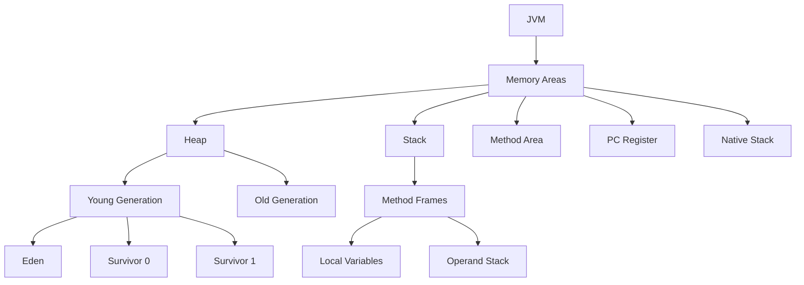
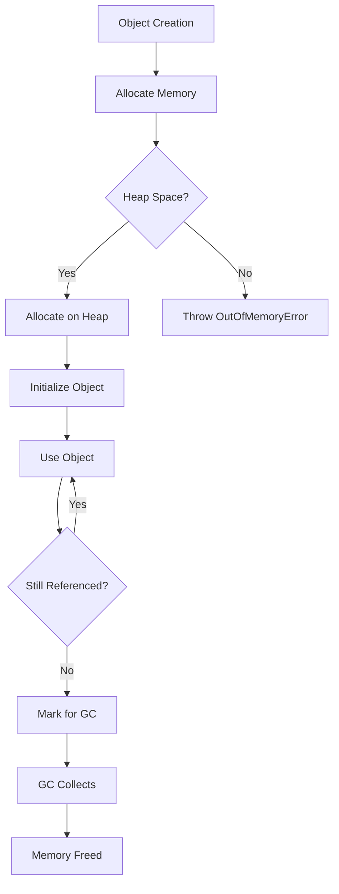
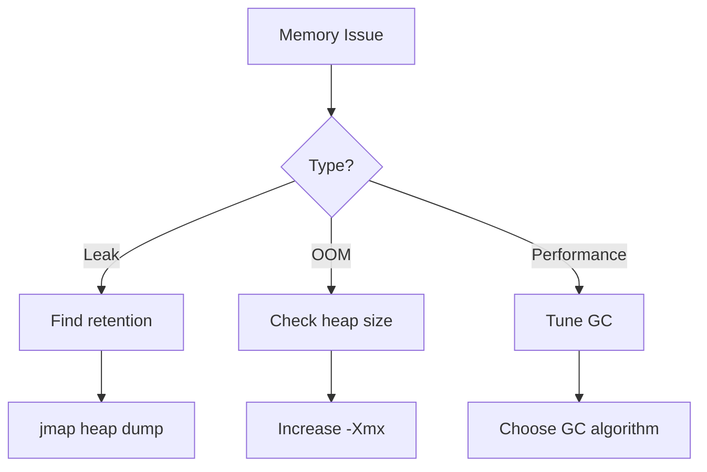

# Module 12: Memory Management

## Overview
Java memory management involves heap allocation, stack management, garbage collection, and various memory areas. Understanding memory is critical for performance optimization, memory leak detection, and production troubleshooting.

## Learning Objectives
- Understand JVM memory areas
- Master heap and stack memory
- Analyze memory usage patterns
- Detect and prevent memory leaks
- Optimize memory allocation

## Prerequisites
- Basic Java knowledge
- Understanding of objects and references
- Familiarity with JVM concepts

## Why This Concept Exists
Manual memory management (C/C++) leads to:
- Memory leaks
- Dangling pointers
- Double frees
- Complex code

Java's automatic memory management provides safety but requires understanding for optimization.

## Problem Statement
How does Java manage memory, and how do you optimize memory usage?

## Theory

### JVM Memory Areas

| Area | Purpose | Thread |
|------|---------|--------|
| Heap | Object storage | Shared |
| Stack | Method frames | Per-thread |
| Method Area | Class metadata | Shared |
| Program Counter | Current instruction | Per-thread |
| Native Method Stack | Native calls | Per-thread |

### Heap Structure

```
┌─────────────────────────────────────────┐
│                Heap                      │
├───────────────┬─────────────────────────┤
│ Young Gen     │ Old Generation          │
├───────┬───────┼─────────────────────────┤
│ Eden  │Survivor│ Tenured Space          │
│       │ Space  │                        │
└───────┴───────┴─────────────────────────┘
```

### Memory Allocation
- Objects allocated on heap
- Primitive types on stack
- String pool in heap
- Class metadata in method area

## Internal Working

### Object Lifecycle
1. Class loading
2. Memory allocation
3. Initialization
4. Use
5. Garbage collection
6. Memory deallocation

### Stack vs Heap
```
Stack:                         Heap:
┌──────────────────┐          ┌──────────────────┐
│ Method Frame 1   │          │ Object A         │
│  - local vars    │──────────│  - fields        │
│  - parameters    │          │  - references    │
├──────────────────┤          ├──────────────────┤
│ Method Frame 2   │          │ Object B         │
│  - local vars    │──────────│  - fields        │
└──────────────────┘          └──────────────────┘
```

## JVM Perspective

### Memory Allocation
```java
public class MemoryExample {
    public void method() {
        int x = 10;           // Stack
        Object obj = new Object();  // Stack (ref) + Heap (object)
        String s = "hello";   // Stack (ref) + Heap (string pool)
    }
}
```

### GC Roots
- Local variables
- Static fields
- JNI references
- Active threads
- Monitors

## Memory Representation
```
Object Memory Layout:
┌─────────────────────────────────────┐
│ Object Header (12 bytes)            │
│  - Mark Word (8 bytes)              │
│  - Klass Pointer (4 bytes)          │
├─────────────────────────────────────┤
│ Instance Data                       │
│  - Primitive fields                 │
│  - Reference fields                 │
├─────────────────────────────────────┤
│ Padding (to 8-byte boundary)        │
└─────────────────────────────────────┘
```

## Architecture Diagram



## Flow Diagram



## Syntax

### Memory Monitoring
```java
// Get memory usage
Runtime runtime = Runtime.getRuntime();
long maxMemory = runtime.maxMemory();
long totalMemory = runtime.totalMemory();
long freeMemory = runtime.freeMemory();

System.out.println("Max: " + maxMemory / 1024 / 1024 + " MB");
System.out.println("Total: " + totalMemory / 1024 / 1024 + " MB");
System.out.println("Free: " + freeMemory / 1024 / 1024 + " MB");
```

### Weak References
```java
import java.lang.ref.*;

// Strong reference
Object strong = new Object();

// Weak reference (GC can collect)
WeakReference<Object> weak = new WeakReference<>(new Object());
if (weak.get() != null) {
    System.out.println("Weak ref still alive");
}

// Soft reference (collected before OOM)
SoftReference<Object> soft = new SoftReference<>(new Object());

// Phantom reference (finalization)
PhantomReference<Object> phantom = new PhantomReference<>(new Object(), null);
```

### Memory Leak Detection
```java
import java.util.*;

public class MemoryLeakExample {
    private static Map<String, byte[]> cache = new HashMap<>();
    
    public static void main(String[] args) {
        // Memory leak - cache grows indefinitely
        for (int i = 0; i < 1000000; i++) {
            cache.put("key" + i, new byte[1024]);
        }
        
        // Check memory
        Runtime runtime = Runtime.getRuntime();
        System.out.println("Used: " + 
            (runtime.totalMemory() - runtime.freeMemory()) / 1024 / 1024 + " MB");
    }
}
```

## Easy Example
```java
public class EasyExample {
    public static void main(String[] args) {
        // Primitive on stack
        int x = 10;
        
        // Object on heap
        Object obj = new Object();
        
        // Array on heap
        int[] arr = new int[100];
        
        System.out.println("x: " + x);
        System.out.println("obj: " + obj);
        System.out.println("arr length: " + arr.length);
    }
}
```

## Medium Example
```java
import java.util.*;

public class MediumExample {
    public static void main(String[] args) {
        List<byte[]> list = new ArrayList<>();
        
        // Monitor memory
        Runtime runtime = Runtime.getRuntime();
        
        for (int i = 0; i < 100; i++) {
            list.add(new byte[1024 * 1024]); // 1MB each
            System.out.printf("Used: %d MB, Free: %d MB%n",
                (runtime.totalMemory() - runtime.freeMemory()) / 1024 / 1024,
                runtime.freeMemory() / 1024 / 1024);
        }
    }
}
```

## Hard Example
```java
import java.lang.ref.*;

public class HardExample {
    public static void main(String[] args) {
        // Weak reference example
        WeakReference<byte[]> weakRef = new WeakReference<>(new byte[1024]);
        
        System.out.println("Before GC: " + (weakRef.get() != null));
        System.gc();
        System.out.println("After GC: " + (weakRef.get() != null));
        
        // Memory layout
        System.out.println("Object header size: " + 
            java.lang.instrument.Instrumentation.getObjectSize(new Object()));
    }
}
```

## Enterprise Example
```java
import java.util.concurrent.*;

public class EnterpriseExample {
    // Thread pool with memory-aware configuration
    private static final ExecutorService executor = 
        new ThreadPoolExecutor(
            4, 4, 60L, TimeUnit.SECONDS,
            new LinkedBlockingQueue<>(1000),
            new ThreadPoolExecutor.CallerRunsPolicy()
        );
    
    public static void main(String[] args) {
        // Monitor memory usage
        ScheduledExecutorService monitor = Executors.newSingleThreadScheduledExecutor();
        monitor.scheduleAtFixedRate(() -> {
            Runtime runtime = Runtime.getRuntime();
            long used = runtime.totalMemory() - runtime.freeMemory();
            System.out.printf("Memory used: %d MB%n", used / 1024 / 1024);
        }, 0, 1, TimeUnit.SECONDS);
    }
}
```

## Performance Considerations
- Object allocation is fast (TLAB)
- GC pauses affect performance
- Memory alignment affects cache
- String pooling saves memory

## Time & Space Complexity
| Operation | Time | Space |
|-----------|------|-------|
| Object creation | O(1) | O(size) |
| GC Young Gen | O(allocations) | O(heap) |
| GC Full GC | O(heap size) | O(heap) |
| Memory access | O(1) | O(1) |

## Thread Safety
- Heap is shared (thread-safe allocation)
- Stack is per-thread (no sharing)
- GC is thread-safe
- Synchronized access to shared objects

## Best Practices
1. Use appropriate data structures
2. Avoid unnecessary object creation
3. Use primitive types when possible
4. Implement caching carefully
5. Monitor memory usage

## Common Mistakes
1. Holding references unnecessarily
2. Circular references
3. Large object arrays
4. Unclosed resources

## Pitfalls & Warnings
1. Memory leaks in collections
2. Static field memory retention
3. Classloader leaks
4. Thread-local variable leaks

## Debugging Tips
1. Use -Xmx/-Xms for heap size
2. Use jmap for heap dumps
3. Use VisualVM for monitoring
4. Use -XX:+PrintGCDetails for GC logs

## Comparison Table

| Memory Area | Purpose | Size | Thread |
|-------------|---------|------|--------|
| Heap | Objects | Large | Shared |
| Stack | Frames | Small | Per-thread |
| Method Area | Classes | Medium | Shared |
| PC Register | Instructions | Tiny | Per-thread |

## Decision Tree



## Interview Questions

### Q1: What is the difference between heap and stack?
**Answer:** Heap stores objects (shared), stack stores method frames (per-thread).

### Q2: What are the JVM memory areas?
**Answer:** Heap, stack, method area, PC register, native method stack.

### Q3: What is a memory leak?
**Answer:** Objects that are no longer needed but still referenced, preventing GC.

### Q4: What are GC roots?
**Answer:** Local variables, static fields, JNI references, active threads.

### Q5: What is the difference between Young and Old generation?
**Answer:** Young gen holds new objects, Old gen holds long-lived objects.

### Q6: What is a WeakReference?
**Answer:** A reference that allows GC to collect the object when no strong references exist.

### Q7: How do you detect memory leaks?
**Answer:** Use jmap, VisualVM, or heap dump analysis tools.

### Q8: What is TLAB?
**Answer:** Thread-Local Allocation Buffer for fast object allocation.

### Q9: What causes OutOfMemoryError?
**Answer:** Insufficient heap space, too many objects, memory leaks.

### Q10: How do you prevent memory leaks?
**Answer:** Close resources, avoid static collections, use weak references.

### Q11: What is string pooling?
**Answer:** A cache of string literals to avoid duplicate objects.

### Q12: What is the difference between SoftReference and WeakReference?
**Answer:** SoftReference is cleared before OOM, WeakReference is cleared at GC.

### Q13: How does object allocation work?
**Answer:** Allocate memory on heap, initialize object, return reference.

### Q14: What is memory alignment?
**Answer:** Padding objects to 8-byte boundaries for performance.

### Q15: What are common memory leak sources?
**Answer:** Collections, static fields, ThreadLocal, classloaders.

## Exercises

### Easy
1. Monitor heap usage during object creation
2. Compare memory usage of ArrayList vs LinkedList
3. Test string pooling behavior

### Medium
1. Create a memory leak example
2. Implement object pooling
3. Analyze memory usage of different data structures

### Hard
1. Write a memory profiler
2. Implement weak reference cache
3. Analyze heap dump with jmap

## Summary
Java memory management is automatic but requires understanding for optimization. Key areas are heap, stack, and GC.

## References
- Oracle Java Documentation: Memory Management
- JVM Specification: Memory
- Baeldung Memory Management Guide
