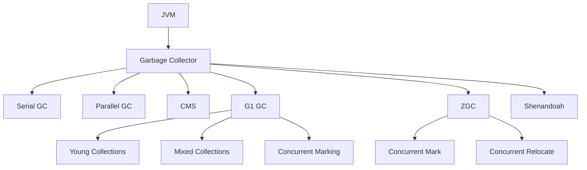
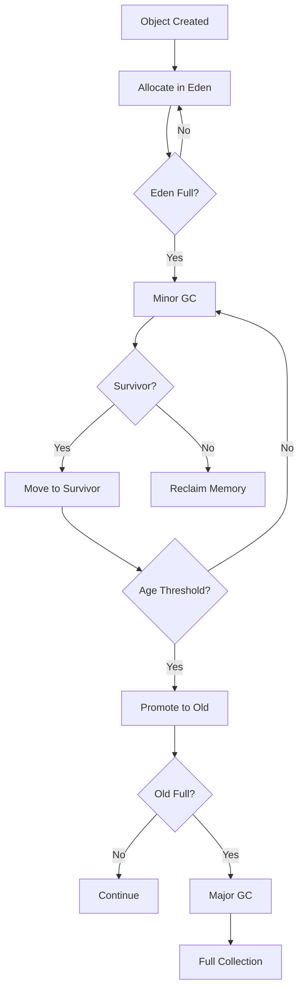
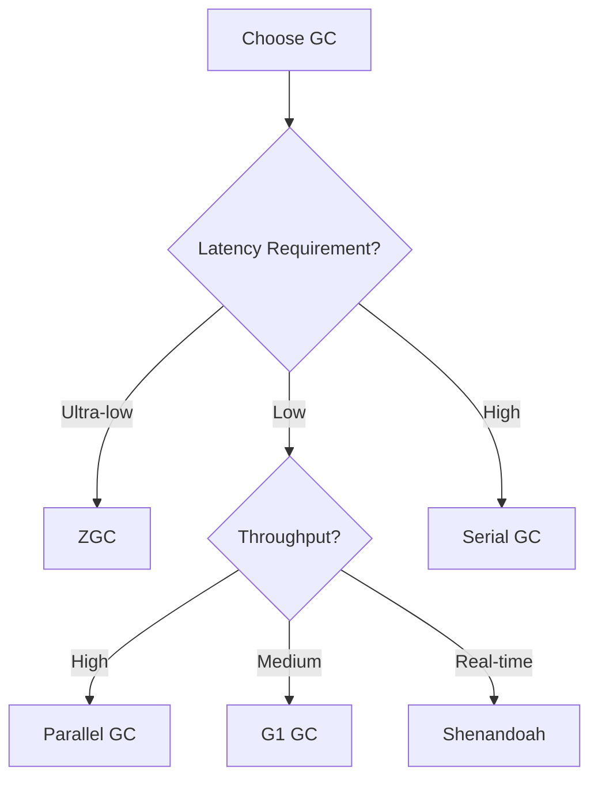

# Module 13: Garbage Collection

## Overview
Garbage Collection (GC) is Java's automatic memory management mechanism. It identifies and reclaims memory occupied by objects that are no longer in use, preventing memory leaks without manual intervention.

## Learning Objectives
- Understand GC algorithms
- Master GC tuning parameters
- Analyze GC logs and performance
- Choose appropriate GC for workload
- Debug GC-related issues

## Prerequisites
- Memory management basics
- JVM architecture
- Performance concepts

## Why This Concept Exists
Manual memory management leads to:
- Memory leaks
- Dangling pointers
- Double frees
- Complex code

GC automates memory reclamation while providing safety.

## Problem Statement
How does Java automatically reclaim memory, and how do you optimize GC performance?

## Theory

### GC Algorithms

| Algorithm | Type | Use Case |
|-----------|------|----------|
| Serial GC | Stop-the-world | Single-threaded apps |
| Parallel GC | Throughput-focused | Batch processing |
| CMS | Low-latency | Web applications |
| G1 GC | Balanced | General purpose |
| ZGC | Ultra-low latency | Real-time systems |
| Shenandoah | Low-pause | Latency-sensitive |

### Object Lifecycle
1. Allocation (Eden space)
2. Minor GC (Young generation)
3. Promotion (to Old generation)
4. Major GC (Old generation)
5. Memory reclamation

### GC Roots
- Local variables
- Static fields
- JNI references
- Active threads
- Monitors

## Internal Working

### G1 GC Internals
- Divides heap into regions
- Concurrent marking
- Mixed collections
- Predictable pause times

### ZGC Internals
- Concurrent execution
- Sub-millisecond pauses
- Colored pointers
- Load barriers

## JVM Perspective

### GC Logging
```bash
# Enable GC logging (Java 11+)
java -Xlog:gc*:file=gc.log:time,uptime,level,tags -jar app.jar

# Java 8
-XX:+PrintGCDetails -XX:+PrintGCDateStamps -Xloggc:gc.log
```

### GC Tuning
```bash
# Heap size
-Xms4g -Xmx4g

# G1 GC
-XX:+UseG1GC
-XX:MaxGCPauseMillis=200

# ZGC
-XX:+UseZGC
```

## Memory Representation
```
G1 GC Regions:
┌─────┬─────┬─────┬─────┬─────┬─────┐
│ Eden│Eden │Surv │Old  │Old  │Hum │
│     │     │     │     │     │ongous│
└─────┴─────┴─────┴─────┴─────┴─────┘

ZGC Colored Pointers:
┌─────────────────────────────────────┐
│ Object Reference                     │
│  ├─ Color Bits (3 bits)             │
│  ├─ Address (44 bits)               │
│  └─ Metadata (17 bits)              │
└─────────────────────────────────────┘
```

## Architecture Diagram



## Flow Diagram



## Syntax

### GC Selection
```bash
# Serial GC
-XX:+UseSerialGC

# Parallel GC
-XX:+UseParallelGC
-XX:ParallelGCThreads=4

# G1 GC
-XX:+UseG1GC
-XX:MaxGCPauseMillis=200
-XX:G1HeapRegionSize=16m

# ZGC
-XX:+UseZGC

# Shenandoah
-XX:+UseShenandoahGC
```

### GC Tuning
```bash
# Heap sizing
-Xms4g -Xmx4g
-XX:NewRatio=2
-XX:SurvivorRatio=8

# G1 specific
-XX:InitiatingHeapOccupancyPercent=45
-XX:G1ReservePercent=10

# Monitoring
-XX:+PrintGCDetails
-XX:+PrintGCDateStamps
-XX:+PrintHeapAtGC
```

### Programmatic GC
```java
// Request GC (not guaranteed)
System.gc();

// Finalization
protected void finalize() {
    // Cleanup
}

// Phantom reference cleanup
PhantomReference<Object> ref = new PhantomReference<>(obj, queue);
```

## Easy Example
```java
public class EasyExample {
    public static void main(String[] args) {
        // Create objects
        for (int i = 0; i < 1000; i++) {
            new Object();
        }
        
        // Request GC
        System.gc();
        
        // Check memory
        Runtime runtime = Runtime.getRuntime();
        System.out.println("Free: " + runtime.freeMemory() / 1024 + " KB");
    }
}
```

## Medium Example
```java
public class MediumExample {
    public static void main(String[] args) {
        // Monitor GC
        List<byte[]> list = new ArrayList<>();
        
        for (int i = 0; i < 100; i++) {
            list.add(new byte[1024 * 1024]); // 1MB
            
            if (i % 10 == 0) {
                System.gc();
                System.out.println("Iteration " + i + 
                    ", Free: " + Runtime.getRuntime().freeMemory() / 1024 / 1024 + " MB");
            }
        }
    }
}
```

## Hard Example
```java
import java.lang.ref.*;

public class HardExample {
    private static Map<Object, WeakReference<Object>> cache = new WeakHashMap<>();
    
    public static void main(String[] args) {
        // Weak reference cache
        for (int i = 0; i < 1000; i++) {
            Object obj = new Object();
            cache.put(obj, new WeakReference<>(obj));
        }
        
        System.out.println("Before GC: " + cache.size());
        System.gc();
        System.out.println("After GC: " + cache.size());
    }
}
```

## Enterprise Example
```java
import java.util.concurrent.*;
import java.util.concurrent.atomic.*;

public class EnterpriseExample {
    private static final AtomicLong allocated = new AtomicLong(0);
    
    public static void main(String[] args) {
        // Monitor allocation rate
        ScheduledExecutorService scheduler = Executors.newSingleThreadScheduledExecutor();
        scheduler.scheduleAtFixedRate(() -> {
            Runtime runtime = Runtime.getRuntime();
            long used = runtime.totalMemory() - runtime.freeMemory();
            System.out.printf("Heap: %d MB, Allocations: %d%n",
                used / 1024 / 1024, allocated.get());
        }, 1, 1, TimeUnit.SECONDS);
        
        // Simulate allocation
        ExecutorService executor = Executors.newFixedThreadPool(4);
        for (int i = 0; i < 100000; i++) {
            executor.submit(() -> {
                allocated.incrementAndGet();
                return new byte[1024];
            });
        }
    }
}
```

## Performance Considerations
- GC pause times affect latency
- Throughput vs latency tradeoff
- Heap size affects GC frequency
- Object promotion affects GC time

## Time & Space Complexity
| Operation | Time | Space |
|-----------|------|-------|
| Minor GC | O(young gen) | O(heap) |
| Major GC | O(heap) | O(heap) |
| Concurrent Mark | O(live objects) | O(mark stack) |
| Compaction | O(heap) | O(heap) |

## Thread Safety
- GC is thread-safe
- Stop-the-world pauses affect all threads
- Concurrent collectors minimize pauses
- Safepoints coordinate GC with application

## Best Practices
1. Choose GC based on latency requirements
2. Monitor GC logs regularly
3. Size heap appropriately
4. Avoid object creation in tight loops
5. Use object pooling for expensive objects

## Common Mistakes
1. Using default GC for all workloads
2. Ignoring GC logs
3. Over-tuning GC parameters
4. Creating too many short-lived objects

## Pitfalls & Warnings
1. Full GC pauses can be long
2. Memory leaks bypass GC
3. Finalization is deprecated
4. System.gc() is just a hint

## Debugging Tips
1. Use -Xlog:gc* for GC logs
2. Use jstat for GC statistics
3. Use VisualVM for monitoring
4. Analyze heap dumps for leaks

## Comparison Table

| GC | Pause Time | Throughput | Best For |
|----|------------|------------|----------|
| Serial | High | Low | Single-core |
| Parallel | Medium | High | Batch |
| G1 | Low-Medium | Medium | General |
| ZGC | Ultra-low | Medium | Real-time |
| Shenandoah | Low | Medium | Latency |

## Decision Tree



## Interview Questions

### Q1: What is garbage collection?
**Answer:** Automatic memory management that reclaims memory from unused objects.

### Q2: What are the GC algorithms?
**Answer:** Serial, Parallel, CMS, G1, ZGC, Shenandoah.

### Q3: What is the difference between Minor and Major GC?
**Answer:** Minor GC collects Young generation, Major GC collects Old generation.

### Q4: What is a stop-the-world pause?
**Answer:** When all application threads are paused for GC.

### Q5: How do you choose a GC?
**Answer:** Based on latency requirements, throughput needs, and heap size.

### Q6: What is G1 GC?
**Answer:** A region-based garbage collector with predictable pause times.

### Q7: What is ZGC?
**Answer:** A low-latency GC with sub-millisecond pauses.

### Q8: What are GC roots?
**Answer:** Objects that are always reachable (static fields, local variables, etc.).

### Q9: What is object promotion?
**Answer:** Moving objects from Young to Old generation after surviving multiple GC cycles.

### Q10: What is a memory leak?
**Answer:** Objects that are no longer needed but still referenced, preventing GC.

### Q11: How do you monitor GC?
**Answer:** Use GC logs, jstat, VisualVM, or monitoring tools.

### Q12: What is the -Xmx parameter?
**Answer:** Maximum heap size for the JVM.

### Q13: What is the difference between CMS and G1?
**Answer:** CMS uses concurrent mark-sweep, G1 uses region-based collection.

### Q14: What is a safepoint?
**Answer:** A point where the JVM can safely pause threads for GC.

### Q15: What is compaction?
**Answer:** Moving objects to eliminate fragmentation during GC.

## Exercises

### Easy
1. Monitor GC activity with jstat
2. Compare GC logs with different heap sizes
3. Test System.gc() behavior

### Medium
1. Tune G1 GC for your application
2. Analyze GC pause times
3. Create a memory leak detection tool

### Hard
1. Implement a simple GC simulator
2. Compare GC algorithms with benchmarks
3. Optimize GC for low-latency requirements

## Summary
Garbage collection is Java's automatic memory management. Understanding GC algorithms and tuning is critical for production performance.

## References
- Oracle Java Documentation: Garbage Collection
- JVM Specification: Memory
- G1 GC Tuning Guide
- ZGC Documentation
