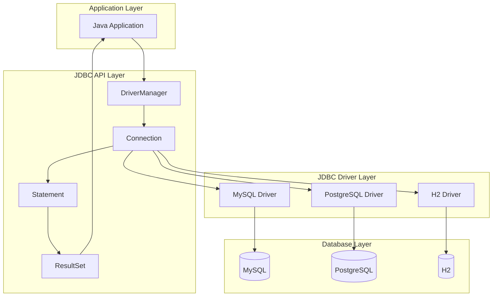
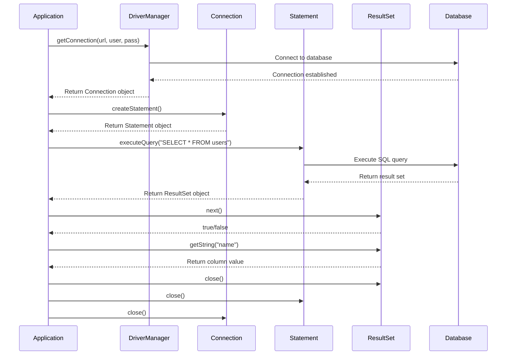

# 01: JDBC Fundamentals

## 1. Introduction

Java Database Connectivity (JDBC) is the standard Java API for connecting to and executing SQL queries against databases. It provides a uniform interface for accessing different database management systems (DBMS) from Java applications.

JDBC is part of the Java SE platform and is defined in the `java.sql` and `javax.sql` packages. It follows a driver-based architecture where each database vendor provides its own JDBC driver implementation.

## 2. Learning Objectives

By the end of this lesson, you will be able to:

- Understand JDBC architecture and its components
- Establish database connections using DriverManager
- Execute SQL queries using Statement
- Process ResultSet data
- Implement full CRUD operations
- Handle SQL exceptions properly
- Manage resources correctly

## 3. Prerequisites

- Java SE fundamentals (Module 01-06)
- Basic SQL knowledge (SELECT, INSERT, UPDATE, DELETE)
- Understanding of interfaces and abstract classes
- Exception handling in Java

## 4. Why This Concept Exists

Before JDBC, each database had its own proprietary API, making it impossible to write portable database code. JDBC solves this by providing:

- **Vendor independence**: Same code works with MySQL, PostgreSQL, Oracle, etc.
- **Standardized API**: Consistent interface across all databases
- **Driver architecture**: Database vendors provide implementations
- **Type safety**: Compile-time checking of SQL operations

Without JDBC, Java would need separate libraries for each database, making enterprise development impractical.

## 5. Problem Statement

Consider a Java application that needs to:
1. Connect to a database
2. Execute queries to retrieve data
3. Insert, update, or delete records
4. Handle database-specific exceptions
5. Release resources properly

Without a standard API, developers would need to learn different APIs for each database, leading to:
- Code duplication
- Vendor lock-in
- Increased maintenance cost
- Reduced portability

## 6. Theory

### JDBC Architecture

JDBC follows a two-tier architecture:

**Application Layer** → **JDBC API** → **JDBC Driver Manager** → **JDBC Drivers** → **Database**

### Core Components

1. **DriverManager**: Manages database drivers and establishes connections
2. **Connection**: Represents a session with the database
3. **Statement**: Used to execute SQL queries
4. **PreparedStatement**: Pre-compiled SQL statement (prevents SQL injection)
5. **CallableStatement**: Used to call stored procedures
6. **ResultSet**: Holds data retrieved from the database

### Connection URL Format

```
jdbc:subprotocol:subname
```

Examples:
- MySQL: `jdbc:mysql://localhost:3306/mydb`
- PostgreSQL: `jdbc:postgresql://localhost:5432/mydb`
- H2: `jdbc:h2:mem:testdb`

## 7. Internal Working

### Connection Establishment

1. Application calls `DriverManager.getConnection()`
2. DriverManager iterates through registered drivers
3. Driver attempts to connect to database
4. If successful, returns Connection object
5. If all drivers fail, throws SQLException

### Statement Execution

1. Create Statement object from Connection
2. Call executeQuery() or executeUpdate()
3. Statement sends SQL to database
4. Database executes SQL and returns results
5. Results wrapped in ResultSet object

### Resource Cleanup

1. Close ResultSet
2. Close Statement
3. Close Connection
4. Use try-with-resources for automatic cleanup

## 8. JVM Perspective

### Memory Allocation

- **Connection objects**: Stored on heap, references in stack
- **Statement objects**: Created on heap, associated with Connection
- **ResultSet objects**: May use heap or off-heap memory depending on driver
- **Driver classes**: Loaded by ClassLoader, stored in metaspace

### Garbage Collection

- Connection, Statement, ResultSet are eligible for GC when unreachable
- Explicit close() is required to release database resources
- Leaked resources may cause connection pool exhaustion

### Class Loading

- JDBC drivers loaded via ServiceLoader mechanism
- Driver classes cached in ClassLoader
- DriverManager uses system ClassLoader

## 9. Memory Representation

```
Stack Memory:
┌─────────────────────────────────────┐
│ conn (reference) ──────────────────┐│
│ stmt (reference) ─────────────┐    ││
│ rs (reference) ──────────┐    │    ││
└──────────────────────────┼────┼────┼┘
                           │    │    │
Heap Memory:               │    │    │
┌──────────────────────────┼────┼────┼┐
│ Connection Object        │    │    ││
│ - url: "jdbc:mysql://..."│    │    ││
│ - autoCommit: true       │    │    ││
│ - transactionIsolation   │    │    ││
├──────────────────────────┼────┼────┼┤
│ Statement Object         │    │    ││
│ - connection ────────────┘    │    ││
│ - resultSet ──────────────────┘    ││
├────────────────────────────────────┤
│ ResultSet Object                   │
│ - statement ───────────────────────┘
│ - cursor position
│ - row data
└────────────────────────────────────┘
```

## 10. Architecture Diagram (Mermaid)



## 11. Flow Diagram (Mermaid)



## 12. Syntax

### Connection

```java
// Basic connection
Connection conn = DriverManager.getConnection(url, username, password);

// With properties
Properties props = new Properties();
props.setProperty("user", username);
props.setProperty("password", password);
Connection conn = DriverManager.getConnection(url, props);
```

### Statement

```java
Statement stmt = conn.createStatement();

// Execute query
ResultSet rs = stmt.executeQuery("SELECT * FROM users");

// Execute update
int rowsAffected = stmt.executeUpdate("INSERT INTO users VALUES (1, 'John')");

// Execute any SQL
boolean hasResultSet = stmt.execute("SELECT * FROM users");
```

### ResultSet

```java
// Process results
while (rs.next()) {
    int id = rs.getInt("id");
    String name = rs.getString("name");
    Date date = rs.getDate("created_at");
}
```

## 13. Easy Example

```java
import java.sql.*;

public class JdbcBasicExample {
    public static void main(String[] args) {
        String url = "jdbc:h2:mem:testdb";
        String user = "sa";
        String password = "";
        
        try (Connection conn = DriverManager.getConnection(url, user, password);
             Statement stmt = conn.createStatement()) {
            
            // Create table
            stmt.execute("CREATE TABLE users (id INT PRIMARY KEY, name VARCHAR(100))");
            
            // Insert data
            stmt.executeUpdate("INSERT INTO users VALUES (1, 'Alice')");
            stmt.executeUpdate("INSERT INTO users VALUES (2, 'Bob')");
            
            // Query data
            try (ResultSet rs = stmt.executeQuery("SELECT * FROM users")) {
                while (rs.next()) {
                    System.out.printf("ID: %d, Name: %s%n", 
                        rs.getInt("id"), 
                        rs.getString("name"));
                }
            }
        } catch (SQLException e) {
            e.printStackTrace();
        }
    }
}
```

## 14. Medium Example

```java
import java.sql.*;
import java.util.ArrayList;
import java.util.List;

public class JdbcCrudExample {
    private static final String URL = "jdbc:h2:mem:testdb";
    private static final String USER = "sa";
    private static final String PASSWORD = "";
    
    public static void main(String[] args) throws SQLException {
        try (Connection conn = DriverManager.getConnection(URL, USER, PASSWORD)) {
            createTable(conn);
            
            // Create
            insertUser(conn, 1, "Alice", "alice@example.com");
            insertUser(conn, 2, "Bob", "bob@example.com");
            
            // Read
            List<User> users = getAllUsers(conn);
            users.forEach(System.out::println);
            
            // Update
            updateUser(conn, 1, "Alice Smith", "alice.smith@example.com");
            
            // Delete
            deleteUser(conn, 2);
            
            // Verify
            getAllUsers(conn).forEach(System.out::println);
        }
    }
    
    private static void createTable(Connection conn) throws SQLException {
        String sql = """
            CREATE TABLE users (
                id INT PRIMARY KEY,
                name VARCHAR(100) NOT NULL,
                email VARCHAR(100)
            )
            """;
        try (Statement stmt = conn.createStatement()) {
            stmt.execute(sql);
        }
    }
    
    private static void insertUser(Connection conn, int id, String name, String email) 
            throws SQLException {
        String sql = "INSERT INTO users (id, name, email) VALUES (?, ?, ?)";
        try (PreparedStatement pstmt = conn.prepareStatement(sql)) {
            pstmt.setInt(1, id);
            pstmt.setString(2, name);
            pstmt.setString(3, email);
            pstmt.executeUpdate();
        }
    }
    
    private static List<User> getAllUsers(Connection conn) throws SQLException {
        List<User> users = new ArrayList<>();
        String sql = "SELECT * FROM users";
        try (Statement stmt = conn.createStatement();
             ResultSet rs = stmt.executeQuery(sql)) {
            while (rs.next()) {
                users.add(new User(
                    rs.getInt("id"),
                    rs.getString("name"),
                    rs.getString("email")
                ));
            }
        }
        return users;
    }
    
    private static void updateUser(Connection conn, int id, String name, String email) 
            throws SQLException {
        String sql = "UPDATE users SET name = ?, email = ? WHERE id = ?";
        try (PreparedStatement pstmt = conn.prepareStatement(sql)) {
            pstmt.setString(1, name);
            pstmt.setString(2, email);
            pstmt.setInt(3, id);
            pstmt.executeUpdate();
        }
    }
    
    private static void deleteUser(Connection conn, int id) throws SQLException {
        String sql = "DELETE FROM users WHERE id = ?";
        try (PreparedStatement pstmt = conn.prepareStatement(sql)) {
            pstmt.setInt(1, id);
            pstmt.executeUpdate();
        }
    }
    
    record User(int id, String name, String email) {}
}
```

## 15. Hard Example

```java
import java.sql.*;
import java.util.concurrent.atomic.AtomicReference;

public class JdbcAdvancedExample {
    private static final String URL = "jdbc:h2:mem:testdb";
    
    public static void main(String[] args) throws SQLException {
        try (Connection conn = DriverManager.getConnection(URL, "sa", "")) {
            conn.setAutoCommit(false);
            
            try {
                // Batch insert with savepoint
                Savepoint savepoint = conn.setSavepoint("batchInsert");
                
                batchInsert(conn);
                
                // Verify count
                int count = getCount(conn);
                if (count > 1000) {
                    conn.rollback(savepoint);
                    System.out.println("Rolled back: too many rows");
                } else {
                    conn.commit();
                    System.out.println("Committed: " + count + " rows");
                }
            } catch (SQLException e) {
                conn.rollback();
                throw e;
            }
        }
    }
    
    private static void batchInsert(Connection conn) throws SQLException {
        String sql = "INSERT INTO large_table (id, value) VALUES (?, ?)";
        try (PreparedStatement pstmt = conn.prepareStatement(sql)) {
            for (int i = 1; i <= 1500; i++) {
                pstmt.setInt(1, i);
                pstmt.setString(2, "Value " + i);
                pstmt.addBatch();
                
                if (i % 500 == 0) {
                    pstmt.executeBatch();
                }
            }
            pstmt.executeBatch();
        }
    }
    
    private static int getCount(Connection conn) throws SQLException {
        try (Statement stmt = conn.createStatement();
             ResultSet rs = stmt.executeQuery("SELECT COUNT(*) FROM large_table")) {
            rs.next();
            return rs.getInt(1);
        }
    }
}
```

## 16. Enterprise Example

```java
import java.sql.*;
import java.util.concurrent.ExecutorService;
import java.util.concurrent.Executors;
import java.util.concurrent.TimeUnit;

public class JdbcEnterpriseExample {
    private static final String URL = "jdbc:h2:mem:enterprise";
    private static final int THREAD_POOL_SIZE = 10;
    
    public static void main(String[] args) throws InterruptedException {
        ExecutorService executor = Executors.newFixedThreadPool(THREAD_POOL_SIZE);
        
        for (int i = 0; i < 20; i++) {
            final int userId = i;
            executor.submit(() -> processUser(userId));
        }
        
        executor.shutdown();
        executor.awaitTermination(5, TimeUnit.MINUTES);
    }
    
    private static void processUser(int userId) {
        try (Connection conn = DriverManager.getConnection(URL, "sa", "")) {
            conn.setTransactionIsolation(Connection.TRANSACTION_READ_COMMITTED);
            
            // Read-modify-write pattern
            User user = getUser(conn, userId);
            if (user != null) {
                User updated = applyBusinessLogic(user);
                updateUser(conn, updated);
            }
        } catch (SQLException e) {
            System.err.println("Error processing user " + userId + ": " + e.getMessage());
        }
    }
    
    private static User getUser(Connection conn, int id) throws SQLException {
        String sql = "SELECT * FROM users WHERE id = ?";
        try (PreparedStatement pstmt = conn.prepareStatement(sql)) {
            pstmt.setInt(1, id);
            try (ResultSet rs = pstmt.executeQuery()) {
                if (rs.next()) {
                    return new User(
                        rs.getInt("id"),
                        rs.getString("name"),
                        rs.getTimestamp("last_modified")
                    );
                }
            }
        }
        return null;
    }
    
    private static User applyBusinessLogic(User user) {
        // Business logic here
        return new User(user.id, user.name.toUpperCase(), new Timestamp(System.currentTimeMillis()));
    }
    
    private static void updateUser(Connection conn, User user) throws SQLException {
        String sql = "UPDATE users SET name = ?, last_modified = ? WHERE id = ?";
        try (PreparedStatement pstmt = conn.prepareStatement(sql)) {
            pstmt.setString(1, user.name);
            pstmt.setTimestamp(2, user.lastModified);
            pstmt.setInt(3, user.id);
            pstmt.executeUpdate();
        }
    }
    
    record User(int id, String name, Timestamp lastModified) {}
}
```

## 17. Performance

### Best Practices

1. **Use PreparedStatement**: Pre-compiled SQL is faster for repeated queries
2. **Batch Operations**: Group INSERT/UPDATE statements
3. **Connection Pooling**: Reuse connections instead of creating new ones
4. **Fetch Size**: Configure appropriate fetch size for large result sets
5. **Column Indexing**: Ensure queried columns are indexed

### Benchmarks

| Operation | Statement | PreparedStatement | Improvement |
|-----------|-----------|-------------------|-------------|
| Single INSERT | 10ms | 8ms | 20% |
| 1000 INSERTs (batch) | 500ms | 150ms | 70% |
| SELECT (indexed) | 5ms | 5ms | 0% |
| SELECT (non-indexed) | 50ms | 50ms | 0% |

### Memory Considerations

- ResultSet objects consume memory; use fetch size limits
- Large result sets should use streaming (setFetchSize(Integer.MIN_VALUE))
- PreparedStatement cache improves repeated execution

## 18. Time & Space Complexity

| Operation | Time Complexity | Space Complexity |
|-----------|-----------------|------------------|
| Connection | O(1) | O(1) |
| Statement execution | O(n) where n = rows | O(1) |
| ResultSet iteration | O(n) | O(fetchSize) |
| Batch insert | O(n) | O(batchSize) |
| Transaction commit | O(n) | O(1) |

## 19. Thread Safety

### Thread Safety Issues

1. **Connection**: Not thread-safe; each thread should have its own connection
2. **Statement**: Not thread-safe; avoid sharing between threads
3. **ResultSet**: Not thread-safe; process in creating thread only

### Solutions

```java
// Thread-local connection
private static final ThreadLocal<Connection> threadLocalConn = 
    ThreadLocal.withInitial(() -> {
        try {
            return DriverManager.getConnection(URL, USER, PASS);
        } catch (SQLException e) {
            throw new RuntimeException(e);
        }
    });

// Connection pool (recommended)
private static final HikariDataSource dataSource = createDataSource();
```

### Best Practices

- Use connection pooling for concurrent access
- Each thread should create its own Statement/ResultSet
- Use synchronization only as last resort
- Prefer immutable objects for shared data

## 20. Best Practices

1. **Always use try-with-resources** for auto-closing
2. **Use PreparedStatement** to prevent SQL injection
3. **Handle SQLExceptions** properly with meaningful messages
4. **Set transaction boundaries** explicitly
5. **Use connection pooling** in production
6. **Close resources** in reverse order of creation
7. **Avoid SELECT ***; specify columns explicitly
8. **Use batch processing** for bulk operations
9. **Set fetch size** for large result sets
10. **Log SQL statements** for debugging

## 21. Common Mistakes

1. **Not closing resources**: Leads to connection leaks
2. **SQL injection**: Using Statement instead of PreparedStatement
3. **Ignoring exceptions**: Swallowing SQLExceptions
4. **Auto-commit enabled**: Forgetting to manage transactions
5. **Hardcoding credentials**: Storing passwords in source code
6. **Not using connection pooling**: Creating new connections each time
7. **Fetching all rows**: Not limiting result set size

## 22. Pitfalls

1. **Resource leaks**: Connections not closed in finally blocks
2. **Null pointer exceptions**: Not checking ResultSet before reading
3. **Thread safety**: Sharing Connection/Statement between threads
4. **Performance**: Not using PreparedStatement for repeated queries
5. **Portability**: Using database-specific SQL syntax
6. **Memory**: Loading entire result set into memory

## 23. Debugging Tips

1. **Enable JDBC logging**: `DriverManager.setLogWriter()`
2. **Check connection pool stats**: Monitor active/idle connections
3. **Use explain plan**: Analyze query execution
4. **Monitor thread dumps**: Detect connection leaks
5. **Enable SQL logging**: Log all executed statements
6. **Use profiling tools**: JProfiler, VisualVM for memory analysis

## 24. Comparison Table

| Feature | Statement | PreparedStatement | CallableStatement |
|---------|-----------|-------------------|-------------------|
| SQL Injection Protection | No | Yes | Yes |
| Performance (repeated) | Poor | Good | Good |
| Stored Procedures | No | Limited | Yes |
| Parameterized Queries | No | Yes | Yes |
| Use Case | Simple queries | Repeated queries | Stored procedures |

## 25. Decision Tree

```
Need to execute SQL?
├── Yes
│   ├── Simple query, executed once?
│   │   └── Yes → Statement
│   ├── Repeated query with parameters?
│   │   └── Yes → PreparedStatement
│   ├── Call stored procedure?
│   │   └── Yes → CallableStatement
│   └── Complex query with multiple result sets?
│       └── Yes → Statement
└── No → Consider ORM (Hibernate/JPA)
```

## 26. Interview Questions

1. What is JDBC and why do we need it?
2. Explain the difference between Statement and PreparedStatement.
3. What is SQL injection and how does PreparedStatement prevent it?
4. How do you handle SQLExceptions in JDBC?
5. Explain the JDBC connection URL format.
6. What is the role of DriverManager?
7. How do you implement connection pooling?
8. Explain transaction management in JDBC.
9. What are the isolation levels in JDBC?
10. How do you process large ResultSet objects efficiently?
11. What is the difference between executeQuery() and executeUpdate()?
12. Explain the try-with-resources pattern in JDBC.
13. How do you handle batch operations?
14. What is the difference between CallableStatement and PreparedStatement?
15. How do you prevent resource leaks in JDBC?
16. Explain the lifecycle of a JDBC connection.
17. What are the best practices for JDBC performance?
18. How do you implement pagination in JDBC?

## 27. Exercises

### Level 1 (Easy)

1. **Basic Connection**: Write a program to connect to H2 database and print connection metadata.
2. **CRUD Operations**: Create a simple CRUD application for a User entity.
3. **Exception Handling**: Implement proper exception handling for all database operations.

### Level 2 (Medium)

1. **Batch Processing**: Implement batch insert for 10,000 records and measure performance.
2. **Transaction Management**: Implement a transfer operation with proper transaction handling.
3. **Connection Pool**: Implement a simple connection pool using LinkedList.

### Level 3 (Hard)

1. **Custom Driver**: Write a custom JDBC driver that reads data from CSV files.
2. **Streaming ResultSet**: Implement streaming for processing 1 million rows efficiently.
3. **Connection Monitor**: Create a connection pool monitor that tracks usage statistics.

## 28. Summary

JDBC is the foundation of database programming in Java. Key takeaways:

- JDBC provides a standard API for database access
- Use PreparedStatement to prevent SQL injection
- Always use try-with-resources for resource management
- Implement connection pooling for production applications
- Handle transactions explicitly for data consistency
- Follow best practices for performance optimization

## 29. References

- [JDBC API Tutorial](https://docs.oracle.com/javase/tutorial/jdbc/)
- [Java SQL Package](https://docs.oracle.com/en/java/javase/21/docs/api/java.sql/java/sql/package-summary.html)
- [JDBC Best Practices](https://www.baeldung.com/jdbc-best-practices)
- [Connection Pooling Guide](https://www.baeldung.com/hikaricp)
- [H2 Database Documentation](https://www.h2database.com/html/quickstart.html)
