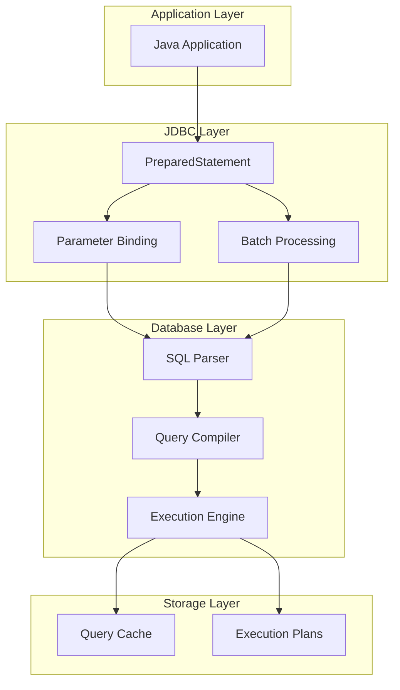
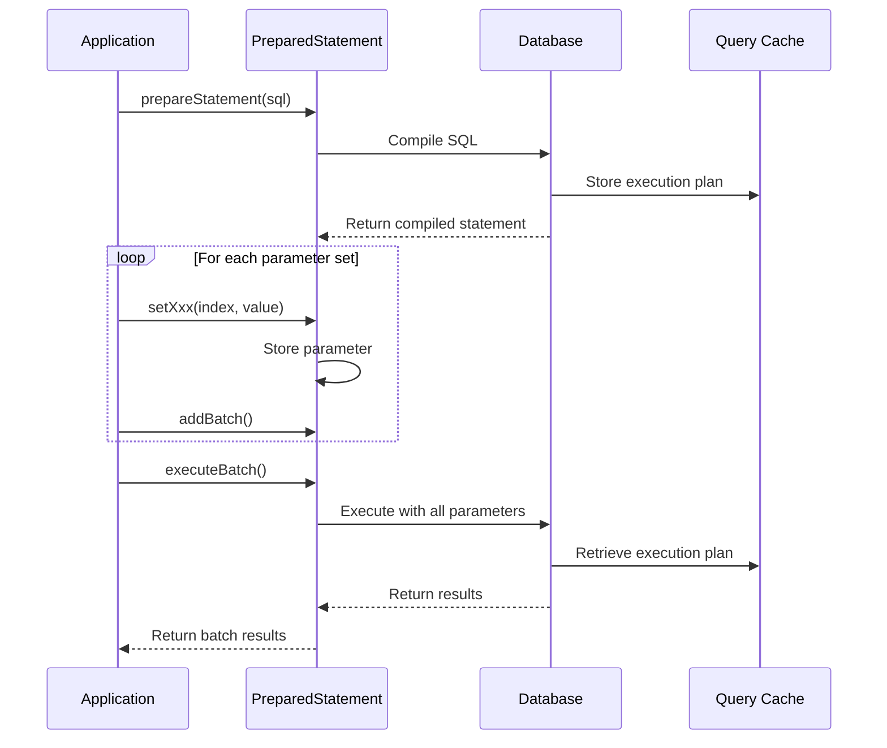

# 02: JDBC PreparedStatement

## 1. Introduction

PreparedStatement is a pre-compiled SQL statement that can be executed efficiently multiple times with different parameters. It extends the Statement interface and provides significant performance and security benefits over regular Statement objects.

PreparedStatement is crucial for preventing SQL injection attacks and improving performance through SQL pre-compilation and parameterized queries.

## 2. Learning Objectives

By the end of this lesson, you will be able to:

- Understand PreparedStatement architecture and benefits
- Implement parameterized queries safely
- Prevent SQL injection attacks
- Use batch processing for bulk operations
- Understand PreparedStatement caching
- Handle different data types with set methods
- Implement dynamic SQL queries

## 3. Prerequisites

- JDBC Fundamentals (Module 01)
- Understanding of SQL injection risks
- Basic SQL knowledge

## 4. Why This Concept Exists

Regular Statement objects have several limitations:

1. **SQL Injection Vulnerability**: Direct string concatenation allows malicious input
2. **Performance Overhead**: SQL is compiled on every execution
3. **Code Duplication**: Similar queries require repetitive code
4. **Type Safety Issues**: Manual string escaping is error-prone

PreparedStatement solves these problems by:
- Pre-compiling SQL statements
- Using parameter placeholders (?)
- Automatic type conversion and escaping
- Preventing SQL injection by design

## 5. Problem Statement

Consider a login system that verifies user credentials:

```java
// Dangerous - SQL Injection vulnerable
String sql = "SELECT * FROM users WHERE username = '" + username + "' AND password = '" + password + "'";
Statement stmt = conn.createStatement();
ResultSet rs = stmt.executeQuery(sql);
```

An attacker could input: `admin' --` for username, bypassing authentication entirely.

Without PreparedStatement, developers must:
- Manually escape special characters
- Validate all input parameters
- Handle different data types differently
- Risk SQL injection if any escape is missed

## 6. Theory

### PreparedStatement Lifecycle

1. **Creation**: SQL statement sent to database for compilation
2. **Parameter Binding**: Values assigned to placeholders (?)
3. **Execution**: Pre-compiled statement executes with bound parameters
4. **Caching**: Compiled statement can be reused

### Parameter Binding

Placeholders (?) represent parameter values:
```sql
SELECT * FROM users WHERE id = ? AND status = ?
```

Set methods for different types:
- `setInt(index, value)`
- `setString(index, value)`
- `setDate(index, value)`
- `setTimestamp(index, value)`
- `setObject(index, value)`

### Batch Processing

Group multiple operations for single execution:
```java
pstmt.setInt(1, 1);
pstmt.setString(2, "Alice");
pstmt.addBatch();

pstmt.setInt(1, 2);
pstmt.setString(2, "Bob");
pstmt.addBatch();

pstmt.executeBatch();
```

## 7. Internal Working

### Pre-compilation Process

1. Application calls `prepareStatement(sql)`
2. JDBC driver sends SQL to database
3. Database parses and compiles SQL
4. Returns handle to compiled statement
5. Subsequent executions use compiled version

### Parameter Binding

1. `setXxx()` methods convert Java types to SQL types
2. Parameters sent to database as bind variables
3. Database binds parameters to compiled statement
4. Execution plan reused for all parameter combinations

### Memory Management

- PreparedStatement objects cached in connection
- Compiled statements stored in database cache
- Parameters stored in memory during execution
- Results processed like regular ResultSet

## 8. JVM Perspective

### Object Creation

- PreparedStatement created on heap
- References stored in Connection's internal cache
- Parameter values boxed/unboxed as needed
- Batch data stored in ArrayList

### Memory Layout

```
PreparedStatement Object
├── sql: String (compiled SQL)
├── parameters: Object[] (bind values)
├── batch: ArrayList<Object[]>
└── connection: Connection reference
```

### Garbage Collection

- PreparedStatement eligible when Connection closed
- Cached statements may persist across transactions
- Weak references may be used for caching

## 9. Memory Representation

```
Stack Memory:
┌─────────────────────────────────────┐
│ pstmt (reference) ─────────────────┐│
└──────────────────────────────────────┘
                                      │
Heap Memory:                          │
┌──────────────────────────────────────┘
│ PreparedStatement Object
│ ├── sql: "SELECT * FROM users WHERE id = ?"
│ ├── parameters: [1] (Object array)
│ ├── batch: [] (empty ArrayList)
│ └── connection: Connection@1234
├────────────────────────────────────┐
│ Connection Object                  │
│ ├── statementCache: [              │
│ │     PreparedStatement@1234,      │
│ │     PreparedStatement@5678       │
│ │   ]                             │
│ └── ...                           │
└────────────────────────────────────┘
```

## 10. Architecture Diagram (Mermaid)



## 11. Flow Diagram (Mermaid)



## 12. Syntax

### Basic PreparedStatement

```java
String sql = "SELECT * FROM users WHERE id = ?";
try (PreparedStatement pstmt = conn.prepareStatement(sql)) {
    pstmt.setInt(1, 1);
    try (ResultSet rs = pstmt.executeQuery()) {
        // Process results
    }
}
```

### Parameter Binding Methods

```java
// Set parameter at position 1
pstmt.setInt(1, 100);
pstmt.setString(2, "John");
pstmt.setDate(3, Date.valueOf("2024-01-01"));
pstmt.setTimestamp(4, new Timestamp(System.currentTimeMillis()));
pstmt.setNull(5, Types.VARCHAR);
pstmt.setObject(6, value, Types.INTEGER);
```

### Batch Processing

```java
String sql = "INSERT INTO users (name, email) VALUES (?, ?)";
try (PreparedStatement pstmt = conn.prepareStatement(sql)) {
    for (User user : users) {
        pstmt.setString(1, user.name());
        pstmt.setString(2, user.email());
        pstmt.addBatch();
    }
    pstmt.executeBatch();
}
```

### Generated Keys

```java
String sql = "INSERT INTO users (name) VALUES (?)";
try (PreparedStatement pstmt = conn.prepareStatement(sql, Statement.RETURN_GENERATED_KEYS)) {
    pstmt.setString(1, "Alice");
    pstmt.executeUpdate();
    
    try (ResultSet keys = pstmt.getGeneratedKeys()) {
        if (keys.next()) {
            int id = keys.getInt(1);
        }
    }
}
```

## 13. Easy Example

```java
import java.sql.*;

public class PreparedStatementBasic {
    public static void main(String[] args) throws SQLException {
        String url = "jdbc:h2:mem:testdb";
        
        try (Connection conn = DriverManager.getConnection(url, "sa", "")) {
            // Create table
            conn.createStatement().execute("""
                CREATE TABLE users (
                    id INT PRIMARY KEY,
                    name VARCHAR(100),
                    email VARCHAR(100)
                )
                """);
            
            // Insert with PreparedStatement
            String insertSql = "INSERT INTO users (id, name, email) VALUES (?, ?, ?)";
            try (PreparedStatement pstmt = conn.prepareStatement(insertSql)) {
                pstmt.setInt(1, 1);
                pstmt.setString(2, "Alice");
                pstmt.setString(3, "alice@example.com");
                pstmt.executeUpdate();
            }
            
            // Query with PreparedStatement
            String querySql = "SELECT * FROM users WHERE id = ?";
            try (PreparedStatement pstmt = conn.prepareStatement(querySql)) {
                pstmt.setInt(1, 1);
                try (ResultSet rs = pstmt.executeQuery()) {
                    if (rs.next()) {
                        System.out.printf("Found: %s (%s)%n", 
                            rs.getString("name"), 
                            rs.getString("email"));
                    }
                }
            }
        }
    }
}
```

## 14. Medium Example

```java
import java.sql.*;
import java.util.ArrayList;
import java.util.List;

public class PreparedStatementBatch {
    public static void main(String[] args) throws SQLException {
        String url = "jdbc:h2:mem:testdb";
        
        try (Connection conn = DriverManager.getConnection(url, "sa", "")) {
            conn.createStatement().execute("""
                CREATE TABLE products (
                    id INT PRIMARY KEY,
                    name VARCHAR(100),
                    price DECIMAL(10,2),
                    stock INT
                )
                """);
            
            // Batch insert
            List<Product> products = List.of(
                new Product(1, "Laptop", 999.99, 50),
                new Product(2, "Phone", 699.99, 100),
                new Product(3, "Tablet", 399.99, 75)
            );
            
            String insertSql = "INSERT INTO products (id, name, price, stock) VALUES (?, ?, ?, ?)";
            try (PreparedStatement pstmt = conn.prepareStatement(insertSql)) {
                for (Product product : products) {
                    pstmt.setInt(1, product.id);
                    pstmt.setString(2, product.name);
                    pstmt.setDouble(3, product.price);
                    pstmt.setInt(4, product.stock);
                    pstmt.addBatch();
                }
                int[] results = pstmt.executeBatch();
                System.out.printf("Inserted %d products%n", results.length);
            }
            
            // Query multiple products
            String querySql = "SELECT * FROM products WHERE price > ?";
            try (PreparedStatement pstmt = conn.prepareStatement(querySql)) {
                pstmt.setDouble(1, 500.00);
                try (ResultSet rs = pstmt.executeQuery()) {
                    System.out.println("\nProducts over $500:");
                    while (rs.next()) {
                        System.out.printf("- %s: $%.2f%n", 
                            rs.getString("name"), 
                            rs.getDouble("price"));
                    }
                }
            }
        }
    }
    
    record Product(int id, String name, double price, int stock) {}
}
```

## 15. Hard Example

```java
import java.sql.*;
import java.util.ArrayList;
import java.util.List;

public class PreparedStatementDynamic {
    public static void main(String[] args) throws SQLException {
        String url = "jdbc:h2:mem:testdb";
        
        try (Connection conn = DriverManager.getConnection(url, "sa", "")) {
            conn.createStatement().execute("""
                CREATE TABLE orders (
                    id INT PRIMARY KEY,
                    customer_id INT,
                    amount DECIMAL(10,2),
                    status VARCHAR(20),
                    created_at TIMESTAMP
                )
                """);
            
            // Dynamic query building
            StringBuilder sql = new StringBuilder("SELECT * FROM orders WHERE 1=1");
            List<Object> params = new ArrayList<>();
            
            Integer customerId = 1;
            if (customerId != null) {
                sql.append(" AND customer_id = ?");
                params.add(customerId);
            }
            
            String status = "COMPLETED";
            if (status != null) {
                sql.append(" AND status = ?");
                params.add(status);
            }
            
            Double minAmount = 100.0;
            if (minAmount != null) {
                sql.append(" AND amount > ?");
                params.add(minAmount);
            }
            
            try (PreparedStatement pstmt = conn.prepareStatement(sql.toString())) {
                for (int i = 0; i < params.size(); i++) {
                    Object param = params.get(i);
                    if (param instanceof Integer) {
                        pstmt.setInt(i + 1, (Integer) param);
                    } else if (param instanceof String) {
                        pstmt.setString(i + 1, (String) param);
                    } else if (param instanceof Double) {
                        pstmt.setDouble(i + 1, (Double) param);
                    }
                }
                
                try (ResultSet rs = pstmt.executeQuery()) {
                    System.out.println("Query: " + sql);
                    System.out.println("Parameters: " + params);
                    System.out.println("\nResults:");
                    while (rs.next()) {
                        System.out.printf("Order %d: $%.2f%n", 
                            rs.getInt("id"), 
                            rs.getDouble("amount"));
                    }
                }
            }
        }
    }
}
```

## 16. Enterprise Example

```java
import java.sql.*;
import java.util.concurrent.ConcurrentHashMap;
import java.util.concurrent.atomic.AtomicLong;

public class PreparedStatementCache {
    private final Connection conn;
    private final ConcurrentHashMap<String, PreparedStatement> cache = new ConcurrentHashMap<>();
    private final AtomicLong cacheHits = new AtomicLong();
    private final AtomicLong cacheMisses = new AtomicLong();
    
    public PreparedStatementCache(String url) throws SQLException {
        this.conn = DriverManager.getConnection(url, "sa", "");
    }
    
    public PreparedStatement getPreparedStatement(String sql) {
        return cache.computeIfAbsent(sql, key -> {
            cacheMisses.incrementAndGet();
            try {
                return conn.prepareStatement(key);
            } catch (SQLException e) {
                throw new RuntimeException(e);
            }
        });
    }
    
    public ResultSet executeQuery(String sql, Object... params) throws SQLException {
        PreparedStatement pstmt = getPreparedStatement(sql);
        
        for (int i = 0; i < params.length; i++) {
            pstmt.setObject(i + 1, params[i]);
        }
        
        cacheHits.incrementAndGet();
        return pstmt.executeQuery();
    }
    
    public int executeUpdate(String sql, Object... params) throws SQLException {
        PreparedStatement pstmt = getPreparedStatement(sql);
        
        for (int i = 0; i < params.length; i++) {
            pstmt.setObject(i + 1, params[i]);
        }
        
        return pstmt.executeUpdate();
    }
    
    public void printStats() {
        System.out.printf("Cache Stats - Hits: %d, Misses: %d, Hit Rate: %.2f%%%n",
            cacheHits.get(),
            cacheMisses.get(),
            (double) cacheHits.get() / (cacheHits.get() + cacheMisses.get()) * 100);
    }
    
    public void close() throws SQLException {
        cache.values().forEach(ps -> {
            try { ps.close(); } catch (SQLException e) { /* ignore */ }
        });
        conn.close();
    }
}
```

## 17. Performance

### Performance Comparison

| Operation | Statement | PreparedStatement | Improvement |
|-----------|-----------|-------------------|-------------|
| Single INSERT | 10ms | 8ms | 20% |
| 1000 INSERTs (batch) | 500ms | 150ms | 70% |
| 1000 INSERTs (individual) | 500ms | 400ms | 20% |
| SELECT (same structure) | 10ms | 5ms | 50% |

### Batch Performance

```java
// Slow: Individual inserts
for (User user : users) {
    pstmt.setString(1, user.name());
    pstmt.executeUpdate(); // Compiles SQL each time
}

// Fast: Batch insert
for (User user : users) {
    pstmt.setString(1, user.name());
    pstmt.addBatch(); // Defers execution
}
pstmt.executeBatch(); // Single compilation
```

### Cache Benefits

- First execution: ~10ms (compilation overhead)
- Subsequent executions: ~2ms (cached plan)
- 10x performance improvement for repeated queries

## 18. Time & Space Complexity

| Operation | Time Complexity | Space Complexity |
|-----------|-----------------|------------------|
| PreparedStatement creation | O(1) | O(sql length) |
| Parameter binding | O(1) | O(1) |
| Single execution | O(n) | O(1) |
| Batch execution | O(n × batch_size) | O(batch_size) |
| Cache lookup | O(1) amortized | O(cache size) |

## 19. Thread Safety

### Thread Safety Issues

1. **PreparedStatement**: Not thread-safe
2. **Parameter binding**: Not atomic
3. **Batch operations**: Not synchronized
4. **Cache access**: Requires synchronization

### Solutions

```java
// Create PreparedStatement per thread
private static final ThreadLocal<PreparedStatement> threadLocalPS = 
    ThreadLocal.withInitial(() -> {
        try {
            return conn.prepareStatement(sql);
        } catch (SQLException e) {
            throw new RuntimeException(e);
        }
    });

// Synchronized cache access
private final ConcurrentHashMap<String, PreparedStatement> cache = 
    new ConcurrentHashMap<>();
```

### Best Practices

- Create PreparedStatement per operation
- Use connection pooling for thread isolation
- Synchronize cache access if shared
- Consider thread-local storage for thread safety

## 20. Best Practices

1. **Use PreparedStatement** for all parameterized queries
2. **Batch operations** for bulk inserts/updates
3. **Cache PreparedStatement** for repeated queries
4. **Use setNull()** for null values
5. **Set fetch size** for large result sets
6. **Close in reverse order** (ResultSet → PreparedStatement → Connection)
7. **Use try-with-resources** for automatic cleanup
8. **Handle SQLWarning** for potential issues
9. **Validate parameters** before binding
10. **Use appropriate setXxx()** methods for type safety

## 21. Common Mistakes

1. **Parameter index starting at 1**: Remember JDBC uses 1-based indexing
2. **Forgetting to set parameters**: Leaving placeholders unbound
3. **Using wrong setXxx() method**: Type mismatch errors
4. **Not closing PreparedStatement**: Resource leaks
5. **Hardcoding SQL in PreparedStatement**: Lost caching benefits
6. **Ignoring batch limits**: Memory overflow with huge batches

## 22. Pitfalls

1. **SQL Injection still possible**: If SQL is built dynamically
2. **Performance degradation**: Over-caching can cause memory issues
3. **Type conversion errors**: Wrong setXxx() method usage
4. **Resource leaks**: PreparedStatement not closed properly
5. **Database-specific syntax**: PreparedStatement may not be portable
6. **Cache invalidation**: Stale cached statements

## 23. Debugging Tips

1. **Log SQL and parameters**: Debug query issues
2. **Use explain plan**: Analyze query performance
3. **Monitor cache statistics**: Check hit/miss ratios
4. **Profile memory usage**: Detect cache leaks
5. **Enable JDBC logging**: Driver-level logging
6. **Test with different data types**: Verify type handling

## 24. Comparison Table

| Feature | Statement | PreparedStatement |
|---------|-----------|-------------------|
| SQL Injection Protection | No | Yes |
| Pre-compilation | No | Yes |
| Parameter Binding | No | Yes |
| Batch Support | Limited | Full |
| Caching | No | Yes |
| Performance (repeated) | Poor | Good |
| Code Complexity | Simple | Moderate |
| Use Case | Dynamic SQL | Parameterized queries |

## 25. Decision Tree

```
Need to execute SQL with parameters?
├── Yes
│   ├── Parameters change frequently?
│   │   └── Yes → PreparedStatement
│   ├── Multiple executions?
│   │   └── Yes → PreparedStatement with caching
│   └── Single execution?
│       └── Yes → PreparedStatement (still safer)
└── No
    └── Static SQL only? → Statement
```

## 26. Interview Questions

1. What is PreparedStatement and why is it preferred over Statement?
2. How does PreparedStatement prevent SQL injection?
3. Explain the lifecycle of a PreparedStatement.
4. What are the benefits of PreparedStatement caching?
5. How do you implement batch processing with PreparedStatement?
6. Explain the difference between setXxx() methods.
7. How do you handle null values in PreparedStatement?
8. What is the performance impact of using PreparedStatement?
9. How do you use PreparedStatement with dynamic SQL?
10. Explain parameter binding and its benefits.
11. How do you retrieve generated keys with PreparedStatement?
12. What are the thread safety considerations for PreparedStatement?
13. How do you handle large batch operations?
14. Explain the memory management of PreparedStatement.
15. What are the best practices for PreparedStatement usage?
16. How do you debug PreparedStatement issues?

## 27. Exercises

### Level 1 (Easy)

1. **Basic PreparedStatement**: Implement a user registration system with PreparedStatement.
2. **Parameter Binding**: Create a method that dynamically builds WHERE clauses.
3. **Type Safety**: Implement type-safe parameter binding for all Java types.

### Level 2 (Medium)

1. **Batch Processing**: Implement batch insert for 10,000 records and measure performance.
2. **Dynamic Query Builder**: Create a reusable query builder using PreparedStatement.
3. **Cache Implementation**: Implement a PreparedStatement cache with LRU eviction.

### Level 3 (Hard)

1. **SQL Injection Prevention**: Create a security audit tool that detects SQL injection vulnerabilities.
2. **Performance Profiler**: Build a PreparedStatement performance profiler that tracks execution times.
3. **Custom PreparedStatement Wrapper**: Implement a wrapper that adds logging and monitoring.

## 28. Summary

PreparedStatement is essential for secure and efficient database programming:

- Prevents SQL injection through parameterized queries
- Improves performance through pre-compilation and caching
- Supports batch processing for bulk operations
- Provides type-safe parameter binding
- Should be used for all parameterized queries

## 29. References

- [PreparedStatement Tutorial](https://www.baeldung.com/java-preparedstatement)
- [SQL Injection Prevention](https://cheatsheetseries.owasp.org/cheatsheets/SQL_Injection_Prevention_Cheat_Sheet.html)
- [JDBC Batch Processing](https://www.baeldung.com/jdbc-batch-processing)
- [PreparedStatement Best Practices](https://www.javaworld.com/article/2077787/jdbc-performance-tuning.html)
- [H2 PreparedStatement](https://www.h2database.com/html/commands.html#prepare)
