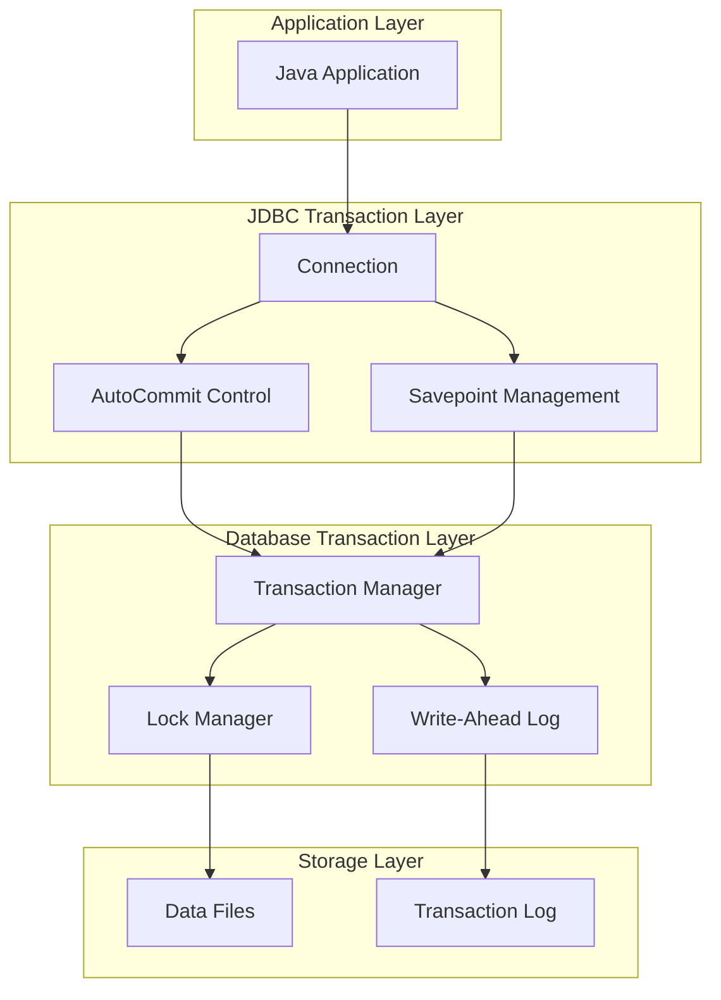
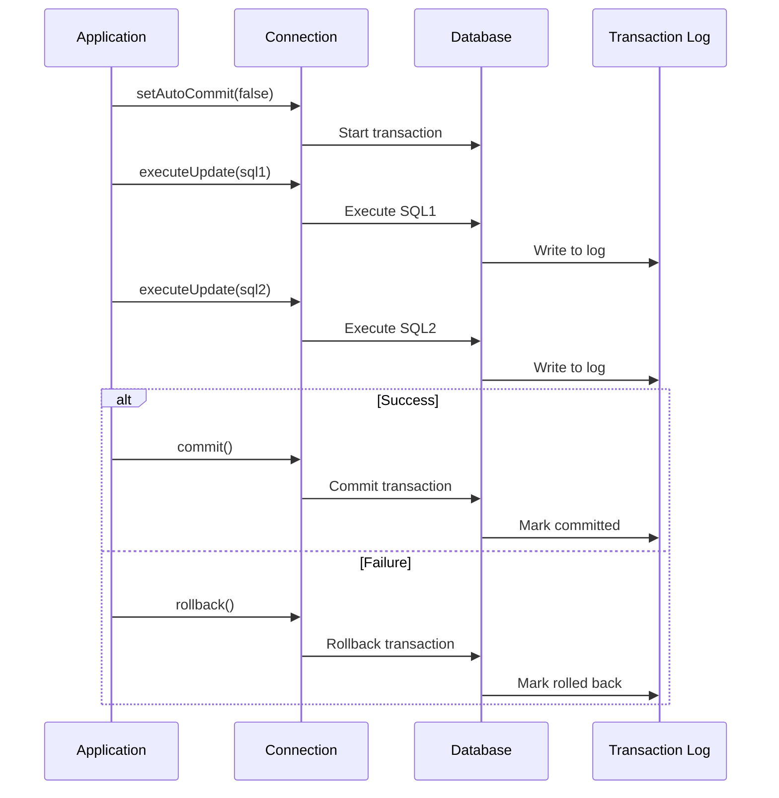

# 03: JDBC Transactions

## 1. Introduction

A transaction in JDBC is a sequence of database operations that are treated as a single unit of work. Transactions ensure data integrity by guaranteeing that either all operations complete successfully or none of them are applied.

JDBC provides explicit transaction management through Connection methods like `setAutoCommit()`, `commit()`, and `rollback()`, along with savepoints for partial rollbacks.

## 2. Learning Objectives

By the end of this lesson, you will be able to:

- Understand transaction concepts and ACID properties
- Control auto-commit behavior in JDBC
- Implement commit and rollback operations
- Use savepoints for partial rollbacks
- Configure transaction isolation levels
- Handle distributed transactions
- Implement retry mechanisms

## 3. Prerequisites

- JDBC Fundamentals (Module 01)
- PreparedStatement usage (Module 02)
- Basic understanding of concurrency

## 4. Why This Concept Exists

Without transactions, database operations could leave data in inconsistent states:

1. **Partial Updates**: One operation succeeds, another fails
2. **Data Corruption**: Incomplete data visible to other users
3. **Business Logic Errors**: Violations of business rules
4. **Concurrency Issues**: Race conditions causing data loss

Transactions solve these problems by providing:
- **Atomicity**: All or nothing execution
- **Consistency**: Data remains valid after transaction
- **Isolation**: Concurrent transactions don't interfere
- **Durability**: Committed data persists

## 5. Problem Statement

Consider a bank transfer:
```java
// Without transactions
account1.withdraw(100); // Succeeds
account2.deposit(100);  // Fails - database error!
// Money is lost!
```

With transactions:
```java
conn.setAutoCommit(false);
try {
    account1.withdraw(100); // Succeeds
    account2.deposit(100);  // Fails - database error!
    conn.commit(); // Never reached
} catch (Exception e) {
    conn.rollback(); // Both operations undone
}
```

## 6. Theory

### ACID Properties

1. **Atomicity**: Transaction is atomic unit; all operations succeed or all fail
2. **Consistency**: Transaction brings database from one valid state to another
3. **Isolation**: Concurrent transactions don't interfere with each other
4. **Durability**: Once committed, changes are permanent

### Transaction Control

- **Auto-commit**: Each statement is its own transaction (default: true)
- **Manual commit**: Group statements into single transaction
- **Rollback**: Undo all changes since last commit
- **Savepoint**: Mark point for partial rollback

### Isolation Levels

1. **READ_UNCOMMITTED**: Can read uncommitted data (dirty reads)
2. **READ_COMMITTED**: Only reads committed data (default for most databases)
3. **REPEATABLE_READ**: Consistent reads within transaction
4. **SERIALIZABLE**: Fully isolated, but lowest concurrency

## 7. Internal Working

### Transaction Lifecycle

1. **Start**: `setAutoCommit(false)` or implicit
2. **Execute**: Run SQL statements
3. **Checkpoint**: Optional savepoints
4. **Commit**: `commit()` makes changes permanent
5. **Rollback**: `rollback()` undoes all changes

### Savepoint Mechanism

1. Create savepoint: `setSavepoint("name")`
2. Execute operations
3. Rollback to savepoint: `rollback(savepoint)`
4. Release savepoint: `releaseSavepoint(savepoint)`

### Isolation Implementation

- **Lock-based**: Rows/tables locked during transaction
- **MVCC**: Multiple versions of data for concurrent access
- **Snapshot isolation**: Transaction sees consistent snapshot

## 8. JVM Perspective

### Transaction State

- **Connection object** holds transaction state
- **Auto-commit flag** controls transaction boundaries
- **Savepoint stack** tracks nested savepoints
- **Transaction ID** assigned by database

### Memory Representation

```
Connection Object
├── autoCommit: boolean
├── transactionIsolation: int
├── savepoints: Stack<Savepoint>
└── transactionId: long (database-assigned)
```

### Resource Management

- Open transactions hold database locks
- Long-running transactions can cause deadlocks
- Savepoints consume database resources
- Rolled-back transactions still consume resources

## 9. Memory Representation

```
Stack Memory:
┌─────────────────────────────────────┐
│ conn (reference) ─────────────────┐│
│ savepoint (reference) ─────────┐  ││
└────────────────────────────────┼──┘│
                                 │   │
Heap Memory:                     │   │
┌────────────────────────────────┼───┘
│ Connection Object              │
│ ├── autoCommit: false          │
│ ├── transactionIsolation:      │
│ │   READ_COMMITTED             │
│ ├── savepoints:                │
│ │   └── Savepoint@1234         │
│ │       ├── id: 1              │
│ │       └── name: "sp1"        │
│ └── transactionId: 98765       │
└────────────────────────────────────┘
```

## 10. Architecture Diagram (Mermaid)



## 11. Flow Diagram (Mermaid)



## 12. Syntax

### Basic Transaction

```java
Connection conn = DriverManager.getConnection(url, user, pass);
conn.setAutoCommit(false);

try {
    // Execute operations
    stmt.executeUpdate(sql1);
    stmt.executeUpdate(sql2);
    conn.commit();
} catch (SQLException e) {
    conn.rollback();
    throw e;
} finally {
    conn.setAutoCommit(true);
}
```

### Savepoints

```java
conn.setAutoCommit(false);
Savepoint savepoint = conn.setSavepoint("beforeOperation");

try {
    stmt.executeUpdate(sql1);
    stmt.executeUpdate(sql2);
    conn.commit();
} catch (SQLException e) {
    conn.rollback(savepoint);
    conn.commit(); // Commit partial work
}
```

### Isolation Levels

```java
conn.setTransactionIsolation(Connection.TRANSACTION_READ_COMMITTED);
conn.setTransactionIsolation(Connection.TRANSACTION_REPEATABLE_READ);
conn.setTransactionIsolation(Connection.TRANSACTION_SERIALIZABLE);
```

## 13. Easy Example

```java
import java.sql.*;

public class TransactionBasic {
    public static void main(String[] args) throws SQLException {
        String url = "jdbc:h2:mem:testdb";
        
        try (Connection conn = DriverManager.getConnection(url, "sa", "")) {
            // Create tables
            conn.createStatement().execute("""
                CREATE TABLE accounts (
                    id INT PRIMARY KEY,
                    name VARCHAR(100),
                    balance DECIMAL(10,2)
                )
                """);
            
            // Insert test data
            conn.createStatement().executeUpdate(
                "INSERT INTO accounts VALUES (1, 'Alice', 1000.00)"
            );
            conn.createStatement().executeUpdate(
                "INSERT INTO accounts VALUES (2, 'Bob', 1000.00)"
            );
            
            // Transfer money
            transfer(conn, 1, 2, 100.00);
            
            // Verify
            printBalances(conn);
        }
    }
    
    private static void transfer(Connection conn, int from, int to, double amount) 
            throws SQLException {
        conn.setAutoCommit(false);
        
        try {
            // Withdraw from sender
            PreparedStatement withdraw = conn.prepareStatement(
                "UPDATE accounts SET balance = balance - ? WHERE id = ? AND balance >= ?"
            );
            withdraw.setDouble(1, amount);
            withdraw.setInt(2, from);
            withdraw.setDouble(3, amount);
            int affected = withdraw.executeUpdate();
            
            if (affected == 0) {
                throw new SQLException("Insufficient funds");
            }
            
            // Deposit to receiver
            PreparedStatement deposit = conn.prepareStatement(
                "UPDATE accounts SET balance = balance + ? WHERE id = ?"
            );
            deposit.setDouble(1, amount);
            deposit.setInt(2, to);
            deposit.executeUpdate();
            
            conn.commit();
            System.out.println("Transfer successful");
        } catch (SQLException e) {
            conn.rollback();
            System.out.println("Transfer failed: " + e.getMessage());
            throw e;
        } finally {
            conn.setAutoCommit(true);
        }
    }
    
    private static void printBalances(Connection conn) throws SQLException {
        try (ResultSet rs = conn.createStatement().executeQuery(
                "SELECT name, balance FROM accounts")) {
            System.out.println("\nBalances:");
            while (rs.next()) {
                System.out.printf("%s: $%.2f%n", 
                    rs.getString("name"), 
                    rs.getDouble("balance"));
            }
        }
    }
}
```

## 14. Medium Example

```java
import java.sql.*;

public class TransactionSavepoint {
    public static void main(String[] args) throws SQLException {
        String url = "jdbc:h2:mem:testdb";
        
        try (Connection conn = DriverManager.getConnection(url, "sa", "")) {
            conn.createStatement().execute("""
                CREATE TABLE orders (
                    id INT PRIMARY KEY,
                    product_id INT,
                    quantity INT,
                    total DECIMAL(10,2)
                )
                """);
            
            conn.createStatement().execute("""
                CREATE TABLE inventory (
                    id INT PRIMARY KEY,
                    stock INT
                )
                """);
            
            conn.createStatement().executeUpdate(
                "INSERT INTO inventory VALUES (1, 10)"
            );
            
            processOrder(conn, 1, 1, 5, 49.99);
        }
    }
    
    private static void processOrder(Connection conn, int orderId, int productId, 
                                      int quantity, double price) throws SQLException {
        conn.setAutoCommit(false);
        
        Savepoint inventoryCheck = conn.setSavepoint("inventoryCheck");
        
        try {
            // Check and update inventory
            PreparedStatement checkStock = conn.prepareStatement(
                "SELECT stock FROM inventory WHERE id = ?"
            );
            checkStock.setInt(1, productId);
            ResultSet rs = checkStock.executeQuery();
            
            if (!rs.next() || rs.getInt("stock") < quantity) {
                throw new SQLException("Insufficient stock");
            }
            
            // Update inventory
            PreparedStatement updateInventory = conn.prepareStatement(
                "UPDATE inventory SET stock = stock - ? WHERE id = ?"
            );
            updateInventory.setInt(1, quantity);
            updateInventory.setInt(2, productId);
            updateInventory.executeUpdate();
            
            // Create order
            PreparedStatement createOrder = conn.prepareStatement(
                "INSERT INTO orders (id, product_id, quantity, total) VALUES (?, ?, ?, ?)"
            );
            createOrder.setInt(1, orderId);
            createOrder.setInt(2, productId);
            createOrder.setInt(3, quantity);
            createOrder.setDouble(4, quantity * price);
            createOrder.executeUpdate();
            
            conn.commit();
            System.out.println("Order processed successfully");
        } catch (SQLException e) {
            conn.rollback(inventoryCheck);
            System.out.println("Order failed: " + e.getMessage());
            throw e;
        } finally {
            conn.setAutoCommit(true);
        }
    }
}
```

## 15. Hard Example

```java
import java.sql.*;
import java.util.concurrent.TimeUnit;

public class TransactionRetry {
    private static final int MAX_RETRIES = 3;
    private static final long RETRY_DELAY_MS = 100;
    
    public static void main(String[] args) throws SQLException {
        String url = "jdbc:h2:mem:testdb";
        
        try (Connection conn = DriverManager.getConnection(url, "sa", "")) {
            conn.createStatement().execute("""
                CREATE TABLE counter (
                    id INT PRIMARY KEY,
                    value INT
                )
                """);
            
            conn.createStatement().executeUpdate(
                "INSERT INTO counter VALUES (1, 0)"
            );
            
            // Simulate concurrent updates
            for (int i = 0; i < 10; i++) {
                incrementWithRetry(conn);
            }
            
            // Verify
            try (ResultSet rs = conn.createStatement().executeQuery(
                    "SELECT value FROM counter WHERE id = 1")) {
                rs.next();
                System.out.println("Final value: " + rs.getInt("value"));
            }
        }
    }
    
    private static void incrementWithRetry(Connection conn) throws SQLException {
        int retries = 0;
        
        while (retries < MAX_RETRIES) {
            try {
                conn.setAutoCommit(false);
                
                // Read current value
                PreparedStatement read = conn.prepareStatement(
                    "SELECT value FROM counter WHERE id = 1"
                );
                ResultSet rs = read.executeQuery();
                rs.next();
                int currentValue = rs.getInt("value");
                
                // Simulate processing delay
                TimeUnit.MILLISECONDS.sleep(10);
                
                // Update value
                PreparedStatement update = conn.prepareStatement(
                    "UPDATE counter SET value = ? WHERE id = 1 AND value = ?"
                );
                update.setInt(1, currentValue + 1);
                update.setInt(2, currentValue);
                int affected = update.executeUpdate();
                
                if (affected == 0) {
                    throw new SQLException("Concurrent modification detected");
                }
                
                conn.commit();
                return;
            } catch (SQLException | InterruptedException e) {
                try {
                    conn.rollback();
                } catch (SQLException rollbackEx) {
                    rollbackEx.addSuppressed(e);
                    throw rollbackEx;
                }
                
                retries++;
                if (retries >= MAX_RETRIES) {
                    throw new SQLException("Max retries exceeded", e);
                }
                
                try {
                    TimeUnit.MILLISECONDS.sleep(RETRY_DELAY_MS * retries);
                } catch (InterruptedException ie) {
                    Thread.currentThread().interrupt();
                    throw new SQLException("Interrupted during retry", ie);
                }
            } finally {
                try {
                    conn.setAutoCommit(true);
                } catch (SQLException e) {
                    // Log and continue
                }
            }
        }
    }
}
```

## 16. Enterprise Example

```java
import java.sql.*;
import java.util.ArrayList;
import java.util.List;

public class TransactionManager {
    private final Connection conn;
    
    public TransactionManager(Connection conn) {
        this.conn = conn;
    }
    
    public <T> T executeInTransaction(TransactionCallback<T> callback) throws SQLException {
        conn.setAutoCommit(false);
        
        try {
            T result = callback.execute(conn);
            conn.commit();
            return result;
        } catch (Exception e) {
            conn.rollback();
            throw new SQLException("Transaction failed", e);
        } finally {
            conn.setAutoCommit(true);
        }
    }
    
    public <T> T executeWithSavepoint(SavepointCallback<T> callback) throws SQLException {
        conn.setAutoCommit(false);
        Savepoint savepoint = conn.setSavepoint();
        
        try {
            T result = callback.execute(conn, savepoint);
            conn.commit();
            return result;
        } catch (Exception e) {
            conn.rollback(savepoint);
            conn.commit();
            throw new SQLException("Operation failed, partial transaction committed", e);
        } finally {
            conn.setAutoCommit(true);
        }
    }
    
    @FunctionalInterface
    public interface TransactionCallback<T> {
        T execute(Connection conn) throws SQLException;
    }
    
    @FunctionalInterface
    public interface SavepointCallback<T> {
        T execute(Connection conn, Savepoint savepoint) throws SQLException;
    }
}
```

## 17. Performance

### Transaction Overhead

| Operation | Time Overhead | Notes |
|-----------|---------------|-------|
| Auto-commit on | 0ms | Each statement is separate transaction |
| Auto-commit off | 1-10ms | Transaction coordination overhead |
| Commit | 5-50ms | Dependent on durability settings |
| Rollback | 5-50ms | Similar to commit overhead |
| Savepoint | 1-5ms | Lightweight checkpoint |

### Best Practices

1. **Batch operations**: Group related operations in single transaction
2. **Minimize transaction duration**: Hold locks for shortest time possible
3. **Use appropriate isolation level**: Balance consistency vs performance
4. **Avoid long-running transactions**: Can cause lock contention
5. **Use savepoints wisely**: Only when partial rollback is needed

## 18. Time & Space Complexity

| Operation | Time Complexity | Space Complexity |
|-----------|-----------------|------------------|
| Transaction start | O(1) | O(1) |
| Statement execution | O(n) | O(1) |
| Commit | O(1) | O(1) |
| Rollback | O(1) | O(1) |
| Savepoint creation | O(1) | O(1) |
| Savepoint rollback | O(n) | O(1) |

## 19. Thread Safety

### Thread Safety Issues

1. **Connection sharing**: Not thread-safe
2. **Auto-commit state**: Shared mutable state
3. **Transaction state**: Database-level synchronization
4. **Savepoint management**: Not thread-safe

### Solutions

```java
// Thread-local connection
private static final ThreadLocal<Connection> threadLocalConn = 
    ThreadLocal.withInitial(() -> createConnection());

// Transaction per thread
public void executeInThread(Runnable task) {
    Connection conn = threadLocalConn.get();
    conn.setAutoCommit(false);
    try {
        task.run();
        conn.commit();
    } catch (Exception e) {
        conn.rollback();
    } finally {
        conn.setAutoCommit(true);
    }
}
```

### Best Practices

- Use connection pooling with thread isolation
- Each thread should have its own Connection
- Avoid sharing transaction state between threads
- Use synchronization only for shared resources

## 20. Best Practices

1. **Always use try-with-resources** for connection management
2. **Set auto-commit to false** for multi-statement transactions
3. **Handle exceptions properly** with rollback
4. **Use savepoints** for complex rollback scenarios
5. **Choose appropriate isolation level** for your use case
6. **Minimize transaction duration** to reduce lock contention
7. **Use batch operations** for bulk data modifications
8. **Implement retry logic** for transient failures
9. **Monitor transaction metrics** for performance tuning
10. **Document transaction boundaries** for maintenance

## 21. Common Mistakes

1. **Forgetting to rollback**: Leaving transaction open
2. **Not handling exceptions**: Missing rollback in catch block
3. **Auto-commit left off**: Next operation starts new transaction
4. **Long-running transactions**: Holding locks too long
5. **Wrong isolation level**: Causing data inconsistency
6. **Nested transactions**: JDBC doesn't support true nesting

## 22. Pitfalls

1. **Deadlocks**: Multiple transactions waiting for each other
2. **Lock escalation**: Row locks becoming table locks
3. **Phantom reads**: New rows appearing between reads
4. **Non-repeatable reads**: Data changing between reads
5. **Resource leaks**: Connections not properly closed
6. **Performance degradation**: Overly strict isolation levels

## 23. Debugging Tips

1. **Enable transaction logging**: Database-level logging
2. **Monitor lock waits**: Detect deadlock situations
3. **Check isolation level**: Verify correct configuration
4. **Use explain plans**: Analyze query performance
5. **Profile connection usage**: Detect connection leaks
6. **Monitor transaction duration**: Identify long-running transactions

## 24. Comparison Table

| Feature | Auto-commit | Manual Transaction |
|---------|-------------|-------------------|
| Atomicity | No | Yes |
| Performance | Better for single statements | Better for batch operations |
| Complexity | Simple | Moderate |
| Use Case | Simple CRUD | Complex business logic |
| Rollback | Not supported | Full support |

## 25. Decision Tree

```
Need to modify multiple related rows?
├── Yes
│   ├── Need atomicity?
│   │   └── Yes → Use transaction
│   ├── Need partial rollback?
│   │   └── Yes → Use savepoints
│   └── Concurrent access?
│       └── Yes → Choose appropriate isolation level
└── No
    └── Single statement? → Auto-commit is fine
```

## 26. Interview Questions

1. What are ACID properties in database transactions?
2. How do you implement transactions in JDBC?
3. Explain the difference between commit and rollback.
4. What is a savepoint and when would you use it?
5. Explain transaction isolation levels.
6. What is dirty reading and how to prevent it?
7. How do you handle transaction timeouts?
8. What are deadlocks and how to prevent them?
9. Explain the difference between optimistic and pessimistic locking.
10. How do you implement retry mechanisms for transactions?
11. What is the impact of isolation level on performance?
12. How do you manage transactions in a multi-threaded environment?
13. What are the best practices for transaction management?
14. Explain distributed transactions and two-phase commit.
15. How do you test transactional code?

## 27. Exercises

### Level 1 (Easy)

1. **Basic Transaction**: Implement a bank transfer with proper transaction handling.
2. **Exception Handling**: Create a transaction that rolls back on any exception.
3. **Auto-commit Control**: Demonstrate the difference between auto-commit on and off.

### Level 2 (Medium)

1. **Savepoint Usage**: Implement an order processing system with partial rollback.
2. **Isolation Levels**: Test different isolation levels with concurrent transactions.
3. **Retry Mechanism**: Implement a retry mechanism for deadlocked transactions.

### Level 3 (Hard)

1. **Distributed Transaction**: Simulate a distributed transaction across multiple databases.
2. **Transaction Manager**: Build a custom transaction manager with savepoint support.
3. **Performance Testing**: Measure the impact of different isolation levels on throughput.

## 28. Summary

Transaction management is crucial for data integrity:

- Use `setAutoCommit(false)` to start manual transactions
- Always call `commit()` or `rollback()` to complete transactions
- Use savepoints for complex rollback scenarios
- Choose appropriate isolation level for your use case
- Minimize transaction duration to reduce contention
- Implement proper exception handling with rollback

## 29. References

- [JDBC Transaction Management](https://www.baeldung.com/java-transaction-management)
- [Transaction Isolation Levels](https://docs.oracle.com/javase/tutorial/jdbc/basics/transactions.html)
- [Database ACID Properties](https://en.wikipedia.org/wiki/ACID)
- [Savepoint Tutorial](https://www.baeldung.com/jdbc-savepoint)
- [Concurrency and Transactions](https://www.baeldung.com/jdbc-concurrency)
