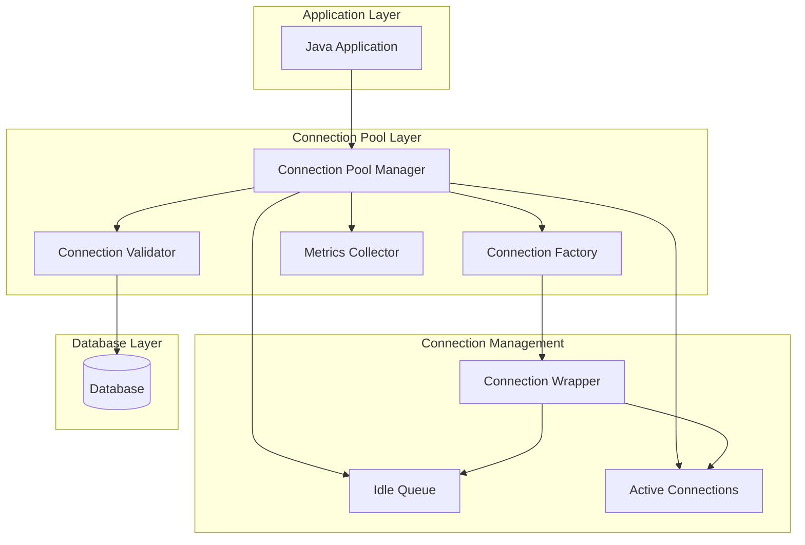
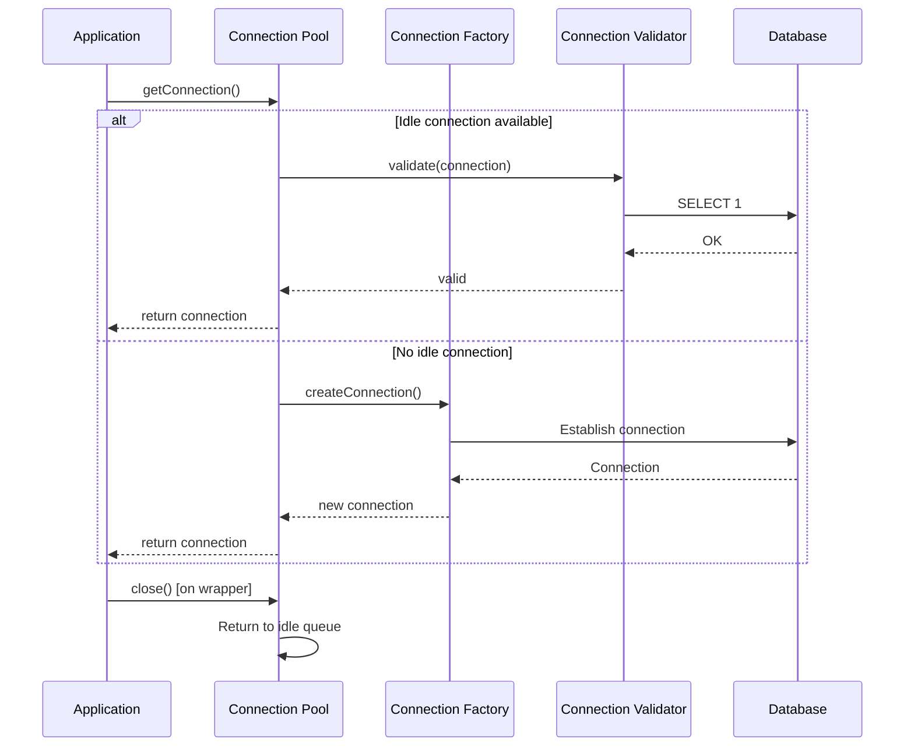

# 04: JDBC Connection Pooling

## 1. Introduction

Connection pooling is a technique for managing database connections by reusing existing connections instead of creating new ones for each request. This dramatically improves performance and resource utilization in database-driven applications.

Connection pools manage the lifecycle of database connections, including creation, validation, reuse, and destruction. Popular implementations include HikariCP, Apache Druid, and Apache DBCP.

## 2. Learning Objectives

By the end of this lesson, you will be able to:

- Understand connection pooling concepts and benefits
- Configure and use HikariCP connection pool
- Implement connection validation and health checks
- Tune pool parameters for optimal performance
- Monitor connection pool metrics
- Handle connection leaks and timeouts
- Compare different connection pool implementations

## 3. Prerequisites

- JDBC Fundamentals (Module 01)
- Basic understanding of threading
- Knowledge of database connections

## 4. Why This Concept Exists

Without connection pooling:

1. **Performance Overhead**: Creating TCP connections takes 50-100ms
2. **Resource Waste**: Each connection consumes memory and file descriptors
3. **Database Limitations**: Databases have maximum connection limits
4. **Scalability Issues**: Cannot handle high concurrency

Connection pooling solves these problems by:
- Reusing existing connections
- Managing connection lifecycle
- Providing connection validation
- Offering monitoring and metrics

## 5. Problem Statement

Consider a web application handling 1000 concurrent requests:

```java
// Without pooling - creates 1000 connections
for (Request request : requests) {
    Connection conn = DriverManager.getConnection(url, user, pass); // Slow!
    // Process request
    conn.close(); // Connection destroyed
}
```

Problems:
- 1000 TCP handshakes (50-100ms each)
- 1000 connection objects in memory
- Database may reject connections (max_connections limit)
- No connection reuse

## 6. Theory

### Connection Pool Architecture

```
Application → Connection Pool → Database
                ↓
            [Connection1]
            [Connection2]
            [Connection3]
            ...
```

### Pool Components

1. **Connection Factory**: Creates new connections
2. **Connection Wrapper**: Decorates connections for tracking
3. **Idle Connection Keeper**: Maintains minimum idle connections
4. **Connection Validator**: Tests connection health
5. **Metrics Collector**: Tracks pool statistics

### Pool Lifecycle

1. **Initialization**: Create minimum connections
2. **Request**: Borrow connection from pool
3. **Validation**: Test connection health
4. **Return**: Return connection to pool
5. **Eviction**: Remove idle/invalid connections
6. **Shutdown**: Close all connections

## 7. Internal Working

### Connection Request Flow

1. Application requests connection
2. Pool checks for available idle connection
3. If available, validate and return
4. If not, create new connection (if under max)
5. If at max, wait for available connection
6. Return connection to application

### Connection Return Flow

1. Application closes connection (wrapper intercepts)
2. Connection returned to idle pool
3. If pool is full, connection is closed
4. If connection is invalid, it's discarded
5. Metrics updated

### Validation Mechanism

- **Connection test query**: `SELECT 1`
- **Validation timeout**: Maximum wait for validation
- **Keepalive**: Periodic background validation
- **Leak detection**: Track connection usage time

## 8. JVM Perspective

### Memory Management

- **Pool Manager**: Singleton instance
- **Connection Objects**: Wrapped in proxy objects
- **Idle Queue**: LinkedList of available connections
- **Active Set**: HashSet of borrowed connections
- **Metrics Objects**: AtomicLong counters

### Thread Management

- **Borrow Thread**: Thread requesting connection
- **Return Thread**: Thread returning connection
- **Eviction Thread**: Background thread for cleanup
- **Validation Thread**: Background thread for health checks

### Object Lifecycle

- **Connection creation**: Heap allocation
- **Connection wrapping**: Proxy object creation
- **Connection return**: Object moved to idle queue
- **Connection eviction**: Object marked for GC

## 9. Memory Representation

```
Stack Memory:
┌─────────────────────────────────────┐
│ pool (reference) ─────────────────┐│
│ conn (reference) ──────────────┐  ││
└────────────────────────────────┼──┘│
                                 │   │
Heap Memory:                     │   │
┌────────────────────────────────┼───┘
│ HikariDataSource               │
│ ├── pool: HikariPool           │
│ │   ├── idleConnections:       │
│ │   │   └── [Conn@1, Conn@2]  │
│ │   ├── activeConnections:     │
│ │   │   └── [Conn@3]          │
│ │   └── config: HikariConfig  │
│ └── ...                        │
├────────────────────────────────┤
│ HikariProxyConnection@3        │
│ ├── delegate: Connection@1234  │
│ ├── borrowedAt: 1234567890     │
│ └── owner: Thread@main         │
└────────────────────────────────┘
```

## 10. Architecture Diagram (Mermaid)



## 11. Flow Diagram (Mermaid)



## 12. Syntax

### HikariCP Basic Configuration

```java
HikariConfig config = new HikariConfig();
config.setJdbcUrl("jdbc:mysql://localhost:3306/mydb");
config.setUsername("user");
config.setPassword("password");

// Pool settings
config.setMaximumPoolSize(10);
config.setMinimumIdle(5);
config.setConnectionTimeout(30000);
config.setIdleTimeout(600000);
config.setMaxLifetime(1800000);

// Validation
config.setConnectionTestQuery("SELECT 1");
config.setValidationTimeout(5000);

// Leak detection
config.setLeakDetectionThreshold(60000);

HikariDataSource dataSource = new HikariDataSource(config);
```

### Using Connection Pool

```java
try (Connection conn = dataSource.getConnection()) {
    // Use connection
    // Auto-returned to pool when closed
}
```

### Advanced Configuration

```java
config.addDataSourceProperty("cachePrepStmts", "true");
config.addDataSourceProperty("prepStmtCacheSize", "250");
config.addDataSourceProperty("prepStmtCacheSqlLimit", "2048");
config.addDataSourceProperty("useServerPrepStmts", "true");
```

## 13. Easy Example

```java
import com.zaxxer.hikari.HikariConfig;
import com.zaxxer.hikari.HikariDataSource;
import java.sql.*;

public class ConnectionPoolBasic {
    private static HikariDataSource dataSource;
    
    public static void main(String[] args) throws SQLException {
        // Configure pool
        HikariConfig config = new HikariConfig();
        config.setJdbcUrl("jdbc:h2:mem:testdb");
        config.setUsername("sa");
        config.setPassword("");
        config.setMaximumPoolSize(5);
        config.setMinimumIdle(2);
        
        dataSource = new HikariDataSource(config);
        
        // Use connections
        try (Connection conn1 = dataSource.getConnection();
             Connection conn2 = dataSource.getConnection()) {
            
            conn1.createStatement().execute("""
                CREATE TABLE users (id INT PRIMARY KEY, name VARCHAR(100))
                """);
            
            conn1.createStatement().executeUpdate(
                "INSERT INTO users VALUES (1, 'Alice')"
            );
            
            try (ResultSet rs = conn2.createStatement().executeQuery(
                    "SELECT * FROM users")) {
                while (rs.next()) {
                    System.out.printf("User: %s%n", rs.getString("name"));
                }
            }
        }
        
        // Pool stats
        System.out.printf("Active connections: %d%n", 
            dataSource.getHikariPoolMXBean().getActiveConnections());
        System.out.printf("Idle connections: %d%n", 
            dataSource.getHikariPoolMXBean().getIdleConnections());
        
        dataSource.close();
    }
}
```

## 14. Medium Example

```java
import com.zaxxer.hikari.HikariConfig;
import com.zaxxer.hikari.HikariDataSource;
import java.sql.*;
import java.util.concurrent.ExecutorService;
import java.util.concurrent.Executors;
import java.util.concurrent.TimeUnit;

public class ConnectionPoolAdvanced {
    private static HikariDataSource dataSource;
    
    public static void main(String[] args) throws InterruptedException {
        HikariConfig config = createConfig();
        dataSource = new HikariDataSource(config);
        
        ExecutorService executor = Executors.newFixedThreadPool(20);
        
        for (int i = 0; i < 100; i++) {
            final int userId = i;
            executor.submit(() -> processUser(userId));
        }
        
        executor.shutdown();
        executor.awaitTermination(1, TimeUnit.MINUTES);
        
        printPoolStats();
        dataSource.close();
    }
    
    private static HikariConfig createConfig() {
        HikariConfig config = new HikariConfig();
        config.setJdbcUrl("jdbc:h2:mem:pooltest");
        config.setUsername("sa");
        config.setPassword("");
        
        // Pool sizing
        config.setMaximumPoolSize(10);
        config.setMinimumIdle(5);
        
        // Timeouts
        config.setConnectionTimeout(5000);
        config.setIdleTimeout(300000);
        config.setMaxLifetime(900000);
        
        // Validation
        config.setConnectionTestQuery("SELECT 1");
        config.setValidationTimeout(2000);
        
        // Leak detection
        config.setLeakDetectionThreshold(10000);
        
        // Performance
        config.addDataSourceProperty("cachePrepStmts", "true");
        config.addDataSourceProperty("prepStmtCacheSize", "250");
        
        return config;
    }
    
    private static void processUser(int userId) {
        try (Connection conn = dataSource.getConnection()) {
            // Simulate processing
            Thread.sleep(10);
            
            try (PreparedStatement pstmt = conn.prepareStatement(
                    "SELECT * FROM users WHERE id = ?")) {
                pstmt.setInt(1, userId);
                pstmt.executeQuery();
            }
        } catch (SQLException | InterruptedException e) {
            System.err.println("Error processing user " + userId);
        }
    }
    
    private static void printPoolStats() {
        var pool = dataSource.getHikariPoolMXBean();
        System.out.printf("Pool Stats - Active: %d, Idle: %d, Waiting: %d%n",
            pool.getActiveConnections(),
            pool.getIdleConnections(),
            pool.getThreadsAwaitingConnection());
    }
}
```

## 15. Hard Example

```java
import com.zaxxer.hikari.HikariConfig;
import com.zaxxer.hikari.HikariDataSource;
import java.sql.*;
import java.util.concurrent.atomic.AtomicLong;

public class ConnectionPoolMonitoring {
    private static HikariDataSource dataSource;
    private static final AtomicLong totalRequests = new AtomicLong();
    private static final AtomicLong totalWaitTime = new AtomicLong();
    
    public static void main(String[] args) throws InterruptedException {
        HikariConfig config = createMonitoredConfig();
        dataSource = new HikariDataSource(config);
        
        // Start monitoring thread
        Thread monitorThread = new Thread(ConnectionPoolMonitoring::monitorPool);
        monitorThread.setDaemon(true);
        monitorThread.start();
        
        // Simulate load
        for (int i = 0; i < 50; i++) {
            new Thread(() -> simulateWork()).start();
            Thread.sleep(100);
        }
        
        Thread.sleep(5000);
        
        System.out.println("Final Stats:");
        printDetailedStats();
        
        dataSource.close();
    }
    
    private static HikariConfig createMonitoredConfig() {
        HikariConfig config = new HikariConfig();
        config.setJdbcUrl("jdbc:h2:mem:monitored");
        config.setUsername("sa");
        config.setPassword("");
        config.setMaximumPoolSize(5);
        config.setMinimumIdle(2);
        config.setConnectionTimeout(3000);
        config.setLeakDetectionThreshold(5000);
        
        // Enable JMX metrics
        config.setPoolName("MonitoredPool");
        config.setRegisterMbeans(true);
        
        return config;
    }
    
    private static void simulateWork() {
        long startTime = System.currentTimeMillis();
        
        try (Connection conn = dataSource.getConnection()) {
            long waitTime = System.currentTimeMillis() - startTime;
            totalWaitTime.addAndGet(waitTime);
            totalRequests.incrementAndGet();
            
            // Simulate database work
            Thread.sleep(50 + (int) (Math.random() * 100));
            
            try (Statement stmt = conn.createStatement();
                 ResultSet rs = stmt.executeQuery("SELECT 1")) {
                rs.next();
            }
        } catch (SQLException | InterruptedException e) {
            // Handle error
        }
    }
    
    private static void monitorPool() {
        while (!Thread.currentThread().isInterrupted()) {
            try {
                Thread.sleep(1000);
                printDetailedStats();
            } catch (InterruptedException e) {
                Thread.currentThread().interrupt();
                break;
            }
        }
    }
    
    private static void printDetailedStats() {
        var pool = dataSource.getHikariPoolMXBean();
        System.out.printf("[%s] Active: %d, Idle: %d, Waiting: %d, Avg Wait: %.2fms%n",
            java.time.LocalTime.now(),
            pool.getActiveConnections(),
            pool.getIdleConnections(),
            pool.getThreadsAwaitingConnection(),
            totalRequests.get() > 0 ? 
                (double) totalWaitTime.get() / totalRequests.get() : 0);
    }
}
```

## 16. Enterprise Example

```java
import com.zaxxer.hikari.HikariConfig;
import com.zaxxer.hikari.HikariDataSource;
import java.sql.*;
import java.util.concurrent.locks.ReentrantReadWriteLock;

public class EnterpriseConnectionPool {
    private final HikariDataSource dataSource;
    private final ReentrantReadWriteLock lock = new ReentrantReadWriteLock();
    private volatile boolean isHealthy = true;
    
    public EnterpriseConnectionPool(String url, String user, String password) {
        HikariConfig config = createEnterpriseConfig(url, user, password);
        this.dataSource = new HikariDataSource(config);
        startHealthCheck();
    }
    
    private HikariConfig createEnterpriseConfig(String url, String user, String password) {
        HikariConfig config = new HikariConfig();
        config.setJdbcUrl(url);
        config.setUsername(user);
        config.setPassword(password);
        
        // Production settings
        config.setMaximumPoolSize(20);
        config.setMinimumIdle(10);
        config.setConnectionTimeout(10000);
        config.setIdleTimeout(600000);
        config.setMaxLifetime(1800000);
        
        // Validation
        config.setConnectionTestQuery("SELECT 1");
        config.setValidationTimeout(5000);
        
        // Performance tuning
        config.addDataSourceProperty("cachePrepStmts", "true");
        config.addDataSourceProperty("prepStmtCacheSize", "500");
        config.addDataSourceProperty("prepStmtCacheSqlLimit", "4096");
        config.addDataSourceProperty("useServerPrepStmts", "true");
        config.addDataSourceProperty("rewriteBatchedInserts", "true");
        
        // Monitoring
        config.setPoolName("EnterprisePool");
        config.setRegisterMbeans(true);
        config.setLeakDetectionThreshold(30000);
        
        return config;
    }
    
    public <T> T executeWithConnection(ConnectionCallback<T> callback) throws SQLException {
        lock.readLock().lock();
        try {
            if (!isHealthy) {
                throw new SQLException("Pool is unhealthy");
            }
            
            try (Connection conn = dataSource.getConnection()) {
                return callback.execute(conn);
            }
        } finally {
            lock.readLock().unlock();
        }
    }
    
    private void startHealthCheck() {
        Thread healthCheckThread = new Thread(() -> {
            while (!Thread.currentThread().isInterrupted()) {
                try {
                    Thread.sleep(30000);
                    performHealthCheck();
                } catch (InterruptedException e) {
                    Thread.currentThread().interrupt();
                    break;
                }
            }
        });
        healthCheckThread.setDaemon(true);
        healthCheckThread.start();
    }
    
    private void performHealthCheck() {
        lock.writeLock().lock();
        try {
            try (Connection conn = dataSource.getConnection()) {
                try (Statement stmt = conn.createStatement();
                     ResultSet rs = stmt.executeQuery("SELECT 1")) {
                    rs.next();
                    isHealthy = true;
                }
            }
        } catch (SQLException e) {
            isHealthy = false;
            System.err.println("Health check failed: " + e.getMessage());
        } finally {
            lock.writeLock().unlock();
        }
    }
    
    public PoolStats getStats() {
        var pool = dataSource.getHikariPoolMXBean();
        return new PoolStats(
            pool.getActiveConnections(),
            pool.getIdleConnections(),
            pool.getThreadsAwaitingConnection(),
            isHealthy
        );
    }
    
    public void shutdown() {
        dataSource.close();
    }
    
    @FunctionalInterface
    public interface ConnectionCallback<T> {
        T execute(Connection conn) throws SQLException;
    }
    
    public record PoolStats(
        int activeConnections,
        int idleConnections,
        int waitingThreads,
        boolean healthy
    ) {}
}
```

## 17. Performance

### Connection Pool Performance Impact

| Operation | Without Pool | With Pool | Improvement |
|-----------|--------------|-----------|-------------|
| Connection creation | 50-100ms | 0ms (reused) | 100% |
| Connection close | 10-20ms | 1ms (returned) | 90% |
| Concurrent 100 users | 100 connections | 10 connections | 90% |
| Memory usage | High | Low | 80% |

### HikariCP vs Other Pools

| Feature | HikariCP | DBCP2 | Druid |
|---------|----------|-------|-------|
| Performance | Fastest | Good | Good |
| Memory | Low | Medium | Medium |
| Features | Basic | Good | Excellent |
| Monitoring | JMX | JMX | JMX, Web |
| Complexity | Simple | Moderate | High |

### Pool Sizing Guidelines

- **Minimum idle**: CPU cores + 1
- **Maximum pool**: (CPU cores × 2) + effective spindle count
- **Connection timeout**: 1-5 seconds
- **Idle timeout**: 10 minutes
- **Max lifetime**: 30 minutes

## 18. Time & Space Complexity

| Operation | Time Complexity | Space Complexity |
|-----------|-----------------|------------------|
| getConnection() | O(1) average | O(1) |
| returnConnection() | O(1) | O(1) |
| validateConnection() | O(1) | O(1) |
| createConnection() | O(1) | O(1) |
| pool initialization | O(minIdle) | O(maxPoolSize) |
| connection eviction | O(n) | O(1) |

## 19. Thread Safety

### Thread Safety Issues

1. **Pool access**: Multiple threads requesting connections
2. **Connection borrowing**: Concurrent access to idle queue
3. **Connection returning**: Concurrent return operations
4. **Pool statistics**: Concurrent metric updates

### Solutions

```java
// HikariCP uses ConcurrentHashMap internally
// Connection borrowing is synchronized
// Connection returning is atomic
// Metrics use AtomicLong

// Custom pool with proper synchronization
public class ThreadSafePool {
    private final LinkedBlockingDeque<Connection> idleConnections = new LinkedBlockingDeque<>();
    private final AtomicInteger activeCount = new AtomicInteger();
    
    public Connection getConnection() throws SQLException {
        Connection conn = idleConnections.poll();
        if (conn == null) {
            if (activeCount.get() < maxPoolSize) {
                conn = createConnection();
                activeCount.incrementAndGet();
            } else {
                conn = idleConnections.take(); // Block
            }
        }
        return wrapConnection(conn);
    }
}
```

### Best Practices

- Use connection pooling library (HikariCP)
- Don't create custom pools unless necessary
- Configure appropriate pool size
- Monitor thread contention
- Use bounded timeouts for connection requests

## 20. Best Practices

1. **Use HikariCP**: Fastest and most reliable
2. **Right-size the pool**: Too small = contention, too large = resource waste
3. **Configure timeouts**: Prevent hanging connections
4. **Enable leak detection**: Find connection leaks early
5. **Monitor pool metrics**: Track active, idle, waiting connections
6. **Use connection validation**: Ensure connection health
7. **Set max lifetime**: Prevent stale connections
8. **Configure statement caching**: Improve performance
9. **Use JMX monitoring**: Enable MBean registration
10. **Test under load**: Verify pool performance

## 21. Common Mistakes

1. **Pool too small**: Causes connection starvation
2. **Pool too large**: Wastes database resources
3. **No leak detection**: Connections never returned
4. **No validation**: Using stale connections
5. **Wrong timeout settings**: Connections hang indefinitely
6. **Not closing connections**: Resources leaked
7. **Ignoring metrics**: No visibility into pool health

## 22. Pitfalls

1. **Connection leaks**: Connections not returned to pool
2. **Pool exhaustion**: All connections borrowed
3. **Stale connections**: Database closes connections
4. **Thread contention**: High concurrency issues
5. **Memory leaks**: Pool objects not garbage collected
6. **Configuration errors**: Wrong pool settings

## 23. Debugging Tips

1. **Enable pool logging**: HikariCP logging
2. **Monitor pool metrics**: Track active, idle, waiting
3. **Check connection leaks**: Use leak detection threshold
4. **Profile under load**: Test with realistic traffic
5. **Monitor database connections**: Check max_connections
6. **Use JMX monitoring**: Track pool performance

## 24. Comparison Table

| Feature | No Pool | DBCP2 | HikariCP | Druid |
|---------|---------|-------|----------|-------|
| Performance | Poor | Good | Excellent | Good |
| Memory | High | Medium | Low | Medium |
| Features | Basic | Good | Basic | Excellent |
| Monitoring | None | JMX | JMX | JMX, Web |
| Leak Detection | No | Yes | Yes | Yes |
| Validation | No | Yes | Yes | Yes |
| Statement Cache | No | Yes | Yes | Yes |

## 25. Decision Tree

```
Need connection pooling?
├── Yes
│   ├── Simple application?
│   │   └── Yes → HikariCP
│   ├── Need advanced monitoring?
│   │   └── Yes → Druid
│   ├── Legacy application?
│   │   └── Yes → DBCP2
│   └── Custom requirements?
│       └── Yes → Consider custom pool
└── No
    └── Single-threaded, low traffic? → DriverManager
```

## 26. Interview Questions

1. What is connection pooling and why do we need it?
2. Explain the difference between HikariCP and other connection pools.
3. How do you configure connection pool size?
4. What is connection validation and why is it important?
5. How do you detect connection leaks?
6. Explain connection pool metrics (active, idle, waiting).
7. What are the best practices for pool configuration?
8. How do you handle connection timeouts?
9. Explain the lifecycle of a pooled connection.
10. What is the impact of pool size on performance?
11. How do you monitor connection pools in production?
12. What is statement caching and how does it improve performance?
13. Explain the difference between maxLifetime and idleTimeout.
14. How do you handle database failover with connection pools?
15. What are the common connection pool configuration mistakes?

## 27. Exercises

### Level 1 (Easy)

1. **Basic Pool Setup**: Configure HikariCP with default settings.
2. **Connection Usage**: Implement connection borrowing and returning.
3. **Pool Statistics**: Print pool metrics after operations.

### Level 2 (Medium)

1. **Pool Tuning**: Experiment with different pool sizes and measure performance.
2. **Leak Detection**: Create a connection leak and detect it with HikariCP.
3. **Validation Testing**: Implement connection validation with custom query.

### Level 3 (Hard)

1. **Custom Pool**: Implement a simple connection pool from scratch.
2. **Pool Monitor**: Build a monitoring dashboard for connection pool metrics.
3. **Performance Testing**: Compare HikariCP, DBCP2, and Druid under load.

## 28. Summary

Connection pooling is essential for production database applications:

- Reuse connections to avoid creation overhead
- Use HikariCP for best performance
- Right-size the pool for your workload
- Enable connection validation and leak detection
- Monitor pool metrics for production health
- Configure appropriate timeouts

## 29. References

- [HikariCP Documentation](https://github.com/brettwooldridge/HikariCP)
- [Connection Pooling Best Practices](https://www.baeldung.com/hikaricp)
- [Apache DBCP2](https://commons.apache.org/proper/commons-dbcp/)
- [Druid Connection Pool](https://github.com/alibaba/druid)
- [JDBC Connection Pooling](https://www.baeldung.com/java-connection-pooling)
