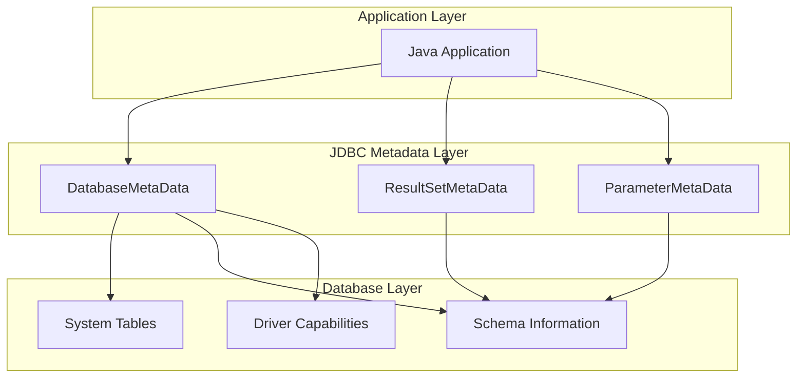
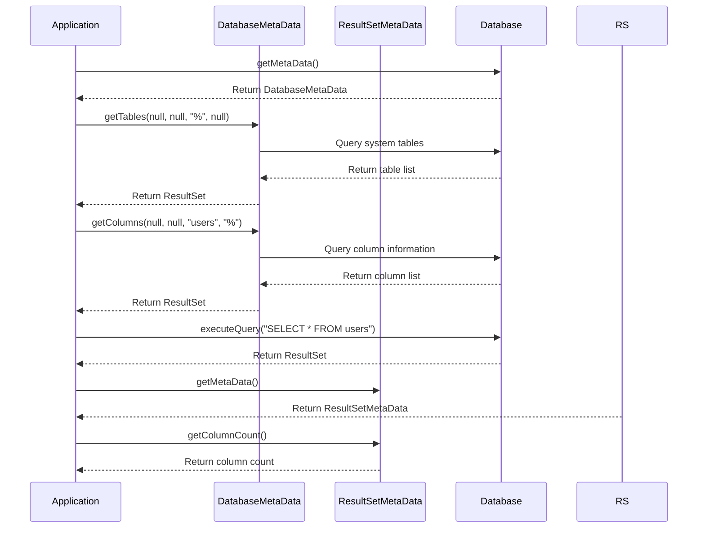

# 05: JDBC Metadata

## 1. Introduction

JDBC Metadata provides information about the database, its structure, and query results. Through DatabaseMetaData and ResultSetMetaData interfaces, Java applications can discover database schema, table structures, column details, and driver capabilities.

Metadata is crucial for building database-agnostic applications, creating dynamic queries, and generating documentation from existing databases.

## 2. Learning Objectives

By the end of this lesson, you will be able to:

- Access database metadata using DatabaseMetaData
- Retrieve ResultSet column information with ResultSetMetaData
- Discover database schema and structure
- Build database-agnostic applications
- Generate documentation from metadata
- Handle database-specific differences

## 3. Prerequisites

- JDBC Fundamentals (Module 01)
- PreparedStatement usage (Module 02)
- Basic SQL knowledge

## 4. Why This Concept Exists

Without metadata, developers must:

1. **Hardcode database details**: Table names, column types
2. **Handle database differences manually**: Different SQL syntax
3. **Write database-specific code**: Cannot switch databases easily
4. **Manually document schema**: Time-consuming and error-prone

Metadata solves these problems by providing:
- **Discovery**: Automatic schema detection
- **Portability**: Write database-agnostic code
- **Documentation**: Auto-generate schema documentation
- **Validation**: Verify database compatibility

## 5. Problem Statement

Consider an application that needs to work with multiple databases:

```java
// Database-specific code - not portable
if (isMySQL) {
    stmt.executeQuery("SHOW TABLES");
} else if (isPostgreSQL) {
    stmt.executeQuery("SELECT table_name FROM information_schema.tables");
} else if (isOracle) {
    stmt.executeQuery("SELECT table_name FROM user_tables");
}
```

With metadata:
```java
// Database-agnostic code
DatabaseMetaData dbmd = conn.getMetaData();
ResultSet rs = dbmd.getTables(null, null, "%", new String[]{"TABLE"});
while (rs.next()) {
    String tableName = rs.getString("TABLE_NAME");
}
```

## 6. Theory

### Metadata Types

1. **DatabaseMetaData**: Database structure, capabilities, properties
2. **ResultSetMetaData**: Information about ResultSet columns
3. **ParameterMetaData**: Information about PreparedStatement parameters

### DatabaseMetaData Capabilities

- Database product name and version
- Driver name and version
- Supported SQL keywords
- Table list with types
- Column details for each table
- Primary and foreign keys
- Index information
- Stored procedures
- Transaction isolation levels

### ResultSetMetaData Information

- Column count
- Column name and label
- Column type and type name
- Column size and precision
- Column nullable status
- Table name owning the column

## 7. Internal Working

### Metadata Retrieval

1. **DatabaseMetaData**: `connection.getMetaData()`
2. **ResultSetMetaData**: `resultSet.getMetaData()`
3. **ParameterMetaData**: `preparedStatement.getParameterMetaData()`

### Schema Discovery Process

1. Get DatabaseMetaData from connection
2. Query for tables using getTables()
3. For each table, query columns using getColumns()
4. Query primary keys using getPrimaryKeys()
5. Query foreign keys using getForeignKeys()
6. Query indexes using getIndexInfo()

### Database-Specific Handling

- Different databases have different metadata schemas
- JDBC provides standard methods where possible
- Use escape syntax for database-specific features
- Check driver capabilities before using features

## 8. JVM Perspective

### Metadata Objects

- **DatabaseMetaData**: Created by driver, cached in connection
- **ResultSetMetaData**: Created per ResultSet
- **ParameterMetaData**: Created per PreparedStatement

### Memory Usage

- Metadata objects are lightweight
- Results may be cached for performance
- Large schemas may require significant memory
- Lazy loading for complex metadata

### Thread Safety

- DatabaseMetaData: Thread-safe (read-only)
- ResultSetMetaData: Thread-safe (read-only)
- ParameterMetaData: Thread-safe (read-only)

## 9. Memory Representation

```
Stack Memory:
┌─────────────────────────────────────┐
│ dbmd (reference) ─────────────────┐│
│ rsmd (reference) ──────────────┐  ││
└────────────────────────────────┼──┘│
                                 │   │
Heap Memory:                     │   │
┌────────────────────────────────┼───┘
│ DatabaseMetaData Implementation  │
│ ├── connection: Connection       │
│ ├── databaseProduct: "MySQL"     │
│ ├── driverName: "MySQL Connector"│
│ └── tables: LazyResultSet       │
├─────────────────────────────────────┤
│ ResultSetMetaData Implementation │
│ ├── columnCount: 5              │
│ ├── columns: ColumnInfo[]       │
│ │   ├── [0]: {name: "id",      │
│ │   │         type: "INT"}     │
│ │   ├── [1]: {name: "name",    │
│ │   │         type: "VARCHAR"} │
│ │   └── ...                     │
│ └── resultSet: ResultSet        │
└─────────────────────────────────────┘
```

## 10. Architecture Diagram (Mermaid)



## 11. Flow Diagram (Mermaid)



## 12. Syntax

### DatabaseMetaData

```java
DatabaseMetaData dbmd = conn.getMetaData();

// Database info
String dbName = dbmd.getDatabaseProductName();
String dbVersion = dbmd.getDatabaseProductVersion();
String driverName = dbmd.getDriverName();

// Tables
ResultSet tables = dbmd.getTables(null, null, "%", new String[]{"TABLE"});

// Columns
ResultSet columns = dbmd.getColumns(null, null, "users", "%");

// Primary keys
ResultSet pks = dbmd.getPrimaryKeys(null, null, "users");

// Foreign keys
ResultSet fks = dbmd.getImportedKeys(null, null, "users");

// Indexes
ResultSet indexes = dbmd.getIndexInfo(null, null, "users", false, true);
```

### ResultSetMetaData

```java
ResultSet rs = stmt.executeQuery("SELECT * FROM users");
ResultSetMetaData rsmd = rs.getMetaData();

int columnCount = rsmd.getColumnCount();
String columnName = rsmd.getColumnName(1);
String columnType = rsmd.getColumnTypeName(1);
int columnSize = rsmd.getColumnDisplaySize(1);
boolean nullable = rsmd.isNullable(1) != ResultSetMetaData.columnNoNulls;
```

### ParameterMetaData

```java
PreparedStatement pstmt = conn.prepareStatement("SELECT * FROM users WHERE id = ?");
ParameterMetaData pmd = pstmt.getParameterMetaData();

int paramCount = pmd.getParameterCount();
int paramType = pmd.getParameterType(1);
String paramTypeName = pmd.getParameterTypeName(1);
```

## 13. Easy Example

```java
import java.sql.*;

public class MetadataBasic {
    public static void main(String[] args) throws SQLException {
        String url = "jdbc:h2:mem:testdb";
        
        try (Connection conn = DriverManager.getConnection(url, "sa", "")) {
            // Create sample table
            conn.createStatement().execute("""
                CREATE TABLE users (
                    id INT PRIMARY KEY,
                    name VARCHAR(100) NOT NULL,
                    email VARCHAR(100),
                    created_at TIMESTAMP DEFAULT CURRENT_TIMESTAMP
                )
                """);
            
            // Get database metadata
            DatabaseMetaData dbmd = conn.getMetaData();
            
            System.out.println("Database: " + dbmd.getDatabaseProductName());
            System.out.println("Version: " + dbmd.getDatabaseProductVersion());
            System.out.println("Driver: " + dbmd.getDriverName());
            
            // List tables
            System.out.println("\nTables:");
            try (ResultSet tables = dbmd.getTables(null, null, "%", new String[]{"TABLE"})) {
                while (tables.next()) {
                    System.out.println("- " + tables.getString("TABLE_NAME"));
                }
            }
            
            // Get column details
            System.out.println("\nColumns in users table:");
            try (ResultSet columns = dbmd.getColumns(null, null, "users", "%")) {
                while (columns.next()) {
                    System.out.printf("- %s (%s)%n", 
                        columns.getString("COLUMN_NAME"),
                        columns.getString("TYPE_NAME"));
                }
            }
        }
    }
}
```

## 14. Medium Example

```java
import java.sql.*;
import java.util.ArrayList;
import java.util.List;

public class MetadataSchema {
    public static void main(String[] args) throws SQLException {
        String url = "jdbc:h2:mem:testdb";
        
        try (Connection conn = DriverManager.getConnection(url, "sa", "")) {
            conn.createStatement().execute("""
                CREATE TABLE customers (
                    id INT PRIMARY KEY,
                    name VARCHAR(100),
                    email VARCHAR(100)
                )
                """);
            
            conn.createStatement().execute("""
                CREATE TABLE orders (
                    id INT PRIMARY KEY,
                    customer_id INT,
                    amount DECIMAL(10,2),
                    FOREIGN KEY (customer_id) REFERENCES customers(id)
                )
                """);
            
            SchemaInfo schema = discoverSchema(conn);
            printSchema(schema);
        }
    }
    
    private static SchemaInfo discoverSchema(Connection conn) throws SQLException {
        DatabaseMetaData dbmd = conn.getMetaData();
        List<TableInfo> tables = new ArrayList<>();
        
        try (ResultSet tableRs = dbmd.getTables(null, null, "%", new String[]{"TABLE"})) {
            while (tableRs.next()) {
                String tableName = tableRs.getString("TABLE_NAME");
                List<ColumnInfo> columns = getColumns(dbmd, tableName);
                List<String> primaryKeys = getPrimaryKeys(dbmd, tableName);
                List<ForeignKeyInfo> foreignKeys = getForeignKeys(dbmd, tableName);
                
                tables.add(new TableInfo(tableName, columns, primaryKeys, foreignKeys));
            }
        }
        
        return new SchemaInfo(tables);
    }
    
    private static List<ColumnInfo> getColumns(DatabaseMetaData dbmd, String tableName) 
            throws SQLException {
        List<ColumnInfo> columns = new ArrayList<>();
        
        try (ResultSet rs = dbmd.getColumns(null, null, tableName, "%")) {
            while (rs.next()) {
                columns.add(new ColumnInfo(
                    rs.getString("COLUMN_NAME"),
                    rs.getString("TYPE_NAME"),
                    rs.getInt("COLUMN_SIZE"),
                    rs.getInt("NULLABLE") == ResultSetMetaData.columnNoNulls
                ));
            }
        }
        
        return columns;
    }
    
    private static List<String> getPrimaryKeys(DatabaseMetaData dbmd, String tableName) 
            throws SQLException {
        List<String> keys = new ArrayList<>();
        
        try (ResultSet rs = dbmd.getPrimaryKeys(null, null, tableName)) {
            while (rs.next()) {
                keys.add(rs.getString("COLUMN_NAME"));
            }
        }
        
        return keys;
    }
    
    private static List<ForeignKeyInfo> getForeignKeys(DatabaseMetaData dbmd, String tableName) 
            throws SQLException {
        List<ForeignKeyInfo> foreignKeys = new ArrayList<>();
        
        try (ResultSet rs = dbmd.getImportedKeys(null, null, tableName)) {
            while (rs.next()) {
                foreignKeys.add(new ForeignKeyInfo(
                    rs.getString("FKCOLUMN_NAME"),
                    rs.getString("PKTABLE_NAME"),
                    rs.getString("PKCOLUMN_NAME")
                ));
            }
        }
        
        return foreignKeys;
    }
    
    private static void printSchema(SchemaInfo schema) {
        System.out.println("Database Schema:");
        System.out.println("================");
        
        for (TableInfo table : schema.tables()) {
            System.out.printf("%nTable: %s%n", table.name());
            
            System.out.println("  Columns:");
            for (ColumnInfo col : table.columns()) {
                System.out.printf("    - %s: %s (%d)%s%n",
                    col.name(), col.type(), col.size(),
                    col.notNull() ? " NOT NULL" : "");
            }
            
            if (!table.primaryKeys().isEmpty()) {
                System.out.println("  Primary Keys: " + String.join(", ", table.primaryKeys()));
            }
            
            if (!table.foreignKeys().isEmpty()) {
                System.out.println("  Foreign Keys:");
                for (ForeignKeyInfo fk : table.foreignKeys()) {
                    System.out.printf("    - %s -> %s.%s%n",
                        fk.column(), fk.referencedTable(), fk.referencedColumn());
                }
            }
        }
    }
    
    record SchemaInfo(List<TableInfo> tables) {}
    record TableInfo(String name, List<ColumnInfo> columns, List<String> primaryKeys, 
                     List<ForeignKeyInfo> foreignKeys) {}
    record ColumnInfo(String name, String type, int size, boolean notNull) {}
    record ForeignKeyInfo(String column, String referencedTable, String referencedColumn) {}
}
```

## 15. Hard Example

```java
import java.sql.*;
import java.util.*;

public class MetadataSqlGenerator {
    public static void main(String[] args) throws SQLException {
        String url = "jdbc:h2:mem:testdb";
        
        try (Connection conn = DriverManager.getConnection(url, "sa", "")) {
            conn.createStatement().execute("""
                CREATE TABLE products (
                    id INT PRIMARY KEY AUTO_INCREMENT,
                    name VARCHAR(100) NOT NULL,
                    price DECIMAL(10,2),
                    category_id INT,
                    FOREIGN KEY (category_id) REFERENCES categories(id)
                )
                """);
            
            conn.createStatement().execute("""
                CREATE TABLE categories (
                    id INT PRIMARY KEY AUTO_INCREMENT,
                    name VARCHAR(50) NOT NULL
                )
                """);
            
            String ddl = generateDDL(conn, "products");
            System.out.println("Generated DDL:");
            System.out.println(ddl);
            
            String insertSql = generateInsertSQL(conn, "products");
            System.out.println("\nGenerated INSERT:");
            System.out.println(insertSql);
            
            String selectSql = generateSelectSQL(conn, "products");
            System.out.println("\nGenerated SELECT:");
            System.out.println(selectSql);
        }
    }
    
    private static String generateDDL(Connection conn, String tableName) throws SQLException {
        DatabaseMetaData dbmd = conn.getMetaData();
        StringBuilder ddl = new StringBuilder();
        
        ddl.append("CREATE TABLE ").append(tableName).append(" (\n");
        
        List<String> columnDefs = new ArrayList<>();
        List<String> primaryKeys = new ArrayList<>();
        
        try (ResultSet columns = dbmd.getColumns(null, null, tableName, "%")) {
            while (columns.next()) {
                String colName = columns.getString("COLUMN_NAME");
                String typeName = columns.getString("TYPE_NAME");
                int size = columns.getString("TYPE_NAME").contains("CHAR") ? 
                    columns.getInt("COLUMN_SIZE") : 0;
                boolean nullable = columns.getInt("NULLABLE") != DatabaseMetaData.columnNoNulls;
                boolean autoIncrement = "YES".equals(columns.getString("IS_AUTOINCREMENT"));
                
                StringBuilder colDef = new StringBuilder();
                colDef.append("  ").append(colName).append(" ");
                
                // Map SQL types to DDL types
                colDef.append(mapSqlType(typeName, size));
                
                if (autoIncrement) {
                    colDef.append(" AUTO_INCREMENT");
                }
                
                if (!nullable) {
                    colDef.append(" NOT NULL");
                }
                
                columnDefs.add(colDef.toString());
            }
        }
        
        try (ResultSet pks = dbmd.getPrimaryKeys(null, null, tableName)) {
            while (pks.next()) {
                primaryKeys.add(pks.getString("COLUMN_NAME"));
            }
        }
        
        for (String col : columnDefs) {
            ddl.append(col).append(",\n");
        }
        
        if (!primaryKeys.isEmpty()) {
            ddl.append("  PRIMARY KEY (").append(String.join(", ", primaryKeys)).append(")\n");
        } else {
            ddl.delete(ddl.length() - 2, ddl.length()); // Remove last comma
            ddl.append("\n");
        }
        
        ddl.append(")");
        return ddl.toString();
    }
    
    private static String mapSqlType(String typeName, int size) {
        return switch (typeName.toUpperCase()) {
            case "INTEGER", "INT" -> "INT";
            case "VARCHAR" -> "VARCHAR(" + size + ")";
            case "DECIMAL", "NUMERIC" -> "DECIMAL(10,2)";
            case "TIMESTAMP" -> "TIMESTAMP";
            case "DATE" -> "DATE";
            case "BOOLEAN", "BIT" -> "BOOLEAN";
            default -> typeName;
        };
    }
    
    private static String generateInsertSQL(Connection conn, String tableName) throws SQLException {
        DatabaseMetaData dbmd = conn.getMetaData();
        List<String> columns = new ArrayList<>();
        
        try (ResultSet rs = dbmd.getColumns(null, null, tableName, "%")) {
            while (rs.next()) {
                columns.add(rs.getString("COLUMN_NAME"));
            }
        }
        
        String placeholders = columns.stream()
            .map(c -> "?")
            .reduce((a, b) -> a + ", " + b)
            .orElse("");
        
        return String.format("INSERT INTO %s (%s) VALUES (%s)",
            tableName,
            String.join(", ", columns),
            placeholders);
    }
    
    private static String generateSelectSQL(Connection conn, String tableName) throws SQLException {
        DatabaseMetaData dbmd = conn.getMetaData();
        List<String> columns = new ArrayList<>();
        
        try (ResultSet rs = dbmd.getColumns(null, null, tableName, "%")) {
            while (rs.next()) {
                columns.add(rs.getString("COLUMN_NAME"));
            }
        }
        
        return String.format("SELECT %s FROM %s",
            String.join(", ", columns),
            tableName);
    }
}
```

## 16. Enterprise Example

```java
import java.sql.*;
import java.util.*;
import java.util.stream.Collectors;

public class MetadataDocumentation {
    public static void main(String[] args) throws SQLException {
        String url = "jdbc:h2:mem:testdb";
        
        try (Connection conn = DriverManager.getConnection(url, "sa", "")) {
            conn.createStatement().execute("""
                CREATE TABLE employees (
                    id INT PRIMARY KEY,
                    name VARCHAR(100) NOT NULL,
                    department_id INT,
                    salary DECIMAL(10,2),
                    hire_date DATE,
                    FOREIGN KEY (department_id) REFERENCES departments(id)
                )
                """);
            
            conn.createStatement().execute("""
                CREATE TABLE departments (
                    id INT PRIMARY KEY,
                    name VARCHAR(50) NOT NULL,
                    manager_id INT
                )
                """);
            
            String documentation = generateDocumentation(conn);
            System.out.println(documentation);
        }
    }
    
    private static String generateDocumentation(Connection conn) throws SQLException {
        DatabaseMetaData dbmd = conn.getMetaData();
        StringBuilder doc = new StringBuilder();
        
        doc.append("# Database Documentation\n\n");
        doc.append("## Database Information\n\n");
        doc.append("- Product: ").append(dbmd.getDatabaseProductName()).append("\n");
        doc.append("- Version: ").append(dbmd.getDatabaseProductVersion()).append("\n");
        doc.append("- Driver: ").append(dbmd.getDriverName()).append("\n\n");
        
        doc.append("## Tables\n\n");
        
        try (ResultSet tables = dbmd.getTables(null, null, "%", new String[]{"TABLE"})) {
            while (tables.next()) {
                String tableName = tables.getString("TABLE_NAME");
                doc.append("### ").append(tableName).append("\n\n");
                
                // Columns
                doc.append("**Columns:**\n\n");
                doc.append("| Name | Type | Size | Nullable | Description |\n");
                doc.append("|------|------|------|----------|-------------|\n");
                
                try (ResultSet columns = dbmd.getColumns(null, null, tableName, "%")) {
                    while (columns.next()) {
                        doc.append(String.format("| %s | %s | %d | %s | |\n",
                            columns.getString("COLUMN_NAME"),
                            columns.getString("TYPE_NAME"),
                            columns.getInt("COLUMN_SIZE"),
                            columns.getInt("NULLABLE") == DatabaseMetaData.columnNoNulls ? 
                                "No" : "Yes"));
                    }
                }
                
                // Primary Keys
                List<String> pks = new ArrayList<>();
                try (ResultSet rs = dbmd.getPrimaryKeys(null, null, tableName)) {
                    while (rs.next()) {
                        pks.add(rs.getString("COLUMN_NAME"));
                    }
                }
                
                if (!pks.isEmpty()) {
                    doc.append("\n**Primary Keys:** ").append(String.join(", ", pks)).append("\n");
                }
                
                // Foreign Keys
                List<String> fks = new ArrayList<>();
                try (ResultSet rs = dbmd.getImportedKeys(null, null, tableName)) {
                    while (rs.next()) {
                        fks.add(String.format("%s → %s.%s",
                            rs.getString("FKCOLUMN_NAME"),
                            rs.getString("PKTABLE_NAME"),
                            rs.getString("PKCOLUMN_NAME")));
                    }
                }
                
                if (!fks.isEmpty()) {
                    doc.append("\n**Foreign Keys:**\n");
                    fks.forEach(fk -> doc.append("- ").append(fk).append("\n"));
                }
                
                doc.append("\n");
            }
        }
        
        return doc.toString();
    }
}
```

## 17. Performance

### Metadata Performance Considerations

| Operation | Time Complexity | Notes |
|-----------|-----------------|-------|
| getMetaData() | O(1) | Cached in connection |
| getTables() | O(n) | Queries system tables |
| getColumns() | O(n) | Queries system tables |
| getPrimaryKeys() | O(n) | Queries system tables |
| getImportedKeys() | O(n) | Queries system tables |

### Performance Tips

1. **Cache metadata**: DatabaseMetaData is cached
2. **Use specific queries**: Don't fetch all metadata if not needed
3. **Filter results**: Use catalog/schema parameters
4. **Lazy loading**: ResultSet metadata loaded on demand
5. **Batch metadata queries**: Combine multiple requests

## 18. Time & Space Complexity

| Operation | Time Complexity | Space Complexity |
|-----------|-----------------|------------------|
| DatabaseMetaData creation | O(1) | O(1) |
| getTables() | O(tables) | O(tables) |
| getColumns() | O(columns) | O(columns) |
| getPrimaryKeys() | O(keys) | O(keys) |
| getImportedKeys() | O(foreign keys) | O(foreign keys) |
| ResultSetMetaData creation | O(1) | O(1) |
| getColumnCount() | O(1) | O(1) |

## 19. Thread Safety

### Thread Safety Analysis

- **DatabaseMetaData**: Thread-safe (read-only, immutable)
- **ResultSetMetaData**: Thread-safe (read-only, immutable)
- **ParameterMetaData**: Thread-safe (read-only, immutable)
- **ResultSet**: Not thread-safe (mutable cursor position)

### Best Practices

- Share DatabaseMetaData between threads
- Create ResultSetMetaData per ResultSet
- Don't share ResultSet between threads
- Use synchronization for ResultSet traversal

## 20. Best Practices

1. **Cache metadata**: Don't query repeatedly
2. **Use specific filters**: Don't fetch all tables/columns
3. **Handle nulls**: Check for null metadata values
4. **Database-agnostic code**: Use metadata instead of hardcoding
5. **Document schema**: Auto-generate documentation
6. **Validate compatibility**: Check database features before use
7. **Handle errors**: Metadata queries may fail
8. **Use proper types**: Map metadata types correctly

## 21. Common Mistakes

1. **Not caching metadata**: Repeated queries waste resources
2. **Ignoring database differences**: Not all databases support same features
3. **Hardcoding table names**: Use metadata for discovery
4. **Not handling nulls**: Metadata values can be null
5. **Over-fetching**: Getting all metadata when only some is needed
6. **Ignoring case sensitivity**: Table/column names may be case-sensitive

## 22. Pitfalls

1. **Database-specific metadata**: Different databases have different schemas
2. **Performance impact**: Metadata queries can be slow
3. **Memory usage**: Large schemas consume memory
4. **Thread safety**: ResultSet is not thread-safe
5. **Caching issues**: Metadata may become stale
6. **Security**: Metadata may reveal sensitive information

## 23. Debugging Tips

1. **Log metadata queries**: Enable JDBC logging
2. **Check database compatibility**: Verify supported features
3. **Use explain plans**: Analyze metadata query performance
4. **Monitor memory**: Track metadata object usage
5. **Test with multiple databases**: Ensure portability
6. **Validate assumptions**: Check metadata values

## 24. Comparison Table

| Feature | DatabaseMetaData | ResultSetMetaData | ParameterMetaData |
|---------|------------------|-------------------|-------------------|
| Purpose | Database structure | Query results | Query parameters |
| Source | Connection | ResultSet | PreparedStatement |
| Thread Safety | Yes | Yes | Yes |
| Caching | Yes | No | No |
| Use Case | Schema discovery | Dynamic processing | Parameter info |

## 25. Decision Tree

```
Need database structure information?
├── Yes
│   ├── Tables and columns?
│   │   └── Yes → DatabaseMetaData
│   ├── Query result structure?
│   │   └── Yes → ResultSetMetaData
│   └── PreparedStatement parameters?
│       └── Yes → ParameterMetaData
└── No
    └── Static queries only? → Hardcode (not recommended)
```

## 26. Interview Questions

1. What is DatabaseMetaData and when would you use it?
2. Explain the difference between DatabaseMetaData and ResultSetMetaData.
3. How do you discover database schema using metadata?
4. How do you make database-agnostic applications?
5. What information can you get from ResultSetMetaData?
6. How do you handle database-specific differences?
7. What are the performance considerations for metadata?
8. How do you cache metadata effectively?
9. Explain the metadata discovery process.
10. How do you generate documentation from metadata?
11. What are the thread safety considerations for metadata?
12. How do you validate database compatibility?
13. What are the common metadata operations?
14. How do you handle null metadata values?
15. What are the best practices for metadata usage?

## 27. Exercises

### Level 1 (Easy)

1. **Basic Metadata**: Write a program to display database information.
2. **Table List**: List all tables in the database.
3. **Column Details**: Display column information for a specific table.

### Level 2 (Medium)

1. **Schema Discovery**: Implement a complete schema discovery tool.
2. **SQL Generator**: Generate INSERT/UPDATE/DELETE statements from metadata.
3. **Documentation Generator**: Create HTML documentation from metadata.

### Level 3 (Hard)

1. **Database Comparison**: Compare schemas between two databases.
2. **Migration Tool**: Generate migration scripts from schema changes.
3. **ORM Generator**: Generate entity classes from database schema.

## 28. Summary

JDBC Metadata provides powerful tools for database discovery:

- DatabaseMetaData for database structure and capabilities
- ResultSetMetaData for query result information
- ParameterMetaData for query parameter details
- Essential for building database-agnostic applications
- Enables automatic documentation generation
- Should be cached for performance

## 29. References

- [JDBC Metadata Tutorial](https://docs.oracle.com/javase/tutorial/jdbc/basics/retrieving.html)
- [DatabaseMetaData Interface](https://docs.oracle.com/en/java/javase/21/docs/api/java.sql/java/sql/DatabaseMetaData.html)
- [ResultSetMetaData Interface](https://docs.oracle.com/en/java/javase/21/docs/api/java.sql/java/sql/ResultSetMetaData.html)
- [Schema Discovery](https://www.baeldung.com/jdbc-database-metadata)
- [Database Documentation](https://www.baeldung.com/java-generate-database-documentation)
