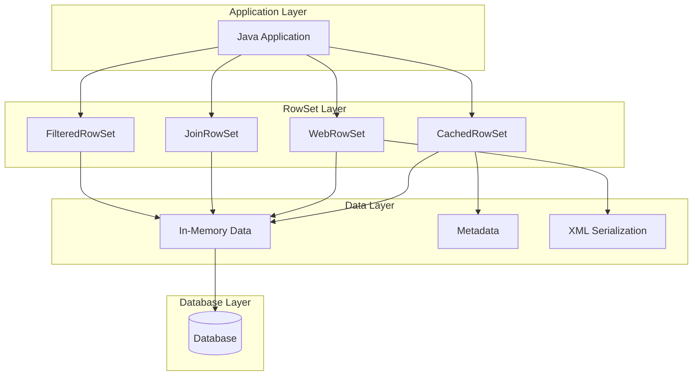
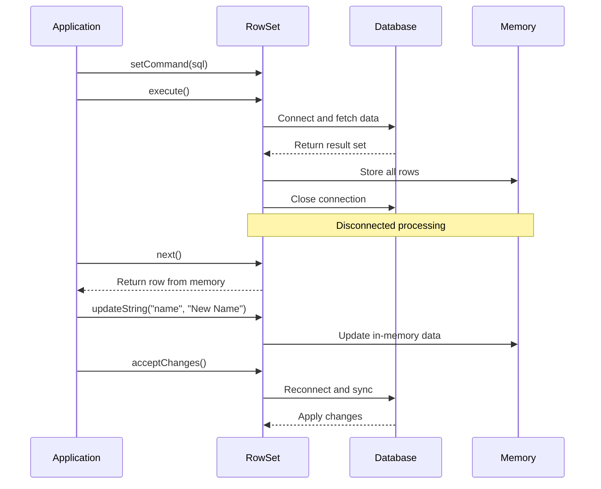

# 06: JDBC RowSet

## 1. Introduction

RowSet is an enhanced version of ResultSet that provides a disconnected, scrollable, and updatable view of data. Unlike ResultSet which requires an active database connection, RowSet can operate in a disconnected mode, making it ideal for thin-client applications and data transfer between tiers.

RowSet implementations include CachedRowSet, WebRowSet, JoinRowSet, and FilteredRowSet, each designed for specific use cases.

## 2. Learning Objectives

By the end of this lesson, you will be able to

- Understand RowSet architecture and benefits
- Use CachedRowSet for disconnected data access
- Implement WebRowSet for XML serialization
- Create JoinRowSet for combining multiple RowSets
- Apply FilteredRowSet for data filtering
- Handle RowSet events and listeners
- Compare RowSet with traditional ResultSet

## 3. Prerequisites

- JDBC Fundamentals (Module 01)
- Understanding of ResultSet
- Basic XML knowledge (for WebRowSet)

## 4. Why This Concept Exists

ResultSet has limitations:

1. **Connection dependency**: Requires active database connection
2. **Forward-only**: Limited navigation capabilities
3. **Read-only**: Cannot update data easily
4. **Resource intensive**: Holds database resources

RowSet solves these problems by:
- Operating in disconnected mode
- Supporting scrollable cursors
- Providing updatable data views
- Enabling XML serialization
- Reducing database resource usage

## 5. Problem Statement

Consider a web application that needs to display user data:

```java
// With ResultSet - connection held open
ResultSet rs = stmt.executeQuery("SELECT * FROM users");
while (rs.next()) {
    // Display user - connection still open!
}
rs.close();
conn.close(); // Connection held during entire processing
```

```java
// With RowSet - disconnected
RowSet rowSet = executeQuery("SELECT * FROM users");
rowSet.close(); // Connection closed immediately
// Process data offline
while (rowSet.next()) {
    // Display user - no connection needed
}
```

## 6. Theory

### RowSet Types

1. **CachedRowSet**: Disconnected, scrollable, updatable
2. **WebRowSet**: CachedRowSet + XML serialization
3. **JoinRowSet**: Combine multiple RowSets
4. **FilteredRowSet**: Filter data without database
5. **JoinRowSet**: Join data from multiple sources

### Disconnected Architecture

```
Database → RowSet (fetch data) → Disconnect → Process offline → Reconnect (sync)
```

### RowSet Components

1. **Command**: SQL query to execute
2. **Parameters**: Query parameter values
3. **Properties**: Connection properties
4. **MetaData**: Column information
5. **Data**: In-memory row data
6. **Listeners**: Event handlers

## 7. Internal Working

### Data Fetching

1. Create RowSet implementation
2. Set connection properties and command
3. Execute query (establishes connection)
4. Fetch all data into memory
5. Close connection immediately

### Disconnected Processing

1. Process data offline (no connection)
2. Navigate using scrollable cursors
3. Modify data in memory
4. Apply filters and joins

### Data Synchronization

1. Reconnect to database
2. Generate appropriate SQL (INSERT/UPDATE/DELETE)
3. Apply changes to database
4. Handle conflicts and concurrency

## 8. JVM Perspective

### Memory Management

- **RowSet object**: Heap allocated
- **Row data**: Stored in memory (ArrayList)
- **Metadata**: Cached for offline use
- **Connection**: Temporary, closed after fetch

### Thread Safety

- **RowSet**: Not thread-safe
- **Disconnected mode**: Safe for single-threaded use
- **Modification**: Requires synchronization

### Resource Usage

- **Memory**: Proportional to row count
- **Connection**: Only during fetch/sync
- **CPU**: Minimal when disconnected

## 9. Memory Representation

```
Stack Memory:
┌─────────────────────────────────────┐
│ rowSet (reference) ────────────────┐│
└──────────────────────────────────────┘
                                      │
Heap Memory:                          │
┌──────────────────────────────────────┘
│ CachedRowSet Implementation
│ ├── command: "SELECT * FROM users"
│ ├── properties: {url, user, pass}
│ ├── metadata: ColumnInfo[]
│ ├── data: ArrayList<Row>
│ │   ├── Row@1: {1, "Alice", "alice@ex.com"}
│ │   ├── Row@2: {2, "Bob", "bob@ex.com"}
│ │   └── Row@3: {3, "Charlie", "charlie@ex.com"}
│ ├── cursor: 0 (current position)
│ └── connection: null (disconnected)
└─────────────────────────────────────┘
```

## 10. Architecture Diagram (Mermaid)



## 11. Flow Diagram (Mermaid)



## 12. Syntax

### CachedRowSet Basic

```java
RowSetFactory factory = RowSetProvider.newFactory();
CachedRowSet rowSet = factory.createCachedRowSet();

rowSet.setUrl("jdbc:mysql://localhost:3306/mydb");
rowSet.setUsername("user");
rowSet.setPassword("password");
rowSet.setCommand("SELECT * FROM users");
rowSet.execute();

// Process disconnected
while (rowSet.next()) {
    String name = rowSet.getString("name");
}

// Sync changes
rowSet.acceptChanges();
```

### WebRowSet XML

```java
RowSetFactory factory = RowSetProvider.newFactory();
WebRowSet webRowSet = factory.createWebRowSet();

webRowSet.setUrl("jdbc:mysql://localhost:3306/mydb");
webRowSet.setUsername("user");
webRowSet.setPassword("password");
webRowSet.setCommand("SELECT * FROM users");
webRowSet.execute();

// Write to XML
webRowSet.writeXml("users.xml");

// Read from XML
WebRowSet newWebRowSet = factory.createWebRowSet();
newWebRowSet.readXml("users.xml");
```

### JoinRowSet

```java
RowSetFactory factory = RowSetProvider.newFactory();

CachedRowSet users = factory.createCachedRowSet();
users.setUrl(url);
users.setCommand("SELECT * FROM users");
users.execute();

CachedRowSet orders = factory.createCachedRowSet();
orders.setUrl(url);
orders.setCommand("SELECT * FROM orders");
orders.execute();

JoinRowSet joinRs = factory.createJoinRowSet();
joinRs.addRowSet(users, "id");
joinRs.addRowSet(orders, "user_id");

while (joinRs.next()) {
    // Combined data
}
```

## 13. Easy Example

```java
import javax.sql.rowset.*;
import java.sql.*;

public class RowSetBasic {
    public static void main(String[] args) throws Exception {
        String url = "jdbc:h2:mem:testdb";
        
        // Setup database
        try (Connection conn = DriverManager.getConnection(url, "sa", "")) {
            conn.createStatement().execute("""
                CREATE TABLE users (
                    id INT PRIMARY KEY,
                    name VARCHAR(100),
                    email VARCHAR(100)
                )
                """);
            
            conn.createStatement().executeUpdate(
                "INSERT INTO users VALUES (1, 'Alice', 'alice@example.com')"
            );
            conn.createStatement().executeUpdate(
                "INSERT INTO users VALUES (2, 'Bob', 'bob@example.com')"
            );
        }
        
        // Use CachedRowSet
        RowSetFactory factory = RowSetProvider.newFactory();
        CachedRowSet rowSet = factory.createCachedRowSet();
        
        rowSet.setUrl(url);
        rowSet.setUsername("sa");
        rowSet.setPassword("");
        rowSet.setCommand("SELECT * FROM users");
        rowSet.execute();
        
        // Process disconnected
        System.out.println("Users:");
        while (rowSet.next()) {
            System.out.printf("ID: %d, Name: %s, Email: %s%n",
                rowSet.getInt("id"),
                rowSet.getString("name"),
                rowSet.getString("email"));
        }
        
        // Update data
        rowSet.first();
        rowSet.updateString("name", "Alice Smith");
        rowSet.updateRow();
        
        // Navigate
        rowSet.last();
        System.out.printf("Last user: %s%n", rowSet.getString("name"));
    }
}
```

## 14. Medium Example

```java
import javax.sql.rowset.*;
import java.sql.*;
import java.io.*;

public class RowSetXml {
    public static void main(String[] args) throws Exception {
        String url = "jdbc:h2:mem:testdb";
        
        // Setup
        try (Connection conn = DriverManager.getConnection(url, "sa", "")) {
            conn.createStatement().execute("""
                CREATE TABLE products (
                    id INT PRIMARY KEY,
                    name VARCHAR(100),
                    price DECIMAL(10,2)
                )
                """);
            
            for (int i = 1; i <= 5; i++) {
                conn.createStatement().executeUpdate(
                    String.format("INSERT INTO products VALUES (%d, 'Product %d', %.2f)", 
                        i, i, i * 10.99)
                );
            }
        }
        
        // Fetch and serialize to XML
        RowSetFactory factory = RowSetProvider.newFactory();
        WebRowSet webRowSet = factory.createWebRowSet();
        
        webRowSet.setUrl(url);
        webRowSet.setUsername("sa");
        webRowSet.setPassword("");
        webRowSet.setCommand("SELECT * FROM products WHERE price > 20");
        webRowSet.execute();
        
        // Write to XML file
        try (FileWriter writer = new FileWriter("products.xml")) {
            webRowSet.writeXml(writer);
        }
        
        System.out.println("XML written to products.xml");
        
        // Read from XML
        WebRowSet newWebRowSet = factory.createWebRowSet();
        try (FileReader reader = new FileReader("products.xml")) {
            newWebRowSet.readXml(reader);
        }
        
        System.out.println("\nProducts from XML:");
        while (newWebRowSet.next()) {
            System.out.printf("- %s: $%.2f%n",
                newWebRowSet.getString("name"),
                newWebRowSet.getDouble("price"));
        }
        
        // Cleanup
        new File("products.xml").delete();
    }
}
```

## 15. Hard Example

```java
import javax.sql.rowset.*;
import java.sql.*;

public class RowSetAdvanced {
    public static void main(String[] args) throws Exception {
        String url = "jdbc:h2:mem:testdb";
        
        // Setup
        try (Connection conn = DriverManager.getConnection(url, "sa", "")) {
            conn.createStatement().execute("""
                CREATE TABLE customers (
                    id INT PRIMARY KEY,
                    name VARCHAR(100),
                    city VARCHAR(50)
                )
                """);
            
            conn.createStatement().execute("""
                CREATE TABLE orders (
                    id INT PRIMARY KEY,
                    customer_id INT,
                    amount DECIMAL(10,2)
                )
                """);
            
            conn.createStatement().executeUpdate(
                "INSERT INTO customers VALUES (1, 'Alice', 'New York')"
            );
            conn.createStatement().executeUpdate(
                "INSERT INTO customers VALUES (2, 'Bob', 'Los Angeles')"
            );
            conn.createStatement().executeUpdate(
                "INSERT INTO orders VALUES (1, 1, 100.00)"
            );
            conn.createStatement().executeUpdate(
                "INSERT INTO orders VALUES (2, 1, 200.00)"
            );
        }
        
        // Create JoinRowSet
        RowSetFactory factory = RowSetProvider.newFactory();
        
        CachedRowSet customers = factory.createCachedRowSet();
        customers.setUrl(url);
        customers.setUsername("sa");
        customers.setPassword("");
        customers.setCommand("SELECT * FROM customers");
        customers.execute();
        
        CachedRowSet orders = factory.createCachedRowSet();
        orders.setUrl(url);
        orders.setUsername("sa");
        orders.setPassword("");
        orders.setCommand("SELECT * FROM orders");
        orders.execute();
        
        JoinRowSet joinRs = factory.createJoinRowSet();
        joinRs.addRowSet(customers, "id");
        joinRs.addRowSet(orders, "customer_id");
        
        System.out.println("Joined Data:");
        while (joinRs.next()) {
            System.out.printf("Customer: %s, Order Amount: $%.2f%n",
                joinRs.getString("name"),
                joinRs.getDouble("amount"));
        }
        
        // Use FilteredRowSet
        FilteredRowSet filteredRs = factory.createFilteredRowSet();
        filteredRs.setUrl(url);
        filteredRs.setUsername("sa");
        filteredRs.setPassword("");
        filteredRs.setCommand("SELECT * FROM orders");
        filteredRs.execute();
        
        Predicate filter = new Predicate() {
            @Override
            public boolean evaluate(RowSet rs) {
                try {
                    return rs.getDouble("amount") > 150;
                } catch (SQLException e) {
                    return false;
                }
            }
        };
        
        filteredRs.setFilter(filter);
        
        System.out.println("\nFiltered Orders (amount > 150):");
        while (filteredRs.next()) {
            System.out.printf("Order %d: $%.2f%n",
                filteredRs.getInt("id"),
                filteredRs.getDouble("amount"));
        }
    }
}
```

## 16. Enterprise Example

```java
import javax.sql.rowset.*;
import java.sql.*;
import java.util.ArrayList;
import java.util.List;

public class RowSetDataTransfer {
    private final String dbUrl;
    
    public RowSetDataTransfer(String dbUrl) {
        this.dbUrl = dbUrl;
    }
    
    public List<User> fetchUsers() throws SQLException {
        RowSetFactory factory = RowSetProvider.newFactory();
        CachedRowSet rowSet = factory.createCachedRowSet();
        
        rowSet.setUrl(dbUrl);
        rowSet.setUsername("sa");
        rowSet.setPassword("");
        rowSet.setCommand("SELECT * FROM users WHERE status = ?");
        rowSet.setString(1, "ACTIVE");
        rowSet.execute();
        
        List<User> users = new ArrayList<>();
        while (rowSet.next()) {
            users.add(new User(
                rowSet.getInt("id"),
                rowSet.getString("name"),
                rowSet.getString("email")
            ));
        }
        
        return users;
    }
    
    public void syncUsers(List<User> users) throws SQLException {
        RowSetFactory factory = RowSetProvider.newFactory();
        CachedRowSet rowSet = factory.createCachedRowSet();
        
        rowSet.setUrl(dbUrl);
        rowSet.setUsername("sa");
        rowSet.setPassword("");
        rowSet.setCommand("SELECT * FROM users");
        rowSet.execute();
        
        for (User user : users) {
            rowSet.moveToInsertRow();
            rowSet.updateInt("id", user.id());
            rowSet.updateString("name", user.name());
            rowSet.updateString("email", user.email());
            rowSet.insertRow();
        }
        
        rowSet.acceptChanges();
    }
    
    public byte[] exportToXml() throws Exception {
        RowSetFactory factory = RowSetProvider.newFactory();
        WebRowSet webRowSet = factory.createWebRowSet();
        
        webRowSet.setUrl(dbUrl);
        webRowSet.setUsername("sa");
        webRowSet.setPassword("");
        webRowSet.setCommand("SELECT * FROM users");
        webRowSet.execute();
        
        java.io.ByteArrayOutputStream baos = new java.io.ByteArrayOutputStream();
        webRowSet.writeXml(baos);
        return baos.toByteArray();
    }
    
    public void importFromXml(byte[] xmlData) throws Exception {
        RowSetFactory factory = RowSetProvider.newFactory();
        WebRowSet webRowSet = factory.createWebRowSet();
        
        webRowSet.readXml(new java.io.ByteArrayInputStream(xmlData));
        
        webRowSet.setUrl(dbUrl);
        webRowSet.setUsername("sa");
        webRowSet.setPassword("");
        webRowSet.acceptChanges();
    }
    
    public record User(int id, String name, String email) {}
}
```

## 17. Performance

### RowSet vs ResultSet Performance

| Operation | ResultSet | CachedRowSet | WebRowSet |
|-----------|-----------|--------------|-----------|
| Initial fetch | Fast | Medium | Medium |
| Navigation | Fast | Fast | Fast |
| Memory usage | Low | High | High |
| Connection time | Long | Short | Short |
| Sync overhead | None | Medium | Medium |

### Memory Considerations

- CachedRowSet loads all data into memory
- Large result sets may cause OutOfMemoryError
- Use fetch size limits for large datasets
- Consider pagination for very large results

### Best Practices

1. **Limit result size**: Don't fetch millions of rows
2. **Use appropriate RowSet type**: Choose based on needs
3. **Close resources**: Release memory when done
4. **Batch operations**: Group multiple changes
5. **Handle exceptions**: Proper error handling

## 18. Time & Space Complexity

| Operation | Time Complexity | Space Complexity |
|-----------|-----------------|------------------|
| Execute query | O(n) | O(n) |
| Navigation | O(1) | O(1) |
| Update row | O(1) | O(1) |
| Accept changes | O(n) | O(1) |
| XML export | O(n) | O(n) |
| XML import | O(n) | O(n) |

## 19. Thread Safety

### Thread Safety Issues

- **RowSet**: Not thread-safe
- **Disconnected mode**: Safe for single-threaded use
- **Modification**: Requires synchronization
- **Navigation**: Cursor position is shared state

### Solutions

```java
// Synchronized wrapper
public class ThreadSafeRowSet {
    private final CachedRowSet rowSet;
    private final Object lock = new Object();
    
    public boolean next() throws SQLException {
        synchronized (lock) {
            return rowSet.next();
        }
    }
    
    public String getString(String column) throws SQLException {
        synchronized (lock) {
            return rowSet.getString(column);
        }
    }
}
```

### Best Practices

- Use RowSet in single-threaded context
- Synchronize access for multi-threaded use
- Consider thread-local RowSet instances
- Document thread safety guarantees

## 20. Best Practices

1. **Choose appropriate type**: CachedRowSet for disconnected, WebRowSet for XML
2. **Limit data size**: Don't load too much into memory
3. **Use filters**: Apply predicates for data reduction
4. **Handle concurrency**: Proper synchronization
5. **Close resources**: Release memory promptly
6. **Error handling**: Graceful failure handling
7. **Test thoroughly**: Verify data consistency
8. **Document usage**: Clear API documentation

## 21. Common Mistakes

1. **Loading too much data**: Memory overflow
2. **Not closing RowSet**: Memory leak
3. **Ignoring thread safety**: Concurrency issues
4. **Wrong RowSet type**: Using inappropriate implementation
5. **Not handling exceptions**: Silent failures
6. **Forgetting acceptChanges()**: Data not synced

## 22. Pitfalls

1. **Memory issues**: Large datasets cause problems
2. **Concurrency problems**: Thread safety violations
3. **Data consistency**: Conflicts during sync
4. **Performance overhead**: Extra memory and processing
5. **XML bloat**: Large XML files
6. **Complexity**: More complex than simple ResultSet

## 23. Debugging Tips

1. **Log RowSet operations**: Track execution
2. **Monitor memory usage**: Prevent overflow
3. **Check thread safety**: Verify synchronization
4. **Test data consistency**: Validate sync
5. **Profile performance**: Identify bottlenecks
6. **Use debugging tools**: IDE debuggers

## 24. Comparison Table

| Feature | ResultSet | CachedRowSet | WebRowSet | JoinRowSet |
|---------|-----------|--------------|-----------|------------|
| Connection | Required | Disconnected | Disconnected | Disconnected |
| Scrollable | Limited | Yes | Yes | Yes |
| Updatable | Limited | Yes | Yes | Yes |
| XML Support | No | No | Yes | No |
| Memory Usage | Low | High | High | High |
| Use Case | Simple queries | Disconnected | XML transfer | Data joining |

## 25. Decision Tree

```
Need disconnected data access?
├── Yes
│   ├── Need XML serialization?
│   │   └── Yes → WebRowSet
│   ├── Need to join data?
│   │   └── Yes → JoinRowSet
│   ├── Need to filter data?
│   │   └── Yes → FilteredRowSet
│   └── Basic disconnected?
│       └── Yes → CachedRowSet
└── No
    └── Simple queries? → ResultSet
```

## 26. Interview Questions

1. What is RowSet and how does it differ from ResultSet?
2. Explain CachedRowSet and its use cases.
3. What is WebRowSet and when would you use it?
4. How does RowSet achieve disconnected architecture?
5. Explain JoinRowSet and its benefits.
6. What are the thread safety considerations for RowSet?
7. How do you handle data synchronization with RowSet?
8. What are the performance implications of using RowSet?
9. Explain the RowSet lifecycle.
10. How do you choose the appropriate RowSet type?
11. What are the memory considerations for RowSet?
12. How do you handle exceptions with RowSet?
13. What are the best practices for RowSet usage?
14. Explain FilteredRowSet and its predicate mechanism.
15. How do you serialize RowSet to XML?

## 27. Exercises

### Level 1 (Easy)

1. **Basic CachedRowSet**: Implement a simple disconnected data access.
2. **RowSet Navigation**: Practice different navigation methods.
3. **Data Modification**: Update and insert rows using RowSet.

### Level 2 (Medium)

1. **XML Serialization**: Export and import data using WebRowSet.
2. **Data Joining**: Combine data from multiple tables using JoinRowSet.
3. **Data Filtering**: Implement custom filters with FilteredRowSet.

### Level 3 (Hard)

1. **Data Transfer Object**: Build a complete data transfer layer using RowSet.
2. **Offline Application**: Create an application that works offline and syncs later.
3. **Performance Testing**: Compare RowSet with ResultSet for different scenarios.

## 28. Summary

RowSet provides powerful disconnected data access:

- CachedRowSet for basic disconnected operations
- WebRowSet for XML serialization
- JoinRowSet for combining data sources
- FilteredRowSet for data filtering
- Reduces database resource usage
- Ideal for thin-client applications

## 29. References

- [RowSet Tutorial](https://docs.oracle.com/javase/tutorial/jdbc/basics/rowset.html)
- [CachedRowSet API](https://docs.oracle.com/en/java/javase/21/docs/api/java.sql.rowset/javax/sql/rowset/CachedRowSet.html)
- [WebRowSet Guide](https://www.baeldung.com/jdbc-rowset)
- [RowSet Implementations](https://docs.oracle.com/javanet/1.4/docs/guide/jdbc/spec/rowset.doc.html)
- [Disconnected Data Access](https://www.baeldung.com/jdbc-disconnected-rowset)
