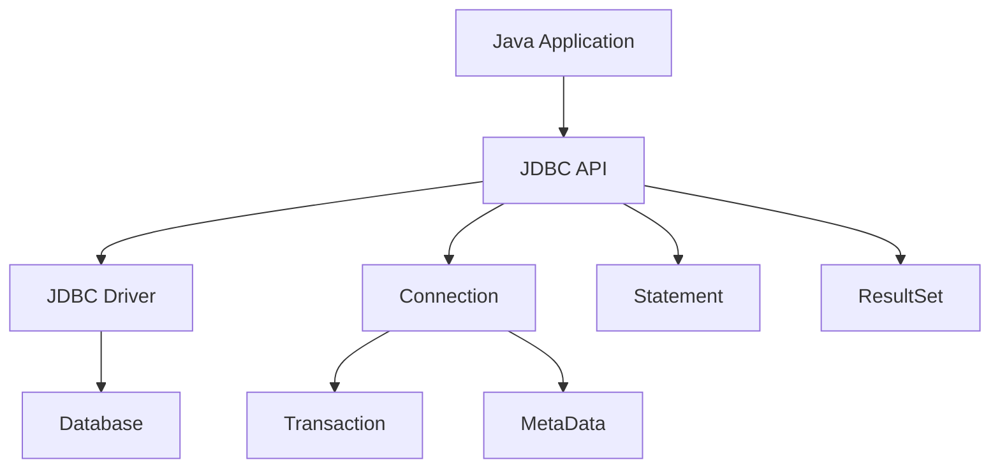

# Module 13: JDBC & Database Access

## Overview
JDBC (Java Database Connectivity) provides a standard API for connecting to relational databases. It enables executing SQL queries, processing results, and managing database transactions.

## Learning Objectives
- Understand JDBC architecture
- Execute SQL statements
- Handle result sets
- Manage transactions
- Apply connection pooling

## Prerequisites
- SQL basics
- Java fundamentals
- Exception handling

## Why This Concept Exists
Applications need data persistence. JDBC provides:
- Database connectivity
- SQL execution
- Transaction management
- Result processing

## Problem Statement
How do you connect Java applications to relational databases?

## Theory

### JDBC Components

| Component | Description |
|-----------|-------------|
| Driver | Database-specific connector |
| Connection | Database session |
| Statement | SQL execution |
| ResultSet | Query results |
| PreparedStatement | Pre-compiled SQL |
| CallableStatement | Stored procedures |

### Connection Properties

| Property | Description |
|----------|-------------|
| URL | Database location |
| Username | Authentication |
| Password | Authentication |
| Driver | JDBC driver class |

## Internal Working

### JDBC Process
1. Load driver
2. Establish connection
3. Create statement
4. Execute query
5. Process results
6. Close resources

### Connection Pooling
```
Application → Pool → Database
           ← Available connections
```

## JVM Perspective

### JDBC Driver Types
1. Type 1: JDBC-ODBC bridge
2. Type 2: Native API
3. Type 3: Network protocol
4. Type 4: Thin driver (pure Java)

### Memory Management
- ResultSet is memory-intensive
- Use fetch size for large results
- Close resources properly
- Use try-with-resources

## Architecture Diagram



## Syntax

### Basic Connection
```java
// Connection
String url = "jdbc:postgresql://localhost:5432/mydb";
Connection conn = DriverManager.getConnection(url, "user", "pass");

// Statement
Statement stmt = conn.createStatement();
ResultSet rs = stmt.executeQuery("SELECT * FROM users");

while (rs.next()) {
    String name = rs.getString("name");
    int age = rs.getInt("age");
    System.out.println(name + ": " + age);
}

// Close
rs.close();
stmt.close();
conn.close();
```

### PreparedStatement
```java
String sql = "SELECT * FROM users WHERE age > ?";
PreparedStatement pstmt = conn.prepareStatement(sql);
pstmt.setInt(1, 18);

ResultSet rs = pstmt.executeQuery();
while (rs.next()) {
    System.out.println(rs.getString("name"));
}
```

### Transaction
```java
try {
    conn.setAutoCommit(false);
    
    // Execute statements
    stmt.executeUpdate("UPDATE accounts SET balance = balance - 100 WHERE id = 1");
    stmt.executeUpdate("UPDATE accounts SET balance = balance + 100 WHERE id = 2");
    
    conn.commit();
} catch (Exception e) {
    conn.rollback();
} finally {
    conn.setAutoCommit(true);
}
```

## Easy Example
```java
import java.sql.*;

public class EasyExample {
    public static void main(String[] args) throws Exception {
        String url = "jdbc:h2:mem:testdb";
        
        try (Connection conn = DriverManager.getConnection(url);
             Statement stmt = conn.createStatement()) {
            
            // Create table
            stmt.executeUpdate("CREATE TABLE users (id INT, name VARCHAR(50))");
            
            // Insert data
            stmt.executeUpdate("INSERT INTO users VALUES (1, 'John')");
            stmt.executeUpdate("INSERT INTO users VALUES (2, 'Jane')");
            
            // Query
            ResultSet rs = stmt.executeQuery("SELECT * FROM users");
            while (rs.next()) {
                System.out.println(rs.getInt("id") + ": " + rs.getString("name"));
            }
        }
    }
}
```

## Medium Example
```java
import java.sql.*;

public class MediumExample {
    // PreparedStatement example
    public static void createUser(Connection conn, String name, int age) 
            throws SQLException {
        String sql = "INSERT INTO users (name, age) VALUES (?, ?)";
        
        try (PreparedStatement pstmt = conn.prepareStatement(sql, 
                Statement.RETURN_GENERATED_KEYS)) {
            pstmt.setString(1, name);
            pstmt.setInt(2, age);
            pstmt.executeUpdate();
            
            try (ResultSet keys = pstmt.getGeneratedKeys()) {
                if (keys.next()) {
                    System.out.println("Created user with ID: " + keys.getInt(1));
                }
            }
        }
    }
    
    // Transaction example
    public static void transfer(Connection conn, int from, int to, double amount) 
            throws SQLException {
        try {
            conn.setAutoCommit(false);
            
            deductBalance(conn, from, amount);
            addBalance(conn, to, amount);
            
            conn.commit();
            System.out.println("Transfer successful");
        } catch (SQLException e) {
            conn.rollback();
            throw e;
        } finally {
            conn.setAutoCommit(true);
        }
    }
}
```

## Hard Example
```java
import java.sql.*;
import javax.sql.DataSource;
import com.zaxxer.hikari.HikariConfig;
import com.zaxxer.hikari.HikariDataSource;

public class HardExample {
    // Connection pooling
    public static DataSource createDataSource() {
        HikariConfig config = new HikariConfig();
        config.setJdbcUrl("jdbc:postgresql://localhost:5432/mydb");
        config.setUsername("user");
        config.setPassword("pass");
        config.setMaximumPoolSize(10);
        config.setMinimumIdle(5);
        
        return new HikariDataSource(config);
    }
    
    // Batch processing
    public static void batchInsert(Connection conn, List<User> users) 
            throws SQLException {
        String sql = "INSERT INTO users (name, email) VALUES (?, ?)";
        
        try (PreparedStatement pstmt = conn.prepareStatement(sql)) {
            conn.setAutoCommit(false);
            
            for (User user : users) {
                pstmt.setString(1, user.getName());
                pstmt.setString(2, user.getEmail());
                pstmt.addBatch();
            }
            
            pstmt.executeBatch();
            conn.commit();
        } finally {
            conn.setAutoCommit(true);
        }
    }
}
```

## Enterprise Example
```java
import java.sql.*;
import javax.sql.DataSource;
import org.springframework.jdbc.core.JdbcTemplate;
import org.springframework.jdbc.core.RowMapper;

public class EnterpriseExample {
    // Spring JdbcTemplate
    @Repository
    public class UserRepository {
        private final JdbcTemplate jdbcTemplate;
        
        public UserRepository(DataSource dataSource) {
            this.jdbcTemplate = new JdbcTemplate(dataSource);
        }
        
        public List<User> findAll() {
            return jdbcTemplate.query(
                "SELECT * FROM users",
                (rs, rowNum) -> new User(rs.getLong("id"), rs.getString("name"))
            );
        }
        
        public User findById(Long id) {
            return jdbcTemplate.queryForObject(
                "SELECT * FROM users WHERE id = ?",
                (rs, rowNum) -> new User(rs.getLong("id"), rs.getString("name")),
                id
            );
        }
        
        public int save(User user) {
            return jdbcTemplate.update(
                "INSERT INTO users (name, email) VALUES (?, ?)",
                user.getName(), user.getEmail()
            );
        }
    }
}
```

## Performance Considerations
- Use connection pooling
- Batch inserts/updates
- Use PreparedStatement
- Set fetch size for large results
- Close resources properly

## Time & Space Complexity

| Operation | Time | Space |
|-----------|------|-------|
| Connect | O(1) | O(1) |
| Query | O(n) | O(n) |
| Insert | O(1) | O(1) |
| Update | O(1) | O(1) |

## Thread Safety
- Connections are not thread-safe
- Use connection pooling
- One connection per thread
- Close after use

## Best Practices
1. Use try-with-resources
2. Use PreparedStatement
3. Use connection pooling
4. Handle exceptions properly
5. Use transactions appropriately

## Common Mistakes
1. SQL injection
2. Not closing resources
3. Connection leaks
4. Not using transactions

## Comparison Table

| Feature | Raw JDBC | Spring JdbcTemplate | JPA/Hibernate |
|---------|----------|---------------------|---------------|
| Control | Full | High | Medium |
| Boilerplate | High | Medium | Low |
| SQL | Manual | Manual | Generated |
| Performance | Best | Good | Good |

## Interview Questions

### Q1: What is the difference between Statement and PreparedStatement?
**Answer:** PreparedStatement is pre-compiled and prevents SQL injection.

### Q2: What is connection pooling?
**Answer:** Reusing database connections for better performance.

### Q3: What is the difference between executeQuery and executeUpdate?
**Answer:** executeQuery returns ResultSet, executeUpdate returns affected rows.

### Q4: What is a transaction?
**Answer:** Group of operations executed as a single unit.

### Q5: What is ACID?
**Answer:** Atomicity, Consistency, Isolation, Durability.

## Summary
JDBC provides the foundation for database access in Java. Use connection pooling and PreparedStatement for production.

## References
- Oracle JDBC Documentation
- Spring JdbcTemplate Guide
- Baeldung JDBC Tutorial
