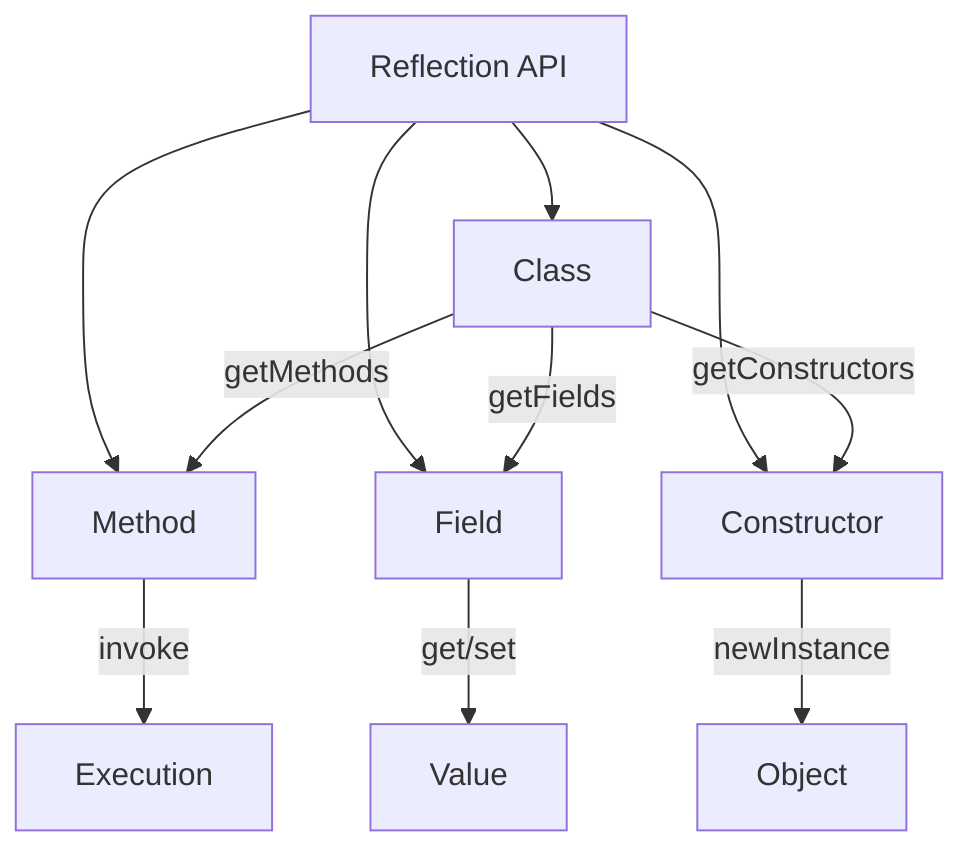
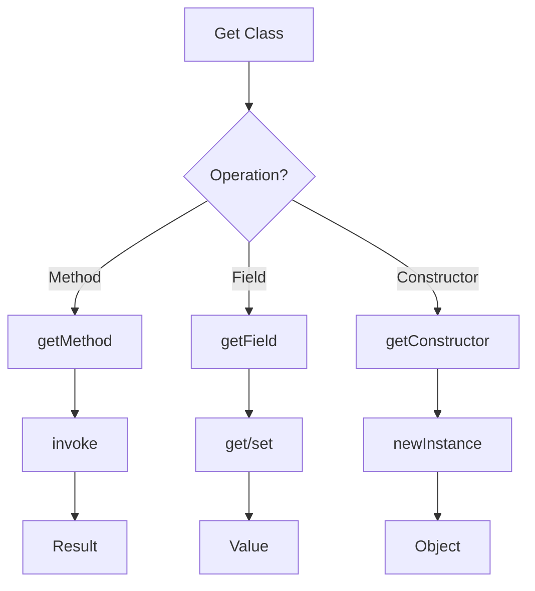
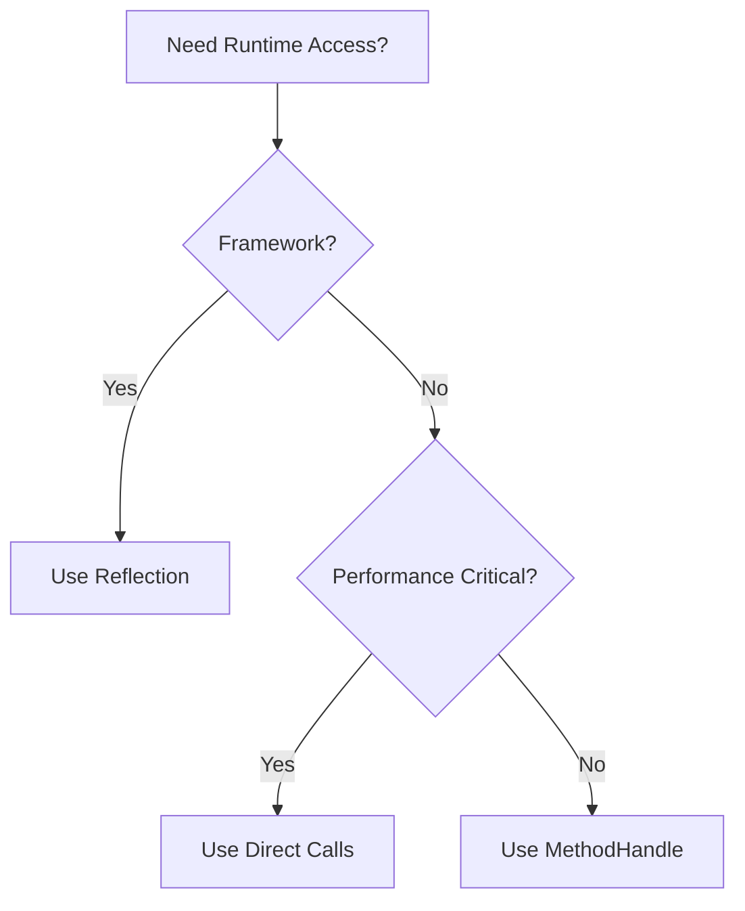

# Module 14: Reflection

## Overview
Reflection is a Java API that allows inspection and modification of classes, methods, fields, and constructors at runtime. It enables dynamic loading, invocation, and manipulation of code, forming the foundation for frameworks, serialization, and testing tools.

## Learning Objectives
- Master Class object manipulation
- Understand method and field access
- Use Constructor for dynamic instantiation
- Apply reflection in frameworks
- Handle reflection performance implications

## Prerequisites
- Core Java knowledge
- OOP concepts
- Basic JVM understanding

## Why This Concept Exists
Static typing limits flexibility. Reflection enables:
- Framework development (Spring, Hibernate)
- Dynamic proxy creation
- Runtime type inspection
- Test framework implementation
- Serialization/deserialization

## Problem Statement
How do you inspect and manipulate classes, methods, and fields at runtime?

## Theory

### Reflection API Classes

| Class | Purpose |
|-------|---------|
| Class<T> | Class metadata |
| Method | Method information |
| Field | Field information |
| Constructor | Constructor information |
| Modifier | Access modifiers |

### Access Levels
```java
public class MyClass {
    public int publicField;
    protected int protectedField;
    int packageField;
    private int privateField;
}
```

### Reflection Operations
1. Get Class object
2. Inspect modifiers
3. Access fields
4. Invoke methods
5. Create instances

## Internal Working

### Class Loading
1. ClassLoader loads .class file
2. Bytecode verification
3. Class initialization
4. Class object created

### Method Invocation
1. Resolve method signature
2. Check access permissions
3. Box/unbox arguments
4. Invoke native method
5. Return result

## JVM Perspective

### Reflection Under the Hood
- Uses JNI for native method access
- Bypasses compile-time checks
- Runtime type resolution
- Security manager checks

### Performance Impact
- Method invocation overhead
- Box/unboxing cost
- Security checks
- No JIT optimization

## Memory Representation
```
Class Object:
┌─────────────────────────────────────┐
│ Class Name                          │
│ Super Class                         │
│ Interfaces                          │
│ Methods[]                           │
│ Fields[]                            │
│ Constructors[]                      │
└─────────────────────────────────────┘
```

## Architecture Diagram



## Flow Diagram



## Syntax

### Getting Class Objects
```java
// Three ways to get Class
Class<?> clazz1 = MyClass.class;
Class<?> clazz2 = obj.getClass();
Class<?> clazz3 = Class.forName("com.example.MyClass");
```

### Inspecting Methods
```java
Class<?> clazz = MyClass.class;
Method[] methods = clazz.getMethods();
Method method = clazz.getMethod("myMethod", String.class);
```

### Invoking Methods
```java
Object obj = clazz.getDeclaredConstructor().newInstance();
Method method = clazz.getMethod("myMethod", String.class);
Object result = method.invoke(obj, "argument");
```

### Accessing Fields
```java
Field field = clazz.getDeclaredField("myField");
field.setAccessible(true); // For private fields
Object value = field.get(obj);
field.set(obj, newValue);
```

### Creating Instances
```java
Constructor<?> constructor = clazz.getDeclaredConstructor();
constructor.setAccessible(true);
Object obj = constructor.newInstance();
```

## Easy Example
```java
import java.lang.reflect.*;

public class EasyExample {
    public static void main(String[] args) throws Exception {
        Class<?> clazz = String.class;
        
        System.out.println("Class name: " + clazz.getName());
        System.out.println("Simple name: " + clazz.getSimpleName());
        System.out.println("Superclass: " + clazz.getSuperclass().getName());
        
        // Get methods
        Method[] methods = clazz.getMethods();
        for (Method m : methods) {
            System.out.println("Method: " + m.getName());
        }
    }
}
```

## Medium Example
```java
import java.lang.reflect.*;

public class MediumExample {
    public static void main(String[] args) throws Exception {
        // Create instance dynamically
        Class<?> clazz = Class.forName("java.util.ArrayList");
        Object list = clazz.getDeclaredConstructor().newInstance();
        
        // Invoke add method
        Method addMethod = clazz.getMethod("add", Object.class);
        addMethod.invoke(list, "Hello");
        addMethod.invoke(list, "World");
        
        // Invoke size method
        Method sizeMethod = clazz.getMethod("size");
        int size = (int) sizeMethod.invoke(list);
        System.out.println("Size: " + size);
    }
}
```

## Hard Example
```java
import java.lang.reflect.*;

public class HardExample {
    public static void main(String[] args) throws Exception {
        // Private field access
        Class<?> clazz = Class.forName("java.lang.String");
        Field valueField = clazz.getDeclaredField("value");
        valueField.setAccessible(true);
        
        String str = "Hello";
        char[] value = (char[]) valueField.get(str);
        System.out.println("String value: " + new String(value));
        
        // Dynamic proxy
        Interface proxy = (Interface) Proxy.newProxyInstance(
            Interface.class.getClassLoader(),
            new Class[]{Interface.class},
            (proxy1, method, methodArgs) -> {
                System.out.println("Before: " + method.getName());
                Object result = method.invoke(new Implementation(), methodArgs);
                System.out.println("After: " + method.getName());
                return result;
            }
        );
        proxy.doSomething();
    }
}

interface Interface {
    void doSomething();
}

class Implementation implements Interface {
    public void doSomething() {
        System.out.println("Doing something");
    }
}
```

## Enterprise Example
```java
import java.lang.reflect.*;
import java.util.*;

public class EnterpriseExample {
    // Simple dependency injection
    public static <T> T inject(Class<T> clazz) throws Exception {
        T obj = clazz.getDeclaredConstructor().newInstance();
        
        for (Field field : clazz.getDeclaredFields()) {
            if (field.isAnnotationPresent(Inject.class)) {
                Object dependency = inject(field.getType());
                field.setAccessible(true);
                field.set(obj, dependency);
            }
        }
        return obj;
    }
    
    public static void main(String[] args) throws Exception {
        MyService service = inject(MyService.class);
        service.process();
    }
}

@interface Inject {}

class MyService {
    @Inject
    private MyRepository repository;
    
    public void process() {
        System.out.println("Processing with " + repository.getClass().getSimpleName());
    }
}

class MyRepository {}
```

## Performance Considerations
- Reflection is 10-50x slower than direct calls
- Use MethodHandle for better performance
- Cache Method/Field objects
- Avoid reflection in tight loops

## Time & Space Complexity
| Operation | Time | Space |
|-----------|------|-------|
| getMethod | O(n) | O(1) |
| invoke | O(1) | O(args) |
| getField | O(n) | O(1) |
| get/set | O(1) | O(1) |

## Thread Safety
- Reflection objects are not thread-safe
- Concurrent access needs synchronization
- Class loading is thread-safe
- Method.invoke is thread-safe

## Best Practices
1. Cache Method/Field objects
2. Use setAccessible(true) for private access
3. Prefer MethodHandle over reflection
4. Use annotations for metadata
5. Validate inputs before reflection

## Common Mistakes
1. Not handling exceptions
2. Ignoring access modifiers
3. Not caching reflection objects
4. Using reflection when not needed

## Pitfalls & Warnings
1. Security exceptions
2. Performance overhead
3. Breaking encapsulation
4. Version compatibility issues

## Debugging Tips
1. Print method signatures
2. Check class loader hierarchy
3. Use -verbose:class for class loading
4. Verify method existence before invoke

## Comparison Table

| Feature | Reflection | MethodHandle | Direct Call |
|---------|------------|--------------|-------------|
| Performance | Slow | Medium | Fast |
| Flexibility | High | High | Low |
| Safety | Low | Medium | High |

## Decision Tree



## Interview Questions

### Q1: What is reflection?
**Answer:** API for inspecting and modifying classes, methods, and fields at runtime.

### Q2: How do you get a Class object?
**Answer:** Class.forName(), obj.getClass(), or ClassName.class.

### Q3: How do you invoke a method reflectively?
**Answer:** Use method.invoke(object, args) after getting Method object.

### Q4: How do you access private fields?
**Answer:** Use field.setAccessible(true) before get/set.

### Q5: What is the performance impact?
**Answer:** Reflection is 10-50x slower than direct calls.

### Q6: What is a dynamic proxy?
**Answer:** Runtime-generated implementation of interfaces using Proxy.newProxyInstance().

### Q7: How do you handle exceptions in reflection?
**Answer:** Catch NoSuchMethodException, IllegalAccessException, etc.

### Q8: What is setAccessible used for?
**Answer:** Bypasses access control checks for private members.

### Q9: How do you get all methods of a class?
**Answer:** Use clazz.getMethods() or clazz.getDeclaredMethods().

### Q10: What is the difference between getMethods and getDeclaredMethods?
**Answer:** getMethods includes inherited, getDeclaredMethods is class only.

### Q11: How do you create an instance reflectively?
**Answer:** Use constructor.newInstance() after getting Constructor object.

### Q12: What is MethodHandle?
**Answer:** A typed, direct reference to an underlying method, faster than reflection.

### Q13: How do you check if a method exists?
**Answer:** Use clazz.getDeclaredMethod() and catch NoSuchMethodException.

### Q14: What are common use cases for reflection?
**Answer:** Frameworks (Spring), testing (JUnit), serialization, dependency injection.

### Q15: How do you make reflection safer?
**Answer:** Cache objects, validate inputs, use security manager.

## Exercises

### Easy
1. Print all methods of a class
2. Access a public field reflectively
3. Create an instance using reflection

### Medium
1. Implement a simple serialization tool
2. Access private members safely
3. Create a dynamic proxy

### Hard
1. Build a simple dependency injection framework
2. Implement a mock framework
3. Create a type-safe reflection wrapper

## Summary
Reflection enables runtime inspection and manipulation of classes. Essential for frameworks but has performance costs.

## References
- Oracle Java Documentation: Reflection
- Java Reflection Tutorial
- Baeldung Reflection Guide
