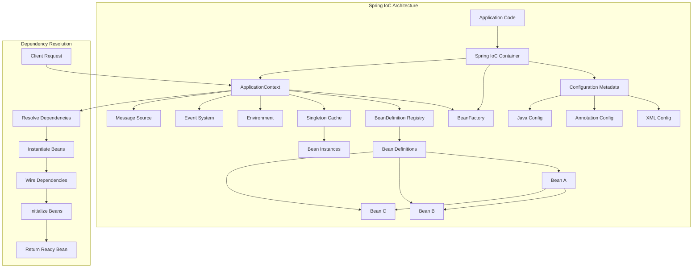
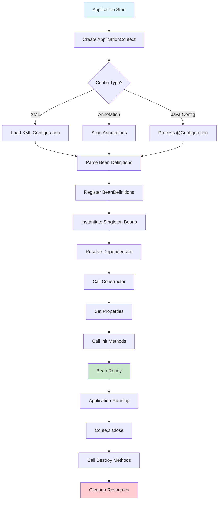

# Module 14.1: Spring Framework Fundamentals

## 1. Introduction

Spring Framework is the most widely adopted Java enterprise framework, providing comprehensive infrastructure support for developing Java applications. At its core, Spring revolves around **Inversion of Control (IoC)** and **Dependency Injection (DI)**, which decouple application components and promote loose coupling, testability, and maintainability.

This module introduces the foundational concepts of Spring: IoC containers, dependency injection, ApplicationContext, and BeanFactory—the pillars upon which the entire Spring ecosystem is built.

## 2. Learning Objectives

By the end of this module, you will be able to:

- Understand Inversion of Control (IoC) and its benefits
- Explain Dependency Injection and its types
- Differentiate between BeanFactory and ApplicationContext
- Configure Spring beans using XML and annotations
- Create and use Spring IoC containers
- Understand bean lifecycle management
- Apply Spring fundamentals in real-world applications

## 3. Prerequisites

- Java SE fundamentals (classes, interfaces, annotations)
- Object-Oriented Programming concepts
- Basic understanding of design patterns (Factory, Singleton)
- Familiarity with Maven/Gradle build tools
- Understanding of Java annotations and reflection

## 4. Why This Concept Exists

### The Problem Without IoC

In traditional Java applications, objects are responsible for creating their own dependencies:

```java
// Tight coupling - problematic approach
public class OrderService {
    private OrderRepository repository = new MySqlOrderRepository(); // Hardcoded dependency
    private NotificationService notifier = new EmailNotificationService(); // Hardcoded
}
```

**Issues:**
- **Tight coupling**: Components are directly dependent on concrete implementations
- **Testing difficulty**: Cannot easily substitute mock implementations
- **Configuration rigidity**: Changing requires code modification
- **Violation of Open/Closed Principle**: Not open for extension without modification

### The IoC Solution

Spring Framework solves these problems by implementing the **Inversion of Control** pattern, where the container manages object creation, configuration, and lifecycle, injecting dependencies from outside.

## 5. Problem Statement

Consider an e-commerce application with multiple components:

```java
// Without Spring - manual dependency management
public class ProductService {
    private ProductRepository repository;
    private PriceCalculator calculator;
    private InventoryService inventory;

    public ProductService() {
        this.repository = new JdbcProductRepository(); // Created internally
        this.calculator = new DefaultPriceCalculator(); // Created internally
        this.inventory = new InventoryServiceImpl(); // Created internally
    }
}
```

**Problems:**
1. ProductService creates its own dependencies → tight coupling
2. Switching to NoSQL repository requires code changes
3. Unit testing requires actual database connections
4. Configuration scattered across multiple classes
5. Lifecycle management is manual and error-prone

## 6. Theory

### Inversion of Control (IoC)

IoC is a design principle where the control of object creation and lifecycle is transferred from the application code to an external container (framework). Instead of objects creating their dependencies, the container injects them.

**Key Principles:**
- **Dependency Inversion Principle (DIP)**: High-level modules should not depend on low-level modules; both should depend on abstractions
- **Separation of Concerns**: Business logic separated from infrastructure concerns
- **Declarative Programming**: Configuration of behavior rather than imperative coding

### Dependency Injection (DI)

DI is a specific form of IoC where dependencies are provided (injected) by the container rather than created by the object.

**Types of DI:**
1. **Constructor Injection**: Dependencies provided through constructor parameters
2. **Setter Injection**: Dependencies provided through setter methods
3. **Field Injection**: Dependencies injected directly into fields (via reflection)

### IoC Container

Spring's IoC container is responsible for:
1. **Instantiating** beans (objects)
2. **Configuring** beans (wiring dependencies)
3. **Managing** bean lifecycle
4. **Resolving** dependencies

### Bean

A bean is an object managed by the Spring IoC container. Beans are defined by configuration metadata (XML, annotations, or Java config).

## 7. Internal Working

### Spring Container Bootstrap Process

```
1. Load Configuration Metadata
   ├── XML files (applicationContext.xml)
   ├── Annotation scanning (@Component, @Service, etc.)
   └── Java configuration (@Configuration, @Bean)

2. Create IoC Container
   ├── BeanFactory (basic container)
   └── ApplicationContext (advanced container)

3. Bean Definition Processing
   ├── Parse configuration
   ├── Create BeanDefinition objects
   └── Register BeanDefinitions

4. Bean Instantiation
   ├── Resolve dependencies
   ├── Call constructors
   ├── Populate properties
   └── Initialize beans

5. Ready for Use
   ├── Beans available for lookup
   └── Application context ready
```

### Dependency Resolution Process

```
Bean A depends on Bean B
  ↓
Container discovers Bean A definition
  ↓
Identifies dependency on Bean B
  ↓
Looks up Bean B definition
  ↓
Instantiates Bean B (if not already)
  ↓
Injects Bean B into Bean A
  ↓
Returns fully initialized Bean A
```

## 8. JVM Perspective

### Bean Registration and Storage

```
JVM Heap Memory:
┌─────────────────────────────────────────────────┐
│ Spring IoC Container                            │
├─────────────────────────────────────────────────┤
│ BeanDefinition Registry (Map)                   │
│   ├── "userService" → BeanDefinition            │
│   ├── "userRepository" → BeanDefinition         │
│   └── "emailService" → BeanDefinition           │
├─────────────────────────────────────────────────┤
│ Singleton Cache (Map)                           │
│   ├── "userService" → UserService@1a2b3c        │
│   └── "userRepository" → UserRepository@4d5e6f  │
├─────────────────────────────────────────────────┤
│ Application Context State                       │
│   ├── Environment                               │
│   ├── Event Multicaster                         │
│   └── Message Source                            │
└─────────────────────────────────────────────────┘
```

### Reflection Under the Hood

Spring uses Java Reflection API for:
- **Class loading**: `Class.forName()`
- **Constructor invocation**: `Constructor.newInstance()`
- **Method invocation**: `Method.invoke()` (for setter injection)
- **Field access**: `Field.set()` (for field injection)

## 9. Memory Representation

```
Stack Memory (per thread):
┌───────────────────────────────────────────┐
│ main() method                            │
│   └── AnnotationConfigApplicationContext  │
│         └── ctx.getBean("userService")   │
│               └── UserService instance    │
└───────────────────────────────────────────┘

Heap Memory:
┌───────────────────────────────────────────┐
│ AnnotationConfigApplicationContext        │
│   └── DefaultListableBeanFactory         │
│         └── beanDefinitionMap (HashMap)   │
│               ├── "userService"          │
│               └── "userRepository"       │
├───────────────────────────────────────────┤
│ Singleton Objects Cache                   │
│   └── ConcurrentHashMap                  │
│         ├── "userService" → @UserService  │
│         └── "userRepository" → @Repo     │
└───────────────────────────────────────────┘
```

## 10. Architecture Diagram



## 11. Flow Diagram



## 12. Syntax

### XML Configuration

```xml
<?xml version="1.0" encoding="UTF-8"?>
<beans xmlns="http://www.springframework.org/schema/beans"
       xmlns:xsi="http://www.w3.org/2001/XMLSchema-instance"
       xsi:schemaLocation="http://www.springframework.org/schema/beans
       http://www.springframework.org/schema/beans/spring-beans.xsd">

    <!-- Simple bean definition -->
    <bean id="userRepository" 
          class="com.example.JdbcUserRepository"/>
    
    <!-- Bean with constructor injection -->
    <bean id="userService" 
          class="com.example.UserServiceImpl">
        <constructor-arg ref="userRepository"/>
    </bean>
    
    <!-- Bean with setter injection -->
    <bean id="userService" 
          class="com.example.UserServiceImpl">
        <property name="repository" ref="userRepository"/>
        <property name="maxRetries" value="3"/>
    </bean>
</beans>
```

### Annotation Configuration

```java
// Component scanning
@Configuration
@ComponentScan(basePackages = "com.example")
public class AppConfig {
}

// Service bean
@Service
public class UserServiceImpl implements UserService {
    private final UserRepository repository;
    
    @Autowired
    public UserServiceImpl(UserRepository repository) {
        this.repository = repository;
    }
}

// Repository bean
@Repository
public class JdbcUserRepository implements UserRepository {
    // implementation
}
```

### Java Configuration

```java
@Configuration
public class AppConfig {
    
    @Bean
    public UserRepository userRepository() {
        return new JdbcUserRepository();
    }
    
    @Bean
    public UserService userService() {
        return new UserServiceImpl(userRepository());
    }
}
```

## 13. Easy Example

### Basic Spring Application

```java
import org.springframework.context.annotation.AnnotationConfigApplicationContext;
import org.springframework.context.annotation.Bean;
import org.springframework.context.annotation.Configuration;
import org.springframework.stereotype.Component;

// Step 1: Create a simple component
@Component
public class Greeter {
    public String greet(String name) {
        return "Hello, " + name + "!";
    }
}

// Step 2: Define Spring configuration
@Configuration
public class AppConfig {
    
    @Bean
    public Greeter greeter() {
        return new Greeter();
    }
}

// Step 3: Use the Spring container
public class MainApplication {
    public static void main(String[] args) {
        // Create Spring IoC container
        AnnotationConfigApplicationContext context = 
            new AnnotationConfigApplicationContext(AppConfig.class);
        
        // Get bean from container
        Greeter greeter = context.getBean(Greeter.class);
        
        // Use the bean
        System.out.println(greeter.greet("World"));
        
        // Close context
        context.close();
    }
}
```

## 14. Medium Example

### Service Layer with Dependencies

```java
import org.springframework.beans.factory.annotation.Autowired;
import org.springframework.stereotype.Service;
import org.springframework.stereotype.Repository;
import org.springframework.context.annotation.ComponentScan;
import org.springframework.context.annotation.Configuration;
import org.springframework.context.annotation.AnnotationConfigApplicationContext;

// Repository layer
@Repository
public class UserRepository {
    
    public User findById(Long id) {
        // Simulated database lookup
        return new User(id, "John Doe", "john@example.com");
    }
    
    public void save(User user) {
        System.out.println("Saving user: " + user.getName());
    }
}

// Service layer with dependency injection
@Service
public class UserService {
    
    private final UserRepository repository;
    
    @Autowired
    public UserService(UserRepository repository) {
        this.repository = repository;
    }
    
    public User getUser(Long id) {
        return repository.findById(id);
    }
    
    public void createUser(String name, String email) {
        User user = new User(null, name, email);
        repository.save(user);
    }
}

// Model class
public class User {
    private Long id;
    private String name;
    private String email;
    
    public User(Long id, String name, String email) {
        this.id = id;
        this.name = name;
        this.email = email;
    }
    
    // getters and setters
    public Long getId() { return id; }
    public String getName() { return name; }
    public String getEmail() { return email; }
}

// Configuration
@Configuration
@ComponentScan(basePackages = "com.example")
public class AppConfig {
}

// Main application
public class ServiceApplication {
    public static void main(String[] args) {
        AnnotationConfigApplicationContext context = 
            new AnnotationConfigApplicationContext(AppConfig.class);
        
        UserService userService = context.getBean(UserService.class);
        
        // Create a user
        userService.createUser("Alice", "alice@example.com");
        
        // Get a user
        User user = userService.getUser(1L);
        System.out.println("Retrieved user: " + user.getName());
        
        context.close();
    }
}
```

## 15. Hard Example

### Multi-Module Configuration with Conditional Beans

```java
import org.springframework.beans.factory.annotation.Value;
import org.springframework.context.annotation.*;
import org.springframework.stereotype.Component;
import org.springframework.stereotype.Service;
import org.springframework.beans.factory.annotation.Autowired;
import org.springframework.context.annotation.AnnotationConfigApplicationContext;

// Environment-specific repository interfaces
public interface NotificationRepository {
    void send(String message);
}

// MySQL implementation
@Component
@Profile("production")
public class MySqlNotificationRepository implements NotificationRepository {
    @Override
    public void send(String message) {
        System.out.println("MySQL: " + message);
    }
}

// In-memory implementation for testing
@Component
@Profile("test")
public class InMemoryNotificationRepository implements NotificationRepository {
    @Override
    public void send(String message) {
        System.out.println("InMemory: " + message);
    }
}

// Service with conditional dependency
@Service
public class NotificationService {
    
    private final NotificationRepository repository;
    
    @Autowired
    public NotificationService(NotificationRepository repository) {
        this.repository = repository;
    }
    
    public void notify(String message) {
        repository.send(message);
    }
}

// Configuration with conditional beans
@Configuration
@ComponentScan(basePackages = "com.example")
public class AppConfig {
    
    @Bean
    @ConditionalOnProperty(name = "app.metrics.enabled", havingValue = "true")
    public MetricsCollector metricsCollector() {
        return new MetricsCollector();
    }
    
    @Bean
    @Profile("production")
    public DataSource productionDataSource() {
        // Production datasource configuration
        return new DataSource("jdbc:mysql://localhost:3306/prod");
    }
    
    @Bean
    @Profile("test")
    public DataSource testDataSource() {
        // Test datasource configuration
        return new DataSource("jdbc:h2:mem:testdb");
    }
}

// Advanced application with profiles
public class AdvancedApplication {
    public static void main(String[] args) {
        // Set active profile
        System.setProperty("spring.profiles.active", "test");
        
        AnnotationConfigApplicationContext context = 
            new AnnotationConfigApplicationContext(AppConfig.class);
        
        NotificationService service = context.getBean(NotificationService.class);
        service.notify("Test message");
        
        context.close();
    }
}
```

## 16. Enterprise Example

### Enterprise Application Architecture

```java
import org.springframework.context.annotation.*;
import org.springframework.stereotype.*;
import org.springframework.beans.factory.annotation.Autowired;
import org.springframework.beans.factory.annotation.Value;
import org.springframework.context.annotation.AnnotationConfigApplicationContext;
import java.util.List;

// Domain model
public class Order {
    private Long id;
    private Long customerId;
    private List<OrderItem> items;
    private OrderStatus status;
    
    // constructor, getters, setters
    public Order(Long id, Long customerId, List<OrderItem> items) {
        this.id = id;
        this.customerId = customerId;
        this.items = items;
        this.status = OrderStatus.PENDING;
    }
    
    public Long getId() { return id; }
    public Long getCustomerId() { return customerId; }
    public List<OrderItem> getItems() { return items; }
    public OrderStatus getStatus() { return status; }
    public void setStatus(OrderStatus status) { this.status = status; }
}

public class OrderItem {
    private Long productId;
    private int quantity;
    private double price;
    
    public OrderItem(Long productId, int quantity, double price) {
        this.productId = productId;
        this.quantity = quantity;
        this.price = price;
    }
    
    public Long getProductId() { return productId; }
    public int getQuantity() { return quantity; }
    public double getPrice() { return price; }
    public double getTotal() { return quantity * price; }
}

enum OrderStatus {
    PENDING, CONFIRMED, SHIPPED, DELIVERED, CANCELLED
}

// Repository layer
@Repository
public class OrderRepository {
    
    public Order findById(Long id) {
        // Simulated database lookup
        return new Order(id, 1001L, List.of(
            new OrderItem(1L, 2, 29.99),
            new OrderItem(2L, 1, 49.99)
        ));
    }
    
    public void save(Order order) {
        System.out.println("Saving order: " + order.getId());
    }
}

// Service layer
@Service
public class OrderService {
    
    private final OrderRepository orderRepository;
    private final NotificationService notificationService;
    private final PricingService pricingService;
    
    @Autowired
    public OrderService(OrderRepository orderRepository,
                       NotificationService notificationService,
                       PricingService pricingService) {
        this.orderRepository = orderRepository;
        this.notificationService = notificationService;
        this.pricingService = pricingService;
    }
    
    public Order getOrder(Long orderId) {
        return orderRepository.findById(orderId);
    }
    
    public Order createOrder(Long customerId, List<OrderItem> items) {
        Order order = new Order(null, customerId, items);
        
        // Apply pricing
        double total = pricingService.calculateTotal(items);
        
        // Save order
        orderRepository.save(order);
        
        // Notify customer
        notificationService.notify("Order created: " + order.getId());
        
        return order;
    }
}

// Supporting services
@Service
public class NotificationService {
    
    @Autowired
    public NotificationService() {}
    
    public void notify(String message) {
        System.out.println("Notification: " + message);
    }
}

@Service
public class PricingService {
    
    @Value("${app.pricing.discount:0.1}")
    private double discount;
    
    public double calculateTotal(List<OrderItem> items) {
        return items.stream()
            .mapToDouble(OrderItem::getTotal)
            .sum() * (1 - discount);
    }
}

// Configuration
@Configuration
@ComponentScan(basePackages = "com.example")
@PropertySource("classpath:application.properties")
public class EnterpriseConfig {
    
    @Bean
    public OrderValidator orderValidator() {
        return new OrderValidator();
    }
}

// Validator component
@Component
public class OrderValidator {
    
    public boolean validateOrder(Order order) {
        if (order.getCustomerId() == null) {
            throw new IllegalArgumentException("Customer ID is required");
        }
        if (order.getItems() == null || order.getItems().isEmpty()) {
            throw new IllegalArgumentException("Order must have items");
        }
        return true;
    }
}

// Enterprise application
public class EnterpriseApplication {
    public static void main(String[] args) {
        AnnotationConfigApplicationContext context = 
            new AnnotationConfigApplicationContext(EnterpriseConfig.class);
        
        OrderService orderService = context.getBean(OrderService.class);
        OrderValidator validator = context.getBean(OrderValidator.class);
        
        // Create an order
        List<OrderItem> items = List.of(
            new OrderItem(1L, 2, 29.99),
            new OrderItem(2L, 1, 49.99)
        );
        
        Order order = orderService.createOrder(1001L, items);
        System.out.println("Order created: " + order.getId());
        
        // Validate order
        validator.validateOrder(order);
        System.out.println("Order validated successfully");
        
        context.close();
    }
}
```

## 17. Performance

### Container Initialization Performance

| Operation | Time Complexity | Typical Duration |
|-----------|----------------|------------------|
| Context Creation | O(n) | 100-500ms |
| Bean Instantiation | O(1) per bean | 1-10ms each |
| Dependency Resolution | O(d) per bean | 1-5ms each |
| Annotation Scanning | O(packages) | 50-200ms |
| Property Resolution | O(1) per property | <1ms each |

### Memory Usage

| Component | Memory Impact |
|-----------|---------------|
| ApplicationContext | 1-5 MB |
| BeanFactory | 100-500 KB |
| Each Singleton Bean | 1-100 KB |
| BeanDefinition | 1-10 KB |

### Performance Tips

1. **Lazy Initialization**: Use `@Lazy` for beans not needed at startup
2. **Prototype Scope**: For objects that don't need sharing
3. **Component Scanning**: Limit scan packages
4. **Avoid Field Injection**: Prefer constructor injection

## 18. Time & Space Complexity

### Time Complexity

| Operation | Complexity |
|-----------|------------|
| Get Bean (Singleton) | O(1) - HashMap lookup |
| Get Bean (Prototype) | O(n) - dependency resolution |
| Create Context | O(b + d) - beans + dependencies |
| Close Context | O(b) - destroy all beans |

### Space Complexity

| Component | Complexity |
|-----------|------------|
| BeanDefinition Registry | O(b) - all bean definitions |
| Singleton Cache | O(s) - singleton instances |
| Dependency Graph | O(d) - dependency relationships |
| Total Memory | O(b + s + d) |

## 19. Thread Safety

### Thread Safety Considerations

```java
// Thread-safe singleton bean
@Service
public class ThreadSafeService {
    
    private final AtomicInteger counter = new AtomicInteger(0);
    
    public int incrementAndGet() {
        return counter.incrementAndGet(); // Thread-safe
    }
}

// Non-thread-safe singleton (problematic)
@Service
public class NonThreadSafeService {
    
    private int counter = 0; // NOT thread-safe
    
    public int incrementAndGet() {
        return ++counter; // Race condition possible
    }
}
```

### Spring's Thread Safety Guarantees

1. **Singleton Beans**: Spring does NOT guarantee thread safety
2. **Prototype Beans**: Each thread gets its own instance
3. **Request/Session Scoped**: Thread-bound by design
4. **Concurrent Access**: Use synchronization or atomic types

## 20. Best Practices

1. **Prefer Constructor Injection**: Makes dependencies explicit and testable
2. **Use @Component for Spring-managed beans**: Clear intent
3. **Keep beans stateless**: Avoid mutable shared state in singletons
4. **Limit component scanning**: Scan specific packages
5. **Use profiles for environment-specific beans**: Clean configuration
6. **Avoid field injection**: Harder to test and makes dependencies implicit
7. **Use @Configuration for complex bean creation**: Better than @Component
8. **Prefer interfaces over implementations**: Follows dependency inversion
9. **Use @Qualifier for multiple beans of same type**: Explicit wiring
10. **Profile-specific configurations**: Separate dev/test/prod beans

## 21. Common Mistakes

### Mistake 1: Circular Dependencies
```java
@Service
public class ServiceA {
    @Autowired
    private ServiceB serviceB; // Circular!
}

@Service
public class ServiceB {
    @Autowired
    private ServiceA serviceA; // Circular!
}
```
**Solution**: Refactor to remove circular dependency or use `@Lazy`

### Mistake 2: Using Field Injection
```java
@Service
public class BadService {
    @Autowired
    private Dependency dep; // Hard to test
}
```
**Solution**: Use constructor injection instead

### Mistake 3: Not Closing Application Context
```java
public static void main(String[] args) {
    AnnotationConfigApplicationContext ctx = 
        new AnnotationConfigApplicationContext(AppConfig.class);
    // Missing ctx.close() - resource leak!
}
```
**Solution**: Always close context in finally block or use try-with-resources

### Mistake 4: Scanning Too Many Packages
```java
@ComponentScan(basePackages = "com") // Scans entire codebase
```
**Solution**: Use specific packages: `basePackages = "com.example.myapp"`

## 22. Pitfalls

### Pitfall 1: Bean Name Conflicts
When multiple beans of same type exist, Spring may not know which to inject.

### Pitfall 2: Proxy Issues with self-invocation
Methods called within the same class don't go through Spring proxy, so AOP doesn't apply.

### Pitfall 3: Lazy vs Eager Initialization
Default is eager. For large applications, lazy initialization can improve startup time.

### Pitfall 4: Context Configuration Mistakes
Missing `@Configuration` or `@ComponentScan` can prevent beans from being registered.

## 23. Debugging Tips

```java
// 1. List all beans
String[] beanNames = context.getBeanDefinitionNames();
Arrays.sort(beanNames);
for (String name : beanNames) {
    System.out.println(name);
}

// 2. Check if bean is singleton
boolean isSingleton = context.isSingleton("myBean");

// 3. Get bean count
int count = context.getBeanDefinitionCount();

// 4. Check bean type
Class<?> type = context.getType("myBean");

// 5. Enable bean creation logging
-Dlogging.level.org.springframework.beans=DEBUG

// 6. Check for circular dependencies
-Dspring.main.allow-circular-references=false

// 7. Display bean creation time
-Dspring.context.startup=info
```

## 24. Comparison Table

| Feature | BeanFactory | ApplicationContext |
|---------|-------------|-------------------|
| **Bean Loading** | Lazy | Eager |
| **Event Publishing** | No | Yes |
| **i18n Support** | No | Yes |
| **AOP Integration** | Basic | Advanced |
| **Web Support** | No | Yes |
| **Environment** | No | Yes |
| **Resource Loading** | Basic | Advanced |
| **Lifecycle Management** | Basic | Full |
| **Type** | Container | Container + Features |

## 25. Decision Tree

```
Should you use Spring IoC?
│
├── Need loose coupling? → YES → Use Spring
├── Need dependency management? → YES → Use Spring
├── Need lifecycle management? → YES → Use Spring
├── Need AOP? → YES → Use Spring
├── Simple application? → NO → Consider manual DI
├── Performance critical? → Consider alternatives
└── Learning project? → YES → Use Spring Boot
```

## 26. Interview Questions (15+)

### Basic Questions

1. **What is Inversion of Control (IoC)?**
   IoC is a design principle where the control of object creation and lifecycle is transferred from the application to an external container.

2. **What is Dependency Injection (DI)?**
   DI is a form of IoC where dependencies are provided by the container rather than created by the object.

3. **What is the difference between BeanFactory and ApplicationContext?**
   BeanFactory is the basic container with lazy loading; ApplicationContext is an advanced container with eager loading, events, i18n, and more features.

4. **What are the types of Dependency Injection?**
   Constructor injection, setter injection, and field injection.

5. **What is a Spring Bean?**
   An object managed by the Spring IoC container, configured through metadata.

### Intermediate Questions

6. **What is the difference between @Component and @Bean?**
   @Component is class-level annotation for auto-detection; @Bean is method-level in @Configuration classes for explicit bean creation.

7. **What is @Autowired?**
   An annotation for automatic dependency injection. Works with constructors, setters, and fields.

8. **What is @Configuration?**
   A class-level annotation indicating the class contains @Bean methods for Spring container configuration.

9. **What is @ComponentScan?**
   An annotation that tells Spring to scan for @Component, @Service, @Repository, and @Controller classes.

10. **What is the Singleton pattern in Spring?**
    Default bean scope where one instance is shared across the entire container.

### Advanced Questions

11. **How does Spring resolve circular dependencies?**
    Spring can resolve circular dependencies for setter-injected singletons using three-level cache. Constructor-injected circular dependencies throw an exception.

12. **What is the Spring IoC container lifecycle?**
    1) Load configuration, 2) Create BeanFactory, 3) Register BeanDefinitions, 4) Instantiate singletons, 5) Initialize beans, 6) Ready for use.

13. **What is lazy initialization in Spring?**
    Beans are created only when first requested, not at container startup. Use @Lazy annotation.

14. **What is @Qualifier?**
    An annotation used with @Autowired to specify which bean to inject when multiple beans of the same type exist.

15. **What is @Primary?**
    An annotation that marks a bean as the preferred candidate when multiple beans of the same type exist.

16. **What is Spring's Bean Definition?**
    Metadata describing how to create a bean: class, scope, dependencies, initialization, destruction methods.

17. **How do you profile Spring applications?**
    Use @Profile annotation to specify environment-specific beans and set active profiles via properties or system property.

## 27. Exercises

### Level 1 (Beginner)

**Exercise 1**: Create a basic Spring application with two beans (UserService and UserRepository) using constructor injection.

**Exercise 2**: Create a Spring application that reads properties from an external file using @Value.

**Exercise 3**: Create multiple profiles (dev, test, prod) with different database configurations.

### Level 2 (Intermediate)

**Exercise 1**: Create a Spring application with circular dependency and resolve it using @Lazy.

**Exercise 2**: Create a custom annotation @InjectRepository that automatically creates repository beans.

**Exercise 3**: Create a Spring application with conditional beans based on environment properties.

### Level 3 (Advanced)

**Exercise 1**: Create a mini Spring IoC container from scratch that supports constructor injection.

**Exercise 2**: Create a Spring application with custom BeanFactoryPostProcessor that modifies bean definitions.

**Exercise 3**: Create a Spring application with ApplicationListener that logs all bean creation events.

## 28. Summary

Spring Framework fundamentals revolve around:

- **IoC Container**: Manages object creation, configuration, and lifecycle
- **Dependency Injection**: Provides dependencies from outside, promoting loose coupling
- **BeanFactory**: Basic container with lazy loading
- **ApplicationContext**: Advanced container with events, i18n, and web support
- **Configuration**: XML, annotations, and Java-based configuration
- **Bean Lifecycle**: Initialization and destruction callbacks

Key takeaways:
- IoC promotes loose coupling and testability
- Constructor injection is preferred over field injection
- ApplicationContext is the most commonly used container
- Spring manages bean lifecycle automatically
- Understanding Spring fundamentals is essential for enterprise Java development

## 29. References

- [Spring Framework Official Documentation](https://docs.spring.io/spring-framework/reference/)
- [Spring IoC Container](https://docs.spring.io/spring-framework/reference/core.html#beans)
- [Spring Dependency Injection](https://docs.spring.io/spring-framework/reference/core.html#beans-dependencies)
- [Spring Bean Scopes](https://docs.spring.io/spring-framework/reference/core.html#beans-factory-scopes)
- [Spring Boot Reference](https://docs.spring.io/spring-boot/docs/current/reference/htmlsingle/)
- *Spring in Action* by Craig Walls
- *Spring Framework 5: Beginner to Tutorial* by Clarence Ho
