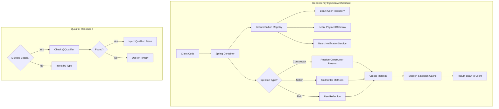
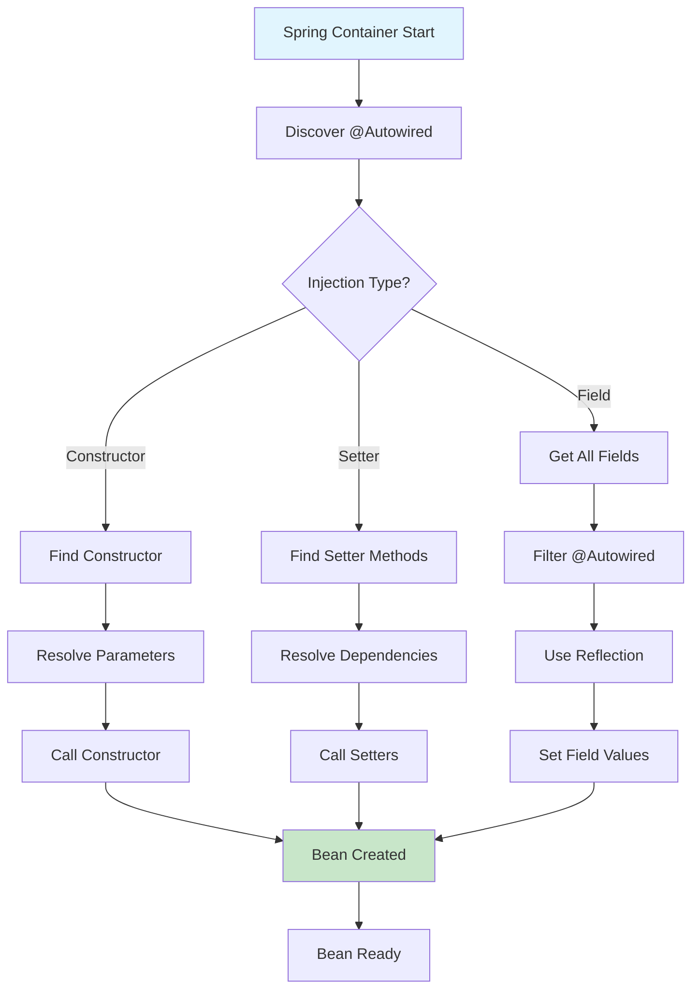

# Module 14.2: Spring Dependency Injection

## 1. Introduction

Dependency Injection (DI) is the core mechanism through which Spring Framework achieves loose coupling and Inversion of Control. DI allows you to define how components depend on each other, with the container resolving and injecting these dependencies at runtime.

This module covers all three types of DI in Spring: constructor injection, setter injection, and field injection, along with best practices and real-world patterns.

## 2. Learning Objectives

By the end of this module, you will be able to:

- Understand and implement all three types of DI
- Use @Autowired annotation effectively
- Apply constructor injection as the preferred approach
- Use @Qualifier for multiple beans of the same type
- Implement @Primary for default bean selection
- Use @Value for injecting configuration values
- Understand method injection with @Lookup

## 3. Prerequisites

- Module 14.1: Spring Fundamentals
- Java interfaces and abstract classes
- Understanding of SOLID principles
- Basic knowledge of annotations

## 4. Why This Concept Exists

### The Problem Without DI

```java
// Tight coupling - dependencies created internally
public class OrderService {
    private OrderRepository repository = new JdbcOrderRepository(); // Hardcoded
    private PaymentGateway gateway = new StripePaymentGateway(); // Hardcoded
    private NotificationService notifier = new EmailNotificationService(); // Hardcoded
}
```

**Issues:**
1. Cannot test with mocks
2. Changing implementations requires code changes
3. Violates Open/Closed Principle
4. Configuration scattered across codebase

### The DI Solution

DI externalizes dependency creation, allowing the container to provide dependencies:

```java
// Loose coupling - dependencies injected from outside
@Service
public class OrderService {
    private final OrderRepository repository;
    private final PaymentGateway gateway;
    private final NotificationService notifier;
    
    @Autowired
    public OrderService(OrderRepository repository,
                       PaymentGateway gateway,
                       NotificationService notifier) {
        this.repository = repository;
        this.gateway = gateway;
        this.notifier = notifier;
    }
}
```

## 5. Problem Statement

Consider a payment processing system:

```java
// Without DI - testing is impossible
public class PaymentProcessor {
    private PaymentGateway gateway = new RealPaymentGateway(); // Cannot mock!
    private Logger logger = new FileLogger(); // Cannot mock!
    
    public boolean processPayment(double amount) {
        logger.log("Processing: " + amount);
        return gateway.charge(amount);
    }
}
```

**Problems:**
1. Unit testing requires real payment gateway
2. Cannot substitute different implementations
3. Cannot configure behavior externally
4. Tight coupling makes refactoring risky

## 6. Theory

### Dependency Injection Types

#### 1. Constructor Injection
Dependencies provided through constructor parameters. The container calls the constructor with the required dependencies.

**Advantages:**
- Dependencies are explicit and visible
- Object is always in valid state (no null dependencies)
- Immutable fields possible (final keyword)
- Easy to test (just pass mocks in constructor)

#### 2. Setter Injection
Dependencies provided through setter methods after object construction.

**Advantages:**
- Optional dependencies can be null
- Dependencies can be changed after construction
- Useful for reconfiguration

#### 3. Field Injection
Dependencies injected directly into fields via reflection.

**Disadvantages:**
- Hidden dependencies (not visible in constructor)
- Cannot use final fields
- Harder to test (requires reflection or Spring test context)
- Violates single responsibility principle

### Autowiring Modes

Spring can automatically resolve dependencies using:
- **byType**: Inject by type, requires exactly one bean of that type
- **byName**: Inject by bean name matching field name
- **constructor**: Resolve through constructor parameters
- **no**: No autowiring (default)

## 7. Internal Working

### Constructor Injection Process

```
1. Spring discovers class with @Autowired constructor
   ↓
2. Resolves each parameter type from BeanDefinition registry
   ↓
3. If multiple beans of same type, uses @Qualifier
   ↓
4. Creates instance by calling constructor with resolved beans
   ↓
5. Stores instance in singleton cache
```

### Field Injection Process

```
1. Spring creates object via default constructor
   ↓
2. Uses Java Reflection to access private fields
   ↓
3. Finds fields annotated with @Autowired
   ↓
4. Resolves dependency type from registry
   ↓
5. Calls Field.set() to inject dependency
```

### Autowiring Resolution

```
1. Match by type
   ├── Single match → Inject
   ├── Multiple matches → Use @Qualifier or @Primary
   └── No match → Check required attribute
       ├── required=true → Throw exception
       └── required=false → Skip (null)
```

## 8. JVM Perspective

### Reflection Usage

```java
// Field injection uses reflection
Field field = clazz.getDeclaredField("repository");
field.setAccessible(true);
field.set(beanInstance, repositoryInstance);

// Constructor injection uses reflection
Constructor<?> constructor = clazz.getConstructor(UserRepository.class);
Object beanInstance = constructor.newInstance(userRepository);
```

### Memory Impact

| Injection Type | Memory Overhead |
|---------------|-----------------|
| Constructor | Minimal (direct call) |
| Setter | Minimal (direct call) |
| Field | Reflection metadata + setAccessible flag |

## 9. Memory Representation

```
Stack Memory:
┌─────────────────────────────────────────┐
│ OrderService constructor call          │
│   ├── repository → UserRepository@abc  │
│   ├── gateway → PaymentGateway@def     │
│   └── notifier → NotificationService@ghi│
└─────────────────────────────────────────┘

Heap Memory:
┌─────────────────────────────────────────┐
│ OrderService instance                  │
│   ├── final repository → @abc          │
│   ├── final gateway → @def             │
│   └── final notifier → @ghi            │
└─────────────────────────────────────────┘
```

## 10. Architecture Diagram



## 11. Flow Diagram



## 12. Syntax

### Constructor Injection

```java
@Service
public class UserService {
    private final UserRepository repository;
    
    // Single constructor - @Autowired optional
    public UserService(UserRepository repository) {
        this.repository = repository;
    }
}

// Multiple dependencies
@Service
public class OrderService {
    private final OrderRepository orderRepo;
    private final PaymentService paymentService;
    private final NotificationService notificationService;
    
    @Autowired
    public OrderService(OrderRepository orderRepo,
                       PaymentService paymentService,
                       NotificationService notificationService) {
        this.orderRepo = orderRepo;
        this.paymentService = paymentService;
        this.notificationService = notificationService;
    }
}
```

### Setter Injection

```java
@Service
public class NotificationService {
    private EmailSender emailSender;
    private SmsSender smsSender;
    
    @Autowired
    public void setEmailSender(EmailSender emailSender) {
        this.emailSender = emailSender;
    }
    
    @Autowired
    public void setSmsSender(SmsSender smsSender) {
        this.smsSender = smsSender;
    }
}
```

### Field Injection

```java
@Service
public class UserService {
    @Autowired
    private UserRepository repository;
    
    @Autowired
    private EmailService emailService;
}
```

### @Qualifier Usage

```java
@Service
public class PaymentService {
    @Autowired
    @Qualifier("stripeGateway")
    private PaymentGateway gateway;
}

@Component("stripeGateway")
public class StripePaymentGateway implements PaymentGateway {
    // implementation
}

@Component("paypalGateway")
public class PayPalPaymentGateway implements PaymentGateway {
    // implementation
}
```

### @Primary Usage

```java
@Component
@Primary
public class PrimaryPaymentGateway implements PaymentGateway {
    // This will be injected by default
}

@Component
public class SecondaryPaymentGateway implements PaymentGateway {
    // Used only when @Qualifier specifies this
}
```

### @Value Injection

```java
@Service
public class SmtpEmailService {
    @Value("${email.smtp.host}")
    private String smtpHost;
    
    @Value("${email.smtp.port:587}")
    private int smtpPort;
    
    @Value("${email.enabled:true}")
    private boolean enabled;
}
```

## 13. Easy Example

### Basic Constructor Injection

```java
import org.springframework.context.annotation.AnnotationConfigApplicationContext;
import org.springframework.context.annotation.ComponentScan;
import org.springframework.context.annotation.Configuration;
import org.springframework.stereotype.Component;
import org.springframework.beans.factory.annotation.Autowired;

// Repository interface
public interface UserRepository {
    String findById(Long id);
    void save(String entity);
}

// Repository implementation
@Component
public class InMemoryUserRepository implements UserRepository {
    @Override
    public String findById(Long id) {
        return "User-" + id;
    }
    
    @Override
    public void save(String entity) {
        System.out.println("Saved: " + entity);
    }
}

// Service with constructor injection
@Component
public class UserService {
    private final UserRepository repository;
    
    @Autowired
    public UserService(UserRepository repository) {
        this.repository = repository;
    }
    
    public String getUser(Long id) {
        return repository.findById(id);
    }
    
    public void createUser(String name) {
        repository.save(name);
    }
}

// Configuration
@Configuration
@ComponentScan
public class AppConfig {
}

// Main application
public class DIExample {
    public static void main(String[] args) {
        AnnotationConfigApplicationContext context = 
            new AnnotationConfigApplicationContext(AppConfig.class);
        
        UserService userService = context.getBean(UserService.class);
        
        userService.createUser("Alice");
        System.out.println("User: " + userService.getUser(1L));
        
        context.close();
    }
}
```

## 14. Medium Example

### Multiple Injection Types with Qualifiers

```java
import org.springframework.beans.factory.annotation.Autowired;
import org.springframework.beans.factory.annotation.Qualifier;
import org.springframework.beans.factory.annotation.Value;
import org.springframework.context.annotation.*;
import org.springframework.stereotype.Component;
import org.springframework.stereotype.Service;

// Payment gateway interface
public interface PaymentGateway {
    boolean charge(double amount);
    String getName();
}

// Multiple implementations
@Component("stripe")
public class StripeGateway implements PaymentGateway {
    @Override
    public boolean charge(double amount) {
        System.out.println("Stripe charged: $" + amount);
        return true;
    }
    
    @Override
    public String getName() {
        return "Stripe";
    }
}

@Component("paypal")
public class PayPalGateway implements PaymentGateway {
    @Override
    public boolean charge(double amount) {
        System.out.println("PayPal charged: $" + amount);
        return true;
    }
    
    @Override
    public String getName() {
        return "PayPal";
    }
}

// Service using @Qualifier
@Service
public class PaymentService {
    private final PaymentGateway primaryGateway;
    private final PaymentGateway secondaryGateway;
    
    @Autowired
    public PaymentService(
            @Qualifier("stripe") PaymentGateway primaryGateway,
            @Qualifier("paypal") PaymentGateway secondaryGateway) {
        this.primaryGateway = primaryGateway;
        this.secondaryGateway = secondaryGateway;
    }
    
    public boolean processPrimaryPayment(double amount) {
        System.out.println("Using primary: " + primaryGateway.getName());
        return primaryGateway.charge(amount);
    }
    
    public boolean processSecondaryPayment(double amount) {
        System.out.println("Using secondary: " + secondaryGateway.getName());
        return secondaryGateway.charge(amount);
    }
}

// Configuration
@Configuration
@ComponentScan
public class PaymentConfig {
}

// Main application
public class PaymentApplication {
    public static void main(String[] args) {
        AnnotationConfigApplicationContext context = 
            new AnnotationConfigApplicationContext(PaymentConfig.class);
        
        PaymentService paymentService = context.getBean(PaymentService.class);
        
        paymentService.processPrimaryPayment(100.00);
        paymentService.processSecondaryPayment(50.00);
        
        context.close();
    }
}
```

## 15. Hard Example

### Advanced DI with @Value, @Lookup, and Method Injection

```java
import org.springframework.beans.factory.annotation.*;
import org.springframework.context.annotation.*;
import org.springframework.stereotype.Component;
import org.springframework.stereotype.Service;
import java.util.List;

// Configuration properties
@Configuration
@PropertySource("classpath:app.properties")
public class AppConfig {
    
    @Bean
    public NotificationDispatcher notificationDispatcher() {
        return new NotificationDispatcher();
    }
}

// Service interface
public interface MessageSender {
    void send(String message);
}

@Component("email")
public class EmailSender implements MessageSender {
    @Value("${email.host:smtp.example.com}")
    private String host;
    
    @Override
    public void send(String message) {
        System.out.println("Email via " + host + ": " + message);
    }
}

@Component("sms")
public class SmsSender implements MessageSender {
    @Override
    public void send(String message) {
        System.out.println("SMS: " + message);
    }
}

// Notification dispatcher with multiple injection types
@Service
public class NotificationDispatcher {
    
    // Field injection with @Qualifier
    @Autowired
    @Qualifier("email")
    private MessageSender emailSender;
    
    private MessageSender smsSender;
    private MessageSender pushSender;
    
    // Setter injection
    @Autowired
    public void setSmsSender(@Qualifier("sms") MessageSender smsSender) {
        this.smsSender = smsSender;
    }
    
    // Constructor injection for required dependencies
    private final List<MessageSender> allSenders;
    
    @Autowired
    public NotificationDispatcher(List<MessageSender> allSenders) {
        this.allSenders = allSenders;
    }
    
    // Method injection with @Lookup
    @Lookup
    public MessageSender getPushSender() {
        return null; // Spring overrides this
    }
    
    public void notifyAll(String message) {
        for (MessageSender sender : allSenders) {
            sender.send(message);
        }
    }
    
    public void notifyEmail(String message) {
        emailSender.send(message);
    }
    
    public void notifySms(String message) {
        smsSender.send(message);
    }
}

// Bean with @Primary
@Component
@Primary
public class PrimaryEmailSender implements MessageSender {
    @Override
    public void send(String message) {
        System.out.println("Primary Email: " + message);
    }
}

// Conditional bean
@Component
@ConditionalOnProperty(name = "app.push.enabled", havingValue = "true")
public class PushNotificationSender implements MessageSender {
    @Override
    public void send(String message) {
        System.out.println("Push: " + message);
    }
}

// Main application
public class AdvancedDIExample {
    public static void main(String[] args) {
        System.setProperty("app.push.enabled", "true");
        
        AnnotationConfigApplicationContext context = 
            new AnnotationConfigApplicationContext(AppConfig.class);
        
        NotificationDispatcher dispatcher = context.getBean(NotificationDispatcher.class);
        
        dispatcher.notifyEmail("Test email");
        dispatcher.notifySms("Test SMS");
        dispatcher.notifyAll("Broadcast message");
        
        context.close();
    }
}
```

## 16. Enterprise Example

### Enterprise Service Layer with DI

```java
import org.springframework.beans.factory.annotation.Autowired;
import org.springframework.beans.factory.annotation.Value;
import org.springframework.context.annotation.*;
import org.springframework.stereotype.Service;
import org.springframework.stereotype.Repository;
import java.util.List;

// Domain model
public class Order {
    private Long id;
    private Long customerId;
    private double amount;
    private String status;
    
    public Order(Long id, Long customerId, double amount) {
        this.id = id;
        this.customerId = customerId;
        this.amount = amount;
        this.status = "CREATED";
    }
    
    // getters and setters
    public Long getId() { return id; }
    public double getAmount() { return amount; }
    public String getStatus() { return status; }
    public void setStatus(String status) { this.status = status; }
}

// Repository layer
@Repository
public class OrderRepository {
    public Order findById(Long id) {
        return new Order(id, 1001L, 99.99);
    }
    
    public void save(Order order) {
        System.out.println("Saving order: " + order.getId());
    }
}

@Repository
public class CustomerRepository {
    public String getCustomerName(Long id) {
        return "Customer-" + id;
    }
}

// Service interfaces
public interface PricingService {
    double calculateDiscount(double amount);
}

public interface PaymentService {
    boolean processPayment(double amount);
}

public interface NotificationService {
    void sendOrderConfirmation(Long orderId, String customerName);
}

// Service implementations
@Service
public class StandardPricingService implements PricingService {
    @Value("${pricing.discount.rate:0.1}")
    private double discountRate;
    
    @Override
    public double calculateDiscount(double amount) {
        return amount * discountRate;
    }
}

@Service
public class CreditCardPaymentService implements PaymentService {
    @Override
    public boolean processPayment(double amount) {
        System.out.println("Processing credit card payment: $" + amount);
        return true;
    }
}

@Service
public class EmailNotificationService implements NotificationService {
    @Override
    public void sendOrderConfirmation(Long orderId, String customerName) {
        System.out.println("Sending confirmation to " + customerName + 
                          " for order " + orderId);
    }
}

// Main service with all DI types
@Service
public class OrderProcessingService {
    
    // Required dependencies via constructor
    private final OrderRepository orderRepository;
    private final CustomerRepository customerRepository;
    private final PricingService pricingService;
    
    @Autowired
    public OrderProcessingService(OrderRepository orderRepository,
                                  CustomerRepository customerRepository,
                                  PricingService pricingService) {
        this.orderRepository = orderRepository;
        this.customerRepository = customerRepository;
        this.pricingService = pricingService;
    }
    
    // Optional dependencies via setters
    private PaymentService paymentService;
    private NotificationService notificationService;
    
    @Autowired
    public void setPaymentService(PaymentService paymentService) {
        this.paymentService = paymentService;
    }
    
    @Autowired
    public void setNotificationService(NotificationService notificationService) {
        this.notificationService = notificationService;
    }
    
    // Configurable value
    @Value("${order.auto-confirm:false}")
    private boolean autoConfirm;
    
    public Order processOrder(Long orderId) {
        // Get order
        Order order = orderRepository.findById(orderId);
        
        // Calculate discount
        double discount = pricingService.calculateDiscount(order.getAmount());
        
        // Process payment
        if (paymentService != null) {
            paymentService.processPayment(order.getAmount() - discount);
        }
        
        // Update status
        if (autoConfirm) {
            order.setStatus("CONFIRMED");
        }
        
        // Save order
        orderRepository.save(order);
        
        // Send notification
        if (notificationService != null) {
            String customerName = customerRepository.getCustomerName(order.getCustomerId());
            notificationService.sendOrderConfirmation(orderId, customerName);
        }
        
        return order;
    }
}

// Configuration
@Configuration
@ComponentScan(basePackages = "com.example")
@PropertySource("classpath:order.properties")
public class OrderConfig {
}

// Enterprise application
public class EnterpriseOrderSystem {
    public static void main(String[] args) {
        AnnotationConfigApplicationContext context = 
            new AnnotationConfigApplicationContext(OrderConfig.class);
        
        OrderProcessingService service = context.getBean(OrderProcessingService.class);
        
        Order order = service.processOrder(1L);
        System.out.println("Order processed: " + order.getId() + 
                          ", Status: " + order.getStatus());
        
        context.close();
    }
}
```

## 17. Performance

### Injection Type Performance

| Type | Creation Time | Memory | Testability |
|------|---------------|--------|-------------|
| Constructor | Fastest | Minimal | Excellent |
| Setter | Fast | Minimal | Good |
| Field | Slower (reflection) | More | Poor |

### Best Practice Recommendation

```
Use Constructor Injection for:
- Required dependencies
- Immutable objects
- Testing without Spring context

Use Setter Injection for:
- Optional dependencies
- Reconfigurable beans

Avoid Field Injection:
- Harder to test
- Hidden dependencies
- Cannot use final fields
```

## 18. Time & Space Complexity

### DI Resolution Complexity

| Operation | Time | Space |
|-----------|------|-------|
| Type Resolution | O(b) | O(1) |
| Qualifier Resolution | O(q) | O(1) |
| Constructor Injection | O(p) | O(1) |
| Setter Injection | O(s) | O(1) |
| Field Injection | O(f) | O(f) |

Where:
- b = number of beans
- q = number of qualifiers
- p = number of constructor parameters
- s = number of setter methods
- f = number of fields

## 19. Thread Safety

### Thread Safety of Injected Dependencies

```java
// Thread-safe: Immutable dependencies
@Service
public class ImmutableService {
    private final DependencyA depA; // Thread-safe
    private final DependencyB depB; // Thread-safe
    
    @Autowired
    public ImmutableService(DependencyA depA, DependencyB depB) {
        this.depA = depA;
        this.depB = depB;
    }
}

// Not thread-safe: Mutable dependencies
@Service
public class MutableService {
    @Autowired
    private DependencyA depA; // Can be reassigned!
    
    // Problem: another thread could inject different dependency
}
```

### Thread Safety Guidelines

1. Use constructor injection with final fields
2. Avoid setter injection for singleton beans
3. Ensure injected beans are thread-safe
4. Consider using prototype scope for mutable state

## 20. Best Practices

1. **Always use constructor injection** for required dependencies
2. **Avoid field injection** in production code
3. **Use @Qualifier** when multiple beans of same type exist
4. **Use @Primary** for default bean selection
5. **Keep constructors small** (max 3-4 parameters)
6. **Use interfaces** for injected types
7. **Prefer final fields** for injected dependencies
8. **Use @Value** for configuration values
9. **Avoid circular dependencies** - refactor if found
10. **Test without Spring context** when possible

## 21. Common Mistakes

### Mistake 1: Circular Dependencies
```java
@Service
public class ServiceA {
    @Autowired private ServiceB serviceB;
}
@Service
public class ServiceB {
    @Autowired private ServiceA serviceA;
}
```
**Solution**: Refactor or use @Lazy

### Mistake 2: Field Injection in Singletons
```java
@Service
public class UserService {
    @Autowired private UserRepository repo; // Problem: mutable shared state
}
```
**Solution**: Use constructor injection

### Mistake 3: Too Many Dependencies
```java
@Service
public class GodService {
    @Autowired private DepA a;
    @Autowired private DepB b;
    @Autowired private DepC c;
    @Autowired private DepD d;
    @Autowired private DepE e;
    // ... 10+ dependencies
}
```
**Solution**: Split into smaller, focused services

## 22. Pitfalls

### Pitfall 1: Self-Invocation
```java
@Service
public class MyService {
    public void methodA() {
        methodB(); // This bypasses Spring proxy!
    }
    
    @Transactional
    public void methodB() {
        // Transaction not applied!
    }
}
```

### Pitfall 2: Interface vs Implementation
```java
@Autowired
private UserRepository userRepository; // Inject interface, not implementation
```

### Pitfall 3: Optional Dependencies
```java
// Wrong: Constructor injection with optional
@Service
public class BadService {
    public BadService(@Autowired(required=false) OptionalDep dep) {} // Null!
}

// Right: Use setter for optional
@Service
public class GoodService {
    @Autowired(required=false)
    public void setDep(OptionalDep dep) {}
}
```

## 23. Debugging Tips

```java
// 1. Check bean resolution
ApplicationContext ctx = ...;
System.out.println(ctx.getBeanDefinitionNames());

// 2. Check for multiple beans
boolean multiple = ctx.getBeanNamesForType(MyType.class).length > 1;

// 3. Debug injection point
@Autowired
private Dependency dep; // Set breakpoint here

// 4. Enable debug logging
-Dlogging.level.org.springframework.beans=DEBUG

// 5. Check bean dependencies
BeanDefinition bd = ctx.getBeanDefinition("myBean");
String[] deps = bd.getDependsOn();

// 6. Verify @Qualifier resolution
@Autowired @Qualifier("specific")
private MyType specificBean;
```

## 24. Comparison Table

| Feature | Constructor | Setter | Field |
|---------|-------------|--------|-------|
| **Immutability** | ✅ Final fields | ❌ | ❌ |
| **Required deps** | ✅ | ❌ | ❌ |
| **Optional deps** | ❌ | ✅ | ✅ |
| **Testing** | Easy (no Spring) | Moderate | Hard (needs Spring) |
| **Null safety** | ✅ | ❌ | ❌ |
| **Circular deps** | Fails fast | Works | Works |
| **Reflection needed** | No | No | Yes |
| **Spring recommendation** | ✅ Preferred | ⚠️ Sometimes | ❌ Avoid |

## 25. Decision Tree

```
Which injection type should you use?
│
├── Is dependency required?
│   ├── YES → Use Constructor Injection
│   └── NO → Is it reconfigurable?
│       ├── YES → Use Setter Injection
│       └── NO → Use Setter Injection
│
├── Multiple beans of same type?
│   └── YES → Use @Qualifier or @Primary
│
├── Circular dependency?
│   └── YES → Refactor or use @Lazy
│
└── Legacy code with field injection?
    └── Migrate to constructor injection
```

## 26. Interview Questions (15+)

1. **What are the three types of DI in Spring?**
   Constructor, setter, and field injection.

2. **Why is constructor injection preferred?**
   It makes dependencies explicit, enables immutability, and allows testing without Spring.

3. **What is @Autowired?**
   An annotation for automatic dependency injection by type.

4. **What is the difference between @Autowired and @Inject?**
   @Autowired is Spring-specific; @Inject is JSR-330 standard. @Autowired supports required attribute.

5. **What is @Qualifier used for?**
   To specify which bean to inject when multiple beans of the same type exist.

6. **What is @Primary?**
   Marks a bean as the default candidate when multiple beans of same type exist.

7. **Can you use constructor injection with interfaces?**
   Yes, Spring injects the implementation of the interface.

8. **What happens if no bean matches @Autowired?**
   Throws NoSuchBeanDefinitionException unless required=false.

9. **What is required=false in @Autowired?**
   Allows the dependency to be null if no matching bean found.

10. **How does Spring resolve circular dependencies?**
    For setter-injected singletons, using three-level cache. Constructor-injected throws exception.

11. **What is method injection with @Lookup?**
    Spring overrides a method to return a bean from the container.

12. **Can @Autowired be used on static methods?**
    No, it only works on instance methods, constructors, and fields.

13. **What is @Value used for?**
    Injecting configuration values from properties files.

14. **How do you inject a List of beans?**
    Use `@Autowired List<BeanType>` - Spring collects all beans of that type.

15. **What is the difference between @Resource and @Autowired?**
    @Resource is JSR-250 (by name), @Autowired is Spring (by type).

16. **Can you inject prototype beans into singletons?**
    Yes, but the prototype instance will be shared (same instance).

## 27. Exercises

### Level 1 (Beginner)

**Exercise 1**: Create a UserService with UserRepository dependency using constructor injection.

**Exercise 2**: Create two implementations of PaymentGateway and use @Qualifier to inject the correct one.

**Exercise 3**: Create a service that uses @Value to read configuration from a properties file.

### Level 2 (Intermediate)

**Exercise 1**: Create a service with both required and optional dependencies.

**Exercise 2**: Implement a factory pattern using @Lookup method injection.

**Exercise 3**: Create a List injection that collects all MessageSender implementations.

### Level 3 (Advanced)

**Exercise 1**: Create a custom @InjectNamed annotation that combines @Autowired and @Qualifier.

**Exercise 2**: Implement a DependencyProvider that lazily resolves dependencies.

**Exercise 3**: Create a service that detects and handles circular dependencies at startup.

## 28. Summary

Dependency Injection is Spring's core mechanism for achieving loose coupling:

- **Constructor Injection**: Preferred for required dependencies, enables immutability
- **Setter Injection**: Good for optional and reconfigurable dependencies
- **Field Injection**: Avoid in production - hard to test and hidden dependencies
- **@Autowired**: Primary annotation for DI, works with all injection types
- **@Qualifier**: Resolves ambiguity when multiple beans of same type exist
- **@Primary**: Defines default bean for autowiring

Key takeaways:
- Constructor injection is the recommended approach
- Use final fields for injected dependencies
- Keep services focused (few dependencies)
- Test without Spring context when possible
- Avoid circular dependencies

## 29. References

- [Spring Dependency Injection](https://docs.spring.io/spring-framework/reference/core.html#beans-dependencies)
- [Using @Autowired](https://docs.spring.io/spring-framework/reference/core.html#beans-autowired-annotation)
- [Using @Qualifier](https://docs.spring.io/spring-framework/reference/core.html#beans-qualifier-annotation)
- [Spring @Value Annotation](https://docs.spring.io/spring-framework/reference/core.html#beans-value-annotation)
- *Spring in Action* by Craig Walls - Chapter 3
- *Clean Architecture* by Robert C. Martin
