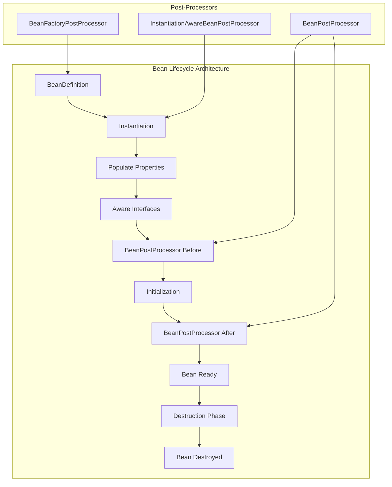

# Module 14.3: Spring Bean Lifecycle

## 1. Introduction

The Spring Bean Lifecycle defines the complete sequence of events that occur from the moment a bean is defined until it is destroyed. Understanding this lifecycle is crucial for implementing custom initialization logic, resource cleanup, and advanced framework features like AOP and caching.

This module covers all phases of the bean lifecycle, including callbacks, post-processors, and how to hook into various stages.

## 2. Learning Objectives

By the end of this module, you will be able to:

- Understand all phases of Spring bean lifecycle
- Implement initialization and destruction callbacks
- Use BeanPostProcessor and BeanFactoryPostProcessor
- Apply @PostConstruct and @PreDestroy annotations
- Understand proxy creation during bean lifecycle
- Implement custom lifecycle hooks
- Debug lifecycle-related issues

## 3. Prerequisites

- Module 14.1: Spring Fundamentals
- Module 14.2: Spring Dependency Injection
- Java annotations and reflection
- Understanding of proxy patterns

## 4. Why This Concept Exists

### The Problem Without Lifecycle Management

```java
public class DatabaseConnection {
    private Connection connection;
    
    public DatabaseConnection() {
        // When should we create the connection?
        // What if configuration isn't loaded yet?
    }
    
    public void close() {
        // Who calls this? When?
        // What if someone forgets?
    }
}
```

**Issues:**
1. Resource initialization timing uncertain
2. Cleanup may be missed (resource leaks)
3. No standardized way to hook into object creation
4. Configuration dependencies not resolved

### The Lifecycle Solution

Spring provides a well-defined lifecycle with hooks for:
- **Pre-initialization**: Before bean creation
- **Initialization**: After dependencies injected
- **Post-initialization**: After bean fully ready
- **Destruction**: When container shuts down

## 5. Problem Statement

Consider a service that needs:

```java
public class ReportingService {
    private ReportGenerator generator;
    private ConnectionPool pool;
    private CacheManager cache;
    
    // Complex initialization needed:
    // 1. Validate all dependencies
    // 2. Establish database connection
    // 3. Load cache from database
    // 4. Register with monitoring system
    // 5. Schedule periodic tasks
    
    // Complex cleanup needed:
    // 1. Flush pending reports
    // 2. Close database connections
    // 3. Clear cache
    // 4. Unregister from monitoring
    // 5. Stop scheduled tasks
}
```

Without lifecycle management, this initialization and cleanup logic would be scattered and error-prone.

## 6. Theory

### Bean Lifecycle Phases

1. **Instantiation**: Object created via constructor
2. **Populate Properties**: Dependencies injected
3. **BeanNameAware**: Bean knows its name
4. **BeanFactoryAware**: Bean knows its factory
5. **ApplicationContextAware**: Bean knows its context
6. **BeanPostProcessor.postProcessBeforeInitialization**: Pre-initialization
7. **@PostConstruct**: Custom initialization
8. **InitializingBean.afterPropertiesSet**: Framework initialization
9. **Custom init-method**: XML/Java config initialization
10. **BeanPostProcessor.postProcessAfterInitialization**: Post-initialization
11. **Bean Ready**: Bean in use
12. **@PreDestroy**: Custom destruction
13. **DisposableBean.destroy**: Framework destruction
14. **Custom destroy-method**: XML/Java config destruction

### Post-Processors

**BeanPostProcessor**: Processes beans after instantiation, before/after initialization
**BeanFactoryPostProcessor**: Processes bean definitions before instantiation

## 7. Internal Working

### Lifecycle Execution Flow

```
1. Container receives bean definition
   ↓
2. Instantiate bean (constructor)
   ↓
3. Inject dependencies (DI)
   ↓
4. Aware interfaces callbacks
   ↓
5. BeanPostProcessor.postProcessBeforeInitialization()
   ↓
6. @PostConstruct or afterPropertiesSet()
   ↓
7. Custom init-method()
   ↓
8. BeanPostProcessor.postProcessAfterInitialization()
   ↓
9. Bean in use (singleton cache)
   ↓
10. Container shutdown
   ↓
11. @PreDestroy or destroy()
   ↓
12. Custom destroy-method()
   ↓
13. Bean garbage collected
```

### Proxy Creation

AOP proxies are created during post-processing:
```
Bean instantiation → Dependencies → BeanPostProcessor → [Proxy Created] → Ready
```

## 8. JVM Perspective

### Memory During Lifecycle

```
Stack (during init):
┌─────────────────────────────────────┐
│ Constructor call                    │
│ Dependency injection               │
│ @PostConstruct method              │
│ afterPropertiesSet()              │
│ init-method()                     │
└─────────────────────────────────────┘

Heap (after init):
┌─────────────────────────────────────┐
│ Bean instance (possibly proxied)   │
│   ├── Internal state              │
│   └── References to dependencies  │
└─────────────────────────────────────┘
```

## 9. Memory Representation

```
Lifecycle State Tracking:
┌─────────────────────────────────────┐
│ BeanState enum                      │
│   CREATED → INITIALIZING → READY   │
│   → DESTROYING → DESTROYED         │
└─────────────────────────────────────┘
```

## 10. Architecture Diagram



## 11. Flow Diagram

```mermaid
flowchart TD
    A[BeanDefinition Loaded] --> B[BeanFactoryPostProcessor]
    B --> C[Modify Bean Definitions]
    C --> D[Instantiate Bean]
    D --> E[Populate Properties]
    E --> F[BeanNameAware]
    F --> G[BeanFactoryAware]
    G --> H[ApplicationContextAware]
    H --> I[BeanPostProcessor Before]
    I --> J{Init Method?}
    J -->|@PostConstruct| K[Execute @PostConstruct]
    J -->|afterPropertiesSet| L[Execute afterPropertiesSet]
    J -->|custom init| M[Execute init-method]
    K --> N[BeanPostProcessor After]
    L --> N
    M --> N
    N --> O[Bean Ready]
    O --> P[Container Shutdown]
    P --> Q{Destroy Method?}
    Q -->|@PreDestroy| R[Execute @PreDestroy]
    Q -->|destroy| S[Execute destroy()]
    Q -->|custom destroy| T[Execute destroy-method]
    R --> U[Bean Destroyed]
    S --> U
    T --> U
    
    style A fill:#e1f5fe
    style O fill:#c8e6c9
    style U fill:#ffcdd2
```

## 12. Syntax

### Lifecycle Callbacks

```java
@Component
public class LifecycleBean implements InitializingBean, DisposableBean,
        BeanNameAware, BeanFactoryAware, ApplicationContextAware {
    
    private String beanName;
    private BeanFactory beanFactory;
    private ApplicationContext applicationContext;
    
    // Aware interfaces
    @Override
    public void setBeanName(String name) {
        this.beanName = name;
        System.out.println("BeanNameAware: " + name);
    }
    
    @Override
    public void setBeanFactory(BeanFactory factory) {
        this.beanFactory = factory;
        System.out.println("BeanFactoryAware");
    }
    
    @Override
    public void setApplicationContext(ApplicationContext ctx) {
        this.applicationContext = ctx;
        System.out.println("ApplicationContextAware");
    }
    
    // Initialization
    @Override
    public void afterPropertiesSet() {
        System.out.println("InitializingBean.afterPropertiesSet");
    }
    
    @PostConstruct
    public void postConstruct() {
        System.out.println("@PostConstruct");
    }
    
    public void customInit() {
        System.out.println("Custom init-method");
    }
    
    // Destruction
    @Override
    public void destroy() {
        System.out.println("DisposableBean.destroy");
    }
    
    @PreDestroy
    public void preDestroy() {
        System.out.println("@PreDestroy");
    }
    
    public void customDestroy() {
        System.out.println("Custom destroy-method");
    }
}
```

### Configuration

```java
@Configuration
public class LifecycleConfig {
    
    @Bean(initMethod = "customInit", destroyMethod = "customDestroy")
    public LifecycleBean lifecycleBean() {
        return new LifecycleBean();
    }
}
```

### BeanPostProcessor

```java
@Component
public class CustomBeanPostProcessor implements BeanPostProcessor {
    
    @Override
    public Object postProcessBeforeInitialization(Object bean, String beanName) {
        System.out.println("Before init: " + beanName);
        return bean;
    }
    
    @Override
    public Object postProcessAfterInitialization(Object bean, String beanName) {
        System.out.println("After init: " + beanName);
        return bean;
    }
}
```

### BeanFactoryPostProcessor

```java
@Component
public class CustomBeanFactoryPostProcessor implements BeanFactoryPostProcessor {
    
    @Override
    public void postProcessBeanFactory(ConfigurableListableBeanFactory beanFactory) {
        // Modify bean definitions before instantiation
        BeanDefinition bd = beanFactory.getBeanDefinition("myBean");
        bd.setScope("prototype");
    }
}
```

## 13. Easy Example

### Basic Lifecycle Demonstration

```java
import org.springframework.context.annotation.*;
import org.springframework.stereotype.Component;
import jakarta.annotation.PostConstruct;
import jakarta.annotation.PreDestroy;

@Component
public class SimpleBean {
    
    public SimpleBean() {
        System.out.println("1. Constructor called");
    }
    
    @PostConstruct
    public void init() {
        System.out.println("2. @PostConstruct called");
    }
    
    @PreDestroy
    public void cleanup() {
        System.out.println("3. @PreDestroy called");
    }
}

@Configuration
@ComponentScan
public class AppConfig {
}

public class LifecycleDemo {
    public static void main(String[] args) {
        AnnotationConfigApplicationContext context = 
            new AnnotationConfigApplicationContext(AppConfig.class);
        
        System.out.println("Bean is ready");
        
        context.close();
    }
}
```

Output:
```
1. Constructor called
2. @PostConstruct called
Bean is ready
3. @PreDestroy called
```

## 14. Medium Example

### Full Lifecycle with Aware Interfaces

```java
import org.springframework.context.annotation.*;
import org.springframework.stereotype.Component;
import org.springframework.beans.factory.*;
import org.springframework.context.ApplicationContext;
import jakarta.annotation.PostConstruct;
import jakarta.annotation.PreDestroy;

@Component
public class FullLifecycleBean implements 
        BeanNameAware, BeanFactoryAware, ApplicationContextAware,
        InitializingBean, DisposableBean {
    
    private String beanName;
    private BeanFactory beanFactory;
    private ApplicationContext applicationContext;
    
    public FullLifecycleBean() {
        System.out.println("1. Constructor");
    }
    
    @Override
    public void setBeanName(String name) {
        this.beanName = name;
        System.out.println("2. BeanNameAware: " + name);
    }
    
    @Override
    public void setBeanFactory(BeanFactory factory) {
        this.beanFactory = factory;
        System.out.println("3. BeanFactoryAware");
    }
    
    @Override
    public void setApplicationContext(ApplicationContext ctx) {
        this.applicationContext = ctx;
        System.out.println("4. ApplicationContextAware");
    }
    
    @Override
    public void afterPropertiesSet() {
        System.out.println("5. InitializingBean.afterPropertiesSet");
    }
    
    @PostConstruct
    public void postConstruct() {
        System.out.println("6. @PostConstruct");
    }
    
    public void customInit() {
        System.out.println("7. Custom init-method");
    }
    
    @Override
    public void destroy() {
        System.out.println("8. DisposableBean.destroy");
    }
    
    @PreDestroy
    public void preDestroy() {
        System.out.println("9. @PreDestroy");
    }
    
    public void customDestroy() {
        System.out.println("10. Custom destroy-method");
    }
}

@Configuration
@ComponentScan
public class AppConfig {
    
    @Bean(initMethod = "customInit", destroyMethod = "customDestroy")
    public FullLifecycleBean fullLifecycleBean() {
        return new FullLifecycleBean();
    }
}

public class FullLifecycleDemo {
    public static void main(String[] args) {
        AnnotationConfigApplicationContext context = 
            new AnnotationConfigApplicationContext(AppConfig.class);
        
        System.out.println("\n--- Bean is in use ---\n");
        
        context.close();
    }
}
```

## 15. Hard Example

### Custom BeanPostProcessor for Monitoring

```java
import org.springframework.beans.BeansException;
import org.springframework.beans.factory.config.BeanPostProcessor;
import org.springframework.context.annotation.*;
import org.springframework.stereotype.Component;
import jakarta.annotation.PostConstruct;
import java.util.*;
import java.util.concurrent.ConcurrentHashMap;

@Component
public class BeanMonitorPostProcessor implements BeanPostProcessor {
    
    private final Map<String, Long> initTimes = new ConcurrentHashMap<>();
    private final List<String> beanCreationOrder = Collections.synchronizedList(new ArrayList<>());
    
    @Override
    public Object postProcessBeforeInitialization(Object bean, String beanName) {
        long start = System.nanoTime();
        beanCreationOrder.add(beanName);
        return bean;
    }
    
    @Override
    public Object postProcessAfterInitialization(Object bean, String beanName) {
        long duration = System.nanoTime();
        initTimes.put(beanName, duration);
        System.out.printf("Bean '%s' initialized in %.2f ms%n", 
            beanName, duration / 1_000_000.0);
        return bean;
    }
    
    public void printReport() {
        System.out.println("\n=== Bean Initialization Report ===");
        System.out.println("Total beans: " + beanCreationOrder.size());
        initTimes.forEach((name, time) -> 
            System.out.printf("  %s: %.2f ms%n", name, time / 1_000_000.0));
    }
}

@Component
public class ServiceA {
    @PostConstruct
    public void init() throws InterruptedException {
        Thread.sleep(100); // Simulate work
        System.out.println("ServiceA initialized");
    }
}

@Component
public class ServiceB {
    private final ServiceA serviceA;
    
    public ServiceB(ServiceA serviceA) {
        this.serviceA = serviceA;
    }
    
    @PostConstruct
    public void init() {
        System.out.println("ServiceB initialized");
    }
}

@Configuration
@ComponentScan
public class MonitoringConfig {
}

public class MonitoringDemo {
    public static void main(String[] args) {
        AnnotationConfigApplicationContext context = 
            new AnnotationConfigApplicationContext(MonitoringConfig.class);
        
        BeanMonitorPostProcessor monitor = context.getBean(BeanMonitorPostProcessor.class);
        monitor.printReport();
        
        context.close();
    }
}
```

## 16. Enterprise Example

### Enterprise Lifecycle Management

```java
import org.springframework.context.annotation.*;
import org.springframework.stereotype.Component;
import org.springframework.beans.factory.annotation.Autowired;
import org.springframework.beans.factory.annotation.Value;
import jakarta.annotation.PostConstruct;
import jakarta.annotation.PreDestroy;
import java.util.concurrent.*;

@Component
public class ConnectionPool implements AutoCloseable {
    
    @Value("${db.pool.size:10}")
    private int poolSize;
    
    private final ExecutorService executor = Executors.newFixedThreadPool(10);
    private final List<Connection> connections = new CopyOnWriteArrayList<>();
    private volatile boolean initialized = false;
    
    @PostConstruct
    public void init() {
        System.out.println("Initializing connection pool with size: " + poolSize);
        for (int i = 0; i < poolSize; i++) {
            connections.add(new Connection("conn-" + i));
        }
        initialized = true;
        System.out.println("Connection pool ready with " + connections.size() + " connections");
    }
    
    public Connection getConnection() {
        if (!initialized) {
            throw new IllegalStateException("Pool not initialized");
        }
        return connections.remove(0);
    }
    
    public void releaseConnection(Connection conn) {
        connections.add(conn);
    }
    
    @Override
    @PreDestroy
    public void close() {
        System.out.println("Shutting down connection pool...");
        executor.shutdown();
        connections.clear();
        System.out.println("Connection pool shut down");
    }
}

class Connection {
    private final String name;
    
    public Connection(String name) {
        this.name = name;
        System.out.println("  Created connection: " + name);
    }
    
    public String getName() { return name; }
}

@Component
public class HealthChecker {
    
    private final ConnectionPool pool;
    
    @Autowired
    public HealthChecker(ConnectionPool pool) {
        this.pool = pool;
    }
    
    @PostConstruct
    public void registerHealthCheck() {
        System.out.println("Health checker registered");
    }
    
    public boolean checkHealth() {
        return pool != null && pool.initialized;
    }
}

@Component
public class MetricsCollector {
    
    @PostConstruct
    public void startCollecting() {
        System.out.println("Metrics collection started");
    }
    
    @PreDestroy
    public void stopCollecting() {
        System.out.println("Metrics collection stopped");
    }
}

@Configuration
@ComponentScan
public class EnterpriseConfig {
}

public class EnterpriseLifecycleDemo {
    public static void main(String[] args) {
        AnnotationConfigApplicationContext context = 
            new AnnotationConfigApplicationContext(EnterpriseConfig.class);
        
        System.out.println("\n--- Application Running ---\n");
        
        HealthChecker checker = context.getBean(HealthChecker.class);
        System.out.println("Health status: " + checker.checkHealth());
        
        context.close();
    }
}
```

## 17. Performance

### Lifecycle Impact

| Phase | Time Impact | Notes |
|-------|-------------|-------|
| Constructor | Minimal | Object creation |
| Dependency Injection | O(n) | n = dependencies |
| Aware interfaces | Minimal | Callback methods |
| BeanPostProcessor | O(b × p) | b = beans, p = processors |
| Initialization | Variable | Custom logic |
| Proxy creation | 10-100ms | AOP overhead |

### Optimization Tips

1. **Lazy initialization**: Delay bean creation
2. **Minimize post-processors**: Each adds overhead
3. **Profile initialization**: Measure slow beans
4. **Async initialization**: Use @Async for non-critical init

## 18. Time & Space Complexity

### Lifecycle Complexity

| Phase | Time | Space |
|-------|------|-------|
| Instantiation | O(1) | O(1) |
| Dependency Resolution | O(d) | O(d) |
| Aware callbacks | O(a) | O(1) |
| Post-processing | O(p × b) | O(1) |
| Initialization | O(i) | O(i) |
| Total | O(d + p×b + i) | O(d + i) |

Where:
- d = dependencies
- a = aware interfaces
- p = post-processors
- b = beans
- i = initialization logic

## 19. Thread Safety

### Thread Safety During Lifecycle

```java
@Component
public class ThreadSafeBean {
    
    private final Object lock = new Object();
    private volatile boolean initialized = false;
    
    @PostConstruct
    public void init() {
        synchronized (lock) {
            // Thread-safe initialization
            initialized = true;
        }
    }
    
    public void doWork() {
        if (!initialized) {
            throw new IllegalStateException("Not initialized");
        }
        // Thread-safe operations
    }
}
```

### Thread Safety Rules

1. **Singleton beans**: Lifecycle callbacks are single-threaded
2. **Prototype beans**: No lifecycle management by container
3. **Async initialization**: Use proper synchronization
4. **Lazy beans**: May initialize on any thread

## 20. Best Practices

1. **Use @PostConstruct for initialization**: Clean, standard approach
2. **Use @PreDestroy for cleanup**: Ensures cleanup happens
3. **Keep initialization fast**: Don't block container startup
4. **Handle exceptions in init**: Fail fast if critical
5. **Use InitializingBean cautiously**: Spring-specific
6. **Avoid custom init/destroy methods**: Less portable
7. **Document lifecycle requirements**: Make dependencies clear
8. **Test lifecycle behavior**: Verify init/cleanup
9. **Use context.registerShutdownHook()**: Ensure cleanup
10. **Profile slow initialization**: Identify bottlenecks

## 21. Common Mistakes

### Mistake 1: Missing Cleanup
```java
@Component
public class ResourceHolder {
    private Connection conn;
    
    @PostConstruct
    public void init() {
        conn = dataSource.getConnection(); // Acquired
    }
    // Missing @PreDestroy - connection leaked!
}
```
**Solution**: Always implement cleanup in @PreDestroy

### Mistake 2: Throwing Exceptions in Init
```java
@PostConstruct
public void init() {
    throw new RuntimeException("Init failed"); // Container fails to start
}
```
**Solution**: Handle exceptions gracefully or use @Lazy

### Mistake 3: Circular Dependencies in Init
```java
@Component
public class ServiceA {
    @Autowired private ServiceB b;
    
    @PostConstruct
    public void init() {
        b.doSomething(); // May fail if B not ready
    }
}
```
**Solution**: Use @EventListener for inter-bean communication

## 22. Pitfalls

### Pitfall 1: Proxy vs Target
```java
@Component
public class ProxiedBean {
    @PostConstruct
    public void init() {
        // Called on actual bean, not proxy
    }
}
```

### Pitfall 2: Prototype Lifecycle
```java
@Component
@Scope("prototype")
public class PrototypeBean {
    @PreDestroy
    public void cleanup() {
        // NOT called by container!
    }
}
```

### Pitfall 3: Order of Post-Processors
Multiple BeanPostProcessors execute in undefined order unless @Order is specified.

## 23. Debugging Tips

```java
// 1. Enable lifecycle logging
-Dlogging.level.org.springframework.context=DEBUG

// 2. Custom post-processor for debugging
@Component
public class DebugPostProcessor implements BeanPostProcessor {
    @Override
    public Object postProcessBeforeInitialization(Object bean, String name) {
        System.out.println("INIT BEFORE: " + name);
        return bean;
    }
}

// 3. Check bean definition
BeanDefinition bd = ctx.getBeanDefinition("myBean");
System.out.println(bd.getInitMethodName());
System.out.println(bd.getDestroyMethodName());

// 4. Count beans
System.out.println("Bean count: " + ctx.getBeanDefinitionCount());

// 5. List all beans
Arrays.stream(ctx.getBeanDefinitionNames()).sorted().forEach(System.out::println);
```

## 24. Comparison Table

| Callback | Interface | Annotation | When |
|----------|-----------|------------|------|
| **Init** | InitializingBean | @PostConstruct | After DI |
| **Destroy** | DisposableBean | @PreDestroy | Shutdown |
| **BeanName** | BeanNameAware | - | After constructor |
| **BeanFactory** | BeanFactoryAware | - | After constructor |
| **ApplicationContext** | ApplicationContextAware | - | After constructor |

## 25. Decision Tree

```
Which lifecycle callback should you use?
│
├── Initialization?
│   ├── Custom logic? → @PostConstruct
│   ├── Framework integration? → InitializingBean
│   └── XML/Java config? → init-method
│
├── Destruction?
│   ├── Custom cleanup? → @PreDestroy
│   ├── Framework cleanup? → DisposableBean
│   └── XML/Java config? → destroy-method
│
├── Need bean metadata?
│   └── Use Aware interfaces
│
└── Modify bean definitions?
    └── Use BeanFactoryPostProcessor
```

## 26. Interview Questions (15+)

1. **What is the Spring Bean Lifecycle?**
   The complete sequence from bean creation to destruction, including instantiation, initialization, and destruction phases.

2. **What is @PostConstruct?**
   A JSR-250 annotation that marks a method to be called after dependency injection is complete.

3. **What is @PreDestroy?**
   A JSR-250 annotation that marks a method to be called before bean destruction.

4. **What is the difference between @PostConstruct and InitializingBean?**
   @PostConstruct is standard (JSR-250); InitializingBean is Spring-specific. Both do the same thing.

5. **What is BeanPostProcessor?**
   An interface that allows custom modification of beans after instantiation, before/after initialization.

6. **What is BeanFactoryPostProcessor?**
   An interface that allows modification of bean definitions before beans are instantiated.

7. **When are Aware interfaces called?**
   After instantiation, before initialization, providing beans with framework references.

8. **What is the order of lifecycle events?**
   Constructor → DI → Aware → BeanPostProcessor Before → @PostConstruct → InitializingBean → init-method → BeanPostProcessor After → Ready → @PreDestroy → DisposableBean → destroy-method

9. **Can @PostConstruct throw exceptions?**
   Yes, but it prevents the bean from being created and may crash the application.

10. **What happens if @PreDestroy throws an exception?**
    Other beans' destroy methods may not be called. Container continues shutdown.

11. **How do you ensure all beans are destroyed?**
    Use `context.registerShutdownHook()` or call `context.close()` in finally block.

12. **What is the difference between init-method and @PostConstruct?**
    @PostConstruct is annotation-based; init-method is configuration-based. @PostConstruct is preferred.

13. **Can you have multiple init methods?**
    Yes, but execution order is not guaranteed unless explicitly controlled.

14. **What is @DependsOn?**
    An annotation that specifies beans that must be created before the annotated bean.

15. **How do prototype beans handle lifecycle?**
    Container creates them but doesn't manage destruction. @PreDestroy is not called.

16. **What is SmartInitializingSingleton?**
    An interface for beans that need to perform logic after all singletons are initialized.

## 27. Exercises

### Level 1 (Beginner)

**Exercise 1**: Create a bean with @PostConstruct that logs initialization.

**Exercise 2**: Create a bean implementing DisposableBean that cleans up resources.

**Exercise 3**: Create two beans where one depends on the other and verify initialization order.

### Level 2 (Intermediate)

**Exercise 1**: Create a BeanPostProcessor that measures bean initialization time.

**Exercise 2**: Create a BeanFactoryPostProcessor that changes bean scope from singleton to prototype.

**Exercise 3**: Create a bean with multiple initialization methods and determine execution order.

### Level 3 (Advanced)

**Exercise 1**: Create a custom @Timed annotation that measures method execution via BeanPostProcessor.

**Exercise 2**: Create a lazy initialization BeanPostProcessor that defers bean creation until first use.

**Exercise 3**: Create a health check system that monitors bean initialization failures.

## 28. Summary

Spring Bean Lifecycle provides a well-defined sequence for bean management:

- **Initialization**: @PostConstruct, InitializingBean, init-method
- **Destruction**: @PreDestroy, DisposableBean, destroy-method
- **Aware interfaces**: Provide framework references
- **Post-processors**: Customize bean creation
- **BeanFactoryPostProcessor**: Modify bean definitions

Key takeaways:
- Use @PostConstruct and @PreDestroy for standard lifecycle
- BeanPostProcessor is powerful for cross-cutting concerns
- Understand lifecycle for debugging and framework features
- Ensure proper cleanup to prevent resource leaks

## 29. References

- [Spring Bean Lifecycle](https://docs.spring.io/spring-framework/reference/core.html#beans-factory-lifecycle)
- [BeanPostProcessor](https://docs.spring.io/spring-framework/reference/core.html#beans-factory-extension-bpp)
- [BeanFactoryPostProcessor](https://docs.spring.io/spring-framework/reference/core.html#beans-factory-extension-factory-postprocessors)
- *Spring in Action* by Craig Walls - Chapter 3
- *Professional Spring Development* by Joseph Ottinger
