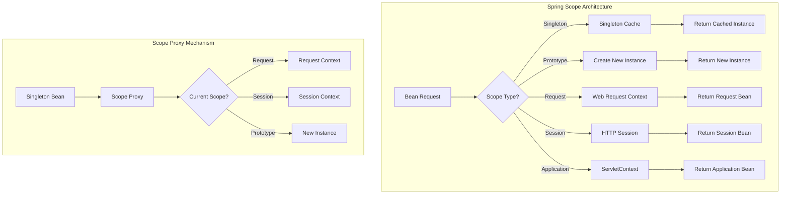
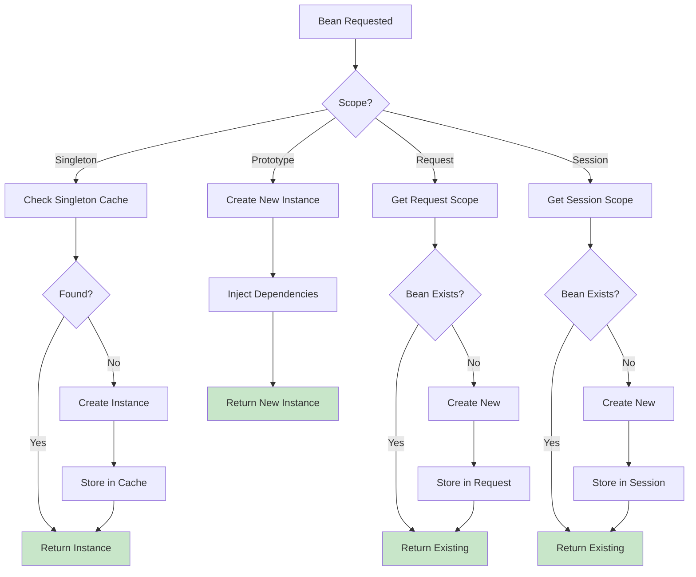

# Module 14.4: Spring Bean Scopes

## 1. Introduction

Spring Bean Scopes define how long a bean lives, how many instances are created, and how they are shared across the application. Understanding scopes is essential for managing state, memory, and concurrency in Spring applications.

This module covers all Spring scopes: singleton, prototype, request, session, application, and websocket, with practical examples and best practices.

## 2. Learning Objectives

By the end of this module, you will be able:

- Understand all Spring bean scopes
- Choose the appropriate scope for different use cases
- Implement custom scopes
- Handle scope-related issues (memory leaks, thread safety)
- Use scope proxies for injecting short-lived beans into singletons
- Understand scope inheritance in web applications

## 3. Prerequisites

- Module 14.1: Spring Fundamentals
- Module 14.2: Spring Dependency Injection
- Module 14.3: Spring Bean Lifecycle
- Understanding of web application concepts
- HTTP session management basics

## 4. Why This Concept Exists

### The Problem Without Proper Scoping

```java
@Service
public class UserService {
    private final List<User> cache = new ArrayList<>(); // Grows forever!
    
    public void processRequest(User user) {
        cache.add(user); // Never cleaned up
    }
}
```

**Issues:**
1. **Memory leaks**: Objects never garbage collected
2. **Thread safety**: Shared mutable state in singletons
3. **Stale data**: Cached data becomes outdated
4. **Resource waste**: Creating too many instances

### The Scope Solution

Scopes provide control over bean lifecycle and sharing:
- **Singleton**: One instance per container (shared)
- **Prototype**: New instance every time (no sharing)
- **Request**: One per HTTP request (web only)
- **Session**: One per HTTP session (web only)
- **Application**: One per ServletContext (web only)

## 5. Problem Statement

Consider a web application with different needs:

```java
// This singleton has problems
@Service
public class ShoppingCartService {
    private final Map<String, Cart> carts = new HashMap<>(); // Manual session management!
    
    public void addItem(String sessionId, Item item) {
        Cart cart = carts.computeIfAbsent(sessionId, k -> new Cart());
        cart.addItem(item);
    }
}
```

**Problems:**
1. Manual session management (error-prone)
2. Memory grows with users (never cleaned)
3. Thread safety issues with shared map
4. No automatic cleanup on session expiry

## 6. Theory

### Available Scopes

| Scope | Description | Sharing | Lifecycle |
|-------|-------------|---------|-----------|
| **singleton** | Default. One instance per container | Shared across all injections | Container lifecycle |
| **prototype** | New instance each time requested | Not shared | Not managed by container |
| **request** | One per HTTP request | Shared within request | Request lifecycle |
| **session** | One per HTTP session | Shared within session | Session lifecycle |
| **application** | One per ServletContext | Shared across all requests | Application lifecycle |
| **websocket** | One per WebSocket session | Shared within WebSocket | WebSocket lifecycle |

### Scope Proxy

When injecting short-lived beans (request, session) into singletons, Spring creates a proxy:
- Proxy intercepts calls
- Delegates to actual bean in current scope
- Handles scope resolution at runtime

### Scope Inheritance

In web MVC, child scopes can access parent scope beans:
```
Application → Session → Request
```

## 7. Internal Working

### Scope Resolution Process

```
1. Bean requested via getBean()
   ↓
2. Check scope type
   ↓
3. Singleton? → Return from singleton cache
4. Prototype? → Create new instance
5. Web scope? → Look up in web context
   ↓
6. Return bean instance
```

### Scope Proxy Creation

```
1. Singleton bean depends on request-scoped bean
   ↓
2. Spring creates CGLIB proxy
   ↓
3. Proxy implements same interface
   ↓
4. Proxy delegates to actual request-scoped bean
   ↓
5. Actual bean resolved at method invocation time
```

## 8. JVM Perspective

### Memory Management by Scope

```
Singleton Cache (Heap):
┌─────────────────────────────────────┐
│ ConcurrentHashMap                  │
│   ├── "userService" → @UserService │
│   └── "repoService" → @RepoService │
└─────────────────────────────────────┘

Prototype (New instance each time):
┌─────────────────────────────────────┐
│ Each request creates new object    │
│ Must be manually managed          │
└─────────────────────────────────────┘

Request Scope (ThreadLocal):
┌─────────────────────────────────────┐
│ Thread → Request Context           │
│   └── "cartService" → @Cart        │
└─────────────────────────────────────┘

Session Scope (HttpSession):
┌─────────────────────────────────────┐
│ Session ID → Session Context       │
│   └── "userProfile" → @Profile     │
└─────────────────────────────────────┘
```

## 9. Memory Representation

```
Memory Usage by Scope:

Singleton: O(1) - one instance
Prototype: O(n) - n instances created
Request: O(r) - r concurrent requests
Session: O(s) - s active sessions
Application: O(1) - one instance
```

## 10. Architecture Diagram



## 11. Flow Diagram



## 12. Syntax

### Defining Scopes

```java
// Singleton (default)
@Component
@Scope("singleton")
public class SingletonBean {
}

// Prototype
@Component
@Scope("prototype")
public class PrototypeBean {
}

// Request (web only)
@Component
@RequestScope
public class RequestBean {
}

// Session (web only)
@Component
@SessionScope
public class SessionBean {
}

// Application (web only)
@Component
@ApplicationScope
public class ApplicationBean {
}

// Using scope proxy
@Component
@Scope(value = "request", proxyMode = ScopedProxyMode.TARGET_CLASS)
public class RequestBeanProxy {
}
```

### Configuration-based

```java
@Configuration
public class ScopeConfig {
    
    @Bean
    @Scope("prototype")
    public PrototypeBean prototypeBean() {
        return new PrototypeBean();
    }
    
    @Bean
    @Scope(value = "request", proxyMode = ScopedProxyMode.TARGET_CLASS)
    public RequestBean requestBean() {
        return new RequestBean();
    }
}
```

### XML Configuration

```xml
<bean id="prototypeBean" class="com.example.PrototypeBean" scope="prototype"/>
<bean id="requestBean" class="com.example.RequestBean" scope="request"/>
```

## 13. Easy Example

### Singleton vs Prototype

```java
import org.springframework.context.annotation.*;
import org.springframework.stereotype.Component;

@Component
@Scope("singleton")
public class SingletonCounter {
    private int count = 0;
    
    public int increment() {
        return ++count;
    }
}

@Component
@Scope("prototype")
public class PrototypeCounter {
    private int count = 0;
    
    public int increment() {
        return ++count;
    }
}

@Configuration
@ComponentScan
public class ScopeConfig {
}

public class ScopeDemo {
    public static void main(String[] args) {
        AnnotationConfigApplicationContext context = 
            new AnnotationConfigApplicationContext(ScopeConfig.class);
        
        // Singleton - same instance
        SingletonCounter s1 = context.getBean(SingletonCounter.class);
        SingletonCounter s2 = context.getBean(SingletonCounter.class);
        System.out.println("Singleton same instance: " + (s1 == s2));
        System.out.println("Singleton count: " + s1.increment());
        System.out.println("Singleton count: " + s2.increment());
        
        // Prototype - different instances
        PrototypeCounter p1 = context.getBean(PrototypeCounter.class);
        PrototypeCounter p2 = context.getBean(PrototypeCounter.class);
        System.out.println("Prototype same instance: " + (p1 == p2));
        System.out.println("Prototype count p1: " + p1.increment());
        System.out.println("Prototype count p2: " + p2.increment());
        
        context.close();
    }
}
```

Output:
```
Singleton same instance: true
Singleton count: 1
Singleton count: 2
Prototype same instance: false
Prototype count p1: 1
Prototype count p2: 1
```

## 14. Medium Example

### Session Scope with Proxy

```java
import org.springframework.context.annotation.*;
import org.springframework.stereotype.Component;
import org.springframework.web.context.WebApplicationContext;
import org.springframework.web.context.annotation.SessionScope;

import java.util.ArrayList;
import java.util.List;

// Session-scoped bean
@Component
@SessionScope
public class ShoppingCart {
    private final List<String> items = new ArrayList<>();
    
    public void addItem(String item) {
        items.add(item);
    }
    
    public List<String> getItems() {
        return new ArrayList<>(items);
    }
    
    public double getTotal() {
        return items.size() * 9.99; // Simplified
    }
    
    public void clear() {
        items.clear();
    }
}

// Singleton using session-scoped bean via proxy
@Component
public class OrderService {
    private final ShoppingCart cart;
    
    @Autowired
    public OrderService(ShoppingCart cart) {
        this.cart = cart;
    }
    
    public void addToCart(String item) {
        cart.addItem(item);
        System.out.println("Added: " + item + 
                          ", Total items: " + cart.getItems().size());
    }
    
    public void checkout() {
        System.out.println("Checking out with " + cart.getItems().size() + " items");
        System.out.println("Total: $" + cart.getTotal());
        cart.clear();
    }
}

@Configuration
@ComponentScan
public class WebScopeConfig {
}

public class WebScopeDemo {
    public static void main(String[] args) {
        AnnotationConfigApplicationContext context = 
            new AnnotationConfigApplicationContext(WebScopeConfig.class);
        
        // Note: Request/Session scopes work in web context
        // This demo shows the concept
        
        OrderService orderService = context.getBean(OrderService.class);
        
        // Simulate adding items (would be per-session in web app)
        orderService.addToCart("Laptop");
        orderService.addToCart("Mouse");
        
        orderService.checkout();
        
        context.close();
    }
}
```

## 15. Hard Example

### Custom Scope Implementation

```java
import org.springframework.beans.factory.ObjectFactory;
import org.springframework.beans.factory.config.Scope;
import org.springframework.context.annotation.*;
import org.springframework.stereotype.Component;

import java.util.Map;
import java.util.concurrent.ConcurrentHashMap;

// Custom scope: Thread Scope
public class ThreadScope implements Scope {
    
    private final ThreadLocal<Map<String, Object>> threadScope = 
        ThreadLocal.withInitial(ConcurrentHashMap::new);
    
    @Override
    public Object get(String name, ObjectFactory<?> objectFactory) {
        Map<String, Object> scope = threadScope.get();
        return scope.computeIfAbsent(name, k -> objectFactory.getObject());
    }
    
    @Override
    public Object remove(String name) {
        return threadScope.get().remove(name);
    }
    
    @Override
    public void registerDestructionCallback(String name, Runnable callback) {
        // Register cleanup callback
    }
    
    @Override
    public Object resolveContextualObject(String key) {
        return null;
    }
    
    @Override
    public String getConversationId() {
        return String.valueOf(Thread.currentThread().getId());
    }
}

// Register custom scope
@Configuration
public class CustomScopeConfig {
    
    @Bean
    public CustomScopeConfigurer customScopeConfigurer() {
        CustomScopeConfigurer configurer = new CustomScopeConfigurer();
        configurer.addScope("thread", new ThreadScope());
        return configurer;
    }
}

// Bean using custom scope
@Component
@Scope("thread")
public class ThreadLocalService {
    private int counter = 0;
    
    public int increment() {
        return ++counter;
    }
    
    public String getThreadInfo() {
        return Thread.currentThread().getName() + ": " + counter;
    }
}

// Multi-threaded test
@Component
public class MultiThreadTest {
    
    @Autowired
    private ThreadLocalService service;
    
    public void runInThread(String threadName) {
        System.out.println(threadName + " - " + service.getThreadInfo());
        service.increment();
        System.out.println(threadName + " after inc - " + service.getThreadInfo());
    }
}

public class CustomScopeDemo {
    public static void main(String[] args) throws InterruptedException {
        AnnotationConfigApplicationContext context = 
            new AnnotationConfigApplicationContext(CustomScopeConfig.class);
        
        MultiThreadTest test = context.getBean(MultiThreadTest.class);
        
        // Run in multiple threads
        Thread t1 = new Thread(() -> test.runInThread("Thread-1"));
        Thread t2 = new Thread(() -> test.runInThread("Thread-2"));
        
        t1.start();
        t2.start();
        
        t1.join();
        t2.join();
        
        context.close();
    }
}
```

## 16. Enterprise Example

### Enterprise Scope Patterns

```java
import org.springframework.context.annotation.*;
import org.springframework.stereotype.Component;
import org.springframework.web.context.WebApplicationContext;
import org.springframework.web.context.annotation.RequestScope;
import org.springframework.web.context.annotation.SessionScope;
import jakarta.servlet.http.HttpServletRequest;
import jakarta.servlet.http.HttpSession;
import java.util.List;

// Application-scoped: Shared across all requests
@Component
@ApplicationScope
public class ApplicationConfig {
    private final List<String> supportedLanguages = List.of("en", "es", "fr", "de");
    
    public List<String> getSupportedLanguages() {
        return supportedLanguages;
    }
    
    public String getDefaultLanguage() {
        return "en";
    }
}

// Session-scoped: Per user session
@Component
@SessionScope
public class UserPreferences {
    private String language = "en";
    private String theme = "light";
    private int itemsPerPage = 10;
    
    // getters and setters
    public String getLanguage() { return language; }
    public void setLanguage(String language) { this.language = language; }
    public String getTheme() { return theme; }
    public void setTheme(String theme) { this.theme = theme; }
    public int getItemsPerPage() { return itemsPerPage; }
    public void setItemsPerPage(int itemsPerPage) { this.itemsPerPage = itemsPerPage; }
}

// Request-scoped: Per HTTP request
@Component
@RequestScope
public class RequestContext {
    private final long startTime = System.currentTimeMillis();
    private String requestId;
    private String clientIp;
    
    public RequestContext() {
        this.requestId = java.util.UUID.randomUUID().toString();
    }
    
    public long getDuration() {
        return System.currentTimeMillis() - startTime;
    }
    
    // getters and setters
    public String getRequestId() { return requestId; }
    public void setClientIp(String clientIp) { this.clientIp = clientIp; }
    public String getClientIp() { return clientIp; }
}

// Singleton service using scoped beans
@Component
public class PageService {
    
    private final ApplicationConfig appConfig;
    private final UserPreferences userPrefs;
    private final RequestContext requestContext;
    
    @Autowired
    public PageService(ApplicationConfig appConfig,
                      UserPreferences userPrefs,
                      RequestContext requestContext) {
        this.appConfig = appConfig;
        this.userPrefs = userPrefs;
        this.requestContext = requestContext;
    }
    
    public PageData getPageData() {
        return new PageData(
            appConfig.getSupportedLanguages(),
            userPrefs.getLanguage(),
            userPrefs.getTheme(),
            userPrefs.getItemsPerPage(),
            requestContext.getRequestId(),
            requestContext.getDuration()
        );
    }
}

// Data transfer object
public record PageData(
    List<String> languages,
    String currentLanguage,
    String theme,
    int itemsPerPage,
    String requestId,
    long duration
) {}

@Configuration
@ComponentScan
public class EnterpriseScopeConfig {
}

public class EnterpriseScopeDemo {
    public static void main(String[] args) {
        AnnotationConfigApplicationContext context = 
            new AnnotationConfigApplicationContext(EnterpriseScopeConfig.class);
        
        PageService pageService = context.getBean(PageService.class);
        
        // Simulate request (in real app, this would be per-request)
        PageData data = pageService.getPageData();
        System.out.println("Page data: " + data);
        
        context.close();
    }
}
```

## 17. Performance

### Scope Performance Characteristics

| Scope | Memory | Creation | Cleanup | Use Case |
|-------|--------|----------|---------|----------|
| Singleton | O(1) | Once | On shutdown | Stateless services |
| Prototype | O(n) | Each time | Never | Stateful, short-lived |
| Request | O(r) | Each request | Each request | Request-specific data |
| Session | O(s) | Each session | Session expiry | User-specific data |
| Application | O(1) | Once | On shutdown | Global configuration |

### Performance Tips

1. **Singleton**: Default for most beans
2. **Prototype**: Use for mutable state
3. **Request/Session**: Use proxy for injection
4. **Lazy initialization**: Delay expensive beans

## 18. Time & Space Complexity

### Scope Complexity

| Scope | Get Time | Memory per Instance |
|-------|----------|---------------------|
| Singleton | O(1) | Fixed |
| Prototype | O(1) | Fixed |
| Request | O(1) | Request data |
| Session | O(1) | Session data |
| Application | O(1) | Fixed |

## 19. Thread Safety

### Thread Safety by Scope

| Scope | Thread Safe? | Notes |
|-------|--------------|-------|
| Singleton | No (by default) | Must implement synchronization |
| Prototype | Yes | Each thread gets own instance |
| Request | Yes | Thread-bound |
| Session | Yes | Thread-bound within session |
| Application | No | Shared across all threads |

### Thread Safety Implementation

```java
@Component
@Scope("singleton")
public class ThreadSafeSingleton {
    private final AtomicInteger counter = new AtomicInteger(0);
    private final ReadWriteLock lock = new ReentrantReadWriteLock();
    
    public int increment() {
        return counter.incrementAndGet(); // Thread-safe
    }
    
    public void processData(Data data) {
        lock.writeLock().lock();
        try {
            // Thread-safe processing
        } finally {
            lock.writeLock().unlock();
        }
    }
}
```

## 20. Best Practices

1. **Use singleton** for stateless services
2. **Use prototype** for stateful beans
3. **Use request/session** only in web apps
4. **Always use proxy** for scoped beans in singletons
5. **Avoid mutable state** in singletons
6. **Clean up resources** in prototype beans
7. **Profile memory usage** for session beans
8. **Consider lazy loading** for expensive beans
9. **Test scope behavior** in integration tests
10. **Document scope decisions** for team

## 21. Common Mistakes

### Mistake 1: Mutable State in Singleton
```java
@Component
public class BadSingleton {
    private List<String> items = new ArrayList<>(); // Shared, not thread-safe!
    
    public void addItem(String item) {
        items.add(item); // Race condition!
    }
}
```
**Solution**: Use prototype scope or thread-safe collections

### Mistake 2: Forgetting Proxy
```java
@Component
public class BadService {
    @Autowired
    private RequestBean requestBean; // NPE outside request!
}
```
**Solution**: Use @RequestScope or ScopedProxyMode

### Mistake 3: Prototype in Singleton
```java
@Component
@Scope("prototype")
public class PrototypeBean {
    @Autowired
    private SingletonBean singleton; // Injected once, shared!
}
```
**Solution**: Use @Lookup for prototype injection

## 22. Pitfalls

### Pitfall 1: Scope Inheritance
Session-scoped beans don't inherit request scope automatically.

### Pitfall 2: Proxy Issues
CGLIB proxies don't work with final classes or methods.

### Pitfall 3: Context Access
Prototype beans can't access their defining scope after creation.

## 23. Debugging Tips

```java
// 1. Check bean scope
BeanDefinition bd = ctx.getBeanDefinition("myBean");
System.out.println("Scope: " + bd.getScope());

// 2. Check if proxy
System.out.println("Is proxy: " + Proxy.isProxyClass(myBean.getClass()));

// 3. Check scope type
ConfigurableBeanFactory factory = ctx.getBeanFactory();
Scope scope = factory.getRegisteredScope("session");
System.out.println("Session scope: " + scope);

// 4. Monitor session beans
HttpSession session = request.getSession();
Map<String, Object> beans = (Map) session.getAttribute("scopedBeans");
beans.forEach((name, bean) -> System.out.println(name + ": " + bean));

// 5. Enable scope logging
-Dlogging.level.org.springframework.web.context=DEBUG
```

## 24. Comparison Table

| Feature | Singleton | Prototype | Request | Session |
|---------|-----------|-----------|---------|---------|
| **Instances** | 1 | N | Per request | Per session |
| **State** | Stateless | Stateful | Request data | User data |
| **Thread Safe** | Manual | Yes | Yes | Yes |
| **Memory** | Minimal | Grows | Per request | Per session |
| **Cleanup** | Container | Never | Automatic | Session end |
| **Proxy Needed** | No | No | Yes | Yes |
| **Use Case** | Services | Actions | Request data | User prefs |

## 25. Decision Tree

```
Which scope should you use?
│
├── Need to share state globally? → YES → Singleton
├── Need per-user state? → YES → Session
├── Need per-request data? → YES → Request
├── Need mutable state? → YES → Prototype
├── Web application? → Check web scopes
└── Standalone? → Singleton or Prototype
```

## 26. Interview Questions (15+)

1. **What are the Spring bean scopes?**
   Singleton, prototype, request, session, application, websocket.

2. **What is the default scope?**
   Singleton - one instance per container.

3. **What is the difference between singleton and prototype?**
   Singleton shares one instance; prototype creates new each time.

4. **When would you use prototype scope?**
   For mutable state, objects that shouldn't be shared, or short-lived beans.

5. **What is a scope proxy?**
   A CGLIB proxy that delegates to the actual bean in the current scope.

6. **Why are scope proxies needed?**
   To inject short-lived beans (request/session) into long-lived beans (singleton).

7. **What is request scope?**
   One bean instance per HTTP request, available only in web applications.

8. **What is session scope?**
   One bean instance per HTTP session, persists across requests.

9. **Can singleton beans be thread-safe?**
   Only if designed with thread safety (immutable, synchronized, atomic).

10. **What happens to prototype beans on container shutdown?**
    Nothing - container doesn't manage their lifecycle.

11. **How do you inject prototype into singleton?**
    Use @Lookup method or ObjectFactory/ObjectProvider.

12. **What is @RequestScope?**
    Shortcut for @Scope(value="request", proxyMode=TARGET_CLASS).

13. **Can you define custom scopes?**
    Yes, implement Scope interface and register with ScopeConfigurer.

14. **What is the difference between application and singleton?**
    Application is per ServletContext (web); singleton is per container.

15. **How do you clean up prototype beans?**
    Implement @PreDestroy (won't be called) or use shutdown hooks.

16. **What is scope inheritance?**
    Child scopes can access parent scope beans (Application→Session→Request).

## 27. Exercises

### Level 1 (Beginner)

**Exercise 1**: Create a singleton counter and verify it shares state.

**Exercise 2**: Create a prototype bean and verify each request gets new instance.

**Exercise 3**: Create session-scoped UserPreferences bean.

### Level 2 (Intermediate)

**Exercise 1**: Create a singleton service that injects request-scoped bean via proxy.

**Exercise 2**: Implement a custom "thread" scope.

**Exercise 3**: Create a shopping cart using session scope with proper cleanup.

### Level 3 (Advanced)

**Exercise 1**: Create a scope-aware cache that behaves differently per scope.

**Exercise 2**: Implement scope validation that fails fast for wrong usage.

**Exercise 3**: Create a monitoring system that tracks bean creation per scope.

## 28. Summary

Spring Bean Scopes provide control over bean lifecycle and sharing:

- **Singleton**: Default, shared, stateless
- **Prototype**: New instance each time, stateful
- **Request/Session**: Web-specific, auto-managed
- **Application**: Per ServletContext
- **Scope Proxy**: Enables injection of short-lived into long-lived

Key takeaways:
- Choose scope based on state requirements
- Use proxy for scoped beans in singletons
- Be aware of thread safety implications
- Clean up resources appropriately
- Profile memory for web scopes

## 29. References

- [Spring Bean Scopes](https://docs.spring.io/spring-framework/reference/core.html#beans-factory-scopes)
- [Scoped Beans](https://docs.spring.io/spring-framework/reference/core.html#beans-factory-scopes-other)
- [Web Scoped Beans](https://docs.spring.io/spring-framework/reference/web/webmvc/mvc.html#mvc-fn-scope)
- *Spring in Action* by Craig Walls - Chapter 3
- *Pro Spring 5* by Iuliana Cosmina
