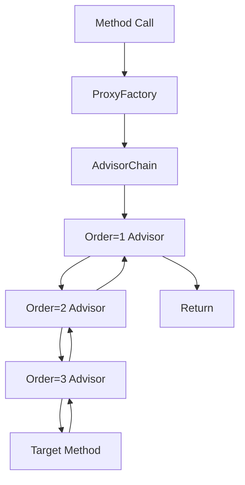
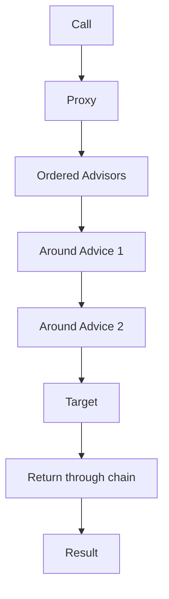

# Module 14.6: Spring AOP Advanced

## 1. Introduction

This module covers advanced AOP topics: weaving strategies, join point APIs, complex advice types, and real-world enterprise patterns.

## 2. Learning Objectives

- Understand compile-time vs load-time vs runtime weaving
- Use ProceedingJoinPoint for advanced control
- Implement complex @Around and @AfterThrowing patterns
- Create reusable aspects with custom annotations
- Handle AOP ordering and precedence

## 3. Prerequisites

- Module 14.5: Spring AOP fundamentals
- Understanding of proxies and bytecode

## 4. Why This Concept Exists

Basic AOP handles simple logging, but enterprise needs require advanced patterns: retry logic, circuit breakers, audit trails, and complex transaction management that go beyond simple before/after advice.

## 5. Problem Statement

Enterprise applications need: retry mechanisms, circuit breakers, audit trails, performance budgets, and conditional advice based on runtime state—patterns that require advanced AOP capabilities.

## 6. Theory

### Weaving Strategies

| Strategy | When | Performance | Scope |
|----------|------|-------------|-------|
| **Compile-time** | Build time | Fastest | Any class |
| **Load-time** | Class loading | Fast | Any class |
| **Runtime** | Proxy creation | Slower | Spring beans |

### Join Point API

```java
JoinPoint.getSignature()        // Method signature
JoinPoint.getArgs()             // Method arguments
JoinPoint.getTarget()           // Target object
JoinPoint.getThis()             // Proxy object
ProceedingJoinPoint.proceed()   // Invoke target
ProceedingJoinPoint.proceed(args) // Invoke with modified args
```

## 7. Internal Working

Advanced AOP uses the Advisor chain pattern. Multiple advisors are sorted by order and executed sequentially around the target method.

## 8. JVM Perspective

Load-time weaving uses a Java agent to transform bytecode at class load time. The agent modifies .class files before they enter the JVM.

## 9. Memory Representation

```
Advisor Chain: [SecurityAdvisor → TransactionAdvisor → LoggingAdvisor]
Each advisor wraps the next, forming a chain of responsibility.
```

## 10. Architecture Diagram



## 11. Flow Diagram



## 12. Syntax

```java
@Around("execution(* com.example.service.*.*(..))")
public Object around(ProceedingJoinPoint pjp) throws Throwable {
    Object[] args = pjp.getArgs();       // Get arguments
    Object target = pjp.getTarget();     // Get target object
    Signature sig = pjp.getSignature();  // Get method signature
    return pjp.proceed(args);            // Proceed with args
}

@AfterThrowing(pointcut = "execution(* com.example.service.*.*(..))",
               throwing = "ex")
public void afterThrow(JoinPoint jp, CustomException ex) {
    // Handle specific exception
}
```

## 13. Easy Example

```java
@Aspect
@Component
public class RetryAspect {
    @Around("@annotation(retryable)")
    public Object retry(ProceedingJoinPoint pjp, Retryable retryable) throws Throwable {
        int attempts = retryable.maxAttempts();
        for (int i = 1; i <= attempts; i++) {
            try { return pjp.proceed(); }
            catch (Exception e) {
                if (i == attempts) throw e;
                System.out.println("Retry " + i + " of " + attempts);
                Thread.sleep(1000);
            }
        }
        throw new IllegalStateException("Unreachable");
    }
}

@Target(ElementType.METHOD)
@Retention(RetentionPolicy.RUNTIME)
public @interface Retryable { int maxAttempts() default 3; }
```

## 14. Medium Example

```java
@Aspect
@Component
public class CircuitBreakerAspect {
    private final AtomicInteger failures = new AtomicInteger(0);
    private final AtomicBoolean open = new AtomicBoolean(false);

    @Around("@annotation(circuitProtected)")
    public Object checkCircuit(ProceedingJoinPoint pjp, CircuitProtected ann) throws Throwable {
        if (open.get()) throw new RuntimeException("Circuit open");
        try { Object r = pjp.proceed(); failures.set(0); return r; }
        catch (Exception e) {
            if (failures.incrementAndGet() >= ann.failureThreshold()) open.set(true);
            throw e;
        }
    }
}
```

## 15. Hard Example

```java
@Aspect
@Component
public class PerformanceBudgetAspect {
    @Around("execution(* com.example.service.*.*(..))")
    public Object enforceBudget(ProceedingJoinPoint pjp) throws Throwable {
        long start = System.nanoTime();
        Object result = pjp.proceed();
        long elapsed = (System.nanoTime() - start) / 1_000_000;
        if (elapsed > 1000) {
            System.out.println("SLOW: " + pjp.getSignature() + " took " + elapsed + "ms");
        }
        return result;
    }
}
```

## 16. Enterprise Example

```java
@Aspect
@Component
@Order(1)
public class SecurityAspect {
    @Around("@annotation(secured)")
    public Object secure(ProceedingJoinPoint pjp, Secured s) throws Throwable {
        // validate roles
        return pjp.proceed();
    }
}

@Aspect
@Component
@Order(2)
public class AuditAspect {
    @Around("@annotation(auditable)")
    public Object audit(ProceedingJoinPoint pjp, Auditable a) throws Throwable {
        // record audit
        return pjp.proceed();
    }
}
```

## 17. Performance

| Weaving Type | Build Time | Runtime Overhead |
|-------------|-----------|-----------------|
| Compile-time | High | Lowest |
| Load-time | Medium | Low |
| Runtime (Spring) | None | Higher |

## 18. Time & Space Complexity

Weaving overhead: O(m × a) where m = matched methods, a = aspects. Advisor lookup: O(a log a) for sorting.

## 19. Thread Safety

Aspects must be thread-safe. Use AtomicInteger, volatile, or synchronized for shared state.

## 20. Best Practices

1. Use @Order to control aspect execution order
2. Keep aspects stateless or thread-safe
3. Prefer compile-time weaving for performance
4. Use custom annotations for clarity
5. Test aspects independently

## 21. Common Mistakes

1. Not ordering aspects correctly
2. Throwing exceptions in @After advice
3. Not handling ProceedingJoinPoint properly
4. Creating stateful singleton aspects

## 22. Pitfalls

- Load-time weaving requires Java agent
- CGLIB cannot proxy final classes
- Aspect ordering with Spring transactions can be tricky

## 23. Debugging Tips

```java
@EnableAspectJAutoProxy(proxyTargetClass = true) // Force CGLIB
-Dspring.aop.proxyTargetClass=true
-Dlogging.level.org.springframework.aop=DEBUG
```

## 24. Comparison Table

| Feature | @Before | @Around |
|---------|---------|---------|
| Control | Limited | Full |
| Can modify args | No | Yes |
| Can suppress exception | No | Yes |
| Can retry | No | Yes |
| Performance | Better | More overhead |

## 25. Decision Tree

- Need to modify arguments? → @Around
- Need to handle exceptions? → @AfterThrowing or @Around
- Simple logging? → @Before/@After
- Need to control execution? → @Around

## 26. Interview Questions (15+)

1. What is the difference between compile-time and runtime weaving?
2. How does ProceedingJoinPoint differ from JoinPoint?
3. Can @Around advice modify method arguments?
4. How do you order multiple aspects?
5. What is load-time weaving and when would you use it?
6. How do you handle exceptions in AOP?
7. Can aspects be applied to prototype beans?
8. What is the Advisor pattern?
9. How does Spring decide between JDK and CGLIB proxies?
10. Can AOP work with @Async methods?
11. What is the performance impact of multiple aspects?
12. How do you test an aspect?
13. What is @EnableLoadTimeWeaving?
14. Can aspects advise private methods?
15. How do you create a global exception handler with AOP?

## 27. Exercises

**Level 1**: Create a circuit breaker aspect with configurable failure threshold.

**Level 2**: Create a rate limiter aspect that limits method calls per second.

**Level 3**: Create a distributed tracing aspect that propagates trace IDs.

## 28. Summary

Advanced AOP enables sophisticated patterns like retry, circuit breaker, and performance budgets. Understanding weaving strategies and advisor ordering is crucial for enterprise applications.

## 29. References

- [AspectJ Documentation](https://www.eclipse.org/aspectj/)
- [Spring AOP Advanced](https://docs.spring.io/spring-framework/reference/core.html#aop-ataspectj)
- *AspectJ in Action* by Ramnivas Laddad
