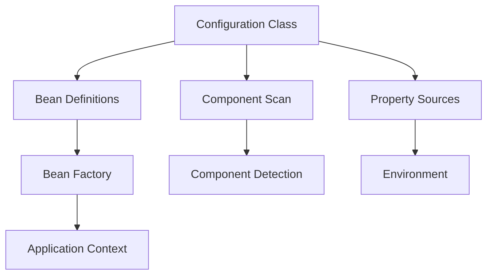
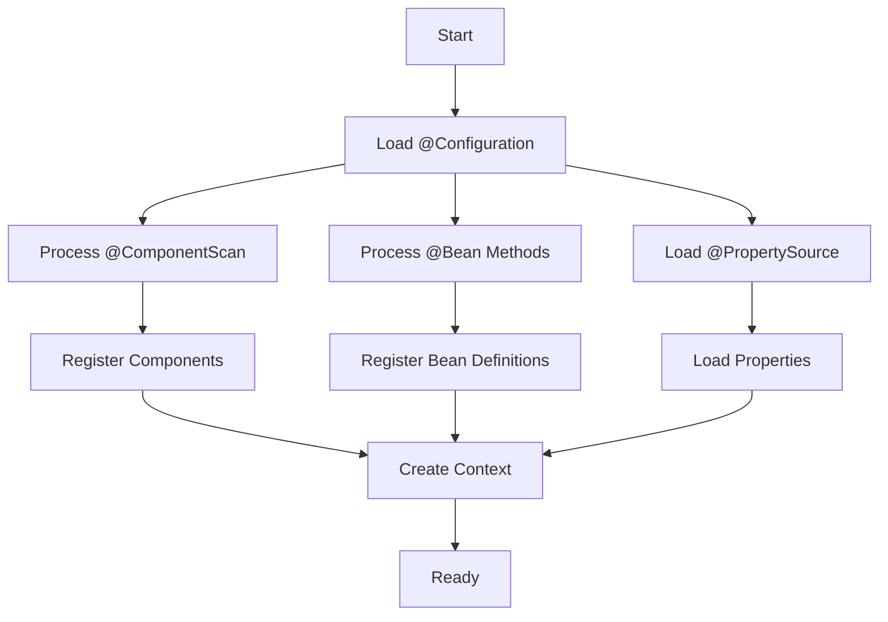

# Module 14.7: Spring Configuration

## 1. Introduction

Spring Configuration defines how beans are created and wired. This module covers Java-based configuration with @Configuration, @Bean, @ComponentScan, and profile management for environment-specific configurations.

## 2. Learning Objectives

- Master @Configuration and @Bean annotations
- Use @ComponentScan with filters
- Implement @Profile for environment-specific beans
- Understand @PropertySource and @Import
- Create conditional beans with @Conditional

## 3. Prerequisites

- Spring Fundamentals and Dependency Injection
- Understanding of Spring IoC container

## 4. Why This Concept Exists

XML configuration was verbose and error-prone. Java-based configuration provides type-safe, refactor-friendly configuration with IDE support.

## 5. Problem Statement

Managing different configurations for dev, test, and prod environments without code duplication or configuration drift.

## 6. Theory

| Annotation | Purpose |
|-----------|---------|
| @Configuration | Marks class as configuration source |
| @Bean | Defines bean creation method |
| @ComponentScan | Scans for component annotations |
| @Profile | Activates beans for specific profiles |
| @PropertySource | Loads external properties |
| @Import | Imports other configurations |

## 7. Internal Working

Spring processes @Configuration classes by creating CGLIB proxies to ensure @Bean methods return singletons. The proxy intercepts calls and checks the singleton cache.

## 8. JVM Perspective

@Configuration classes are enhanced with CGLIB subclassing. Each @Bean method call is intercepted to return the same instance.

## 9. Memory Representation

```
ConfigurationClassPostProcessor
  → Processes @Configuration classes
  → Creates bean definitions for @Bean methods
  → Registers @ComponentScan packages
```

## 10. Architecture Diagram



## 11. Flow Diagram



## 12. Syntax

```java
@Configuration
@ComponentScan(basePackages = "com.example")
@PropertySource("classpath:app.properties")
public class AppConfig {

    @Bean
    public UserRepository userRepository() {
        return new JdbcUserRepository();
    }

    @Bean
    @Profile("prod")
    public DataSource prodDataSource() {
        return new DataSource("jdbc:mysql://prod-db");
    }

    @Bean
    @Profile("test")
    public DataSource testDataSource() {
        return new DataSource("jdbc:h2:mem:test");
    }
}
```

## 13. Easy Example

```java
@Configuration
public class AppConfig {
    @Bean
    public Greeter greeter() { return new Greeter(); }
}

@Component
public class Greeter {
    public String greet(String name) { return "Hello " + name; }
}

public class ConfigDemo {
    public static void main(String[] args) {
        var ctx = new AnnotationConfigApplicationContext(AppConfig.class);
        System.out.println(ctx.getBean(Greeter.class).greet("World"));
        ctx.close();
    }
}
```

## 14. Medium Example

```java
@Configuration
@Profile("dev")
public class DevConfig {
    @Bean
    public DataSource dataSource() {
        return new DataSource("jdbc:h2:mem:devdb");
    }
}

@Configuration
@Profile("prod")
public class ProdConfig {
    @Bean
    public DataSource dataSource() {
        return new DataSource("jdbc:mysql://prod:3306/mydb");
    }
}

@Configuration
@ComponentScan("com.example")
@Import({DevConfig.class, ProdConfig.class})
public class AppConfig {}
```

## 15. Hard Example

```java
@Configuration
public class ConditionalConfig {

    @Bean
    @ConditionalOnProperty(name = "app.cache.enabled", havingValue = "true")
    public CacheManager cacheManager() {
        return new ConcurrentMapCacheManager();
    }

    @Bean
    @ConditionalOnMissingBean(CacheManager.class)
    public CacheManager noOpCacheManager() {
        return new NoOpCacheManager();
    }

    @Bean
    @ConditionalOnClass(name = "redis.clients.jedis.Jedis")
    public CacheManager redisCacheManager() {
        return new RedisCacheManager();
    }
}
```

## 16. Enterprise Example

```java
@Configuration
@ComponentScan(basePackages = "com.example",
    includeFilters = @ComponentScan.Filter(type = FilterType.ANNOTATION,
        classes = Service.class),
    excludeFilters = @ComponentScan.Filter(type = FilterType.REGEX,
        pattern = ".*Test.*"))
@PropertySources({
    @PropertySource("classpath:common.properties"),
    @PropertySource("classpath:${spring.profiles.active:dev}.properties")
})
@Import(DatabaseConfig.class)
public class EnterpriseConfig {

    @Bean
    @Scope("prototype")
    public RequestHandler requestHandler() {
        return new DefaultRequestHandler();
    }
}
```

## 17. Performance

| Feature | Impact |
|---------|--------|
| Component scanning | Startup time O(n) |
| @Configuration proxy | Minimal overhead |
| Profile resolution | Negligible |
| Property loading | File I/O dependent |

## 18. Time & Space Complexity

Configuration processing: O(c + b) where c = config classes, b = beans defined.

## 19. Thread Safety

Configuration classes are processed once at startup. @Bean methods should be thread-safe for prototype beans.

## 20. Best Practices

1. Use @Configuration over @Component for bean definitions
2. Keep configuration classes focused
3. Use @Profile for environment-specific beans
4. Prefer @PropertySource over hardcoded values
5. Use @Import for modular configuration

## 21. Common Mistakes

1. Missing @Configuration on class with @Bean methods
2. Not using CGLIB proxy (calling @Bean methods directly)
3. Profile name typos
4. Not scanning correct packages

## 22. Pitfalls

- @Bean methods called directly bypass singleton guarantee (without @Configuration)
- @Profile is not inherited by @Configuration classes
- Circular imports can cause issues

## 23. Debugging Tips

```java
ctx.getBeanDefinitionNames()  // List all beans
ctx.getEnvironment().getProperty("key")  // Check property
ctx.getBean("beanName")  // Verify bean exists
```

## 24. Comparison Table

| Feature | XML | Java Config | Annotations |
|---------|-----|-------------|-------------|
| Type safety | No | Yes | Partial |
| IDE support | Limited | Full | Good |
| Refactoring | Difficult | Easy | Easy |
| Runtime flexibility | High | Medium | Low |

## 25. Decision Tree

- Complex bean creation? → @Configuration + @Bean
- Simple component? → @Component/@Service
- Environment-specific? → @Profile
- External config? → @PropertySource
- Modular config? → @Import

## 26. Interview Questions (15+)

1. What is the difference between @Configuration and @Component?
2. Why does @Configuration use CGLIB proxy?
3. How do @Profile annotations work?
4. What is @PropertySource used for?
5. How do you import additional configurations?
6. What is @ConditionalOnProperty?
7. Can @Bean methods be static?
8. How do you override bean definitions?
9. What is @ImportResource?
10. How do profiles get activated?
11. What is @ConditionalOnClass?
12. Can you have multiple @Configuration classes?
13. How does @ComponentScan filter work?
14. What is lite mode for @Configuration?
15. How do you externalize configuration?

## 27. Exercises

**Level 1**: Create separate dev and prod configurations with different datasources.

**Level 2**: Create a conditional bean that only loads when a class is on the classpath.

**Level 3**: Create a modular configuration system with @Import and profiles.

## 28. Summary

Spring Configuration provides type-safe, flexible bean definition through @Configuration, @Bean, and related annotations. Profiles and conditionals enable environment-specific behavior.

## 29. References

- [Java-based Configuration](https://docs.spring.io/spring-framework/reference/core/java/configuration-annotation.html)
- [Profiles](https://docs.spring.io/spring-framework/reference/core.html#beans-environment-profiles)
- *Spring in Action* by Craig Walls - Chapter 5
