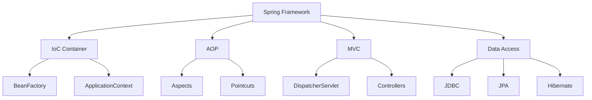

# Module 14: Spring Framework

## Overview
Spring Framework is the most popular Java framework for building enterprise applications. It provides Inversion of Control (IoC), Dependency Injection (DI), and comprehensive infrastructure support.

## Learning Objectives
- Understand Spring IoC container
- Master dependency injection
- Use Spring annotations
- Understand bean lifecycle
- Apply Spring best practices

## Prerequisites
- Java fundamentals
- OOP concepts
- Design patterns

## Why This Concept Exists
Enterprise applications need:
- Loose coupling
- Testability
- Configuration management
- Infrastructure support

Spring provides:
- IoC container
- Dependency injection
- AOP support
- Transaction management
- MVC framework

## Problem Statement
How do you build maintainable, testable enterprise applications?

## Theory

### Spring Concepts

| Concept | Description |
|---------|-------------|
| IoC | Inversion of Control |
| DI | Dependency Injection |
| Bean | Spring-managed object |
| Container | Bean factory |
| Context | Application configuration |

### Bean Scopes

| Scope | Description |
|-------|-------------|
| Singleton | One instance per container |
| Prototype | New instance each request |
| Request | Per HTTP request |
| Session | Per HTTP session |

## Internal Working

### Spring Boot Startup
1. Load configuration
2. Create ApplicationContext
3. Scan for components
4. Create beans
5. Inject dependencies
6. Initialize beans
7. Ready for use

## JVM Perspective

### Spring Proxies
- CGLIB for classes
- JDK Dynamic Proxy for interfaces
- AOP implementation
- Transaction proxies

### Memory
- Singleton beans cached
- Prototype beans GC'd
- Context manages lifecycle

## Architecture Diagram



## Syntax

### Configuration
```java
@Configuration
@ComponentScan
public class AppConfig {
    @Bean
    public GreetingService greetingService() {
        return new GreetingService();
    }
}
```

### Dependency Injection
```java
@Service
public class UserService {
    private final UserRepository repository;
    
    @Autowired
    public UserService(UserRepository repository) {
        this.repository = repository;
    }
}
```

### Bean Lifecycle
```java
@Component
public class MyBean {
    @PostConstruct
    public void init() {
        System.out.println("Bean initialized");
    }
    
    @PreDestroy
    public void cleanup() {
        System.out.println("Bean destroyed");
    }
}
```

## Easy Example
```java
import org.springframework.context.annotation.*;
import org.springframework.stereotype.*;

@Component
public class GreetingService {
    public String greet(String name) {
        return "Hello, " + name + "!";
    }
}

@Configuration
@ComponentScan
public class AppConfig {
    @Bean
    public GreetingService greetingService() {
        return new GreetingService();
    }
}

public class Main {
    public static void main(String[] args) {
        AnnotationConfigApplicationContext context = 
            new AnnotationConfigApplicationContext(AppConfig.class);
        
        GreetingService service = context.getBean(GreetingService.class);
        System.out.println(service.greet("World"));
        context.close();
    }
}
```

## Medium Example
```java
import org.springframework.context.annotation.*;
import org.springframework.stereotype.*;

@Repository
public class UserRepository {
    public User findById(Long id) {
        return new User(id, "John");
    }
}

@Service
public class UserService {
    private final UserRepository repository;
    
    @Autowired
    public UserService(UserRepository repository) {
        this.repository = repository;
    }
    
    public User getUser(Long id) {
        return repository.findById(id);
    }
}

@RestController
@RequestMapping("/users")
public class UserController {
    private final UserService userService;
    
    @Autowired
    public UserController(UserService userService) {
        this.userService = userService;
    }
    
    @GetMapping("/{id}")
    public User getUser(@PathVariable Long id) {
        return userService.getUser(id);
    }
}
```

## Hard Example
```java
import org.springframework.context.annotation.*;
import org.springframework.stereotype.*;

@Component
@Scope("prototype")
public class PrototypeBean {
    private final String id = UUID.randomUUID().toString();
    
    public String getId() {
        return id;
    }
}

@Configuration
public class ConditionalConfig {
    @Bean
    @ConditionalOnProperty(name = "feature.enabled", havingValue = "true")
    public FeatureService featureService() {
        return new FeatureService();
    }
}
```

## Enterprise Example
```java
import org.springframework.context.annotation.*;
import org.springframework.stereotype.*;
import org.springframework.scheduling.annotation.*;

@Service
public class AsyncService {
    @Async
    public CompletableFuture<String> processAsync() {
        return CompletableFuture.completedFuture("Done");
    }
}

@Component
public class ScheduledTasks {
    @Scheduled(fixedRate = 5000)
    public void reportCurrentTime() {
        System.out.println("Time: " + LocalDateTime.now());
    }
}
```

## Performance Considerations
- Singleton beans are fastest
- Lazy initialization reduces startup
- Use component scanning wisely
- Avoid circular dependencies

## Best Practices
1. Use constructor injection
2. Keep beans focused
3. Use profiles for environments
4. Prefer @Configuration over XML
5. Use @Qualifier for multiple beans

## Common Mistakes
1. Using field injection
2. Circular dependencies
3. Overusing singleton scope
4. Not handling exceptions

## Comparison Table

| Feature | Spring | Guice | Dagger |
|---------|--------|-------|--------|
| DI Type | Runtime | Runtime | Compile-time |
| AOP | Yes | Limited | No |
| Configuration | Java/XML | Java | Annotations |
| Performance | Good | Good | Best |

## Interview Questions

### Q1: What is IoC?
**Answer:** Inversion of Control - framework manages object creation.

### Q2: What is Dependency Injection?
**Answer:** Providing dependencies from outside.

### Q3: What are the types of DI?
**Answer:** Constructor, setter, and field injection.

### Q4: Why is constructor injection preferred?
**Answer:** Immutable dependencies, testable, required dependencies clear.

### Q5: What is a Spring Bean?
**Answer:** An object managed by Spring IoC container.

## Summary
Spring Framework provides comprehensive infrastructure for enterprise Java development.

## References
- Spring Documentation
- Spring in Action
- Baeldung Spring Tutorial
