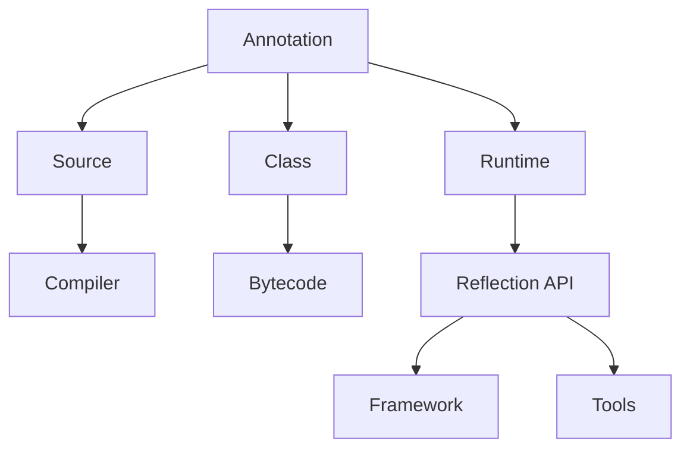
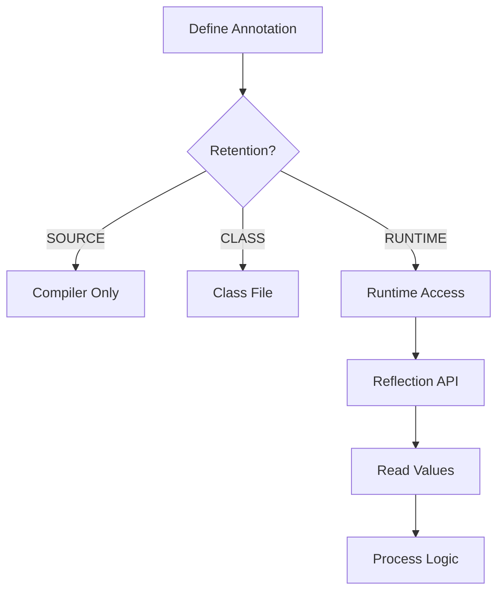
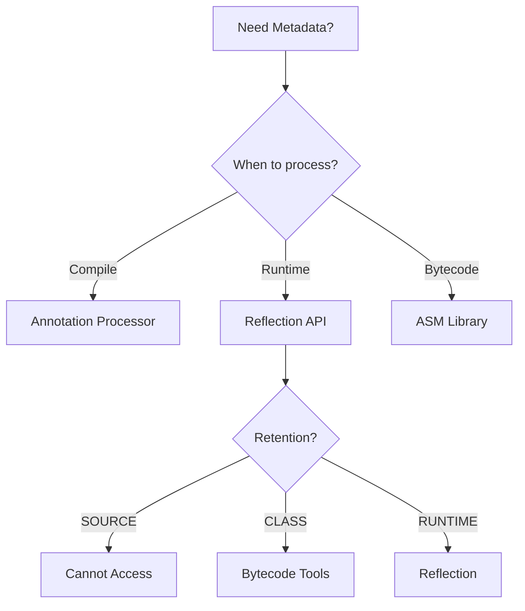

# Module 15: Annotations

## Overview
Annotations provide metadata for Java code. They don't affect program logic directly but can be used by compilers, frameworks, and tools for code analysis, generation, and runtime behavior modification.

## Learning Objectives
- Understand built-in annotations
- Create custom annotations
- Apply annotation processing
- Use annotations in frameworks
- Handle retention policies

## Prerequisites
- Basic Java knowledge
- Reflection basics
- OOP concepts

## Why This Concept Exists
Without annotations:
- XML configuration was verbose
- Code was less self-documenting
- Frameworks needed external configuration
- Type checking was limited

Annotations provide:
- Self-documenting code
- Compile-time checking
- Runtime metadata
- Framework configuration

## Problem Statement
How do you add metadata to code that can be used by compilers, frameworks, and tools?

## Theory

### Built-in Annotations

| Annotation | Target | Purpose |
|------------|--------|---------|
| @Override | Method | Overrides superclass |
| @Deprecated | All | Marks deprecated |
| @SuppressWarnings | All | Suppress warnings |
| @FunctionalInterface | Interface | SAM interface |
| @SafeVarargs | Method | Safe varargs |
| @Retention | Annotation | Retention policy |
| @Target | Annotation | Applicable targets |
| @Documented | Annotation | Include in Javadoc |
| @Inherited | Annotation | Inheritable |

### Retention Policies

| Policy | Purpose |
|--------|---------|
| SOURCE | Compiler only |
| CLASS | Class file only |
| RUNTIME | Runtime accessible |

### Target Types

| Type | Applies To |
|------|-----------|
| TYPE | Class, interface, enum |
| METHOD | Method |
| FIELD | Field |
| CONSTRUCTOR | Constructor |
| PARAMETER | Method parameter |
| LOCAL_VARIABLE | Local variable |

## Internal Working

### Annotation Processing
1. Compile-time processing (APT)
2. Runtime processing (Reflection)
3. Bytecode processing (ASM)

### Runtime Annotation Access
```java
// Get annotation
MyAnnotation ann = clazz.getAnnotation(MyAnnotation.class);

// Check if present
boolean present = clazz.isAnnotationPresent(MyAnnotation.class);
```

## JVM Perspective

### Annotation Storage
- Stored in class file
- Runtime annotations in RuntimeVisibleAnnotations attribute
- Accessible via reflection API
- No performance impact until accessed

## Memory Representation
```
Annotation in Class File:
┌─────────────────────────────────────┐
│ RuntimeVisibleAnnotations           │
│  ├─ @MyAnnotation                   │
│  │  ├─ value = "test"              │
│  │  └─ priority = 1                │
│  └─ @Override                       │
└─────────────────────────────────────┘
```

## Architecture Diagram



## Flow Diagram



## Syntax

### Defining Annotations
```java
@Retention(RetentionPolicy.RUNTIME)
@Target(ElementType.METHOD)
public @interface MyAnnotation {
    String value();
    int priority() default 0;
    boolean enabled() default true;
}
```

### Using Annotations
```java
public class MyClass {
    @MyAnnotation(value = "test", priority = 1)
    public void myMethod() {}
    
    @Override
    public String toString() { return "MyClass"; }
    
    @Deprecated
    public void oldMethod() {}
}
```

### Reading Annotations
```java
Class<?> clazz = MyClass.class;

// Check if annotation exists
if (clazz.isAnnotationPresent(MyAnnotation.class)) {
    MyAnnotation ann = clazz.getAnnotation(MyAnnotation.class);
    System.out.println("Value: " + ann.value());
    System.out.println("Priority: " + ann.priority());
}
```

### Annotation with Arrays
```java
@Retention(RetentionPolicy.RUNTIME)
@Target(ElementType.TYPE)
public @interface Roles {
    String[] value();
}

@Roles({"ADMIN", "USER"})
public class SecuredClass {}
```

## Easy Example
```java
import java.lang.annotation.*;
import java.lang.reflect.*;

@Retention(RetentionPolicy.RUNTIME)
@Target(ElementType.METHOD)
@interface LogExecutionTime {}

public class EasyExample {
    @LogExecutionTime
    public void slowMethod() throws InterruptedException {
        Thread.sleep(1000);
    }
    
    public static void main(String[] args) throws Exception {
        EasyExample obj = new EasyExample();
        Method method = obj.getClass().getMethod("slowMethod");
        
        if (method.isAnnotationPresent(LogExecutionTime.class)) {
            long start = System.currentTimeMillis();
            method.invoke(obj);
            long end = System.currentTimeMillis();
            System.out.println("Execution time: " + (end - start) + "ms");
        }
    }
}
```

## Medium Example
```java
import java.lang.annotation.*;
import java.lang.reflect.*;

@Retention(RetentionPolicy.RUNTIME)
@Target(ElementType.FIELD)
@interface Validate {
    int minLength() default 0;
    int maxLength() default Integer.MAX_VALUE;
    String pattern() default "";
}

public class MediumExample {
    @Validate(minLength = 2, maxLength = 50)
    private String name;
    
    @Validate(pattern = ".*@.*\\..*")
    private String email;
    
    public static void validate(Object obj) throws Exception {
        Class<?> clazz = obj.getClass();
        for (Field field : clazz.getDeclaredFields()) {
            if (field.isAnnotationPresent(Validate.class)) {
                field.setAccessible(true);
                String value = (String) field.get(obj);
                Validate ann = field.getAnnotation(Validate.class);
                
                if (value == null || value.length() < ann.minLength()) {
                    throw new IllegalArgumentException(
                        field.getName() + " too short");
                }
                if (value.length() > ann.maxLength()) {
                    throw new IllegalArgumentException(
                        field.getName() + " too long");
                }
            }
        }
    }
    
    public static void main(String[] args) throws Exception {
        MediumExample obj = new MediumExample();
        obj.name = "A"; // Too short
        validate(obj);
    }
}
```

## Hard Example
```java
import java.lang.annotation.*;
import java.lang.reflect.*;
import java.util.*;

@Retention(RetentionPolicy.RUNTIME)
@Target(ElementType.METHOD)
@interface Command {
    String name();
    String description();
}

public class HardExample {
    @Command(name = "add", description = "Add two numbers")
    public int add(int a, int b) { return a + b; }
    
    @Command(name = "subtract", description = "Subtract two numbers")
    public int subtract(int a, int b) { return a - b; }
    
    public static void main(String[] args) throws Exception {
        HardExample obj = new HardExample();
        Scanner scanner = new Scanner(System.in);
        
        // List commands
        System.out.println("Available commands:");
        for (Method m : obj.getClass().getMethods()) {
            if (m.isAnnotationPresent(Command.class)) {
                Command cmd = m.getAnnotation(Command.class);
                System.out.println("  " + cmd.name() + " - " + cmd.description());
            }
        }
        
        // Execute command
        System.out.print("Enter command: ");
        String command = scanner.nextLine();
        
        for (Method m : obj.getClass().getMethods()) {
            if (m.isAnnotationPresent(Command.class)) {
                Command cmd = m.getAnnotation(Command.class);
                if (cmd.name().equals(command)) {
                    System.out.print("Enter args (space-separated): ");
                    String[] argsInput = scanner.nextLine().split(" ");
                    Object[] methodArgs = Arrays.stream(argsInput)
                        .map(Integer::parseInt)
                        .toArray();
                    Object result = m.invoke(obj, methodArgs);
                    System.out.println("Result: " + result);
                }
            }
        }
    }
}
```

## Enterprise Example
```java
import java.lang.annotation.*;
import java.lang.reflect.*;
import java.util.concurrent.*;

@Retention(RetentionPolicy.RUNTIME)
@Target(ElementType.METHOD)
@interface RateLimit {
    int requests() default 100;
    int windowSeconds() default 60;
}

public class EnterpriseExample {
    private static Map<String, Queue<Long>> requestCounts = new ConcurrentHashMap<>();
    
    @RateLimit(requests = 5, windowSeconds = 10)
    public String limitedEndpoint() {
        return "Success";
    }
    
    public static boolean checkRateLimit(Object obj, String methodName) throws Exception {
        Method method = obj.getClass().getMethod(methodName);
        if (!method.isAnnotationPresent(RateLimit.class)) return true;
        
        RateLimit ann = method.getAnnotation(RateLimit.class);
        String key = obj.getClass().getSimpleName() + "." + methodName;
        
        long now = System.currentTimeMillis();
        long window = ann.windowSeconds() * 1000L;
        
        Queue<Long> timestamps = requestCounts.computeIfAbsent(key, k -> new ConcurrentLinkedQueue<>());
        timestamps.removeIf(t -> t < now - window);
        
        if (timestamps.size() >= ann.requests()) {
            return false;
        }
        timestamps.add(now);
        return true;
    }
    
    public static void main(String[] args) throws Exception {
        EnterpriseExample obj = new EnterpriseExample();
        
        for (int i = 0; i < 10; i++) {
            boolean allowed = checkRateLimit(obj, "limitedEndpoint");
            System.out.println("Request " + (i + 1) + ": " + (allowed ? "Allowed" : "Rejected"));
        }
    }
}
```

## Performance Considerations
- Annotation access via reflection is slow
- Cache annotation instances
- Use compile-time processing when possible
- Annotations have minimal memory overhead

## Time & Space Complexity
| Operation | Time | Space |
|-----------|------|-------|
| getAnnotation | O(n) | O(1) |
| isAnnotationPresent | O(n) | O(1) |
| Annotation creation | O(1) | O(fields) |

## Thread Safety
- Annotation instances are immutable
- Thread-safe by design
- Concurrent access is safe
- Cache safely with ConcurrentHashMap

## Best Practices
1. Use @Retention(RUNTIME) for runtime access
2. Document annotation purpose
3. Use sensible defaults
4. Keep annotations simple
5. Cache annotation instances

## Common Mistakes
1. Wrong retention policy
2. Missing @Target
3. Not handling exceptions
4. Overusing annotations

## Pitfalls & Warnings
1. Runtime annotations affect performance
2. Annotation values must be compile-time constants
3. Inherited annotations only work with @Inherited
4. Annotations cannot be null

## Debugging Tips
1. Print annotation values
2. Check retention policy
3. Verify target elements
4. Use annotation processors for validation

## Comparison Table

| Feature | XML | Annotations | Code |
|---------|-----|-------------|------|
| Readability | Low | High | High |
| Type Safety | No | Yes | Yes |
| Flexibility | High | Medium | Low |
| Runtime Access | Yes | Yes | Yes |

## Decision Tree



## Interview Questions

### Q1: What are annotations?
**Answer:** Metadata that can be attached to code elements for various purposes.

### Q2: What is the difference between @Retention policies?
**Answer:** SOURCE (compiler only), CLASS (class file), RUNTIME (accessible via reflection).

### Q3: How do you create a custom annotation?
**Answer:** Use @interface keyword with @Retention and @Target meta-annotations.

### Q4: How do you read annotations at runtime?
**Answer:** Use reflection API: getAnnotation(), isAnnotationPresent().

### Q5: What is @Override used for?
**Answer:** Indicates method overrides superclass method, checked at compile time.

### Q6: What is @FunctionalInterface?
**Answer:** Marks interface with single abstract method for lambda expressions.

### Q7: How do you use annotations with arrays?
**Answer:** Define annotation method with array return type, use {} syntax.

### Q8: What are meta-annotations?
**Answer:** Annotations that annotate other annotations (@Retention, @Target, etc.).

### Q9: What is @Inherited?
**Answer:** Makes annotation inheritable by subclasses.

### Q10: What is @Documented?
**Answer:** Includes annotation in Javadoc output.

### Q11: How do you validate with annotations?
**Answer:** Create validation annotation, process with reflection at runtime.

### Q12: What are annotation processors?
**Answer:** Compile-time tools that process annotations and generate code.

### Q13: What is the performance impact of annotations?
**Answer:** Minimal unless accessed via reflection, then O(n) for lookup.

### Q14: How do you use annotations in Spring?
**Answer:** @Component, @Autowired, @RequestMapping are Spring annotations.

### Q15: What are the limitations of annotations?
**Answer:** Must be compile-time constants, no null values, limited complexity.

## Exercises

### Easy
1. Create a @Todo annotation
2. Read all annotations from a class
3. Use @Override correctly

### Medium
1. Build a validation framework
2. Create a logging annotation
3. Implement a custom annotation processor

### Hard
1. Build a dependency injection container
2. Create a REST framework with annotations
3. Implement AOP with annotations

## Summary
Annotations provide metadata for Java code, enabling framework development, code analysis, and runtime behavior modification.

## References
- Oracle Java Documentation: Annotations
- Java Annotation Tutorial
- Baeldung Annotations Guide
