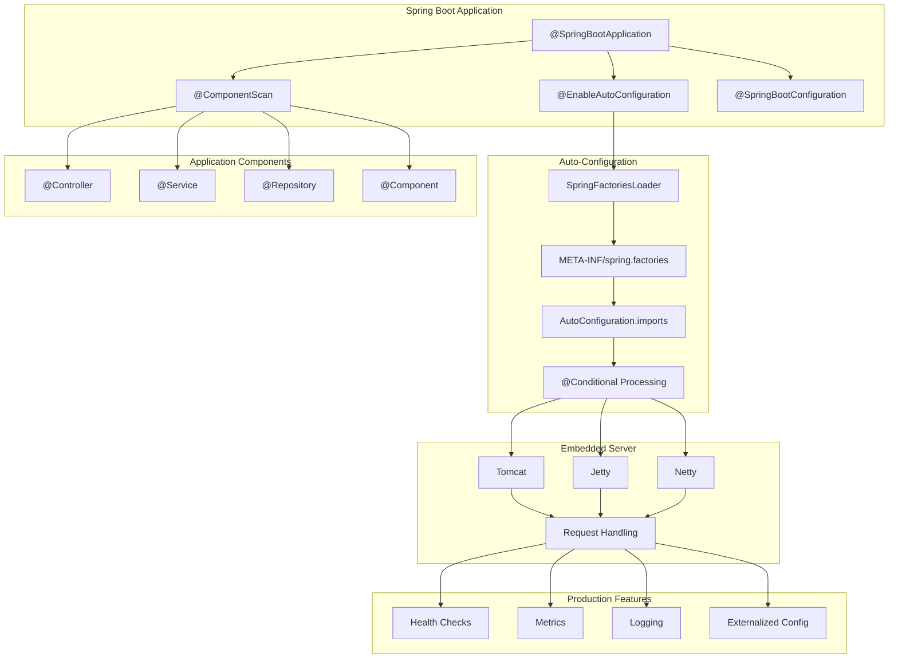
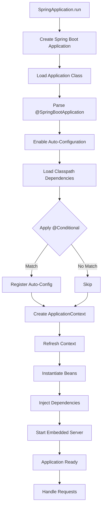

# Module 15.1: Spring Boot Fundamentals

## 1. Introduction

Spring Boot is an opinionated framework that makes it easy to create stand-alone, production-grade Spring-based applications. It convention-over-configuration approach eliminates boilerplate, letting developers focus on business logic rather than infrastructure setup. Spring Boot embeds servers, auto-configures dependencies, and provides production-ready features out of the box.

## 2. Learning Objectives

- Understand Spring Boot's purpose and philosophy
- Learn auto-configuration mechanism and how it works
- Master Spring Boot starters and dependency management
- Understand `@SpringBootApplication` annotation composition
- Create and run Spring Boot applications
- Understand embedded server architecture
- Learn the Spring Boot lifecycle

## 3. Prerequisites

- Core Java knowledge (generics, annotations, reflection)
- Spring Framework basics (IoC, DI, ApplicationContext)
- Maven or Gradle build tools
- HTTP and REST fundamentals

## 4. Why This Concept Exists

Traditional Spring applications required extensive XML configuration or verbose Java configuration. Spring Boot exists to:

- **Eliminate boilerplate**: No more `web.xml`, dispatcher servlet config, or ViewResolver setup
- **Rapid development**: Start with sensible defaults and override only what you need
- **Production readiness**: Built-in health checks, metrics, externalized configuration
- **Opinionated approach**: Convention over configuration reduces decision fatigue
- **Embedded servers**: No need for external Tomcat/Jetty deployment

## 5. Problem Statement

**Without Spring Boot:**
```java
// 50+ lines of XML configuration for a simple web app
// Manual dependency version management
// No built-in health checks or metrics
// External server deployment required
// Configuration scattered across multiple files
```

**With Spring Boot:**
```java
@SpringBootApplication
public class MyApp {
    public static void main(String[] args) {
        SpringApplication.run(MyApp.class, args);
    }
}
```

## 6. Theory

### 6.1 Auto-Configuration

Auto-configuration reads classpath dependencies and configures beans automatically. When you add `spring-boot-starter-web`, Spring Boot automatically configures:
- DispatcherServlet
- Embedded Tomcat
- Jackson for JSON serialization
- Spring MVC controllers
- Error handling

The `@EnableAutoConfiguration` annotation triggers this via `SpringFactoriesLoader`.

### 6.2 Starters

Starters are dependency descriptors that bundle related libraries:

| Starter | Purpose |
|---------|---------|
| `spring-boot-starter-web` | Web applications, REST |
| `spring-boot-starter-data-jpa` | JPA/Hibernate |
| `spring-boot-starter-security` | Authentication/Authorization |
| `spring-boot-starter-test` | Testing |
| `spring-boot-starter-actuator` | Production monitoring |

### 6.3 @SpringBootApplication

This is a composite annotation:

```java
@SpringBootApplication = @SpringBootConfiguration + @EnableAutoConfiguration + @ComponentScan
```

- **@SpringBootConfiguration**: Indicates this is a Spring Boot configuration class (specialized @Configuration)
- **@EnableAutoConfiguration**: Enables auto-configuration based on classpath
- **@ComponentScan**: Scans for components in the current package and sub-packages

### 6.4 Spring Boot Lifecycle

```
ApplicationStart → Environment Preparation → ApplicationContext Creation →
Auto-Configuration → Bean Definition → Bean Instantiation → 
Bean Initialization → ApplicationReady → Running → Shutdown
```

## 7. Internal Working

### 7.1 SpringApplication.run() Internals

```java
public static ConfigurableApplicationContext run(Class<?> primarySource, String... args) {
    return run(new Class<?>[] { primarySource }, args);
}

public static ConfigurableApplicationContext run(Class<?>[] primarySources, String[] args) {
    return new SpringApplication(primarySources).run(args);
}
```

**Steps:**
1. **Create ApplicationContext**: Determines application type (reactive, servlet, none)
2. **Load ApplicationContextInitializers**: Apply context initializers
3. **Load ApplicationListeners**: Load event listeners from `META-INF/spring.factories`
4. **Prepare Environment**: Load properties, system properties, environment variables
5. **Create ApplicationContext**: Based on application type
6. **Refresh Context**: Bean instantiation, dependency injection, auto-configuration
7. **Invoke Runners**: Call `ApplicationRunner` and `CommandLineRunner` beans

### 7.2 Auto-Configuration Loading

```
SpringApplication.run()
  → SpringFactoriesLoader.loadFactories(EnableAutoConfiguration.class)
    → reads META-INF/spring/org.springframework.boot.autoconfigure.AutoConfiguration.imports
      → filters based on @Conditional annotations
        → registers matching auto-configuration classes
```

### 7.3 @Conditional Mechanism

```java
@ConditionalOnClass(Tomcat.class)        // Only if Tomcat on classpath
@ConditionalOnMissingBean                // Only if bean not defined
@ConditionalOnProperty("feature.enabled") // Based on property
@ConditionalOnWebApplication             // Only if web app
```

## 8. JVM Perspective

### 8.1 Application Startup

```
JVM启动
  → ClassLoader加载@SpringBootApplication
  → 反射创建SpringApplication实例
  → 调用run()方法
  → SpringApplicationRunListeners发布事件
  → 创建Environment（加载系统属性、环境变量、application.properties）
  → 创建ApplicationContext
  → refresh()触发Bean定义加载
  → Auto-Configuration通过ImportCandidates加载
  → 条件过滤（@Conditional）
  → Bean实例化和依赖注入
  → 启动嵌入式服务器（Tomcat/Jetty/Netty）
```

### 8.2 ClassLoader Hierarchy

```
Bootstrap ClassLoader
  └── Extension ClassLoader (JDK 8及之前)
       └── Application ClassLoader
            └── Spring Boot LaunchedURLClassLoader
                 └── JARs in BOOT-INF/classes
                 └── JARs in BOOT-INF/lib/
```

### 8.3 Fat JAR Structure

```
my-app.jar
├── META-INF/
│   ├── MANIFEST.MF
│   └── maven/
├── org/springframework/boot/loader/
│   ├── JarLauncher.class
│   ├── WarLauncher.class
│   └── PropertiesLauncher.class
├── BOOT-INF/
│   ├── classes/          ← Your compiled classes
│   └── lib/              ← Dependencies
```

## 9. Memory Representation

### 9.1 ApplicationContext Memory Model

```
ApplicationContext (AbstractApplicationContext)
├── BeanFactory (DefaultListableBeanFactory)
│   ├── beanDefinitionMap: ConcurrentHashMap<String, BeanDefinition>
│   │   └── Entry: "userService" → BeanDefinition(class=UserService)
│   ├── singletonObjects: ConcurrentHashMap<String, Object>
│   │   └── Entry: "userService" → UserService@3a2f7c
│   ├── prototypeObjects: ConcurrentHashMap<String, Object>
│   └── dependentBeanMap: ConcurrentHashMap<String, Set<String>>
├── Environment
│   ├── propertySources: MutablePropertySources
│   └── activeProfiles: Set<String>
├── ApplicationEventMulticaster
│   └── defaultRetriever: SimpleApplicationEventMulticaster
└── ResourcePatternResolver
    └── PathMatchingResourcePatternResolver
```

### 9.2 Bean Creation Flow

```
BeanDefinition → Instantiation → Populate Properties → 
BeanNameAware → BeanFactoryAware → ApplicationContextAware →
@PostConstruct → InitializingBean.afterPropertiesSet() → init-method →
Bean Ready → DisposableBean.destroy() → @PreDestroy → destroy-method
```

## 10. Architecture Diagram



## 11. Flow Diagram



## 12. Syntax

### 12.1 Basic Application

```java
@SpringBootApplication
public class Application {
    public static void main(String[] args) {
        SpringApplication.run(Application.class, args);
    }
}
```

### 12.2 Custom SpringApplication

```java
@SpringBootApplication
public class Application {
    public static void main(String[] args) {
        SpringApplication app = new SpringApplication(Application.class);
        app.setBannerMode(Banner.Mode.OFF);
        app.addListeners(new ApplicationStartingEventListener());
        app.run(args);
    }
}
```

### 12.3 Fluent Builder

```java
@SpringBootApplication
public class Application {
    public static void main(String[] args) {
        new SpringApplicationBuilder(Application.class)
            .bannerMode(Banner.Mode.OFF)
            .run(args);
    }
}
```

### 12.4 Customizing Beans

```java
@Configuration
public class CustomConfig {
    @Bean
    public ObjectMapper objectMapper() {
        ObjectMapper mapper = new ObjectMapper();
        mapper.registerModule(new JavaTimeModule());
        return mapper;
    }
}
```

## 13. Easy Example

```java
package academy.javaengineering.springboot;

import org.springframework.boot.SpringApplication;
import org.springframework.boot.autoconfigure.SpringBootApplication;
import org.springframework.web.bind.annotation.GetMapping;
import org.springframework.web.bind.annotation.RestController;

@SpringBootApplication
@RestController
public class SpringBootFundamentalsExample {
    
    @GetMapping("/hello")
    public String hello() {
        return "Hello, Spring Boot!";
    }
    
    public static void main(String[] args) {
        SpringApplication.run(SpringBootFundamentalsExample.class, args);
    }
}
```

## 14. Medium Example

```java
package academy.javaengineering.springboot;

import org.springframework.boot.CommandLineRunner;
import org.springframework.boot.SpringApplication;
import org.springframework.boot.autoconfigure.SpringBootApplication;
import org.springframework.context.annotation.Bean;

@SpringBootApplication
public class SpringBootFundamentalsExample implements CommandLineRunner {
    
    @Override
    public void run(String... args) throws Exception {
        System.out.println("Application started with args:");
        for (String arg : args) {
            System.out.println("  - " + arg);
        }
    }
    
    @Bean
    public CommandLineRunner customRunner() {
        return args -> {
            System.out.println("Custom runner executed!");
        };
    }
    
    public static void main(String[] args) {
        SpringApplication.run(SpringBootFundamentalsExample.class, args);
    }
}
```

## 15. Hard Example

```java
package academy.javaengineering.springboot;

import org.springframework.boot.ApplicationArguments;
import org.springframework.boot.ApplicationRunner;
import org.springframework.boot.SpringApplication;
import org.springframework.boot.autoconfigure.SpringBootApplication;
import org.springframework.boot.context.properties.ConfigurationProperties;
import org.springframework.context.annotation.Bean;
import org.springframework.core.env.ConfigurableEnvironment;

@SpringBootApplication
public class SpringBootFundamentalsExample {
    
    public static void main(String[] args) {
        SpringApplication app = new SpringApplication(SpringBootFundamentalsExample.class);
        app.addInitializers(context -> {
            ConfigurableEnvironment env = context.getEnvironment();
            env.getSystemProperties().put("custom.property", "value");
        });
        app.run(args);
    }
    
    @Bean
    public ApplicationRunner runner() {
        return new ApplicationRunner() {
            @Override
            public void run(ApplicationArguments args) throws Exception {
                System.out.println("Non-option arguments: " + args.getNonOptionArgs());
                System.out.println("Option arguments: " + args.getOptionNames());
            }
        };
    }
}
```

## 16. Enterprise Example

```java
package academy.javaengineering.springboot;

import org.springframework.boot.SpringApplication;
import org.springframework.boot.autoconfigure.SpringBootApplication;
import org.springframework.boot.context.properties.ConfigurationProperties;
import org.springframework.context.annotation.Bean;
import org.springframework.core.env.Environment;

@SpringBootApplication
@ConfigurationProperties(prefix = "app")
public class SpringBootFundamentalsExample {
    
    private String name;
    private String version;
    private String environment;
    
    @Bean
    public AppInitializer appInitializer(Environment env) {
        return new AppInitializer(env, name, version, environment);
    }
    
    // Getters and Setters
    public String getName() { return name; }
    public void setName(String name) { this.name = name; }
    public String getVersion() { return version; }
    public void setVersion(String version) { this.version = version; }
    public String getEnvironment() { return environment; }
    public void setEnvironment(String environment) { this.environment = environment; }
    
    public static void main(String[] args) {
        SpringApplication app = new SpringApplication(SpringBootFundamentalsExample.class);
        app.setBanner((env, source, out) -> {
            out.println("======================================");
            out.println("  MyApp v" + env.getProperty("app.version", "1.0.0"));
            out.println("======================================");
        });
        app.run(args);
    }
}

class AppInitializer implements org.springframework.boot.ApplicationRunner {
    private final Environment env;
    private final String appName;
    private final String version;
    private final String environment;
    
    AppInitializer(Environment env, String appName, String version, String environment) {
        this.env = env;
        this.appName = appName;
        this.version = version;
        this.environment = environment;
    }
    
    @Override
    public void run(org.springframework.boot.ApplicationArguments args) throws Exception {
        System.out.printf("Initializing %s v%s [%s]%n", appName, version, environment);
        System.out.println("Active profiles: " + String.join(", ", env.getActiveProfiles()));
        System.out.println("Server port: " + env.getProperty("server.port", "8080"));
    }
}
```

## 17. Performance

| Metric | Value | Notes |
|--------|-------|-------|
| Cold Start (JAR) | 1-3s | Depends on bean count and auto-config |
| Cold Start (WAR) | 2-5s | WAR deployment adds overhead |
| Memory Usage | 100-300MB | Base Spring Boot app |
| Startup (GraalVM) | 0.1-0.5s | Native compilation |
| Hot Reload (DevTools) | 0.5-1s | Restart with DevTools |

## 18. Time & Space Complexity

| Operation | Time | Space | Notes |
|-----------|------|-------|-------|
| Auto-Config Loading | O(n) | O(n) | n = auto-configuration classes |
| Bean Creation | O(b) | O(b) | b = number of beans |
| Context Refresh | O(b²) | O(b) | Dependency resolution |
| Property Resolution | O(p) | O(p) | p = property sources |
| Conditional Evaluation | O(c) | O(1) | c = conditions per config |

## 19. Thread Safety

- **SpringApplication.run()**: Must be called once per JVM; subsequent calls are safe but wasteful
- **ApplicationContext**: Thread-safe after refresh; bean creation is synchronized
- **Auto-Configuration**: Processed during startup, read-only after initialization
- **Embedded Server**: Tomcat/Jetty manage thread pools internally
- **Singleton Beans**: Must be thread-safe; stateless design recommended

## 20. Best Practices

1. **Use Starters**: Always prefer starters over manual dependency management
2. **Externalize Configuration**: Use `application.properties` or `application.yml`
3. **Profile-Specific Config**: Use `application-{profile}.properties` for environment-specific settings
4. **Enable DevTools**: Use `spring-boot-devtools` for faster development
5. **Health Checks**: Add `spring-boot-starter-actuator` for monitoring
6. **Logging Configuration**: Configure log levels early in development
7. **Banner Customization**: Create a custom banner for brand identity
8. **Runners for Initialization**: Use `ApplicationRunner` or `CommandLineRunner` for setup tasks

## 21. Common Mistakes

1. **Scanning wrong packages**: `@ComponentScan` starts from the annotated class's package
2. **Missing dependencies**: Forgetting to add starter dependencies
3. **Conflicting configurations**: Multiple beans of same type without `@Primary` or `@Qualifier`
4. **Ignoring auto-config**: Overriding auto-configuration that should be customized
5. **Not using profiles**: Hardcoding environment-specific values

## 22. Pitfalls

- **Fat JAR issues**: Some libraries have issues with Spring Boot's fat JAR packaging
- **Resource leaking**: Not closing `ApplicationContext` in tests
- **Slow startup**: Too many auto-configured beans; consider excluding unused ones
- **Memory bloat**: Large classpath with unused dependencies
- **Property conflicts**: System properties overriding application properties unexpectedly

## 23. Debugging Tips

1. **Enable debug logging**: `--debug` flag or `logging.level.root=DEBUG`
2. **Auto-configuration report**: `--debug` shows positive and negative matches
3. **Bean definition dump**: Use `Actuator /beans` endpoint
4. **Property source order**: Understand property precedence (1-10 in Spring Boot docs)
5. **Start in debug mode**: `-Dspring-boot.run.jvmArguments=-agentlib:jdwp=transport=dt_socket,server=y,suspend=n,address=*:5005`

## 24. Comparison Table

| Feature | Spring Boot | Traditional Spring |
|---------|-------------|-------------------|
| Configuration | Convention-over-configuration | Explicit configuration |
| Server | Embedded (Tomcat/Jetty) | External |
| Dependency Management | Starters | Manual POM/Gradle |
| Production Readiness | Built-in | Requires setup |
| Setup Time | Minutes | Hours/Days |
| Configuration Files | application.properties/yml | XML or Java |
| Hot Reload | DevTools | Manual |
| Monitoring | Actuator built-in | Custom setup |

## 25. Decision Tree

```
Do you need a Spring application?
├── Yes → Do you want rapid development?
│   ├── Yes → Use Spring Boot
│   │   ├── Do you need a web app?
│   │   │   ├── Yes → Add spring-boot-starter-web
│   │   │   └── No → Use spring-boot-starter
│   │   └── Do you need data access?
│   │       ├── Yes → Add spring-boot-starter-data-jpa
│   │       └── No → Skip
│   └── No → Use traditional Spring (if you need full control)
└── No → Do you need microservices?
    ├── Yes → Use Spring Boot with Spring Cloud
    └── No → Consider other frameworks
```

## 26. Interview Questions

1. What is Spring Boot and why is it used?
2. Explain `@SpringBootApplication` annotation and its components.
3. What are Spring Boot starters? Give examples.
4. How does auto-configuration work in Spring Boot?
5. What is the difference between `@SpringBootConfiguration` and `@Configuration`?
6. Explain the Spring Boot application lifecycle.
7. What is the role of `SpringFactoriesLoader`?
8. How does Spring Boot decide which auto-configuration to load?
9. What are `@Conditional` annotations and why are they used?
10. Explain the embedded server architecture in Spring Boot.
11. What is the purpose of `CommandLineRunner` and `ApplicationRunner`?
12. How does Spring Boot handle externalized configuration?
13. What is a Fat JAR and how does Spring Boot create one?
14. Explain the class hierarchy of Spring Boot's embedded servers.
15. How can you customize the Spring Boot startup banner?
16. What are the advantages of Spring Boot over traditional Spring?
17. How does Spring Boot achieve "opinionated defaults"?

## 27. Exercises

### Beginner
1. Create a Spring Boot application with a single REST endpoint that returns "Hello World"
2. Add `spring-boot-starter-actuator` and verify the `/health` endpoint works
3. Create a custom banner using the Spring Boot Banner tool

### Intermediate
4. Create an application with multiple `CommandLineRunner` beans and verify execution order
5. Implement profile-specific configuration with `application-dev.properties` and `application-prod.properties`
6. Create a custom auto-configuration class that provides a `RestTemplate` bean conditionally

### Advanced
7. Build a Spring Boot starter library with auto-configuration
8. Implement a custom `ApplicationListener` for application events
9. Create a Spring Boot application that uses GraalVM native compilation
10. Build a multi-module Spring Boot project with shared auto-configuration

## 28. Summary

Spring Boot revolutionizes Spring development by eliminating configuration overhead through auto-configuration, providing production-ready features via starters, and enabling rapid application development with sensible defaults. Understanding its internals—`@SpringBootApplication`, auto-configuration, and the embedded server architecture—is essential for building modern Java applications.

## 29. References

- [Spring Boot Official Documentation](https://docs.spring.io/spring-boot/docs/current/reference/htmlsingle/)
- [Spring Boot Starters](https://docs.spring.io/spring-boot/docs/current/reference/htmlsingle/#using-boot-starter)
- [Auto-Configuration](https://docs.spring.io/spring-boot/docs/current/reference/htmlsingle/#using-boot-auto-configuration)
- [Spring Boot Properties](https://docs.spring.io/spring-boot/docs/current/reference/htmlsingle/#application-properties)
- [Spring Boot Samples](https://github.com/spring-projects/spring-boot/tree/main/spring-boot-samples)
