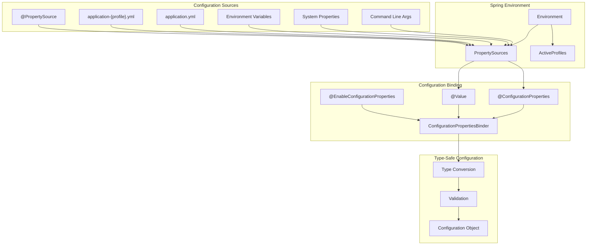

# Module 15.2: Spring Boot Configuration

## 1. Introduction

Spring Boot provides a flexible configuration system that externalizes configuration across multiple sources—from `application.properties` to environment variables. This module covers configuration properties, `@ConfigurationProperties`, profiles, and the configuration binding mechanism that enables type-safe configuration.

## 2. Learning Objectives

- Master `application.properties` and `application.yml` syntax
- Understand `@ConfigurationProperties` for type-safe binding
- Learn configuration profiles and profile-specific configuration
- Understand property source precedence and resolution
- Create custom configuration properties classes
- Master configuration encryption and sensitive data handling

## 3. Prerequisites

- Spring Boot Fundamentals (Module 15.1)
- Java records and nested classes
- YAML syntax basics
- Environment variables and system properties

## 4. Why This Concept Exists

Configuration in Spring Boot exists to:

- **Separate config from code**: Change settings without recompiling
- **Environment-specific behavior**: Different configs for dev/test/prod
- **Type-safe binding**: Compile-time errors for invalid configurations
- **Validation**: Ensure required properties are present
- **Encryption**: Protect sensitive values (passwords, API keys)
- **Flexibility**: Properties from files, env vars, command line, etc.

## 5. Problem Statement

**Without externalized config:**
```java
// Hardcoded values
String dbUrl = "jdbc:mysql://localhost:3306/mydb";
String apiKey = "sk-1234567890";
int port = 8080;
// Must recompile for each environment
```

**With Spring Boot config:**
```yaml
# application.yml
app:
  database:
    url: jdbc:mysql://localhost:3306/mydb
  api-key: ${API_KEY:default}
server:
  port: 8080
```

## 6. Theory

### 6.1 Configuration Property Sources (Precedence Order)

1. **Command line arguments**: `--server.port=9090`
2. **Java System properties**: `-Dserver.port=9090`
3. **OS environment variables**: `SERVER_PORT=9090`
4. **application-{profile}.yml/properties**: Profile-specific files
5. **application.yml/properties**: Default configuration
6. **@PropertySource**: Custom property sources
7. **Default properties**: `SpringApplication.setDefaultProperties()`

### 6.2 @ConfigurationProperties

```java
@ConfigurationProperties(prefix = "app")
public record AppConfig(String name, Database database) {}
```

- Binds properties with prefix `app.*`
- Supports nested properties
- Type conversion with converter
- Validation with `@Validated`
- IDE support with spring-boot-configuration-processor

### 6.3 Profile System

Profiles allow configuration switching:
```yaml
spring:
  profiles:
    active: dev,production
```

Profile-specific files:
- `application-dev.yml`
- `application-prod.yml`
- `application-test.yml`

## 7. Internal Working

### 7.1 Property Binding Flow

```
Property Sources → PropertySourceLoader → Environment
  → ConfigurationPropertiesBinder
    → BeanDefinition for @ConfigurationProperties class
      → PropertyAccessor.setPropertyValues()
        → TypeConverter.convertIfNecessary()
          → Bound configuration object
```

### 7.2 Configuration Properties Scanning

```
@ComponentScan triggers → ConfigurationPropertiesScan packages
  → Uses ASM to find classes with @ConfigurationProperties
    → Registers as ConfigurationPropertiesBean
      → Binds to Environment on context refresh
```

### 7.3 Relaxed Binding

Spring Boot supports multiple property name formats:
```
app.my-property   (kebab-case)
app.myProperty    (camelCase)
app.my_property   (snake_case)
APP_MY_PROPERTY   (SCREAMING_SNAKE_CASE)
```

All bind to the same field.

## 8. JVM Perspective

### 8.1 Property Resolution at Runtime

```
JVM System Properties (System.getProperty())
  ↓ fallback
OS Environment Variables (System.getenv())
  ↓ fallback
application.properties/yml (from classpath or file)
  ↓ fallback
Default properties (set in code)
```

### 8.2 Configuration Processor (Compile Time)

```
Annotation Processor (spring-boot-configuration-processor)
  → Scans classes with @ConfigurationProperties
  → Generates META-INF/spring-configuration-metadata.json
  → IDE uses this for auto-completion and validation
```

## 9. Memory Representation

### 9.1 ConfigurationProperties Bean Memory Model

```
ApplicationContext
├── Environment
│   ├── PropertySources
│   │   ├── SystemProperties (Map<String, Object>)
│   │   ├── SystemEnvironment (Map<String, Object>)
│   │   ├── application.yml (MutablePropertySource)
│   │   └── application-{profile}.yml (MutablePropertySource)
│   └── ActiveProfiles (Set<String>)
├── Bean: appConfig (AppConfig)
│   ├── name: "MyApp" (from app.name)
│   ├── database (Nested object)
│   │   ├── url: "jdbc:mysql://..." (from app.database.url)
│   │   └── pool-size: 10 (from app.database.pool-size)
│   └── apiKey: "sk-xxx" (from app.api-key, possibly encrypted)
```

### 9.2 Profile Activation Flow

```
spring.profiles.active = "dev"
  → Load application.yml
    → Check profiles: if profile == "dev" → load properties
  → Load application-dev.yml
    → Merge properties (profile-specific overrides base)
```

## 10. Architecture Diagram



## 11. Flow Diagram

```mermaid
flowchart TD
    Start[Start Configuration Loading] --> A[Load application.yml]
    A --> B{Profile Active?}
    B -->|Yes| C[Load application-{profile}.yml]
    B -->|No| D[Use default config]
    C --> E[Merge properties]
    D --> E
    E --> F[Resolve placeholders]
    F --> G[Bind to @ConfigurationProperties]
    G --> H{Valid?}
    H -->|Yes| I[Configuration Ready]
    H -->|No| J[Throw BindingException]
    I --> K[Create Configuration Beans]
    J --> L[Application Startup Failure]
```

## 12. Syntax

### 12.1 application.yml

```yaml
server:
  port: 8080
  servlet:
    context-path: /api

app:
  name: My Application
  version: 1.0.0
  features:
    enabled: true
    items:
      - item1
      - item2

---
spring:
  config:
    activate:
      on-profile: dev
server:
  port: 8081
```

### 12.2 @ConfigurationProperties

```java
@ConfigurationProperties(prefix = "app")
public class AppConfig {
    private String name;
    private String version;
    private Database database = new Database();
    
    public static class Database {
        private String url;
        private int poolSize = 10;
        // getters/setters
    }
}
```

### 12.3 @Value Injection

```java
@Value("${app.name}")
private String appName;

@Value("${app.features.enabled:false}")
private boolean featuresEnabled;

@Value("${app.list[0]}")
private String firstItem;
```

### 12.4 Profile-Specific Beans

```java
@Configuration
@Profile("dev")
public class DevConfiguration {
    @Bean
    public DataSource dataSource() {
        return new EmbeddedDatabaseBuilder()
            .setType(EmbeddedDatabaseType.H2)
            .build();
    }
}
```

## 13. Easy Example

```java
package academy.javaengineering.springboot;

import org.springframework.boot.context.properties.ConfigurationProperties;
import org.springframework.boot.context.properties.EnableConfigurationProperties;
import org.springframework.boot.SpringApplication;
import org.springframework.boot.autoconfigure.SpringBootApplication;

@SpringBootApplication
@EnableConfigurationProperties(ConfigurationExample.AppConfig.class)
public class ConfigurationExample {
    
    @ConfigurationProperties(prefix = "app")
    public record AppConfig(String name, String version, Database database) {
        public record Database(String url, int poolSize) {}
    }
    
    public static void main(String[] args) {
        SpringApplication.run(ConfigurationExample.class, args);
    }
}
```

## 14. Medium Example

```java
package academy.javaengineering.springboot;

import org.springframework.boot.context.properties.ConfigurationProperties;
import org.springframework.boot.context.properties.EnableConfigurationProperties;
import org.springframework.boot.SpringApplication;
import org.springframework.boot.autoconfigure.SpringBootApplication;
import org.springframework.boot.context.properties.ConfigurationPropertiesScan;
import org.springframework.validation.annotation.Validated;
import jakarta.validation.constraints.NotBlank;
import jakarta.validation.constraints.Min;

@SpringBootApplication
@EnableConfigurationProperties
@ConfigurationPropertiesScan
public class ConfigurationExample {
    
    public static void main(String[] args) {
        SpringApplication.run(ConfigurationExample.class, args);
    }
}

@ConfigurationProperties(prefix = "app")
@Validated
record AppConfig(
    @NotBlank String name,
    @NotBlank String version,
    Database database,
    Features features
) {
    record Database(
        @NotBlank String url,
        @Min(1) int poolSize
    ) {}
    
    record Features(
        boolean enabled,
        List<String> items
    ) {}
}
```

## 15. Hard Example

```java
package academy.javaengineering.springboot;

import org.springframework.boot.context.properties.ConfigurationProperties;
import org.springframework.boot.context.properties.EnableConfigurationProperties;
import org.springframework.boot.SpringApplication;
import org.springframework.boot.autoconfigure.SpringBootApplication;
import org.springframework.boot.context.properties.ConfigurationPropertiesBinding;
import org.springframework.core.convert.converter.Converter;
import org.springframework.stereotype.Component;

import java.time.Duration;
import java.util.List;
import java.util.Map;

@SpringBootApplication
@EnableConfigurationProperties(ConfigurationExample.ComplexConfig.class)
public class ConfigurationExample {
    
    public static void main(String[] args) {
        SpringApplication.run(ConfigurationExample.class, args);
    }
    
    @ConfigurationProperties(prefix = "app.complex")
    public record ComplexConfig(
        String name,
        Duration timeout,
        Map<String, Server> servers,
        List<Feature> features
    ) {
        public record Server(String host, int port, Duration healthCheckInterval) {}
        public record Feature(String name, boolean enabled, Map<String, Object> settings) {}
    }
    
    @Component
    @ConfigurationPropertiesBinding
    public class DurationConverter implements Converter<String, Duration> {
        @Override
        public Duration convert(String source) {
            return Duration.parse(source);
        }
    }
}
```

## 16. Enterprise Example

```java
package academy.javaengineering.springboot;

import org.springframework.boot.context.properties.ConfigurationProperties;
import org.springframework.boot.context.properties.EnableConfigurationProperties;
import org.springframework.boot.SpringApplication;
import org.springframework.boot.autoconfigure.SpringBootApplication;
import org.springframework.boot.context.properties.ConfigurationPropertiesScan;
import org.springframework.context.annotation.Configuration;
import org.springframework.core.annotation.Order;
import org.springframework.validation.annotation.Validated;

import jakarta.validation.constraints.*;
import java.time.Duration;
import java.util.List;
import java.util.Map;

@SpringBootApplication
@EnableConfigurationProperties
@ConfigurationPropertiesScan
public class ConfigurationExample {
    
    public static void main(String[] args) {
        SpringApplication.run(ConfigurationExample.class, args);
    }
}

@ConfigurationProperties(prefix = "enterprise")
@Validated
record EnterpriseConfig(
    @NotBlank String name,
    @NotBlank String version,
    @Valid DatabaseConfig database,
    @Valid CacheConfig cache,
    @Valid SecurityConfig security,
    Map<String, String> customProperties
) {
    record DatabaseConfig(
        @NotBlank @Pattern(regexp = "^(jdbc:|h2:|postgresql:|mysql:).*") String url,
        @NotBlank String username,
        @NotBlank String password,
        @Min(5) @Max(100) int poolSize,
        @Min(DurationSeconds.ONE) @Max(DurationSeconds.THREE_HUNDRED) Duration connectionTimeout,
        @Min(1) int maxRetries
    ) {}
    
    record CacheConfig(
        boolean enabled,
        @Min(60) @Max(DurationSeconds.EIGHTY_SIX_THOUSAND_FOUR_HUNDRED) Duration ttl,
        @Min(100) @Max(DurationSeconds.EIGHTY_SIX_FOUR_HUNDRED) Duration maxIdleTime,
        int maxEntries
    ) {}
    
    record SecurityConfig(
        @NotBlank String jwtSecret,
        @Min(DurationSeconds.SIXTY) Duration tokenExpiration,
        List<String> allowedOrigins,
        boolean enableCsrf,
        RateLimitConfig rateLimit
    ) {
        record RateLimitConfig(
            boolean enabled,
            @Min(1) int requestsPerMinute,
            @Min(1) int burstCapacity
        ) {}
    }
}

@Configuration
@Order(1)
class ProductionOverrides {
    // Override specific beans in production profile
}

@Configuration
@Order(2)
class CommonConfiguration {
    // Common beans for all profiles
}
```

## 17. Performance

| Metric | Value | Notes |
|--------|-------|-------|
| Property Resolution | O(1) per lookup | Cached after first resolution |
| YAML Parsing | ~10ms for 1000 lines | SnakeYAML performance |
| Properties Binding | ~1ms per property | BeanWrapper conversion |
| Validation | ~0.1ms per constraint | Hibernate Validator |
| Profile Activation | Negligible | Simple string comparison |

## 18. Time & Space Complexity

| Operation | Time | Space | Notes |
|-----------|------|-------|-------|
| Property Source Loading | O(s) | O(s) | s = property sources |
| Property Resolution | O(1) | O(1) | Cached in PropertySource |
| Configuration Binding | O(p) | O(p) | p = properties |
| Validation | O(c) | O(1) | c = constraints |
| Profile Switching | O(f) | O(f) | f = profile-specific files |

## 19. Thread Safety

- **Configuration Properties Beans**: Immutable by default (records); thread-safe
- **Environment**: Thread-safe after context refresh
- **Property Source Order**: Fixed at startup; read-only access thereafter
- **Profile Switching**: Must happen before context refresh; not thread-safe during refresh
- **@Value Injection**: Thread-safe after bean initialization

## 20. Best Practices

1. **Use Records**: Java records for immutable configuration beans
2. **Prefix Consistency**: Use `app.*` prefix for application-specific properties
3. **Validation**: Always validate required properties with `@Validated`
4. **Profile-Specific Config**: Keep environment-specific values in profile files
5. **Nested Config**: Use nested classes for complex configuration structures
6. **Default Values**: Provide sensible defaults for optional properties
7. **Documentation**: Use `@Description` annotations for configuration processor
8. **Relaxed Binding**: Don't worry about naming conventions; Spring Boot handles them

## 21. Common Mistakes

1. **Missing @EnableConfigurationProperties**: Forgetting to register the configuration class
2. **Mutable beans**: Using mutable classes instead of records (risk of thread safety issues)
3. **No validation**: Missing `@Validated` on configuration classes
4. **Wrong prefix**: Using `app.name` prefix for properties defined as `app.name` (must be `app` prefix only)
5. **Circular dependencies**: Configuration beans depending on each other
6. **Ignoring relaxed binding**: Trying to handle case sensitivity manually

## 22. Pitfalls

- **Mutable Configuration Beans**: Risk of thread safety issues; use records
- **Missing Properties**: Silent failures without validation; required properties must be validated
- **YAML Parsing Errors**: Malformed YAML can cause startup failures; validate syntax
- **Property Source Overriding**: System properties can override application.properties unexpectedly
- **Profile Activation**: Must be set before context refresh; changing active profiles at runtime requires careful handling

## 23. Debugging Tips

1. **Enable debug logging**: `logging.level.org.springframework.boot.context.properties=DEBUG`
2. **List property sources**: Use `--debug` flag and check auto-configuration report
3. **Check binding**: Log configuration properties on startup
4. **Validate YAML**: Use online YAML validators before deployment
5. **Check profiles**: Verify active profiles with `logging.level.org.springframework.boot.context.config=DEBUG`

## 24. Comparison Table

| Feature | application.properties | application.yml | @ConfigurationProperties | @Value |
|---------|----------------------|-----------------|--------------------------|--------|
| Format | Key-value | YAML | Type-safe class | Individual |
| Nesting | Limited | Native support | Native support | Manual |
| Validation | Manual | Manual | Automatic with @Validated | Manual |
| IDE Support | Basic | Basic | Full auto-complete | Basic |
| Type Safety | No | No | Yes | No |
| Relaxed Binding | Yes | Yes | Yes | Yes |
| Validation | No | No | Yes | No |

## 25. Decision Tree

```
Do you need configuration?
├── Simple value → Use @Value
├── Complex configuration → Use @ConfigurationProperties
│   ├── Do you need validation?
│   │   ├── Yes → Use @Validated with @ConfigurationProperties
│   │   └── No → Plain @ConfigurationProperties is fine
│   └── Do you need IDE support?
│       ├── Yes → Add spring-boot-configuration-processor
│       └── No → Skip processor
└── Do you need profile-specific config?
    ├── Yes → Use application-{profile}.yml
    └── No → Use application.yml
```

## 26. Interview Questions

1. What are the differences between `@Value` and `@ConfigurationProperties`?
2. Explain the property source precedence in Spring Boot.
3. How does relaxed binding work in Spring Boot?
4. What is the purpose of `application-{profile}.properties`?
5. How do you validate configuration properties?
6. Explain the role of `spring-boot-configuration-processor`.
7. How can you encrypt sensitive configuration values?
8. What is the difference between `@EnableConfigurationProperties` and `@ConfigurationPropertiesScan`?
9. How do profiles work in Spring Boot?
10. What are the different ways to activate profiles?
11. How do you handle default values for configuration properties?
12. What is YAML and why is it preferred over properties files?
13. How do you bind nested configuration properties?
14. Explain the purpose of `spring.config.import`.
15. How do you test configuration properties?

## 27. Exercises

### Beginner
1. Create a Spring Boot application with `application.yml` containing custom properties
2. Use `@ConfigurationProperties` to bind properties to a type-safe class
3. Create profile-specific configuration files for dev and prod

### Intermediate
4. Create a configuration class with nested properties and validation
5. Implement a custom type converter for configuration properties
6. Create a multi-module project with shared configuration properties

### Advanced
7. Build a configuration properties library with automatic registration
8. Implement configuration encryption/decryption for sensitive values
9. Create a dynamic configuration system using Spring Cloud Config
10. Build a configuration validation framework with custom constraints

## 28. Summary

Spring Boot's configuration system provides flexible, type-safe property binding with validation support. Understanding `@ConfigurationProperties`, profiles, and property source precedence is essential for building maintainable, configurable applications that work across different environments.

## 29. References

- [Externalized Configuration](https://docs.spring.io/spring-boot/docs/current/reference/htmlsingle/#features.external-config)
- [Configuration Properties](https://docs.spring.io/spring-boot/docs/current/reference/htmlsingle/#features.external-config.typesafe-configuration-properties)
- [Profiles](https://docs.spring.io/spring-boot/docs/current/reference/htmlsingle/#features.profiles)
- [Configuration Metadata](https://docs.spring.io/spring-boot/docs/current/reference/htmlsingle/#configuration-metadata)
- [Spring Boot Reference](https://docs.spring.io/spring-boot/docs/current/reference/htmlsingle/)
