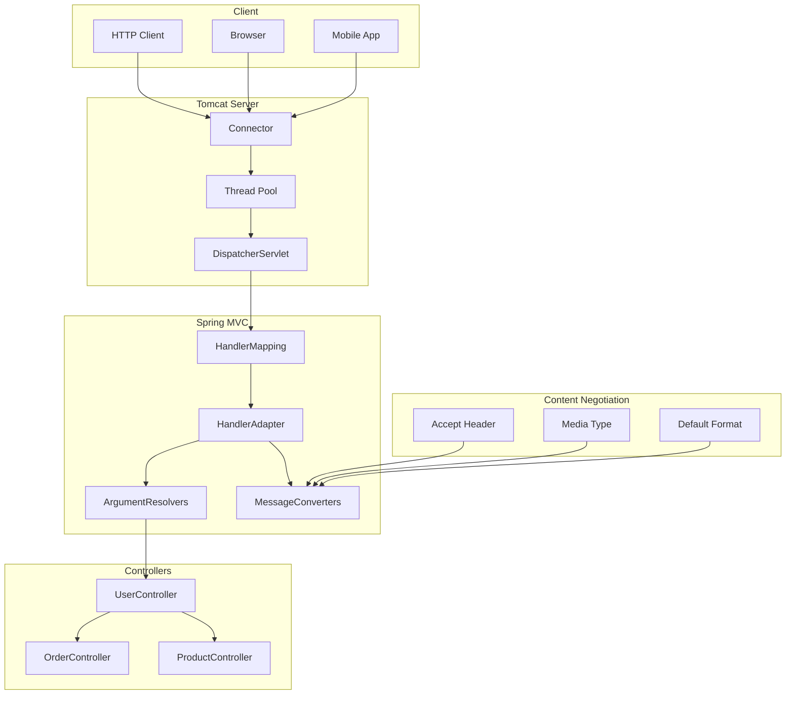
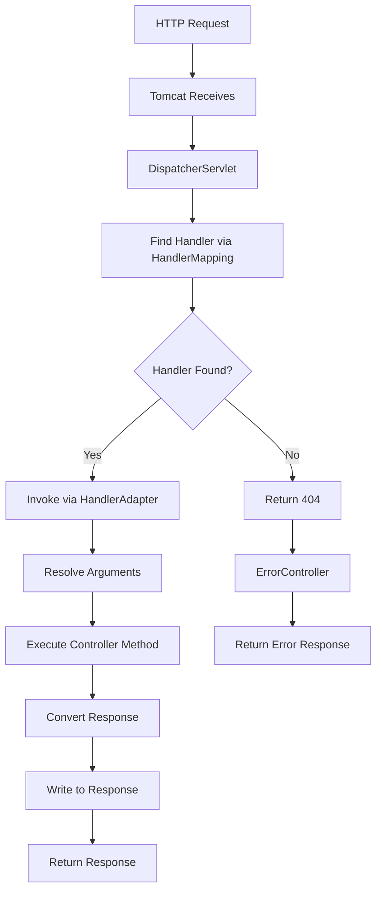

# Module 15.3: Spring Boot Starter Web

## 1. Introduction

The `spring-boot-starter-web` provides everything needed to build web applications and REST APIs. It includes embedded Tomcat, Spring MVC, Jackson for JSON processing, validation, and error handling. This module covers REST controllers, content negotiation, request/response handling, and web layer architecture.

## 2. Learning Objectives

- Master `@RestController` and request mapping
- Understand content negotiation (JSON, XML, etc.)
- Learn request parameter binding (`@RequestParam`, `@PathVariable`, `@RequestBody`)
- Master response handling (`ResponseEntity`, `HttpStatusCode`)
- Understand RESTful API design patterns
- Learn validation in web layer
- Master exception handling in controllers

## 3. Prerequisites

- Spring Boot Fundamentals (Module 15.1)
- HTTP protocol basics (methods, status codes, headers)
- REST API design principles
- JSON format understanding

## 4. Why This Concept Exists

Traditional web development required:
- XML configuration for servlet mappings
- Manual JSON serialization/deserialization
- Explicit error handling for each endpoint
- Manual content negotiation setup

Spring Boot Starter Web provides:
- Embedded Tomcat (no deployment needed)
- Auto-configured Spring MVC
- Jackson auto-configuration for JSON
- Built-in error handling
- Content negotiation support

## 5. Problem Statement

**Without Spring Boot Web:**
```java
// XML-based servlet configuration
// Manual JSON serialization
// No automatic error handling
// External Tomcat deployment required
// Complex DispatcherServlet configuration
```

**With Spring Boot Web:**
```java
@RestController
@RequestMapping("/api")
public class UserController {
    @GetMapping("/{id}")
    public User getUser(@PathVariable Long id) {
        return userService.findById(id);
    }
}
```

## 6. Theory

### 6.1 REST Controller Anatomy

```java
@RestController
@RequestMapping("/api/users")
public class UserController {
    
    @GetMapping
    public List<User> getAllUsers() { ... }
    
    @GetMapping("/{id}")
    public User getUser(@PathVariable Long id) { ... }
    
    @PostMapping
    @ResponseStatus(HttpStatus.CREATED)
    public User createUser(@Valid @RequestBody UserRequest request) { ... }
    
    @PutMapping("/{id}")
    public User updateUser(@PathVariable Long id, @Valid @RequestBody UserRequest request) { ... }
    
    @DeleteMapping("/{id}")
    @ResponseStatus(HttpStatus.NO_CONTENT)
    public void deleteUser(@PathVariable Long id) { ... }
}
```

### 6.2 Content Negotiation

Content negotiation determines response format based on:
1. **Accept header**: Client preference
2. **URL extension**: `.json`, `.xml`
3. **Default format**: Configured in `application.yml`

```yaml
spring:
  mvc:
    contentnegotiation:
      favor-parameter: true
      media-types:
        json: application/json
        xml: application/xml
```

### 6.3 Request Parameter Binding

| Annotation | Source | Example |
|------------|--------|---------|
| `@RequestParam` | Query parameters | `GET /api?name=John` |
| `@PathVariable` | URL path | `GET /api/123` |
| `@RequestBody` | Request body | POST JSON body |
| `@RequestHeader` | HTTP headers | `Accept: application/json` |
| `@CookieValue` | Cookies | `session=abc123` |
| `@ModelAttribute` | Form data | POST form data |

## 7. Internal Working

### 7.1 Request Processing Flow

```
HTTP Request → Tomcat
  → DispatcherServlet
    → HandlerMapping (find controller method)
      → HandlerAdapter (invoke method)
        → ArgumentResolvers (resolve parameters)
          → Controller method executes
            → Return value (Object or ResponseEntity)
              → MessageConverter (Jackson serialization)
                → HTTP Response
```

### 7.2 Argument Resolver Chain

```
@PathVariable → PathVariableMapMethodArgumentResolver
@RequestParam → ServletRequestParamMethodArgumentResolver
@RequestBody → RequestResponseBodyMethodProcessor
@RequestHeader → ServletRequestHeaderMethodArgumentResolver
@CookieValue → ServletCookieValueMethodArgumentResolver
@ModelAttribute → ServletModelAttributeMethodProcessor
```

### 7.3 Message Converter

```
Return Object → HttpMessageConverter → Write
  → Jackson ObjectMapper → JSON byte[]
    → HttpServletResponse.getOutputStream()
```

## 8. JVM Perspective

### 8.1 Embedded Tomcat in Memory

```
JVM Process
├── Tomcat Server (ServerSocket on port 8080)
│   ├── Connector (HTTP protocol handler)
│   ├── ThreadPool (NIO threads)
│   │   ├── Thread-1: Handle request
│   │   ├── Thread-2: Handle request
│   │   └── Thread-N: Handle request
│   ├── Context (/api)
│   │   └── Wrapper (DispatcherServlet)
│   └── Application Filter Chain
├── Spring MVC DispatcherServlet
│   ├── HandlerMapping (URL → Method)
│   ├── HandlerAdapter (Method invocation)
│   └── ViewResolver (not used in REST)
└── Jackson ObjectMapper
    └── Serialization cache (ThreadLocal)
```

### 8.2 Request Processing Thread

```
Tomcat Thread Pool
  → Acceptor (ServerSocket.accept())
    → Poller (NIO event loop)
      → Worker Thread
        → Process Request
          → Create Request/Response objects
            → Call Servlet.service()
              → DispatcherServlet.doDispatch()
                → Execute Controller Method
                  → Return Response
                    → Flush Response
                      → Return Thread to Pool
```

## 9. Memory Representation

### 9.1 Controller Registration

```
ApplicationContext
├── HandlerMapping: RequestMappingHandlerMapping
│   ├── pattern: /api/users/{id}
│   │   └── Handler: UserController#getUser(Long)
│   │       ├── Method: UserController.getUser
│   │       ├── Consumes: []
│   │       ├── Produces: [application/json]
│   │       └── ParameterResolvers: [PathVariableMethodArgumentResolver]
│   └── pattern: /api/users
│       └── Handler: UserController#getAllUsers()
├── HandlerAdapter: RequestMappingHandlerAdapter
│   └── argumentResolvers: List<HandlerMethodArgumentResolver>
└── MessageConverter: MappingJackson2HttpMessageConverter
    └── ObjectMapper (shared instance)
```

### 9.2 Request/Response Memory

```
Request (HttpServletRequest)
├── Parameters: Map<String, String[]>
├── Headers: Map<String, List<String>>
├── Attributes: Map<String, Object>
├── InputStream: ServletInputStream
└── Session: HttpSession (if enabled)

Response (HttpServletResponse)
├── Status: int (200, 404, etc.)
├── Headers: Map<String, List<String>>
├── OutputStream: ServletOutputStream
└── Committed: boolean
```

## 10. Architecture Diagram



## 11. Flow Diagram



## 12. Syntax

### 12.1 Basic Controller

```java
@RestController
@RequestMapping("/api/users")
public class UserController {
    
    @GetMapping
    public List<User> getAll() { ... }
    
    @GetMapping("/{id}")
    public User getById(@PathVariable Long id) { ... }
    
    @PostMapping
    @ResponseStatus(HttpStatus.CREATED)
    public User create(@Valid @RequestBody UserRequest request) { ... }
    
    @PutMapping("/{id}")
    public User update(@PathVariable Long id, @Valid @RequestBody UserRequest request) { ... }
    
    @DeleteMapping("/{id}")
    @ResponseStatus(HttpStatus.NO_CONTENT)
    public void delete(@PathVariable Long id) { ... }
}
```

### 12.2 Request Parameters

```java
@GetMapping("/search")
public Page<User> search(
    @RequestParam(defaultValue = "") String name,
    @RequestParam(defaultValue = "0") int page,
    @RequestParam(defaultValue = "10") int size,
    @RequestParam(required = false) Sort sort
) { ... }
```

### 12.3 Response Entity

```java
@GetMapping("/{id}")
public ResponseEntity<User> getUser(@PathVariable Long id) {
    return userService.findById(id)
        .map(ResponseEntity::ok)
        .orElse(ResponseEntity.notFound().build());
}
```

### 12.4 Content Negotiation

```java
@GetMapping(value = "/{id}", produces = {MediaType.APPLICATION_JSON_VALUE, MediaType.APPLICATION_XML_VALUE})
public User getUser(@PathVariable Long id) { ... }
```

## 13. Easy Example

```java
package academy.javaengineering.springboot;

import org.springframework.boot.SpringApplication;
import org.springframework.boot.autoconfigure.SpringBootApplication;
import org.springframework.web.bind.annotation.*;
import java.util.List;

@SpringBootApplication
@RestController
@RequestMapping("/api/hello")
public class WebStarterExample {
    
    @GetMapping
    public String hello() {
        return "Hello, Spring Boot Web!";
    }
    
    @GetMapping("/{name}")
    public String helloName(@PathVariable String name) {
        return "Hello, " + name + "!";
    }
    
    public static void main(String[] args) {
        SpringApplication.run(WebStarterExample.class, args);
    }
}
```

## 14. Medium Example

```java
package academy.javaengineering.springboot;

import org.springframework.boot.SpringApplication;
import org.springframework.boot.autoconfigure.SpringBootApplication;
import org.springframework.http.HttpStatus;
import org.springframework.http.ResponseEntity;
import org.springframework.web.bind.annotation.*;

import java.util.List;
import java.util.Map;
import java.util.concurrent.ConcurrentHashMap;
import java.util.concurrent.atomic.AtomicLong;

@SpringBootApplication
@RestController
@RequestMapping("/api/users")
public class WebStarterExample {
    
    private final Map<Long, User> users = new ConcurrentHashMap<>();
    private final AtomicLong idGenerator = new AtomicLong(1);
    
    public WebStarterExample() {
        // Sample data
        users.put(1L, new User(1L, "John Doe", "john@example.com"));
        users.put(2L, new User(2L, "Jane Smith", "jane@example.com"));
    }
    
    @GetMapping
    public List<User> getAllUsers() {
        return List.copyOf(users.values());
    }
    
    @GetMapping("/{id}")
    public ResponseEntity<User> getUser(@PathVariable Long id) {
        User user = users.get(id);
        if (user != null) {
            return ResponseEntity.ok(user);
        }
        return ResponseEntity.notFound().build();
    }
    
    @PostMapping
    @ResponseStatus(HttpStatus.CREATED)
    public User createUser(@RequestBody UserRequest request) {
        Long id = idGenerator.incrementAndGet();
        User user = new User(id, request.name(), request.email());
        users.put(id, user);
        return user;
    }
    
    @PutMapping("/{id}")
    public ResponseEntity<User> updateUser(@PathVariable Long id, @RequestBody UserRequest request) {
        if (!users.containsKey(id)) {
            return ResponseEntity.notFound().build();
        }
        User user = new User(id, request.name(), request.email());
        users.put(id, user);
        return ResponseEntity.ok(user);
    }
    
    @DeleteMapping("/{id}")
    @ResponseStatus(HttpStatus.NO_CONTENT)
    public void deleteUser(@PathVariable Long id) {
        users.remove(id);
    }
    
    public static void main(String[] args) {
        SpringApplication.run(WebStarterExample.class, args);
    }
}

record User(Long id, String name, String email) {}
record UserRequest(String name, String email) {}
```

## 15. Hard Example

```java
package academy.javaengineering.springboot;

import org.springframework.boot.SpringApplication;
import org.springframework.boot.autoconfigure.SpringBootApplication;
import org.springframework.data.domain.Page;
import org.springframework.data.domain.PageRequest;
import org.springframework.data.domain.Sort;
import org.springframework.http.HttpHeaders;
import org.springframework.http.HttpStatus;
import org.springframework.http.ResponseEntity;
import org.springframework.web.bind.annotation.*;

import java.time.Instant;
import java.util.List;
import java.util.Map;
import java.util.concurrent.ConcurrentHashMap;
import java.util.concurrent.atomic.AtomicLong;

@SpringBootApplication
@RestController
@RequestMapping("/api/products")
public class WebStarterExample {
    
    private final Map<Long, Product> products = new ConcurrentHashMap<>();
    private final AtomicLong idGenerator = new AtomicLong(1);
    
    public WebStarterExample() {
        // Sample data
        for (int i = 1; i <= 50; i++) {
            products.put((long) i, new Product((long) i, "Product " + i, 19.99 + i, Instant.now()));
        }
    }
    
    @GetMapping
    public ResponseEntity<Page<Product>> getProducts(
            @RequestParam(defaultValue = "0") int page,
            @RequestParam(defaultValue = "10") int size,
            @RequestParam(defaultValue = "id") String sortBy,
            @RequestParam(defaultValue = "asc") String sortDir,
            @RequestParam(required = false) String search) {
        
        Sort sort = sortDir.equalsIgnoreCase("desc") ? 
            Sort.by(sortBy).descending() : Sort.by(sortBy).ascending();
        
        PageRequest pageRequest = PageRequest.of(page, size, sort);
        
        // Simple filtering
        List<Product> filtered = search != null ? 
            products.values().stream()
                .filter(p -> p.name().toLowerCase().contains(search.toLowerCase()))
                .toList() : 
            List.copyOf(products.values());
        
        // Create page manually for demo
        int start = (int) pageRequest.getOffset();
        int end = Math.min(start + pageRequest.getPageSize(), filtered.size());
        
        Page<Product> pageResult = new org.springframework.data.domain.PageImpl<>(
            filtered.subList(start, end),
            pageRequest,
            filtered.size()
        );
        
        HttpHeaders headers = new HttpHeaders();
        headers.add("X-Total-Count", String.valueOf(filtered.size()));
        
        return new ResponseEntity<>(pageResult, headers, HttpStatus.OK);
    }
    
    @GetMapping("/{id}")
    public ResponseEntity<Product> getProduct(@PathVariable Long id) {
        Product product = products.get(id);
        if (product != null) {
            return ResponseEntity.ok(product);
        }
        return ResponseEntity.notFound().build();
    }
    
    @PostMapping
    @ResponseStatus(HttpStatus.CREATED)
    public Product createProduct(@RequestBody ProductRequest request) {
        Long id = idGenerator.incrementAndGet();
        Product product = new Product(id, request.name(), request.price(), Instant.now());
        products.put(id, product);
        return product;
    }
    
    @PutMapping("/{id}")
    public ResponseEntity<Product> updateProduct(@PathVariable Long id, @RequestBody ProductRequest request) {
        if (!products.containsKey(id)) {
            return ResponseEntity.notFound().build();
        }
        Product product = new Product(id, request.name(), request.price(), products.get(id).createdAt());
        products.put(id, product);
        return ResponseEntity.ok(product);
    }
    
    @DeleteMapping("/{id}")
    @ResponseStatus(HttpStatus.NO_CONTENT)
    public void deleteProduct(@PathVariable Long id) {
        products.remove(id);
    }
    
    public static void main(String[] args) {
        SpringApplication.run(WebStarterExample.class, args);
    }
}

record Product(Long id, String name, Double price, Instant createdAt) {}
record ProductRequest(String name, Double price) {}
```

## 16. Enterprise Example

```java
package academy.javaengineering.springboot;

import org.springframework.boot.SpringApplication;
import org.springframework.boot.autoconfigure.SpringBootApplication;
import org.springframework.data.domain.Page;
import org.springframework.data.domain.PageRequest;
import org.springframework.data.domain.Sort;
import org.springframework.http.HttpStatus;
import org.springframework.http.ResponseEntity;
import org.springframework.validation.annotation.Validated;
import org.springframework.web.bind.annotation.*;

import jakarta.validation.Valid;
import jakarta.validation.constraints.*;
import java.time.Instant;
import java.util.Map;
import java.util.Optional;
import java.util.UUID;
import java.util.concurrent.ConcurrentHashMap;

@SpringBootApplication
@RestController
@RequestMapping("/api/v1/orders")
@Validated
public class WebStarterExample {
    
    private final Map<String, Order> orders = new ConcurrentHashMap<>();
    
    public WebStarterExample() {
        // Sample data
        orders.put("ORD-001", new Order("ORD-001", "CUST-001", 150.00, OrderStatus.CONFIRMED, Instant.now()));
        orders.put("ORD-002", new Order("ORD-002", "CUST-002", 299.99, OrderStatus.PENDING, Instant.now()));
    }
    
    @GetMapping
    public ResponseEntity<Page<Order>> getOrders(
            @RequestParam(defaultValue = "0") @Min(0) int page,
            @RequestParam(defaultValue = "20") @Min(1) @Max(100) int size,
            @RequestParam(required = false) OrderStatus status) {
        
        PageRequest pageRequest = PageRequest.of(page, size, Sort.by("createdAt").descending());
        
        // Filter by status if provided
        var filteredOrders = status != null ? 
            orders.values().stream().filter(o -> o.status() == status).toList() :
            orders.values().stream().toList();
        
        // Create page
        int start = (int) pageRequest.getOffset();
        int end = Math.min(start + pageRequest.getPageSize(), filteredOrders.size());
        var pagedOrders = filteredOrders.subList(start, end);
        
        Page<Order> pageResult = new org.springframework.data.domain.PageImpl<>(
            pagedOrders, pageRequest, filteredOrders.size()
        );
        
        return ResponseEntity.ok(pageResult);
    }
    
    @GetMapping("/{orderId}")
    public ResponseEntity<Order> getOrder(@PathVariable @NotBlank String orderId) {
        return Optional.ofNullable(orders.get(orderId))
            .map(ResponseEntity::ok)
            .orElse(ResponseEntity.notFound().build());
    }
    
    @PostMapping
    @ResponseStatus(HttpStatus.CREATED)
    public ResponseEntity<Order> createOrder(@Valid @RequestBody CreateOrderRequest request) {
        String orderId = "ORD-" + UUID.randomUUID().toString().substring(0, 8).toUpperCase();
        Order order = new Order(orderId, request.customerId(), request.totalAmount(), OrderStatus.PENDING, Instant.now());
        orders.put(orderId, order);
        return ResponseEntity.status(HttpStatus.CREATED).body(order);
    }
    
    @PatchMapping("/{orderId}/status")
    public ResponseEntity<Order> updateOrderStatus(
            @PathVariable @NotBlank String orderId,
            @RequestBody UpdateStatusRequest request) {
        
        Order order = orders.get(orderId);
        if (order == null) {
            return ResponseEntity.notFound().build();
        }
        
        Order updatedOrder = order.withStatus(request.status());
        orders.put(orderId, updatedOrder);
        return ResponseEntity.ok(updatedOrder);
    }
    
    @DeleteMapping("/{orderId}")
    @ResponseStatus(HttpStatus.NO_CONTENT)
    public ResponseEntity<Void> deleteOrder(@PathVariable @NotBlank String orderId) {
        if (orders.remove(orderId) != null) {
            return ResponseEntity.noContent().build();
        }
        return ResponseEntity.notFound().build();
    }
    
    public static void main(String[] args) {
        SpringApplication.run(WebStarterExample.class, args);
    }
}

record Order(
    String orderId,
    String customerId,
    Double totalAmount,
    OrderStatus status,
    Instant createdAt
) {
    public Order withStatus(OrderStatus newStatus) {
        return new Order(orderId, customerId, totalAmount, newStatus, createdAt);
    }
}

enum OrderStatus {
    PENDING, CONFIRMED, SHIPPED, DELIVERED, CANCELLED
}

record CreateOrderRequest(
    @NotBlank String customerId,
    @NotNull @Positive Double totalAmount
) {}

record UpdateStatusRequest(
    @NotNull OrderStatus status
) {}
```

## 17. Performance

| Metric | Value | Notes |
|--------|-------|-------|
| Request Throughput | 10,000+ req/s | Depends on controller complexity |
| JSON Serialization | ~0.1ms per object | Jackson performance |
| Memory per Thread | ~1MB | Tomcat thread stack |
| Startup Time | ~2-3s | Including embedded Tomcat |
| Max Concurrent Connections | 10,000+ | Depends on thread pool config |

## 18. Time & Space Complexity

| Operation | Time | Space | Notes |
|-----------|------|-------|-------|
| Request Routing | O(1) | O(1) | URL pattern matching |
| Argument Resolution | O(a) | O(a) | a = parameters |
| JSON Serialization | O(n) | O(n) | n = object size |
| Content Negotiation | O(1) | O(1) | Header parsing |
| Page Construction | O(n) | O(n) | n = page size |

## 19. Thread Safety

- **Controller Beans**: Singleton by default; must be thread-safe
- **Request Parameters**: Per-request; no thread safety issues
- **Response Objects**: Created per request; thread-safe
- **Jackson ObjectMapper**: Thread-safe for serialization
- **Session State**: Thread-safe with proper synchronization

## 20. Best Practices

1. **Use ResponseEntity**: Always return `ResponseEntity` for fine-grained control
2. **Validate Input**: Use `@Valid` with Jakarta Validation
3. **Version APIs**: Use `/api/v1/` prefix
4. **Use DTOs**: Never expose domain entities directly
5. **Pagination**: Always paginate list endpoints
6. **Use HTTP Status Codes**: Return appropriate status codes
7. **Handle Exceptions**: Use `@ControllerAdvice` for global error handling
8. **Document APIs**: Use SpringDoc OpenAPI

## 21. Common Mistakes

1. **Missing @RestController**: Using `@Controller` instead (returns view names)
2. **Returning void**: Always return a response body
3. **No validation**: Not validating `@RequestBody`
4. **Hardcoding status codes**: Use `@ResponseStatus` or `ResponseEntity`
5. **Ignoring content type**: Not specifying `produces`/`consumes`
6. **No error handling**: Not handling exceptions in controllers

## 22. Pitfalls

- **Circular Dependencies**: Controllers depending on each other
- **Thread Local Leaks**: Using ThreadLocal without proper cleanup
- **Memory Leaks**: Storing large objects in session
- **Blocking I/O**: Making blocking calls in controller methods
- **Missing @RequestBody**: Forgetting annotation for POST/PUT bodies

## 23. Debugging Tips

1. **Enable request logging**: `logging.level.org.springframework.web=DEBUG`
2. **Check content type**: Verify Accept and Content-Type headers
3. **Use Actuator**: Check `/actuator/mappings` for endpoint info
4. **Validate JSON**: Ensure request body matches DTO structure
5. **Check status codes**: Verify HTTP status codes in responses

## 24. Comparison Table

| Feature | @RestController | @Controller |
|---------|-----------------|-------------|
| Return Type | Response Body | View Name |
| Content Negotiation | Automatic | Manual |
| Use Case | REST APIs | MVC Views |
| @ResponseBody | Implicit | Required |
| JSON Support | Built-in | Manual |

| HTTP Method | Annotation | Use Case |
|-------------|------------|----------|
| GET | @GetMapping | Read resources |
| POST | @PostMapping | Create resources |
| PUT | @PutMapping | Update/Replace resources |
| PATCH | @PatchMapping | Partial update |
| DELETE | @DeleteMapping | Delete resources |

## 25. Decision Tree

```
Do you need a REST endpoint?
├── Yes → Use @RestController
│   ├── Do you need fine-grained response control?
│   │   ├── Yes → Return ResponseEntity
│   │   └── No → Return domain object directly
│   ├── Do you need to validate input?
│   │   ├── Yes → Use @Valid with @RequestBody
│   │   └── No → Validate manually
│   └── Do you need pagination?
│       ├── Yes → Use Spring Data Page
│       └── No → Return list
└── No → Do you need a view?
    ├── Yes → Use @Controller
    └── No → Use @Service or @Component
```

## 26. Interview Questions

1. What is the difference between `@RestController` and `@Controller`?
2. Explain the request processing flow in Spring MVC.
3. How does content negotiation work in Spring Boot?
4. What is the purpose of `ResponseEntity`?
5. How do you handle exceptions in REST controllers?
6. Explain the difference between `@RequestParam` and `@PathVariable`.
7. How do you implement pagination in Spring Boot REST APIs?
8. What is the role of `HandlerMapping` in Spring MVC?
9. How do you version a REST API?
10. Explain the difference between PUT and PATCH.
11. How do you handle file uploads in Spring Boot?
12. What is CORS and how do you configure it?
13. How do you implement HATEOAS in Spring Boot?
14. Explain the role of `MessageConverter`.
15. How do you secure REST endpoints?

## 27. Exercises

### Beginner
1. Create a CRUD REST API for a simple entity (User, Product, etc.)
2. Implement pagination for the list endpoint
3. Add input validation using `@Valid`

### Intermediate
4. Implement content negotiation for JSON and XML responses
5. Create a REST API with custom exception handling
6. Implement file upload endpoint with validation

### Advanced
7. Build a REST API with HATEOAS support
8. Implement rate limiting for API endpoints
9. Create a REST API with OpenAPI documentation
10. Build a REST API with WebSocket support

## 28. Summary

Spring Boot Starter Web provides a complete web development stack with embedded Tomcat, Spring MVC, and Jackson. Understanding request mapping, parameter binding, content negotiation, and response handling is essential for building robust REST APIs.

## 29. References

- [Spring Web MVC](https://docs.spring.io/spring-framework/reference/web/webmvc.html)
- [Building REST Services](https://spring.io/guides/gs/rest-service)
- [Spring Boot Web](https://docs.spring.io/spring-boot/docs/current/reference/htmlsingle/#web)
- [Content Negotiation](https://docs.spring.io/spring-framework/reference/web/webmvc/mvc-config/content-negotiation.html)
- [Jackson Documentation](https://github.com/FasterXML/jackson-docs)
