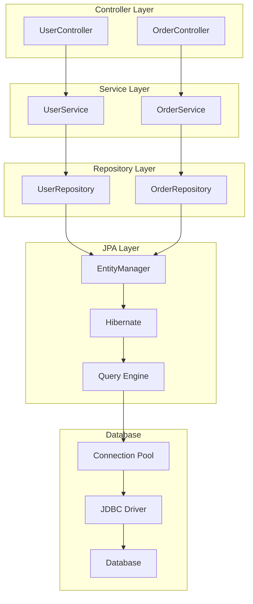
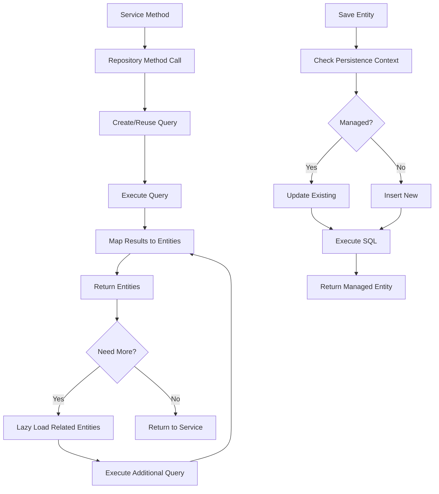

# Module 15.4: Spring Boot Starter Data JPA

## 1. Introduction

The `spring-boot-starter-data-jpa` provides JPA (Java Persistence API) support with Hibernate as the default implementation. It simplifies database access through repository abstraction, entity management, and automatic query generation. This module covers JPA entities, repositories, relationships, auditing, and query methods.

## 2. Learning Objectives

- Master JPA entity mapping and relationships
- Understand Spring Data JPA repositories
- Learn query derivation and custom queries
- Implement auditing (created/modified timestamps)
- Understand transaction management
- Learn advanced JPA features (specifications, projections, auditing)

## 3. Prerequisites

- Spring Boot Fundamentals (Module 15.1)
- SQL and relational database basics
- Object-Relational Mapping concepts
- Transaction management basics

## 4. Why This Concept Exists

Traditional data access required:
- Writing SQL queries manually
- Mapping results to objects
- Managing connections and transactions
- Boilerplate repository code

Spring Data JPA provides:
- Repository abstraction (CRUD without SQL)
- Automatic query derivation from method names
- Transaction management
- Auditing support
- Pagination and sorting

## 5. Problem Statement

**Without Spring Data JPA:**
```java
// Manual JDBC code
Connection conn = dataSource.getConnection();
PreparedStatement ps = conn.prepareStatement("SELECT * FROM users WHERE id = ?");
ps.setLong(1, id);
ResultSet rs = ps.executeQuery();
// Manual mapping
User user = new User();
user.setId(rs.getLong("id"));
user.setName(rs.getString("name"));
```

**With Spring Data JPA:**
```java
public interface UserRepository extends JpaRepository<User, Long> {
    Optional<User> findByName(String name);
}

// Usage
User user = userRepository.findById(id).orElseThrow();
```

## 6. Theory

### 6.1 JPA Entity Mapping

```java
@Entity
@Table(name = "users")
public class User {
    @Id
    @GeneratedValue(strategy = GenerationType.IDENTITY)
    private Long id;
    
    @Column(nullable = false, length = 100)
    private String name;
    
    @Column(unique = true, nullable = false)
    private String email;
    
    @OneToMany(mappedBy = "user", cascade = CascadeType.ALL)
    private List<Order> orders = new ArrayList<>();
}
```

### 6.2 Repository Hierarchy

```
Repository (marker interface)
├── CrudRepository<T, ID>
│   ├── save(S entity): T
│   ├── findById(ID id): Optional<T>
│   ├── findAll(): Iterable<T>
│   ├── deleteById(ID id): void
│   └── count(): long
├── PagingAndSortingRepository<T, ID>
│   ├── findAll(Pageable pageable): Page<T>
│   └── findAll(Sort sort): Iterable<T>
└── JpaRepository<T, ID>
    ├── flush(): void
    ├── saveAndFlush(S entity): T
    └── deleteInBatch(Iterable<T> entities): void
```

### 6.3 Query Derivation

Method name patterns:
```java
// Simple property
findByName(String name): List<T>

// Multiple properties
findByNameAndEmail(String name, String email): Optional<T>

// Comparison operators
findByAgeGreaterThan(int age): List<T>
findByPriceBetween(double min, double max): List<T>

// Ordering
findByNameOrderByCreatedAtDesc(String name): List<T>

// Pagination
findByName(String name, Pageable pageable): Page<T>
```

## 7. Internal Working

### 7.1 Repository Proxy Mechanism

```
Interface: UserRepository
  → ProxyFactory creates JDK Proxy
    → Method invocation handler
      → Query lookup strategy
        → Derived query (method name)
          → JPQL generation
            → Query execution
              → Result mapping
```

### 7.2 Query Creation Flow

```
UserRepository.findByName("John")
  → QueryCreator.parse("findByName")
    → Identify method pattern: "findBy" + property
      → Property: "name"
        → Operator: equals (default)
          → Generate JPQL: "SELECT u FROM User u WHERE u.name = ?1"
            → Execute query with parameter binding
```

### 7.3 Transaction Management

```
@Transactional(propagation = REQUIRED)
  → TransactionInterceptor
    → PlatformTransactionManager
      → Begin Transaction
        → Execute method
          → If success → Commit
          → If exception → Rollback
```

## 8. JVM Perspective

### 8.1 Entity Proxy

```
User entity (managed by JPA)
├── Entity Proxy (CGLIB or ByteBuddy)
│   ├── Lazy loading fields
│   ├── Change tracking
│   └── Identity (id field)
├── Persistence Context
│   ├── First Level Cache
│   └── Dirty Checking
└── SQL Generation
    → JPQL to SQL translation
    → Prepared Statement creation
```

### 8.2 Connection Pool

```
HikariCP Connection Pool
├── Pool Configuration
│   ├── maximumPoolSize: 10
│   ├── minimumIdle: 5
│   └── connectionTimeout: 30000ms
├── Connection Pool
│   ├── Active Connections: 3
│   ├── Idle Connections: 7
│   └── Waiting Threads: 0
└── Connection Validation
    → Test query: SELECT 1
    → Validation timeout: 5000ms
```

## 9. Memory Representation

### 9.1 Persistence Context

```
EntityManager (PersistenceContext)
├── Entity Cache
│   ├── User@1: {id=1, name="John", email="john@example.com"}
│   ├── User@2: {id=2, name="Jane", email="jane@example.com"}
│   └── User@3: {id=3, name="Bob", email="bob@example.com"}
├── Entity State
│   ├── MANAGED: User@1, User@2
│   ├── NEW: User@3
│   └── REMOVED: (none)
└── Query Cache
    └── QueryPlan cache for JPQL parsing
```

### 9.2 Relationship Mapping

```
User (1) ←→ (N) Order
├── User.orders: List<Order> (lazy loaded)
│   ├── Proxy object (not initialized)
│   └── When accessed → SQL query executed
├── Order.user: User (eager loaded)
│   └── Actual User object reference
└── Join Table: user_id, order_id
```

## 10. Architecture Diagram



## 11. Flow Diagram



## 12. Syntax

### 12.1 Entity Definition

```java
@Entity
@Table(name = "users")
@Getter
@Setter
@NoArgsConstructor
@AllArgsConstructor
@Builder
public class User {
    @Id
    @GeneratedValue(strategy = GenerationType.IDENTITY)
    private Long id;
    
    @Column(nullable = false, length = 100)
    private String name;
    
    @Column(unique = true, nullable = false)
    private String email;
    
    @CreationTimestamp
    private Instant createdAt;
    
    @UpdateTimestamp
    private Instant updatedAt;
    
    @OneToMany(mappedBy = "user", cascade = CascadeType.ALL, fetch = FetchType.LAZY)
    private List<Order> orders = new ArrayList<>();
}
```

### 12.2 Repository Interface

```java
public interface UserRepository extends JpaRepository<User, Long> {
    Optional<User> findByEmail(String email);
    List<User> findByNameContaining(String name);
    Page<User> findByName(String name, Pageable pageable);
    
    @Query("SELECT u FROM User u WHERE u.name LIKE %:name%")
    List<User> searchByName(@Param("name") String name);
    
    @Modifying
    @Query("UPDATE User u SET u.name = :name WHERE u.id = :id")
    int updateName(@Param("id") Long id, @Param("name") String name);
}
```

### 12.3 Service Layer

```java
@Service
@Transactional
public class UserService {
    private final UserRepository userRepository;
    
    public UserService(UserRepository userRepository) {
        this.userRepository = userRepository;
    }
    
    public User createUser(UserRequest request) {
        User user = User.builder()
            .name(request.name())
            .email(request.email())
            .build();
        return userRepository.save(user);
    }
    
    @Transactional(readOnly = true)
    public Optional<User> getUser(Long id) {
        return userRepository.findById(id);
    }
}
```

## 13. Easy Example

```java
package academy.javaengineering.springboot;

import jakarta.persistence.*;
import org.springframework.boot.SpringApplication;
import org.springframework.boot.autoconfigure.SpringBootApplication;
import org.springframework.data.jpa.repository.JpaRepository;
import org.springframework.stereotype.Service;
import org.springframework.web.bind.annotation.*;

import java.util.List;

@SpringBootApplication
public class DataJpaStarterExample {
    
    public static void main(String[] args) {
        SpringApplication.run(DataJpaStarterExample.class, args);
    }
}

@Entity
@Table(name = "users")
class User {
    @Id
    @GeneratedValue(strategy = GenerationType.IDENTITY)
    private Long id;
    
    @Column(nullable = false)
    private String name;
    
    @Column(nullable = false)
    private String email;
    
    // Getters and Setters
    public Long getId() { return id; }
    public void setId(Long id) { this.id = id; }
    public String getName() { return name; }
    public void setName(String name) { this.name = name; }
    public String getEmail() { return email; }
    public void setEmail(String email) { this.email = email; }
}

interface UserRepository extends JpaRepository<User, Long> {
    List<User> findByName(String name);
}

@RestController
@RequestMapping("/api/users")
class UserController {
    private final UserRepository userRepository;
    
    UserController(UserRepository userRepository) {
        this.userRepository = userRepository;
    }
    
    @GetMapping
    public List<User> getAll() {
        return userRepository.findAll();
    }
    
    @PostMapping
    public User create(@RequestBody User user) {
        return userRepository.save(user);
    }
}
```

## 14. Medium Example

```java
package academy.javaengineering.springboot;

import jakarta.persistence.*;
import org.springframework.boot.SpringApplication;
import org.springframework.boot.autoconfigure.SpringBootApplication;
import org.springframework.data.jpa.repository.JpaRepository;
import org.springframework.data.jpa.repository.Query;
import org.springframework.data.repository.query.Param;
import org.springframework.stereotype.Service;
import org.springframework.web.bind.annotation.*;

import java.time.Instant;
import java.util.List;
import java.util.Optional;

@SpringBootApplication
public class DataJpaStarterExample {
    public static void main(String[] args) {
        SpringApplication.run(DataJpaStarterExample.class, args);
    }
}

@Entity
@Table(name = "products")
class Product {
    @Id
    @GeneratedValue(strategy = GenerationType.IDENTITY)
    private Long id;
    
    @Column(nullable = false, length = 100)
    private String name;
    
    @Column(nullable = false)
    private String description;
    
    @Column(nullable = false)
    private Double price;
    
    @Column(nullable = false)
    private Integer stockQuantity;
    
    @ManyToOne(fetch = FetchType.LAZY)
    @JoinColumn(name = "category_id")
    private Category category;
    
    @Column(nullable = false)
    private Instant createdAt;
    
    @PrePersist
    protected void onCreate() {
        createdAt = Instant.now();
    }
    
    // Getters and Setters
    public Long getId() { return id; }
    public void setId(Long id) { this.id = id; }
    public String getName() { return name; }
    public void setName(String name) { this.name = name; }
    public String getDescription() { return description; }
    public void setDescription(String description) { this.description = description; }
    public Double getPrice() { return price; }
    public void setPrice(Double price) { this.price = price; }
    public Integer getStockQuantity() { return stockQuantity; }
    public void setStockQuantity(Integer stockQuantity) { this.stockQuantity = stockQuantity; }
    public Category getCategory() { return category; }
    public void setCategory(Category category) { this.category = category; }
    public Instant getCreatedAt() { return createdAt; }
}

@Entity
@Table(name = "categories")
class Category {
    @Id
    @GeneratedValue(strategy = GenerationType.IDENTITY)
    private Long id;
    
    @Column(nullable = false, unique = true)
    private String name;
    
    @OneToMany(mappedBy = "category", cascade = CascadeType.ALL)
    private List<Product> products;
    
    // Getters and Setters
    public Long getId() { return id; }
    public void setId(Long id) { this.id = id; }
    public String getName() { return name; }
    public void setName(String name) { this.name = name; }
    public List<Product> getProducts() { return products; }
    public void setProducts(List<Product> products) { this.products = products; }
}

interface ProductRepository extends JpaRepository<Product, Long> {
    List<Product> findByNameContaining(String name);
    List<Product> findByPriceBetween(Double min, Double max);
    List<Product> findByCategoryId(Long categoryId);
    
    @Query("SELECT p FROM Product p WHERE p.price < :price ORDER BY p.createdAt DESC")
    List<Product> findCheapProducts(@Param("price") Double price);
    
    @Query("SELECT p FROM Product p WHERE p.category.name = :categoryName")
    List<Product> findByCategoryName(@Param("categoryName") String categoryName);
}

interface CategoryRepository extends JpaRepository<Category, Long> {
    Optional<Category> findByName(String name);
}

@Service
class ProductService {
    private final ProductRepository productRepository;
    private final CategoryRepository categoryRepository;
    
    ProductService(ProductRepository productRepository, CategoryRepository categoryRepository) {
        this.productRepository = productRepository;
        this.categoryRepository = categoryRepository;
    }
    
    public List<Product> searchProducts(String name, Double minPrice, Double maxPrice) {
        if (name != null) {
            return productRepository.findByNameContaining(name);
        }
        if (minPrice != null && maxPrice != null) {
            return productRepository.findByPriceBetween(minPrice, maxPrice);
        }
        return productRepository.findAll();
    }
}

@RestController
@RequestMapping("/api/products")
class ProductController {
    private final ProductService productService;
    private final ProductRepository productRepository;
    
    ProductController(ProductService productService, ProductRepository productRepository) {
        this.productService = productService;
        this.productRepository = productRepository;
    }
    
    @GetMapping
    public List<Product> search(
            @RequestParam(required = false) String name,
            @RequestParam(required = false) Double minPrice,
            @RequestParam(required = false) Double maxPrice) {
        return productService.searchProducts(name, minPrice, maxPrice);
    }
    
    @GetMapping("/{id}")
    public Product getById(@PathVariable Long id) {
        return productRepository.findById(id).orElseThrow();
    }
    
    @PostMapping
    public Product create(@RequestBody Product product) {
        return productRepository.save(product);
    }
}
```

## 15. Hard Example

```java
package academy.javaengineering.springboot;

import jakarta.persistence.*;
import org.springframework.boot.SpringApplication;
import org.springframework.boot.autoconfigure.SpringBootApplication;
import org.springframework.data.jpa.repository.JpaRepository;
import org.springframework.data.jpa.repository.JpaSpecificationExecutor;
import org.springframework.data.jpa.repository.Query;
import org.springframework.data.repository.query.Param;
import org.springframework.stereotype.Service;
import org.springframework.web.bind.annotation.*;

import java.time.Instant;
import java.util.List;

@SpringBootApplication
public class DataJpaStarterExample {
    public static void main(String[] args) {
        SpringApplication.run(DataJpaStarterExample.class, args);
    }
}

@Entity
@Table(name = "customers")
class Customer {
    @Id
    @GeneratedValue(strategy = GenerationType.IDENTITY)
    private Long id;
    
    @Column(nullable = false, length = 100)
    private String name;
    
    @Column(nullable = false, unique = true)
    private String email;
    
    @Column(nullable = false)
    private String phone;
    
    @Enumerated(EnumType.STRING)
    @Column(nullable = false)
    private CustomerStatus status;
    
    @Column(nullable = false)
    private Instant createdAt;
    
    @Column(nullable = false)
    private Instant updatedAt;
    
    @Version
    private Long version;
    
    @PrePersist
    protected void onCreate() {
        createdAt = Instant.now();
        updatedAt = Instant.now();
    }
    
    @PreUpdate
    protected void onUpdate() {
        updatedAt = Instant.now();
    }
    
    // Getters and Setters
    public Long getId() { return id; }
    public void setId(Long id) { this.id = id; }
    public String getName() { return name; }
    public void setName(String name) { this.name = name; }
    public String getEmail() { return email; }
    public void setEmail(String email) { this.email = email; }
    public String getPhone() { return phone; }
    public void setPhone(String phone) { this.phone = phone; }
    public CustomerStatus getStatus() { return status; }
    public void setStatus(CustomerStatus status) { this.status = status; }
    public Instant getCreatedAt() { return createdAt; }
    public Instant getUpdatedAt() { return updatedAt; }
    public Long getVersion() { return version; }
}

enum CustomerStatus {
    ACTIVE, INACTIVE, SUSPENDED
}

@Entity
@Table(name = "orders")
class Order {
    @Id
    @GeneratedValue(strategy = GenerationType.IDENTITY)
    private Long id;
    
    @Column(nullable = false, unique = true)
    private String orderNumber;
    
    @ManyToOne(fetch = FetchType.LAZY)
    @JoinColumn(name = "customer_id", nullable = false)
    private Customer customer;
    
    @Column(nullable = false)
    private Double totalAmount;
    
    @Enumerated(EnumType.STRING)
    @Column(nullable = false)
    private OrderStatus status;
    
    @Column(nullable = false)
    private Instant orderDate;
    
    @Column(nullable = false)
    private Instant createdAt;
    
    @Column(nullable = false)
    private Instant updatedAt;
    
    @Version
    private Long version;
    
    @PrePersist
    protected void onCreate() {
        createdAt = Instant.now();
        updatedAt = Instant.now();
    }
    
    @PreUpdate
    protected void onUpdate() {
        updatedAt = Instant.now();
    }
    
    // Getters and Setters
    public Long getId() { return id; }
    public void setId(Long id) { this.id = id; }
    public String getOrderNumber() { return orderNumber; }
    public void setOrderNumber(String orderNumber) { this.orderNumber = orderNumber; }
    public Customer getCustomer() { return customer; }
    public void setCustomer(Customer customer) { this.customer = customer; }
    public Double getTotalAmount() { return totalAmount; }
    public void setTotalAmount(Double totalAmount) { this.totalAmount = totalAmount; }
    public OrderStatus getStatus() { return status; }
    public void setStatus(OrderStatus status) { this.status = status; }
    public Instant getOrderDate() { return orderDate; }
    public Instant getCreatedAt() { return createdAt; }
    public Instant getUpdatedAt() { return updatedAt; }
    public Long getVersion() { return version; }
}

enum OrderStatus {
    PENDING, CONFIRMED, SHIPPED, DELIVERED, CANCELLED
}

interface CustomerRepository extends JpaRepository<Customer, Long>, JpaSpecificationExecutor<Customer> {
    List<Customer> findByStatus(CustomerStatus status);
    boolean existsByEmail(String email);
    
    @Query("SELECT c FROM Customer c WHERE c.name LIKE %:name% AND c.status = :status")
    List<Customer> searchByNameAndStatus(@Param("name") String name, @Param("status") CustomerStatus status);
}

interface OrderRepository extends JpaRepository<Order, Long>, JpaSpecificationExecutor<Order> {
    List<Order> findByCustomerId(Long customerId);
    List<Order> findByStatus(OrderStatus status);
    
    @Query("SELECT o FROM Order o WHERE o.customer.id = :customerId AND o.status = :status")
    List<Order> findByCustomerAndStatus(@Param("customerId") Long customerId, @Param("status") OrderStatus status);
    
    @Query("SELECT SUM(o.totalAmount) FROM Order o WHERE o.customer.id = :customerId")
    Double getTotalAmountByCustomerId(@Param("customerId") Long customerId);
}

@Service
class OrderService {
    private final OrderRepository orderRepository;
    private final CustomerRepository customerRepository;
    
    OrderService(OrderRepository orderRepository, CustomerRepository customerRepository) {
        this.orderRepository = orderRepository;
        this.customerRepository = customerRepository;
    }
    
    public Order createOrder(Long customerId, Order order) {
        Customer customer = customerRepository.findById(customerId).orElseThrow();
        order.setCustomer(customer);
        order.setOrderNumber("ORD-" + System.currentTimeMillis());
        order.setOrderDate(Instant.now());
        return orderRepository.save(order);
    }
    
    public List<Order> getCustomerOrders(Long customerId) {
        return orderRepository.findByCustomerId(customerId);
    }
}

@RestController
@RequestMapping("/api/orders")
class OrderController {
    private final OrderService orderService;
    private final OrderRepository orderRepository;
    
    OrderController(OrderService orderService, OrderRepository orderRepository) {
        this.orderService = orderService;
        this.orderRepository = orderRepository;
    }
    
    @PostMapping("/customer/{customerId}")
    public Order createOrder(@PathVariable Long customerId, @RequestBody Order order) {
        return orderService.createOrder(customerId, order);
    }
    
    @GetMapping("/customer/{customerId}")
    public List<Order> getCustomerOrders(@PathVariable Long customerId) {
        return orderService.getCustomerOrders(customerId);
    }
    
    @GetMapping("/stats/{customerId}")
    public OrderStats getCustomerStats(@PathVariable Long customerId) {
        Double totalAmount = orderRepository.getTotalAmountByCustomerId(customerId);
        List<Order> orders = orderRepository.findByCustomerId(customerId);
        return new OrderStats(orders.size(), totalAmount != null ? totalAmount : 0.0);
    }
}

record OrderStats(int orderCount, double totalAmount) {}
```

## 16. Enterprise Example

```java
package academy.javaengineering.springboot;

import jakarta.persistence.*;
import org.springframework.boot.SpringApplication;
import org.springframework.boot.autoconfigure.SpringBootApplication;
import org.springframework.data.domain.Page;
import org.springframework.data.domain.PageRequest;
import org.springframework.data.domain.Sort;
import org.springframework.data.jpa.repository.JpaRepository;
import org.springframework.data.jpa.repository.JpaSpecificationExecutor;
import org.springframework.data.jpa.repository.Query;
import org.springframework.data.repository.query.Param;
import org.springframework.stereotype.Service;
import org.springframework.transaction.annotation.Transactional;
import org.springframework.web.bind.annotation.*;

import java.time.Instant;
import java.util.List;

@SpringBootApplication
public class DataJpaStarterExample {
    public static void main(String[] args) {
        SpringApplication.run(DataJpaStarterExample.class, args);
    }
}

@Entity
@Table(name = "accounts")
class Account {
    @Id
    @GeneratedValue(strategy = GenerationType.IDENTITY)
    private Long id;
    
    @Column(nullable = false, unique = true)
    private String accountNumber;
    
    @Column(nullable = false)
    private String accountHolderName;
    
    @Column(nullable = false)
    private Double balance;
    
    @Enumerated(EnumType.STRING)
    @Column(nullable = false)
    private AccountStatus status;
    
    @Column(nullable = false)
    private Instant createdAt;
    
    @Column(nullable = false)
    private Instant updatedAt;
    
    @Version
    private Long version;
    
    @PrePersist
    protected void onCreate() {
        createdAt = Instant.now();
        updatedAt = Instant.now();
    }
    
    @PreUpdate
    protected void onUpdate() {
        updatedAt = Instant.now();
    }
    
    // Getters and Setters
    public Long getId() { return id; }
    public void setId(Long id) { this.id = id; }
    public String getAccountNumber() { return accountNumber; }
    public void setAccountNumber(String accountNumber) { this.accountNumber = accountNumber; }
    public String getAccountHolderName() { return accountHolderName; }
    public void setAccountHolderName(String accountHolderName) { this.accountHolderName = accountHolderName; }
    public Double getBalance() { return balance; }
    public void setBalance(Double balance) { this.balance = balance; }
    public AccountStatus getStatus() { return status; }
    public void setStatus(AccountStatus status) { this.status = status; }
    public Instant getCreatedAt() { return createdAt; }
    public Instant getUpdatedAt() { return updatedAt; }
    public Long getVersion() { return version; }
}

enum AccountStatus {
    ACTIVE, INACTIVE, FROZEN
}

@Entity
@Table(name = "transactions")
class Transaction {
    @Id
    @GeneratedValue(strategy = GenerationType.IDENTITY)
    private Long id;
    
    @Column(nullable = false, unique = true)
    private String transactionId;
    
    @ManyToOne(fetch = FetchType.LAZY)
    @JoinColumn(name = "account_id", nullable = false)
    private Account account;
    
    @Column(nullable = false)
    private Double amount;
    
    @Column(nullable = false)
    private Double balanceAfter;
    
    @Enumerated(EnumType.STRING)
    @Column(nullable = false)
    private TransactionType type;
    
    @Column(nullable = false)
    private Instant createdAt;
    
    @PrePersist
    protected void onCreate() {
        createdAt = Instant.now();
    }
    
    // Getters and Setters
    public Long getId() { return id; }
    public void setId(Long id) { this.id = id; }
    public String getTransactionId() { return transactionId; }
    public void setTransactionId(String transactionId) { this.transactionId = transactionId; }
    public Account getAccount() { return account; }
    public void setAccount(Account account) { this.account = account; }
    public Double getAmount() { return amount; }
    public void setAmount(Double amount) { this.amount = amount; }
    public Double getBalanceAfter() { return balanceAfter; }
    public void setBalanceAfter(Double balanceAfter) { this.balanceAfter = balanceAfter; }
    public TransactionType getType() { return type; }
    public void setType(TransactionType type) { this.type = type; }
    public Instant getCreatedAt() { return createdAt; }
}

enum TransactionType {
    DEPOSIT, WITHDRAWAL, TRANSFER
}

interface AccountRepository extends JpaRepository<Account, Long>, JpaSpecificationExecutor<Account> {
    List<Account> findByAccountHolderNameContaining(String name);
    List<Account> findByStatus(AccountStatus status);
    
    @Query("SELECT a FROM Account a WHERE a.balance >= :minBalance AND a.status = :status")
    List<Account> findActiveAccountsWithMinBalance(@Param("minBalance") Double minBalance, @Param("status") AccountStatus status);
}

interface TransactionRepository extends JpaRepository<Transaction, Long>, JpaSpecificationExecutor<Transaction> {
    List<Transaction> findByAccountId(Long accountId);
    List<Transaction> findByType(TransactionType type);
    
    @Query("SELECT t FROM Transaction t WHERE t.account.id = :accountId ORDER BY t.createdAt DESC")
    List<Transaction> findRecentTransactions(@Param("accountId") Long accountId, Pageable pageable);
    
    @Query("SELECT SUM(t.amount) FROM Transaction t WHERE t.account.id = :accountId AND t.type = :type")
    Double getTotalByType(@Param("accountId") Long accountId, @Param("type") TransactionType type);
}

@Service
@Transactional
class BankingService {
    private final AccountRepository accountRepository;
    private final TransactionRepository transactionRepository;
    
    BankingService(AccountRepository accountRepository, TransactionRepository transactionRepository) {
        this.accountRepository = accountRepository;
        this.transactionRepository = transactionRepository;
    }
    
    public Transaction deposit(Long accountId, Double amount) {
        Account account = accountRepository.findById(accountId).orElseThrow();
        account.setBalance(account.getBalance() + amount);
        accountRepository.save(account);
        
        Transaction transaction = new Transaction();
        transaction.setTransactionId("TXN-" + System.currentTimeMillis());
        transaction.setAccount(account);
        transaction.setAmount(amount);
        transaction.setBalanceAfter(account.getBalance());
        transaction.setType(TransactionType.DEPOSIT);
        
        return transactionRepository.save(transaction);
    }
    
    public Transaction withdraw(Long accountId, Double amount) {
        Account account = accountRepository.findById(accountId).orElseThrow();
        if (account.getBalance() < amount) {
            throw new RuntimeException("Insufficient balance");
        }
        
        account.setBalance(account.getBalance() - amount);
        accountRepository.save(account);
        
        Transaction transaction = new Transaction();
        transaction.setTransactionId("TXN-" + System.currentTimeMillis());
        transaction.setAccount(account);
        transaction.setAmount(amount);
        transaction.setBalanceAfter(account.getBalance());
        transaction.setType(TransactionType.WITHDRAWAL);
        
        return transactionRepository.save(transaction);
    }
    
    @Transactional(readOnly = true)
    public List<Transaction> getTransactionHistory(Long accountId) {
        return transactionRepository.findByAccountId(accountId);
    }
}

@RestController
@RequestMapping("/api/banking")
class BankingController {
    private final BankingService bankingService;
    private final AccountRepository accountRepository;
    
    BankingController(BankingService bankingService, AccountRepository accountRepository) {
        this.bankingService = bankingService;
        this.accountRepository = accountRepository;
    }
    
    @PostMapping("/accounts/{accountId}/deposit")
    public Transaction deposit(@PathVariable Long accountId, @RequestBody Double amount) {
        return bankingService.deposit(accountId, amount);
    }
    
    @PostMapping("/accounts/{accountId}/withdraw")
    public Transaction withdraw(@PathVariable Long accountId, @RequestBody Double amount) {
        return bankingService.withdraw(accountId, amount);
    }
    
    @GetMapping("/accounts/{accountId}/transactions")
    public List<Transaction> getTransactions(@PathVariable Long accountId) {
        return bankingService.getTransactionHistory(accountId);
    }
    
    @GetMapping("/accounts")
    public List<Account> getAccounts() {
        return accountRepository.findAll();
    }
}
```

## 17. Performance

| Metric | Value | Notes |
|--------|-------|-------|
| Simple Query | ~1-5ms | Indexed column query |
| Complex Query | ~10-50ms | Join with multiple tables |
| Batch Insert | ~1000 records/s | Default batch size |
| Batch Update | ~500 records/s | Depends on complexity |
| Connection Pool | ~100 connections | HikariCP default |

## 18. Time & Space Complexity

| Operation | Time | Space | Notes |
|-----------|------|-------|-------|
| Simple Query | O(1) | O(n) | n = result set |
| Complex Join | O(n²) | O(n) | Depends on join type |
| Batch Insert | O(n) | O(b) | b = batch size |
| Entity Caching | O(1) | O(e) | e = cached entities |
| Query Planning | O(q) | O(q) | q = query complexity |

## 19. Thread Safety

- **EntityManager**: Not thread-safe; created per request
- **Repository**: Thread-safe; stateless
- **Entity**: Not thread-safe; mutable
- **Transaction**: Thread-bound via ThreadLocal
- **Connection Pool**: Thread-safe

## 20. Best Practices

1. **Use DTOs**: Never expose entities directly
2. **Fetch Joins**: Use `@EntityGraph` for complex relationships
3. **Pagination**: Always paginate large result sets
4. **Batch Operations**: Use `@Modifying` for bulk updates
5. **Transaction Boundaries**: Define clear transaction boundaries
6. **Lazy Loading**: Use `FetchType.LAZY` for collections
7. **Indexing**: Add database indexes for frequent queries
8. **Auditing**: Use `@CreatedDate` and `@LastModifiedDate`

## 21. Common Mistakes

1. **N+1 Queries**: Loading collections without joins
2. **LazyInitializationException**: Accessing lazy collections outside transaction
3. **No Transaction**: Modifying entities without `@Transactional`
4. **Missing Indexes**: Slow queries due to missing indexes
5. **Over-fetching**: Loading all fields when only few are needed
6. **No DTOs**: Exposing entities directly in REST responses

## 22. Pitfalls

- **LazyInitializationException**: Access lazy-loaded collections outside transaction
- **Detached Entity**: Entity becomes detached after transaction commit
- **Dirty Checking**: Modifying entities without saving
- **Cascade Issues**: Incorrect cascade types causing unwanted deletions
- **Connection Leaks**: Not closing connections properly

## 23. Debugging Tips

1. **Enable SQL logging**: `spring.jpa.show-sql=true`
2. **Format SQL output**: `spring.jpa.properties.hibernate.format_sql=true`
3. **Check queries**: Use `@Query` and test with JPQL
4. **Use Hibernate statistics**: `spring.jpa.properties.hibernate.generate_statistics=true`
5. **Check connection pool**: Use HikariCP metrics

## 24. Comparison Table

| Feature | JdbcTemplate | Spring Data JPA | MyBatis |
|---------|--------------|-----------------|---------|
| Abstraction Level | Low | High | Medium |
| Query Writing | SQL | Method names/JPQL | SQL/Annotations |
| Type Safety | Manual | Automatic | Manual |
| Caching | Manual | Automatic (First Level) | Manual |
| Auditing | Manual | Built-in | Manual |
| Learning Curve | Low | Medium | Medium |

| Repository Type | Use Case |
|-----------------|----------|
| JpaRepository | Standard CRUD with JPA |
| CrudRepository | Simple CRUD operations |
| PagingAndSortingRepository | Pagination and sorting |
| JpaSpecificationExecutor | Complex queries with specifications |

## 25. Decision Tree

```
Do you need data access?
├── Yes → Do you need complex queries?
│   ├── Yes → Use JpaSpecificationExecutor
│   └── No → Use standard JpaRepository
├── Do you need auditing?
│   ├── Yes → Use @CreatedDate, @LastModifiedDate
│   └── No → Manual timestamps
└── Do you need transactions?
    ├── Yes → Use @Transactional on service layer
    └── No → Use readOnly = true
```

## 26. Interview Questions

1. What is the difference between `JpaRepository` and `CrudRepository`?
2. Explain the N+1 query problem and how to solve it.
3. What is lazy loading and when should you use it?
4. How does transaction management work in Spring Data JPA?
5. Explain the persistence context and first-level cache.
6. What are JPA specifications and when to use them?
7. How do you implement auditing in Spring Data JPA?
8. Explain `@EntityGraph` and its use cases.
9. What is the difference between `@Query` and method name derivation?
10. How do you handle optimistic locking in JPA?
11. Explain `@Modifying` and when to use it.
12. What are the different fetch types in JPA?
13. How do you implement soft deletes in JPA?
14. Explain the difference between `merge` and `persist`.
15. How do you optimize JPA queries for performance?

## 27. Exercises

### Beginner
1. Create a simple CRUD application with User entity
2. Implement pagination and sorting for the list endpoint
3. Add auditing fields (createdAt, updatedAt)

### Intermediate
4. Implement a many-to-many relationship between entities
5. Create a repository with custom query methods
6. Implement soft delete functionality

### Advanced
7. Build a banking application with transactions and balance tracking
8. Implement JPA specifications for complex queries
9. Create a multi-tenant application with shared database
10. Implement caching with Spring Cache and JPA

## 28. Summary

Spring Boot Starter Data JPA provides powerful data access with repository abstraction, automatic query derivation, and auditing support. Understanding entity mapping, relationships, and transaction management is essential for building efficient data-driven applications.

## 29. References

- [Spring Data JPA](https://spring.io/projects/spring-data-jpa)
- [JPA Specification](https://docs.spring.io/spring-data/jpa/docs/current/reference/html/#specs)
- [Hibernate Documentation](https://hibernate.org/orm/documentation/)
- [Spring Boot Data JPA](https://docs.spring.io/spring-boot/docs/current/reference/htmlsingle/#data.sql.jpa-and-spring-data)
