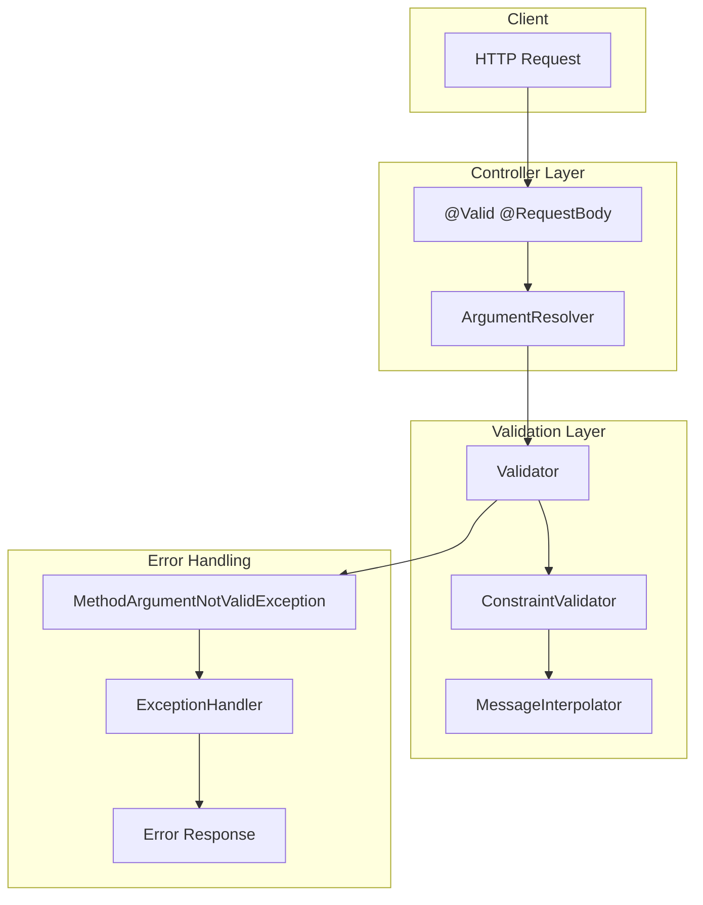
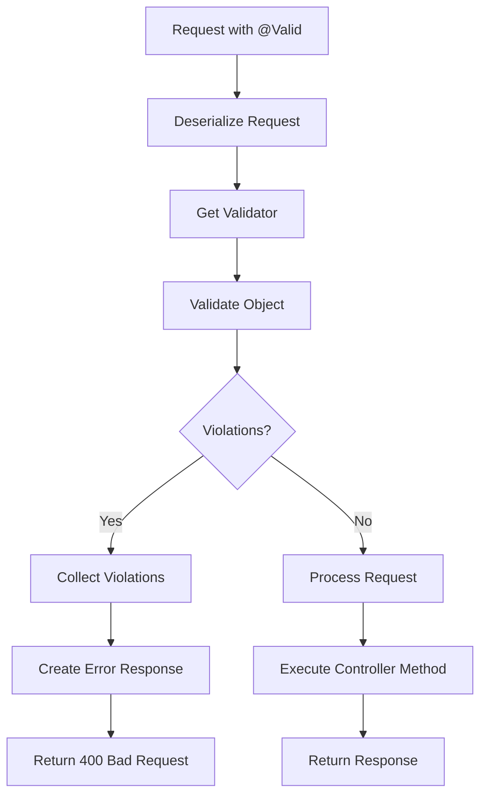

# Module 15.5: Spring Boot Starter Validation

## 1. Introduction

The `spring-boot-starter-validation` provides bean validation support using Jakarta Validation API (Hibernate Validator). It enables declarative validation of request parameters, entities, and service method arguments using annotations like `@Valid`, `@NotNull`, `@Size`, and custom validators.

## 2. Learning Objectives

- Master Jakarta Validation annotations
- Understand `@Valid` and `@Validated` usage
- Learn custom constraint creation
- Master validation groups and sequences
- Understand validation error handling
- Learn nested validation and collection validation

## 3. Prerequisites

- Spring Boot Fundamentals (Module 15.1)
- Java annotations basics
- Java Bean conventions
- Basic understanding of HTTP requests

## 4. Why This Concept Exists

Manual validation is error-prone:
```java
if (name == null || name.isEmpty()) {
    throw new IllegalArgumentException("Name is required");
}
if (name.length() > 100) {
    throw new IllegalArgumentException("Name too long");
}
```

Declarative validation with annotations:
```java
@NotBlank
@Size(max = 100)
private String name;
```

## 5. Problem Statement

**Without validation framework:**
```java
// Manual validation in every controller
public User createUser(@RequestBody UserRequest request) {
    if (request.name() == null) throw new ValidationException("Name required");
    if (request.name().length() > 100) throw new ValidationException("Name too long");
    if (request.email() == null) throw new ValidationException("Email required");
    if (!request.email().contains("@")) throw new ValidationException("Invalid email");
    // ... more validation
}
```

**With Spring Validation:**
```java
public User createUser(@Valid @RequestBody UserRequest request) {
    // Validation happens automatically
}
```

## 6. Theory

### 6.1 Validation Annotations

| Annotation | Purpose | Example |
|------------|---------|---------|
| `@NotNull` | Not null | `@NotNull String name` |
| `@NotBlank` | Not blank (trimmed) | `@NotBlank String name` |
| `@NotEmpty` | Not empty (collection) | `@NotEmpty List<String> items` |
| `@Size(min, max)` | Size constraints | `@Size(min=2, max=50) String name` |
| `@Min(value)` | Minimum value | `@Min(0) int age` |
| `@Max(value)` | Maximum value | `@Max(100) int age` |
| `@Email` | Email format | `@Email String email` |
| `@Pattern(regex)` | Regex pattern | `@Pattern(regexp="^[0-9]+$") String phone` |
| `@Positive` | Positive number | `@Positive double price` |
| `@PositiveOrZero` | Zero or positive | `@PositiveOrZero int quantity` |
| `@Past` | Past date | `@Past Instant createdAt` |
| `@Future` | Future date | `@Future Instant appointmentDate` |

### 6.2 @Valid vs @Validated

- **`@Valid`**: Standard JSR-380 validation; simple validation
- **`@Validated`**: Spring-specific; supports validation groups and method validation

### 6.3 Validation Groups

Groups allow conditional validation:
```java
public interface CreateValidation {}
public interface UpdateValidation {}

public class UserRequest {
    @Null(groups = CreateValidation.class)
    @NotNull(groups = UpdateValidation.class)
    private Long id;
}
```

## 7. Internal Working

### 7.1 Validation Flow

```
@Valid @RequestBody UserRequest request
  → RequestResponseBodyMethodProcessor
    → Jackson deserializes JSON to UserRequest
    → Validation processor triggered
      → Get validators for UserRequest
        → Check annotations on fields
          → Invoke validator for each annotation
            → Collect violations
              → If violations → MethodArgumentNotValidException
              → If no violations → Continue
```

### 7.2 Validator Creation

```
ConstraintValidator (interface)
  → HibernateValidator (implementation)
    → For each constraint annotation:
      → Find ConstraintValidator class
        → Instantiate validator
          → Call isValid() method
            → Return true/false
```

### 7.3 Error Response Structure

```json
{
  "timestamp": "2024-01-01T00:00:00Z",
  "status": 400,
  "error": "Bad Request",
  "path": "/api/users",
  "message": "Validation failed",
  "errors": [
    {
      "field": "name",
      "message": "must not be blank",
      "rejectedValue": ""
    }
  ]
}
```

## 8. JVM Perspective

### 8.1 Validation Processing

```
Annotation Processing
  → @NotBlank on UserRequest.name
    → Method: UserRequest.getName()
      → Reflection: field.getType() == String.class
        → Validator: StringValidator.isValid(value)
          → Checks: value != null && !value.trim().isEmpty()
            → Returns true/false
```

### 8.2 Constraint Descriptor

```
ConstraintDescriptor
├── annotation: @NotBlank
├── groups: [Default.class]
├── payload: []
├── message: "{jakarta.validation.constraints.NotBlank.message}"
├── validatedAnnotation: @NotBlank
└── validatorClass: NotBlankValidator.class
```

## 9. Memory Representation

### 9.1 Validator Registry

```
ValidatorFactory
├── ConstraintValidatorRegistry
│   ├── @NotBlank → NotBlankValidator
│   ├── @NotNull → NotNullValidator
│   ├── @Size → SizeValidator
│   └── @Email → EmailValidator
├── ConstraintMapping
│   └── UserRequest
│       ├── name → [@NotBlank, @Size(max=100)]
│       ├── email → [@NotBlank, @Email]
│       └── age → [@Min(0), @Max(150)]
└── MessageInterpolator
    └── Resolves validation messages
```

### 9.2 Violation Collection

```
ConstraintViolationSet
├── Violation 1
│   ├── propertyPath: "name"
│   ├── invalidValue: ""
│   ├── message: "must not be blank"
│   └── rootBean: UserRequest
└── Violation 2
    ├── propertyPath: "email"
    ├── invalidValue: "invalid"
    ├── message: "must be a well-formed email address"
    └── rootBean: UserRequest
```

## 10. Architecture Diagram



## 11. Flow Diagram



## 12. Syntax

### 12.1 Request DTO with Validation

```java
public record CreateUserRequest(
    @NotBlank(message = "Name is required")
    @Size(min = 2, max = 100, message = "Name must be between 2 and 100 characters")
    String name,
    
    @NotBlank(message = "Email is required")
    @Email(message = "Invalid email format")
    String email,
    
    @NotBlank(message = "Password is required")
    @Size(min = 8, max = 50, message = "Password must be between 8 and 50 characters")
    String password,
    
    @Min(value = 18, message = "Age must be at least 18")
    @Max(value = 150, message = "Age cannot exceed 150")
    int age
) {}
```

### 12.2 Controller Validation

```java
@RestController
@RequestMapping("/api/users")
public class UserController {
    
    @PostMapping
    public ResponseEntity<User> createUser(@Valid @RequestBody CreateUserRequest request) {
        // Validation passed
        return ResponseEntity.ok(userService.create(request));
    }
    
    @PutMapping("/{id}")
    public ResponseEntity<User> updateUser(
            @PathVariable Long id,
            @Valid @RequestBody UpdateUserRequest request) {
        return ResponseEntity.ok(userService.update(id, request));
    }
}
```

### 12.3 Custom Constraint

```java
@Target({ElementType.FIELD, ElementType.PARAMETER})
@Retention(RetentionPolicy.RUNTIME)
@Constraint(validatedBy = PhoneNumberValidator.class)
public @interface PhoneNumber {
    String message() default "Invalid phone number";
    Class<?>[] groups() default {};
    Class<? extends Payload>[] payload() default {};
}

public class PhoneNumberValidator implements ConstraintValidator<PhoneNumber, String> {
    @Override
    public boolean isValid(String value, ConstraintValidatorContext context) {
        if (value == null) return true;
        return value.matches("^\\+?[1-9]\\d{1,14}$");
    }
}
```

## 13. Easy Example

```java
package academy.javaengineering.springboot;

import jakarta.validation.Valid;
import jakarta.validation.constraints.*;
import org.springframework.boot.SpringApplication;
import org.springframework.boot.autoconfigure.SpringBootApplication;
import org.springframework.web.bind.annotation.*;

import java.util.List;

@SpringBootApplication
@RestController
@RequestMapping("/api")
public class ValidationStarterExample {
    
    public static void main(String[] args) {
        SpringApplication.run(ValidationStarterExample.class, args);
    }
    
    @PostMapping("/users")
    public String createUser(@Valid @RequestBody UserRequest request) {
        return "User created: " + request.name();
    }
}

record UserRequest(
    @NotBlank(message = "Name is required")
    @Size(min = 2, max = 100, message = "Name must be between 2 and 100 characters")
    String name,
    
    @NotBlank(message = "Email is required")
    @Email(message = "Invalid email format")
    String email
) {}
```

## 14. Medium Example

```java
package academy.javaengineering.springboot;

import jakarta.validation.Valid;
import jakarta.validation.constraints.*;
import org.springframework.boot.SpringApplication;
import org.springframework.boot.autoconfigure.SpringBootApplication;
import org.springframework.web.bind.annotation.*;

import java.time.Instant;
import java.util.List;

@SpringBootApplication
@RestController
@RequestMapping("/api")
public class ValidationStarterExample {
    
    public static void main(String[] args) {
        SpringApplication.run(ValidationStarterExample.class, args);
    }
    
    @PostMapping("/orders")
    public String createOrder(@Valid @RequestBody OrderRequest request) {
        return "Order created with " + request.items().size() + " items";
    }
}

record OrderRequest(
    @NotBlank(message = "Customer ID is required")
    String customerId,
    
    @NotEmpty(message = "Order must have at least one item")
    @Size(max = 50, message = "Order cannot have more than 50 items")
    List<OrderItemRequest> items,
    
    @NotNull(message = "Delivery date is required")
    @Future(message = "Delivery date must be in the future")
    Instant deliveryDate,
    
    @NotBlank(message = "Shipping address is required")
    String shippingAddress
) {}

record OrderItemRequest(
    @NotBlank(message = "Product ID is required")
    String productId,
    
    @Positive(message = "Quantity must be positive")
    int quantity,
    
    @PositiveOrZero(message = "Discount cannot be negative")
    double discount
) {}
```

## 15. Hard Example

```java
package academy.javaengineering.springboot;

import jakarta.validation.Valid;
import jakarta.validation.constraints.*;
import org.springframework.boot.SpringApplication;
import org.springframework.boot.autoconfigure.SpringBootApplication;
import org.springframework.validation.annotation.Validated;
import org.springframework.web.bind.annotation.*;

import java.time.Instant;
import java.util.List;

@SpringBootApplication
@RestController
@RequestMapping("/api")
@Validated
public class ValidationStarterExample {
    
    public static void main(String[] args) {
        SpringApplication.run(ValidationStarterExample.class, args);
    }
    
    @PostMapping("/payments")
    public String createPayment(@Valid @RequestBody PaymentRequest request) {
        return "Payment processed: $" + request.amount();
    }
}

record PaymentRequest(
    @NotBlank(message = "Payment method is required")
    @Pattern(regexp = "^(CREDIT_CARD|DEBIT_CARD|BANK_TRANSFER|PAYPAL)$", 
             message = "Invalid payment method")
    String paymentMethod,
    
    @NotNull(message = "Amount is required")
    @Positive(message = "Amount must be positive")
    @DecimalMax(value = "1000000.00", message = "Amount cannot exceed 1,000,000")
    double amount,
    
    @NotBlank(message = "Currency is required")
    @Pattern(regexp = "^(USD|EUR|GBP|JPY)$", message = "Invalid currency")
    String currency,
    
    @NotBlank(message = "Card number is required")
    @Size(min = 16, max = 16, message = "Card number must be 16 digits")
    @Pattern(regexp = "^[0-9]+$", message = "Card number must contain only digits")
    String cardNumber,
    
    @NotBlank(message = "Card holder name is required")
    @Size(min = 2, max = 100, message = "Card holder name must be between 2 and 100 characters")
    String cardHolderName,
    
    @NotBlank(message = "Expiry date is required")
    @Pattern(regexp = "^(0[1-9]|1[0-2])\\/([0-9]{2})$", message = "Expiry date must be MM/YY format")
    String expiryDate,
    
    @NotBlank(message = "CVV is required")
    @Size(min = 3, max = 4, message = "CVV must be 3 or 4 digits")
    @Pattern(regexp = "^[0-9]+$", message = "CVV must contain only digits")
    String cvv,
    
    @Email(message = "Invalid email format")
    String receiptEmail,
    
    String description
) {}
```

## 16. Enterprise Example

```java
package academy.javaengineering.springboot;

import jakarta.validation.Valid;
import jakarta.validation.constraints.*;
import org.springframework.boot.SpringApplication;
import org.springframework.boot.autoconfigure.SpringBootApplication;
import org.springframework.stereotype.Component;
import org.springframework.validation.annotation.Validated;
import org.springframework.web.bind.annotation.*;

import java.time.Instant;
import java.util.List;

@SpringBootApplication
@RestController
@RequestMapping("/api/v1")
@Validated
public class ValidationStarterExample {
    
    public static void main(String[] args) {
        SpringApplication.run(ValidationStarterExample.class, args);
    }
    
    @PostMapping("/products")
    public String createProduct(@Valid @RequestBody CreateProductRequest request) {
        return "Product created: " + request.name();
    }
    
    @PostMapping("/bulk-products")
    public String createBulkProducts(@Valid @RequestBody BulkProductRequest request) {
        return "Created " + request.products().size() + " products";
    }
}

record CreateProductRequest(
    @NotBlank(message = "Product name is required")
    @Size(min = 2, max = 200, message = "Product name must be between 2 and 200 characters")
    @Pattern(regexp = "^[a-zA-Z0-9\\s\\-]+$", message = "Product name can only contain letters, numbers, spaces, and hyphens")
    String name,
    
    @NotBlank(message = "Description is required")
    @Size(min = 10, max = 2000, message = "Description must be between 10 and 2000 characters")
    String description,
    
    @NotNull(message = "Price is required")
    @Positive(message = "Price must be positive")
    @DecimalMin(value = "0.01", message = "Price must be at least 0.01")
    @DecimalMax(value = "999999.99", message = "Price cannot exceed 999,999.99")
    double price,
    
    @NotBlank(message = "Category is required")
    String category,
    
    @NotEmpty(message = "At least one tag is required")
    @Size(max = 10, message = "Cannot have more than 10 tags")
    List<@NotBlank @Size(max = 50) String> tags,
    
    @PositiveOrZero(message = "Stock quantity cannot be negative")
    int stockQuantity,
    
    @NotBlank(message = "SKU is required")
    @Pattern(regexp = "^[A-Z]{2}-[0-9]{6}$", message = "SKU must be in format XX-000000")
    String sku
) {}

record BulkProductRequest(
    @NotEmpty(message = "Products list cannot be empty")
    @Size(max = 100, message = "Cannot create more than 100 products at once")
    List<@Valid CreateProductRequest> products
) {}

@Component
class ProductValidator {
    
    public boolean validateProduct(CreateProductRequest request) {
        // Custom business validation logic
        if (request.price() > 1000 && request.stockQuantity() > 1000) {
            return false; // High value items shouldn't have high stock
        }
        return true;
    }
}
```

## 17. Performance

| Metric | Value | Notes |
|--------|-------|-------|
| Annotation Processing | ~0.01ms | Per annotation |
| Object Validation | ~0.1ms | Simple object |
| Nested Validation | ~0.5ms | With collections |
| Custom Validator | ~0.05ms | Simple logic |
| Error Response Creation | ~0.1ms | JSON serialization |

## 18. Time & Space Complexity

| Operation | Time | Space | Notes |
|-----------|------|-------|-------|
| Annotation Lookup | O(a) | O(1) | a = annotations |
| Field Validation | O(f) | O(1) | f = fields |
| Collection Validation | O(n) | O(n) | n = collection size |
| Nested Validation | O(d) | O(d) | d = depth |
| Error Collection | O(v) | O(v) | v = violations |

## 19. Thread Safety

- **Validators**: Stateless; thread-safe
- **ValidatorFactory**: Thread-safe after initialization
- **ConstraintViolation**: Immutable; thread-safe
- **Validation Groups**: Thread-safe
- **Custom Validators**: Must be thread-safe

## 20. Best Practices

1. **Use Messages**: Always provide meaningful validation messages
2. **Group Validation**: Use groups for different validation scenarios
3. **Custom Constraints**: Create custom annotations for complex validation
4. **Nested Validation**: Use `@Valid` for nested objects
5. **Error Handling**: Implement global exception handler for validation errors
6. **Test Validation**: Write tests for validation rules
7. **Document Constraints**: Use `@Description` for validation processor
8. **Performance**: Keep validators simple and fast

## 21. Common Mistakes

1. **Missing @Valid**: Forgetting to add `@Valid` on `@RequestBody`
2. **No Validation Messages**: Not providing custom messages
3. **Incorrect Groups**: Using wrong validation groups
4. **Deep Nesting**: Over-nesting validation causing performance issues
5. **Custom Validator Bugs**: Not handling null values in custom validators
6. **Missing @Validated**: For method validation with Spring

## 22. Pitfalls

- **Null Values**: Some annotations don't validate null (use `@NotNull` first)
- **Empty Strings**: `@NotNull` doesn't catch empty strings (use `@NotBlank`)
- **Collection Items**: Must annotate collection items, not the collection itself
- **Nested Objects**: Must use `@Valid` on nested objects
- **Group Sequences**: Incorrect group ordering can cause validation failures

## 23. Debugging Tips

1. **Enable logging**: `logging.level.org.hibernate.validator=DEBUG`
2. **Check violations**: Log `ConstraintViolationSet` contents
3. **Test validators**: Write unit tests for custom validators
4. **Validate messages**: Ensure validation messages are correct
5. **Check groups**: Verify validation groups are applied correctly

## 24. Comparison Table

| Annotation | Purpose | Null Handling | Empty Handling |
|------------|---------|---------------|----------------|
| `@NotNull` | Not null | Fails if null | Passes if empty |
| `@NotBlank` | Not blank | Fails if null | Fails if empty/blank |
| `@NotEmpty` | Not empty | Fails if null | Fails if empty |
| `@Size` | Size constraints | Passes if null | Applies to length |
| `@Email` | Email format | Passes if null | Passes if empty |

| Feature | @Valid | @Validated |
|---------|--------|------------|
| Source | JSR-380 | Spring |
| Groups | No | Yes |
| Method Validation | No | Yes |
| Cascading | Yes | Yes |

## 25. Decision Tree

```
Do you need validation?
├── Yes → Do you need groups?
│   ├── Yes → Use @Validated with groups
│   └── No → Use @Valid
├── Do you need custom validation?
│   ├── Yes → Create custom constraint annotation
│   └── No → Use built-in annotations
└── Do you have nested objects?
    ├── Yes → Add @Valid to nested objects
    └── No → Validate directly
```

## 26. Interview Questions

1. What is the difference between `@Valid` and `@Validated`?
2. Explain validation groups and when to use them.
3. How do you create a custom constraint annotation?
4. What is the difference between `@NotNull`, `@NotBlank`, and `@NotEmpty`?
5. How do you handle validation errors globally?
6. Explain cascading validation with `@Valid`.
7. What is the validation processing order?
8. How do you validate nested objects?
9. What are validation payloads?
10. How do you test validation constraints?
11. Explain method validation with `@Validated`.
12. How do you validate collections?
13. What is the purpose of `@Valid` on method parameters?
14. How do you customize validation messages?
15. Explain constraint violation handling.

## 27. Exercises

### Beginner
1. Create a user registration endpoint with basic validation
2. Implement validation for an order creation endpoint
3. Add custom validation messages to all constraints

### Intermediate
4. Create a custom constraint annotation for phone number validation
5. Implement validation groups for create and update operations
6. Add nested validation for complex request objects

### Advanced
7. Build a validation framework with custom validators
8. Implement cross-field validation (e.g., end date after start date)
9. Create a validation interceptor for method validation
10. Build a validation library with automatic documentation

## 28. Summary

Spring Boot Starter Validation provides powerful bean validation with Jakarta Validation API. Understanding validation annotations, groups, custom constraints, and error handling is essential for building robust APIs with proper input validation.

## 29. References

- [Jakarta Validation](https://beanvalidation.org/)
- [Hibernate Validator](https://hibernate.org/validator/)
- [Spring Validation](https://docs.spring.io/spring-framework/reference/core/validation.html)
- [Spring Boot Validation](https://docs.spring.io/spring-boot/docs/current/reference/htmlsingle/#features.validation)
