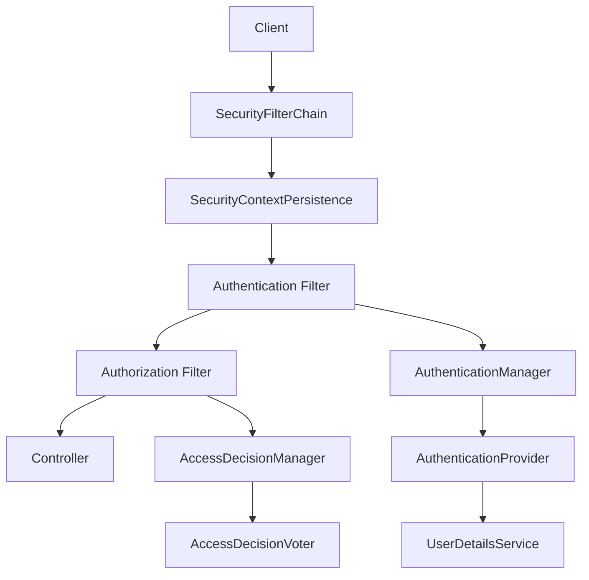
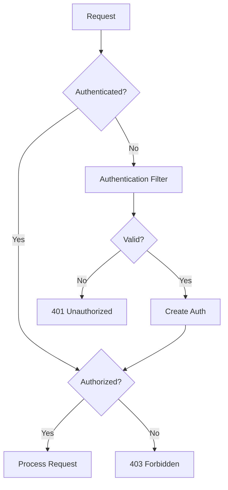

# Module 15.6: Spring Boot Starter Security

## 1. Introduction

The `spring-boot-starter-security` provides comprehensive security support for Spring applications including authentication, authorization, protection against common attacks, and integration with OAuth2 and JWT.

## 2. Learning Objectives

- Understand Spring Security architecture
- Master SecurityFilterChain configuration
- Learn JWT and OAuth2 authentication
- Understand authorization patterns and method security
- Learn CSRF and XSS protection

## 3. Prerequisites

- Spring Boot Fundamentals (Module 15.1)
- HTTP authentication basics
- Token-based authentication concepts

## 4. Why This Concept Exists

Spring Security eliminates manual authentication/authorization code, providing declarative security configuration, built-in attack protection, and integration with identity providers.

## 5. Problem Statement

Without Spring Security, developers must manually implement authentication, authorization, CSRF protection, session management, and XSS prevention. Spring Security provides all these as configurable filters.

## 6. Theory

### 6.1 Security Filter Chain
HTTP Request flows through: SecurityContextPersistenceFilter -> Authentication Filter -> Authorization Filter -> ExceptionTranslationFilter -> Controller

### 6.2 Authentication vs Authorization
- Authentication: Verifies identity (login)
- Authorization: Controls access (permissions)

### 6.3 JWT Flow
Client sends token -> JwtAuthenticationFilter extracts -> Validate -> Create Authentication -> Set SecurityContext -> Process request

## 7. Internal Working

### 7.1 Filter Chain Order
```
SecurityContextPersistenceFilter (1)
UsernamePasswordAuthenticationFilter (200)
BasicAuthenticationFilter (300)
JwtAuthenticationFilter (400)
ExceptionTranslationFilter (500)
FilterSecurityInterceptor (600)
```

### 7.2 Password Encoding
BCrypt generates salt, hashes password with salt, returns encoded password. Verification extracts salt, hashes raw password, compares.

## 8. JVM Perspective

### 8.1 Security Context
```
SecurityContext (ThreadLocal)
  Authentication
    Principal: User
    Credentials: null (cleared after auth)
    Authorities: [ROLE_USER, ROLE_ADMIN]
```

### 8.2 JWT Token Structure
```
Header.Payload.Signature
Header: {alg: RS256, typ: JWT}
Payload: {sub, iss, exp, roles, custom claims}
Signature: RSASHA256(header + payload, privateKey)
```

## 9. Memory Representation

```
SecurityFilterChain -> Filters -> AuthenticationManager -> ProviderManager
  DaoAuthenticationProvider -> UserDetailsService -> UserDetails
SecurityContextRepository -> HttpSessionSecurityContextRepository
```

## 10. Architecture Diagram



## 11. Flow Diagram



## 12. Syntax

### 12.1 Basic Security Configuration
```java
@Configuration
@EnableWebSecurity
public class SecurityConfig {
    @Bean
    public SecurityFilterChain securityFilterChain(HttpSecurity http) throws Exception {
        http
            .csrf(csrf -> csrf.disable())
            .authorizeHttpRequests(auth -> auth
                .requestMatchers("/api/public/**").permitAll()
                .requestMatchers("/api/admin/**").hasRole("ADMIN")
                .anyRequest().authenticated()
            )
            .httpBasic(Customizer.withDefaults());
        return http.build();
    }
}
```

### 12.2 JWT Configuration
```java
@Bean
public SecurityFilterChain securityFilterChain(HttpSecurity http) throws Exception {
    http
        .csrf(csrf -> csrf.disable())
        .authorizeHttpRequests(auth -> auth
            .requestMatchers("/api/auth/**").permitAll()
            .anyRequest().authenticated()
        )
        .oauth2ResourceServer(oauth2 -> oauth2.jwt(Customizer.withDefaults()));
    return http.build();
}
```

### 12.3 Method Security
```java
@PreAuthorize("hasRole('ADMIN')")
public List<User> getAllUsers() { ... }

@PreAuthorize("#id == authentication.principal.id or hasRole('ADMIN')")
public User getUser(Long id) { ... }
```

## 13. Easy Example

```java
package academy.javaengineering.springboot;

import org.springframework.boot.SpringApplication;
import org.springframework.boot.autoconfigure.SpringBootApplication;
import org.springframework.context.annotation.Bean;
import org.springframework.security.config.annotation.web.builders.HttpSecurity;
import org.springframework.security.core.userdetails.User;
import org.springframework.security.core.userdetails.UserDetailsService;
import org.springframework.security.provisioning.InMemoryUserDetailsManager;
import org.springframework.security.web.SecurityFilterChain;

@SpringBootApplication
public class SecurityStarterExample {
    public static void main(String[] args) {
        SpringApplication.run(SecurityStarterExample.class, args);
    }

    @Bean
    public SecurityFilterChain securityFilterChain(HttpSecurity http) throws Exception {
        http
            .authorizeHttpRequests(auth -> auth
                .requestMatchers("/api/public/**").permitAll()
                .anyRequest().authenticated()
            )
            .httpBasic();
        return http.build();
    }

    @Bean
    public UserDetailsService userDetailsService() {
        UserDetails user = User.withDefaultPasswordEncoder()
            .username("user").password("password").roles("USER").build();
        return new InMemoryUserDetailsManager(user);
    }
}
```

## 14. Medium Example

```java
package academy.javaengineering.springboot;

import org.springframework.boot.SpringApplication;
import org.springframework.boot.autoconfigure.SpringBootApplication;
import org.springframework.context.annotation.Bean;
import org.springframework.security.config.annotation.method.configuration.EnableMethodSecurity;
import org.springframework.security.config.annotation.web.builders.HttpSecurity;
import org.springframework.security.core.userdetails.User;
import org.springframework.security.core.userdetails.UserDetails;
import org.springframework.security.core.userdetails.UserDetailsService;
import org.springframework.security.provisioning.InMemoryUserDetailsManager;
import org.springframework.security.web.SecurityFilterChain;

@SpringBootApplication
@EnableMethodSecurity
public class SecurityStarterExample {
    public static void main(String[] args) {
        SpringApplication.run(SecurityStarterExample.class, args);
    }

    @Bean
    public SecurityFilterChain securityFilterChain(HttpSecurity http) throws Exception {
        http
            .csrf(csrf -> csrf.disable())
            .authorizeHttpRequests(auth -> auth
                .requestMatchers("/api/public/**").permitAll()
                .requestMatchers("/api/admin/**").hasRole("ADMIN")
                .requestMatchers("/api/user/**").hasAnyRole("USER", "ADMIN")
                .anyRequest().authenticated()
            )
            .httpBasic();
        return http.build();
    }

    @Bean
    public UserDetailsService userDetailsService() {
        UserDetails admin = User.withDefaultPasswordEncoder()
            .username("admin").password("admin").roles("ADMIN").build();
        UserDetails user = User.withDefaultPasswordEncoder()
            .username("user").password("user").roles("USER").build();
        return new InMemoryUserDetailsManager(admin, user);
    }
}
```

## 15. Hard Example

```java
package academy.javaengineering.springboot;

import org.springframework.boot.SpringApplication;
import org.springframework.boot.autoconfigure.SpringBootApplication;
import org.springframework.context.annotation.Bean;
import org.springframework.security.config.annotation.method.configuration.EnableMethodSecurity;
import org.springframework.security.config.annotation.web.builders.HttpSecurity;
import org.springframework.security.core.userdetails.User;
import org.springframework.security.core.userdetails.UserDetails;
import org.springframework.security.core.userdetails.UserDetailsService;
import org.springframework.security.crypto.bcrypt.BCryptPasswordEncoder;
import org.springframework.security.crypto.password.PasswordEncoder;
import org.springframework.security.provisioning.InMemoryUserDetailsManager;
import org.springframework.security.web.SecurityFilterChain;
import org.springframework.security.web.authentication.UsernamePasswordAuthenticationFilter;

@SpringBootApplication
@EnableMethodSecurity
public class SecurityStarterExample {
    public static void main(String[] args) {
        SpringApplication.run(SecurityStarterExample.class, args);
    }

    @Bean
    public SecurityFilterChain securityFilterChain(HttpSecurity http) throws Exception {
        http
            .csrf(csrf -> csrf.disable())
            .authorizeHttpRequests(auth -> auth
                .requestMatchers("/api/auth/**").permitAll()
                .requestMatchers("/api/admin/**").hasRole("ADMIN")
                .anyRequest().authenticated()
            )
            .formLogin(form -> form
                .loginPage("/login")
                .defaultSuccessUrl("/dashboard")
                .permitAll()
            )
            .logout(logout -> logout
                .logoutSuccessUrl("/login?logout")
                .permitAll()
            )
            .exceptionHandling(ex -> ex
                .accessDeniedPage("/access-denied")
            );
        return http.build();
    }

    @Bean
    public PasswordEncoder passwordEncoder() {
        return new BCryptPasswordEncoder();
    }

    @Bean
    public UserDetailsService userDetailsService(PasswordEncoder encoder) {
        UserDetails admin = User.builder()
            .username("admin")
            .password(encoder.encode("admin123"))
            .roles("ADMIN", "USER")
            .build();
        UserDetails user = User.builder()
            .username("user")
            .password(encoder.encode("user123"))
            .roles("USER")
            .build();
        return new InMemoryUserDetailsManager(admin, user);
    }
}
```

## 16. Enterprise Example

```java
package academy.javaengineering.springboot;

import org.springframework.boot.SpringApplication;
import org.springframework.boot.autoconfigure.SpringBootApplication;
import org.springframework.context.annotation.Bean;
import org.springframework.security.config.annotation.method.configuration.EnableMethodSecurity;
import org.springframework.security.config.annotation.web.builders.HttpSecurity;
import org.springframework.security.config.http.SessionCreationPolicy;
import org.springframework.security.core.userdetails.User;
import org.springframework.security.core.userdetails.UserDetails;
import org.springframework.security.core.userdetails.UserDetailsService;
import org.springframework.security.crypto.bcrypt.BCryptPasswordEncoder;
import org.springframework.security.crypto.password.PasswordEncoder;
import org.springframework.security.provisioning.InMemoryUserDetailsManager;
import org.springframework.security.web.SecurityFilterChain;

@SpringBootApplication
@EnableMethodSecurity
public class SecurityStarterExample {
    public static void main(String[] args) {
        SpringApplication.run(SecurityStarterExample.class, args);
    }

    @Bean
    public SecurityFilterChain securityFilterChain(HttpSecurity http) throws Exception {
        http
            .sessionManagement(session -> session
                .sessionCreationPolicy(SessionCreationPolicy.STATELESS)
            )
            .csrf(csrf -> csrf.disable())
            .authorizeHttpRequests(auth -> auth
                .requestMatchers("/api/auth/**").permitAll()
                .requestMatchers("/api/admin/**").hasRole("ADMIN")
                .requestMatchers("/api/public/**").permitAll()
                .anyRequest().authenticated()
            )
            .httpBasic(basic -> basic.realmName("MyAPI"));
        return http.build();
    }

    @Bean
    public PasswordEncoder passwordEncoder() {
        return new BCryptPasswordEncoder(12);
    }

    @Bean
    public UserDetailsService userDetailsService(PasswordEncoder encoder) {
        UserDetails superAdmin = User.builder()
            .username("superadmin").password(encoder.encode("super123"))
            .roles("SUPER_ADMIN", "ADMIN", "USER").build();
        UserDetails admin = User.builder()
            .username("admin").password(encoder.encode("admin123"))
            .roles("ADMIN", "USER").build();
        UserDetails user = User.builder()
            .username("user").password(encoder.encode("user123"))
            .roles("USER").build();
        return new InMemoryUserDetailsManager(superAdmin, admin, user);
    }
}
```

## 17. Performance

| Metric | Value | Notes |
|--------|-------|-------|
| Filter Execution | ~0.1ms | Per filter |
| JWT Validation | ~1-5ms | Depends on algorithm |
| Password Hashing (BCrypt) | ~100ms | Intentionally slow |
| Authorization Check | ~0.01ms | Role lookup |
| Session Creation | ~1ms | In-memory |

## 18. Time and Space Complexity

| Operation | Time | Space |
|-----------|------|-------|
| Filter Chain | O(f) | O(f) |
| JWT Validation | O(1) | O(1) |
| Password Encoding | O(1) | O(1) |
| Role Lookup | O(r) | O(r) |

## 19. Thread Safety

- SecurityContext is ThreadLocal (thread-bound)
- SecurityFilterChain is immutable and thread-safe
- AuthenticationManager is stateless and thread-safe
- PasswordEncoder implementations are thread-safe

## 20. Best Practices

1. Always use BCrypt or Argon2 for password hashing
2. Use stateless sessions for REST APIs
3. Disable CSRF for stateless APIs
4. Use method-level security with @PreAuthorize
5. Store secrets in environment variables

## 21. Common Mistakes

1. Disabling CSRF without understanding the implications
2. Using deprecated WebSecurityConfigurerAdapter
3. Not clearing credentials from memory
4. Overly permissive CORS configuration
5. Hardcoding credentials in source code

## 22. Pitfalls

- Forgetting to disable CSRF for stateless APIs causes 403 errors
- Using InMemoryUserDetailsManager in production
- Not validating JWT expiration
- Storing sensitive data in JWT payload

## 23. Debugging Tips

1. Enable debug logging: `logging.level.org.springframework.security=DEBUG`
2. Check SecurityFilterChain order with Actuator
3. Use Postman with proper Authorization header
4. Verify JWT token structure with jwt.io

## 24. Comparison Table

| Feature | HTTP Basic | Form Login | JWT | OAuth2 |
|---------|-----------|------------|-----|--------|
| Stateless | Yes | No | Yes | Yes |
| Token-based | No | No | Yes | Yes |
| Use case | Simple APIs | Web apps | REST APIs | SSO |
| Storage | Browser | Session | Client | IdP |

## 25. Decision Tree

```
REST API? -> JWT or OAuth2
Web App? -> Form Login
Simple? -> HTTP Basic
Enterprise? -> OAuth2 with OIDC
```

## 26. Interview Questions

1. What is the difference between authentication and authorization?
2. How does Spring Security filter chain work?
3. What is JWT and how is it validated?
4. Explain the difference between @PreAuthorize and @PostAuthorize.
5. How does CSRF protection work in Spring Security?
6. What is OAuth2 and how does it differ from JWT?
7. How do you secure REST APIs with Spring Security?
8. What is the SecurityContext and how is it stored?
9. How does password encoding work with BCrypt?
10. Explain stateless vs stateful security configurations.
11. What are GrantedAuthorities and how are they assigned?
12. How do you implement role-based access control?
13. What is the AuthenticationManager?
14. How do you handle security exceptions?
15. What are the best practices for JWT token security?

## 27. Exercises

### Beginner
1. Create a Spring Security configuration with HTTP Basic auth
2. Implement role-based access control for two endpoints
3. Create a custom login page

### Intermediate
4. Implement JWT authentication with token generation and validation
5. Create a method-level security configuration with @PreAuthorize
6. Implement CORS configuration for cross-origin requests

### Advanced
7. Build an OAuth2 resource server with JWT
8. Implement custom AuthenticationProvider
9. Create a security audit logging system
10. Build a multi-tenant security configuration

## 28. Summary

Spring Boot Starter Security provides comprehensive authentication and authorization through a filter chain architecture, supporting HTTP Basic, JWT, OAuth2, and form-based authentication with built-in protection against common attacks.

## 29. References

- [Spring Security Reference](https://docs.spring.io/spring-security/reference/)
- [Spring Security OAuth2](https://spring.io/projects/spring-security-oauth)
- [JWT Documentation](https://jwt.io/)
- [OWASP Security Guide](https://owasp.org/www-project-top-ten/)
