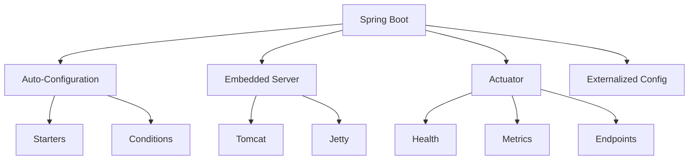

# Module 15: Spring Boot

## Overview
Spring Boot simplifies Spring application development with auto-configuration, embedded servers, and production-ready features. It enables rapid application development with minimal configuration.

## Learning Objectives
- Understand auto-configuration
- Create REST APIs
- Configure properties
- Use embedded servers
- Apply production features

## Prerequisites
- Spring Framework basics
- REST API concepts
- Web development

## Why This Concept Exists
Spring applications need:
- Configuration management
- Server setup
- Production features
- Quick development

Spring Boot provides:
- Auto-configuration
- Embedded servers
- Actuator
- Starter dependencies

## Problem Statement
How do you quickly develop production-ready Spring applications?

## Theory

### Spring Boot Features

| Feature | Description |
|---------|-------------|
| Auto-Configuration | Automatic setup |
| Embedded Server | Tomcat, Jetty, Undertow |
| Actuator | Production monitoring |
| Starters | Dependency management |
| Externalized Config | Properties/YAML |

### Starters

| Starter | Purpose |
|---------|---------|
| spring-boot-starter-web | Web applications |
| spring-boot-starter-data-jpa | Database access |
| spring-boot-starter-security | Security |
| spring-boot-starter-test | Testing |

## Internal Working

### Auto-Configuration
1. @EnableAutoConfiguration
2. Read META-INF/spring.factories
3. Match conditions
4. Configure beans

### Application Startup
1. Create SpringApplication
2. Run application
3. Load ApplicationContext
4. Refresh context
5. Start embedded server

## JVM Perspective

### Spring Boot JAR
- Executable JAR format
- Nested JARs
- Custom classloader
- Embedded server

### Memory
- Embedded server overhead
- Auto-configured pools
- Actuator endpoints

## Architecture Diagram



## Syntax

### Application Class
```java
@SpringBootApplication
public class MyApplication {
    public static void main(String[] args) {
        SpringApplication.run(MyApplication.class, args);
    }
}
```

### REST Controller
```java
@RestController
@RequestMapping("/api")
public class ApiController {
    @GetMapping("/hello")
    public String hello() {
        return "Hello, World!";
    }
    
    @GetMapping("/users/{id}")
    public User getUser(@PathVariable Long id) {
        return userService.findById(id);
    }
}
```

### Configuration
```properties
# application.properties
server.port=8080
spring.application.name=my-app

# Database
spring.datasource.url=jdbc:postgresql://localhost:5432/mydb
spring.datasource.username=user
spring.datasource.password=pass

# JPA
spring.jpa.hibernate.ddl-auto=update
spring.jpa.show-sql=true
```

## Easy Example
```java
import org.springframework.boot.SpringApplication;
import org.springframework.boot.autoconfigure.SpringBootApplication;
import org.springframework.web.bind.annotation.*;

@SpringBootApplication
@RestController
public class EasyApplication {
    
    @GetMapping("/")
    public String home() {
        return "Hello, Spring Boot!";
    }
    
    @GetMapping("/greet/{name}")
    public String greet(@PathVariable String name) {
        return "Hello, " + name + "!";
    }
    
    public static void main(String[] args) {
        SpringApplication.run(EasyApplication.class, args);
    }
}
```

## Medium Example
```java
import org.springframework.boot.SpringApplication;
import org.springframework.boot.autoconfigure.SpringBootApplication;
import org.springframework.web.bind.annotation.*;
import java.util.*;

@SpringBootApplication
@RestController
@RequestMapping("/api/users")
public class MediumApplication {
    
    private final Map<Long, User> users = new HashMap<>();
    private Long nextId = 1L;
    
    @GetMapping
    public List<User> getAll() {
        return new ArrayList<>(users.values());
    }
    
    @GetMapping("/{id}")
    public User getById(@PathVariable Long id) {
        return users.get(id);
    }
    
    @PostMapping
    public User create(@RequestBody User user) {
        user.setId(nextId++);
        users.put(user.getId(), user);
        return user;
    }
    
    @PutMapping("/{id}")
    public User update(@PathVariable Long id, @RequestBody User user) {
        user.setId(id);
        users.put(id, user);
        return user;
    }
    
    @DeleteMapping("/{id}")
    public void delete(@PathVariable Long id) {
        users.remove(id);
    }
    
    public static void main(String[] args) {
        SpringApplication.run(MediumApplication.class, args);
    }
}

class User {
    private Long id;
    private String name;
    private String email;
    
    // Getters and setters
}
```

## Hard Example
```java
import org.springframework.boot.SpringApplication;
import org.springframework.boot.autoconfigure.SpringBootApplication;
import org.springframework.web.bind.annotation.*;
import org.springframework.http.ResponseEntity;
import org.springframework.stereotype.Service;
import java.util.*;

@SpringBootApplication
public class HardApplication {
    public static void main(String[] args) {
        SpringApplication.run(HardApplication.class, args);
    }
}

@Service
class OrderService {
    private final OrderRepository repository;
    private final PaymentService paymentService;
    
    OrderService(OrderRepository repository, PaymentService paymentService) {
        this.repository = repository;
        this.paymentService = paymentService;
    }
    
    public Order createOrder(OrderRequest request) {
        // Validate
        if (request.getItems().isEmpty()) {
            throw new IllegalArgumentException("Order must have items");
        }
        
        // Process payment
        boolean paid = paymentService.charge(request.getTotal());
        if (!paid) {
            throw new PaymentException("Payment failed");
        }
        
        // Save order
        Order order = new Order(request);
        order.setStatus("COMPLETED");
        return repository.save(order);
    }
}

@RestController
@RequestMapping("/api/orders")
class OrderController {
    private final OrderService orderService;
    
    OrderController(OrderService orderService) {
        this.orderService = orderService;
    }
    
    @PostMapping
    public ResponseEntity<Order> createOrder(@RequestBody OrderRequest request) {
        Order order = orderService.createOrder(request);
        return ResponseEntity.ok(order);
    }
}
```

## Enterprise Example
```java
import org.springframework.boot.SpringApplication;
import org.springframework.boot.autoconfigure.SpringBootApplication;
import org.springframework.web.bind.annotation.*;
import org.springframework.scheduling.annotation.*;
import org.springframework.cache.annotation.*;
import java.util.concurrent.*;

@SpringBootApplication
@EnableCaching
@EnableScheduling
public class EnterpriseApplication {
    public static void main(String[] args) {
        SpringApplication.run(EnterpriseApplication.class, args);
    }
}

@Service
class CachedUserService {
    private final UserRepository repository;
    
    CachedUserService(UserRepository repository) {
        this.repository = repository;
    }
    
    @Cacheable("users")
    public User findById(Long id) {
        // Simulate slow database call
        return repository.findById(id).orElse(null);
    }
    
    @CacheEvict("users")
    public void evictCache(Long id) {
        // Cache evicted
    }
}

@Component
class HealthCheck {
    @Scheduled(fixedRate = 60000)
    public void checkHealth() {
        System.out.println("Health check: " + LocalDateTime.now());
    }
}
```

## Performance Considerations
- Use embedded server for development
- Configure connection pooling
- Enable caching
- Use async processing

## Best Practices
1. Use Spring Boot starters
2. Externalize configuration
3. Use profiles for environments
4. Enable actuator for monitoring
5. Use @Valid for validation

## Common Mistakes
1. Over-configuration
2. Not using profiles
3. Ignoring actuator
4. Not validating input

## Comparison Table

| Feature | Spring Boot | Micronaut | Quarkus |
|---------|-------------|-----------|---------|
| Startup Time | Medium | Fast | Fast |
| Memory | Medium | Low | Low |
| Ecosystem | Large | Growing | Growing |
| Native | Yes | Yes | Yes |

## Interview Questions

### Q1: What is Spring Boot?
**Answer:** Framework for creating stand-alone Spring applications.

### Q2: What is auto-configuration?
**Answer:** Automatic configuration based on dependencies.

### Q3: What are Spring Boot starters?
**Answer:** Dependencies that include necessary libraries.

### Q4: What is embedded server?
**Answer:** Server bundled with the application (Tomcat, Jetty).

### Q5: What is Actuator?
**Answer:** Production monitoring and management features.

## Summary
Spring Boot enables rapid development of production-ready Spring applications.

## References
- Spring Boot Documentation
- Spring Boot Guides
- Baeldung Spring Boot
