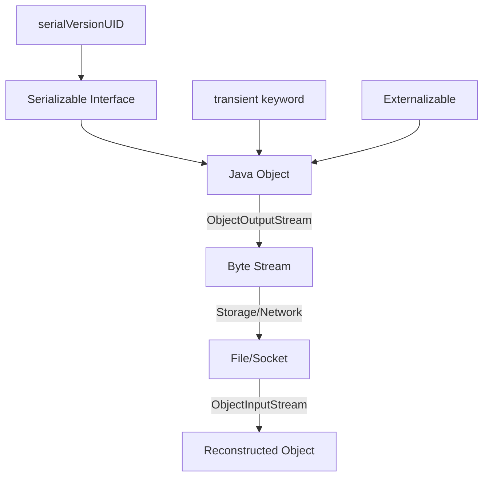
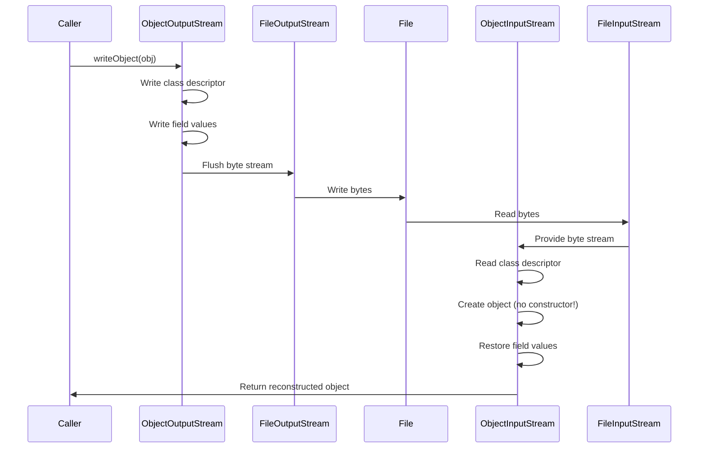

# Module 16: Serialization in Java

## Introduction
Serialization is the process of converting an object's state into a byte stream so it can be persisted to a file, sent over a network, or stored in a database. Deserialization reverses this process, reconstructing the object from the byte stream.

## Learning Objectives
- Understand the Serializable interface and its role
- Learn about serialVersionUID and version control
- Implement custom serialization mechanisms
- Use Externalizable for fine-grained control
- Perform JSON serialization with Jackson/Gson

## Prerequisites
- Basic Java OOP concepts
- Understanding of file I/O basics
- Familiarity with interfaces and abstract classes

## Why This Concept Exists
Java objects exist in memory and are lost when the program terminates. Serialization allows objects to outlive the JVM instance, enabling persistence, communication across networks, and inter-process data transfer.

## Problem Statement
How do we convert complex object graphs with nested objects, circular references, and transient data into a format that can be stored or transmitted, then reliably reconstruct them later?

## Theory
Serialization in Java works through the `Serializable` marker interface. When an object implements this interface, the JVM can convert its state to a byte stream using `ObjectOutputStream`. The `ObjectInputStream` class reconstructs objects from these streams.

Key concepts:
- **Serializable**: Marker interface indicating an object can be serialized
- **serialVersionUID**: Version control for serialized classes
- **transient**: Keyword to exclude fields from serialization
- **Externalizable**: Interface for complete control over serialization

## Internal Working
1. ObjectOutputStream writes the class descriptor (class name, serialVersionUID, serializable fields)
2. Field values are written recursively (nested objects are also serialized)
3. Static fields are NOT serialized (they belong to the class, not instances)
4. Transient fields are skipped during serialization

## JVM Perspective
- Serialization uses reflection to inspect class fields
- The JVM maintains a cache of serialized object descriptors
- Deserialization creates objects WITHOUT calling constructors
- Circular references are handled via back-references (not infinite recursion)

## Memory Representation
```
Serialized Form:
┌─────────────────────────────────────┐
│ Magic Number (0xaced0005)          │
│ Class Descriptor                    │
│   - ClassName                       │
│   - serialVersionUID                │
│   - SerialVersionUID                │
│ Field Values                        │
│   - Primitives (direct encoding)    │
│   - Objects (recursive)             │
└─────────────────────────────────────┘
```

## Architecture Diagram (Mermaid)


## Flow Diagram (Mermaid)


## Syntax

### Basic Serialization
```java
// Implement Serializable
public class Employee implements Serializable {
    private static final long serialVersionUID = 1L;
    private String name;
    private transient String password; // excluded from serialization
}

// Serialize
try (ObjectOutputStream oos = new ObjectOutputStream(new FileOutputStream("employee.ser"))) {
    oos.writeObject(employee);
}

// Deserialize
try (ObjectInputStream ois = new ObjectInputStream(new FileInputStream("employee.ser"))) {
    Employee emp = (Employee) ois.readObject();
}
```

### Externalizable
```java
public class Employee implements Externalizable {
    private String name;
    
    @Override
    public void writeExternal(ObjectOutput out) throws IOException {
        out.writeUTF(name);
    }
    
    @Override
    public void readExternal(ObjectInput in) throws IOException {
        name = in.readUTF();
    }
}
```

## Easy Example
```java
import java.io.*;

class Person implements Serializable {
    private static final long serialVersionUID = 1L;
    private String name;
    private int age;
    
    public Person(String name, int age) {
        this.name = name;
        this.age = age;
    }
    
    @Override
    public String toString() {
        return "Person{name='" + name + "', age=" + age + "}";
    }
}

public class SerializationExample {
    public static void main(String[] args) {
        Person person = new Person("John", 30);
        
        // Serialize
        try (ObjectOutputStream oos = new ObjectOutputStream(
                new FileOutputStream("person.ser"))) {
            oos.writeObject(person);
            System.out.println("Serialized: " + person);
        } catch (IOException e) {
            e.printStackTrace();
        }
        
        // Deserialize
        try (ObjectInputStream ois = new ObjectInputStream(
                new FileInputStream("person.ser"))) {
            Person restored = (Person) ois.readObject();
            System.out.println("Deserialized: " + restored);
        } catch (IOException | ClassNotFoundException e) {
            e.printStackTrace();
        }
    }
}
```

## Medium Example
```java
import java.io.*;

class Address implements Serializable {
    private static final long serialVersionUID = 1L;
    private String city;
    private String country;
    
    public Address(String city, String country) {
        this.city = city;
        this.country = country;
    }
    
    public String getCity() { return city; }
    public String getCountry() { return country; }
}

class Employee implements Serializable {
    private static final long serialVersionUID = 2L;
    private String name;
    private double salary;
    private Address address;
    private transient String temporaryToken;
    
    public Employee(String name, double salary, Address address) {
        this.name = name;
        this.salary = salary;
        this.address = address;
        this.temporaryToken = "token-" + System.currentTimeMillis();
    }
    
    public String getTemporaryToken() { return temporaryToken; }
    
    @Override
    public String toString() {
        return "Employee{name='" + name + "', salary=" + salary + 
               ", address=" + address + ", token=" + temporaryToken + "}";
    }
}

public class SerializationExample {
    public static void main(String[] args) {
        Address addr = new Address("New York", "USA");
        Employee emp = new Employee("Alice", 75000, addr);
        
        System.out.println("Before: " + emp);
        
        // Serialize
        try (ObjectOutputStream oos = new ObjectOutputStream(
                new FileOutputStream("employee.ser"))) {
            oos.writeObject(emp);
        } catch (IOException e) {
            e.printStackTrace();
        }
        
        // Deserialize
        try (ObjectInputStream ois = new ObjectInputStream(
                new FileInputStream("employee.ser"))) {
            Employee restored = (Employee) ois.readObject();
            System.out.println("After: " + restored);
            System.out.println("Token lost (transient): " + restored.getTemporaryToken());
        } catch (IOException | ClassNotFoundException e) {
            e.printStackTrace();
        }
    }
}
```

## Hard Example
```java
import java.io.*;
import java.util.*;

class CustomSerializable implements Externalizable {
    private String name;
    private List<String> tags;
    private Map<String, Integer> metadata;
    
    public CustomSerializable() {} // Required for Externalizable
    
    public CustomSerializable(String name, List<String> tags, Map<String, Integer> metadata) {
        this.name = name;
        this.tags = tags;
        this.metadata = metadata;
    }
    
    @Override
    public void writeExternal(ObjectOutput out) throws IOException {
        out.writeUTF(name);
        out.writeInt(tags.size());
        for (String tag : tags) {
            out.writeUTF(tag);
        }
        out.writeInt(metadata.size());
        for (Map.Entry<String, Integer> entry : metadata.entrySet()) {
            out.writeUTF(entry.getKey());
            out.writeInt(entry.getValue());
        }
    }
    
    @Override
    public void readExternal(ObjectInput in) throws IOException {
        name = in.readUTF();
        int tagCount = in.readInt();
        tags = new ArrayList<>();
        for (int i = 0; i < tagCount; i++) {
            tags.add(in.readUTF());
        }
        int metaCount = in.readInt();
        metadata = new HashMap<>();
        for (int i = 0; i < metaCount; i++) {
            metadata.put(in.readUTF(), in.readInt());
        }
    }
    
    @Override
    public String toString() {
        return "CustomSerializable{name='" + name + "', tags=" + tags + 
               ", metadata=" + metadata + "}";
    }
}

public class SerializationExample {
    public static void main(String[] args) {
        List<String> tags = Arrays.asList("java", "serialization", "advanced");
        Map<String, Integer> metadata = Map.of("version", 2, "priority", 1);
        
        CustomSerializable obj = new CustomSerializable("AdvancedExample", tags, metadata);
        System.out.println("Before: " + obj);
        
        // Serialize
        try (ObjectOutputStream oos = new ObjectOutputStream(
                new FileOutputStream("custom.ser"))) {
            oos.writeObject(obj);
        } catch (IOException e) {
            e.printStackTrace();
        }
        
        // Deserialize
        try (ObjectInputStream ois = new ObjectInputStream(
                new FileInputStream("custom.ser"))) {
            CustomSerializable restored = (CustomSerializable) ois.readObject();
            System.out.println("After: " + restored);
        } catch (IOException | ClassNotFoundException e) {
            e.printStackTrace();
        }
    }
}
```

## Enterprise Example
```java
import java.io.*;
import java.util.concurrent.ConcurrentHashMap;

class AuditLogger implements Serializable {
    private static final long serialVersionUID = 1L;
    private final String loggerName;
    private final transient ConcurrentHashMap<String, String> buffer;
    
    public AuditLogger(String loggerName) {
        this.loggerName = loggerName;
        this.buffer = new ConcurrentHashMap<>();
    }
    
    public void log(String key, String value) {
        buffer.put(key, value);
    }
    
    // Custom serialization - buffer is transient
    private void writeObject(ObjectOutputStream oos) throws IOException {
        oos.defaultWriteObject(); // Write non-transient fields
        oos.writeObject(new ArrayList<>(buffer.entrySet())); // Write buffer manually
    }
    
    private void readObject(ObjectInputStream ois) throws IOException, ClassNotFoundException {
        ois.defaultReadObject(); // Read non-transient fields
        List<Map.Entry<String, String>> entries = 
            (List<Map.Entry<String, String>>) ois.readObject();
        buffer = new ConcurrentHashMap<>();
        entries.forEach(e -> buffer.put(e.getKey(), e.getValue()));
    }
    
    @Override
    public String toString() {
        return "AuditLogger{name='" + loggerName + "', bufferSize=" + buffer.size() + "}";
    }
}

public class SerializationExample {
    public static void main(String[] args) {
        AuditLogger logger = new AuditLogger("SecurityAudit");
        logger.log("login", "user123");
        logger.log("logout", "user123");
        
        System.out.println("Before: " + logger);
        
        // Serialize
        try (ObjectOutputStream oos = new ObjectOutputStream(
                new FileOutputStream("logger.ser"))) {
            oos.writeObject(logger);
        } catch (IOException e) {
            e.printStackTrace();
        }
        
        // Deserialize
        try (ObjectInputStream ois = new ObjectInputStream(
                new FileInputStream("logger.ser"))) {
            AuditLogger restored = (AuditLogger) ois.readObject();
            System.out.println("After: " + restored);
        } catch (IOException | ClassNotFoundException e) {
            e.printStackTrace();
        }
    }
}
```

## Performance
| Operation | Time Complexity | Space Complexity |
|-----------|----------------|-----------------|
| Serialization | O(n) | O(n) |
| Deserialization | O(n) | O(n) |
| JSON Serialization | O(n) | O(n) |

Where n is the size of the object graph.

## Time & Space Complexity
- Serialization time is proportional to object graph size
- Serialized form is typically 2-10x larger than in-memory representation
- Reflection overhead makes Java serialization slower than alternatives like Protocol Buffers

## Thread Safety
- ObjectOutputStream/ObjectInputStream are NOT thread-safe
- Each thread should use its own stream instances
- Serialized byte streams are safe to share between threads
- Deserialized objects have no relationship to the original thread

## Best Practices
1. Always define `serialVersionUID` explicitly
2. Use `transient` for sensitive or non-serializable fields
3. Prefer `Externalizable` for performance-critical applications
4. Validate deserialized objects before use
5. Consider alternative formats (JSON, Protocol Buffers) for cross-platform needs
6. Implement `readObject()` and `writeObject()` for custom logic
7. Use `readResolve()` and `writeReplace()` for singleton pattern

## Common Mistakes
1. Forgetting `serialVersionUID` (auto-generated, breaks compatibility)
2. Serializing non-serializable fields without `transient`
3. Not implementing `Serializable` on nested objects
4. Assuming constructors are called during deserialization
5. Storing passwords in serializable objects
6. Not handling `InvalidClassException` properly

## Pitfalls
- Deserialization can execute arbitrary code (security risk)
- Version incompatibility between serialized forms
- Memory leaks from serialized objects kept in caches
- Performance overhead of reflection-based serialization

## Debugging Tips
1. Use `serialver` tool to generate/check serialVersionUID
2. Implement `toString()` to verify deserialized objects
3. Write serialization tests for all serializable classes
4. Use `ObjectOutputStream.PutFields` for debugging
5. Monitor serialization performance with JMH

## Comparison Table
| Feature | Serializable | Externalizable | JSON |
|---------|--------------|----------------|------|
| Control | Limited | Full | Custom |
| Performance | Medium | Fast | Medium |
| Boilerplate | Minimal | High | Medium |
| Cross-platform | No | No | Yes |
| Security | Risk | Risk | Safe |

## Decision Tree
```
Need to serialize?
├── Yes
│   ├── Need cross-platform? → Use JSON
│   ├── Need full control? → Use Externalizable
│   ├── Need minimal code? → Use Serializable
│   └── Need performance? → Use Externalizable or Protocol Buffers
└── No → Don't serialize
```

## Interview Questions (15+)
1. What is the difference between Serializable and Externalizable?
2. What is serialVersionUID and why is it important?
3. Can you serialize static fields?
4. How does deserialization handle circular references?
5. What is the purpose of the `transient` keyword?
6. How can you make a singleton serializable?
7. What security risks does deserialization pose?
8. How do you serialize objects with non-serializable fields?
9. What is the performance impact of Java serialization?
10. How does JSON serialization differ from Java serialization?
11. Can you serialize a thread?
12. What happens if a class changes after serialization?
13. How do you handle version compatibility?
14. What is `readResolve()` and when is it used?
15. How would you serialize a large object graph efficiently?

## Exercises (3 Levels)

### Level 1 (Easy)
Create a `Student` class with name, age, and grades. Serialize and deserialize it. Verify all fields are preserved.

### Level 2 (Medium)
Create an `Order` class containing `Customer`, `List<OrderItem>`, and `Address`. Implement custom serialization that encrypts the customer's credit card number.

### Level 3 (Hard)
Design a serialization framework that:
- Supports multiple output formats (binary, JSON, XML)
- Handles versioning with field migration
- Implements security validation during deserialization
- Provides performance metrics

## Summary
Serialization is essential for persistence and communication in Java. While the built-in mechanism is simple to use, understanding its limitations and security implications is crucial for production applications.

## References
- [Oracle Java Serialization Guide](https://docs.oracle.com/javase/8/docs/platform/serialization/spec/serial-arch.html)
- [Effective Java - Serialization](https://www.oreilly.com/library/view/effective-java/9780134686097/)
- [Java Object Serialization Specification](https://docs.oracle.com/javase/8/docs/platform/serialization/)
