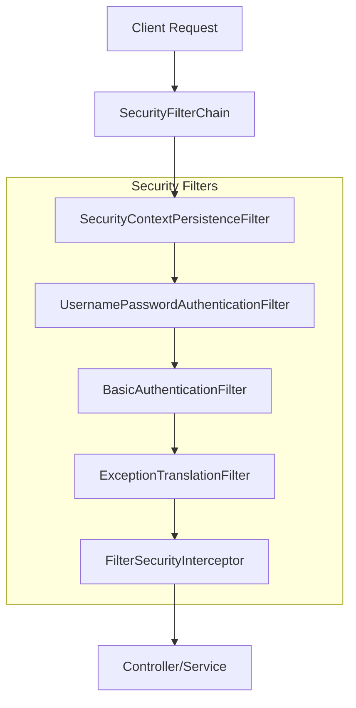
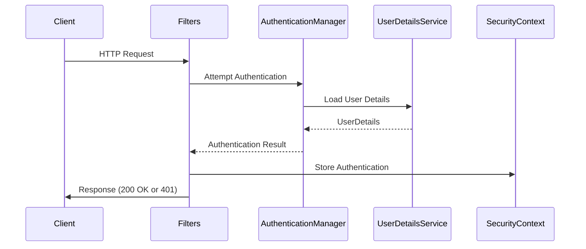

# 1. Security Fundamentals

## 1. Introduction
Spring Security is a powerful and highly customizable authentication and access-control framework for Java applications. It provides comprehensive security services for Java EE-based enterprise software applications, with a particular focus on creating applications that provide authentication and authorization mechanisms.

## 2. Learning Objectives
- Understand the core concepts of authentication and authorization
- Learn about Spring Security architecture and filter chain
- Implement basic security configuration
- Differentiate between authentication and authorization
- Understand security filters and their roles

## 3. Prerequisites
- Basic Java knowledge
- Understanding of Spring Framework basics
- Familiarity with web applications and HTTP protocol
- Understanding of dependency injection

## 4. Why This Concept Exists
Security is essential for protecting applications from unauthorized access, data breaches, and malicious attacks. Spring Security abstracts complex security implementations, providing a standardized approach to securing applications while allowing developers to focus on business logic.

## 5. Problem Statement
Without proper security mechanisms, web applications are vulnerable to:
- Unauthorized access to sensitive data
- Cross-Site Scripting (XSS) attacks
- Cross-Site Request Forgery (CSRF) attacks
- Session hijacking
- Brute force attacks
- SQL injection

## 6. Theory
Spring Security operates on a filter-based model. Every request passes through a chain of security filters before reaching the servlet. Key concepts include:

- **Authentication**: Verifying the identity of a user (Who are you?)
- **Authorization**: Determining what an authenticated user can access (What can you do?)
- **Principal**: The currently authenticated user
- **Credentials**: Authentication information (password, token, etc.)
- **AuthenticationManager**: Coordinates authentication process
- **SecurityContext**: Stores authentication details for the current request

## 7. Internal Working
Spring Security uses a filter chain architecture:
1. `SecurityContextPersistenceFilter` - Stores SecurityContext
2. `UsernamePasswordAuthenticationFilter` - Handles form login
3. `BasicAuthenticationFilter` - Handles HTTP Basic auth
4. `ExceptionTranslationFilter` - Handles authentication/authorization exceptions
5. `FilterSecurityInterceptor` - Makes authorization decisions

## 8. JVM Perspective
Spring Security operates at the application level, not JVM level. It uses:
- ThreadLocal for storing SecurityContext per request
- Proxy patterns for method-level security
- CGLIB/AspectJ for AOP-based security

## 9. Memory Representation
SecurityContext is stored in ThreadLocal, which is cleaned up after each request to prevent memory leaks. The filter chain is initialized during application startup and stored in memory.

## 10. Architecture Diagram


## 11. Flow Diagram


## 12. Syntax
```java
@Configuration
@EnableWebSecurity
public class SecurityConfig {
    
    @Bean
    public SecurityFilterChain filterChain(HttpSecurity http) throws Exception {
        http
            .authorizeHttpRequests(auth -> auth
                .requestMatchers("/public/**").permitAll()
                .anyRequest().authenticated()
            )
            .formLogin(form -> form
                .loginPage("/login")
                .permitAll()
            )
            .logout(logout -> logout
                .permitAll()
            );
        return http.build();
    }
}
```

## 13. Easy Example
```java
@Configuration
@EnableWebSecurity
public class BasicSecurityConfig {
    
    @Bean
    public SecurityFilterChain filterChain(HttpSecurity http) throws Exception {
        http
            .authorizeHttpRequests(auth -> auth
                .anyRequest().authenticated()
            )
            .httpBasic(withDefaults());
        return http.build();
    }
    
    @Bean
    public UserDetailsService userDetailsService() {
        UserDetails user = User.withDefaultPasswordEncoder()
            .username("user")
            .password("password")
            .roles("USER")
            .build();
        return new InMemoryUserDetailsManager(user);
    }
}
```

## 14. Medium Example
```java
@Configuration
@EnableWebSecurity
public class CustomSecurityConfig {
    
    @Autowired
    private CustomUserDetailsService userDetailsService;
    
    @Bean
    public SecurityFilterChain filterChain(HttpSecurity http) throws Exception {
        http
            .csrf(csrf -> csrf.disable())
            .authorizeHttpRequests(auth -> auth
                .requestMatchers("/api/public/**").permitAll()
                .requestMatchers("/api/admin/**").hasRole("ADMIN")
                .anyRequest().authenticated()
            )
            .sessionManagement(session -> session
                .sessionCreationPolicy(SessionCreationPolicy.STATELESS)
            );
        return http.build();
    }
    
    @Bean
    public PasswordEncoder passwordEncoder() {
        return new BCryptPasswordEncoder();
    }
}
```

## 15. Hard Example
```java
@Configuration
@EnableWebSecurity
@EnableMethodSecurity
public class AdvancedSecurityConfig {
    
    @Bean
    public SecurityFilterChain filterChain(HttpSecurity http) throws Exception {
        http
            .csrf(csrf -> csrf
                .csrfTokenRepository(CookieCsrfTokenRepository.withHttpOnlyFalse())
            )
            .authorizeHttpRequests(auth -> auth
                .requestMatchers(HttpMethod.GET, "/api/**").hasAnyRole("USER", "ADMIN")
                .requestMatchers(HttpMethod.POST, "/api/**").hasRole("ADMIN")
                .requestMatchers("/admin/**").hasRole("ADMIN")
                .anyRequest().authenticated()
            )
            .oauth2Login(oauth2 -> oauth2
                .loginPage("/login")
                .defaultSuccessUrl("/dashboard")
            );
        return http.build();
    }
    
    @Bean
    public AuthenticationManager authenticationManager(
            AuthenticationConfiguration config) throws Exception {
        return config.getAuthenticationManager();
    }
}
```

## 16. Enterprise Example
```java
@Service
@Primary
public class EnterpriseUserDetailsService implements UserDetailsService {
    
    @Autowired
    private UserRepository userRepository;
    
    @Autowired
    private RoleRepository roleRepository;
    
    @Override
    public UserDetails loadUserByUsername(String username) 
            throws UsernameNotFoundException {
        User user = userRepository.findByUsername(username)
            .orElseThrow(() -> new UsernameNotFoundException(
                "User not found: " + username));
        
        List<Role> roles = roleRepository.findByUserId(user.getId());
        
        return org.springframework.security.core.userdetails.User.builder()
            .username(user.getUsername())
            .password(user.getPassword())
            .roles(roles.stream()
                .map(Role::getName)
                .toArray(String[]::new))
            .accountExpired(!user.isAccountNonExpired())
            .accountLocked(!user.isAccountNonLocked())
            .credentialsExpired(!user.isCredentialsNonExpired())
            .disabled(!user.isEnabled())
            .build();
    }
}
```

## 17. Performance
- Authentication filters add minimal overhead (~1-2ms per request)
- SecurityContext is cached in ThreadLocal for fast access
- Password encoding uses BCrypt which is intentionally slow for security
- Session management can impact memory usage

## 18. Time & Space Complexity
- **Authentication**: O(n) where n is the number of authentication providers
- **Authorization**: O(1) for URL-based, O(n) for method-level with expressions
- **Space**: O(1) per request for SecurityContext

## 19. Thread Safety
- SecurityContext is thread-safe (uses ThreadLocal)
- Filter chain is initialized once and shared across threads
- AuthenticationManager must be stateless
- PasswordEncoder should be thread-safe

## 20. Best Practices
1. Use HTTPS in production
2. Enable CSRF protection for form-based applications
3. Use BCrypt for password hashing
4. Implement proper session management
5. Follow principle of least privilege
6. Regular security audits and updates
7. Use environment variables for secrets
8. Implement rate limiting

## 21. Common Mistakes
1. Disabling CSRF protection without understanding the implications
2. Storing passwords in plain text
3. Using weak password encoders
4. Not configuring security for all endpoints
5. Overly permissive CORS configuration
6. Not handling security exceptions properly

## 22. Pitfalls
- Forgetting to secure all HTTP methods
- Not handling session fixation attacks
- Exposing sensitive information in error messages
- Not implementing proper logging for security events
- Using deprecated security configurations

## 23. Debugging Tips
1. Enable debug logging: `logging.level.org.springframework.security=DEBUG`
2. Check SecurityFilterChain order
3. Verify authentication provider configuration
4. Test with different user roles
5. Check CSRF token generation and validation

## 24. Comparison Table
| Feature | Spring Security | Apache Shiro | JAAS |
|---------|----------------|--------------|------|
| Ease of Use | Moderate | Easy | Complex |
| Flexibility | High | Medium | Low |
| Community | Large | Medium | Small |
| Method Security | Yes | Yes | No |
| OAuth2 Support | Yes | No | No |

## 25. Decision Tree
```
Need Authentication?
├── Yes → Type?
│   ├── Form Login → Form-based auth
│   ├── API Token → JWT/OAuth2
│   └── HTTP Basic → Basic auth
└── No → Need Authorization?
    ├── Yes → URL or Method level?
    │   ├── URL → SecurityFilterChain
    │   └── Method → @PreAuthorize
    └── No → No security needed
```

## 26. Interview Questions
1. What is the difference between authentication and authorization?
2. Explain the Spring Security filter chain architecture.
3. How does SecurityContext work with ThreadLocal?
4. What are the different authentication mechanisms supported by Spring Security?
5. How do you implement method-level security?
6. What is CSRF protection and why is it important?
7. Explain the difference between session-based and stateless authentication.
8. How do you secure REST APIs with Spring Security?
9. What is the role of AuthenticationManager?
10. How do you implement custom authentication providers?
11. What are the best practices for password storage?
12. How does Spring Security handle CORS?
13. Explain the difference between hasRole and hasAuthority.
14. How do you implement remember-me functionality?
15. What is OAuth2 and how does it work with Spring Security?
16. How do you handle security exceptions?
17. What is the purpose of SecurityFilterChain bean?

## 27. Exercises
### Beginner
1. Configure basic form-based authentication with in-memory users
2. Implement role-based access control for different URLs
3. Create a custom login page

### Intermediate
1. Implement custom AuthenticationProvider
2. Add remember-me functionality with persistent token
3. Configure method-level security

### Advanced
1. Implement OAuth2 login with Google
2. Create custom security filter
3. Implement JWT authentication for REST APIs

## 28. Summary
Spring Security provides a comprehensive framework for securing Java applications. Understanding the filter chain architecture, authentication/authorization mechanisms, and best practices is essential for building secure enterprise applications. The framework's flexibility allows customization for various security requirements while maintaining robust protection against common vulnerabilities.

## 29. References
- [Spring Security Official Documentation](https://spring.io/projects/spring-security)
- [Spring Security Reference](https://docs.spring.io/spring-security/reference/)
- [OWASP Top Ten](https://owasp.org/www-project-top-ten/)
- [Spring Security GitHub](https://github.com/spring-projects/spring-security)
