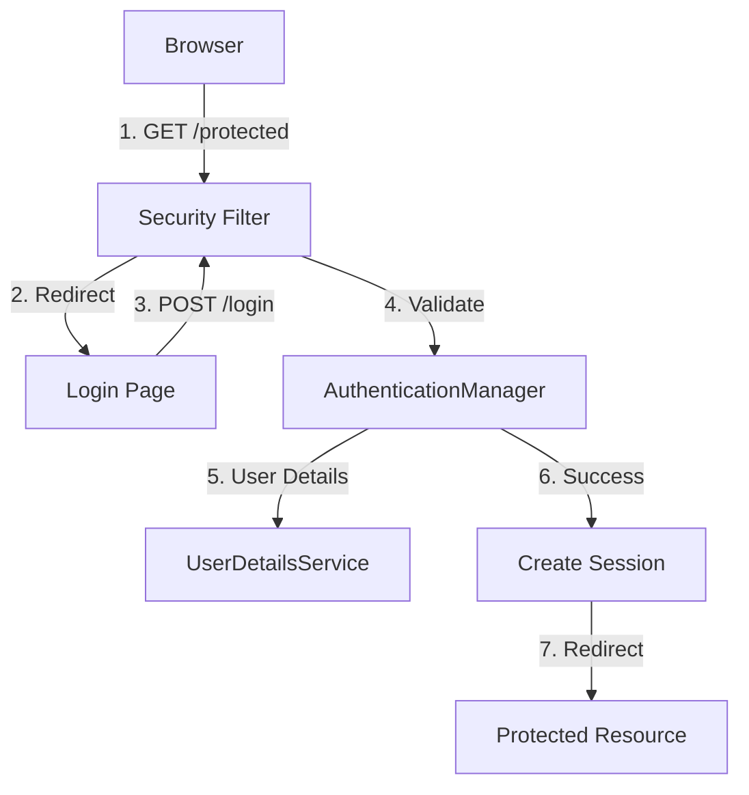
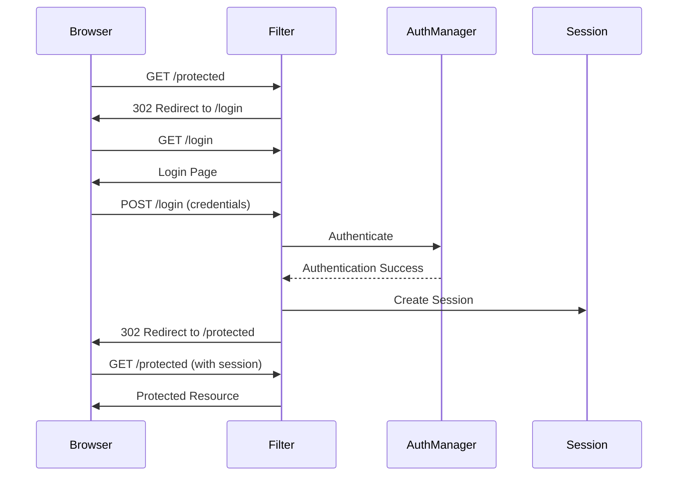

# 2. Form-Based Authentication

## 1. Introduction
Form-based authentication is the most common authentication mechanism for web applications. It uses HTML forms to collect user credentials (username/password) and validates them against a user store. Spring Security provides built-in support for form-based authentication with customizable login pages.

## 2. Learning Objectives
- Configure form-based authentication in Spring Security
- Create custom login pages and controllers
- Implement session management and timeout
- Handle logout and session invalidation
- Understand session fixation attacks and prevention

## 3. Prerequisites
- Understanding of Spring Security fundamentals
- Knowledge of HTML forms and HTTP POST
- Familiarity with session management concepts

## 4. Why This Concept Exists
Form-based authentication provides a user-friendly way to authenticate users through web browsers. It's widely used because it's familiar to users and can be customized to match application branding.

## 5. Problem Statement
Web applications need a secure way to:
- Collect user credentials through a login form
- Validate credentials against a user store
- Maintain user sessions after successful login
- Protect against session hijacking and fixation
- Handle logout properly

## 6. Theory
Form-based authentication works as follows:
1. User accesses a protected resource
2. Application redirects to login page
3. User submits credentials via POST request
4. Authentication filter processes the request
5. Credentials are validated
6. On success, session is created and user is redirected
7. On failure, user is shown error message

## 7. Internal Working
Spring Security's form-based auth uses:
- `UsernamePasswordAuthenticationFilter` to process login requests
- `SessionManagementFilter` to handle sessions
- `CsrfFilter` to protect against CSRF attacks
- `LogoutFilter` to handle logout requests

## 8. JVM Perspective
- Sessions are stored in memory or distributed cache
- HttpSession objects are managed by servlet container
- SecurityContext is stored in SecurityContextHolder (ThreadLocal)

## 9. Memory Representation
```java
// Session attributes
HttpSession session = request.getSession();
session.setAttribute("SPRING_SECURITY_CONTEXT", securityContext);

// SecurityContext in ThreadLocal
SecurityContextHolder.getContext().setAuthentication(authentication);
```

## 10. Architecture Diagram


## 11. Flow Diagram


## 12. Syntax
```java
http
    .formLogin(form -> form
        .loginPage("/login")
        .loginProcessingUrl("/perform_login")
        .defaultSuccessUrl("/dashboard", true)
        .failureUrl("/login?error=true")
        .usernameParameter("username")
        .passwordParameter("password")
        .permitAll()
    )
    .logout(logout -> logout
        .logoutUrl("/logout")
        .logoutSuccessUrl("/login?logout=true")
        .deleteCookies("JSESSIONID")
        .invalidateHttpSession(true)
    );
```

## 13. Easy Example
```java
@Configuration
@EnableWebSecurity
public class FormLoginConfig {
    
    @Bean
    public SecurityFilterChain filterChain(HttpSecurity http) throws Exception {
        http
            .authorizeHttpRequests(auth -> auth
                .requestMatchers("/login", "/css/**").permitAll()
                .anyRequest().authenticated()
            )
            .formLogin(form -> form
                .loginPage("/login")
                .defaultSuccessUrl("/dashboard")
                .permitAll()
            );
        return http.build();
    }
}
```

## 14. Medium Example
```java
@Controller
public class LoginController {
    
    @GetMapping("/login")
    public String login(
            @RequestParam(value = "error", required = false) String error,
            @RequestParam(value = "logout", required = false) String logout,
            Model model) {
        
        if (error != null) {
            model.addAttribute("errorMessage", "Invalid username or password");
        }
        if (logout != null) {
            model.addAttribute("successMessage", "You have been logged out");
        }
        return "login";
    }
    
    @GetMapping("/dashboard")
    public String dashboard(Model model, Principal principal) {
        model.addAttribute("username", principal.getName());
        return "dashboard";
    }
}
```

## 15. Hard Example
```java
@Configuration
@EnableWebSecurity
public class AdvancedFormLoginConfig {
    
    @Bean
    public SecurityFilterChain filterChain(HttpSecurity http) throws Exception {
        http
            .authorizeHttpRequests(auth -> auth
                .requestMatchers("/login", "/register", "/css/**").permitAll()
                .requestMatchers("/admin/**").hasRole("ADMIN")
                .anyRequest().authenticated()
            )
            .formLogin(form -> form
                .loginPage("/login")
                .loginProcessingUrl("/authenticate")
                .defaultSuccessUrl("/dashboard", false)
                .failureHandler(customAuthenticationFailureHandler())
                .successHandler(customAuthenticationSuccessHandler())
                .usernameParameter("email")
                .passwordParameter("pwd")
                .permitAll()
            )
            .sessionManagement(session -> session
                .sessionCreationPolicy(SessionCreationPolicy.IF_REQUIRED)
                .maximumSessions(1)
                .maxSessionsPreventsLogin(false)
                .expiredUrl("/login?expired=true")
            )
            .logout(logout -> logout
                .logoutUrl("/logout")
                .logoutSuccessHandler(customLogoutSuccessHandler())
                .deleteCookies("JSESSIONID")
                .invalidateHttpSession(true)
                .clearAuthentication(true)
            );
        return http.build();
    }
    
    @Bean
    public AuthenticationFailureHandler customAuthenticationFailureHandler() {
        return (request, response, exception) -> {
            response.sendRedirect("/login?error=true&message=" + 
                exception.getMessage());
        };
    }
    
    @Bean
    public AuthenticationSuccessHandler customAuthenticationSuccessHandler() {
        return (request, response, authentication) -> {
            Set<String> roles = authentication.getAuthorities().stream()
                .map(GrantedAuthority::getAuthority)
                .collect(Collectors.toSet());
            
            if (roles.contains("ROLE_ADMIN")) {
                response.sendRedirect("/admin/dashboard");
            } else {
                response.sendRedirect("/user/dashboard");
            }
        };
    }
}
```

## 16. Enterprise Example
```java
@Service
public class EnterpriseFormLoginService {
    
    @Autowired
    private UserRepository userRepository;
    
    @Autowired
    private LoginAttemptService loginAttemptService;
    
    @Autowired
    private PasswordEncoder passwordEncoder;
    
    @Autowired
    private ApplicationEventPublisher eventPublisher;
    
    public AuthenticationResult authenticate(String email, String password, 
            HttpServletRequest request) {
        
        String ip = getClientIP(request);
        
        if (loginAttemptService.isBlocked(ip)) {
            throw new CustomAuthenticationException(
                "IP blocked due to too many failed attempts");
        }
        
        Optional<User> userOpt = userRepository.findByEmail(email);
        
        if (userOpt.isEmpty()) {
            loginAttemptService.loginFailed(ip);
            eventPublisher.publishEvent(new AuthenticationFailureEvent(
                email, ip, "User not found"));
            throw new UsernameNotFoundException("User not found");
        }
        
        User user = userOpt.get();
        
        if (!passwordEncoder.matches(password, user.getPassword())) {
            loginAttemptService.loginFailed(ip);
            user.setFailedLoginAttempts(user.getFailedLoginAttempts() + 1);
            userRepository.save(user);
            
            eventPublisher.publishEvent(new AuthenticationFailureEvent(
                email, ip, "Invalid password"));
            throw new BadCredentialsException("Invalid password");
        }
        
        if (!user.isEnabled()) {
            throw new DisabledException("Account is disabled");
        }
        
        loginAttemptService.loginSucceeded(ip);
        user.setLastLoginDate(LocalDateTime.now());
        user.setFailedLoginAttempts(0);
        userRepository.save(user);
        
        eventPublisher.publishEvent(new AuthenticationSuccessEvent(
            email, ip));
        
        return new AuthenticationResult(true, "Login successful");
    }
    
    private String getClientIP(HttpServletRequest request) {
        String xForwardedFor = request.getHeader("X-Forwarded-For");
        if (xForwardedFor != null && !xForwardedFor.isEmpty()) {
            return xForwardedFor.split(",")[0].trim();
        }
        return request.getRemoteAddr();
    }
}
```

## 17. Performance
- Session creation adds ~1-2ms overhead
- Password encoding with BCrypt adds ~100ms (intentionally slow)
- Session validation is O(1) per request
- Login attempt tracking uses in-memory cache

## 18. Time & Space Complexity
- **Login**: O(1) for credential validation
- **Session Creation**: O(1)
- **Session Lookup**: O(1)
- **Space**: O(n) where n is number of active sessions

## 19. Thread Safety
- SecurityContext is thread-safe (ThreadLocal)
- Session objects are thread-safe per session
- LoginAttemptService should use concurrent data structures
- Event publishing is asynchronous

## 20. Best Practices
1. Always use HTTPS for login forms
2. Implement CSRF protection
3. Use secure session cookies (HttpOnly, Secure)
4. Implement session timeout
5. Log authentication attempts (success and failure)
6. Implement account lockout after failed attempts
7. Use parameterized queries to prevent SQL injection
8. Sanitize user input

## 21. Common Mistakes
1. Not implementing CSRF protection
2. Storing passwords in plain text
3. Not handling session fixation
4. Overly long session timeout
5. Not logging security events
6. Exposing sensitive information in error messages

## 22. Pitfalls
- Session fixation attacks if session ID isn't regenerated
- Session fixation if cookies aren't properly configured
- Memory leaks from improper session cleanup
- Race conditions in login attempt tracking
- Information leakage through error messages

## 23. Debugging Tips
1. Enable session logging: `logging.level.org.springframework.session=DEBUG`
2. Check cookie configuration in browser developer tools
3. Verify CSRF token generation and validation
4. Test with multiple browsers and devices
5. Check session replication in distributed environments

## 24. Comparison Table
| Feature | Form Login | HTTP Basic | OAuth2 |
|---------|-----------|------------|--------|
| User Experience | High | Low | Medium |
| Security | Medium | Low | High |
| Customization | High | Low | Medium |
| Mobile Support | Medium | High | High |
| Session Management | Yes | No | Token-based |

## 25. Decision Tree
```
Need Form Login?
├── Yes → Custom Login Page?
│   ├── Yes → Custom controller + template
│   └── No → Default Spring Security login
└── No → Need API Authentication?
    ├── Yes → HTTP Basic or JWT
    └── No → Public Access
```

## 26. Interview Questions
1. What is form-based authentication and how does it work?
2. How does Spring Security handle session management?
3. What is session fixation and how does Spring Security prevent it?
4. Explain the difference between session and token-based authentication.
5. How do you implement remember-me functionality?
6. What are the security considerations for login forms?
7. How do you handle logout properly?
8. What is CSRF protection and why is it important for form login?
9. How do you implement account lockout after failed login attempts?
10. What is the difference between concurrent session control and session fixation prevention?
11. How do you secure session cookies?
12. What is the role of HttpSessionEventPublisher?
13. How do you implement custom authentication success/failure handlers?
14. What are the best practices for session timeout configuration?
15. How do you handle session in distributed environments?

## 27. Exercises
### Beginner
1. Implement basic form-based authentication with default login page
2. Create a custom login page with Thymeleaf
3. Configure session timeout and logout

### Intermediate
1. Implement account lockout after 5 failed login attempts
2. Add remember-me functionality with persistent tokens
3. Create custom authentication success/failure handlers

### Advanced
1. Implement multi-factor authentication with form login
2. Create session management dashboard for admins
3. Implement distributed session management with Redis

## 28. Summary
Form-based authentication is the most common authentication mechanism for web applications. Spring Security provides comprehensive support for implementing secure form login with customizable options. Proper session management, CSRF protection, and security event logging are essential for a secure implementation.

## 29. References
- [Spring Security Form Login](https://docs.spring.io/spring-security/reference/servlet/authentication/passwords/form-based-login.html)
- [Session Management](https://docs.spring.io/spring-security/reference/servlet/session-management.html)
- [OWASP Session Management](https://owasp.org/www-community/attacks/Session_fixation)
