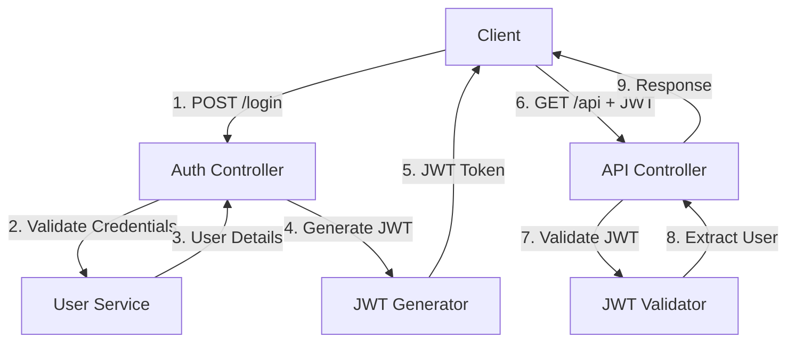
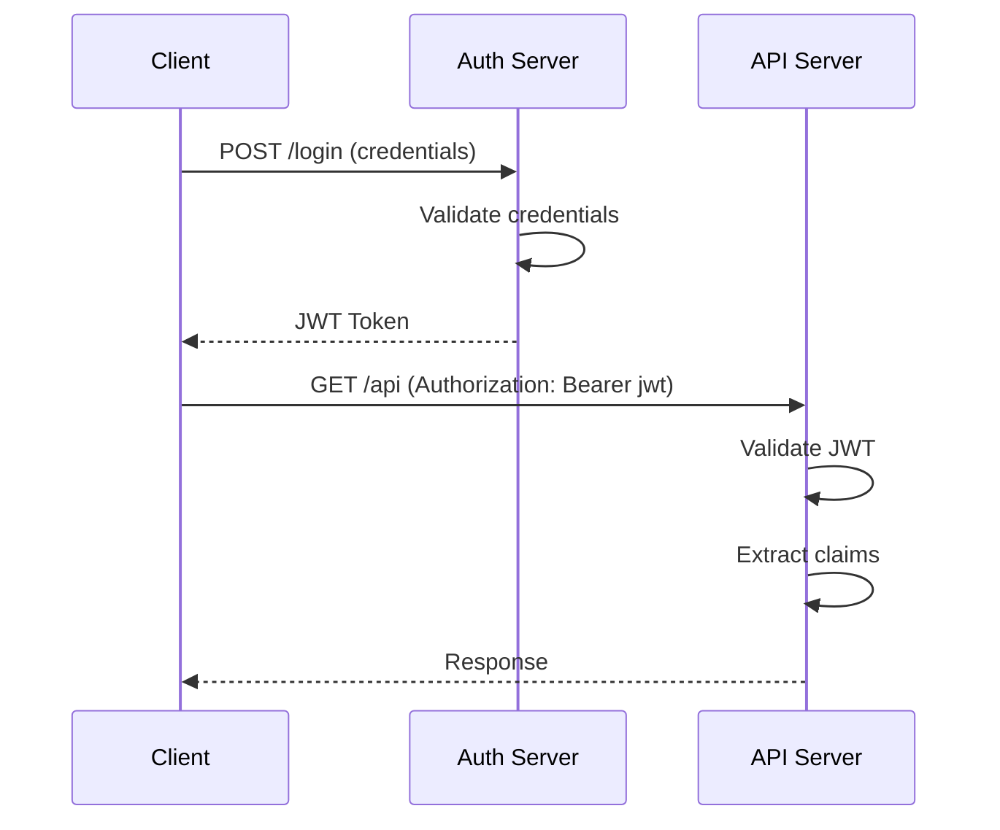

# 3. JWT Authentication

## 1. Introduction
JSON Web Tokens (JWT) are an open standard (RFC 7519) for securely transmitting information between parties as a JSON object. JWT authentication is widely used for stateless API authentication, where the token contains all necessary user information.

## 2. Learning Objectives
- Understand JWT structure and components
- Implement JWT generation and validation
- Configure stateless authentication in Spring Security
- Implement refresh token mechanism
- Handle JWT security best practices

## 3. Prerequisites
- Understanding of Spring Security basics
- Knowledge of REST APIs
- Familiarity with JSON and Base64 encoding
- Understanding of cryptographic concepts

## 4. Why This Concept Exists
JWT provides a stateless authentication mechanism where the server doesn't need to store session information. This is essential for microservices architectures and scalable APIs where maintaining server-side sessions becomes a bottleneck.

## 5. Problem Statement
Traditional session-based authentication has limitations:
- Server must store session data
- Session sharing in distributed systems is complex
- Scalability issues with sticky sessions
- CORS limitations with cookies

## 6. Theory
JWT consists of three parts:
1. **Header**: Contains algorithm and token type
2. **Payload**: Contains claims (user data, expiration, etc.)
3. **Signature**: Ensures token integrity

Token format: `xxxxx.yyyyy.zzzzz`

Each part is Base64URL encoded and separated by dots.

## 7. Internal Working
1. User authenticates with credentials
2. Server generates JWT with user claims
3. JWT is sent to client
4. Client stores JWT (localStorage/cookie)
5. Client sends JWT in Authorization header for each request
6. Server validates JWT without database lookup
7. Server extracts user information from JWT

## 8. JVM Perspective
- JWT libraries (jjwt, auth0) handle encoding/decoding
- Signature verification uses cryptographic algorithms
- Token validation is CPU-intensive (use caching)
- Stateless nature reduces memory usage

## 9. Memory Representation
```java
// JWT Structure
String jwt = "header.payload.signature";

// Header
{"alg": "HS256", "typ": "JWT"}

// Payload
{"sub": "user123", "roles": ["USER"], "exp": 1234567890}

// Signature
HMACSHA256(base64(header) + "." + base64(payload), secret)
```

## 10. Architecture Diagram


## 11. Flow Diagram


## 12. Syntax
```java
// Generate JWT
String jwt = Jwts.builder()
    .setSubject(username)
    .claim("roles", roles)
    .setIssuedAt(new Date())
    .setExpiration(new Date(System.currentTimeMillis() + 3600000))
    .signWith(SignatureAlgorithm.HS256, secret)
    .compact();

// Validate JWT
Claims claims = Jwts.parser()
    .setSigningKey(secret)
    .parseClaimsJws(token)
    .getBody();
```

## 13. Easy Example
```java
@Component
public class JwtTokenProvider {
    
    @Value("${jwt.secret}")
    private String jwtSecret;
    
    @Value("${jwt.expiration}")
    private long jwtExpiration;
    
    public String generateToken(String username) {
        return Jwts.builder()
            .setSubject(username)
            .setIssuedAt(new Date())
            .setExpiration(new Date(System.currentTimeMillis() + jwtExpiration))
            .signWith(SignatureAlgorithm.HS256, jwtSecret)
            .compact();
    }
    
    public String getUsernameFromToken(String token) {
        return Jwts.parser()
            .setSigningKey(jwtSecret)
            .parseClaimsJws(token)
            .getBody()
            .getSubject();
    }
}
```

## 14. Medium Example
```java
@Component
public class JwtAuthenticationFilter extends OncePerRequestFilter {
    
    @Autowired
    private JwtTokenProvider tokenProvider;
    
    @Autowired
    private UserDetailsService userDetailsService;
    
    @Override
    protected void doFilterInternal(HttpServletRequest request,
            HttpServletResponse response, FilterChain filterChain)
            throws ServletException, IOException {
        
        String jwt = getJwtFromRequest(request);
        
        if (StringUtils.hasText(jwt) && tokenProvider.validateToken(jwt)) {
            String username = tokenProvider.getUsernameFromToken(jwt);
            UserDetails userDetails = userDetailsService
                .loadUserByUsername(username);
            
            UsernamePasswordAuthenticationToken authentication =
                new UsernamePasswordAuthenticationToken(
                    userDetails, null, userDetails.getAuthorities());
            
            authentication.setDetails(
                new WebAuthenticationDetailsSource().buildDetails(request));
            
            SecurityContextHolder.getContext()
                .setAuthentication(authentication);
        }
        
        filterChain.doFilter(request, response);
    }
    
    private String getJwtFromRequest(HttpServletRequest request) {
        String bearerToken = request.getHeader("Authorization");
        if (StringUtils.hasText(bearerToken) && bearerToken.startsWith("Bearer ")) {
            return bearerToken.substring(7);
        }
        return null;
    }
}
```

## 15. Hard Example
```java
@Service
public class JwtTokenService {
    
    @Value("${jwt.secret}")
    private String secret;
    
    @Value("${jwt.access-token.expiration}")
    private long accessTokenExpiration;
    
    @Value("${jwt.refresh-token.expiration}")
    private long refreshTokenExpiration;
    
    @Autowired
    private RefreshTokenRepository refreshTokenRepository;
    
    public TokenPair generateTokenPair(UserDetails userDetails) {
        String accessToken = generateAccessToken(userDetails);
        String refreshToken = generateRefreshToken(userDetails);
        
        RefreshToken token = new RefreshToken();
        token.setToken(refreshToken);
        token.setUsername(userDetails.getUsername());
        token.setExpiryDate(Instant.now().plusMillis(refreshTokenExpiration));
        refreshTokenRepository.save(token);
        
        return new TokenPair(accessToken, refreshToken);
    }
    
    private String generateAccessToken(UserDetails userDetails) {
        Date now = new Date();
        Date expiryDate = new Date(now.getTime() + accessTokenExpiration);
        
        return Jwts.builder()
            .setSubject(userDetails.getUsername())
            .claim("roles", userDetails.getAuthorities().stream()
                .map(GrantedAuthority::getAuthority)
                .collect(Collectors.toList()))
            .setIssuedAt(now)
            .setExpiration(expiryDate)
            .signWith(SignatureAlgorithm.HS512, secret)
            .compact();
    }
    
    private String generateRefreshToken(UserDetails userDetails) {
        Date now = new Date();
        Date expiryDate = new Date(now.getTime() + refreshTokenExpiration);
        
        return Jwts.builder()
            .setSubject(userDetails.getUsername())
            .setIssuedAt(now)
            .setExpiration(expiryDate)
            .signWith(SignatureAlgorithm.HS512, secret)
            .compact();
    }
    
    public boolean validateToken(String token) {
        try {
            Jwts.parser().setSigningKey(secret).parseClaimsJws(token);
            return true;
        } catch (JwtException | IllegalArgumentException e) {
            return false;
        }
    }
    
    public Claims getClaimsFromToken(String token) {
        return Jwts.parser()
            .setSigningKey(secret)
            .parseClaimsJws(token)
            .getBody();
    }
    
    public void invalidateRefreshToken(String token) {
        refreshTokenRepository.deleteByToken(token);
    }
}
```

## 16. Enterprise Example
```java
@RestController
@RequestMapping("/api/auth")
public class AuthenticationController {
    
    @Autowired
    private AuthenticationManager authenticationManager;
    
    @Autowired
    private JwtTokenService tokenService;
    
    @Autowired
    private UserRepository userRepository;
    
    @PostMapping("/login")
    public ResponseEntity<?> login(@Valid @RequestBody LoginRequest request) {
        try {
            Authentication authentication = authenticationManager.authenticate(
                new UsernamePasswordAuthenticationToken(
                    request.getEmail(), request.getPassword()));
            
            SecurityContextHolder.getContext().setAuthentication(authentication);
            
            UserDetails userDetails = (UserDetails) authentication
                .getPrincipal();
            
            TokenPair tokens = tokenService.generateTokenPair(userDetails);
            
            User user = userRepository.findByEmail(request.getEmail())
                .orElseThrow();
            user.setLastLoginDate(LocalDateTime.now());
            userRepository.save(user);
            
            return ResponseEntity.ok(new AuthResponse(
                tokens.getAccessToken(),
                tokens.getRefreshToken(),
                "Bearer",
                3600
            ));
            
        } catch (BadCredentialsException e) {
            return ResponseEntity.status(HttpStatus.UNAUTHORIZED)
                .body(new ErrorResponse("Invalid credentials"));
        }
    }
    
    @PostMapping("/refresh")
    public ResponseEntity<?> refreshToken(
            @Valid @RequestBody RefreshTokenRequest request) {
        
        if (!tokenService.validateToken(request.getRefreshToken())) {
            return ResponseEntity.status(HttpStatus.UNAUTHORIZED)
                .body(new ErrorResponse("Invalid refresh token"));
        }
        
        Claims claims = tokenService.getClaimsFromToken(
            request.getRefreshToken());
        String username = claims.getSubject();
        
        UserDetails userDetails = new User(username, "", Collections.emptyList());
        TokenPair tokens = tokenService.generateTokenPair(userDetails);
        
        tokenService.invalidateRefreshToken(request.getRefreshToken());
        
        return ResponseEntity.ok(new AuthResponse(
            tokens.getAccessToken(),
            tokens.getRefreshToken(),
            "Bearer",
            3600
        ));
    }
}
```

## 17. Performance
- JWT validation is O(1) - no database lookup
- Token generation is O(n) where n is number of claims
- Signature verification is CPU-intensive (~1ms)
- Stateless nature enables horizontal scaling

## 18. Time & Space Complexity
- **Token Generation**: O(n) where n is claims
- **Token Validation**: O(1)
- **Token Parsing**: O(1)
- **Space**: O(1) per token (fixed size)

## 19. Thread Safety
- JWT provider must be thread-safe
- Token validation should be synchronized
- Refresh token repository must handle concurrent access
- Use immutable objects for token claims

## 20. Best Practices
1. Use strong signing keys (256+ bits)
2. Set reasonable token expiration times
3. Implement refresh token rotation
4. Validate all token claims
5. Use HTTPS only
6. Store tokens securely (httpOnly cookies preferred)
7. Implement token revocation mechanism
8. Log token usage for audit

## 21. Common Mistakes
1. Storing JWT in localStorage (XSS vulnerability)
2. Using weak signing keys
3. Not validating token expiration
4. Including sensitive data in payload
5. Not implementing token revocation
6. Using same secret for all environments

## 22. Pitfalls
- JWT cannot be invalidated before expiration (without blacklist)
- Token size can grow with many claims
- Payload is only encoded, not encrypted
- Clock skew can cause validation issues
- Refresh token rotation can cause issues with concurrent requests

## 23. Debugging Tips
1. Decode JWT at jwt.io for inspection
2. Check token expiration timestamps
3. Verify signing key configuration
4. Test with different token formats
5. Check CORS configuration for Authorization header

## 24. Comparison Table
| Feature | JWT | Session | OAuth2 |
|---------|-----|---------|--------|
| State | Stateless | Stateful | Stateless |
| Storage | Client | Server | Client |
| Scalability | High | Low | High |
| Revocation | Difficult | Easy | Medium |
| Size | Fixed | Variable | Variable |

## 25. Decision Tree
```
Need Authentication?
├── Yes → Type?
│   ├── Web App → Session-based
│   ├── API → JWT
│   └── Third-party → OAuth2
└── No → Public Access
```

## 26. Interview Questions
1. What is JWT and what are its components?
2. How does JWT authentication work?
3. What are the security implications of JWT?
4. How do you implement token refresh?
5. What is the difference between JWT and session-based authentication?
6. How do you handle token revocation?
7. What are the best practices for JWT security?
8. How do you store JWT tokens on the client?
9. What is the purpose of token expiration?
10. How do you handle token blacklisting?
11. What are the limitations of JWT?
12. How do you implement JWT in microservices?
13. What is the difference between JWT and OAuth2 tokens?
14. How do you validate JWT tokens?
15. What are common JWT vulnerabilities?

## 27. Exercises
### Beginner
1. Implement basic JWT generation and validation
2. Create login endpoint that returns JWT
3. Implement JWT filter for protected endpoints

### Intermediate
1. Implement refresh token mechanism
2. Add token blacklisting for logout
3. Implement role-based claims in JWT

### Advanced
1. Implement JWT with RSA keys
2. Create JWT-based SSO solution
3. Implement token introspection endpoint

## 28. Summary
JWT authentication provides a stateless, scalable solution for API authentication. Understanding JWT structure, security considerations, and implementation patterns is essential for building modern RESTful APIs and microservices.

## 29. References
- [JWT Official Site](https://jwt.io/)
- [RFC 7519 - JSON Web Token](https://tools.ietf.org/html/rfc7519)
- [Spring Security JWT](https://spring.io/projects/spring-security)
