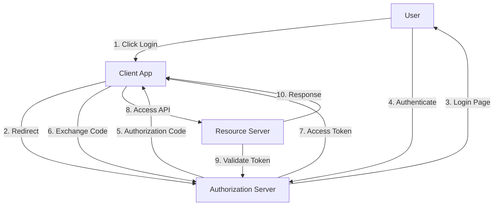
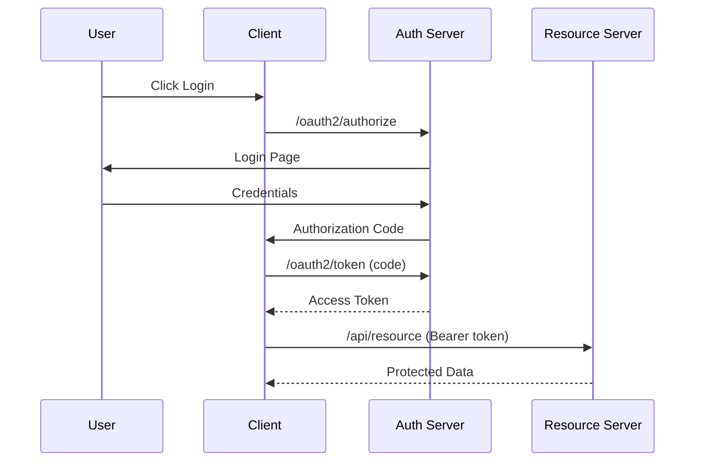

# 4. OAuth2

## 1. Introduction
OAuth 2.0 is an authorization framework that enables third-party applications to obtain limited access to HTTP services on behalf of a resource owner. It's the industry-standard protocol for authorization and is used by major platforms like Google, Facebook, GitHub, and Twitter.

## 2. Learning Objectives
- Understand OAuth2 concepts and flows
- Implement OAuth2 client in Spring Security
- Configure social login (Google, GitHub)
- Understand OpenID Connect (OIDC)
- Implement Resource Server configuration

## 3. Prerequisites
- Understanding of HTTP and REST APIs
- Knowledge of Spring Security basics
- Familiarity with REST clients
- Understanding of JSON

## 4. Why This Concept Exists
OAuth2 solves the problem of sharing credentials between services. Instead of giving your password to a third-party app, OAuth2 allows limited access without exposing credentials. It enables secure delegation of access.

## 5. Problem Statement
Traditional authentication has issues:
- Sharing passwords is insecure
- No way to limit access scope
- Can't revoke access for specific apps
- Users can't control what data apps access

## 6. Theory
OAuth2 has four roles:
1. **Resource Owner**: The user who owns the data
2. **Client**: The application requesting access
3. **Resource Server**: The API hosting the protected resources
4. **Authorization Server**: The server issuing access tokens

OAuth2 has four grant types:
- Authorization Code (most common)
- Client Credentials (machine-to-machine)
- Implicit (deprecated)
- Resource Owner Password Credentials (deprecated)

## 7. Internal Working
1. Client redirects to Authorization Server
2. User authenticates and consents
3. Authorization Server redirects back with code
4. Client exchanges code for access token
5. Client uses access token to access resources
6. Resource Server validates token

## 8. JVM Perspective
- Spring Security OAuth2 uses RestTemplate/WebClient
- Token introspection happens via HTTP call
- JWT tokens are validated locally
- Client configuration stored in application.properties

## 9. Memory Representation
```java
// OAuth2 Client Configuration
OAuth2Client client = OAuth2Client.builder()
    .clientId("client-id")
    .clientSecret("client-secret")
    .authorizationUri("https://provider.com/oauth2/authorize")
    .tokenUri("https://provider.com/oauth2/token")
    .build();

// OAuth2 Authorization Grant
AuthorizationGrant authGrant = AuthorizationGrant
    .authorizationCode(code, redirectUri);
```

## 10. Architecture Diagram


## 11. Flow Diagram


## 12. Syntax
```java
http
    .oauth2Login(oauth2 -> oauth2
        .loginPage("/login")
        .defaultSuccessUrl("/dashboard")
        .failureUrl("/login?error=true")
        .userInfoEndpoint(userInfo -> userInfo
            .userService(customOAuth2UserService())
        )
    )
    .oauth2Client(oauth2 -> oauth2)
    .oauth2ResourceServer(oauth2 -> oauth2
        .jwt(withDefaults())
    );
```

## 13. Easy Example
```java
@Configuration
@EnableWebSecurity
public class OAuth2LoginConfig {
    
    @Bean
    public SecurityFilterChain filterChain(HttpSecurity http) throws Exception {
        http
            .authorizeHttpRequests(auth -> auth
                .requestMatchers("/", "/login").permitAll()
                .anyRequest().authenticated()
            )
            .oauth2Login(oauth2 -> oauth2
                .loginPage("/login")
                .defaultSuccessUrl("/dashboard")
            );
        return http.build();
    }
}
```

## 14. Medium Example
```java
@Service
public class CustomOAuth2UserService extends DefaultOAuth2UserService {
    
    @Autowired
    private UserRepository userRepository;
    
    @Autowired
    private RoleRepository roleRepository;
    
    @Override
    public OAuth2User loadUser(OAuth2UserRequest userRequest) 
            throws OAuth2AuthenticationException {
        
        OAuth2User oauth2User = super.loadUser(userRequest);
        
        String registrationId = userRequest.getClientRegistration()
            .getRegistrationId();
        String email = oauth2User.getAttribute("email");
        String name = oauth2User.getAttribute("name");
        
        User user = userRepository.findByEmail(email)
            .orElseGet(() -> {
                User newUser = new User();
                newUser.setEmail(email);
                newUser.setUsername(email);
                newUser.setFullName(name);
                newUser.setProvider(Provider.valueOf(
                    registrationId.toUpperCase()));
                newUser.setEnabled(true);
                
                Role userRole = roleRepository.findByName("ROLE_USER")
                    .orElseThrow();
                newUser.setRoles(Set.of(userRole));
                
                return userRepository.save(newUser);
            });
        
        return new DefaultOAuth2User(
            Collections.singleton(new SimpleGrantedAuthority("ROLE_USER")),
            oauth2User.getAttributes(),
            "email"
        );
    }
}
```

## 15. Hard Example
```java
@Configuration
@EnableWebSecurity
public class MultiProviderOAuth2Config {
    
    @Bean
    public SecurityFilterChain filterChain(HttpSecurity http) throws Exception {
        http
            .authorizeHttpRequests(auth -> auth
                .requestMatchers("/", "/login", "/error").permitAll()
                .requestMatchers("/admin/**").hasRole("ADMIN")
                .anyRequest().authenticated()
            )
            .oauth2Login(oauth2 -> oauth2
                .loginPage("/login")
                .defaultSuccessUrl("/dashboard")
                .userInfoEndpoint(userInfo -> userInfo
                    .userService(customOAuth2UserService())
                    .oidcUserService(customOidcUserService())
                )
            )
            .oauth2Client(oauth2 -> oauth2
                .authorizationCodeGrant(auth -> auth
                    .registrationRepository(auth2RegistrationRepository())
                )
            );
        return http.build();
    }
    
    @Bean
    public OAuth2AuthorizedClientRepository authorizedClientRepository() {
        return new AuthenticatedPrincipalOAuth2AuthorizedClientRepository();
    }
}
```

## 16. Enterprise Example
```java
@RestController
@RequestMapping("/api/users")
public class UserResourceController {
    
    @Autowired
    private UserRepository userRepository;
    
    @GetMapping("/me")
    public ResponseEntity<UserDTO> getCurrentUser(
            @AuthenticationPrincipal OAuth2User principal) {
        
        String email = principal.getAttribute("email");
        User user = userRepository.findByEmail(email)
            .orElseThrow(() -> new ResourceNotFoundException(
                "User not found"));
        
        UserDTO dto = UserDTO.builder()
            .id(user.getId())
            .email(user.getEmail())
            .fullName(user.getFullName())
            .provider(user.getProvider())
            .roles(user.getRoles().stream()
                .map(Role::getName)
                .collect(Collectors.toList()))
            .build();
        
        return ResponseEntity.ok(dto);
    }
    
    @PostMapping("/link")
    public ResponseEntity<?> linkAccount(
            @AuthenticationPrincipal OAuth2User principal,
            @RequestBody LinkProviderRequest request) {
        
        String email = principal.getAttribute("email");
        User user = userRepository.findByEmail(email)
            .orElseThrow();
        
        user.setProviderId(request.getProviderId());
        userRepository.save(user);
        
        return ResponseEntity.ok(Map.of("message", "Account linked successfully"));
    }
}
```

## 17. Performance
- OAuth2 flow involves multiple HTTP calls (~100-200ms)
- Token validation can be cached
- User info endpoint calls should be minimized
- Use refresh tokens to reduce authentication calls

## 18. Time & Space Complexity
- **Authorization Flow**: O(1) - fixed steps
- **Token Validation**: O(1)
- **User Info Retrieval**: O(n) where n is user attributes
- **Space**: O(1) per token

## 19. Thread Safety
- OAuth2 client must be thread-safe
- Token storage should be thread-safe
- User info loading should be synchronized
- Authorized client repository must handle concurrent access

## 20. Best Practices
1. Use Authorization Code flow (not Implicit)
2. Validate state parameter to prevent CSRF
3. Use PKCE for public clients
4. Store tokens securely (httpOnly cookies)
5. Implement token refresh
6. Use scopes to limit access
7. Validate redirect URIs
8. Log OAuth2 events for audit

## 21. Common Mistakes
1. Not validating state parameter
2. Storing client secret in client-side code
3. Not using HTTPS
4. Overly broad scopes
5. Not implementing token revocation
6. Exposing tokens in URLs

## 22. Pitfalls
- CSRF attacks if state parameter not validated
- Token leakage if stored insecurely
- Scope creep with overly broad permissions
- Redirect URI manipulation attacks
- Token replay attacks

## 23. Debugging Tips
1. Enable OAuth2 debug logging
2. Check redirect URI configuration
3. Verify client credentials
4. Test with different scopes
5. Check token expiration

## 24. Comparison Table
| Feature | OAuth2 | SAML | OpenID Connect |
|---------|--------|------|----------------|
| Protocol | Authorization | Authentication | Authentication |
| Format | JSON/REST | XML/SOAP | JSON/REST |
| Complexity | Medium | High | Low |
| Mobile | Good | Poor | Good |
| Use Case | API access | Enterprise SSO | Social login |

## 25. Decision Tree
```
Need Authentication?
├── Yes → Type?
│   ├── Social Login → OAuth2
│   ├── Enterprise SSO → SAML
│   └── API Access → OAuth2 Client Credentials
└── No → Public Access
```

## 26. Interview Questions
1. What is OAuth2 and how does it work?
2. What are the different OAuth2 grant types?
3. What is the difference between OAuth2 and OpenID Connect?
4. How do you implement OAuth2 login in Spring Security?
5. What is PKCE and why is it important?
6. How do you secure OAuth2 tokens?
7. What is the difference between access and refresh tokens?
8. How do you implement OAuth2 for APIs?
9. What is token introspection?
10. How do you handle token revocation?
11. What are OAuth2 scopes?
12. How do you implement multi-provider login?
13. What is the difference between OAuth2 and JWT?
14. How do you secure the authorization server?
15. What are common OAuth2 vulnerabilities?

## 27. Exercises
### Beginner
1. Implement GitHub OAuth2 login
2. Configure Google OAuth2 login
3. Create user registration from OAuth2 attributes

### Intermediate
1. Implement multi-provider OAuth2 login
2. Add account linking for multiple providers
3. Implement OAuth2 client for API access

### Advanced
1. Build OAuth2 Authorization Server
2. Implement OAuth2 Resource Server
3. Create OAuth2 token revocation endpoint

## 28. Summary
OAuth2 is the industry standard for authorization, enabling secure access delegation. Spring Security provides comprehensive support for OAuth2 client and resource server configurations. Understanding OAuth2 flows, security considerations, and implementation patterns is essential for modern application development.

## 29. References
- [OAuth2 Official](https://oauth.net/2/)
- [Spring Security OAuth2](https://spring.io/projects/spring-security-oauth)
- [OpenID Connect](https://openid.net/connect/)
