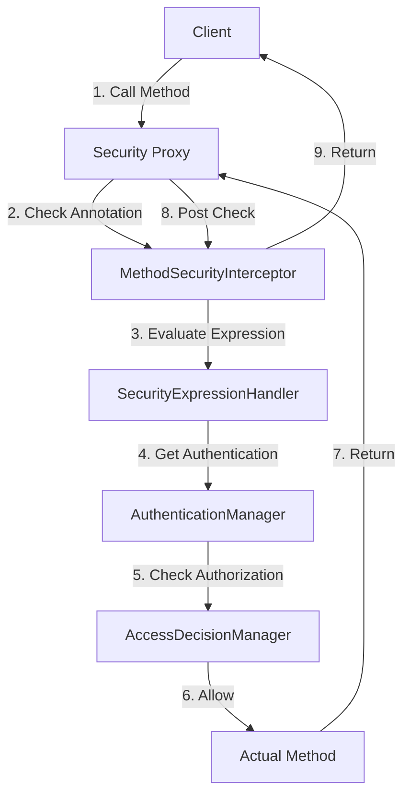
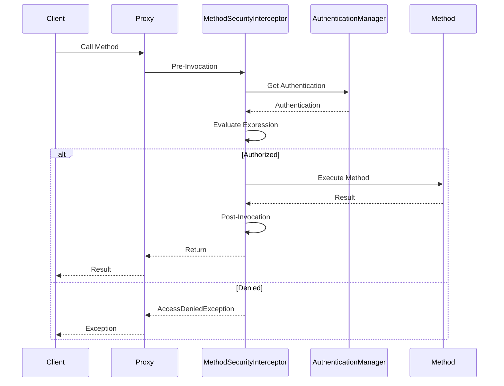

# 5. Method Security

## 1. Introduction
Method-level security in Spring Security provides fine-grained access control at the method level. It uses annotations like `@PreAuthorize`, `@PostAuthorize`, and `@Secured` to secure individual methods based on the caller's authentication and authorization.

## 2. Learning Objectives
- Understand method-level security annotations
- Implement `@PreAuthorize` and `@PostAuthorize`
- Use `@Secured` for role-based access
- Create custom security expressions
- Understand AOP-based security implementation

## 3. Prerequisites
- Understanding of Spring Security basics
- Knowledge of Spring AOP
- Familiarity with Java annotations
- Understanding of SpEL (Spring Expression Language)

## 4. Why This Concept Exists
Method-level security provides more granular control than URL-based security. It allows securing specific business logic methods regardless of how they're invoked, ensuring consistent security across different entry points.

## 5. Problem Statement
URL-based security has limitations:
- Same method can be called from different URLs
- Business logic needs different security rules
- Cross-cutting security concerns
- Dynamic authorization based on parameters

## 6. Theory
Method security uses AOP proxies to intercept method calls:
1. Security annotations are processed by `MethodSecurityInterceptor`
2. AspectJ or CGLIB creates proxy for secured beans
3. Before/after advice checks security expressions
4. Access denied exceptions thrown if unauthorized

## 7. Internal Working
Spring Security uses:
- `MethodSecurityInterceptor` for method invocation
- `SecurityExpressionHandler` for SpEL evaluation
- `AuthenticationManager` for user verification
- `AccessDecisionManager` for authorization decisions

## 8. JVM Perspective
- CGLIB/AspectJ creates proxy classes at runtime
- Method signatures are stored in metadata
- Security expressions are compiled and cached
- AOP weaving can be compile-time or load-time

## 9. Memory Representation
```java
// Method Security Proxy
public class UserService$$EnhancerBySpringCGLIB extends UserService {
    @Override
    public User getUser(Long id) {
        // Pre-invocation check
        PreInvocationAuthorizationAttributeVoter voter = ...;
        if (!voter.vote(authentication, method, attributes)) {
            throw new AccessDeniedException("Access denied");
        }
        return super.getUser(id);
    }
}
```

## 10. Architecture Diagram


## 11. Flow Diagram


## 12. Syntax
```java
// Enable method security
@EnableMethodSecurity
public class SecurityConfig { }

// Pre-invocation check
@PreAuthorize("hasRole('ADMIN')")
public void deleteUser(Long id) { }

// Post-invocation check
@PostAuthorize("returnObject.owner == authentication.name")
public User getUser(Long id) { }

// Role-based
@Secured({"ROLE_USER", "ROLE_ADMIN"})
public void sensitiveOperation() { }
```

## 13. Easy Example
```java
@Service
public class UserService {
    
    @PreAuthorize("hasRole('USER')")
    public String getUserProfile() {
        return "User Profile";
    }
    
    @PreAuthorize("hasRole('ADMIN')")
    public void deleteUser(Long id) {
        // Delete user
    }
    
    @PreAuthorize("hasAnyRole('USER', 'ADMIN')")
    public List<String> getAllUsers() {
        return Arrays.asList("User1", "User2");
    }
}
```

## 14. Medium Example
```java
@Service
public class OrderService {
    
    @PreAuthorize("#order.customerEmail == authentication.name or hasRole('ADMIN')")
    public Order getOrder(Order order) {
        return orderRepository.findById(order.getId())
            .orElseThrow(() -> new ResourceNotFoundException("Order not found"));
    }
    
    @PreAuthorize("hasRole('ADMIN') or @customSecurity.hasPermission(#orderId, 'READ')")
    public OrderDTO getOrderDetails(Long orderId) {
        Order order = orderRepository.findById(orderId)
            .orElseThrow();
        return orderMapper.toDTO(order);
    }
    
    @PostAuthorize("returnObject.status == 'APPROVED' or hasRole('ADMIN')")
    public Order approveOrder(Long orderId) {
        Order order = orderRepository.findById(orderId)
            .orElseThrow();
        order.setStatus("APPROVED");
        return orderRepository.save(order);
    }
}
```

## 15. Hard Example
```java
@Component("customSecurity")
public class CustomSecurityExpressions {
    
    public boolean hasPermission(Object target, String permission) {
        Authentication auth = SecurityContextHolder.getContext()
            .getAuthentication();
        
        if (auth == null || !auth.isAuthenticated()) {
            return false;
        }
        
        UserDetails user = (UserDetails) auth.getPrincipal();
        
        // Check permission logic
        return checkPermission(user, target, permission);
    }
    
    public boolean hasPermission(Long resourceId, String permission) {
        Authentication auth = SecurityContextHolder.getContext()
            .getAuthentication();
        
        UserDetails user = (UserDetails) auth.getPrincipal();
        
        Resource resource = resourceRepository.findById(resourceId)
            .orElse(null);
        
        if (resource == null) {
            return false;
        }
        
        return resource.getOwnerId().equals(user.getUsername()) ||
               hasAuthority(permission);
    }
    
    private boolean hasAuthority(String authority) {
        Authentication auth = SecurityContextHolder.getContext()
            .getAuthentication();
        
        return auth.getAuthorities().stream()
            .anyMatch(g -> g.getAuthority().equals(authority));
    }
    
    private boolean checkPermission(UserDetails user, 
            Object target, String permission) {
        // Custom permission logic
        return true;
    }
}
```

## 16. Enterprise Example
```java
@Service
@Transactional
public class DocumentService {
    
    @Autowired
    private DocumentRepository documentRepository;
    
    @Autowired
    private AuditService auditService;
    
    @PreAuthorize("@documentSecurity.canRead(#documentId, authentication)")
    public DocumentDTO getDocument(Long documentId) {
        Document document = documentRepository.findById(documentId)
            .orElseThrow(() -> new ResourceNotFoundException(
                "Document not found"));
        
        auditService.logAccess(documentId, "READ", 
            SecurityContextHolder.getContext().getAuthentication().getName());
        
        return DocumentDTO.fromEntity(document);
    }
    
    @PreAuthorize("@documentSecurity.canWrite(#documentId, authentication)")
    public DocumentDTO updateDocument(Long documentId, 
            UpdateDocumentRequest request) {
        Document document = documentRepository.findById(documentId)
            .orElseThrow();
        
        document.setContent(request.getContent());
        document.setUpdatedAt(LocalDateTime.now());
        document.setUpdatedBy(SecurityContextHolder.getContext()
            .getAuthentication().getName());
        
        Document saved = documentRepository.save(document);
        
        auditService.logAccess(documentId, "UPDATE", 
            SecurityContextHolder.getContext().getAuthentication().getName());
        
        return DocumentDTO.fromEntity(saved);
    }
    
    @PreAuthorize("hasRole('ADMIN') or @documentSecurity.isOwner(#documentId, authentication)")
    @PostFilter("filterObject.classification != 'TOP_SECRET' or hasRole('ADMIN')")
    public List<DocumentDTO> getDocumentsByUser(String username) {
        return documentRepository.findByUsername(username).stream()
            .map(DocumentDTO::fromEntity)
            .collect(Collectors.toList());
    }
}

@Component("documentSecurity")
public class DocumentSecurity {
    
    public boolean canRead(Long documentId, Authentication authentication) {
        UserDetails user = (UserDetails) authentication.getPrincipal();
        Document document = documentRepository.findById(documentId)
            .orElse(null);
        
        if (document == null) return false;
        
        return document.getOwnerId().equals(user.getUsername()) ||
               document.isShared() ||
               hasRole(authentication, "ADMIN");
    }
    
    public boolean canWrite(Long documentId, Authentication authentication) {
        UserDetails user = (UserDetails) authentication.getPrincipal();
        Document document = documentRepository.findById(documentId)
            .orElse(null);
        
        if (document == null) return false;
        
        return document.getOwnerId().equals(user.getUsername()) ||
               hasRole(authentication, "ADMIN");
    }
    
    private boolean hasRole(Authentication authentication, String role) {
        return authentication.getAuthorities().stream()
            .anyMatch(g -> g.getAuthority().equals("ROLE_" + role));
    }
}
```

## 17. Performance
- Method security adds ~1-5ms overhead per call
- AOP proxy creation happens at startup
- SpEL expressions are compiled and cached
- Security checks can be bypassed for internal calls

## 18. Time & Space Complexity
- **Security Check**: O(n) where n is number of expressions
- **Proxy Creation**: O(m) where m is number of methods
- **Space**: O(1) per method

## 19. Thread Safety
- SecurityContext is thread-safe (ThreadLocal)
- Method security interceptor is stateless
- SpEL evaluation is thread-safe
- AOP proxies are thread-safe

## 20. Best Practices
1. Use method security for business logic
2. Keep security expressions simple
3. Use custom security beans for complex logic
4. Test security with different roles
5. Log security events
6. Use @PreAuthorize over @Secured
7. Avoid security checks in constructors
8. Document security requirements

## 21. Common Mistakes
1. Not enabling method security
2. Using overly complex SpEL expressions
3. Not handling security exceptions
4. Forgetting to test with different roles
5. Using method security on private methods
6. Not considering method visibility

## 22. Pitfalls
- Self-invocation bypasses security proxies
- Method security doesn't work with private methods
- Complex expressions can impact performance
- Security annotations on interfaces may not work
- CGLIB proxies may cause serialization issues

## 23. Debugging Tips
1. Enable method security debug logging
2. Check proxy creation in logs
3. Test with different authentication contexts
4. Verify SpEL expression syntax
5. Check method visibility

## 24. Comparison Table
| Feature | @PreAuthorize | @Secured | @RolesAllowed |
|---------|---------------|----------|---------------|
| SpEL | Yes | No | No |
| Flexibility | High | Medium | Low |
| Standard | No | No | JSR-250 |
| Post-check | Yes | No | No |
| Custom Expressions | Yes | No | No |

## 25. Decision Tree
```
Need Method Security?
├── Yes → Type?
│   ├── Role-based → @Secured
│   ├── Custom Logic → @PreAuthorize
│   └── Post-check → @PostAuthorize
└── No → URL-based security sufficient
```

## 26. Interview Questions
1. What is method-level security in Spring Security?
2. What is the difference between @PreAuthorize and @PostAuthorize?
3. How does method security work with AOP?
4. What is the purpose of @EnableMethodSecurity?
5. How do you create custom security expressions?
6. What are the limitations of method security?
7. How do you test method security?
8. What is the difference between @Secured and @PreAuthorize?
9. How do you handle security exceptions in method security?
10. What is self-invocation problem?
11. How do you secure private methods?
12. What is the performance impact of method security?
13. How do you implement custom permission evaluators?
14. What is the difference between hasRole and hasAuthority?
15. How do you use method security with Spring Data?

## 27. Exercises
### Beginner
1. Implement @PreAuthorize for role-based access
2. Create @Secured method for admin-only operations
3. Test method security with different users

### Intermediate
1. Create custom security expression bean
2. Implement @PostAuthorize for return value checking
3. Add audit logging for security events

### Advanced
1. Implement custom PermissionEvaluator
2. Create dynamic security expressions
3. Integrate method security with Spring Data repositories

## 28. Summary
Method-level security provides fine-grained access control at the business logic level. Understanding the different annotations, AOP-based implementation, and best practices is essential for building secure applications with consistent authorization rules.

## 29. References
- [Spring Security Method Security](https://docs.spring.io/spring-security/reference/servlet/authorization/method-security.html)
- [SpEL Documentation](https://docs.spring.io/spring-framework/reference/core/expressions.html)
- [Spring AOP](https://docs.spring.io/spring-framework/reference/core/aop.html)
