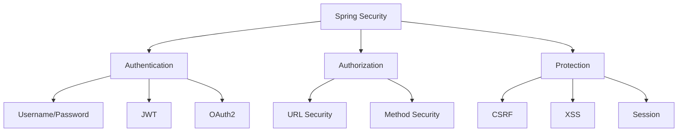

# Module 16: Spring Security

## Overview
Spring Security provides comprehensive security services for Java applications. It handles authentication, authorization, and protection against common security attacks.

## Learning Objectives
- Understand authentication flow
- Configure authorization
- Use JWT for stateless auth
- Apply OAuth2
- Implement security best practices

## Prerequisites
- Spring Boot basics
- REST API concepts
- HTTP protocol

## Why This Concept Exists
Applications need:
- User authentication
- Access control
- Attack protection
- Compliance

Spring Security provides:
- Authentication mechanisms
- Authorization rules
- CSRF protection
- Session management

## Problem Statement
How do you secure Java applications against unauthorized access?

## Theory

### Security Concepts

| Concept | Description |
|---------|-------------|
| Authentication | Verify identity |
| Authorization | Grant permissions |
| Principal | Authenticated user |
| GrantedAuthority | Permission |

### Authentication Methods

| Method | Use Case |
|--------|----------|
| Form Login | Web applications |
| HTTP Basic | APIs |
| JWT | Stateless APIs |
| OAuth2 | Third-party auth |

## Internal Working

### Security Filter Chain
```
Request → Filter → Authentication → Authorization → Controller
```

### JWT Flow
```
Client → Login → Server validates → Returns JWT
Client → Request + JWT → Server validates → Grants access
```

## JVM Perspective

### Security Filters
- SecurityContextPersistenceFilter
- UsernamePasswordAuthenticationFilter
- BasicAuthenticationFilter
- ExceptionTranslationFilter

### Password Encoding
- BCrypt (recommended)
- PBKDF2
- SCrypt

## Architecture Diagram



## Syntax

### Basic Configuration
```java
@Configuration
@EnableWebSecurity
public class SecurityConfig {
    
    @Bean
    public SecurityFilterChain filterChain(HttpSecurity http) throws Exception {
        http
            .csrf(csrf -> csrf.disable())
            .authorizeHttpRequests(auth -> auth
                .requestMatchers("/public/**").permitAll()
                .requestMatchers("/admin/**").hasRole("ADMIN")
                .anyRequest().authenticated()
            )
            .formLogin(form -> form
                .loginPage("/login")
                .defaultSuccessUrl("/dashboard")
            );
        
        return http.build();
    }
    
    @Bean
    public PasswordEncoder passwordEncoder() {
        return new BCryptPasswordEncoder();
    }
}
```

### JWT Configuration
```java
@Configuration
@EnableWebSecurity
public class JwtSecurityConfig {
    
    @Bean
    public SecurityFilterChain filterChain(HttpSecurity http) throws Exception {
        http
            .csrf(csrf -> csrf.disable())
            .sessionManagement(session -> 
                session.sessionCreationPolicy(SessionCreationPolicy.STATELESS))
            .authorizeHttpRequests(auth -> auth
                .requestMatchers("/api/auth/**").permitAll()
                .anyRequest().authenticated()
            )
            .addFilterBefore(jwtAuthFilter, 
                UsernamePasswordAuthenticationFilter.class);
        
        return http.build();
    }
}
```

## Easy Example
```java
import org.springframework.context.annotation.*;
import org.springframework.security.config.annotation.web.configuration.*;
import org.springframework.security.core.userdetails.*;
import org.springframework.security.crypto.bcrypt.BCryptPasswordEncoder;
import org.springframework.security.crypto.password.PasswordEncoder;

@Configuration
@EnableWebSecurity
public class SecurityEasyExample {
    
    @Bean
    public UserDetailsService userDetailsService() {
        UserDetails user = User.builder()
            .username("user")
            .password(passwordEncoder().encode("password"))
            .roles("USER")
            .build();
        
        return new InMemoryUserDetailsManager(user);
    }
    
    @Bean
    public PasswordEncoder passwordEncoder() {
        return new BCryptPasswordEncoder();
    }
}
```

## Medium Example
```java
import org.springframework.context.annotation.*;
import org.springframework.security.config.annotation.web.configuration.*;
import org.springframework.security.config.annotation.method.configuration.*;
import org.springframework.security.core.userdetails.*;

@Configuration
@EnableWebSecurity
@EnableMethodSecurity
public class SecurityMediumExample {
    
    @Bean
    public SecurityFilterChain filterChain(HttpSecurity http) throws Exception {
        http
            .authorizeHttpRequests(auth -> auth
                .requestMatchers("/api/public/**").permitAll()
                .requestMatchers("/api/user/**").hasRole("USER")
                .requestMatchers("/api/admin/**").hasRole("ADMIN")
                .anyRequest().authenticated()
            );
        
        return http.build();
    }
    
    @Bean
    public UserDetailsService userDetailsService() {
        return username -> {
            if ("admin".equals(username)) {
                return User.builder()
                    .username("admin")
                    .password("{bcrypt}" + passwordEncoder().encode("admin"))
                    .roles("ADMIN")
                    .build();
            }
            return User.builder()
                .username(username)
                .password("{bcrypt}" + passwordEncoder().encode("user"))
                .roles("USER")
                .build();
        };
    }
    
    @Bean
    public PasswordEncoder passwordEncoder() {
        return new BCryptPasswordEncoder();
    }
}
```

## Hard Example
```java
import org.springframework.context.annotation.*;
import org.springframework.security.config.annotation.web.configuration.*;
import org.springframework.security.oauth2.server.authorization.config.annotation.web.configuration.*;
import org.springframework.security.oauth2.server.authorization.config.annotation.web.configurers.*;

@Configuration
@EnableWebSecurity
@EnableAuthorizationServer
public class SecurityHardExample {
    
    @Bean
    public SecurityFilterChain filterChain(HttpSecurity http) throws Exception {
        http
            .oauth2ResourceServer(oauth2 -> oauth2
                .jwt(Customizer.withDefaults())
            );
        
        return http.build();
    }
}
```

## Enterprise Example
```java
import org.springframework.context.annotation.*;
import org.springframework.security.config.annotation.web.configuration.*;
import org.springframework.security.config.annotation.method.configuration.*;
import org.springframework.security.core.userdetails.*;
import org.springframework.security.crypto.password.PasswordEncoder;

@Configuration
@EnableWebSecurity
@EnableMethodSecurity(prePostEnabled = true)
public class SecurityEnterpriseExample {
    
    @Bean
    public SecurityFilterChain filterChain(HttpSecurity http) throws Exception {
        http
            .authorizeHttpRequests(auth -> auth
                .requestMatchers("/actuator/health").permitAll()
                .requestMatchers("/actuator/**").hasRole("ADMIN")
                .anyRequest().authenticated()
            )
            .oauth2ResourceServer(oauth2 -> oauth2
                .jwt(Customizer.withDefaults())
            );
        
        return http.build();
    }
    
    @Bean
    public UserDetailsService userDetailsService() {
        return username -> {
            // Load from database
            return User.builder()
                .username(username)
                .password("{noop}password")
                .roles("USER")
                .build();
        };
    }
    
    @Bean
    public PasswordEncoder passwordEncoder() {
        return new BCryptPasswordEncoder();
    }
}
```

## Performance Considerations
- Use stateless authentication (JWT)
- Cache user details
- Minimize security filters
- Use appropriate password encoding

## Best Practices
1. Use HTTPS
2. Encode passwords
3. Validate input
4. Use principle of least privilege
5. Log security events

## Common Mistakes
1. Storing passwords in plain text
2. Not using HTTPS
3. Overly permissive CORS
4. Not validating JWT

## Comparison Table

| Feature | Form Login | JWT | OAuth2 |
|---------|------------|-----|--------|
| State | Stateful | Stateless | Stateless |
| Use Case | Web apps | APIs | Third-party |
| Complexity | Low | Medium | High |
| Token Storage | Session | Client | Client |

## Interview Questions

### Q1: What is the difference between authentication and authorization?
**Answer:** Authentication verifies identity, authorization grants permissions.

### Q2: What is JWT?
**Answer:** JSON Web Token for stateless authentication.

### Q3: What is BCrypt?
**Answer:** Password hashing algorithm.

### Q4: What is CSRF?
**Answer:** Cross-Site Request Forgery attack prevention.

### Q5: What is the difference between session and JWT?
**Answer:** Session is server-side, JWT is client-side stateless.

## Summary
Spring Security provides comprehensive security for Java applications. Use appropriate authentication method for your use case.

## References
- Spring Security Documentation
- Spring Security Guide
- Baeldung Security
