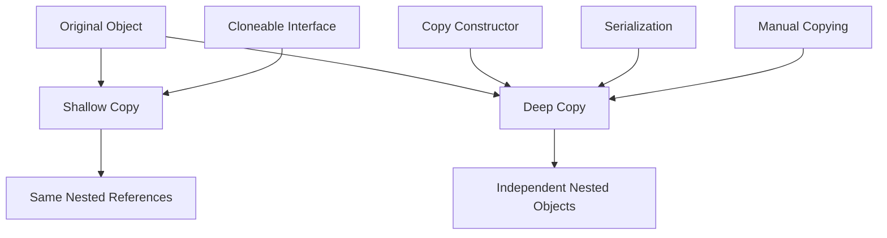
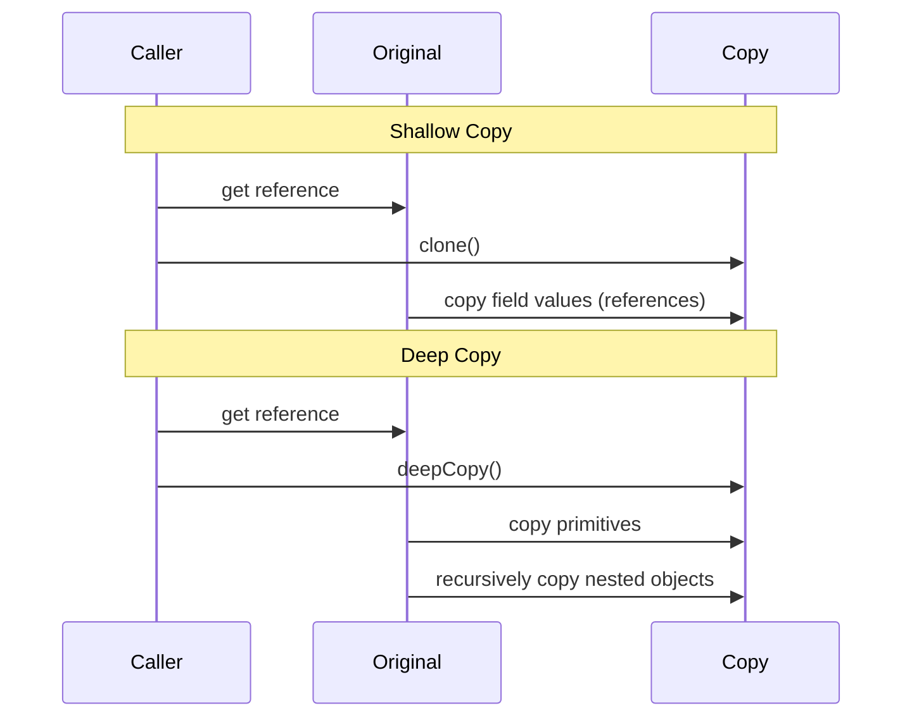

# Module 17: Object Copying in Java

## Introduction
Object copying creates new objects that are duplicates of existing ones. Java provides multiple mechanisms: shallow copy (copies references), deep copy (copies all nested objects), Cloneable interface, copy constructors, and serialization-based copying.

## Learning Objectives
- Understand the difference between shallow and deep copy
- Implement Cloneable interface correctly
- Use copy constructors for object duplication
- Perform deep copy using serialization
- Avoid common pitfalls in object copying

## Prerequisites
- Basic Java OOP concepts
- Understanding of references vs objects
- Familiarity with Serializable interface

## Why This Concept Exists
When you need to create an independent copy of an object (not just another reference to the same object), you must perform a copy. This is essential for immutable patterns, undo functionality, and avoiding unintended side effects.

## Problem Statement
How do we create independent copies of objects that may contain nested mutable objects, ensuring changes to the copy don't affect the original?

## Theory
### Shallow Copy
- Copies the object's fields directly
- Reference fields point to the SAME objects as the original
- Changes to nested objects affect both original and copy

### Deep Copy
- Recursively copies all objects referenced by the original
- Creates completely independent object graph
- Changes to nested objects don't affect the original

## Internal Working
1. **Shallow Copy**: `Object.clone()` creates a new instance and copies all field values
2. **Deep Copy**: Requires explicit recursive copying of all mutable fields
3. **Copy Constructor**: Takes an object of the same type and copies its state
4. **Serialization**: Converts to bytes and back, creating new object graph

## JVM Perspective
- `clone()` allocates new memory and copies bytes
- No constructor is called during cloning
- Deep copy creates multiple heap objects (original + copy + nested copies)
- Serialization-based deep copy is expensive but guarantees independence

## Memory Representation
```
Shallow Copy:
Original ──→ Object A ──→ Nested Object
Copy     ──→ Object A ──→ (same nested object)

Deep Copy:
Original ──→ Object A ──→ Nested Object
Copy     ──→ Object B ──→ Nested Copy
```

## Architecture Diagram (Mermaid)


## Flow Diagram (Mermaid)


## Syntax

### Cloneable Interface
```java
public class MyClass implements Cloneable {
    private String name;
    private List<String> items;
    
    @Override
    public MyClass clone() throws CloneNotSupportedException {
        return (MyClass) super.clone();
    }
}
```

### Copy Constructor
```java
public class MyClass {
    private String name;
    private List<String> items;
    
    public MyClass(MyClass other) {
        this.name = other.name;
        this.items = new ArrayList<>(other.items); // Deep copy of list
    }
}
```

### Serialization-Based Deep Copy
```java
public static <T extends Serializable> T deepCopy(T object) throws Exception {
    ByteArrayOutputStream baos = new ByteArrayOutputStream();
    ObjectOutputStream oos = new ObjectOutputStream(baos);
    oos.writeObject(object);
    oos.close();
    
    ByteArrayInputStream bais = new ByteArrayInputStream(baos.toByteArray());
    ObjectInputStream ois = new ObjectInputStream(bais);
    @SuppressWarnings("unchecked")
    T copy = (T) ois.readObject();
    return copy;
}
```

## Easy Example
```java
import java.util.ArrayList;
import java.util.List;

class Address implements Cloneable {
    private String city;
    
    public Address(String city) {
        this.city = city;
    }
    
    public String getCity() { return city; }
    public void setCity(String city) { this.city = city; }
    
    @Override
    public Address clone() {
        try {
            return (Address) super.clone();
        } catch (CloneNotSupportedException e) {
            throw new RuntimeException(e);
        }
    }
    
    @Override
    public String toString() {
        return "Address{city='" + city + "'}";
    }
}

class Person implements Cloneable {
    private String name;
    private Address address;
    
    public Person(String name, Address address) {
        this.name = name;
        this.address = address;
    }
    
    public String getName() { return name; }
    public Address getAddress() { return address; }
    
    @Override
    public Person clone() {
        try {
            Person copy = (Person) super.clone();
            copy.address = address.clone(); // Deep copy
            return copy;
        } catch (CloneNotSupportedException e) {
            throw new RuntimeException(e);
        }
    }
    
    @Override
    public String toString() {
        return "Person{name='" + name + "', address=" + address + "}";
    }
}

public class ObjectCopyingExample {
    public static void main(String[] args) {
        Address addr = new Address("New York");
        Person original = new Person("John", addr);
        
        // Shallow copy (reference copy)
        Person shallowCopy = original;
        
        // Deep copy
        Person deepCopy = original.clone();
        
        System.out.println("Original: " + original);
        System.out.println("Shallow: " + shallowCopy);
        System.out.println("Deep: " + deepCopy);
        
        // Modify original's address
        original.getAddress().setCity("Boston");
        
        System.out.println("\nAfter modifying original's city:");
        System.out.println("Original: " + original);
        System.out.println("Shallow: " + shallowCopy); // Affected!
        System.out.println("Deep: " + deepCopy); // Independent!
    }
}
```

## Medium Example
```java
import java.util.ArrayList;
import java.util.List;

class Department implements Cloneable {
    private String name;
    private List<String> employees;
    
    public Department(String name, List<String> employees) {
        this.name = name;
        this.employees = new ArrayList<>(employees);
    }
    
    public String getName() { return name; }
    public List<String> getEmployees() { return new ArrayList<>(employees); }
    
    public void addEmployee(String emp) {
        employees.add(emp);
    }
    
    @Override
    public Department clone() {
        try {
            Department copy = (Department) super.clone();
            copy.employees = new ArrayList<>(this.employees); // Deep copy
            return copy;
        } catch (CloneNotSupportedException e) {
            throw new RuntimeException(e);
        }
    }
    
    @Override
    public String toString() {
        return "Department{name='" + name + "', employees=" + employees + "}";
    }
}

class Company implements Cloneable {
    private String name;
    private List<Department> departments;
    
    public Company(String name, List<Department> departments) {
        this.name = name;
        this.departments = new ArrayList<>(departments);
    }
    
    public String getName() { return name; }
    public List<Department> getDepartments() { 
        return new ArrayList<>(departments); 
    }
    
    @Override
    public Company clone() {
        try {
            Company copy = (Company) super.clone();
            copy.departments = new ArrayList<>();
            for (Department dept : this.departments) {
                copy.departments.add(dept.clone()); // Deep copy each department
            }
            return copy;
        } catch (CloneNotSupportedException e) {
            throw new RuntimeException(e);
        }
    }
    
    @Override
    public String toString() {
        return "Company{name='" + name + "', departments=" + departments + "}";
    }
}

public class ObjectCopyingExample {
    public static void main(String[] args) {
        List<Department> depts = new ArrayList<>();
        depts.add(new Department("Engineering", List.of("Alice", "Bob")));
        depts.add(new Department("Marketing", List.of("Charlie", "Diana")));
        
        Company original = new Company("TechCorp", depts);
        Company copy = original.clone();
        
        System.out.println("Original: " + original);
        System.out.println("Copy: " + copy);
        
        // Modify original
        original.getDepartments().get(0).addEmployee("Eve");
        
        System.out.println("\nAfter adding employee to original:");
        System.out.println("Original: " + original);
        System.out.println("Copy: " + copy); // Independent
    }
}
```

## Hard Example
```java
import java.io.*;
import java.util.*;

class GraphNode implements Serializable {
    private static final long serialVersionUID = 1L;
    private String label;
    private List<GraphNode> neighbors;
    private Map<String, Object> metadata;
    
    public GraphNode(String label) {
        this.label = label;
        this.neighbors = new ArrayList<>();
        this.metadata = new HashMap<>();
    }
    
    public void addNeighbor(GraphNode node) {
        neighbors.add(node);
    }
    
    public void setMetadata(String key, Object value) {
        metadata.put(key, value);
    }
    
    public String getLabel() { return label; }
    public List<GraphNode> getNeighbors() { return neighbors; }
    public Map<String, Object> getMetadata() { return metadata; }
    
    @Override
    public String toString() {
        StringBuilder sb = new StringBuilder();
        sb.append("GraphNode{label='").append(label).append("', neighbors=[");
        for (int i = 0; i < neighbors.size(); i++) {
            if (i > 0) sb.append(", ");
            sb.append(neighbors.get(i).getLabel());
        }
        sb.append("], metadata=").append(metadata).append("}");
        return sb.toString();
    }
}

public class ObjectCopyingExample {
    
    // Deep copy using serialization
    @SuppressWarnings("unchecked")
    public static <T extends Serializable> T deepCopy(T object) throws Exception {
        ByteArrayOutputStream baos = new ByteArrayOutputStream();
        ObjectOutputStream oos = new ObjectOutputStream(baos);
        oos.writeObject(object);
        oos.close();
        
        ByteArrayInputStream bais = new ByteArrayInputStream(baos.toByteArray());
        ObjectInputStream ois = new ObjectInputStream(bais);
        return (T) ois.readObject();
    }
    
    public static void main(String[] args) {
        try {
            // Create a graph with circular reference
            GraphNode nodeA = new GraphNode("A");
            GraphNode nodeB = new GraphNode("B");
            GraphNode nodeC = new GraphNode("C");
            
            nodeA.addNeighbor(nodeB);
            nodeB.addNeighbor(nodeC);
            nodeC.addNeighbor(nodeA); // Circular reference!
            
            nodeA.setMetadata("visited", false);
            nodeB.setMetadata("visited", false);
            nodeC.setMetadata("visited", false);
            
            System.out.println("Original graph:");
            System.out.println("A: " + nodeA);
            System.out.println("B: " + nodeB);
            System.out.println("C: " + nodeC);
            
            // Deep copy using serialization
            GraphNode copyA = deepCopy(nodeA);
            
            System.out.println("\nCopied graph:");
            System.out.println("A: " + copyA);
            
            // Verify independence
            nodeA.setMetadata("visited", true);
            
            System.out.println("\nAfter marking A as visited:");
            System.out.println("Original A visited: " + nodeA.getMetadata().get("visited"));
            System.out.println("Copy A visited: " + copyA.getMetadata().get("visited"));
            
        } catch (Exception e) {
            e.printStackTrace();
        }
    }
}
```

## Enterprise Example
```java
import java.io.*;
import java.util.*;
import java.util.concurrent.*;

class Configuration implements Cloneable, Serializable {
    private static final long serialVersionUID = 1L;
    private String appName;
    private Map<String, String> settings;
    private transient ExecutorService executor;
    
    public Configuration(String appName) {
        this.appName = appName;
        this.settings = new ConcurrentHashMap<>();
        this.executor = Executors.newFixedThreadPool(4);
    }
    
    public void setSetting(String key, String value) {
        settings.put(key, value);
    }
    
    public String getSetting(String key) {
        return settings.get(key);
    }
    
    @Override
    public Configuration clone() {
        try {
            Configuration copy = (Configuration) super.clone();
            copy.settings = new ConcurrentHashMap<>(this.settings);
            copy.executor = Executors.newFixedThreadPool(4); // New executor
            return copy;
        } catch (CloneNotSupportedException e) {
            throw new RuntimeException(e);
        }
    }
    
    // Custom serialization - exclude executor
    private void writeObject(ObjectOutputStream oos) throws IOException {
        oos.defaultWriteObject();
    }
    
    private void readObject(ObjectInputStream ois) 
            throws IOException, ClassNotFoundException {
        ois.defaultReadObject();
        executor = Executors.newFixedThreadPool(4); // Recreate executor
    }
    
    public void shutdown() {
        if (executor != null) {
            executor.shutdown();
        }
    }
    
    @Override
    public String toString() {
        return "Configuration{app='" + appName + "', settings=" + settings + "}";
    }
}

public class ObjectCopyingExample {
    public static void main(String[] args) {
        // Create configuration
        Configuration original = new Configuration("MyApp");
        original.setSetting("db.host", "localhost");
        original.setSetting("db.port", "3306");
        original.setSetting("cache.enabled", "true");
        
        // Clone for testing
        Configuration testConfig = original.clone();
        testConfig.setSetting("db.host", "test-server");
        
        System.out.println("Original: " + original);
        System.out.println("Test: " + testConfig);
        
        // Serialization-based copy
        try {
            ByteArrayOutputStream baos = new ByteArrayOutputStream();
            ObjectOutputStream oos = new ObjectOutputStream(baos);
            oos.writeObject(original);
            
            ByteArrayInputStream bais = new ByteArrayInputStream(baos.toByteArray());
            ObjectInputStream ois = new ObjectInputStream(bais);
            Configuration serialCopy = (Configuration) ois.readObject();
            
            serialCopy.setSetting("db.port", "5432");
            
            System.out.println("Serial Copy: " + serialCopy);
            System.out.println("Original unchanged: " + original);
            
        } catch (Exception e) {
            e.printStackTrace();
        }
        
        // Cleanup
        original.shutdown();
    }
}
```

## Performance
| Copy Method | Time | Space | Deep Copy | Thread Safe |
|------------|------|-------|-----------|-------------|
| Reference | O(1) | O(1) | No | N/A |
| Shallow | O(n) | O(n) | No | No |
| Clone | O(n) | O(n) | Optional | No |
| Copy Constructor | O(n) | O(n) | Yes | No |
| Serialization | O(n²) | O(n²) | Yes | Yes |

## Time & Space Complexity
- **Reference**: O(1) time, O(1) space
- **Shallow Copy**: O(n) time, O(n) space (n = number of fields)
- **Deep Copy**: O(m) time, O(m) space (m = total objects in graph)
- **Serialization**: O(m) time, O(m) space + serialization overhead

## Thread Safety
- Shallow copy is not thread-safe for mutable objects
- Deep copy is safer but not automatically thread-safe
- Immutable objects don't need copying for thread safety
- Use `Collections.unmodifiableList()` for read-only views

## Best Practices
1. Prefer copy constructors over clone() for clarity
2. Document whether copy is shallow or deep
3. Make classes immutable when possible (no copying needed)
4. Use serialization-based copy for complex object graphs
5. Consider performance implications of deep copying
6. Implement defensive copying in setters
7. Test that copies are truly independent

## Common Mistakes
1. Assuming clone() creates deep copy automatically
2. Forgetting to copy mutable nested objects
3. Not handling CloneNotSupportedException properly
4. Creating circular references without proper deep copy
5. Using reference assignment instead of copying

## Pitfalls
- `clone()` doesn't call constructors (can break invariants)
- Deep copy can be expensive for large object graphs
- Circular references cause stack overflow with naive deep copy
- Transient fields are lost in serialization-based copy

## Debugging Tips
1. Print object references to verify independence
2. Modify original and check if copy is affected
3. Use debugger to inspect object references
4. Write tests that verify deep copy behavior
5. Profile memory usage for large object graphs

## Comparison Table
| Feature | Clone | Copy Constructor | Serialization |
|---------|-------|------------------|---------------|
| Syntax | `clone()` | `new Obj(other)` | Serialize/Deserialize |
| Deep Copy | Manual | Manual | Automatic |
| Performance | Fast | Fast | Slow |
| Flexibility | Limited | High | High |
| Thread Safety | No | No | Yes |

## Decision Tree
```
Need to copy object?
├── Is it immutable? → Just share reference
├── Is the object graph simple? → Copy constructor
├── Is the object graph complex? → Serialization-based copy
├── Need performance? → Clone with manual deep copy
└── Need thread safety? → Serialization-based copy
```

## Interview Questions (15+)
1. What is the difference between shallow and deep copy?
2. Why should you prefer copy constructors over clone()?
3. How do you handle circular references in deep copy?
4. What is the purpose of the Cloneable interface?
5. Why is clone() considered broken in Java?
6. How do you create a defensive copy?
7. What are the performance implications of deep copy?
8. When should you use serialization-based copying?
9. How do you make an immutable class?
10. What is the relationship between Serializable and copying?
11. How do you copy objects with transient fields?
12. What is the memory impact of deep copying?
13. How do you verify a copy is truly independent?
14. What are alternatives to clone()?
15. How do you handle copying in inheritance hierarchies?

## Exercises (3 Levels)

### Level 1 (Easy)
Create a `Point` class with x, y coordinates. Implement both shallow and deep copy. Verify that modifying the copy doesn't affect the original.

### Level 2 (Medium)
Create a `LinkedList` class with nodes. Implement deep copy that handles circular references. Test with a list that loops back to itself.

### Level 3 (Hard)
Design a deep copy utility that:
- Handles all Java types (primitives, arrays, collections, custom objects)
- Detects and handles circular references
- Preserves object identity (A→B becomes copyA→copyB)
- Has configurable depth limit
- Works with any Serializable object

## Summary
Object copying is essential for creating independent object states. Understanding the differences between shallow and deep copy, and knowing when to use each mechanism, is crucial for writing correct and efficient Java code.

## References
- [Effective Java - Item 13: Override clone judiciously](https://www.oreilly.com/library/view/effective-java/9780134686097/)
- [Java Cloneable Interface](https://docs.oracle.com/javase/8/docs/api/java/lang/Cloneable.html)
- [Deep Copy in Java](https://www.baeldung.com/java-deep-copy)
