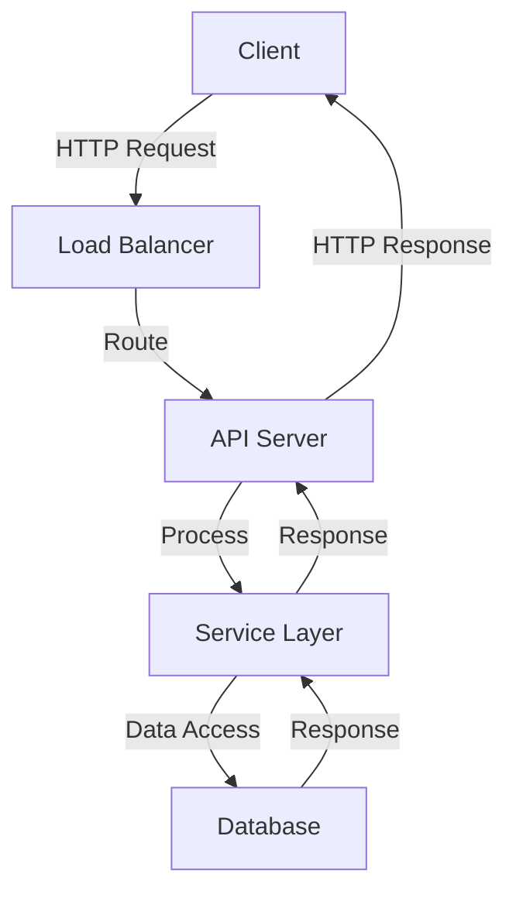
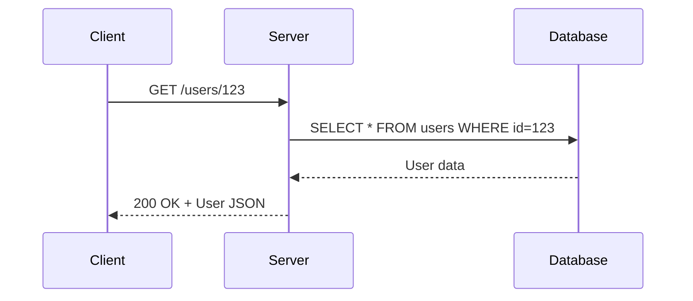

# 1. REST Fundamentals

## 1. Introduction
REST (Representational State Transfer) is an architectural style for designing networked applications. It uses standard HTTP methods and status codes to perform operations on resources. RESTful APIs are stateless, scalable, and follow a uniform interface.

## 2. Learning Objectives
- Understand REST architectural constraints
- Learn HTTP methods and their semantics
- Master HTTP status codes
- Understand resource naming conventions
- Learn stateless communication

## 3. Prerequisites
- Basic HTTP knowledge
- Understanding of client-server architecture
- Familiarity with JSON/XML formats
- Knowledge of web protocols

## 4. Why This Concept Exists
REST provides a standardized way to design APIs that are scalable, maintainable, and easy to understand. It leverages existing HTTP infrastructure and follows web standards.

## 5. Problem Statement
Without a standardized API design:
- Inconsistent interfaces across services
- Difficulty in integrating systems
- Poor scalability
- Tight coupling between client and server

## 6. Theory
REST has six architectural constraints:
1. **Client-Server**: Separation of concerns
2. **Stateless**: No client context stored on server
3. **Cacheable**: Responses must define cacheability
4. **Uniform Interface**: Standardized way to communicate
5. **Layered System**: Hierarchical architecture
6. **Code on Demand** (optional): Execute code on client

## 7. Internal Working
REST uses HTTP methods:
- **GET**: Retrieve resources
- **POST**: Create resources
- **PUT**: Update/replace resources
- **PATCH**: Partially update resources
- **DELETE**: Remove resources

## 8. JVM Perspective
REST operates at application layer, not JVM level. Java uses:
- Servlets for HTTP handling
- Jackson for JSON processing
- HTTP client libraries for communication

## 9. Memory Representation
```java
// Resource representation
public class User {
    private Long id;
    private String name;
    private String email;
}

// Response entity
ResponseEntity<User> response = ResponseEntity.ok(user);
```

## 10. Architecture Diagram


## 11. Flow Diagram


## 12. Syntax
```java
// HTTP Methods
GET /resources          - List all
GET /resources/{id}     - Get one
POST /resources         - Create
PUT /resources/{id}     - Update
DELETE /resources/{id}  - Delete
```

## 13. Easy Example
```java
@RestController
@RequestMapping("/api/users")
public class UserController {
    
    @GetMapping
    public List<User> getAllUsers() {
        return userService.findAll();
    }
    
    @GetMapping("/{id}")
    public User getUser(@PathVariable Long id) {
        return userService.findById(id);
    }
}
```

## 14. Medium Example
```java
@RestController
@RequestMapping("/api/users")
public class UserController {
    
    @GetMapping
    public ResponseEntity<List<User>> getAllUsers(
            @RequestParam(defaultValue = "0") int page,
            @RequestParam(defaultValue = "10") int size) {
        List<User> users = userService.findAll(PageRequest.of(page, size));
        return ResponseEntity.ok(users);
    }
    
    @PostMapping
    public ResponseEntity<User> createUser(@RequestBody @Valid User user) {
        User created = userService.create(user);
        return ResponseEntity.status(HttpStatus.CREATED).body(created);
    }
    
    @PutMapping("/{id}")
    public ResponseEntity<User> updateUser(
            @PathVariable Long id,
            @RequestBody @Valid User user) {
        User updated = userService.update(id, user);
        return ResponseEntity.ok(updated);
    }
    
    @DeleteMapping("/{id}")
    public ResponseEntity<Void> deleteUser(@PathVariable Long id) {
        userService.delete(id);
        return ResponseEntity.noContent().build();
    }
}
```

## 15. Hard Example
```java
@RestController
@RequestMapping("/api/v1/users")
public class AdvancedUserController {
    
    @GetMapping(produces = MediaType.APPLICATION_JSON_VALUE)
    public ResponseEntity<Page<UserDTO>> getUsers(
            @RequestParam(required = false) String search,
            @RequestParam(defaultValue = "id") String sortBy,
            @RequestParam(defaultValue = "asc") String sortDir,
            @RequestParam(defaultValue = "0") int page,
            @RequestParam(defaultValue = "20") int size,
            @RequestHeader(value = "If-None-Match", required = false) String etag) {
        
        Page<UserDTO> users = userService.search(search, sortBy, sortDir, 
            PageRequest.of(page, size));
        
        return ResponseEntity.ok()
            .eTag(String.valueOf(users.hashCode()))
            .body(users);
    }
    
    @PostMapping(consumes = MediaType.APPLICATION_JSON_VALUE,
                 produces = MediaType.APPLICATION_JSON_VALUE)
    public ResponseEntity<UserDTO> createUser(
            @RequestBody @Valid CreateUserRequest request,
            UriComponentsBuilder uriBuilder) {
        
        UserDTO created = userService.create(request);
        
        URI location = uriBuilder.path("/api/v1/users/{id}")
            .buildAndExpand(created.getId())
            .toUri();
        
        return ResponseEntity.created(location).body(created);
    }
}
```

## 16. Enterprise Example
```java
@RestController
@RequestMapping("/api/v1/orders")
@Tag(name = "Orders", description = "Order management APIs")
public class OrderController {
    
    @Autowired
    private OrderService orderService;
    
    @GetMapping
    public ResponseEntity<ApiResponse<List<OrderDTO>>> getOrders(
            @RequestParam(required = false) String status,
            @RequestParam(required = false) Long customerId,
            @RequestParam(defaultValue = "0") int page,
            @RequestParam(defaultValue = "20") int size) {
        
        List<OrderDTO> orders = orderService.findAll(status, customerId, 
            PageRequest.of(page, size));
        
        return ResponseEntity.ok(ApiResponse.success(orders));
    }
    
    @GetMapping("/{id}")
    public ResponseEntity<ApiResponse<OrderDTO>> getOrder(@PathVariable Long id) {
        OrderDTO order = orderService.findById(id);
        return ResponseEntity.ok(ApiResponse.success(order));
    }
    
    @PostMapping
    public ResponseEntity<ApiResponse<OrderDTO>> createOrder(
            @RequestBody @Valid CreateOrderRequest request) {
        OrderDTO created = orderService.create(request);
        return ResponseEntity.status(HttpStatus.CREATED)
            .body(ApiResponse.success(created));
    }
    
    @PatchMapping("/{id}/status")
    public ResponseEntity<ApiResponse<OrderDTO>> updateOrderStatus(
            @PathVariable Long id,
            @RequestBody @Valid UpdateStatusRequest request) {
        OrderDTO updated = orderService.updateStatus(id, request.getStatus());
        return ResponseEntity.ok(ApiResponse.success(updated));
    }
}
```

## 17. Performance
- REST over HTTP/1.1: ~100-200ms latency
- REST over HTTP/2: ~50-100ms latency
- Connection pooling improves throughput
- Compression reduces bandwidth usage

## 18. Time & Space Complexity
- **GET**: O(n) for list, O(1) for single resource
- **POST**: O(1)
- **PUT**: O(1)
- **DELETE**: O(1)
- **Space**: O(n) for response payload

## 19. Thread Safety
- REST controllers are stateless
- Service beans are thread-safe (no mutable state)
- Use request-scoped beans for state
- Database connections must be thread-safe

## 20. Best Practices
1. Use nouns for resource names
2. Use HTTP methods correctly
3. Return appropriate status codes
4. Implement pagination for lists
5. Use versioning
6. Validate input
7. Handle errors consistently
8. Document APIs

## 21. Common Mistakes
1. Using verbs in URLs
2. Wrong HTTP methods
3. Inconsistent error handling
4. No pagination for large datasets
5. Exposing internal implementation
6. Not using status codes correctly

## 22. Pitfalls
- Over-fetching data without pagination
- N+1 query problems
- Inconsistent naming conventions
- Breaking changes without versioning
- Missing error handling

## 23. Debugging Tips
1. Use curl/Postman for testing
2. Check HTTP status codes
3. Validate request/response JSON
4. Monitor server logs
5. Use network profiling

## 24. Comparison Table
| Aspect | REST | GraphQL | gRPC |
|--------|------|---------|------|
| Protocol | HTTP | HTTP | HTTP/2 |
| Format | JSON | JSON | Protobuf |
| Flexibility | Medium | High | Low |
| Performance | Medium | Medium | High |
| Learning Curve | Low | Medium | High |

## 25. Decision Tree
```
Need API?
├── Yes → Type?
│   ├── CRUD → REST
│── Complex Queries → GraphQL
│   └── High Performance → gRPC
└── No → Internal only
```

## 26. Interview Questions
1. What is REST and its constraints?
2. What are HTTP methods and when to use each?
3. What are HTTP status codes?
4. How do you design RESTful URLs?
5. What is idempotency?
6. How do you handle pagination?
7. What is content negotiation?
8. How do you version REST APIs?
9. What are Richardson Maturity Model levels?
10. How do you handle errors in REST?
11. What is HATEOAS?
12. How do you secure REST APIs?
13. What is CORS?
14. How do you handle file uploads in REST?
15. What are REST best practices?

## 27. Exercises
### Beginner
1. Create a simple CRUD API for users
2. Implement proper HTTP status codes
3. Add pagination to list endpoints

### Intermediate
1. Implement search with filters
2. Add sorting functionality
3. Create error response wrapper

### Advanced
1. Implement HATEOAS links
2. Add rate limiting
3. Implement caching headers

## 28. Summary
REST is the dominant architectural style for web APIs, providing a standardized, scalable approach to building services. Understanding HTTP methods, status codes, and resource design is essential for building effective APIs.

## 29. References
- [REST Architecture](https://restfulapi.net/)
- [HTTP/1.1 RFC](https://tools.ietf.org/html/rfc7231)
- [Spring REST Guide](https://spring.io/guides/gs/rest-service/)
