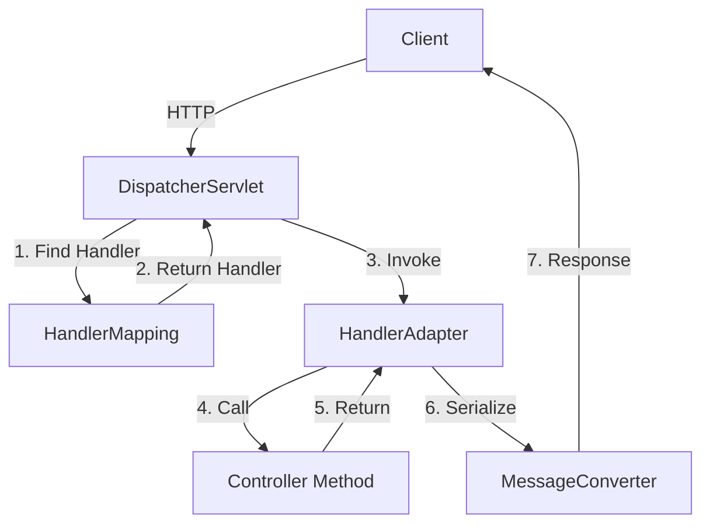
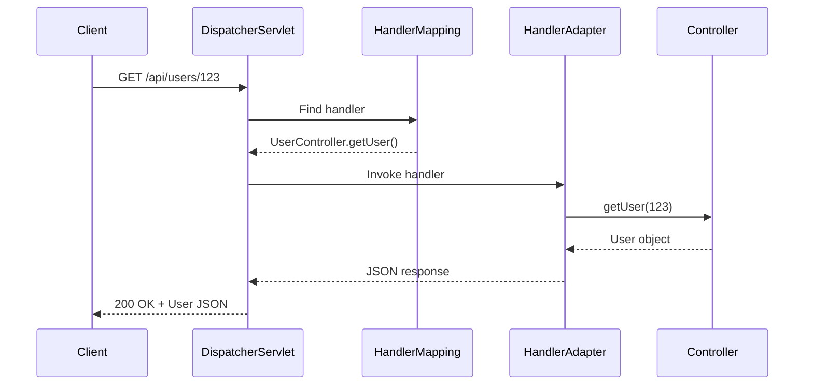

# 2. REST Controller

## 1. Introduction
Spring MVC's `@RestController` combines `@Controller` and `@ResponseBody`, simplifying REST API development. It handles HTTP requests and returns data directly as JSON/XML responses.

## 2. Learning Objectives
- Understand `@RestController` annotation
- Learn `@RequestMapping` and method-level mappings
- Master path variables and request parameters
- Understand request and response handling

## 3. Prerequisites
- Understanding of Spring MVC basics
- Knowledge of HTTP methods
- Familiarity with dependency injection

## 4. Why This Concept Exists
`@RestController` reduces boilerplate code and provides a clean, annotation-driven approach to building REST endpoints in Spring.

## 5. Problem Statement
Traditional MVC controllers require `@ResponseBody` on every method, making REST API development verbose and error-prone.

## 6. Theory
`@RestController` is a stereotype annotation that combines:
- `@Controller`: Marks class as Spring MVC controller
- `@ResponseBody`: Serializes return values to HTTP response

Request mapping annotations:
- `@RequestMapping`: Maps HTTP requests to handler methods
- `@GetMapping`: Maps HTTP GET
- `@PostMapping`: Maps HTTP POST
- `@PutMapping`: Maps HTTP PUT
- `@DeleteMapping`: Maps HTTP DELETE
- `@PatchMapping`: Maps HTTP PATCH

## 7. Internal Working
1. DispatcherServlet receives HTTP request
2. HandlerMapping finds matching controller method
3. HandlerAdapter invokes controller method
4. Return value is serialized to JSON/XML
5. Response sent to client

## 8. JVM Perspective
- CGLIB/AspectJ creates controller proxies
- Jackson ObjectMapper handles serialization
- Spring MVC request mapping is cached
- Thread-per-request model

## 9. Memory Representation
```java
@RestController
@RequestMapping("/api/users")
public class UserController {
    // Spring creates singleton instance
    // Handler mappings are stored in HashMap
    // Request processing is thread-safe
}
```

## 10. Architecture Diagram


## 11. Flow Diagram


## 12. Syntax
```java
@RestController
@RequestMapping("/api/users")
public class UserController {
    
    @GetMapping
    public List<User> getAll() { }
    
    @GetMapping("/{id}")
    public User getById(@PathVariable Long id) { }
    
    @PostMapping
    public User create(@RequestBody User user) { }
    
    @PutMapping("/{id}")
    public User update(@PathVariable Long id, @RequestBody User user) { }
    
    @DeleteMapping("/{id}")
    public void delete(@PathVariable Long id) { }
}
```

## 13. Easy Example
```java
@RestController
@RequestMapping("/api/products")
public class ProductController {
    
    @GetMapping
    public List<Product> getAllProducts() {
        return List.of(
            new Product(1L, "Laptop", 999.99),
            new Product(2L, "Phone", 699.99)
        );
    }
    
    @GetMapping("/{id}")
    public Product getProduct(@PathVariable Long id) {
        return new Product(id, "Product " + id, 19.99);
    }
}
```

## 14. Medium Example
```java
@RestController
@RequestMapping("/api/users")
public class UserController {
    
    @GetMapping
    public ResponseEntity<List<UserDTO>> getUsers(
            @RequestParam(defaultValue = "0") int page,
            @RequestParam(defaultValue = "10") int size) {
        List<UserDTO> users = userService.findAll(PageRequest.of(page, size));
        return ResponseEntity.ok(users);
    }
    
    @GetMapping("/{id}")
    public ResponseEntity<UserDTO> getUser(@PathVariable Long id) {
        return userService.findById(id)
            .map(ResponseEntity::ok)
            .orElse(ResponseEntity.notFound().build());
    }
    
    @PostMapping
    public ResponseEntity<UserDTO> createUser(@RequestBody @Valid CreateUserRequest request) {
        UserDTO created = userService.create(request);
        return ResponseEntity.status(HttpStatus.CREATED).body(created);
    }
}
```

## 15. Hard Example
```java
@RestController
@RequestMapping("/api/v1/users")
@Validated
public class AdvancedUserController {
    
    @GetMapping(produces = MediaType.APPLICATION_JSON_VALUE)
    public ResponseEntity<Page<UserDTO>> getUsers(
            @Valid @ModelAttribute UserSearchRequest request) {
        
        Page<UserDTO> users = userService.search(request);
        
        return ResponseEntity.ok()
            .header("X-Total-Count", String.valueOf(users.getTotalElements()))
            .header("X-Page", String.valueOf(request.getPage()))
            .body(users);
    }
    
    @GetMapping("/{id}")
    public ResponseEntity<UserDTO> getUser(
            @PathVariable @Positive Long id,
            @RequestHeader(value = "If-None-Match", required = false) String etag) {
        
        UserDTO user = userService.findById(id);
        
        if (etag != null && etag.equals(user.getEtag())) {
            return ResponseEntity.status(HttpStatus.NOT_MODIFIED).build();
        }
        
        return ResponseEntity.ok()
            .eTag(user.getEtag())
            .body(user);
    }
    
    @PostMapping(consumes = MediaType.APPLICATION_JSON_VALUE)
    public ResponseEntity<Void> createUser(
            @RequestBody @Valid @UniqueEmail CreateUserRequest request,
            UriComponentsBuilder uriBuilder) {
        
        Long id = userService.create(request);
        
        URI location = uriBuilder.path("/api/v1/users/{id}")
            .buildAndExpand(id)
            .toUri();
        
        return ResponseEntity.created(location).build();
    }
}
```

## 16. Enterprise Example
```java
@RestController
@RequestMapping("/api/v1/orders")
@Tag(name = "Orders", description = "Order management")
@Slf4j
public class OrderController {
    
    @Autowired
    private OrderService orderService;
    
    @GetMapping
    @Operation(summary = "Get all orders")
    public ResponseEntity<ApiResponse<Page<OrderDTO>>> getOrders(
            @Valid @ModelAttribute OrderSearchRequest request) {
        
        log.info("Fetching orders with criteria: {}", request);
        
        Page<OrderDTO> orders = orderService.search(request);
        
        return ResponseEntity.ok(ApiResponse.success(orders));
    }
    
    @GetMapping("/{id}")
    @Operation(summary = "Get order by ID")
    public ResponseEntity<ApiResponse<OrderDTO>> getOrder(
            @PathVariable Long id) {
        
        OrderDTO order = orderService.findById(id);
        return ResponseEntity.ok(ApiResponse.success(order));
    }
    
    @PostMapping
    @Operation(summary = "Create new order")
    public ResponseEntity<ApiResponse<OrderDTO>> createOrder(
            @RequestBody @Valid CreateOrderRequest request) {
        
        OrderDTO created = orderService.create(request);
        
        return ResponseEntity.status(HttpStatus.CREATED)
            .body(ApiResponse.success(created));
    }
    
    @PatchMapping("/{id}/status")
    @Operation(summary = "Update order status")
    public ResponseEntity<ApiResponse<OrderDTO>> updateStatus(
            @PathVariable Long id,
            @RequestBody @Valid UpdateStatusRequest request) {
        
        OrderDTO updated = orderService.updateStatus(id, request.getStatus());
        return ResponseEntity.ok(ApiResponse.success(updated));
    }
    
    @DeleteMapping("/{id}")
    @PreAuthorize("hasRole('ADMIN')")
    public ResponseEntity<Void> deleteOrder(@PathVariable Long id) {
        orderService.delete(id);
        return ResponseEntity.noContent().build();
    }
}
```

## 17. Performance
- Controller instantiation: O(1) singleton
- Request mapping lookup: O(1) HashMap
- JSON serialization: O(n) where n is object size
- Thread-per-request model

## 18. Time & Space Complexity
- **Request Mapping**: O(1)
- **Method Invocation**: O(1)
- **Serialization**: O(n)
- **Space**: O(1) per request

## 19. Thread Safety
- Controllers are singletons (stateless)
- Request-scoped beans are thread-safe
- Avoid mutable instance variables
- Use ThreadLocal for request context

## 20. Best Practices
1. Use method-level mappings
2. Keep controllers thin
3. Validate input
4. Return ResponseEntity for status control
5. Use DTOs, not entities
6. Handle exceptions properly
7. Document with OpenAPI

## 21. Common Mistakes
1. Putting business logic in controllers
2. Returning entities directly
3. Not validating input
4. Inconsistent naming
5. Missing error handling

## 22. Pitfalls
- Singleton controllers with mutable state
- Thread-safety issues with instance variables
- Over-fetching data
- Missing null checks

## 23. Debugging Tips
1. Check request mapping in logs
2. Verify content type headers
3. Test with curl/Postman
4. Enable debug logging
5. Check serialization issues

## 24. Comparison Table
| Feature | @RestController | @Controller | @ControllerAdvice |
|---------|-----------------|-------------|-------------------|
| Purpose | REST APIs | Web pages | Exception handling |
| Response | JSON/XML | HTML | N/A |
| Stereotype | Yes | Yes | Yes |

## 25. Decision Tree
```
Need Controller?
├── Yes → Type?
│   ├── REST API → @RestController
│   ├── Web Page → @Controller
│   └── Exception Handling → @ControllerAdvice
└── No → Service only
```

## 26. Interview Questions
1. What is @RestController?
2. What is the difference between @Controller and @RestController?
3. How does request mapping work?
4. What are path variables and request parameters?
5. How do you handle different content types?
6. What is ResponseEntity?
7. How do you validate request bodies?
8. How do you handle exceptions in controllers?
9. What is the role of HandlerMapping?
10. How do you test REST controllers?
11. What are best practices for controller design?
12. How do you implement versioning?
13. What is the difference between @RequestParam and @PathVariable?
14. How do you handle file uploads?
15. How do you implement pagination?

## 27. Exercises
### Beginner
1. Create a basic CRUD controller
2. Implement path variables
3. Add request parameters

### Intermediate
1. Implement content negotiation
2. Add request validation
3. Create custom annotations

### Advanced
1. Implement API versioning
2. Add response caching
3. Create controller auto-configuration

## 28. Summary
`@RestController` is the foundation of Spring REST APIs, providing annotation-driven request handling. Understanding request mapping, path variables, and response handling is essential for building effective RESTful services.

## 29. References
- [Spring MVC Documentation](https://docs.spring.io/spring-framework/reference/web/webmvc.html)
- [Spring REST Guide](https://spring.io/guides/gs/rest-service/)
