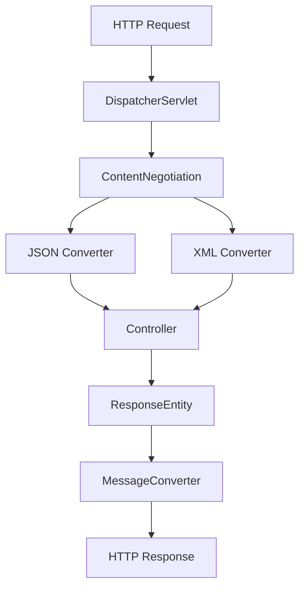
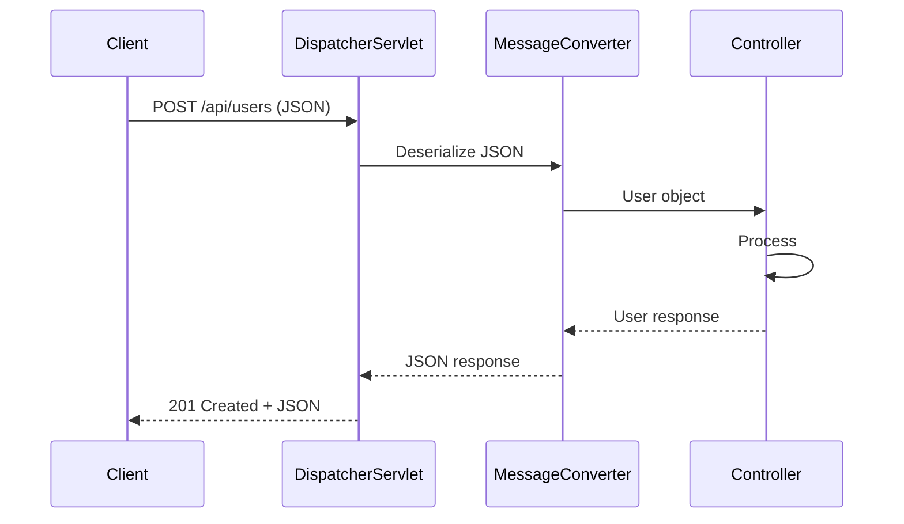

# 3. Request & Response

## 1. Introduction
Spring MVC provides comprehensive support for handling HTTP requests and responses. This includes request bodies, response entities, content negotiation, and various media type handling.

## 2. Learning Objectives
- Handle request bodies with `@RequestBody`
- Use `ResponseEntity` for response control
- Implement content negotiation
- Understand media type handling
- Learn request validation

## 3. Prerequisites
- Understanding of HTTP protocol
- Knowledge of JSON/XML formats
- Familiarity with Spring MVC

## 4. Why This Concept Exists
Proper request/response handling ensures clean API contracts, validation, and flexible response formatting.

## 5. Problem Statement
Applications need to:
- Parse incoming request data
- Validate user input
- Format responses appropriately
- Handle different content types
- Provide meaningful status codes

## 6. Theory
Spring MVC uses:
- `HttpMessageConverter` for serialization/deserialization
- `@RequestBody` for request body binding
- `@ResponseBody` for response body serialization
- `ResponseEntity` for full response control
- `ContentNegotiationManager` for format selection

## 7. Internal Working
1. Request received by DispatcherServlet
2. Content negotiation determines format
3. HttpMessageConverter deserializes request
4. Controller processes request
5. HttpMessageConverter serializes response
6. Response sent to client

## 8. JVM Perspective
- Jackson/Gson for JSON processing
- JAXB for XML processing
- ThreadLocal for request context
- Object pools for converters

## 9. Memory Representation
```java
// Request body binding
@PostMapping
public User create(@RequestBody User user) {
    // Jackson deserializes JSON to User object
}

// Response entity
ResponseEntity<User> response = ResponseEntity
    .status(HttpStatus.CREATED)
    .header("X-Custom", "value")
    .body(user);
```

## 10. Architecture Diagram


## 11. Flow Diagram


## 12. Syntax
```java
// Request body
@PostMapping
public User create(@RequestBody @Valid User user) { }

// Response entity
@GetMapping("/{id}")
public ResponseEntity<User> get(@PathVariable Long id) {
    return ResponseEntity.ok(user);
}

// Content type
@GetMapping(produces = MediaType.APPLICATION_JSON_VALUE)
public List<User> getAll() { }
```

## 13. Easy Example
```java
@RestController
@RequestMapping("/api/users")
public class UserController {
    
    @PostMapping
    public ResponseEntity<User> create(@RequestBody User user) {
        User created = userService.create(user);
        return ResponseEntity.status(HttpStatus.CREATED).body(created);
    }
    
    @GetMapping("/{id}")
    public ResponseEntity<User> get(@PathVariable Long id) {
        return userService.findById(id)
            .map(ResponseEntity::ok)
            .orElse(ResponseEntity.notFound().build());
    }
}
```

## 14. Medium Example
```java
@RestController
@RequestMapping("/api/users")
public class UserController {
    
    @PostMapping(consumes = MediaType.APPLICATION_JSON_VALUE,
                 produces = MediaType.APPLICATION_JSON_VALUE)
    public ResponseEntity<UserDTO> create(
            @RequestBody @Valid CreateUserRequest request,
            UriComponentsBuilder uriBuilder) {
        
        UserDTO created = userService.create(request);
        
        URI location = uriBuilder.path("/api/users/{id}")
            .buildAndExpand(created.getId())
            .toUri();
        
        return ResponseEntity.created(location).body(created);
    }
    
    @GetMapping(produces = {MediaType.APPLICATION_JSON_VALUE, 
                           MediaType.APPLICATION_XML_VALUE})
    public ResponseEntity<List<UserDTO>> getAll(
            @RequestParam(required = false) String email) {
        List<UserDTO> users = userService.findAll(email);
        return ResponseEntity.ok(users);
    }
}
```

## 15. Hard Example
```java
@RestController
@RequestMapping("/api/v1/users")
public class AdvancedUserController {
    
    @PostMapping(consumes = MediaType.MULTIPART_FORM_DATA_VALUE)
    public ResponseEntity<UserDTO> createUserWithAvatar(
            @RequestPart("user") @Valid CreateUserRequest request,
            @RequestPart("avatar") MultipartFile avatar) {
        
        String avatarUrl = storageService.upload(avatar);
        request.setAvatarUrl(avatarUrl);
        
        UserDTO created = userService.create(request);
        return ResponseEntity.status(HttpStatus.CREATED).body(created);
    }
    
    @GetMapping(produces = MediaType.APPLICATION_JSON_VALUE)
    public ResponseEntity<Page<UserDTO>> search(
            @Valid UserSearchRequest request,
            @RequestHeader(value = "Accept-Language", defaultValue = "en") 
            String language) {
        
        Page<UserDTO> users = userService.search(request, language);
        
        return ResponseEntity.ok()
            .cacheControl(CacheControl.maxAge(Duration.ofMinutes(5)))
            .eTag(String.valueOf(users.hashCode()))
            .body(users);
    }
}
```

## 16. Enterprise Example
```java
@RestController
@RequestMapping("/api/v1/orders")
public class OrderController {
    
    @PostMapping
    public ResponseEntity<ApiResponse<OrderDTO>> createOrder(
            @RequestBody @Valid CreateOrderRequest request,
            @AuthenticationPrincipal UserDetails user,
            @RequestHeader(value = "X-Idempotency-Key", required = false) 
            String idempotencyKey) {
        
        if (idempotencyKey != null && 
            idempotencyService.isDuplicate(idempotencyKey)) {
            return ResponseEntity.status(HttpStatus.CONFLICT)
                .body(ApiResponse.error("Duplicate request"));
        }
        
        OrderDTO created = orderService.create(request, user.getUsername());
        
        if (idempotencyKey != null) {
            idempotencyService.store(idempotencyKey, created.getId());
        }
        
        return ResponseEntity.status(HttpStatus.CREATED)
            .body(ApiResponse.success(created));
    }
    
    @GetMapping("/{id}")
    public ResponseEntity<ApiResponse<OrderDTO>> getOrder(
            @PathVariable Long id,
            @RequestHeader(value = "If-None-Match", required = false) 
            String etag) {
        
        OrderDTO order = orderService.findById(id);
        
        if (etag != null && etag.equals(order.getEtag())) {
            return ResponseEntity.status(HttpStatus.NOT_MODIFIED).build();
        }
        
        return ResponseEntity.ok()
            .eTag(order.getEtag())
            .body(ApiResponse.success(order));
    }
}
```

## 17. Performance
- JSON serialization: ~1-5ms
- XML serialization: ~5-10ms
- Content negotiation: ~1ms
- Request validation: ~1-2ms

## 18. Time & Space Complexity
- **Deserialization**: O(n) where n is JSON size
- **Serialization**: O(m) where m is object size
- **Validation**: O(1) per rule
- **Space**: O(n) for request/response

## 19. Thread Safety
- MessageConverters are thread-safe
- Request bodies are request-scoped
- Response entities are immutable
- Validators are stateless

## 20. Best Practices
1. Always validate request bodies
2. Use DTOs for request/response
3. Return appropriate status codes
4. Implement content negotiation
5. Use ResponseEntity for control
6. Handle null responses properly
7. Log request/response for debugging

## 21. Common Mistakes
1. Not validating input
2. Returning entities directly
3. Missing content type headers
4. Not handling null values
5. Over-exposing data

## 22. Pitfalls
- Circular references in JSON
- Large request bodies causing memory issues
- Content type mismatches
- Validation cascading issues

## 23. Debugging Tips
1. Enable debug logging for message converters
2. Check Content-Type headers
3. Validate JSON structure
4. Test with different accept headers
5. Monitor serialization performance

## 24. Comparison Table
| Feature | @RequestBody | @ModelAttribute | @RequestParam |
|---------|--------------|-----------------|---------------|
| Source | Request body | Form data | Query params |
| Format | JSON/XML | Form fields | URL params |
| Validation | @Valid | @Valid | N/A |

## 25. Decision Tree
```
Need Request Data?
├── Yes → Source?
│   ├── JSON/XML → @RequestBody
│   ├── Form Data → @ModelAttribute
│   └── URL Params → @RequestParam
└── No → No data needed
```

## 26. Interview Questions
1. What is @RequestBody?
2. How does content negotiation work?
3. What is ResponseEntity?
4. How do you validate request bodies?
5. What are HttpMessageConverters?
6. How do you handle different content types?
7. What is the difference between produces and consumes?
8. How do you return errors properly?
9. How do you handle file uploads?
10. What is idempotency?
11. How do you implement caching headers?
12. What is ETag?
13. How do you handle partial updates?
14. What is PATCH vs PUT?
15. How do you implement API versioning?

## 27. Exercises
### Beginner
1. Create endpoint with request body validation
2. Return ResponseEntity with different status codes
3. Implement content negotiation

### Intermediate
1. Add request validation with custom constraints
2. Implement file upload endpoint
3. Create error response wrapper

### Advanced
1. Implement idempotency
2. Add response caching
3. Create custom message converter

## 28. Summary
Request and response handling is fundamental to REST API development. Understanding request bodies, response entities, and content negotiation ensures clean API contracts and proper data exchange.

## 29. References
- [Spring MVC Request Mapping](https://docs.spring.io/spring-framework/reference/web/webmvc/mvc-controller.html)
- [Jackson Documentation](https://github.com/FasterXML/jackson)
