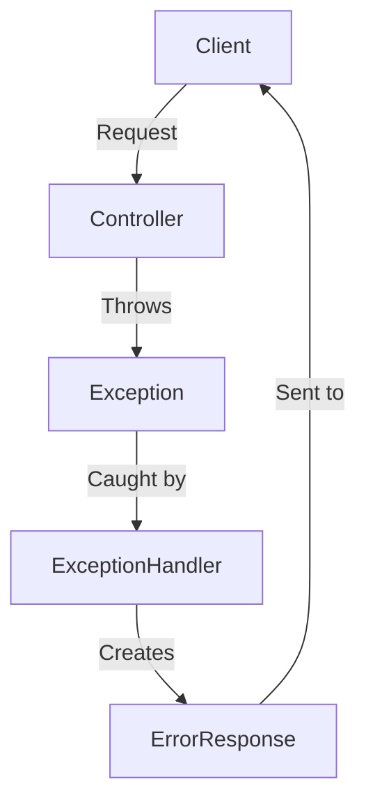
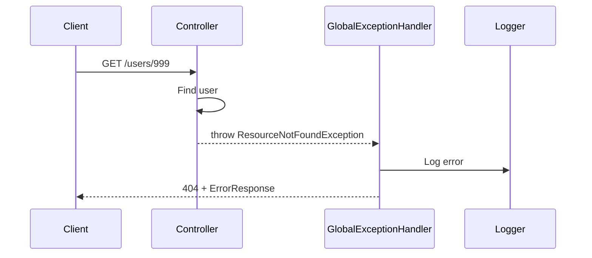

# 4. Exception Handling

## 1. Introduction
Spring provides `@ControllerAdvice` and `@ExceptionHandler` for centralized exception handling in REST APIs. This ensures consistent error responses across all endpoints.

## 2. Learning Objectives
- Implement global exception handling
- Create custom exceptions
- Design error response formats
- Handle validation exceptions
- Log and monitor errors

## 3. Prerequisites
- Understanding of Spring MVC
- Knowledge of Java exceptions
- Familiarity with REST API design

## 4. Why This Concept Exists
Centralized exception handling provides:
- Consistent error responses
- Reduced code duplication
- Better separation of concerns
- Easier maintenance

## 5. Problem Statement
Without centralized handling:
- Each controller handles errors differently
- Inconsistent error formats
- Duplicate error handling code
- Poor debugging experience

## 6. Theory
Spring exception handling components:
- `@ControllerAdvice`: Global exception handling
- `@RestControllerAdvice`: Combined with @ResponseBody
- `@ExceptionHandler`: Method-level exception handling
- `ResponseEntityExceptionHandler`: Base class for handler

## 7. Internal Working
1. Controller throws exception
2. DispatcherServlet looks for handler
3. @ControllerAdvice provides matching handler
4. Exception handler creates response
5. Response sent to client

## 8. JVM Perspective
- Exception handling uses stack unwinding
- @ControllerAdvice uses AOP proxy
- Exception handlers are cached
- Logging happens asynchronously

## 9. Memory Representation
```java
// Exception handler
@RestControllerAdvice
public class GlobalExceptionHandler {
    @ExceptionHandler(ResourceNotFoundException.class)
    public ResponseEntity<ErrorResponse> handleNotFound(
            ResourceNotFoundException ex) {
        return ResponseEntity.status(404).body(errorResponse);
    }
}
```

## 10. Architecture Diagram


## 11. Flow Diagram


## 12. Syntax
```java
@RestControllerAdvice
public class GlobalExceptionHandler {
    
    @ExceptionHandler(ResourceNotFoundException.class)
    public ResponseEntity<ErrorResponse> handleNotFound(
            ResourceNotFoundException ex) {
        return ResponseEntity.status(HttpStatus.NOT_FOUND)
            .body(new ErrorResponse("NOT_FOUND", ex.getMessage()));
    }
    
    @ExceptionHandler(MethodArgumentNotValidException.class)
    public ResponseEntity<ErrorResponse> handleValidation(
            MethodArgumentNotValidException ex) {
        List<String> errors = ex.getBindingResult()
            .getFieldErrors()
            .stream()
            .map(e -> e.getField() + ": " + e.getDefaultMessage())
            .toList();
        return ResponseEntity.badRequest()
            .body(new ErrorResponse("VALIDATION_ERROR", errors));
    }
}
```

## 13. Easy Example
```java
@RestControllerAdvice
public class GlobalExceptionHandler {
    
    @ExceptionHandler(Exception.class)
    public ResponseEntity<ErrorResponse> handleAll(Exception ex) {
        ErrorResponse error = new ErrorResponse(
            "INTERNAL_ERROR",
            "An unexpected error occurred"
        );
        return ResponseEntity.status(500).body(error);
    }
    
    @ExceptionHandler(ResourceNotFoundException.class)
    public ResponseEntity<ErrorResponse> handleNotFound(
            ResourceNotFoundException ex) {
        ErrorResponse error = new ErrorResponse("NOT_FOUND", ex.getMessage());
        return ResponseEntity.status(404).body(error);
    }
}
```

## 14. Medium Example
```java
@RestControllerAdvice
public class GlobalExceptionHandler {
    
    @ExceptionHandler(ResourceNotFoundException.class)
    public ResponseEntity<ErrorResponse> handleNotFound(
            ResourceNotFoundException ex,
            WebRequest request) {
        
        ErrorResponse error = ErrorResponse.builder()
            .code("NOT_FOUND")
            .message(ex.getMessage())
            .path(getPath(request))
            .timestamp(LocalDateTime.now())
            .build();
        
        return ResponseEntity.status(HttpStatus.NOT_FOUND).body(error);
    }
    
    @ExceptionHandler(MethodArgumentNotValidException.class)
    public ResponseEntity<ErrorResponse> handleValidation(
            MethodArgumentNotValidException ex) {
        
        List<FieldError> fieldErrors = ex.getBindingResult().getFieldErrors();
        Map<String, String> errors = new HashMap<>();
        fieldErrors.forEach(e -> errors.put(e.getField(), e.getDefaultMessage()));
        
        ErrorResponse error = ErrorResponse.builder()
            .code("VALIDATION_ERROR")
            .message("Validation failed")
            .details(errors)
            .timestamp(LocalDateTime.now())
            .build();
        
        return ResponseEntity.badRequest().body(error);
    }
    
    @ExceptionHandler(DataIntegrityViolationException.class)
    public ResponseEntity<ErrorResponse> handleDataIntegrity(
            DataIntegrityViolationException ex) {
        
        ErrorResponse error = ErrorResponse.builder()
            .code("DATA_INTEGRITY_ERROR")
            .message("Data integrity violation")
            .timestamp(LocalDateTime.now())
            .build();
        
        return ResponseEntity.status(HttpStatus.CONFLICT).body(error);
    }
}
```

## 15. Hard Example
```java
@RestControllerAdvice
@Slf4j
public class GlobalExceptionHandler extends ResponseEntityExceptionHandler {
    
    @ExceptionHandler(ResourceNotFoundException.class)
    public ResponseEntity<ApiError> handleResourceNotFound(
            ResourceNotFoundException ex,
            WebRequest request) {
        
        log.warn("Resource not found: {}", ex.getMessage());
        
        ApiError error = ApiError.builder()
            .status(HttpStatus.NOT_FOUND.value())
            .error("Not Found")
            .message(ex.getMessage())
            .path(getPath(request))
            .timestamp(Instant.now())
            .build();
        
        return ResponseEntity.status(HttpStatus.NOT_FOUND).body(error);
    }
    
    @Override
    protected ResponseEntity<Object> handleMethodArgumentNotValid(
            MethodArgumentNotValidException ex,
            HttpHeaders headers,
            HttpStatus status,
            WebRequest request) {
        
        List<FieldError> fieldErrors = ex.getBindingResult().getFieldErrors();
        Map<String, String> errors = new LinkedHashMap<>();
        fieldErrors.forEach(e -> errors.put(e.getField(), e.getDefaultMessage()));
        
        ApiError error = ApiError.builder()
            .status(HttpStatus.BAD_REQUEST.value())
            .error("Validation Failed")
            .message("Input validation failed")
            .details(errors)
            .path(getPath(request))
            .timestamp(Instant.now())
            .build();
        
        return ResponseEntity.badRequest().body(error);
    }
    
    @ExceptionHandler(AccessDeniedException.class)
    public ResponseEntity<ApiError> handleAccessDenied(
            AccessDeniedException ex,
            WebRequest request) {
        
        log.error("Access denied: {}", ex.getMessage());
        
        ApiError error = ApiError.builder()
            .status(HttpStatus.FORBIDDEN.value())
            .error("Forbidden")
            .message("Access denied")
            .path(getPath(request))
            .timestamp(Instant.now())
            .build();
        
        return ResponseEntity.status(HttpStatus.FORBIDDEN).body(error);
    }
    
    @ExceptionHandler(BusinessException.class)
    public ResponseEntity<ApiError> handleBusinessException(
            BusinessException ex,
            WebRequest request) {
        
        log.error("Business exception: {}", ex.getMessage());
        
        ApiError error = ApiError.builder()
            .status(ex.getStatus().value())
            .error(ex.getErrorCode())
            .message(ex.getMessage())
            .details(ex.getDetails())
            .path(getPath(request))
            .timestamp(Instant.now())
            .build();
        
        return ResponseEntity.status(ex.getStatus()).body(error);
    }
    
    private String getPath(WebRequest request) {
        return request.getDescription(false).replace("uri=", "");
    }
}
```

## 16. Enterprise Example
```java
@Slf4j
@RestControllerAdvice
public class GlobalExceptionHandler extends ResponseEntityExceptionHandler {
    
    @Autowired
    private ErrorNotificationService notificationService;
    
    @ExceptionHandler(ResourceNotFoundException.class)
    public ResponseEntity<ApiError> handleResourceNotFound(
            ResourceNotFoundException ex,
            HttpServletRequest request) {
        
        String requestId = request.getHeader("X-Request-Id");
        log.warn("Resource not found [{}]: {}", requestId, ex.getMessage());
        
        ApiError error = buildError(
            HttpStatus.NOT_FOUND,
            "RESOURCE_NOT_FOUND",
            ex.getMessage(),
            request.getRequestURI(),
            requestId
        );
        
        return ResponseEntity.status(HttpStatus.NOT_FOUND).body(error);
    }
    
    @ExceptionHandler(BusinessException.class)
    public ResponseEntity<ApiError> handleBusinessException(
            BusinessException ex,
            HttpServletRequest request) {
        
        String requestId = request.getHeader("X-Request-Id");
        log.error("Business exception [{}]: {}", requestId, ex.getMessage(), ex);
        
        ApiError error = buildError(
            ex.getStatus(),
            ex.getErrorCode(),
            ex.getMessage(),
            request.getRequestURI(),
            requestId
        );
        
        return ResponseEntity.status(ex.getStatus()).body(error);
    }
    
    @ExceptionHandler(Exception.class)
    public ResponseEntity<ApiError> handleAll(
            Exception ex,
            HttpServletRequest request) {
        
        String requestId = request.getHeader("X-Request-Id");
        log.error("Unexpected error [{}]: {}", requestId, ex.getMessage(), ex);
        
        notificationService.notifyError(ex, requestId);
        
        ApiError error = buildError(
            HttpStatus.INTERNAL_SERVER_ERROR,
            "INTERNAL_ERROR",
            "An unexpected error occurred",
            request.getRequestURI(),
            requestId
        );
        
        return ResponseEntity.status(HttpStatus.INTERNAL_SERVER_ERROR).body(error);
    }
    
    private ApiError buildError(HttpStatus status, String code, 
            String message, String path, String requestId) {
        return ApiError.builder()
            .status(status.value())
            .error(code)
            .message(message)
            .path(path)
            .requestId(requestId)
            .timestamp(Instant.now())
            .build();
    }
}
```

## 17. Performance
- Exception handling adds ~1-5ms overhead
- Stack trace generation is expensive
- Logging should be asynchronous
- Error responses should be cached

## 18. Time & Space Complexity
- **Exception Handling**: O(1)
- **Stack Trace**: O(n) where n is stack depth
- **Error Response**: O(1)
- **Space**: O(1) per request

## 19. Thread Safety
- Exception handlers are stateless
- Error response objects are immutable
- Logging must be thread-safe
- Notification service should be async

## 20. Best Practices
1. Use centralized exception handling
2. Return consistent error formats
3. Include request ID for tracing
4. Log all exceptions
5. Don't expose internal details
6. Use appropriate HTTP status codes
7. Validate input early
8. Create custom business exceptions

## 21. Common Mistakes
1. Catching too broad exceptions
2. Exposing stack traces to clients
3. Inconsistent error formats
4. Not logging errors
5. Missing request correlation

## 22. Pitfalls
- Exception handling order matters
- Checked vs unchecked exceptions
- Transaction rollback on exceptions
- Exception masking

## 23. Debugging Tips
1. Enable debug logging
2. Check exception hierarchy
3. Verify @ControllerAdvice scope
4. Test with different exceptions
5. Monitor error rates

## 24. Comparison Table
| Approach | Pros | Cons |
|----------|------|------|
| @ControllerAdvice | Centralized, clean | Global scope |
| @ExceptionHandler | Method-specific | Code duplication |
| HandlerExceptionResolver | Flexible | Complex |
| SimpleMappingExceptionResolver | XML config | Deprecated |

## 25. Decision Tree
```
Need Exception Handling?
├── Yes → Scope?
│   ├── Global → @ControllerAdvice
│   ├── Method → @ExceptionHandler
│   └── Controller → try-catch
└── No → Propagate exceptions
```

## 26. Interview Questions
1. What is @ControllerAdvice?
2. How do you handle exceptions globally?
3. What is the difference between @Controller and @ControllerAdvice?
4. How do you create custom exceptions?
5. What is the best practice for error responses?
6. How do you handle validation exceptions?
7. How do you log exceptions properly?
8. What is the difference between checked and unchecked exceptions?
9. How do you handle transaction rollback on exceptions?
10. How do you test exception handling?
11. What is ResponseStatusException?
12. How do you handle multiple exception types?
13. What is the role of @ExceptionHandler?
14. How do you handle exceptions in filters?
15. What is the difference between @RestControllerAdvice and @ControllerAdvice?

## 27. Exercises
### Beginner
1. Create global exception handler
2. Implement custom exceptions
3. Return consistent error responses

### Intermediate
1. Add request validation error handling
2. Create error response builder
3. Implement exception logging

### Advanced
1. Create exception hierarchy
2. Implement error notification
3. Add error metrics collection

## 28. Summary
Exception handling is crucial for robust APIs. Centralized handling with @ControllerAdvice provides consistent error responses and better maintainability. Proper logging and monitoring help identify and fix issues quickly.

## 29. References
- [Spring Exception Handling](https://docs.spring.io/spring-framework/reference/web/webmvc/mvc-controller/ann-controller-exceptionhandler.html)
- [Exception Handling Best Practices](https://www.baeldung.com/exception-handling-for-rest-with-spring)
