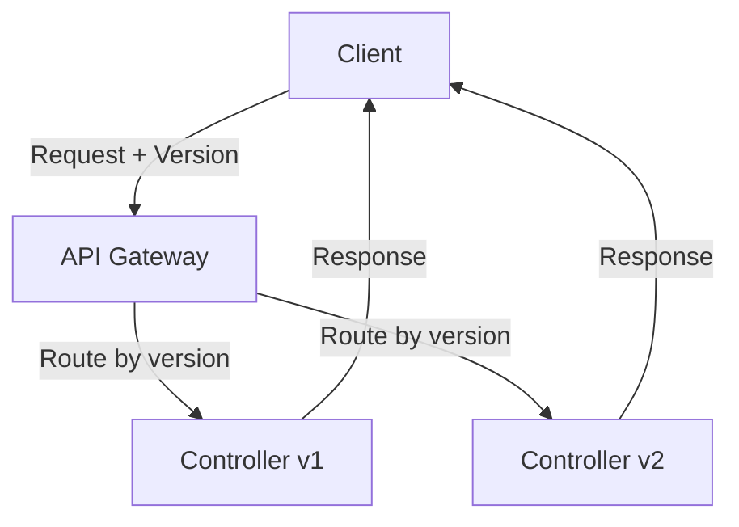
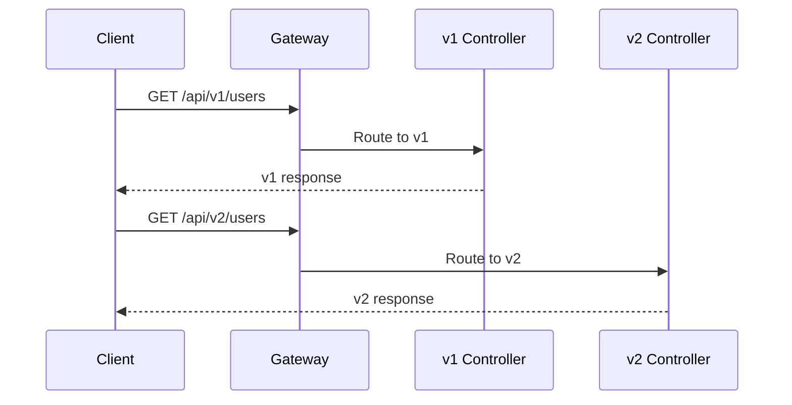

# 5. API Versioning

## 1. Introduction
API versioning allows multiple versions of an API to coexist, enabling backward compatibility while introducing new features. Common strategies include URI, header, and media type versioning.

## 2. Learning Objectives
- Understand API versioning strategies
- Implement URI-based versioning
- Implement header-based versioning
- Handle version-specific logic
- Manage API deprecation

## 3. Prerequisites
- Understanding of REST APIs
- Knowledge of Spring MVC
- Familiarity with HTTP headers

## 4. Why This Concept Exists
Versioning enables:
- Backward compatibility
- Gradual migration
- Multiple client support
- Feature introduction without breaking changes

## 5. Problem Statement
Without versioning:
- Breaking changes affect all clients
- No way to deprecate old endpoints
- Difficult to introduce new features
- Client migration is forced

## 6. Theory
Versioning strategies:
1. **URI Versioning**: `/api/v1/users`
2. **Header Versioning**: `X-API-Version: 1`
3. **Media Type Versioning**: `Accept: application/vnd.api.v1+json`
4. **Query Parameter**: `/api/users?version=1`

## 7. Internal Working
Spring handles versioning through:
- RequestMapping with version in path
- Custom headers for version detection
- Content negotiation for media type
- Conditional bean loading

## 8. JVM Perspective
- Request mapping is version-aware
- Different controllers per version
- Conditional bean creation
- Request attributes for version info

## 9. Memory Representation
```java
// URI versioning
@RestController
@RequestMapping("/api/v1/users")
public class UserV1Controller { }

@RestController
@RequestMapping("/api/v2/users")
public class UserV2Controller { }

// Header versioning
@RestController
@RequestMapping("/api/users")
public class UserController {
    @GetMapping(headers = "X-API-Version=1")
    public UserV1 getV1() { }
    
    @GetMapping(headers = "X-API-Version=2")
    public UserV2 getV2() { }
}
```

## 10. Architecture Diagram


## 11. Flow Diagram


## 12. Syntax
```java
// URI versioning
@RestController
@RequestMapping("/api/v1/users")
public class UserV1Controller { }

// Header versioning
@GetMapping(headers = "X-API-Version=1")
public UserV1 getV1() { }

// Media type versioning
@GetMapping(produces = "application/vnd.myapp.v1+json")
public UserV1 getV1() { }
```

## 13. Easy Example
```java
@RestController
@RequestMapping("/api/v1/users")
public class UserV1Controller {
    
    @GetMapping
    public List<UserV1> getUsers() {
        return List.of(new UserV1(1L, "John"));
    }
}

@RestController
@RequestMapping("/api/v2/users")
public class UserV2Controller {
    
    @GetMapping
    public List<UserV2> getUsers() {
        return List.of(new UserV2(1L, "John", "john@example.com"));
    }
}
```

## 14. Medium Example
```java
@RestController
@RequestMapping("/api/users")
public class UserVersionController {
    
    @GetMapping(headers = "X-API-Version=1")
    public ResponseEntity<List<UserV1>> getUsersV1() {
        List<UserV1> users = userService.findAllV1();
        return ResponseEntity.ok()
            .header("X-API-Version", "1")
            .body(users);
    }
    
    @GetMapping(headers = "X-API-Version=2")
    public ResponseEntity<List<UserV2>> getUsersV2() {
        List<UserV2> users = userService.findAllV2();
        return ResponseEntity.ok()
            .header("X-API-Version", "2")
            .body(users);
    }
    
    @GetMapping(produces = "application/vnd.myapp.v1+json")
    public List<UserV1> getUsersV1Media() {
        return userService.findAllV1();
    }
    
    @GetMapping(produces = "application/vnd.myapp.v2+json")
    public List<UserV2> getUsersV2Media() {
        return userService.findAllV2();
    }
}
```

## 15. Hard Example
```java
@Component
public class ApiVersionResolver {
    
    public int resolve(HttpServletRequest request) {
        // Check header first
        String headerVersion = request.getHeader("X-API-Version");
        if (headerVersion != null) {
            return Integer.parseInt(headerVersion);
        }
        
        // Check URI
        String uri = request.getRequestURI();
        if (uri.contains("/v1/")) return 1;
        if (uri.contains("/v2/")) return 2;
        
        // Check accept header
        String accept = request.getHeader("Accept");
        if (accept != null) {
            if (accept.contains("v1")) return 1;
            if (accept.contains("v2")) return 2;
        }
        
        // Default to latest
        return 2;
    }
}

@RestController
@RequestMapping("/api/users")
public class UnifiedUserController {
    
    @Autowired
    private ApiVersionResolver versionResolver;
    
    @GetMapping
    public ResponseEntity<?> getUsers(HttpServletRequest request) {
        int version = versionResolver.resolve(request);
        
        if (version == 1) {
            return ResponseEntity.ok()
                .header("X-API-Version", "1")
                .body(userService.findAllV1());
        } else {
            return ResponseEntity.ok()
                .header("X-API-Version", "2")
                .body(userService.findAllV2());
        }
    }
}
```

## 16. Enterprise Example
```java
@Configuration
public class ApiVersionConfig {
    
    @Bean
    public RequestMappingHandlerMapping requestMappingHandlerMapping() {
        RequestMappingHandlerMapping mapping = new RequestMappingHandlerMapping();
        mapping.setUseSuffixPatternMatch(false);
        return mapping;
    }
}

@RestController
@RequestMapping("/api/{version}/users")
public class VersionedUserController {
    
    @GetMapping
    public ResponseEntity<?> getUsers(
            @PathVariable String version,
            @RequestParam(required = false) String email) {
        
        return switch (version) {
            case "v1" -> ResponseEntity.ok(userService.findAllV1(email));
            case "v2" -> ResponseEntity.ok(userService.findAllV2(email));
            default -> ResponseEntity.badRequest()
                .body(Map.of("error", "Unsupported version"));
        };
    }
}

@Service
public class UserMapper {
    
    public Object toResponse(Object user, String version) {
        if ("v1".equals(version)) {
            return toV1(user);
        } else if ("v2".equals(version)) {
            return toV2(user);
        }
        throw new IllegalArgumentException("Unsupported version: " + version);
    }
}
```

## 17. Performance
- Version routing adds ~1ms overhead
- Multiple controller classes increase memory
- Version detection should be cached
- Response mapping is O(n)

## 18. Time & Space Complexity
- **Version Detection**: O(1)
- **Request Routing**: O(1)
- **Response Mapping**: O(n)
- **Space**: O(v) where v is number of versions

## 19. Thread Safety
- Version resolvers are stateless
- Controllers are singletons
- Version-specific beans are thread-safe
- Request attributes are thread-safe

## 20. Best Practices
1. Use URI versioning for simplicity
2. Support multiple versions simultaneously
3. Deprecate old versions gracefully
4. Document version differences
5. Use semantic versioning
6. Provide migration guides
7. Monitor version usage

## 21. Common Mistakes
1. Not planning for versioning early
2. Breaking changes without new version
3. Supporting too many versions
4. Not documenting changes
5. Forcing client migration

## 22. Pitfalls
- Version sprawl
- Inconsistent versioning across APIs
- Breaking changes in minor versions
- Client compatibility issues

## 23. Debugging Tips
1. Log version information
2. Monitor version usage
3. Test all versions
4. Check header propagation
5. Verify version routing

## 24. Comparison Table
| Strategy | Pros | Cons |
|----------|------|------|
| URI | Simple, visible | URL pollution |
| Header | Clean URLs | Hidden complexity |
| Media Type | Standards-based | Complex |
| Query Parameter | Easy to implement | Less RESTful |

## 25. Decision Tree
```
Need Versioning?
├── Yes → Strategy?
│   ├── Simple → URI
│   ├── Clean URLs → Header
│   └── Standards → Media Type
└── No → Single version
```

## 26. Interview Questions
1. What are API versioning strategies?
2. When should you version an API?
3. How do you handle deprecation?
4. What is URI vs header versioning?
5. How do you support multiple versions?
6. What is semantic versioning?
7. How do you handle breaking changes?
8. What are best practices for versioning?
9. How do you monitor version usage?
10. How do you test versioned APIs?
11. What is the role of API gateway in versioning?
12. How do you handle client migration?
13. What is backward compatibility?
14. How do you document version changes?
15. What is the difference between versioning and evolving APIs?

## 27. Exercises
### Beginner
1. Implement URI-based versioning
2. Create version-specific controllers
3. Add version headers to responses

### Intermediate
1. Implement header-based versioning
2. Create version resolver
3. Add version validation

### Advanced
1. Implement media type versioning
2. Create version migration utilities
3. Add version analytics

## 28. Summary
API versioning enables backward compatibility and gradual migration. Choosing the right strategy depends on API complexity, client requirements, and organizational standards. Proper planning and documentation are essential for successful versioning.

## 29. References
- [API Versioning Strategies](https://restfulapi.net/versioning/)
- [Spring MVC Request Mapping](https://docs.spring.io/spring-framework/reference/web/webmvc/mvc-controller.html)
