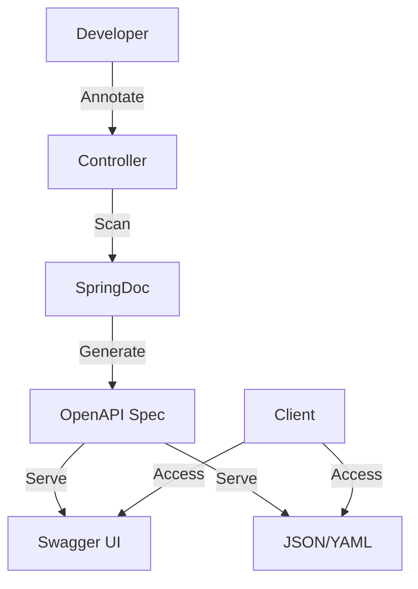
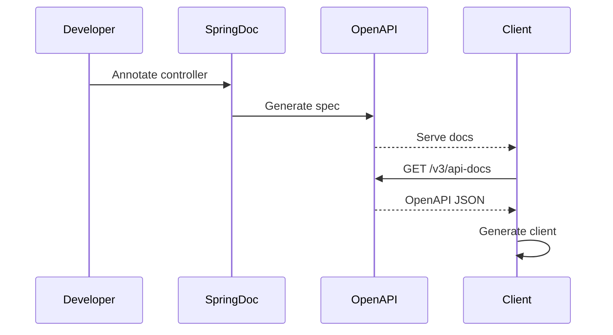

# 6. Swagger / OpenAPI

## 1. Introduction
OpenAPI Specification (formerly Swagger) is a standard for documenting REST APIs. SpringDoc provides automatic documentation generation for Spring Boot applications using OpenAPI 3.0.

## 2. Learning Objectives
- Configure SpringDoc for API documentation
- Annotate controllers for documentation
- Generate interactive API docs
- Understand OpenAPI 3.0 specification
- Implement API documentation best practices

## 3. Prerequisites
- Understanding of REST APIs
- Knowledge of Spring Boot
- Familiarity with JSON/YAML

## 4. Why This Concept Exists
API documentation is essential for:
- Client integration
- API discovery
- Testing and validation
- Team collaboration

## 5. Problem Statement
Without proper documentation:
- Clients struggle to integrate
- API usage is unclear
- Testing is difficult
- Onboarding is slow

## 6. Theory
OpenAPI 3.0 defines:
- **Paths**: API endpoints
- **Components**: Reusable schemas
- **Security**: Authentication schemes
- **Tags**: Grouping operations

SpringDoc provides:
- Auto-generation from annotations
- Swagger UI for interactive docs
- OpenAPI JSON/YAML endpoints

## 7. Internal Working
1. SpringDoc scans controllers at startup
2. Extracts annotations and method signatures
3. Generates OpenAPI specification
4. Serves Swagger UI and JSON endpoints
5. Updates dynamically with code changes

## 8. JVM Perspective
- Runtime scanning of controller classes
- Reflection for annotation processing
- Caching of generated documentation
- Dynamic updates via actuator

## 9. Memory Representation
```yaml
openapi: 3.0.0
paths:
  /api/users:
    get:
      summary: Get all users
      responses:
        '200':
          description: Success
          content:
            application/json:
              schema:
                type: array
                items:
                  $ref: '#/components/schemas/User'
```

## 10. Architecture Diagram


## 11. Flow Diagram


## 12. Syntax
```java
@Operation(summary = "Get user by ID")
@ApiResponse(responseCode = "200", description = "User found")
@GetMapping("/{id}")
public ResponseEntity<UserDTO> getUser(@PathVariable Long id) {
    return ResponseEntity.ok(userService.findById(id));
}
```

## 13. Easy Example
```java
@RestController
@RequestMapping("/api/users")
@Tag(name = "Users", description = "User management APIs")
public class UserController {
    
    @GetMapping
    @Operation(summary = "Get all users")
    public List<UserDTO> getUsers() {
        return userService.findAll();
    }
    
    @GetMapping("/{id}")
    @Operation(summary = "Get user by ID")
    public UserDTO getUser(@PathVariable Long id) {
        return userService.findById(id);
    }
}
```

## 14. Medium Example
```java
@RestController
@RequestMapping("/api/users")
@Tag(name = "Users", description = "User management APIs")
public class UserController {
    
    @GetMapping
    @Operation(summary = "Get users", description = "Get paginated list of users")
    @ApiResponse(responseCode = "200", description = "Success")
    public ResponseEntity<Page<UserDTO>> getUsers(
            @RequestParam(defaultValue = "0") int page,
            @RequestParam(defaultValue = "10") int size) {
        return ResponseEntity.ok(userService.findAll(PageRequest.of(page, size)));
    }
    
    @PostMapping
    @Operation(summary = "Create user")
    @ApiResponse(responseCode = "201", description = "User created")
    @ApiResponse(responseCode = "400", description = "Invalid input")
    public ResponseEntity<UserDTO> createUser(
            @RequestBody @Valid CreateUserRequest request) {
        UserDTO created = userService.create(request);
        return ResponseEntity.status(HttpStatus.CREATED).body(created);
    }
}
```

## 15. Hard Example
```java
@RestController
@RequestMapping("/api/v1/users")
@Tag(name = "Users", description = "User management APIs")
@SecurityScheme(
    name = "bearerAuth",
    type = SecuritySchemeType.HTTP,
    scheme = "bearer",
    bearerFormat = "JWT"
)
public class UserController {
    
    @GetMapping("/{id}")
    @Operation(
        summary = "Get user by ID",
        description = "Retrieves a user by their unique identifier",
        security = @SecurityRequirement(name = "bearerAuth")
    )
    @ApiResponses({
        @ApiResponse(responseCode = "200", description = "User found",
            content = @Content(schema = @Schema(implementation = UserDTO.class))),
        @ApiResponse(responseCode = "404", description = "User not found",
            content = @Content(schema = @Schema(implementation = ErrorResponse.class)))
    })
    public ResponseEntity<UserDTO> getUser(
            @Parameter(description = "User ID") @PathVariable Long id) {
        return ResponseEntity.ok(userService.findById(id));
    }
    
    @PostMapping
    @Operation(summary = "Create user")
    @io.swagger.v3.oas.annotations.parameters.RequestBody(
        description = "User to create",
        required = true
    )
    public ResponseEntity<UserDTO> createUser(
            @RequestBody @Valid @Schema(implementation = CreateUserRequest.class)
            CreateUserRequest request) {
        UserDTO created = userService.create(request);
        return ResponseEntity.status(HttpStatus.CREATED).body(created);
    }
}
```

## 16. Enterprise Example
```java
@Configuration
@OpenAPIDefinition(
    info = @Info(
        title = "User Service API",
        version = "1.0.0",
        description = "Enterprise User Management API",
        contact = @Contact(name = "API Support", email = "support@example.com")
    ),
    servers = {
        @Server(url = "https://api.example.com", description = "Production"),
        @Server(url = "https://staging-api.example.com", description = "Staging")
    }
)
public class OpenApiConfig {
    
    @Bean
    public OpenAPI customOpenAPI() {
        return new OpenAPI()
            .components(new Components()
                .addSecuritySchemes("bearerAuth",
                    new SecurityScheme()
                        .type(SecurityScheme.Type.HTTP)
                        .scheme("bearer")
                        .bearerFormat("JWT")))
            .addSecurityItem(new SecurityRequirement().addList("bearerAuth"));
    }
}

@RestController
@RequestMapping("/api/v1/users")
@Tag(name = "Users", description = "User management")
@Slf4j
public class UserController {
    
    @GetMapping("/{id}")
    @Operation(summary = "Get user by ID")
    public ResponseEntity<ApiResponse<UserDTO>> getUser(
            @PathVariable Long id) {
        
        log.info("Fetching user: {}", id);
        
        UserDTO user = userService.findById(id);
        return ResponseEntity.ok(ApiResponse.success(user));
    }
}
```

## 17. Performance
- Documentation generation: ~100-500ms at startup
- Runtime overhead: negligible
- Swagger UI load time: ~1-2s
- JSON spec size: depends on API complexity

## 18. Time & Space Complexity
- **Generation**: O(n) where n is endpoints
- **Access**: O(1)
- **Space**: O(n) for cached docs

## 19. Thread Safety
- Documentation is generated once
- Swagger UI is served statically
- OpenAPI spec is cached
- Thread-safe for concurrent access

## 20. Best Practices
1. Document all endpoints
2. Use meaningful descriptions
3. Define request/response schemas
4. Add examples
5. Document error responses
6. Use tags for grouping
7. Version your API docs

## 21. Common Mistakes
1. Missing documentation
2. Incomplete descriptions
3. No error response documentation
4. Missing examples
5. Outdated documentation

## 22. Pitfalls
- Documentation drift from code
- Over-documentation
- Security exposure in docs
- Performance impact at startup

## 23. Debugging Tips
1. Check /v3/api-docs endpoint
2. Verify Swagger UI accessibility
3. Validate OpenAPI spec
4. Check annotation processing
5. Monitor generation time

## 24. Comparison Table
| Feature | SpringDoc | Swagger | RAML |
|---------|-----------|---------|------|
| Auto-generation | Yes | Yes | No |
| UI | Yes | Yes | Yes |
| OpenAPI | 3.0 | 2.0 | N/A |
| Spring Boot | Native | Plugin | Plugin |

## 25. Decision Tree
```
Need API Docs?
├── Yes → Type?
│   ├── Auto-generate → SpringDoc
│   ├── Manual → Swagger Editor
│   └── Design-first → OpenAPI Designer
└── No → Internal API only
```

## 26. Interview Questions
1. What is OpenAPI Specification?
2. How does SpringDoc generate documentation?
3. What are the benefits of API documentation?
4. How do you document security schemes?
5. What is Swagger UI?
6. How do you version API documentation?
7. What are best practices for API docs?
8. How do you test API documentation?
9. What is the difference between OpenAPI and Swagger?
10. How do you handle undocumented endpoints?
11. What is API-first development?
12. How do you generate clients from docs?
13. What are custom annotations for docs?
14. How do you document file uploads?
15. What is the role of API gateway in documentation?

## 27. Exercises
### Beginner
1. Add SpringDoc to a project
2. Document basic CRUD endpoints
3. Access Swagger UI

### Intermediate
1. Add request/response schemas
2. Document error responses
3. Implement security documentation

### Advanced
1. Create custom annotations
2. Implement API-first development
3. Generate client SDKs

## 28. Summary
API documentation is essential for API adoption and maintenance. SpringDoc provides seamless integration with Spring Boot, generating comprehensive documentation from annotations. Good documentation improves developer experience and reduces integration time.

## 29. References
- [SpringDoc Documentation](https://springdoc.org/)
- [OpenAPI 3.0 Specification](https://swagger.io/specification/)
