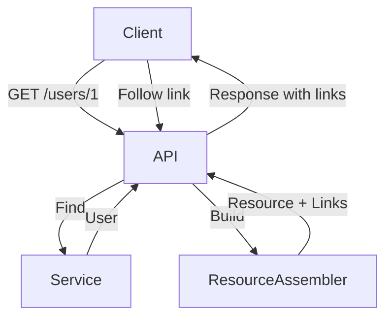
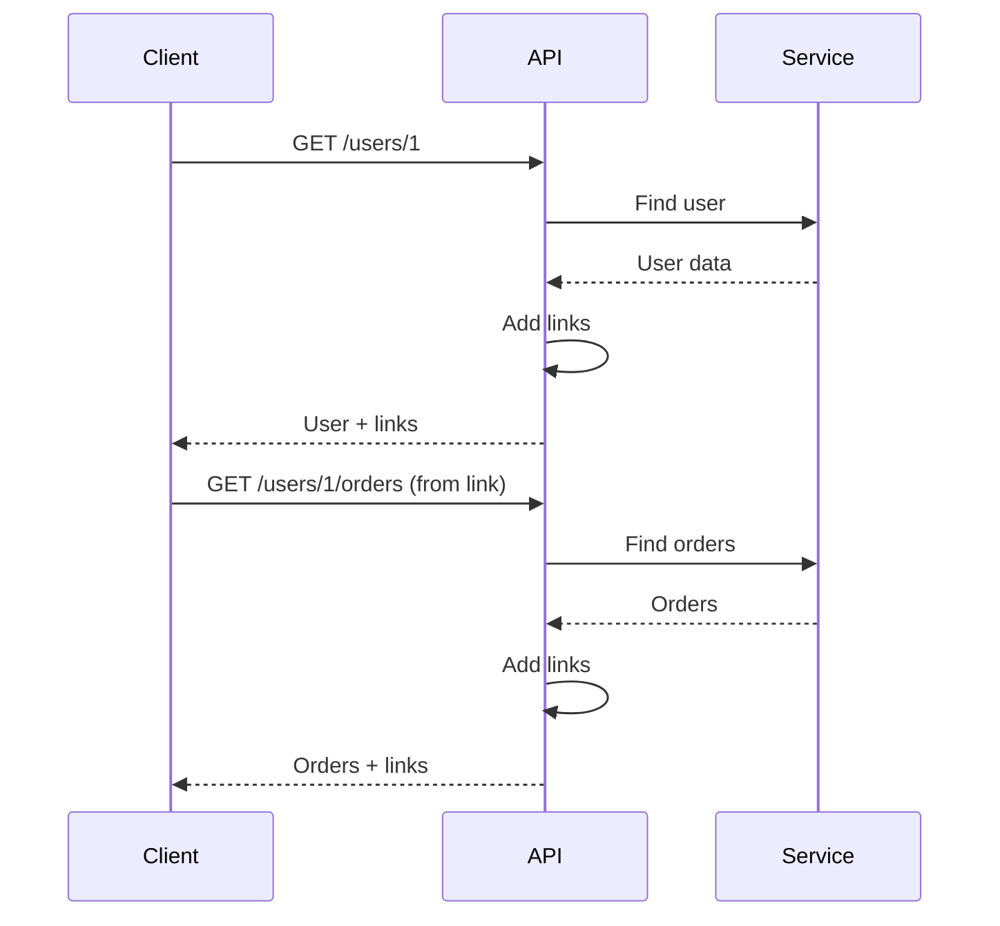

# 7. HATEOAS

## 1. Introduction
HATEOAS (Hypermedia as the Engine of Application State) is a constraint of REST that adds hypermedia links to responses, enabling clients to navigate the API dynamically without hardcoding URLs.

## 2. Learning Objectives
- Understand HATEOAS principles
- Implement hypermedia links in Spring
- Create resource assemblers
- Design discoverable APIs
- Understand Richardson Maturity Model

## 3. Prerequisites
- Understanding of REST fundamentals
- Knowledge of Spring HATEOAS
- Familiarity with hypermedia concepts

## 4. Why This Concept Exists
HATEOAS makes APIs:
- Self-documenting
- Discoverable
- Evolvable
- Client-independent

## 5. Problem Statement
Without hypermedia:
- Clients hardcode URLs
- API changes break clients
- No discoverability
- Tight coupling

## 6. Theory
Richardson Maturity Model:
- **Level 0**: Single URI, single method
- **Level 1**: Multiple URIs, single method
- **Level 2**: HTTP verbs, status codes
- **Level 3**: HATEOAS (hypermedia)

HATEOAS adds links to responses:
```json
{
  "id": 1,
  "name": "John",
  "_links": {
    "self": {"href": "/users/1"},
    "orders": {"href": "/users/1/orders"}
  }
}
```

## 7. Internal Working
1. Controller builds response with links
2. Resource assembler adds hypermedia
3. Links are serialized in response
4. Client follows links for navigation

## 8. JVM Perspective
- Link objects are created per request
- Resource assemblers transform entities
- Serialization includes links
- Links are part of HAL format

## 9. Memory Representation
```java
// Entity
public class User {
    private Long id;
    private String name;
}

// Resource with links
public class UserResource extends RepresentationModel<UserResource> {
    private User user;
}

// Adding links
userResource.add(Link.of("/users/1", "self"));
userResource.add(Link.of("/users/1/orders", "orders"));
```

## 10. Architecture Diagram


## 11. Flow Diagram


## 12. Syntax
```java
@RestController
@RequestMapping("/api/users")
public class UserController {
    
    @GetMapping("/{id}")
    public EntityModel<User> getUser(@PathVariable Long id) {
        User user = userService.findById(id);
        
        EntityModel<User> resource = EntityModel.of(user);
        resource.add(Link.of("/api/users/" + id, "self"));
        resource.add(Link.of("/api/users/" + id + "/orders", "orders"));
        
        return resource;
    }
}
```

## 13. Easy Example
```java
@RestController
@RequestMapping("/api/users")
public class UserController {
    
    @GetMapping("/{id}")
    public RepresentationModel<UserResource> getUser(@PathVariable Long id) {
        User user = userService.findById(id);
        
        UserResource resource = new UserResource(user);
        resource.add(Link.of("/api/users/" + id, "self"));
        
        return resource;
    }
}

public class UserResource extends RepresentationModel<UserResource> {
    private Long id;
    private String name;
    
    public UserResource(User user) {
        this.id = user.getId();
        this.name = user.getName();
    }
}
```

## 14. Medium Example
```java
@RestController
@RequestMapping("/api/users")
public class UserController {
    
    @GetMapping("/{id}")
    public EntityModel<UserDTO> getUser(@PathVariable Long id) {
        UserDTO user = userService.findById(id);
        
        EntityModel<UserDTO> resource = EntityModel.of(user);
        
        resource.add(linkTo(methodOn(UserController.class).getUser(id))
            .withSelfRel());
        resource.add(linkTo(methodOn(UserController.class).getUsers())
            .withRel("users"));
        resource.add(linkTo(methodOn(OrderController.class)
            .getUserOrders(id)).withRel("orders"));
        
        return resource;
    }
    
    @GetMapping
    public CollectionModel<EntityModel<UserDTO>> getUsers() {
        List<EntityModel<UserDTO>> users = userService.findAll().stream()
            .map(user -> {
                EntityModel<UserDTO> resource = EntityModel.of(user);
                resource.add(linkTo(methodOn(UserController.class)
                    .getUser(user.getId())).withSelfRel());
                return resource;
            })
            .toList();
        
        return CollectionModel.of(users,
            linkTo(methodOn(UserController.class).getUsers()).withSelfRel());
    }
}
```

## 15. Hard Example
```java
@Component
public class UserResourceAssembler implements RepresentationModelAssembler<User, EntityModel<UserDTO>> {
    
    @Override
    public EntityModel<UserDTO> toModel(User user) {
        UserDTO dto = UserDTO.fromEntity(user);
        
        EntityModel<UserDTO> resource = EntityModel.of(dto);
        
        // Self link
        resource.add(linkTo(methodOn(UserController.class)
            .getUser(user.getId())).withSelfRel());
        
        // Collection link
        resource.add(linkTo(methodOn(UserController.class)
            .getUsers()).withRel("users"));
        
        // Related resources
        resource.add(linkTo(methodOn(OrderController.class)
            .getUserOrders(user.getId())).withRel("orders"));
        
        resource.add(linkTo(methodOn(AddressController.class)
            .getUserAddresses(user.getId())).withRel("addresses"));
        
        // Conditional links
        if (user.isEnabled()) {
            resource.add(linkTo(methodOn(UserController.class)
                .deactivateUser(user.getId())).withRel("deactivate"));
        } else {
            resource.add(linkTo(methodOn(UserController.class)
                .activateUser(user.getId())).withRel("activate"));
        }
        
        return resource;
    }
}

@RestController
@RequestMapping("/api/users")
public class UserController {
    
    @Autowired
    private UserResourceAssembler assembler;
    
    @GetMapping("/{id}")
    public EntityModel<UserDTO> getUser(@PathVariable Long id) {
        User user = userService.findById(id);
        return assembler.toModel(user);
    }
}
```

## 16. Enterprise Example
```java
@Component
public class OrderResourceAssembler 
        implements RepresentationModelAssembler<Order, EntityModel<OrderDTO>> {
    
    @Override
    public EntityModel<OrderDTO> toModel(Order order) {
        OrderDTO dto = OrderDTO.fromEntity(order);
        
        EntityModel<OrderDTO> resource = EntityModel.of(dto);
        
        // Self link
        resource.add(linkTo(methodOn(OrderController.class)
            .getOrder(order.getId())).withSelfRel());
        
        // User link
        resource.add(linkTo(methodOn(UserController.class)
            .getUser(order.getUserId())).withRel("customer"));
        
        // State transitions
        switch (order.getStatus()) {
            case PENDING:
                resource.add(linkTo(methodOn(OrderController.class)
                    .confirmOrder(order.getId())).withRel("confirm"));
                resource.add(linkTo(methodOn(OrderController.class)
                    .cancelOrder(order.getId())).withRel("cancel"));
                break;
            case CONFIRMED:
                resource.add(linkTo(methodOn(OrderController.class)
                    .shipOrder(order.getId())).withRel("ship"));
                break;
            case SHIPPED:
                resource.add(linkTo(methodOn(OrderController.class)
                    .deliverOrder(order.getId())).withRel("deliver"));
                break;
        }
        
        // Payment link
        if (order.getPaymentId() == null) {
            resource.add(linkTo(methodOn(PaymentController.class)
                .createPayment(order.getId())).withRel("pay"));
        }
        
        return resource;
    }
}

@RestController
@RequestMapping("/api/orders")
public class OrderController {
    
    @GetMapping("/{id}")
    public EntityModel<OrderDTO> getOrder(@PathVariable Long id) {
        Order order = orderService.findById(id);
        return assembler.toModel(order);
    }
    
    @PostMapping("/{id}/confirm")
    public EntityModel<OrderDTO> confirmOrder(@PathVariable Long id) {
        Order order = orderService.confirm(id);
        return assembler.toModel(order);
    }
}
```

## 17. Performance
- Link generation: ~1-5ms per resource
- Memory overhead: ~10-20% per response
- Serialization overhead: minimal
- Network overhead: larger responses

## 18. Time & Space Complexity
- **Link Generation**: O(l) where l is number of links
- **Resource Assembly**: O(n) where n is entity size
- **Space**: O(l) for links per resource

## 19. Thread Safety
- Resource assemblers are stateless
- Link objects are immutable
- EntityModels are thread-safe
- Controllers are singletons

## 20. Best Practices
1. Always include self link
2. Use meaningful link relations
3. Document link relations
4. Keep links consistent
5. Use URI templates for parameters
6. Implement conditional links
7. Version your links

## 21. Common Mistakes
1. Missing self links
2. Inconsistent link relations
3. Hardcoding URLs
4. Not documenting links
5. Over-complicating link structure

## 22. Pitfalls
- Link explosion (too many links)
- Breaking link changes
- Circular references
- Performance impact

## 23. Debugging Tips
1. Check HAL format output
2. Verify link relations
3. Test link navigation
4. Validate URI templates
5. Monitor response size

## 24. Comparison Table
| Feature | HATEOAS | REST | GraphQL |
|---------|---------|------|---------|
| Discoverability | High | Low | Medium |
| Client coupling | Low | High | Medium |
| Response size | Larger | Smaller | Variable |
| Complexity | High | Low | Medium |

## 25. Decision Tree
```
Need HATEOAS?
├── Yes → Complexity?
│   ├── Simple → Basic links
│   └── Complex → Resource assemblers
└── No → Simple API
```

## 26. Interview Questions
1. What is HATEOAS?
2. What is Richardson Maturity Model?
3. How do you implement HATEOAS in Spring?
4. What are link relations?
5. What is HAL format?
6. What are the benefits of HATEOAS?
7. What are the drawbacks?
8. How do you version hypermedia APIs?
9. What are best practices?
10. How do you test HATEOAS APIs?
11. What is the difference between HATEOAS and REST?
12. How do you handle link evolution?
13. What are URI templates?
14. How do you document hypermedia APIs?
15. What is the role of API gateway?

## 27. Exercises
### Beginner
1. Add self links to responses
2. Create basic resource model
3. Implement collection links

### Intermediate
1. Create resource assembler
2. Add conditional links
3. Implement link relations

### Advanced
1. Create HATEOAS client
2. Implement link versioning
3. Add link caching

## 28. Summary
HATEOAS makes APIs discoverable and evolvable by adding hypermedia links. While it adds complexity, it provides significant benefits for API maintainability and client independence. Spring HATEOAS provides convenient tools for implementation.

## 29. References
- [Spring HATEOAS](https://spring.io/projects/spring-hateoas)
- [REST Maturity Model](https://martinfowler.com/articles/richardsonMaturityModel.html)
- [HAL Specification](https://tools.ietf.org/html/draft-kelly-json-hal-08)
